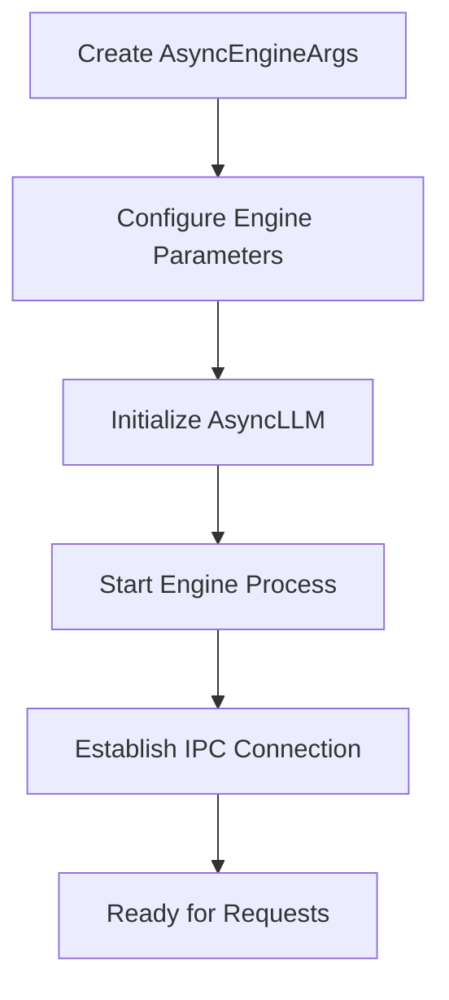
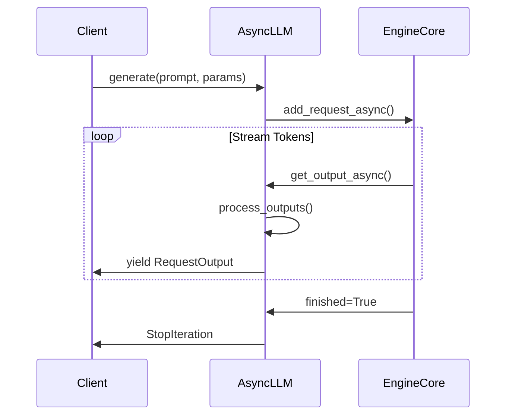
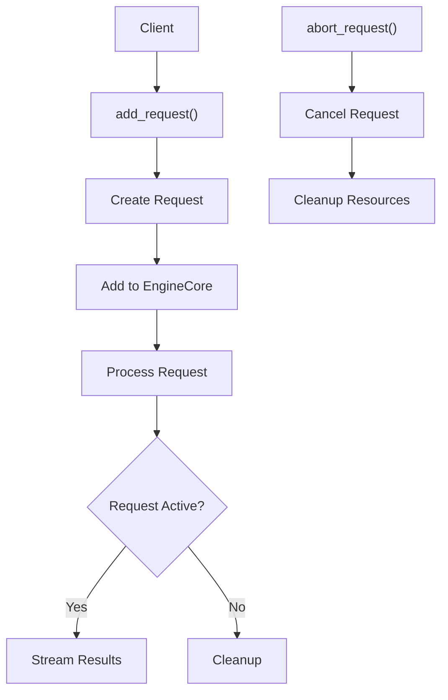
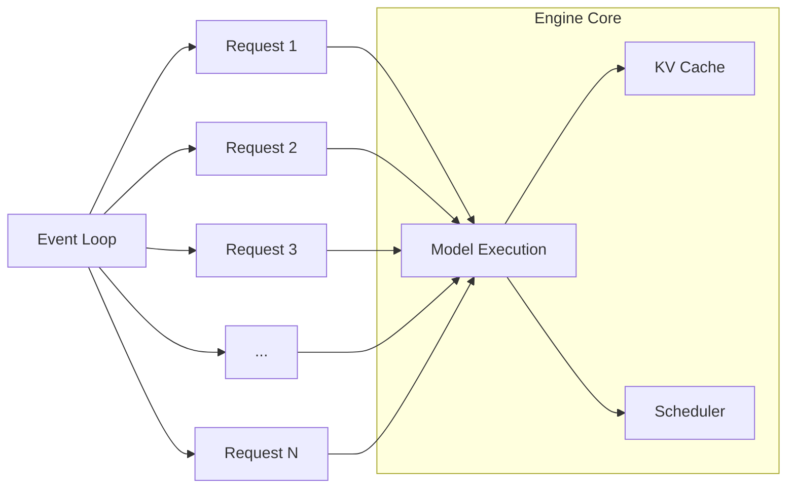
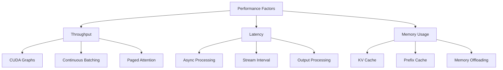
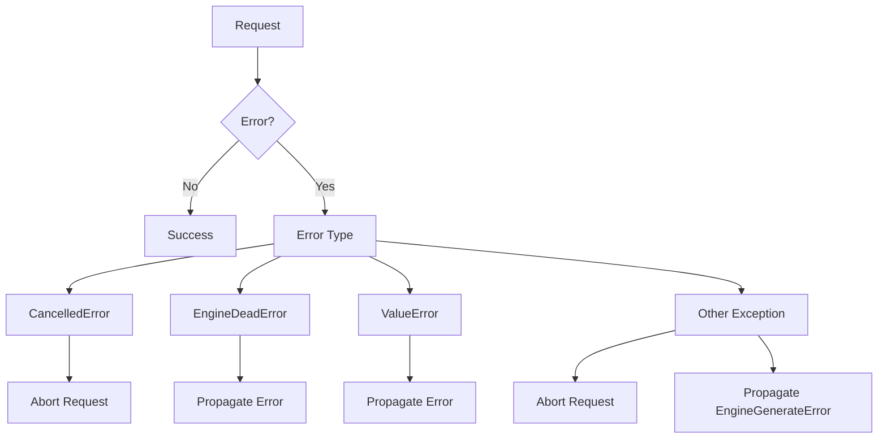

# AsyncLLMEngine

<cite>
**Referenced Files in This Document**   
- [async_llm.py](file://vllm/v1/engine/async_llm.py)
- [async_llm_engine.py](file://vllm/engine/async_llm_engine.py)
- [arg_utils.py](file://vllm/engine/arg_utils.py)
- [async_llm.py](file://vllm/v1/engine/async_llm.py)
- [async_llm_engine.py](file://vllm/engine/async_llm_engine.py)
- [async_llm_streaming.py](file://examples/offline_inference/async_llm_streaming.py)
</cite>

## Table of Contents
1. [Introduction](#introduction)
2. [Initialization and Configuration](#initialization-and-configuration)
3. [Streaming with Async Generator](#streaming-with-async-generator)
4. [Request Management](#request-management)
5. [Concurrent Request Handling](#concurrent-request-handling)
6. [Performance Considerations](#performance-considerations)
7. [Error Handling and Recovery](#error-handling-and-recovery)
8. [Best Practices](#best-practices)

## Introduction

AsyncLLMEngine is the core asynchronous interface for advanced vLLM integration, designed to provide high-performance, scalable language model inference with full async/await support. It enables efficient handling of concurrent requests, streaming responses, and fine-grained control over the inference process. The engine is built on a multi-process architecture that separates the engine core from the client interface, allowing for optimal resource utilization and scalability.

The AsyncLLMEngine provides a comprehensive API for managing LLM inference tasks, with support for various sampling strategies, LoRA adapters, and multimodal inputs. It is particularly well-suited for applications requiring real-time, low-latency responses such as chatbots, code generation tools, and interactive AI assistants.

**Section sources**
- [async_llm.py](file://vllm/v1/engine/async_llm.py#L54-L800)
- [async_llm_engine.py](file://vllm/engine/async_llm_engine.py#L1-L7)

## Initialization and Configuration

The AsyncLLMEngine is initialized using the `AsyncEngineArgs` class, which provides a comprehensive set of configuration options for the engine. The initialization process creates a separate engine process that handles the actual model execution, while the client interface runs in the main process.

**Diagram sources**
- [async_llm.py](file://vllm/v1/engine/async_llm.py#L54-L235)
- [arg_utils.py](file://vllm/engine/arg_utils.py#L2026-L2055)

The engine supports various configuration options including model selection, tokenizer settings, distributed execution parameters, and memory management settings. The `from_engine_args()` class method provides a convenient way to create an AsyncLLM instance from the engine arguments.

Key initialization parameters include:
- **model**: The Hugging Face model identifier or local path
- **enforce_eager**: Whether to disable CUDA graph capture for faster startup
- **tensor_parallel_size**: Number of GPUs to use for tensor parallelism
- **dtype**: Data type for model weights (auto, half, float16, bfloat16, float32)
- **max_model_len**: Maximum sequence length supported by the model
- **gpu_memory_utilization**: Fraction of GPU memory to allocate for the model

The engine also supports advanced configuration through the `VllmConfig` object, which allows for fine-tuned control over various aspects of the inference process.

**Section sources**
- [async_llm.py](file://vllm/v1/engine/async_llm.py#L238-L260)
- [arg_utils.py](file://vllm/engine/arg_utils.py#L221-L463)

## Streaming with Async Generator

The AsyncLLMEngine provides robust streaming capabilities through its `generate()` method, which returns an async generator that yields partial results as they become available. This enables real-time processing of LLM outputs, allowing applications to display responses incrementally rather than waiting for the complete response.

**Diagram sources**
- [async_llm.py](file://vllm/v1/engine/async_llm.py#L368-L479)
- [output_processor.py](file://vllm/v1/engine/output_processor.py#L33-L76)

The streaming process works as follows:
1. The client calls the `generate()` method with a prompt and sampling parameters
2. The engine creates a request and adds it to the processing queue
3. As tokens are generated by the model, they are collected and processed
4. Partial results are yielded through the async generator
5. The stream continues until generation is complete or cancelled

The engine supports different output kinds through the `RequestOutputKind` enum:
- **DELTA**: Returns only new tokens generated since the last iteration
- **CUMULATIVE**: Returns the complete generated text in each iteration

This streaming capability is particularly useful for applications that need to display responses in real-time, such as chat interfaces or code completion tools.

**Section sources**
- [async_llm.py](file://vllm/v1/engine/async_llm.py#L368-L479)
- [async_llm_streaming.py](file://examples/offline_inference/async_llm_streaming.py#L22-L63)

## Request Management

The AsyncLLMEngine provides fine-grained control over request lifecycle through the `add_request()` and `abort_request()` methods. These methods allow for precise management of inference requests, enabling features like request cancellation, timeout handling, and priority-based scheduling.

**Diagram sources**
- [async_llm.py](file://vllm/v1/engine/async_llm.py#L280-L345)
- [async_llm.py](file://vllm/v1/engine/async_llm.py#L551-L562)

The `add_request()` method accepts several parameters:
- **request_id**: Unique identifier for the request
- **prompt**: Input text or token IDs
- **params**: Sampling parameters controlling generation behavior
- **arrival_time**: Timestamp for request arrival (used for scheduling)
- **lora_request**: Optional LoRA adapter configuration
- **tokenization_kwargs**: Additional tokenization options
- **trace_headers**: Distributed tracing information
- **priority**: Request priority for scheduling

The `abort_request()` method allows for cancellation of ongoing requests, which is useful for implementing timeout functionality or responding to user cancellation. When a request is aborted, all associated resources are cleaned up, and any partial results are discarded.

The engine also supports batched request processing, where multiple requests can be handled concurrently. For requests with `n > 1` (multiple outputs per prompt), the engine automatically manages the fan-out to multiple child requests and recombines the results appropriately.

**Section sources**
- [async_llm.py](file://vllm/v1/engine/async_llm.py#L280-L345)
- [async_llm.py](file://vllm/v1/engine/async_llm.py#L551-L562)

## Concurrent Request Handling

The AsyncLLMEngine is designed to handle multiple concurrent requests efficiently, leveraging asyncio's event loop to manage multiple streams simultaneously. This enables high-throughput scenarios where many clients can receive streaming responses concurrently.

**Diagram sources**
- [async_llm.py](file://vllm/v1/engine/async_llm.py#L480-L549)
- [async_llm.py](file://vllm/v1/engine/async_llm.py#L155-L167)

The engine uses a background task called `output_handler` that continuously pulls outputs from the engine core and distributes them to the appropriate request queues. This design ensures that the event loop remains responsive even under heavy load.

When handling concurrent requests, the engine:
1. Manages multiple async generators simultaneously
2. Efficiently schedules compute resources across requests
3. Maintains separate state for each request
4. Handles request prioritization based on arrival time and priority settings
5. Provides isolation between requests to prevent interference

The engine also supports request pausing and resuming through the `pause_generation()` and `resume_generation()` methods, which can be useful for implementing rate limiting or managing resource usage in multi-tenant environments.

**Section sources**
- [async_llm.py](file://vllm/v1/engine/async_llm.py#L480-L549)
- [async_llm.py](file://vllm/v1/engine/async_llm.py#L563-L608)

## Performance Considerations

The AsyncLLMEngine is optimized for high-throughput scenarios and efficient memory management in long-running applications. Several performance considerations should be taken into account when using the engine in production environments.

For high-throughput scenarios, the engine provides several optimization opportunities:
- **CUDA Graph Capture**: Enabled by default, this feature can significantly improve performance by capturing and reusing computation graphs
- **Paged Attention**: Efficient memory management for variable-length sequences
- **Continuous Batching**: Dynamic batching of requests to maximize GPU utilization
- **KV Cache Sharing**: Efficient reuse of key-value caches for prefix sharing

Memory management is critical for long-running applications. The engine provides several mechanisms to control memory usage:
- **Prefix Cache**: Caches common prefixes to reduce computation for similar requests
- **MM Cache**: Manages multimodal input caching
- **Memory Offloading**: Supports offloading memory to CPU when needed

**Diagram sources**
- [async_llm.py](file://vllm/v1/engine/async_llm.py#L752-L754)
- [async_llm.py](file://vllm/v1/engine/async_llm.py#L748-L751)

To optimize performance, consider the following best practices:
- Use appropriate `stream_interval` values to balance responsiveness and overhead
- Enable CUDA graphs for stable workloads
- Monitor and tune the scheduler configuration based on your workload characteristics
- Use request prioritization for mixed workloads with different latency requirements
- Implement proper connection pooling to minimize engine initialization overhead

**Section sources**
- [async_llm.py](file://vllm/v1/engine/async_llm.py#L748-L767)
- [async_llm.py](file://vllm/v1/engine/async_llm.py#L752-L754)

## Error Handling and Recovery

The AsyncLLMEngine provides comprehensive error handling mechanisms to ensure robust operation in production environments. The engine handles various error conditions gracefully and provides appropriate recovery patterns.

**Diagram sources**
- [async_llm.py](file://vllm/v1/engine/async_llm.py#L452-L479)
- [async_llm.py](file://vllm/v1/engine/async_llm.py#L681-L706)

The engine handles several types of errors:
- **CancelledError**: Occurs when a client disconnects or cancels a request
- **EngineDeadError**: Indicates that the engine process has terminated
- **ValueError**: Validation errors in request parameters
- **EngineGenerateError**: Unexpected errors during generation

When a request is cancelled (e.g., client disconnect), the engine automatically aborts the request and cleans up associated resources. This prevents resource leaks and ensures that the engine remains responsive.

For engine process failures, the `EngineDeadError` is propagated to the client, allowing for appropriate recovery actions such as restarting the engine or failing over to a backup instance.

The engine also provides health checking through the `check_health()` method, which can be used to monitor engine status and implement health checks in deployment environments.

**Section sources**
- [async_llm.py](file://vllm/v1/engine/async_llm.py#L452-L479)
- [async_llm.py](file://vllm/v1/engine/async_llm.py#L731-L736)

## Best Practices

To effectively use the AsyncLLMEngine in production applications, consider the following best practices:

1. **Proper Resource Management**: Always call `shutdown()` when the engine is no longer needed to ensure proper cleanup of resources.

2. **Error Handling**: Implement comprehensive error handling around all engine calls, particularly for network-related errors and engine failures.

3. **Connection Management**: For long-running applications, maintain a single engine instance rather than creating new instances for each request.

4. **Streaming Optimization**: Use DELTA output mode for streaming applications to minimize data transfer and processing overhead.

5. **Request Batching**: When possible, batch multiple requests to improve throughput and GPU utilization.

6. **Memory Monitoring**: Monitor memory usage and adjust configuration parameters like `max_model_len` and batch sizes accordingly.

7. **Timeout Handling**: Implement appropriate timeouts for requests to prevent hanging operations.

8. **Load Testing**: Perform thorough load testing to determine optimal configuration for your specific workload.

The engine's design encourages the use of async/await patterns throughout the application stack to avoid blocking the event loop. This ensures optimal performance and responsiveness, especially in high-concurrency scenarios.

**Section sources**
- [async_llm.py](file://vllm/v1/engine/async_llm.py#L262-L265)
- [async_llm_streaming.py](file://examples/offline_inference/async_llm_streaming.py#L101-L104)