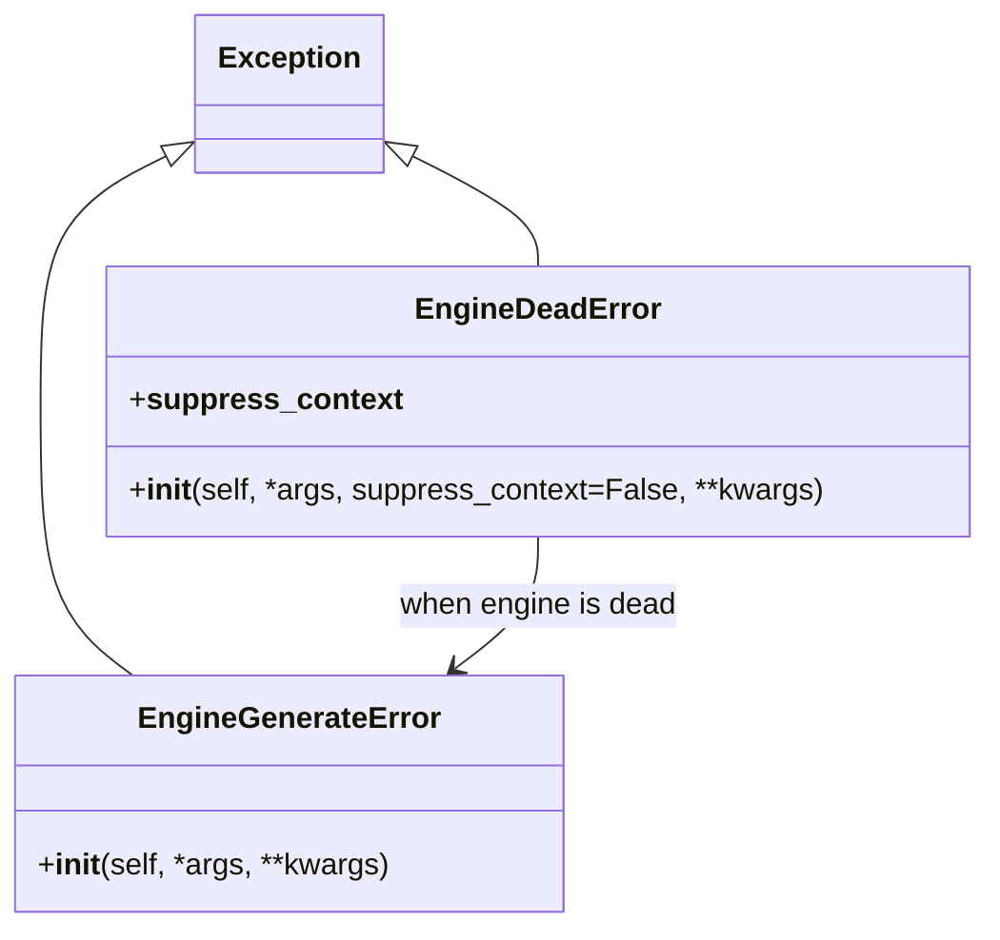
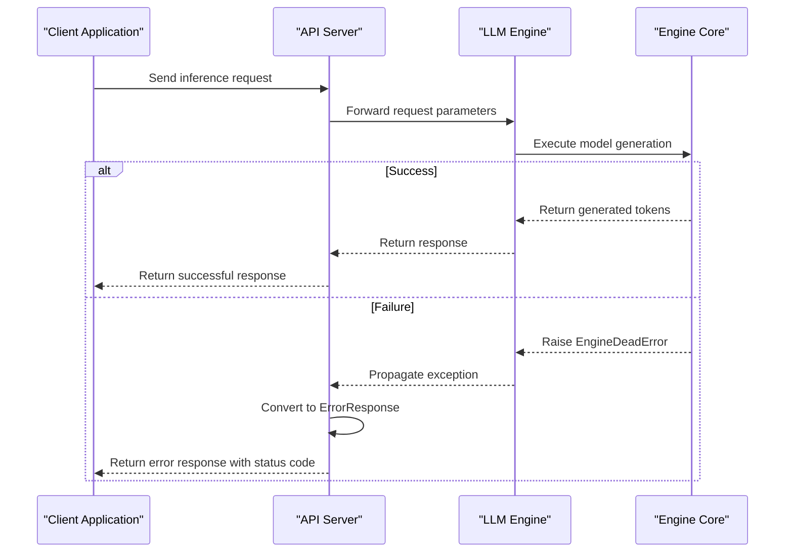
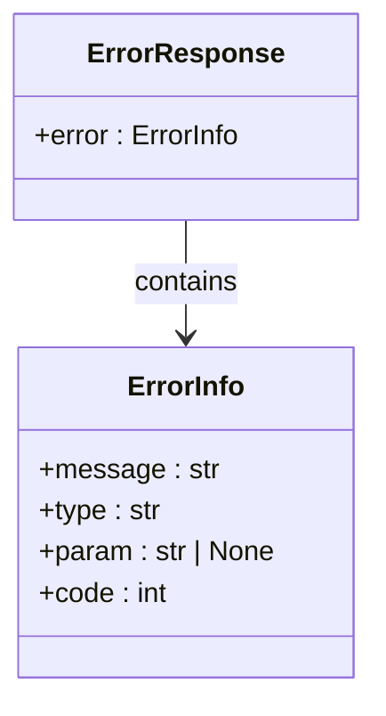
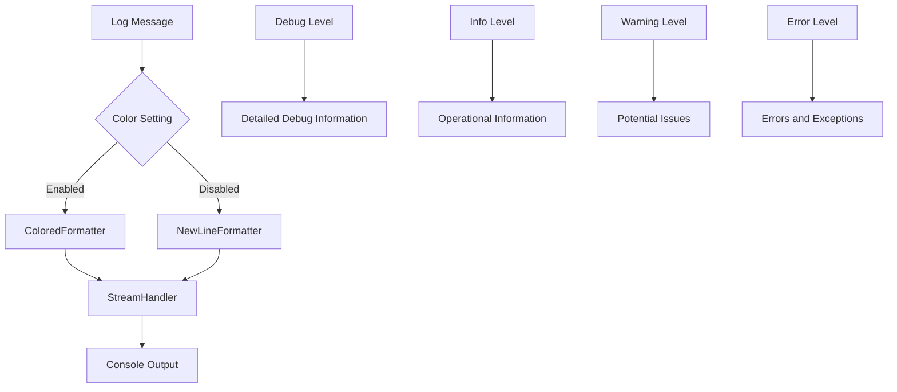
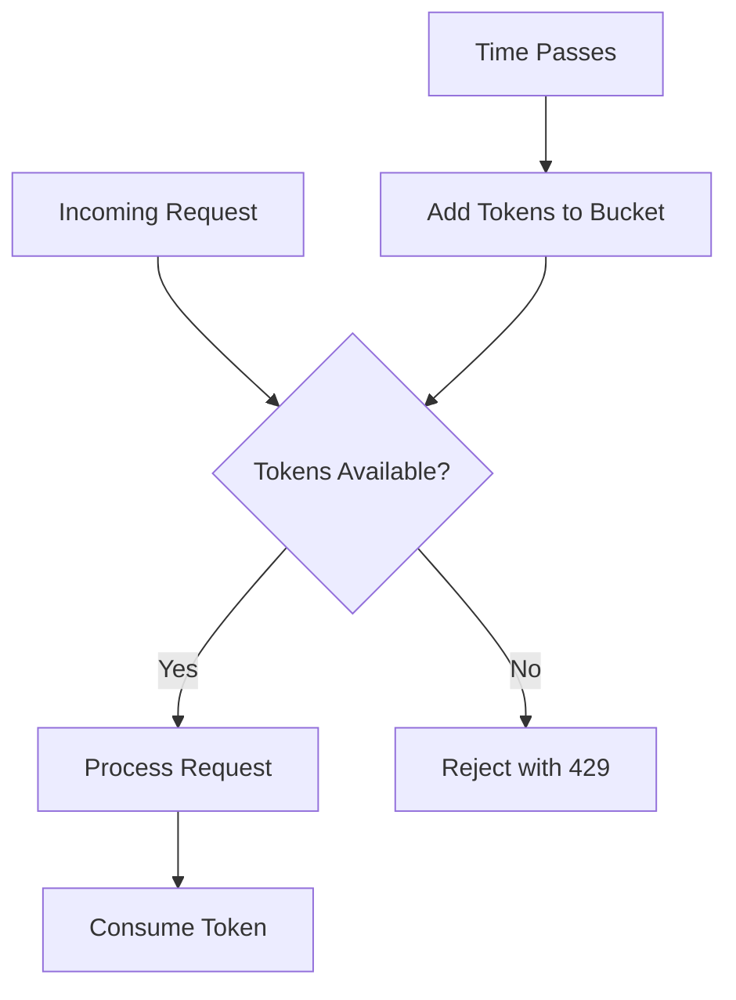

# Error Handling

<cite>
**Referenced Files in This Document**   
- [vllm/v1/engine/exceptions.py](file://vllm/v1/engine/exceptions.py)
- [vllm/entrypoints/openai/api_server.py](file://vllm/entrypoints/openai/api_server.py)
- [vllm/entrypoints/openai/protocol.py](file://vllm/entrypoints/openai/protocol.py)
- [vllm/logger.py](file://vllm/logger.py)
- [vllm/logging_utils/formatter.py](file://vllm/logging_utils/formatter.py)
- [csrc/cumem_allocator.cpp](file://csrc/cumem_allocator.cpp)
- [vllm/model_executor/model_loader/tpu.py](file://vllm/model_executor/model_loader/tpu.py)
- [vllm/model_executor/models/registry.py](file://vllm/model_executor/models/registry.py)
- [vllm/transformers_utils/dynamic_module.py](file://vllm/transformers_utils/dynamic_module.py)
- [vllm/third_party/pynvml.py](file://vllm/third_party/pynvml.py)
- [benchmarks/multi_turn/benchmark_serving_multi_turn.py](file://benchmarks/multi_turn/benchmark_serving_multi_turn.py)
- [tests/v1/shutdown/test_forward_error.py](file://tests/v1/shutdown/test_forward_error.py)
- [tests/v1/shutdown/test_processor_error.py](file://tests/v1/shutdown/test_processor_error.py)
- [tests/basic_correctness/test_basic_correctness.py](file://tests/basic_correctness/test_basic_correctness.py)
</cite>

## Table of Contents
1. [Introduction](#introduction)
2. [Exception Types](#exception-types)
3. [Error Propagation Patterns](#error-propagation-patterns)
4. [API Error Responses](#api-error-responses)
5. [Try-Catch Patterns for Robust Development](#try-catch-patterns-for-robust-development)
6. [Logging Practices](#logging-practices)
7. [Common Error Scenarios and Mitigation](#common-error-scenarios-and-mitigation)
8. [Rate Limiting and Request Queuing](#rate-limiting-and-request-queuing)
9. [Conclusion](#conclusion)

## Introduction

vLLM implements a comprehensive error handling system designed to provide robust error management across its inference engine, API server, and distributed components. The system handles various error types including parameter validation errors, execution failures, hardware limitations, and network issues. This documentation provides a detailed overview of vLLM's error handling mechanisms, covering exception types, error propagation patterns, API error responses, logging practices, and mitigation strategies for common error scenarios.

The error handling system is designed with several key principles:
- Clear separation between recoverable and unrecoverable errors
- Consistent error reporting through the API layer
- Comprehensive logging for debugging and monitoring
- Graceful handling of hardware limitations like CUDA out of memory
- Proper management of request lifecycle under high load conditions

**Section sources**
- [vllm/v1/engine/exceptions.py](file://vllm/v1/engine/exceptions.py#L1-L19)
- [vllm/entrypoints/openai/api_server.py](file://vllm/entrypoints/openai/api_server.py#L1385-L1451)

## Exception Types

vLLM defines several exception types to handle different error conditions across its architecture. These exceptions are categorized based on their severity, recoverability, and origin within the system.

### Engine-Level Exceptions

The vLLM engine defines specific exceptions to handle critical failures in the inference pipeline:



**Diagram sources** 
- [vllm/v1/engine/exceptions.py](file://vllm/v1/engine/exceptions.py#L3-L19)

- **EngineGenerateError**: Raised when an AsyncLLM.generate() call fails. This is a recoverable error that indicates a specific request failure without affecting the overall engine state. It typically occurs due to invalid input parameters or transient issues during request processing.

- **EngineDeadError**: Raised when the EngineCore dies unexpectedly. This is an unrecoverable error indicating a critical failure in the engine's core components. The error message includes guidance to check the stack trace for the root cause, and the exception can suppress context to make stack traces clearer when using ZMQError.

### API-Level Exceptions

The API server handles various HTTP-related exceptions and validation errors:

- **HTTPException**: Handled by the FastAPI framework for standard HTTP error responses (4xx and 5xx status codes). The API server converts these to standardized error responses with consistent formatting.

- **RequestValidationError**: Raised when request parameters fail validation against the defined Pydantic models. This includes missing required fields, type mismatches, or values outside acceptable ranges.

### Hardware and System Exceptions

vLLM handles low-level system and hardware exceptions through integration with CUDA and NVML:

- **NVMLError**: Wrapper exception for NVIDIA Management Library errors, which includes various error codes like NVML_ERROR_MEMORY (Insufficient Memory), NVML_ERROR_GPU_IS_LOST (GPU is lost), and NVML_ERROR_TIMEOUT (Timeout). These exceptions are raised when interacting with GPU resources through NVML.

- **CUDA-related errors**: Handled through the CUDA runtime API with error checking macros like CUDA_CHECK that capture and report CUDA errors with descriptive messages including file and line number information.

**Section sources**
- [vllm/v1/engine/exceptions.py](file://vllm/v1/engine/exceptions.py#L3-L19)
- [vllm/entrypoints/openai/api_server.py](file://vllm/entrypoints/openai/api_server.py#L1385-L1416)
- [vllm/third_party/pynvml.py](file://vllm/third_party/pynvml.py#L971-L1055)
- [csrc/cumem_allocator.cpp](file://csrc/cumem_allocator.cpp#L59-L74)

## Error Propagation Patterns

vLLM implements a structured error propagation pattern from the engine level to the API layer, ensuring consistent error handling across the system.

### Engine to API Layer Propagation

Errors originating in the engine are propagated through multiple layers before being exposed through the API:



**Diagram sources** 
- [vllm/v1/engine/exceptions.py](file://vllm/v1/engine/exceptions.py#L3-L19)
- [vllm/entrypoints/openai/api_server.py](file://vllm/entrypoints/openai/api_server.py#L1385-L1451)

The error propagation follows these key principles:
1. Low-level exceptions (CUDA, NVML) are caught and wrapped in higher-level vLLM exceptions
2. Engine-level exceptions are propagated up to the API server
3. The API server converts exceptions to standardized error responses
4. Error context is preserved throughout the propagation chain

### Asynchronous Error Handling

For asynchronous operations, vLLM uses Python's asyncio exception handling mechanisms:

- **asyncio.CancelledError**: Handled when client requests are cancelled, either through client disconnection or explicit cancellation. The system logs these events and cleans up associated resources.

- **Generator-based error propagation**: For streaming responses, errors are propagated through the async generator pattern, allowing clients to handle errors during the streaming process.

**Section sources**
- [vllm/v1/engine/exceptions.py](file://vllm/v1/engine/exceptions.py#L3-L19)
- [vllm/entrypoints/openai/api_server.py](file://vllm/entrypoints/openai/api_server.py#L1385-L1451)
- [tests/v1/shutdown/test_forward_error.py](file://tests/v1/shutdown/test_forward_error.py#L67-L70)
- [tests/v1/shutdown/test_processor_error.py](file://tests/v1/shutdown/test_processor_error.py#L36-L37)

## API Error Responses

vLLM's API server returns standardized error responses that provide clear information about the nature of the error while maintaining compatibility with the OpenAI API specification.

### Error Response Structure

The API returns error responses in a consistent JSON format:



**Diagram sources** 
- [vllm/entrypoints/openai/protocol.py](file://vllm/entrypoints/openai/protocol.py#L126-L128)
- [vllm/entrypoints/openai/protocol.py](file://vllm/entrypoints/openai/protocol.py#L119-L123)

The ErrorResponse structure includes:
- **message**: Human-readable description of the error
- **type**: Categorized error type (e.g., "invalid_request_error")
- **param**: Optional parameter name that caused the error
- **code**: HTTP status code corresponding to the error

### HTTP Status Code Mapping

vLLM maps internal exceptions to appropriate HTTP status codes:

| Internal Exception | HTTP Status Code | Error Type |
|-------------------|------------------|------------|
| RequestValidationError | 400 Bad Request | invalid_request_error |
| EngineDeadError | 503 Service Unavailable | server_error |
| asyncio.TimeoutError | 504 Gateway Timeout | timeout_error |
| Authentication failure | 401 Unauthorized | authentication_error |

The API server uses FastAPI's exception handlers to convert exceptions to appropriate HTTP responses, ensuring clients receive meaningful error information.

**Section sources**
- [vllm/entrypoints/openai/protocol.py](file://vllm/entrypoints/openai/protocol.py#L119-L128)
- [vllm/entrypoints/openai/api_server.py](file://vllm/entrypoints/openai/api_server.py#L1385-L1416)

## Try-Catch Patterns for Robust Application Development

vLLM provides several patterns for robust error handling in client applications, enabling developers to build resilient systems that can handle various error conditions gracefully.

### Basic Error Handling Pattern

The recommended pattern for handling vLLM API calls:

```python
try:
    response = client.chat.completions.create(
        model="llama-3.2-1B",
        messages=[{"role": "user", "content": "Hello"}],
        max_tokens=100
    )
    # Process successful response
    print(response.choices[0].message.content)
except openai.APITimeoutError as e:
    # Handle timeout specifically
    logger.warning(f"Request timed out: {e}")
except openai.APIConnectionError as e:
    # Handle connection issues
    logger.error(f"Connection error: {e}")
except openai.BadRequestError as e:
    # Handle invalid requests
    logger.error(f"Bad request: {e}")
except openai.APIStatusError as e:
    # Handle other API errors
    logger.error(f"API error {e.status_code}: {e}")
```

### Retry with Exponential Backoff

For transient errors, implement retry logic with exponential backoff:

```python
import asyncio
from tenacity import retry, stop_after_attempt, wait_exponential

@retry(
    stop=stop_after_attempt(3),
    wait=wait_exponential(multiplier=1, max=10),
    retry=(retry_if_exception_type(openai.APITimeoutError) | 
           retry_if_exception_type(openai.APIConnectionError))
)
async def generate_with_retry(client, **kwargs):
    return await client.chat.completions.create(**kwargs)
```

### Streaming Error Handling

For streaming responses, handle errors within the async iteration:

```python
async def handle_streaming_response():
    try:
        stream = await client.chat.completions.create(
            model="llama-3.2-1B",
            messages=[{"role": "user", "content": "Hello"}],
            stream=True
        )
        
        async for chunk in stream:
            if chunk.choices[0].delta.content:
                print(chunk.choices[0].delta.content, end="")
                
    except openai.APIError as e:
        logger.error(f"Stream failed: {e}")
        # Implement fallback or retry logic
    except asyncio.CancelledError:
        logger.info("Stream cancelled by client")
        # Clean up resources
```

**Section sources**
- [tests/entrypoints/openai/test_basic.py](file://tests/entrypoints/openai/test_basic.py#L159-L160)
- [benchmarks/multi_turn/benchmark_serving_multi_turn.py](file://benchmarks/multi_turn/benchmark_serving_multi_turn.py#L719-L734)

## Logging Practices

vLLM implements comprehensive logging practices to facilitate debugging, monitoring, and system analysis.

### Logging Configuration

The logging system is configured with multiple handlers and formatters:



**Diagram sources** 
- [vllm/logger.py](file://vllm/logger.py#L43-L71)
- [vllm/logging_utils/formatter.py](file://vllm/logging_utils/formatter.py#L80-L97)

Key logging features:
- **Colored output**: Terminal logs include ANSI color codes for different log levels (white for DEBUG, green for INFO, yellow for WARNING, red for ERROR)
- **Timestamp and file info**: Each log entry includes timestamp and source file information in grey color
- **Multi-line message handling**: Long messages are properly formatted with line breaks
- **Scope-based logging**: Methods like debug_once(), info_once(), and warning_once() prevent duplicate log messages

### Log Levels and Usage

vLLM uses different log levels for various types of information:

- **DEBUG**: Detailed information for debugging, including function calls, parameter values, and internal state
- **INFO**: General operational information, startup messages, and significant events
- **WARNING**: Potential issues that don't prevent operation but may require attention
- **ERROR**: Errors that prevent specific operations from completing
- **CRITICAL**: Severe errors that may affect system stability

### Error Logging Specifics

When errors occur, vLLM logs detailed information to aid debugging:

- **Exception logging**: Uses logger.exception() to include full stack traces
- **Context preservation**: Logs include relevant context such as request IDs, client information, and operation details
- **Performance monitoring**: Logs timing information for operations to identify performance bottlenecks

**Section sources**
- [vllm/logger.py](file://vllm/logger.py#L43-L290)
- [vllm/logging_utils/formatter.py](file://vllm/logging_utils/formatter.py#L80-L105)
- [benchmarks/multi_turn/benchmark_serving_multi_turn.py](file://benchmarks/multi_turn/benchmark_serving_multi_turn.py#L721-L723)

## Common Error Scenarios and Mitigation

This section addresses common error scenarios encountered when using vLLM and provides mitigation strategies.

### Model Loading Failures

**Symptoms**: 
- ValueError during model initialization
- "Following weights were not initialized from checkpoint" errors
- Module import failures

**Causes**:
- Missing or corrupted model files
- Incompatible model architecture
- Missing dependencies
- Permission issues

**Mitigation**:
1. Verify model path and file integrity
2. Check that all required dependencies are installed
3. Ensure proper read permissions on model files
4. Use the --load-format parameter to specify the correct loading method
5. For TPU models, ensure quantization is not enabled (assert model_config.quantization is None)

```python
# Example error handling for model loading
try:
    llm = LLM(model="meta-llama/Llama-3.2-1B")
except ValueError as e:
    if "weights were not initialized" in str(e):
        logger.error("Model loading failed: check model path and format")
        # Implement fallback or retry with different parameters
```

**Section sources**
- [vllm/model_executor/model_loader/tpu.py](file://vllm/model_executor/model_loader/tpu.py#L58-L62)
- [vllm/model_executor/models/registry.py](file://vllm/model_executor/models/registry.py#L720-L724)

### CUDA Out of Memory

**Symptoms**:
- RuntimeError: "CUDA out of memory"
- NVML_ERROR_MEMORY exceptions
- Process termination due to memory allocation failure

**Causes**:
- Large model size exceeding GPU memory capacity
- High batch size or sequence length
- Memory fragmentation
- Concurrent processes using GPU memory

**Mitigation**:
1. Reduce max_num_seqs or max_model_len parameters
2. Enable prefix caching to reduce memory usage
3. Use tensor parallelism to distribute model across multiple GPUs
4. Implement memory-efficient attention mechanisms
5. Monitor GPU memory usage and implement graceful degradation

```python
# Example memory error handling
try:
    outputs = llm.generate(prompts, sampling_params)
except RuntimeError as e:
    if "CUDA out of memory" in str(e):
        logger.warning("CUDA OOM: reducing batch size and retrying")
        # Reduce batch size and retry
        sampling_params.max_tokens = max(1, sampling_params.max_tokens // 2)
```

**Section sources**
- [csrc/cumem_allocator.cpp](file://csrc/cumem_allocator.cpp#L59-L74)
- [vllm/third_party/pynvml.py](file://vllm/third_party/pynvml.py#L990)

### Request Timeouts

**Symptoms**:
- APITimeoutError exceptions
- 504 Gateway Timeout responses
- Incomplete responses for long-running requests

**Causes**:
- Long generation sequences
- High system load
- Network latency
- Client-side timeout settings

**Mitigation**:
1. Adjust request timeout settings on both client and server
2. Implement streaming responses for long generations
3. Optimize model configuration for faster inference
4. Use asynchronous processing with proper timeout handling

```python
# Example timeout handling
import asyncio

async def generate_with_timeout(client, timeout=30):
    try:
        return await asyncio.wait_for(
            client.chat.completions.create(
                model="llama-3.2-1B",
                messages=[{"role": "user", "content": "Hello"}]
            ),
            timeout=timeout
        )
    except asyncio.TimeoutError:
        logger.warning("Request timed out, consider increasing timeout")
        raise
```

**Section sources**
- [tests/entrypoints/openai/test_basic.py](file://tests/entrypoints/openai/test_basic.py#L159-L160)
- [benchmarks/multi_turn/benchmark_serving_multi_turn.py](file://benchmarks/multi_turn/benchmark_serving_multi_turn.py#L708-L711)

## Rate Limiting and Request Queuing

vLLM implements rate limiting and request queuing mechanisms to handle high load conditions gracefully.

### Rate Limiting Implementation

The system uses a token bucket algorithm for rate limiting:



**Diagram sources** 
- [benchmarks/disagg_benchmarks/rate_limiter.py](file://benchmarks/disagg_benchmarks/rate_limiter.py)

Key parameters:
- **request_rate**: Maximum requests per second
- **burstiness**: Controls burst capacity (gamma distribution parameter)
- **max_active_conversations**: Limits concurrent processing

### Request Queuing Behavior

Under high load, vLLM manages requests through queuing:

- **Active request limit**: Configurable maximum number of concurrently processed requests
- **Task queue**: FIFO queue for incoming requests exceeding active limit
- **Graceful degradation**: When queues are full, new requests are rejected with appropriate error codes

### High Load Mitigation

Strategies for handling high load conditions:

1. **Ramp-up strategies**: Gradually increase request rate during load testing
2. **Burstiness control**: Adjust burstiness parameter to manage request distribution
3. **Client-side retry**: Implement exponential backoff in client applications
4. **Monitoring and scaling**: Monitor queue lengths and scale resources accordingly

```python
# Example of handling rate limiting
async def send_request_with_backoff(client, max_retries=3):
    for attempt in range(max_retries):
        try:
            return await client.chat.completions.create(
                model="llama-3.2-1B",
                messages=[{"role": "user", "content": "Hello"}]
            )
        except openai.RateLimitError:
            if attempt == max_retries - 1:
                raise
            # Exponential backoff
            await asyncio.sleep(2 ** attempt)
```

**Section sources**
- [benchmarks/multi_turn/benchmark_serving_multi_turn.py](file://benchmarks/multi_turn/benchmark_serving_multi_turn.py#L609-L612)
- [benchmarks/serve.py](file://benchmarks/serve.py#L158-L173)

## Conclusion

vLLM's error handling system provides a comprehensive framework for managing errors across its inference engine and API server. The system distinguishes between recoverable and unrecoverable errors, implements consistent error propagation from the engine to the API layer, and provides standardized error responses compatible with the OpenAI API specification.

Key aspects of the error handling system include:
- Well-defined exception types for different error categories
- Structured error propagation patterns that preserve context
- Standardized API error responses with appropriate HTTP status codes
- Comprehensive logging practices for debugging and monitoring
- Specific mitigation strategies for common error scenarios like model loading failures, CUDA out of memory, and request timeouts
- Rate limiting and request queuing mechanisms for handling high load conditions

By understanding these error handling mechanisms, developers can build more robust applications that gracefully handle various error conditions and provide better user experiences. The combination of proper try-catch patterns, retry logic, and monitoring enables the creation of resilient systems that can maintain availability even under challenging conditions.