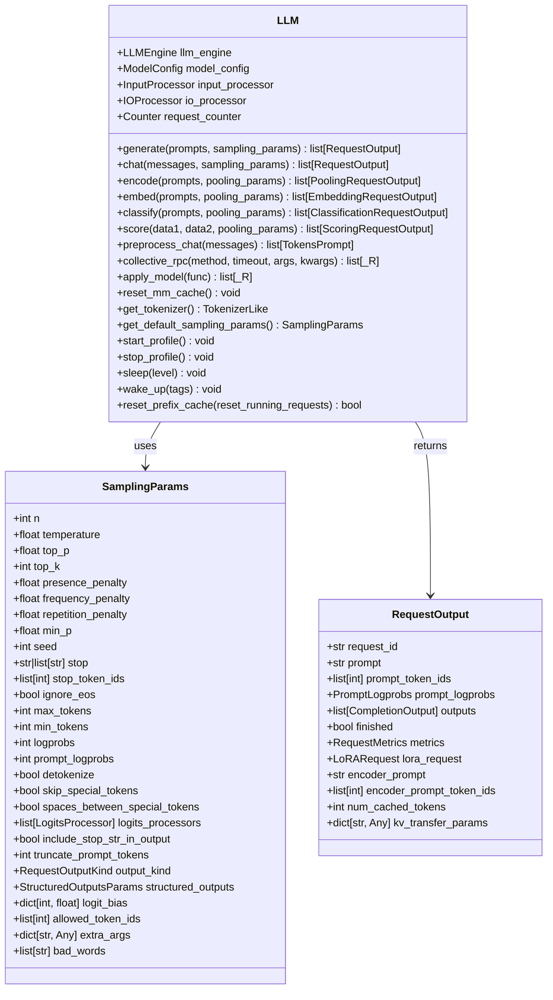
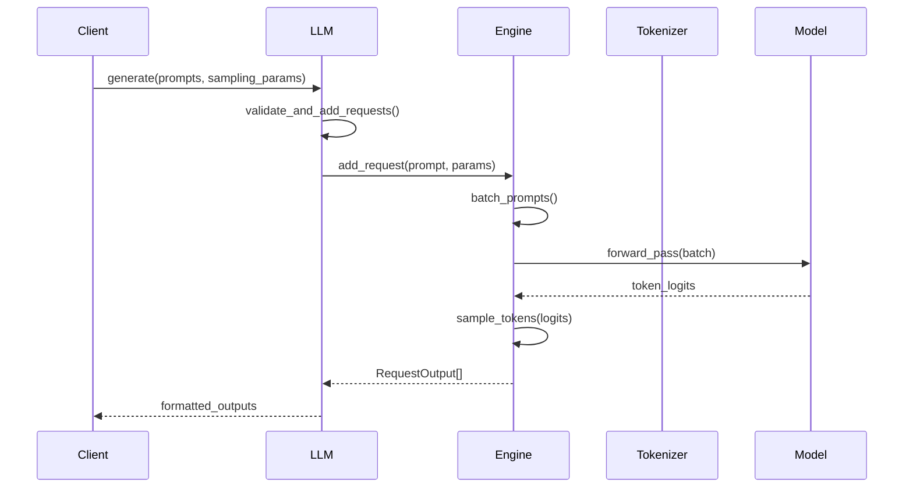

# LLM Class API Documentation

<cite>
**Referenced Files in This Document**
- [vllm/entrypoints/llm.py](file://vllm/entrypoints/llm.py)
- [vllm/sampling_params.py](file://vllm/sampling_params.py)
- [vllm/outputs.py](file://vllm/outputs.py)
- [vllm/inputs/data.py](file://vllm/inputs/data.py)
- [vllm/entrypoints/chat_utils.py](file://vllm/entrypoints/chat_utils.py)
- [examples/offline_inference/batch_llm_inference.py](file://examples/offline_inference/batch_llm_inference.py)
- [tests/entrypoints/llm/test_generate.py](file://tests/entrypoints/llm/test_generate.py)
- [vllm/engine/protocol.py](file://vllm/engine/protocol.py)
</cite>

## Table of Contents
1. [Introduction](#introduction)
2. [LLM Class Overview](#llm-class-overview)
3. [Initialization Parameters](#initialization-parameters)
4. [Core Methods](#core-methods)
5. [Context Manager Usage](#context-manager-usage)
6. [Practical Examples](#practical-examples)
7. [Error Handling](#error-handling)
8. [Performance Considerations](#performance-considerations)
9. [Advanced Features](#advanced-features)
10. [Best Practices](#best-practices)

## Introduction

The LLM class serves as the primary interface for synchronous Large Language Model inference in vLLM. It provides a comprehensive API for text generation, chat interactions, and various specialized inference tasks. The class manages tokenizer initialization, distributed model execution, and efficient memory management for optimal performance.

## LLM Class Overview

The LLM class encapsulates a complete inference pipeline including:
- Tokenizer and detokenizer management
- Distributed model execution across multiple GPUs
- Intelligent batching mechanisms
- Efficient memory management with KV cache optimization
- Support for various model architectures and quantization methods



**Diagram sources**
- [vllm/entrypoints/llm.py](file://vllm/entrypoints/llm.py#L90-L1763)
- [vllm/sampling_params.py](file://vllm/sampling_params.py#L111-L580)
- [vllm/outputs.py](file://vllm/outputs.py#L83-L189)

**Section sources**
- [vllm/entrypoints/llm.py](file://vllm/entrypoints/llm.py#L90-L182)

## Initialization Parameters

The LLM constructor accepts numerous parameters for configuring model loading, distributed execution, and memory management.

### Core Model Parameters

| Parameter | Type | Default | Description |
|-----------|------|---------|-------------|
| `model` | `str` | Required | Path or HuggingFace model identifier |
| `tokenizer` | `str \| None` | `None` | Custom tokenizer path (defaults to model) |
| `tensor_parallel_size` | `int` | `1` | Number of GPUs for tensor parallelism |
| `dtype` | `ModelDType` | `"auto"` | Data type for model weights (`float32`, `float16`, `bfloat16`) |
| `quantization` | `QuantizationMethods \| None` | `None` | Quantization method (`awq`, `gptq`, `fp8`) |

### Memory Management Parameters

| Parameter | Type | Default | Description |
|-----------|------|---------|-------------|
| `gpu_memory_utilization` | `float` | `0.9` | GPU memory fraction to reserve (0.0-1.0) |
| `kv_cache_memory_bytes` | `int \| None` | `None` | Manual KV cache size in bytes |
| `swap_space` | `float` | `4` | CPU swap space in GiB per GPU |
| `cpu_offload_gb` | `float` | `0` | CPU memory offload in GiB |

### Advanced Configuration Parameters

| Parameter | Type | Default | Description |
|-----------|------|---------|-------------|
| `enforce_eager` | `bool` | `False` | Disable CUDA graph optimization |
| `disable_custom_all_reduce` | `bool` | `False` | Disable custom all-reduce operations |
| `trust_remote_code` | `bool` | `False` | Allow execution of remote model code |
| `hf_token` | `bool \| str \| None` | `None` | HuggingFace authentication token |
| `seed` | `int \| None` | `None` | Random seed for reproducible generation |

### Multi-modal and Specialized Parameters

| Parameter | Type | Default | Description |
|-----------|------|---------|-------------|
| `allowed_local_media_path` | `str` | `""` | Allowed local media directory path |
| `allowed_media_domains` | `list[str] \| None` | `None` | Allowed media URL domains |
| `mm_processor_kwargs` | `dict[str, Any] \| None` | `None` | Multi-modal processor arguments |
| `pooler_config` | `PoolerConfig \| None` | `None` | Pooling model configuration |
| `structured_outputs_config` | `dict \| StructuredOutputsConfig \| None` | `None` | Structured output configuration |

**Section sources**
- [vllm/entrypoints/llm.py](file://vllm/entrypoints/llm.py#L184-L217)

## Core Methods

### generate() Method

The primary method for text generation, supporting both single and batch inference.



**Diagram sources**
- [vllm/entrypoints/llm.py](file://vllm/entrypoints/llm.py#L374-L443)

**Method Signature:**
```python
def generate(
    prompts: PromptType | Sequence[PromptType],
    sampling_params: SamplingParams | Sequence[SamplingParams] | None = None,
    *,
    use_tqdm: bool | Callable[..., tqdm] = True,
    lora_request: list[LoRARequest] | LoRARequest | None = None,
    priority: list[int] | None = None,
) -> list[RequestOutput]
```

**Parameters:**
- `prompts`: Single prompt or list of prompts (strings, token IDs, or structured prompts)
- `sampling_params`: Generation parameters (single or per-prompt)
- `use_tqdm`: Progress bar display option
- `lora_request`: LoRA adapter configuration
- `priority`: Request priority for scheduling

**Returns:** List of `RequestOutput` objects with generated text and metadata.

### chat() Method

Conversational interface with message formatting and chat template support.

**Method Signature:**
```python
def chat(
    messages: list[ChatCompletionMessageParam] | list[list[ChatCompletionMessageParam]],
    sampling_params: SamplingParams | list[SamplingParams] | None = None,
    use_tqdm: bool | Callable[..., tqdm] = True,
    lora_request: LoRARequest | None = None,
    chat_template: str | None = None,
    chat_template_content_format: ChatTemplateContentFormatOption = "auto",
    add_generation_prompt: bool = True,
    continue_final_message: bool = False,
    tools: list[dict[str, Any]] | None = None,
    chat_template_kwargs: dict[str, Any] | None = None,
    mm_processor_kwargs: dict[str, Any] | None = None,
) -> list[RequestOutput]
```

**Key Features:**
- Automatic message formatting using chat templates
- Support for multi-turn conversations
- Tool/function calling capabilities
- Multi-modal message support
- Customizable template rendering

### encode() Family Methods

Specialized methods for different encoding tasks:

#### embed()
Generate embedding vectors for text prompts.

#### classify()
Generate classification logits for text prompts.

#### score()
Compute similarity scores between text pairs or multi-modal inputs.

#### reward()
Generate reward signals for RLHF applications.

**Section sources**
- [vllm/entrypoints/llm.py](file://vllm/entrypoints/llm.py#L374-L1763)

## Context Manager Usage

The LLM class supports context manager protocol for automatic resource cleanup and proper shutdown.

```python
# Basic usage
llm = LLM(model="meta-llama/Llama-2-7b-chat-hf")
try:
    results = llm.generate(prompts)
finally:
    llm.shutdown()  # Resources cleaned up automatically

# With context manager (recommended)
with LLM(model="meta-llama/Llama-2-7b-chat-hf") as llm:
    results = llm.generate(prompts)
    # Resources automatically cleaned up
```

**Available Context Manager Methods:**
- `__enter__()`: Returns the LLM instance
- `__exit__()`: Calls `shutdown()` for cleanup
- `shutdown()`: Explicit resource cleanup

**Section sources**
- [vllm/entrypoints/llm.py](file://vllm/entrypoints/llm.py#L1546-L1599)

## Practical Examples

### Basic Text Generation

```python
from vllm import LLM, SamplingParams

# Initialize LLM
llm = LLM(
    model="meta-llama/Llama-2-7b-chat-hf",
    tensor_parallel_size=1,
    gpu_memory_utilization=0.8
)

# Basic generation
prompts = ["The future of AI is", "Artificial intelligence can"]
sampling_params = SamplingParams(
    temperature=0.7,
    top_p=0.9,
    max_tokens=100
)

results = llm.generate(prompts, sampling_params)
for result in results:
    print(result.outputs[0].text)
```

### Batch Processing

```python
# Efficient batch processing
batch_prompts = [
    "Explain quantum computing in simple terms:",
    "Write a short poem about nature:",
    "Describe the process of photosynthesis:",
    "What are the benefits of meditation?"
]

# Single sampling parameters applied to all
results = llm.generate(batch_prompts, sampling_params)

# Different sampling parameters per prompt
different_params = [
    SamplingParams(temperature=0.3, max_tokens=50),
    SamplingParams(temperature=0.8, max_tokens=100),
    SamplingParams(temperature=0.5, max_tokens=75),
    SamplingParams(temperature=0.7, max_tokens=120)
]
results = llm.generate(batch_prompts, different_params)
```

### Conversational Interface

```python
# Chat with conversation history
messages = [
    {"role": "system", "content": "You are a helpful assistant."},
    {"role": "user", "content": "What is machine learning?"},
    {"role": "assistant", "content": "Machine learning is a subset of AI..."},
    {"role": "user", "content": "Can you explain neural networks?"}
]

response = llm.chat(
    messages=messages,
    sampling_params=SamplingParams(temperature=0.6, max_tokens=200),
    add_generation_prompt=True
)
print(response[0].outputs[0].text)
```

### Multi-modal Inputs

```python
# Multi-modal chat with images
messages = [
    {
        "role": "user", 
        "content": [
            {"type": "text", "text": "What do you see in this image?"},
            {"type": "image_url", "image_url": {"url": "image.jpg"}}
        ]
    }
]

response = llm.chat(
    messages=messages,
    sampling_params=SamplingParams(max_tokens=150),
    mm_processor_kwargs={"num_crops": 4}
)
```

### Structured Output Generation

```python
# JSON structured output
structured_params = SamplingParams(
    temperature=0.0,
    structured_outputs={
        "json": {
            "name": "string",
            "age": "integer",
            "skills": ["string"]
        }
    }
)

prompt = "Extract information from this text: John Doe is 30 years old and works as a software engineer."
result = llm.generate(prompt, structured_params)
```

**Section sources**
- [examples/offline_inference/batch_llm_inference.py](file://examples/offline_inference/batch_llm_inference.py#L1-L94)

## Error Handling

### Common Error Scenarios

#### Out-of-Memory (OOM) Errors

**Causes:**
- Insufficient GPU memory allocation
- Large batch sizes
- High `gpu_memory_utilization` values
- Model size exceeds available memory

**Mitigation Strategies:**
```python
# Reduce memory utilization
llm = LLM(
    model="large-model",
    gpu_memory_utilization=0.7,  # Lower from default 0.9
    tensor_parallel_size=1
)

# Enable CPU offloading
llm = LLM(
    model="large-model",
    cpu_offload_gb=2.0,
    swap_space=8.0
)

# Use gradient checkpointing
llm = LLM(
    model="large-model",
    enforce_eager=True  # Reduces memory overhead
)
```

#### Model Loading Errors

**Common Issues:**
- Invalid model path or HuggingFace identifier
- Missing dependencies for quantized models
- Authentication failures for private models

**Error Handling Pattern:**
```python
try:
    llm = LLM(model="some-model")
except ValueError as e:
    if "out of memory" in str(e).lower():
        # Handle OOM error
        adjust_memory_settings()
    elif "authentication" in str(e).lower():
        # Handle auth error
        use_hf_token()
    else:
        raise
```

#### Sampling Parameter Validation

```python
# Invalid sampling parameters will raise ValueError
try:
    params = SamplingParams(
        temperature=-0.5,  # Invalid negative temperature
        top_p=1.5,         # Invalid > 1.0
        max_tokens=0       # Invalid <= 0
    )
    llm.generate(["test"], params)
except ValueError as e:
    print(f"Parameter validation failed: {e}")
```

### Graceful Degradation

```python
def robust_generation(llm, prompts, fallback_params):
    try:
        return llm.generate(prompts)
    except RuntimeError as e:
        if "out of memory" in str(e).lower():
            # Reduce batch size and retry
            reduced_prompts = prompts[:len(prompts)//2]
            return llm.generate(reduced_prompts, fallback_params)
        else:
            raise
```

**Section sources**
- [tests/entrypoints/llm/test_generate.py](file://tests/entrypoints/llm/test_generate.py#L1-L125)

## Performance Considerations

### Memory Utilization and Optimization

#### GPU Memory Management

**Memory Allocation Strategy:**
```python
# Optimal memory configuration
llm = LLM(
    model="model-name",
    gpu_memory_utilization=0.85,  # Leave 15% headroom
    tensor_parallel_size=2,        # Balance between memory and speed
    swap_space=4                   # Enable CPU swap for large batches
)
```

**Memory Monitoring:**
```python
import torch

# Check available GPU memory
def get_gpu_memory():
    if torch.cuda.is_available():
        allocated = torch.cuda.memory_allocated() / 1024**3
        reserved = torch.cuda.memory_reserved() / 1024**3
        return allocated, reserved
    return None, None

allocated, reserved = get_gpu_memory()
print(f"GPU Memory - Allocated: {allocated:.2f}GB, Reserved: {reserved:.2f}GB")
```

#### Preemption Overhead

**Understanding Preemption:**
- Occurs when new requests exceed memory budget
- Triggers eviction of inactive requests
- Causes temporary slowdown but maintains service availability

**Minimizing Preemption Impact:**
```python
# Configure memory carefully to reduce preemption
llm = LLM(
    model="model-name",
    gpu_memory_utilization=0.9,    # Maximize utilization
    swap_space=2,                  # Enable swapping
    enforce_eager=False            # Use CUDA graphs for stability
)
```

### Throughput Optimization

#### Batch Size Tuning

```python
# Dynamic batch sizing based on available memory
def calculate_optimal_batch_size(llm, test_prompt):
    base_batch_size = 8
    while base_batch_size > 0:
        try:
            test_prompts = [test_prompt] * base_batch_size
            llm.generate(test_prompts)
            return base_batch_size
        except RuntimeError:
            base_batch_size //= 2
    return 1
```

#### Tensor Parallelism Configuration

```python
# Optimal TP configuration depends on model and hardware
configs = [
    {"tensor_parallel_size": 1, "expected_speed": "baseline"},
    {"tensor_parallel_size": 2, "expected_speed": "+60%"},
    {"tensor_parallel_size": 4, "expected_speed": "+120%"},
    {"tensor_parallel_size": 8, "expected_speed": "+180%"}
]

# Choose based on model size and available GPUs
optimal_config = select_optimal_config(configs, model_size, available_gpus)
```

### Latency Optimization

#### Prefix Caching

```python
# Enable prefix caching for repeated prompts
llm = LLM(
    model="model-name",
    gpu_memory_utilization=0.8,
    # Prefix caching is automatically enabled
)

# Reset cache periodically for memory management
llm.reset_prefix_cache(reset_running_requests=True)
```

#### KV Cache Management

```python
# Monitor KV cache efficiency
def monitor_kv_cache_efficiency(llm):
    metrics = llm.get_metrics()
    cache_hit_rate = metrics.get("cache_hit_rate", 0)
    cache_miss_rate = metrics.get("cache_miss_rate", 0)
    
    if cache_hit_rate < 0.5:
        print("Consider increasing gpu_memory_utilization for better caching")
```

**Section sources**
- [vllm/device_allocator/cumem.py](file://vllm/device_allocator/cumem.py#L74-L174)

## Advanced Features

### LoRA (Low-Rank Adaptation) Support

```python
from vllm.lora.request import LoRARequest

# Apply LoRA adapters
lora_request = LoRARequest(
    lora_id=1,
    lora_path="/path/to/lora",
    lora_alpha=16
)

results = llm.generate(
    prompts,
    lora_request=lora_request
)
```

### Structured Output Generation

```python
# JSON schema validation
structured_params = SamplingParams(
    structured_outputs={
        "json": {
            "type": "object",
            "properties": {
                "name": {"type": "string"},
                "age": {"type": "integer"},
                "tags": {"type": "array", "items": {"type": "string"}}
            },
            "required": ["name", "age"]
        }
    }
)

result = llm.generate(prompt, structured_params)
```

### Multi-modal Processing

```python
# Image-text processing
messages = [{
    "role": "user",
    "content": [
        {"type": "text", "text": "Describe this image:"},
        {"type": "image_url", "image_url": {"url": "image.jpg"}}
    ]
}]

response = llm.chat(
    messages=messages,
    mm_processor_kwargs={
        "num_crops": 4,  # For vision models
        "image_processor": custom_processor
    }
)
```

### Custom Logits Processing

```python
from vllm.logits_process import LogitsProcessor

class CustomLogitsProcessor(LogitsProcessor):
    def __call__(self, input_ids, scores):
        # Custom logic to modify token probabilities
        return scores

custom_processor = CustomLogitsProcessor()

sampling_params = SamplingParams(
    logits_processors=[custom_processor]
)
```

**Section sources**
- [vllm/entrypoints/llm.py](file://vllm/entrypoints/llm.py#L445-L532)

## Best Practices

### Resource Management

1. **Always use context managers for proper cleanup:**
```python
with LLM(model="model-name") as llm:
    # Use LLM
    pass  # Automatic cleanup
```

2. **Monitor memory usage in production:**
```python
def safe_inference(llm, prompts, max_memory_usage=0.9):
    allocated, reserved = get_gpu_memory()
    total_memory = torch.cuda.get_device_properties(0).total_memory / 1024**3
    
    if (allocated + reserved) / total_memory > max_memory_usage:
        raise MemoryError("GPU memory usage exceeds threshold")
    
    return llm.generate(prompts)
```

### Performance Optimization

1. **Batch prompts efficiently:**
```python
# Group similar-length prompts together
sorted_prompts = sorted(prompts, key=len)
batch_size = calculate_optimal_batch_size(llm, sorted_prompts[0])

for i in range(0, len(sorted_prompts), batch_size):
    batch = sorted_prompts[i:i+batch_size]
    results.extend(llm.generate(batch))
```

2. **Reuse LLM instances:**
```python
# Good: Reuse single LLM instance
llm = LLM(model="model-name")
for batch in batches:
    results.extend(llm.generate(batch))

# Bad: Create new instance for each batch
for batch in batches:
    llm = LLM(model="model-name")
    results.extend(llm.generate(batch))
    del llm  # Manual cleanup
```

### Error Handling Patterns

1. **Implement retry logic with exponential backoff:**
```python
import time
import random

def generate_with_retry(llm, prompts, max_retries=3):
    for attempt in range(max_retries):
        try:
            return llm.generate(prompts)
        except RuntimeError as e:
            if "out of memory" in str(e).lower() and attempt < max_retries - 1:
                time.sleep(2 ** attempt + random.uniform(0, 1))
                continue
            raise
```

2. **Validate inputs before generation:**
```python
def validate_prompts(prompts):
    if not prompts:
        raise ValueError("Prompts list cannot be empty")
    
    for i, prompt in enumerate(prompts):
        if isinstance(prompt, str) and len(prompt.strip()) == 0:
            raise ValueError(f"Empty prompt at index {i}")
    
    return True
```

### Production Deployment Considerations

1. **Configure appropriate timeouts:**
```python
# For production systems
llm = LLM(
    model="model-name",
    gpu_memory_utilization=0.85,
    enforce_eager=False,  # Faster inference
    swap_space=2         # Enable swapping
)
```

2. **Implement health checks:**
```python
def health_check(llm):
    try:
        test_prompt = "Hello"
        result = llm.generate([test_prompt], max_tokens=1)
        return True
    except Exception as e:
        logger.error(f"Health check failed: {e}")
        return False
```

3. **Monitor and log performance metrics:**
```python
import logging

logger = logging.getLogger(__name__)

def log_generation_metrics(llm, prompts, results):
    total_tokens = sum(len(r.outputs[0].token_ids) for r in results)
    avg_tokens = total_tokens / len(results)
    
    logger.info({
        "prompt_count": len(prompts),
        "avg_tokens_per_prompt": avg_tokens,
        "total_tokens": total_tokens,
        "memory_utilization": get_gpu_memory()
    })
```

**Section sources**
- [vllm/entrypoints/llm.py](file://vllm/entrypoints/llm.py#L1546-L1763)