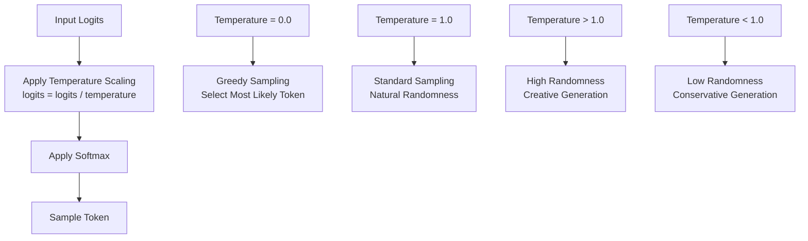
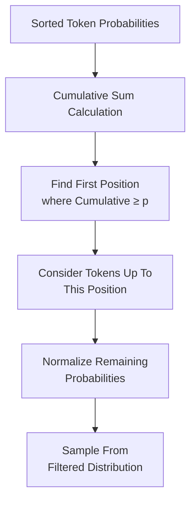
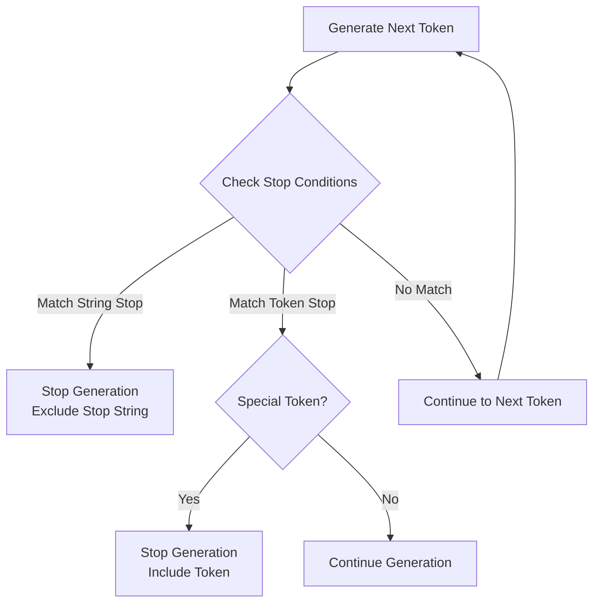
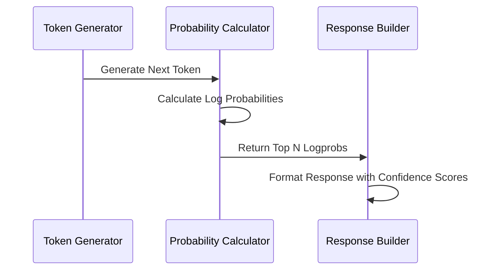
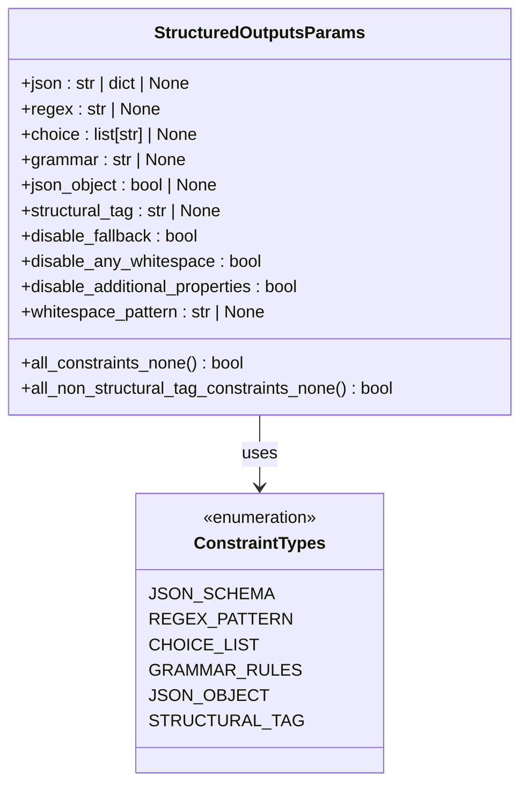

# Sampling Parameters

<cite>
**Referenced Files in This Document**
- [sampling_params.py](file://vllm/sampling_params.py)
- [basic.py](file://examples/offline_inference/basic/basic.py)
- [llm_engine_example.py](file://examples/offline_inference/llm_engine_example.py)
- [structured_outputs.py](file://examples/offline_inference/structured_outputs.py)
- [chat_with_tools.py](file://examples/offline_inference/chat_with_tools.py)
- [test_logprobs.py](file://tests/samplers/test_logprobs.py)
- [protocol.py](file://vllm/entrypoints/openai/protocol.py)
</cite>

## Table of Contents
1. [Introduction](#introduction)
2. [Core Sampling Parameters](#core-sampling-parameters)
3. [Advanced Control Parameters](#advanced-control-parameters)
4. [Termination Control](#termination-control)
5. [Probability Analysis](#probability-analysis)
6. [Structured Output Configuration](#structured-output-configuration)
7. [Parameter Combinations for Specific Use Cases](#parameter-combinations-for-specific-use-cases)
8. [Common Issues and Solutions](#common-issues-and-solutions)
9. [Examples and Best Practices](#examples-and-best-practices)
10. [Performance Considerations](#performance-considerations)

## Introduction

The `SamplingParams` class in vLLM serves as the central configuration object for controlling text generation behavior during inference. It provides fine-grained control over the sampling process, allowing developers to balance creativity, consistency, and performance according to their specific use case requirements.

Sampling parameters directly influence how the model generates text by controlling randomness, repetition penalties, token selection mechanisms, and termination conditions. Proper parameter tuning is essential for achieving desired output quality across different applications ranging from creative writing to factual responses and structured data generation.

## Core Sampling Parameters

### Temperature Control

Temperature regulates the randomness of token selection by scaling the logits before applying the softmax function. This parameter fundamentally controls the trade-off between creativity and determinism.



**Key Properties:**
- **Range:** Non-negative float (`≥ 0.0`)
- **Default:** `1.0`
- **Effect:** Controls the sharpness of the probability distribution
- **Behavior:** Zero temperature enables greedy sampling, eliminating randomness

**Practical Applications:**
- **Creative Writing:** Higher temperatures (0.8-1.2) for diverse and unexpected outputs
- **Factual Responses:** Lower temperatures (0.1-0.3) for consistent, reliable information
- **Code Generation:** Moderate temperatures (0.2-0.5) balancing creativity with correctness

**Section sources**
- [sampling_params.py](file://vllm/sampling_params.py#L144-L148)

### Top-p (Nucleus Sampling)

Top-p sampling, also known as nucleus sampling, dynamically selects tokens from the smallest set whose cumulative probability mass exceeds the threshold `p`. This adaptive mechanism ensures diversity while maintaining quality.



**Key Properties:**
- **Range:** Float in `(0.0, 1.0]`
- **Default:** `1.0` (considers all tokens)
- **Effect:** Controls the breadth of token consideration
- **Adaptive Behavior:** Automatically adjusts based on probability distribution

**Optimal Ranges:**
- **Creative Content:** `0.8-0.95` for balanced diversity
- **Technical Text:** `0.9-0.99` for focused generation
- **Structured Data:** `0.95-1.0` to minimize irrelevant tokens

**Section sources**
- [sampling_params.py](file://vllm/sampling_params.py#L148-L150)

### Top-k Sampling

Top-k sampling restricts token selection to the `k` most probable tokens from the vocabulary. Unlike top-p, this method uses a fixed number of candidates regardless of their probability distribution.

**Key Properties:**
- **Range:** Integer `≥ 0` (0 or -1 disables)
- **Default:** `0` (disabled)
- **Effect:** Provides explicit control over candidate pool size
- **Deterministic Behavior:** Fixed number of tokens considered

**Comparison with Top-p:**
- **Top-k:** Fixed number of candidates, variable probability coverage
- **Top-p:** Variable number of candidates, fixed probability coverage
- **Combined Use:** Often used together for optimal control

**Section sources**
- [sampling_params.py](file://vllm/sampling_params.py#L151-L153)

### Min-p Sampling

Min-p sampling introduces a relative probability threshold, considering only tokens whose probability is at least `p` times the probability of the most likely token. This parameter provides scale-invariant control over token selection.

**Key Properties:**
- **Range:** Float in `[0.0, 1.0]`
- **Default:** `0.0` (disabled)
- **Effect:** Relative to the most likely token's probability
- **Scale Invariance:** Works consistently across different temperature settings

**Mathematical Relationship:**
```
token_probability ≥ max_probability × min_p_threshold
```

**Section sources**
- [sampling_params.py](file://vllm/sampling_params.py#L154-L158)

## Advanced Control Parameters

### Frequency Penalty

Frequency penalty discourages tokens based on their historical frequency in the generated text. This parameter helps reduce repetitive patterns while maintaining contextual appropriateness.

**Implementation Details:**
- **Calculation:** Applied as a subtraction from logits
- **Scope:** Tracks token occurrences in generated sequence
- **Range:** `-2.0 ≤ value ≤ 2.0`
- **Effect:** Encourages diversity in token selection

**Use Cases:**
- **Long-form Content:** Prevents repetitive phrases and structures
- **Conversational AI:** Reduces dialogical redundancy
- **Creative Writing:** Maintains narrative variety

**Section sources**
- [sampling_params.py](file://vllm/sampling_params.py#L136-L140)

### Presence Penalty

Presence penalty discourages tokens based on their binary occurrence in the generated text. Unlike frequency penalty, it treats all instances equally, making it suitable for avoiding repeated concepts rather than specific phrases.

**Key Differences from Frequency Penalty:**
- **Binary vs. Count-based:** Presence penalty counts occurrences, frequency penalty tracks total usage
- **Use Case Focus:** Presence targets concept repetition, frequency targets phrase repetition
- **Impact Level:** Generally less aggressive than frequency penalty

**Section sources**
- [sampling_params.py](file://vllm/sampling_params.py#L132-L136)

### Repetition Penalty

Repetition penalty applies the most comprehensive penalty mechanism, considering both prompt and generated text history. This parameter provides the strongest control over repetition avoidance.

**Scope of Application:**
- **Prompt Tokens:** Considers tokens present in the input prompt
- **Generated Tokens:** Tracks all tokens produced during generation
- **Combined History:** Creates unified penalty calculation

**Mathematical Implementation:**
```
penalty_factor = repetition_penalty ^ (count_in_history)
adjusted_logit = original_logit / penalty_factor
```

**Section sources**
- [sampling_params.py](file://vllm/sampling_params.py#L140-L144)

## Termination Control

### Stop Sequences and Token IDs

Stop conditions provide precise control over when generation should terminate, enabling natural sentence boundaries and preventing unwanted continuation.



**Stop Parameter Types:**

| Parameter | Type | Description | Use Case |
|-----------|------|-------------|----------|
| `stop` | `str \| list[str] \| None` | String(s) that trigger termination | Natural sentence boundaries |
| `stop_token_ids` | `list[int] \| None` | Token IDs that trigger termination | Precise control over token boundaries |

**Special Considerations:**
- **String Stops:** Returned output excludes the stop string
- **Token Stops:** Returned output includes the stop token unless special token
- **Multiple Stops:** All specified stops are evaluated simultaneously
- **Detokenization Requirement:** String stops require `detokenize=True`

**Section sources**
- [sampling_params.py](file://vllm/sampling_params.py#L160-L167)

### Maximum Tokens Configuration

The `max_tokens` parameter sets the upper bound on generation length, preventing infinite loops and managing resource consumption.

**Configuration Options:**
- **Integer Value:** Explicit maximum token count
- **None:** No limit (uses model's maximum context length)
- **Dynamic Sizing:** Adjust based on prompt length and use case

**Relationship with Other Parameters:**
- **Interaction with Stop:** Generation stops at first termination condition
- **Resource Management:** Combined with memory limits for safe operation
- **Performance Impact:** Larger values increase computational cost

**Section sources**
- [sampling_params.py](file://vllm/sampling_params.py#L170-L172)

### Minimum Tokens Constraint

The `min_tokens` parameter ensures a minimum generation length, preventing premature termination and guaranteeing content depth.

**Key Features:**
- **Prevents Early Termination:** Ensures minimum content length
- **EOS Consideration:** Respects end-of-sequence tokens
- **Stop Token Interaction:** Compatible with stop token configurations

**Validation Rules:**
- **Range:** `≥ 0`
- **Constraint:** `min_tokens ≤ max_tokens` (when both specified)
- **Default:** `0` (no minimum requirement)

**Section sources**
- [sampling_params.py](file://vllm/sampling_params.py#L172-L175)

## Probability Analysis

### Logprobs Configuration

Logprobs provide insight into the model's confidence and decision-making process by returning probability information for generated tokens.



**Logprobs Parameter Options:**

| Setting | Description | Use Case |
|---------|-------------|----------|
| `None` | No probability information returned | Standard generation |
| `0` | Only selected token probability | Minimal overhead |
| `1` | Selected token plus 1 additional token | Basic confidence analysis |
| `N` | Selected token plus N additional tokens | Comprehensive probability analysis |
| `-1` | All vocabulary probabilities | Complete confidence assessment |

**OpenAI Compatibility:**
- **API Compliance:** Follows OpenAI's logprobs specification
- **Consistency Guarantee:** Always returns selected token probability
- **Performance Impact:** Higher values increase response size and computation

**Section sources**
- [sampling_params.py](file://vllm/sampling_params.py#L175-L183)

### Prompt Logprobs

Prompt logprobs extend probability analysis to the input tokens, providing confidence scores for the model's interpretation of the prompt.

**Applications:**
- **Prompt Analysis:** Understand model's token-level interpretation
- **Quality Assessment:** Evaluate prompt effectiveness
- **Debugging Tool:** Identify potential misinterpretations

**Technical Notes:**
- **Format Consistency:** Same structure as generation logprobs
- **Memory Considerations:** Increases memory usage for long prompts
- **Performance Impact:** Additional computation overhead

**Section sources**
- [sampling_params.py](file://vllm/sampling_params.py#L183-L185)

### Flat Logprobs Optimization

Flat logprobs represent a memory-efficient format for probability data, reducing garbage collection overhead in high-throughput scenarios.

**Benefits:**
- **Memory Efficiency:** Significantly reduced GC costs
- **Performance Improvement:** Faster serialization and transmission
- **Compatibility:** Seamless integration with existing APIs

**Implementation Details:**
- **Format Change:** Transforms from `list[dict[int, Logprob]]` to `FlatLogprobs`
- **Automatic Detection:** Enabled when `flat_logprobs=True`
- **Backward Compatibility:** Maintains API compatibility

**Section sources**
- [sampling_params.py](file://vllm/sampling_params.py#L187-L192)

## Structured Output Configuration

### StructuredOutputsParams

The `StructuredOutputsParams` class enables precise control over output format and structure, supporting various constraint types for predictable, well-formed responses.



**Constraint Types:**

| Type | Purpose | Example Use Case |
|------|---------|------------------|
| `json` | Schema-based validation | Structured data extraction |
| `regex` | Pattern matching | Formatted text generation |
| `choice` | Discrete options | Classification tasks |
| `grammar` | Formal language rules | Code generation |
| `json_object` | Object-level constraints | API response formatting |
| `structural_tag` | Tag-based formatting | Markup language generation |

**Validation Rules:**
- **Mutual Exclusivity:** Only one constraint type allowed
- **Fallback Mechanism:** Automatic fallback to unconstrained generation
- **Pattern Validation:** Rigorous checking of constraint syntax

**Section sources**
- [sampling_params.py](file://vllm/sampling_params.py#L31-L101)

## Parameter Combinations for Specific Use Cases

### Creative Writing Strategies

For creative writing applications requiring diverse and imaginative outputs:

```python
# High creativity configuration
creative_params = SamplingParams(
    temperature=0.9,
    top_p=0.95,
    top_k=50,
    frequency_penalty=0.1,
    presence_penalty=0.1,
    max_tokens=500
)

# Balanced creativity with structure
balanced_params = SamplingParams(
    temperature=0.7,
    top_p=0.9,
    min_p=0.05,
    max_tokens=300,
    stop=[".", "!", "?"]
)
```

**Characteristics:**
- **Higher Temperatures:** Encourage novel combinations
- **Moderate Top-p:** Balance diversity with coherence
- **Penalty Adjustment:** Reduce repetition while maintaining flow
- **Stop Sequences:** Natural sentence boundaries

### Factual Response Configuration

For applications requiring accurate, consistent information delivery:

```python
# Factual response configuration
factual_params = SamplingParams(
    temperature=0.1,
    top_p=0.95,
    repetition_penalty=1.1,
    max_tokens=200,
    logprobs=1
)

# Deterministic generation
deterministic_params = SamplingParams(
    temperature=0.0,
    top_k=1,
    max_tokens=100,
    seed=42
)
```

**Characteristics:**
- **Low Temperature:** Eliminate randomness for consistency
- **Repetition Penalty:** Prevent verbatim copying
- **Logprobs:** Enable confidence assessment
- **Seed Usage:** Ensure reproducible results

### Code Generation Patterns

For programming language generation requiring precision and structure:

```python
# Python code generation
python_params = SamplingParams(
    temperature=0.2,
    top_p=0.9,
    frequency_penalty=0.2,
    max_tokens=1000,
    stop=["\nclass", "\ndef", "\n#", "\nif"],
    logit_bias={318: 100, 1296: 100}  # Bias towards identifiers
)

# SQL query generation
sql_params = SamplingParams(
    temperature=0.1,
    top_p=0.95,
    structured_outputs=StructuredOutputsParams(
        grammar=sql_grammar_definition
    ),
    max_tokens=300
)
```

**Characteristics:**
- **Low Temperature:** Maintain syntax consistency
- **Stop Sequences:** Natural code block boundaries
- **Logit Bias:** Guide towards relevant token types
- **Grammar Constraints:** Ensure syntactic correctness

### Dialogue System Optimization

For conversational AI requiring natural, context-aware responses:

```python
# Conversational parameters
dialogue_params = SamplingParams(
    temperature=0.7,
    top_p=0.9,
    presence_penalty=0.1,
    frequency_penalty=0.1,
    max_tokens=150,
    min_tokens=20,
    stop=["\nUser:", "\nAssistant:"]
)

# Multi-turn conversation
conversation_params = SamplingParams(
    temperature=0.8,
    top_p=0.95,
    repetition_penalty=1.05,
    max_tokens=200,
    ignore_eos=True  # Continue conversation naturally
)
```

**Characteristics:**
- **Moderate Creativity:** Natural variation in responses
- **Context Awareness:** Penalties maintain conversation flow
- **Turn Boundaries:** Clear separation between speakers
- **Conversation Continuity:** Flexible termination control

**Section sources**
- [basic.py](file://examples/offline_inference/basic/basic.py#L13-L14)
- [llm_engine_example.py](file://examples/offline_inference/llm_engine_example.py#L18-L28)
- [structured_outputs.py](file://examples/offline_inference/structured_outputs.py#L23-L81)

## Common Issues and Solutions

### Infinite Generation Prevention

Infinite generation occurs when generation lacks proper termination conditions, potentially causing resource exhaustion.

**Causes:**
- Missing `max_tokens` specification
- Absence of stop sequences
- Ignored end-of-sequence tokens
- Circular reasoning in prompts

**Solutions:**

```python
# Robust termination configuration
safe_params = SamplingParams(
    max_tokens=500,  # Explicit limit
    stop=["\n", ".", "!", "?"],  # Multiple termination options
    ignore_eos=False,  # Respect model's natural stopping
    min_tokens=10  # Prevent premature termination
)

# Timeout-based protection
timeout_params = SamplingParams(
    max_tokens=200,
    stop=["\n"],  # Single, reliable stop
    seed=42  # Reproducible behavior for testing
)
```

**Monitoring Strategies:**
- **Token Count Tracking:** Monitor generation progress
- **Time-based Limits:** Implement request timeouts
- **Resource Monitoring:** Track memory and compute usage
- **Graceful Degradation:** Provide partial results when limits exceeded

### Parameter Validation Issues

Common validation errors and their resolutions:

| Error | Cause | Solution |
|-------|-------|----------|
| `temperature < 0.0` | Negative temperature value | Use `temperature=0.0` for greedy |
| `top_p ≤ 0.0` | Invalid top-p range | Set `top_p=1.0` or `0.1 ≤ top_p ≤ 1.0` |
| `repetition_penalty ≤ 0.0` | Non-positive penalty | Use `repetition_penalty > 1.0` |
| `max_tokens < 1` | Insufficient token limit | Set `max_tokens ≥ 1` |
| `n > 1 with temperature=0.0` | Greedy sampling with multiple outputs | Use `temperature > 0.0` or `n=1` |

**Prevention Strategies:**
- **Input Validation:** Validate parameters before generation
- **Default Values:** Use conservative defaults
- **Error Handling:** Implement graceful error recovery
- **Documentation:** Provide clear parameter descriptions

### Memory and Performance Issues

**Large Logprobs Overhead:**
```python
# Memory-efficient configuration
efficient_params = SamplingParams(
    logprobs=1,  # Minimal probability information
    flat_logprobs=True,  # Optimize memory usage
    max_tokens=100  # Reasonable generation limit
)

# High-performance configuration
performance_params = SamplingParams(
    temperature=0.0,  # Greedy sampling fastest
    top_k=1,  # Minimal token consideration
    max_tokens=50,  # Shorter generations
    skip_special_tokens=True  # Reduce processing overhead
)
```

**Batch Processing Considerations:**
- **Memory Scaling:** Larger batches require proportionally more memory
- **Token Limit Management:** Ensure individual requests stay within limits
- **Parallel Processing:** Coordinate resources across concurrent requests

**Section sources**
- [sampling_params.py](file://vllm/sampling_params.py#L368-L447)

## Examples and Best Practices

### Basic Usage Patterns

**Simple Text Generation:**
```python
from vllm import LLM, SamplingParams

# Basic creative writing
llm = LLM(model="gpt2")
params = SamplingParams(
    temperature=0.8,
    top_p=0.95,
    max_tokens=100
)

outputs = llm.generate("Once upon a time", sampling_params=params)
```

**Factual Information Retrieval:**
```python
# Accurate, concise responses
params = SamplingParams(
    temperature=0.1,
    top_p=0.9,
    max_tokens=50,
    logprobs=1
)
```

### Advanced Configuration Examples

**Structured Data Extraction:**
```python
# JSON schema-based extraction
schema = {
    "type": "object",
    "properties": {
        "name": {"type": "string"},
        "age": {"type": "integer"},
        "skills": {"type": "array", "items": {"type": "string"}}
    },
    "required": ["name", "age"]
}

params = SamplingParams(
    structured_outputs=StructuredOutputsParams(json=schema),
    max_tokens=200
)
```

**Multi-turn Conversation:**
```python
# Conversation-aware parameters
conversation_params = SamplingParams(
    temperature=0.7,
    top_p=0.9,
    frequency_penalty=0.1,
    max_tokens=150,
    stop=["\nUser:", "\nAssistant:"],
    ignore_eos=True
)
```

### Testing and Validation

**Parameter Testing Framework:**
```python
def test_sampling_parameters():
    """Test various parameter combinations."""
    test_cases = [
        {
            "name": "creative_writing",
            "params": SamplingParams(temperature=0.9, top_p=0.95),
            "expected_behavior": "high_diversity"
        },
        {
            "name": "factual_response", 
            "params": SamplingParams(temperature=0.1, repetition_penalty=1.1),
            "expected_behavior": "consistent_accurate"
        }
    ]
    
    for case in test_cases:
        outputs = llm.generate(prompt, sampling_params=case["params"])
        validate_output(outputs, case["expected_behavior"])
```

**Performance Benchmarking:**
```python
def benchmark_sampling_methods():
    """Compare different sampling approaches."""
    methods = [
        ("greedy", SamplingParams(temperature=0.0)),
        ("creative", SamplingParams(temperature=0.8, top_p=0.95)),
        ("balanced", SamplingParams(temperature=0.5, top_p=0.9))
    ]
    
    for name, params in methods:
        start_time = time.time()
        outputs = llm.generate(prompt, sampling_params=params)
        duration = time.time() - start_time
        print(f"{name}: {duration:.2f}s, {len(outputs[0].outputs[0].text)} chars")
```

**Section sources**
- [basic.py](file://examples/offline_inference/basic/basic.py#L13-L36)
- [llm_engine_example.py](file://examples/offline_inference/llm_engine_example.py#L14-L28)

## Performance Considerations

### Computational Efficiency

**Sampling Method Selection:**
- **Greedy Sampling (temperature=0.0):** Fastest, no randomness
- **Top-k Sampling:** Moderate computational cost
- **Top-p Sampling:** Adaptive cost based on distribution
- **Combined Methods:** Increased complexity but better control

**Memory Optimization:**
- **Logprobs Management:** Disable when not needed
- **Batch Size Tuning:** Balance throughput vs. memory
- **Cache Utilization:** Leverage prefix caching for repeated patterns

### Quality vs. Speed Trade-offs

**Optimization Strategies:**

| Priority | Parameters | Characteristics |
|----------|------------|-----------------|
| Speed | `temperature=0.0, top_k=1` | Fastest, deterministic |
| Balanced | `temperature=0.7, top_p=0.9` | Good quality, reasonable speed |
| Quality | `temperature=0.9, top_p=0.95, logprobs=1` | Highest quality, slower |

**Scalability Considerations:**
- **Concurrent Requests:** Limit based on available resources
- **Generation Length:** Longer outputs require more computation
- **Model Size:** Larger models need proportionally more resources
- **Hardware Utilization:** Optimize for GPU/CPU characteristics

### Resource Management

**Memory Usage Patterns:**
- **Logprobs:** Linear with number of tokens and logprobs requested
- **Batch Processing:** Quadratic with number of concurrent requests
- **Cache Effects:** Prefix caching reduces memory per request

**Monitoring Metrics:**
- **Generation Time:** Track per-token processing speed
- **Memory Consumption:** Monitor peak usage during generation
- **Throughput:** Measure requests processed per unit time
- **Quality Indicators:** BLEU scores, perplexity, user feedback

**Section sources**
- [test_logprobs.py](file://tests/samplers/test_logprobs.py#L31-L38)