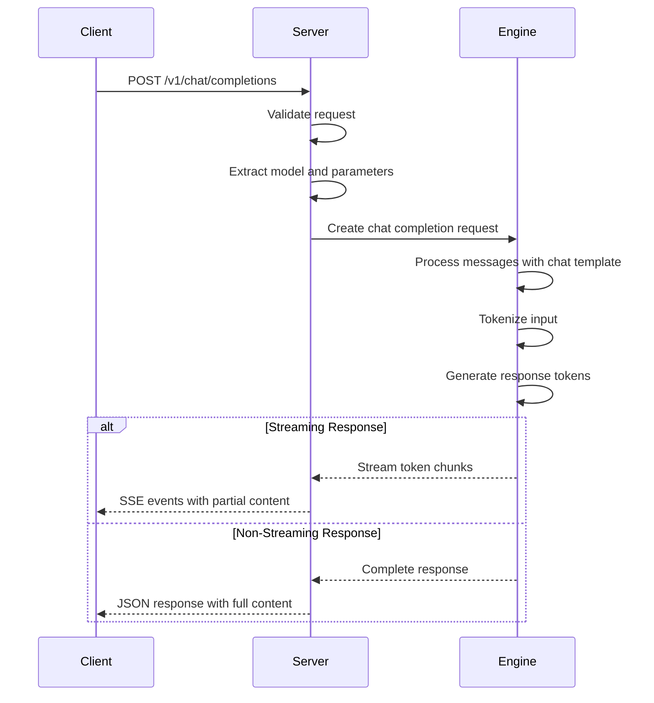
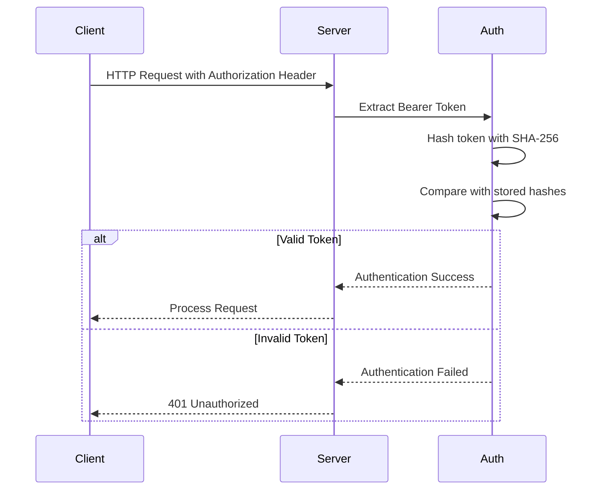
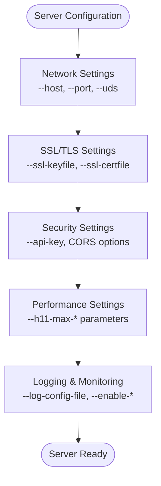
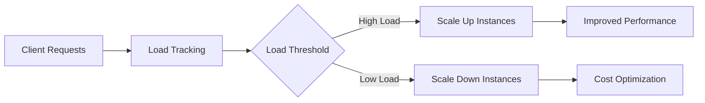

# API Server

<cite>
**Referenced Files in This Document**   
- [api_server.py](file://vllm/entrypoints/openai/api_server.py)
- [serving_chat.py](file://vllm/entrypoints/openai/serving_chat.py)
- [serving_completion.py](file://vllm/entrypoints/openai/serving_completion.py)
- [serving_tokenization.py](file://vllm/entrypoints/openai/serving_tokenization.py)
- [serving_transcription.py](file://vllm/entrypoints/openai/serving_transcription.py)
- [cli_args.py](file://vllm/entrypoints/openai/cli_args.py)
- [protocol.py](file://vllm/entrypoints/openai/protocol.py)
- [openai_chat_completion_client.py](file://examples/online_serving/openai_chat_completion_client.py)
- [constants.py](file://vllm/entrypoints/constants.py)
</cite>

## Table of Contents
1. [Introduction](#introduction)
2. [Server Architecture](#server-architecture)
3. [Core Endpoints](#core-endpoints)
4. [Authentication and Security](#authentication-and-security)
5. [Server Configuration](#server-configuration)
6. [Client Usage Examples](#client-usage-examples)
7. [Monitoring and Diagnostics](#monitoring-and-diagnostics)
8. [Performance Optimization](#performance-optimization)
9. [Troubleshooting](#troubleshooting)
10. [Conclusion](#conclusion)

## Introduction

The vLLM OpenAI-compatible HTTP server provides a RESTful API interface that mirrors the OpenAI API specification, enabling seamless integration with existing OpenAI client libraries and applications. This server acts as a translation layer between OpenAI API requests and vLLM's internal inference engine, allowing users to leverage vLLM's high-performance LLM serving capabilities with familiar OpenAI API patterns.

The API server supports multiple OpenAI API methods including chat completions, text completions, embeddings, and audio transcription/translation. It is built on FastAPI with uvicorn as the ASGI server, providing high-performance asynchronous request handling. The server architecture is designed to be both developer-friendly for testing and robust enough for production deployment scenarios.

**Section sources**
- [api_server.py](file://vllm/entrypoints/openai/api_server.py#L1-L50)
- [cli_args.py](file://vllm/entrypoints/openai/cli_args.py#L1-L50)

## Server Architecture

The vLLM OpenAI-compatible server follows a modular architecture with clear separation of concerns between the API interface, request processing, and the underlying inference engine. The architecture consists of several key components that work together to handle incoming requests and generate responses.

```mermaid
graph TB
Client[OpenAI Client] --> |HTTP Requests| APIGateway[API Gateway]
APIGateway --> CORSMiddleware[CORS Middleware]
APIGateway --> AuthMiddleware[Authentication Middleware]
APIGateway --> RequestIDMiddleware[X-Request-Id Middleware]
APIGateway --> ScalingMiddleware[Scaling Middleware]
APIGateway --> Router[API Router]
Router --> Health[/health]
Router --> Models[/v1/models]
Router --> Chat[/v1/chat/completions]
Router --> Completion[/v1/completions]
Router --> Tokenize[/tokenize]
Router --> Detokenize[/detokenize]
Router --> Transcription[/v1/audio/transcriptions]
Router --> Translation[/v1/audio/translations]
Chat --> ChatHandler[Chat Completion Handler]
Completion --> CompletionHandler[Completion Handler]
Tokenize --> TokenizationHandler[Tokenization Handler]
Transcription --> SpeechHandler[Speech-to-Text Handler]
ChatHandler --> Engine[AsyncLLMEngine]
CompletionHandler --> Engine
TokenizationHandler --> Engine
SpeechHandler --> Engine
Engine --> GPU[GPU Compute]
Engine --> KVCache[KV Cache]
Engine --> Scheduler[Request Scheduler]
style Client fill:#4CAF50,stroke:#388E3C
style APIGateway fill:#2196F3,stroke:#1976D2
style Engine fill:#FF9800,stroke:#F57C00
style GPU fill:#F44336,stroke:#D32F2F
```

**Diagram sources**
- [api_server.py](file://vllm/entrypoints/openai/api_server.py#L245-L246)
- [serving_chat.py](file://vllm/entrypoints/openai/serving_chat.py#L78-L159)
- [serving_completion.py](file://vllm/entrypoints/openai/serving_completion.py#L44-L55)

The server architecture features several middleware components that handle cross-cutting concerns:

- **CORS Middleware**: Manages Cross-Origin Resource Sharing policies, allowing configuration of allowed origins, methods, and headers
- **Authentication Middleware**: Validates API keys for authorized access to the server endpoints
- **Request ID Middleware**: Adds X-Request-Id headers to responses for request tracing and debugging
- **Scaling Middleware**: Prevents new requests during model scaling operations to maintain system stability

The API router directs incoming requests to specialized handlers based on the endpoint, with each handler responsible for processing a specific type of request (chat completions, text completions, etc.). These handlers translate the OpenAI API request format into vLLM's internal representation and interact with the AsyncLLMEngine for model inference.

**Section sources**
- [api_server.py](file://vllm/entrypoints/openai/api_server.py#L29-L37)
- [serving_engine.py](file://vllm/entrypoints/openai/serving_engine.py#L1-L50)

## Core Endpoints

The vLLM OpenAI-compatible server implements a comprehensive set of RESTful endpoints that mirror the OpenAI API specification. These endpoints support both streaming and non-streaming responses, providing flexibility for different application requirements.

### Chat Completions Endpoint

The chat completions endpoint is the primary interface for conversational AI applications, supporting multi-turn conversations with system, user, and assistant messages.

**HTTP Method**: POST
**URL Pattern**: `/v1/chat/completions`

**Request Schema**:
```json
{
  "model": "string",
  "messages": [
    {
      "role": "system|user|assistant",
      "content": "string"
    }
  ],
  "temperature": 0.7,
  "top_p": 1.0,
  "n": 1,
  "max_tokens": 1024,
  "stop": ["string"],
  "stream": false,
  "presence_penalty": 0.0,
  "frequency_penalty": 0.0,
  "logit_bias": {},
  "user": "string"
}
```

**Response Schema**:
```json
{
  "id": "string",
  "object": "chat.completion",
  "created": 1677652288,
  "model": "string",
  "choices": [
    {
      "index": 0,
      "message": {
        "role": "assistant",
        "content": "string"
      },
      "finish_reason": "stop|length|tool_calls|content_filter"
    }
  ],
  "usage": {
    "prompt_tokens": 100,
    "completion_tokens": 50,
    "total_tokens": 150
  }
}
```

The endpoint supports streaming responses via Server-Sent Events (SSE) when the `stream` parameter is set to `true`. Streaming responses emit JSON chunks with the `text/event-stream` content type, allowing clients to process responses incrementally.



**Diagram sources**
- [api_server.py](file://vllm/entrypoints/openai/api_server.py#L693-L730)
- [serving_chat.py](file://vllm/entrypoints/openai/serving_chat.py#L161-L200)

### Completions Endpoint

The completions endpoint provides text generation capabilities for applications that don't require the structured conversation format of the chat completions API.

**HTTP Method**: POST
**URL Pattern**: `/v1/completions`

**Request Schema**:
```json
{
  "model": "string",
  "prompt": "string|array",
  "suffix": "string",
  "max_tokens": 1024,
  "temperature": 0.7,
  "top_p": 1.0,
  "n": 1,
  "stream": false,
  "logprobs": null|integer,
  "echo": false,
  "stop": ["string"],
  "presence_penalty": 0.0,
  "frequency_penalty": 0.0,
  "best_of": 1,
  "logit_bias": {},
  "user": "string"
}
```

**Response Schema**:
```json
{
  "id": "string",
  "object": "text_completion",
  "created": 1677652288,
  "model": "string",
  "choices": [
    {
      "text": "string",
      "index": 0,
      "logprobs": null,
      "finish_reason": "stop|length|content_filter"
    }
  ],
  "usage": {
    "prompt_tokens": 100,
    "completion_tokens": 50,
    "total_tokens": 150
  }
}
```

Note that the `suffix` parameter is not currently supported by vLLM, as the underlying language models do not support this feature.

**Section sources**
- [api_server.py](file://vllm/entrypoints/openai/api_server.py#L733-L776)
- [serving_completion.py](file://vllm/entrypoints/openai/serving_completion.py#L79-L106)

### Tokenization Endpoints

The server provides endpoints for tokenization and detokenization operations, allowing clients to understand how text is processed by the model.

**Tokenize Endpoint**
- **HTTP Method**: POST
- **URL Pattern**: `/tokenize`
- **Request Schema**: `{ "model": "string", "input": "string|array" }`
- **Response Schema**: `{ "tokens": "array", "count": "integer" }`

**Detokenize Endpoint**
- **HTTP Method**: POST
- **URL Pattern**: `/detokenize`
- **Request Schema**: `{ "model": "string", "tokens": "array" }`
- **Response Schema**: `{ "text": "string" }`

These endpoints are particularly useful for debugging and understanding model behavior, as they reveal how input text is segmented into tokens that the model processes.

**Section sources**
- [api_server.py](file://vllm/entrypoints/openai/api_server.py#L433-L496)
- [serving_tokenization.py](file://vllm/entrypoints/openai/serving_tokenization.py#L1-L50)

### Audio Transcription and Translation Endpoints

The server supports speech-to-text functionality through transcription and translation endpoints.

**Transcription Endpoint**
- **HTTP Method**: POST
- **URL Pattern**: `/v1/audio/transcriptions`
- **Request Format**: multipart/form-data with audio file
- **Response Schema**: `{ "text": "string" }`

**Translation Endpoint**
- **HTTP Method**: POST
- **URL Pattern**: `/v1/audio/translations`
- **Request Format**: multipart/form-data with audio file
- **Response Schema**: `{ "text": "string" }`

These endpoints accept audio files in various formats and return the transcribed or translated text content.

**Section sources**
- [api_server.py](file://vllm/entrypoints/openai/api_server.py#L779-L854)
- [serving_transcription.py](file://vllm/entrypoints/openai/serving_transcription.py#L1-L50)

## Authentication and Security

The vLLM OpenAI-compatible server provides several security mechanisms to control access and protect against abuse.

### API Key Authentication

The server supports API key authentication through the `--api-key` command-line argument. When API keys are configured, clients must include a valid API key in the Authorization header of their requests.

```bash
curl http://localhost:8000/v1/chat/completions \
  -H "Authorization: Bearer YOUR_API_KEY" \
  -H "Content-Type: application/json" \
  -d '{
    "model": "meta-llama/Llama-2-7b-chat-hf",
    "messages": [{"role": "user", "content": "Hello!"}]
  }'
```

The server uses secure comparison functions to prevent timing attacks when validating API keys. Multiple API keys can be configured, and any valid key will grant access to the server.



**Diagram sources**
- [api_server.py](file://vllm/entrypoints/openai/api_server.py#L1100-L1132)
- [cli_args.py](file://vllm/entrypoints/openai/cli_args.py#L96-L97)

### CORS Configuration

Cross-Origin Resource Sharing (CORS) policies can be configured to control which domains can access the API server from web browsers. The default configuration allows all origins, methods, and headers, but this can be restricted for production deployments.

```python
# Default CORS settings
allowed_origins: ["*"]
allowed_methods: ["*"]
allowed_headers: ["*"]
```

These settings can be customized using the `--allowed-origins`, `--allowed-methods`, and `--allowed-headers` command-line arguments to implement more restrictive policies.

### Security Headers and Limits

The server includes several security-related headers and limits to protect against abuse:

- **Header Size Limits**: Configurable limits on header size and count to prevent header abuse attacks
- **Request ID Headers**: Optional X-Request-Id headers for tracing and debugging
- **Development Mode Warnings**: Security warnings when development endpoints are enabled

The server also supports SSL/TLS encryption for secure communication between clients and the server.

**Section sources**
- [api_server.py](file://vllm/entrypoints/openai/api_server.py#L110-L115)
- [cli_args.py](file://vllm/entrypoints/openai/cli_args.py#L88-L95)

## Server Configuration

The vLLM OpenAI-compatible server can be configured through command-line arguments to customize its behavior for different deployment scenarios.

### Basic Configuration Options

The server supports several fundamental configuration options for network and security settings:

**Host and Port Configuration**
- `--host`: Host address to bind (default: None, binds to all interfaces)
- `--port`: Port number (default: 8000)
- `--uds`: Unix domain socket path (alternative to host/port)

**SSL/TLS Configuration**
- `--ssl-keyfile`: Path to SSL key file
- `--ssl-certfile`: Path to SSL certificate file
- `--ssl-ca-certs`: Path to CA certificates file
- `--enable-ssl-refresh`: Refresh SSL context when certificate files change

**Example SSL Configuration**
```bash
vllm serve meta-llama/Llama-2-7b-chat-hf \
  --host 0.0.0.0 \
  --port 8443 \
  --ssl-keyfile /path/to/key.pem \
  --ssl-certfile /path/to/cert.pem
```

### Advanced Configuration Options

The server provides several advanced configuration options for fine-tuning its behavior:

**CORS Settings**
- `--allowed-origins`: Comma-separated list of allowed origins
- `--allowed-methods`: Comma-separated list of allowed HTTP methods
- `--allowed-headers`: Comma-separated list of allowed headers

**Authentication**
- `--api-key`: API key(s) for authentication (comma-separated for multiple keys)

**Logging and Monitoring**
- `--log-config-file`: Path to logging configuration JSON file
- `--enable-server-load-tracking`: Enable server load metrics endpoint
- `--enable-tokenizer-info-endpoint`: Enable tokenizer information endpoint

**Performance and Security**
- `--h11-max-incomplete-event-size`: Maximum size of incomplete HTTP events (default: 4MB)
- `--h11-max-header-count`: Maximum number of HTTP headers (default: 256)
- `--disable-frontend-multiprocessing`: Run frontend in same process as engine



**Diagram sources**
- [cli_args.py](file://vllm/entrypoints/openai/cli_args.py#L76-L192)
- [api_server.py](file://vllm/entrypoints/openai/api_server.py#L154-L177)

### Configuration via Environment Variables

Many server configuration options can also be controlled through environment variables, providing flexibility for containerized deployments:

- `VLLM_HOST`: Equivalent to `--host`
- `VLLM_PORT`: Equivalent to `--port`
- `VLLM_API_KEY`: Equivalent to `--api-key`
- `VLLM_LOGGING_CONFIG_PATH`: Path to logging configuration
- `VLLM_SERVER_DEV_MODE`: Enable development mode features

This environment variable support makes it easy to configure the server in Docker containers and Kubernetes deployments.

**Section sources**
- [cli_args.py](file://vllm/entrypoints/openai/cli_args.py#L18-L19)
- [envs.py](file://vllm/envs.py#L1-L10)

## Client Usage Examples

The vLLM OpenAI-compatible server can be accessed using standard OpenAI client libraries, making it easy to integrate with existing applications.

### Python Client Example

The following example demonstrates how to use the official OpenAI Python client to interact with the vLLM server:

```python
from openai import OpenAI

# Configure client to use vLLM server
client = OpenAI(
    api_key="EMPTY",  # vLLM doesn't require API key by default
    base_url="http://localhost:8000/v1"
)

# List available models
models = client.models.list()
print(f"Available models: {[model.id for model in models.data]}")

# Chat completion request
response = client.chat.completions.create(
    model="meta-llama/Llama-2-7b-chat-hf",
    messages=[
        {"role": "system", "content": "You are a helpful assistant."},
        {"role": "user", "content": "Who won the world series in 2020?"}
    ],
    max_tokens=100
)

print(response.choices[0].message.content)
```

**Section sources**
- [openai_chat_completion_client.py](file://examples/online_serving/openai_chat_completion_client.py#L1-L65)

### cURL Examples

The server can also be accessed directly using cURL commands:

**Chat Completion**
```bash
curl http://localhost:8000/v1/chat/completions \
  -H "Content-Type: application/json" \
  -d '{
    "model": "meta-llama/Llama-2-7b-chat-hf",
    "messages": [
      {"role": "user", "content": "Explain quantum computing in simple terms"}
    ],
    "max_tokens": 200
  }'
```

**Streaming Chat Completion**
```bash
curl http://localhost:8000/v1/chat/completions \
  -H "Content-Type: application/json" \
  -d '{
    "model": "meta-llama/Llama-2-7b-chat-hf",
    "messages": [
      {"role": "user", "content": "Tell me a joke"}
    ],
    "stream": true
  }'
```

**Tokenization**
```bash
curl http://localhost:8000/tokenize \
  -H "Content-Type: application/json" \
  -d '{
    "model": "meta-llama/Llama-2-7b-chat-hf",
    "input": "Hello, world!"
  }'
```

### Streaming Response Handling

For applications that benefit from incremental responses, the server supports streaming via Server-Sent Events (SSE). Here's an example of handling streaming responses in Python:

```python
import requests

def handle_streaming_response():
    url = "http://localhost:8000/v1/chat/completions"
    data = {
        "model": "meta-llama/Llama-2-7b-chat-hf",
        "messages": [{"role": "user", "content": "Write a poem about cats"}],
        "stream": True
    }
    
    response = requests.post(url, json=data, stream=True)
    
    for line in response.iter_lines():
        if line:
            # Remove 'data: ' prefix and parse JSON
            line = line.decode('utf-8')
            if line.startswith('data: '):
                content = line[6:]
                if content != '[DONE]':
                    try:
                        chunk = json.loads(content)
                        if 'choices' in chunk and len(chunk['choices']) > 0:
                            delta = chunk['choices'][0]['delta']
                            if 'content' in delta:
                                print(delta['content'], end='', flush=True)
                    except json.JSONDecodeError:
                        continue
```

**Section sources**
- [api_server.py](file://vllm/entrypoints/openai/api_server.py#L530-L541)
- [serving_chat.py](file://vllm/entrypoints/openai/serving_chat.py#L161-L200)

## Monitoring and Diagnostics

The vLLM server provides several endpoints and features for monitoring and diagnosing server performance and behavior.

### Health Check Endpoint

The health check endpoint provides a simple way to verify that the server is running and responsive:

**Endpoint**: `GET /health`
**Response**: HTTP 200 status code when server is healthy

This endpoint is commonly used in container orchestration systems like Kubernetes for liveness and readiness probes.

### Metrics and Monitoring

The server exposes Prometheus metrics for comprehensive monitoring:

**Metrics Endpoint**: `GET /metrics`
**Content Type**: `text/plain; version=0.0.4; charset=utf-8`

The metrics include information about:
- Request rates and latencies
- Token generation rates
- GPU memory usage
- Cache hit rates
- System resource utilization

These metrics can be scraped by Prometheus and visualized in Grafana for real-time monitoring and alerting.

### Server Load Tracking

When enabled with the `--enable-server-load-tracking` flag, the server provides a load metrics endpoint:

**Endpoint**: `GET /load`
**Response**: `{"server_load": current_load_value}`

This endpoint tracks the current server load, which can be used for load balancing and autoscaling decisions.



**Diagram sources**
- [api_server.py](file://vllm/entrypoints/openai/api_server.py#L336-L352)
- [cli_args.py](file://vllm/entrypoints/openai/cli_args.py#L174-L175)

### Development and Debugging Endpoints

In development mode (when `VLLM_SERVER_DEV_MODE` is set), additional diagnostic endpoints are available:

**Server Information**
- **Endpoint**: `GET /server_info`
- **Response**: Detailed server configuration in JSON or text format
- **Purpose**: Debugging configuration issues

**Prefix Cache Management**
- **Endpoint**: `POST /reset_prefix_cache`
- **Purpose**: Reset the prefix cache for testing

**Multi-modal Cache Management**
- **Endpoint**: `POST /reset_mm_cache`
- **Purpose**: Reset multi-modal cache for testing

These endpoints are disabled in production mode for security reasons.

**Section sources**
- [api_server.py](file://vllm/entrypoints/openai/api_server.py#L865-L895)
- [cli_args.py](file://vllm/entrypoints/openai/cli_args.py#L190-L191)

## Performance Optimization

The vLLM server includes several features and configuration options for optimizing performance in production environments.

### Request Batching

vLLM automatically batches multiple incoming requests to maximize GPU utilization. The server's scheduler groups requests with similar characteristics to optimize throughput:

- **Continuous Batching**: New requests are added to the batch as soon as slots become available
- **Paged Attention**: Efficient memory management for variable-length sequences
- **KV Cache Sharing**: Shared key-value caches for common prefix sequences

### Model Configuration

Performance can be optimized through model-specific configuration:

**Quantization**
- Use quantized models (e.g., AWQ, GPTQ) for reduced memory footprint and faster inference
- Balance between model quality and performance requirements

**Tensor Parallelism**
- Distribute model across multiple GPUs for larger models
- Configure with `--tensor-parallel-size` parameter

**GPU Memory Utilization**
- Adjust `--gpu-memory-utilization` to balance between throughput and stability
- Higher values increase throughput but may cause OOM errors

### Server Configuration

Several server-level configurations can improve performance:

**Frontend Multiprocessing**
- By default, the frontend runs in a separate process for better isolation
- Use `--disable-frontend-multiprocessing` to run in the same process for lower latency

**Connection Limits**
- Configure `--h11-max-*` parameters to balance security and performance
- Larger values allow more complex requests but increase memory usage

**Caching**
- Enable prefix caching to accelerate repeated requests with common prefixes
- Monitor cache hit rates through metrics

### Best Practices

**For High Throughput**
- Use larger batch sizes when possible
- Optimize prompt length to reduce processing time
- Use streaming responses to reduce client-side memory usage

**For Low Latency**
- Use smaller models for faster response times
- Minimize request processing overhead
- Consider model quantization

**For Cost Efficiency**
- Right-size GPU instances for your workload
- Use auto-scaling based on load metrics
- Monitor and optimize memory utilization

**Section sources**
- [cli_args.py](file://vllm/entrypoints/openai/cli_args.py#L141-L143)
- [api_server.py](file://vllm/entrypoints/openai/api_server.py#L130-L131)

## Troubleshooting

This section addresses common issues and their solutions when deploying and using the vLLM OpenAI-compatible server.

### Common Issues and Solutions

**Server Fails to Start**
- **Symptom**: Server crashes during startup
- **Solution**: Check GPU memory availability and reduce model size or batch size
- **Diagnostic**: Look for CUDA out of memory errors in logs

**Slow Response Times**
- **Symptom**: High latency for requests
- **Solution**: 
  - Check GPU utilization and memory usage
  - Optimize model configuration
  - Consider using a smaller model or quantized version
- **Diagnostic**: Monitor metrics for bottlenecks

**Authentication Failures**
- **Symptom**: 401 Unauthorized responses
- **Solution**: 
  - Verify API key configuration
  - Check that Authorization header is properly formatted
  - Ensure API keys match exactly (case-sensitive)
- **Diagnostic**: Enable detailed error logging with `--log-error-stack`

**Streaming Issues**
- **Symptom**: Streaming responses not working or incomplete
- **Solution**:
  - Ensure client properly handles Server-Sent Events format
  - Check for network interruptions
  - Verify server has `--disable-uvcorn-access-log` if logging interferes
- **Diagnostic**: Test with simple curl command to isolate issue

### Diagnostic Tools

The server provides several tools for diagnosing issues:

**Health Check**
```bash
curl http://localhost:8000/health
# Should return HTTP 200
```

**Model Availability**
```bash
curl http://localhost:8000/v1/models
# Should return list of available models
```

**Server Information** (development mode only)
```bash
curl http://localhost:8000/server_info
# Returns detailed configuration
```

### Logging and Debugging

Comprehensive logging is available for troubleshooting:

**Log Levels**
- `--uvicorn-log-level`: Controls uvicorn access and error logs
- `--log-error-stack`: Include stack traces in error responses (development mode)

**Log Configuration**
- Use `--log-config-file` to specify custom logging configuration
- Logs include request/response details when enabled

**Common Log Patterns**
- Look for "ERROR" or "WARNING" entries in logs
- Check for CUDA memory allocation failures
- Monitor for request timeouts or cancellations

**Section sources**
- [api_server.py](file://vllm/entrypoints/openai/api_server.py#L326-L334)
- [cli_args.py](file://vllm/entrypoints/openai/cli_args.py#L180-L181)

## Conclusion

The vLLM OpenAI-compatible HTTP server provides a robust, high-performance interface for serving large language models with a familiar OpenAI API interface. By implementing the complete OpenAI API specification, it enables seamless integration with existing applications and client libraries while leveraging vLLM's advanced inference optimizations.

Key features of the server include:
- Full compatibility with OpenAI API endpoints for chat completions, text completions, and other methods
- Support for both streaming and non-streaming responses
- Comprehensive security features including API key authentication and CORS configuration
- Extensive monitoring and diagnostics capabilities
- Flexible configuration options for various deployment scenarios

The server's modular architecture separates concerns between API handling, request processing, and model inference, making it both maintainable and extensible. Its design balances developer convenience with production readiness, making it suitable for both development and production environments.

For optimal deployment, consider the performance optimization strategies outlined in this documentation, particularly around model selection, quantization, and resource configuration. The monitoring and troubleshooting sections provide valuable tools for maintaining server health and diagnosing issues in production environments.

By following the best practices and configuration guidelines presented here, users can effectively deploy and manage the vLLM OpenAI-compatible server to meet their LLM serving requirements.