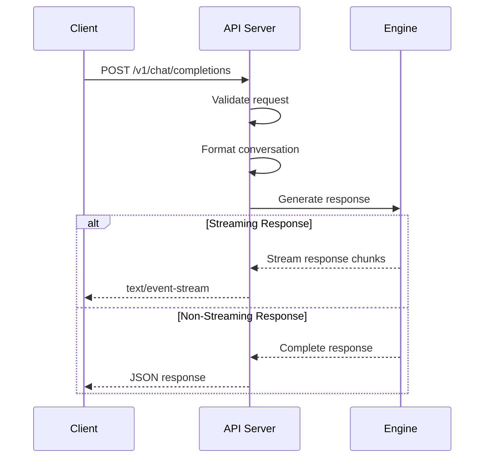
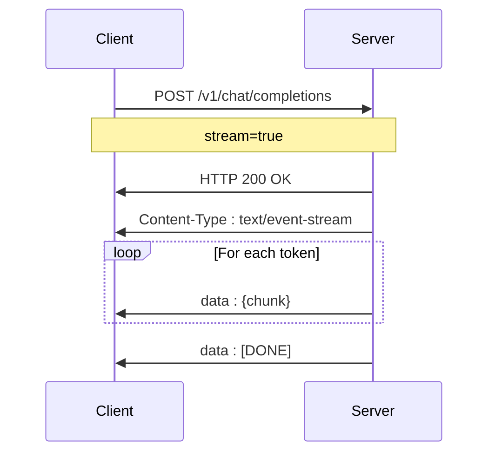

# Chat Completions API

<cite>
**Referenced Files in This Document**   
- [api_server.py](file://vllm/entrypoints/openai/api_server.py)
- [serving_chat.py](file://vllm/entrypoints/openai/serving_chat.py)
- [protocol.py](file://vllm/entrypoints/openai/protocol.py)
- [openai_chat_completion_client.py](file://examples/online_serving/openai_chat_completion_client.py)
- [openai_chat_completion_client_with_tools.py](file://examples/online_serving/openai_chat_completion_client_with_tools.py)
</cite>

## Table of Contents
1. [Introduction](#introduction)
2. [Endpoint Overview](#endpoint-overview)
3. [Request Schema](#request-schema)
4. [Response Schema](#response-schema)
5. [Streaming Responses](#streaming-responses)
6. [Tool Calling and Function Calling](#tool-calling-and-function-calling)
7. [Structured Output](#structured-output)
8. [Usage Examples](#usage-examples)
9. [Common Issues and Troubleshooting](#common-issues-and-troubleshooting)
10. [Performance Optimization](#performance-optimization)
11. [Integration Patterns](#integration-patterns)

## Introduction
The Chat Completions API endpoint in vLLM's OpenAI-compatible server provides a powerful interface for generating conversational responses from large language models. This API closely follows the OpenAI API specification while extending it with additional features and optimizations specific to vLLM's high-performance inference engine. The endpoint supports various sampling parameters, tool calling capabilities, structured output generation, and streaming responses, making it suitable for a wide range of applications from simple chatbots to complex agent systems.

**Section sources**
- [api_server.py](file://vllm/entrypoints/openai/api_server.py#L693-L730)
- [serving_chat.py](file://vllm/entrypoints/openai/serving_chat.py#L161-L172)

## Endpoint Overview
The Chat Completions API is accessible via an HTTP POST request to the `/v1/chat/completions` endpoint. This endpoint accepts JSON payloads containing conversation messages and various sampling parameters, returning either a complete response or a stream of response chunks.

The API follows the OpenAI chat completion specification with additional vLLM-specific extensions for enhanced functionality. The server processes the request by formatting the conversation according to the model's chat template, tokenizing the input, and generating responses using the specified sampling parameters.



**Diagram sources**
- [api_server.py](file://vllm/entrypoints/openai/api_server.py#L693-L730)
- [serving_chat.py](file://vllm/entrypoints/openai/serving_chat.py#L161-L172)

**Section sources**
- [api_server.py](file://vllm/entrypoints/openai/api_server.py#L693-L730)
- [serving_chat.py](file://vllm/entrypoints/openai/serving_chat.py#L161-L172)

## Request Schema
The Chat Completions API accepts a JSON request body with the following structure and parameters:

### Core Parameters
- **messages**: Array of message objects, each containing a role (system, user, assistant) and content
- **model**: Model identifier (optional if only one model is deployed)
- **temperature**: Sampling temperature (default: 1.0)
- **top_p**: Nucleus sampling parameter (default: 1.0)
- **n**: Number of completions to generate (default: 1)
- **stop**: Sequence(s) at which to stop generation
- **max_tokens**: Maximum number of tokens to generate
- **stream**: Boolean indicating whether to stream the response (default: false)

### Sampling Parameters
The API supports various sampling strategies and parameters:

| Parameter | Type | Description | Default |
|---------|------|-------------|---------|
| temperature | float | Controls randomness in sampling | 1.0 |
| top_p | float | Nucleus sampling threshold | 1.0 |
| top_k | int | Top-k sampling parameter | None |
| min_p | float | Minimum probability threshold | None |
| frequency_penalty | float | Penalizes repeated tokens | 0.0 |
| presence_penalty | float | Penalizes new topics | 0.0 |
| repetition_penalty | float | Penalizes token repetition | 1.0 |
| seed | int | Random seed for reproducible outputs | None |

### Advanced Parameters
Additional parameters provide fine-grained control over the generation process:

- **response_format**: Specifies the desired output format (text, JSON, etc.)
- **tools**: Array of tool/function definitions for function calling
- **tool_choice**: Controls tool selection behavior (none, auto, required)
- **logprobs**: Include log probabilities in the response
- **top_logprobs**: Number of top log probabilities to return
- **echo**: Echo the prompt in the response
- **add_generation_prompt**: Add generation prompt to the chat template
- **include_reasoning**: Include reasoning in the response
- **parallel_tool_calls**: Allow parallel tool calls

**Section sources**
- [protocol.py](file://vllm/entrypoints/openai/protocol.py#L511-L993)
- [serving_chat.py](file://vllm/entrypoints/openai/serving_chat.py#L284-L304)

## Response Schema
The API returns responses in a standardized format that includes the generated content, metadata, and usage statistics.

### Complete Response
For non-streaming requests, the API returns a JSON object with the following structure:

```json
{
  "id": "chatcmpl-123",
  "object": "chat.completion",
  "created": 1677652288,
  "model": "gpt-3.5-turbo",
  "choices": [
    {
      "index": 0,
      "message": {
        "role": "assistant",
        "content": "Hello! How can I help you today?"
      },
      "finish_reason": "stop"
    }
  ],
  "usage": {
    "prompt_tokens": 9,
    "completion_tokens": 12,
    "total_tokens": 21
  }
}
```

### Response Fields
The response contains the following key components:

#### Choices Array
Each choice object contains:
- **index**: Position in the choices array
- **message**: Generated message with role and content
- **finish_reason**: Reason for generation termination (stop, length, tool_calls, etc.)
- **logprobs**: Log probability information (if requested)

#### Usage Information
The usage object provides token count details:
- **prompt_tokens**: Number of tokens in the prompt
- **completion_tokens**: Number of tokens generated
- **total_tokens**: Sum of prompt and completion tokens
- **prompt_tokens_details**: Detailed breakdown of prompt tokens

#### Message Structure
The message object includes:
- **role**: Role of the message (assistant)
- **content**: Generated text content
- **tool_calls**: Array of tool calls (if applicable)
- **reasoning**: Reasoning content (if enabled)

**Section sources**
- [protocol.py](file://vllm/entrypoints/openai/protocol.py#L1491-L1520)
- [serving_chat.py](file://vllm/entrypoints/openai/serving_chat.py#L374-L382)

## Streaming Responses
The API supports streaming responses via the `text/event-stream` content type, allowing clients to receive and process response chunks as they are generated.

### Streaming Implementation
When the `stream` parameter is set to `true`, the server sends a series of Server-Sent Events (SSE) with the following format:

```text
data: {"id":"chatcmpl-123","object":"chat.completion.chunk","created":1677652288,"model":"gpt-3.5-turbo","choices":[{"index":0,"delta":{"content":"Hello"},"finish_reason":null}]}

data: {"id":"chatcmpl-123","object":"chat.completion.chunk","created":1677652288,"model":"gpt-3.5-turbo","choices":[{"index":0,"delta":{"content":"!"},"finish_reason":null}]}

data: {"id":"chatcmpl-123","object":"chat.completion.chunk","created":1677652288,"model":"gpt-3.5-turbo","choices":[{"index":0,"delta":{},"finish_reason":"stop"}]}

data: [DONE]
```

### Stream Options
The `stream_options` parameter allows customization of streaming behavior:

- **include_usage**: Include usage information in the stream
- **continuous_usage_stats**: Provide continuous usage statistics throughout the stream

Streaming is particularly useful for:
- Real-time chat applications
- Long-form content generation
- Progressive disclosure of information
- Reducing perceived latency



**Diagram sources**
- [api_server.py](file://vllm/entrypoints/openai/api_server.py#L730)
- [serving_chat.py](file://vllm/entrypoints/openai/serving_chat.py#L527-L732)

**Section sources**
- [api_server.py](file://vllm/entrypoints/openai/api_server.py#L730)
- [serving_chat.py](file://vllm/entrypoints/openai/serving_chat.py#L527-L732)

## Tool Calling and Function Calling
The API supports tool calling functionality, allowing models to interact with external systems and services.

### Tool Definition
Tools are defined in the request using the `tools` parameter:

```json
{
  "tools": [
    {
      "type": "function",
      "function": {
        "name": "get_current_weather",
        "description": "Get the current weather in a given location",
        "parameters": {
          "type": "object",
          "properties": {
            "location": {
              "type": "string",
              "description": "The city and state, e.g. San Francisco, CA"
            },
            "unit": {
              "type": "string",
              "enum": ["celsius", "fahrenheit"]
            }
          },
          "required": ["location"]
        }
      }
    }
  ],
  "tool_choice": "auto"
}
```

### Tool Choice Options
The `tool_choice` parameter controls how tools are selected:

- **none**: No tools are called
- **auto**: Model decides whether to call tools
- **required**: Model must call one of the provided tools
- **{type: "function", function: {name: "function_name"}}**: Specific function must be called

### Tool Call Response
When a tool call is generated, the response includes a `tool_calls` array:

```json
{
  "choices": [
    {
      "message": {
        "role": "assistant",
        "content": null,
        "tool_calls": [
          {
            "id": "call_123",
            "type": "function",
            "function": {
              "name": "get_current_weather",
              "arguments": "{\"location\": \"Boston, MA\", \"unit\": \"fahrenheit\"}"
            }
          }
        ]
      },
      "finish_reason": "tool_calls"
    }
  ]
}
```

Clients should:
1. Extract the tool call information from the response
2. Execute the corresponding function
3. Return the result in a subsequent request with role "tool"
4. Continue the conversation

**Section sources**
- [serving_chat.py](file://vllm/entrypoints/openai/serving_chat.py#L203-L223)
- [protocol.py](file://vllm/entrypoints/openai/protocol.py#L536-L542)
- [openai_chat_completion_client_with_tools.py](file://examples/online_serving/openai_chat_completion_client_with_tools.py#L169-L184)

## Structured Output
The API supports generating structured outputs in various formats, ensuring consistent and predictable response formats.

### JSON Schema Output
To generate JSON output according to a specific schema, use the `response_format` parameter:

```json
{
  "response_format": {
    "type": "json_schema",
    "json_schema": {
      "name": "weather_response",
      "schema": {
        "type": "object",
        "properties": {
          "temperature": {"type": "number"},
          "unit": {"type": "string", "enum": ["celsius", "fahrenheit"]},
          "description": {"type": "string"}
        },
        "required": ["temperature", "unit", "description"]
      }
    }
  }
}
```

### JSON Object Output
For simple JSON objects, use the `json_object` response format:

```json
{
  "response_format": {
    "type": "json_object"
  }
}
```

### Validation and Error Handling
The structured output system validates that generated content conforms to the specified schema. If validation fails, the API returns an error response. Clients should handle these errors by:
- Validating the schema definition
- Ensuring the model is capable of generating the requested format
- Providing clear instructions in the prompt

**Section sources**
- [protocol.py](file://vllm/entrypoints/openai/protocol.py#L771-L796)
- [serving_chat.py](file://vllm/entrypoints/openai/serving_chat.py#L771-L796)

## Usage Examples
This section provides practical examples of using the Chat Completions API with different clients.

### cURL Example
```bash
curl http://localhost:8000/v1/chat/completions \
  -H "Content-Type: application/json" \
  -d '{
    "model": "meta-llama/Llama-2-7b-chat-hf",
    "messages": [
      {"role": "system", "content": "You are a helpful assistant."},
      {"role": "user", "content": "Who won the world series in 2020?"}
    ],
    "temperature": 0.7,
    "max_tokens": 100
  }'
```

### Python Client Example
```python
from openai import OpenAI

client = OpenAI(
    api_key="EMPTY",
    base_url="http://localhost:8000/v1"
)

chat_completion = client.chat.completions.create(
    messages=[
        {"role": "system", "content": "You are a helpful assistant."},
        {"role": "user", "content": "Who won the world series in 2020?"}
    ],
    model="meta-llama/Llama-2-7b-chat-hf",
    temperature=0.7,
    max_tokens=100
)

print(chat_completion.choices[0].message.content)
```

### Streaming Example
```python
# Streaming response
stream = client.chat.completions.create(
    messages=[
        {"role": "user", "content": "Tell me about AI"}
    ],
    model="meta-llama/Llama-2-7b-chat-hf",
    stream=True
)

for chunk in stream:
    if chunk.choices[0].delta.content:
        print(chunk.choices[0].delta.content, end="", flush=True)
```

### Tool Calling Example
```python
tools = [
    {
        "type": "function",
        "function": {
            "name": "get_current_weather",
            "description": "Get the current weather in a given location",
            "parameters": {
                "type": "object",
                "properties": {
                    "location": {"type": "string"},
                    "unit": {"type": "string", "enum": ["celsius", "fahrenheit"]}
                },
                "required": ["location"]
            }
        }
    }
]

# Initial request with tool definition
response = client.chat.completions.create(
    messages=[
        {"role": "user", "content": "What's the weather in Boston?"}
    ],
    model="mistralai/Mistral-7B-Instruct-v0.3",
    tools=tools,
    tool_choice="auto"
)

# Extract tool call and execute function
tool_call = response.choices[0].message.tool_calls[0]
arguments = json.loads(tool_call.function.arguments)
result = get_current_weather(**arguments)

# Send tool result back
final_response = client.chat.completions.create(
    messages=[
        {"role": "user", "content": "What's the weather in Boston?"},
        {"role": "assistant", "tool_calls": [tool_call]},
        {"role": "tool", "content": result, "tool_call_id": tool_call.id}
    ],
    model="mistralai/Mistral-7B-Instruct-v0.3"
)
```

**Section sources**
- [openai_chat_completion_client.py](file://examples/online_serving/openai_chat_completion_client.py)
- [openai_chat_completion_client_with_tools.py](file://examples/online_serving/openai_chat_completion_client_with_tools.py)

## Common Issues and Troubleshooting
This section addresses common issues encountered when using the Chat Completions API and provides solutions.

### Message Formatting Errors
**Issue**: Invalid message structure or role assignment
**Solution**: Ensure messages follow the correct format:
- Each message must have a "role" and "content" field
- Roles must be one of: "system", "user", "assistant", "tool"
- Message order should follow conversation flow

### Token Limit Exceeded
**Issue**: Request exceeds model's maximum context length
**Solution**:
- Check the model's maximum token limit
- Reduce the number of messages in the conversation
- Use the `truncate_prompt_tokens` parameter to limit prompt length
- Implement conversation summarization for long histories

### Tool Calling Issues
**Issue**: Tool calls not being generated or parsed correctly
**Solution**:
- Ensure the model supports tool calling
- Use appropriate chat templates for tool calling models
- Verify tool definitions are correctly formatted
- Check that `tool_choice` parameter is set appropriately

### Streaming Connection Issues
**Issue**: Streaming connection closes prematurely
**Solution**:
- Ensure client properly handles Server-Sent Events
- Check network stability and timeout settings
- Verify server has sufficient resources
- Implement proper error handling and reconnection logic

### Performance Issues
**Issue**: Slow response times
**Solution**:
- Optimize sampling parameters (e.g., reduce max_tokens)
- Ensure adequate GPU resources
- Consider model quantization for faster inference
- Use batching for multiple requests

**Section sources**
- [serving_chat.py](file://vllm/entrypoints/openai/serving_chat.py)
- [protocol.py](file://vllm/entrypoints/openai/protocol.py)
- [openai_chat_completion_client.py](file://examples/online_serving/openai_chat_completion_client.py)

## Performance Optimization
This section provides recommendations for optimizing performance in high-throughput scenarios.

### Batch Processing
For multiple independent requests, consider batching:
- Group multiple requests together when possible
- Use asynchronous processing to handle multiple requests concurrently
- Implement request queuing to manage load

### Sampling Parameter Tuning
Optimize sampling parameters for performance:
- Reduce `max_tokens` for shorter responses
- Use lower `temperature` for more deterministic outputs
- Adjust `top_p` and `top_k` to balance quality and speed
- Consider `use_beam_search` for higher quality at the cost of speed

### Caching Strategies
Implement caching to improve performance:
- Cache frequent responses to avoid redundant computation
- Use prefix caching for common conversation starters
- Implement result caching for expensive operations

### Resource Management
Optimize resource utilization:
- Monitor GPU memory usage and adjust batch sizes accordingly
- Use model quantization (e.g., GPTQ, AWQ) for reduced memory footprint
- Consider model parallelism for very large models
- Implement proper load balancing for multi-node deployments

### Connection Optimization
Optimize client-server connections:
- Use persistent connections to reduce overhead
- Implement connection pooling for high-throughput scenarios
- Compress request/response payloads when possible
- Use efficient data formats (e.g., binary protocols for internal communication)

**Section sources**
- [serving_chat.py](file://vllm/entrypoints/openai/serving_chat.py)
- [api_server.py](file://vllm/entrypoints/openai/api_server.py)

## Integration Patterns
This section describes common integration patterns for using the Chat Completions API with frontend applications.

### Real-time Chat Interface
For real-time chat applications:
- Use streaming responses to provide immediate feedback
- Implement typing indicators while waiting for responses
- Handle partial responses to update the UI progressively
- Support message editing and regeneration

### Agent Systems
For building agent systems:
- Implement tool calling to extend model capabilities
- Use structured output for reliable data extraction
- Chain multiple API calls for complex workflows
- Implement memory and context management

### Content Generation
For content generation applications:
- Use appropriate sampling parameters for creative vs. factual content
- Implement templates for consistent output formats
- Use system messages to guide content style and tone
- Implement post-processing for formatting and validation

### Hybrid Applications
For applications combining multiple AI services:
- Integrate with speech-to-text and text-to-speech services
- Combine with retrieval-augmented generation (RAG) systems
- Implement multimodal capabilities when supported
- Use the API as part of a larger AI pipeline

**Section sources**
- [openai_chat_completion_client.py](file://examples/online_serving/openai_chat_completion_client.py)
- [openai_chat_completion_client_with_tools.py](file://examples/online_serving/openai_chat_completion_client_with_tools.py)