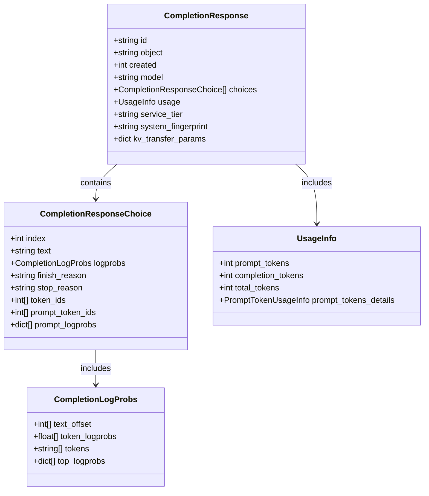
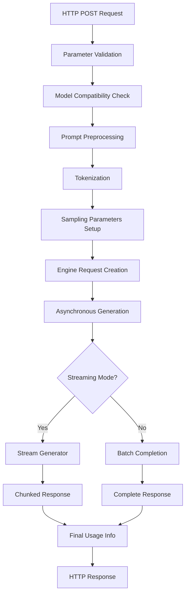
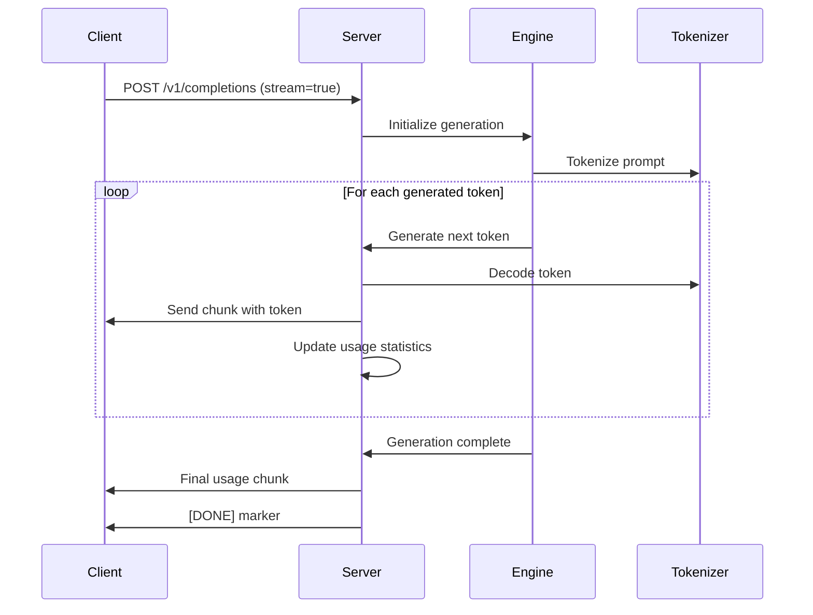
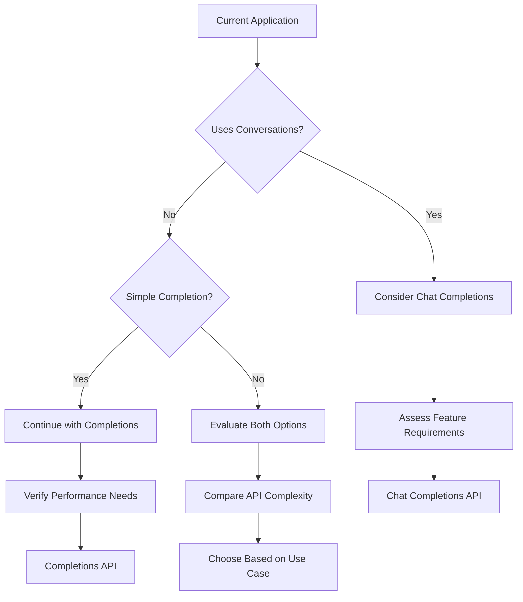

# Completions API

<cite>
**Referenced Files in This Document**
- [serving_completion.py](file://vllm/entrypoints/openai/serving_completion.py)
- [protocol.py](file://vllm/entrypoints/openai/protocol.py)
- [openai_completion_client.py](file://examples/online_serving/openai_completion_client.py)
- [test_completion.py](file://tests/v1/entrypoints/openai/test_completion.py)
- [api_server.py](file://vllm/entrypoints/openai/api_server.py)
- [backend_request_func.py](file://benchmarks/backend_request_func.py)
</cite>

## Table of Contents
1. [Introduction](#introduction)
2. [API Endpoint Overview](#api-endpoint-overview)
3. [Request Parameters](#request-parameters)
4. [Response Format](#response-format)
5. [Implementation Details](#implementation-details)
6. [Differences from Modern Chat Completions](#differences-from-modern-chat-completions)
7. [Examples and Use Cases](#examples-and-use-cases)
8. [Common Issues and Solutions](#common-issues-and-solutions)
9. [Choosing Between APIs](#choosing-between-apis)
10. [Best Practices](#best-practices)

## Introduction

The Completions API endpoint in vLLM provides compatibility with OpenAI's legacy completion interface, offering a straightforward way to generate text completions for various applications. This endpoint serves as a bridge for applications that rely on the traditional completion-style API while leveraging vLLM's high-performance inference capabilities.

The Completions API is designed to mimic OpenAI's original completion interface, making it easy to migrate existing applications that use OpenAI's completion API to vLLM without significant code changes.

## API Endpoint Overview

### HTTP Method and URL Pattern

The Completions API uses the HTTP POST method with the following URL pattern:

```
POST /v1/completions
```

### Base Configuration

The endpoint is configured to handle both streaming and non-streaming requests, with comprehensive parameter support for controlling generation behavior, token limits, and response formatting.

**Section sources**
- [serving_completion.py](file://vllm/entrypoints/openai/serving_completion.py#L79-L89)

## Request Parameters

The Completions API accepts a comprehensive set of parameters that control text generation behavior, token management, and response formatting.

### Core Generation Parameters

| Parameter | Type | Description | Default |
|-----------|------|-------------|---------|
| `model` | string | The model to use for completion | Required |
| `prompt` | string/array | The input prompt(s) for completion | Required |
| `max_tokens` | integer | Maximum number of tokens to generate | 16 |
| `temperature` | float | Controls randomness in generation | 1.0 |
| `top_p` | float | Nucleus sampling parameter | 1.0 |
| `top_k` | integer | Top-k sampling parameter | 0 (disabled) |
| `min_p` | float | Minimum probability threshold | 0.0 |

### Control Parameters

| Parameter | Type | Description | Default |
|-----------|------|-------------|---------|
| `frequency_penalty` | float | Frequency penalty for repeated tokens | 0.0 |
| `presence_penalty` | float | Presence penalty for token occurrence | 0.0 |
| `repetition_penalty` | float | Repetition penalty multiplier | 1.0 |
| `seed` | integer | Random seed for reproducible results | None |
| `stop` | string/array | Stop sequences to halt generation | [] |
| `ignore_eos` | boolean | Continue generation past EOS token | false |

### Advanced Parameters

| Parameter | Type | Description | Default |
|-----------|------|-------------|---------|
| `logprobs` | integer | Number of log probabilities to return | None |
| `echo` | boolean | Include prompt in response | false |
| `n` | integer | Number of completions to generate | 1 |
| `stream` | boolean | Enable streaming response | false |
| `logit_bias` | object | Bias logits for specific tokens | {} |
| `allowed_token_ids` | array | Allowed token IDs for generation | [] |

### Specialized Parameters

| Parameter | Type | Description | Default |
|-----------|------|-------------|---------|
| `use_beam_search` | boolean | Use beam search instead of sampling | false |
| `length_penalty` | float | Length penalty for beam search | 1.0 |
| `truncate_prompt_tokens` | integer | Truncate prompt to specified tokens | None |
| `prompt_embeds` | bytes/array | Alternative to prompt for embeddings | None |
| `response_format` | object | Specify response format (JSON, text, etc.) | None |

**Section sources**
- [protocol.py](file://vllm/entrypoints/openai/protocol.py#L996-L1127)

## Response Format

The Completions API returns responses in a standardized format that mirrors OpenAI's completion responses, with additional vLLM-specific fields for enhanced functionality.

### Standard Response Structure



**Diagram sources**
- [protocol.py](file://vllm/entrypoints/openai/protocol.py#L1360-L1368)
- [protocol.py](file://vllm/entrypoints/openai/protocol.py#L1342-L1357)
- [protocol.py](file://vllm/entrypoints/openai/protocol.py#L1335-L1339)

### Response Fields

| Field | Type | Description |
|-------|------|-------------|
| `id` | string | Unique identifier for the completion request |
| `object` | string | Object type identifier ("text_completion") |
| `created` | integer | Unix timestamp of completion creation |
| `model` | string | Model used for completion |
| `choices` | array | Array of completion choices |
| `usage` | object | Token usage statistics |
| `service_tier` | string | Service tier designation |
| `system_fingerprint` | string | System fingerprint for debugging |
| `kv_transfer_params` | object | KV transfer parameters (disaggregated serving) |

### Choice Object Structure

Each completion choice contains:

| Field | Type | Description |
|-------|------|-------------|
| `index` | integer | Index of the choice in the choices array |
| `text` | string | Generated text content |
| `logprobs` | object | Log probability information (if requested) |
| `finish_reason` | string | Reason for completion termination |
| `stop_reason` | string/integer | Specific stop condition |
| `token_ids` | array | Generated token IDs (if requested) |
| `prompt_token_ids` | array | Original prompt token IDs (if requested) |
| `prompt_logprobs` | array | Log probabilities for prompt tokens (if requested) |

### Usage Information

The `usage` field provides comprehensive token statistics:

| Field | Type | Description |
|-------|------|-------------|
| `prompt_tokens` | integer | Number of tokens in the input prompt |
| `completion_tokens` | integer | Number of tokens in the generated text |
| `total_tokens` | integer | Sum of prompt and completion tokens |
| `prompt_tokens_details.cached_tokens` | integer | Number of cached prompt tokens (if enabled) |

**Section sources**
- [protocol.py](file://vllm/entrypoints/openai/protocol.py#L1360-L1368)
- [protocol.py](file://vllm/entrypoints/openai/protocol.py#L1342-L1357)

## Implementation Details

### Core Processing Pipeline

The Completions API implementation follows a sophisticated pipeline that handles prompt processing, tokenization, generation, and response formatting.



**Diagram sources**
- [serving_completion.py](file://vllm/entrypoints/openai/serving_completion.py#L79-L318)

### Request Processing Workflow

The completion request processing involves several key stages:

1. **Validation and Sanitization**: Input parameters are validated against OpenAI's specification
2. **Model Compatibility**: Ensures the requested model supports completion-style generation
3. **Prompt Rendering**: Converts prompts to engine-compatible format using tokenizer templates
4. **Sampling Configuration**: Sets up generation parameters based on request
5. **Engine Integration**: Interfaces with vLLM's inference engine for text generation
6. **Response Formatting**: Constructs final response according to OpenAI's format

### Streaming Implementation

For streaming responses, the implementation provides real-time token delivery with continuous usage statistics:



**Diagram sources**
- [serving_completion.py](file://vllm/entrypoints/openai/serving_completion.py#L320-L505)

**Section sources**
- [serving_completion.py](file://vllm/entrypoints/openai/serving_completion.py#L79-L318)

## Differences from Modern Chat Completions

The Completions API maintains compatibility with OpenAI's legacy interface while incorporating vLLM's advanced features. Understanding these differences helps developers choose the appropriate API for their use cases.

### Interface Differences

| Aspect | Completions API | Chat Completions API |
|--------|----------------|---------------------|
| **Input Format** | Plain text prompts | Structured message arrays |
| **Role System** | No role separation | Role-based conversations |
| **System Messages** | Not supported | Supported via system role |
| **Function Calling** | Limited support | Full function calling |
| **Tool Use** | Basic support | Advanced tool integration |
| **Structured Output** | JSON/object support | Enhanced structured formats |

### Feature Support Matrix

| Feature | Completions API | Chat Completions API |
|---------|----------------|---------------------|
| **Basic Text Completion** | ✅ Full support | ✅ Full support |
| **Streaming** | ✅ Real-time tokens | ✅ Enhanced streaming |
| **Log Probabilities** | ✅ Token-level probs | ✅ Enhanced logprobs |
| **Prompt Embeddings** | ✅ Supported | ❌ Not applicable |
| **Beam Search** | ✅ Available | ❌ Not supported |
| **Structured Outputs** | ✅ JSON/schema | ✅ Advanced formats |
| **Function Calls** | ⚠️ Limited | ✅ Full support |
| **Tool Use** | ⚠️ Basic | ✅ Advanced integration |

### Migration Considerations

When migrating from legacy completion systems to vLLM's Completions API:

1. **Parameter Mapping**: Most parameters map directly, but some may require adjustment
2. **Response Parsing**: Response format remains compatible with OpenAI's specification
3. **Feature Limitations**: Some advanced features available in Chat Completions are not supported
4. **Performance Benefits**: Significant speed improvements with vLLM's optimized inference

**Section sources**
- [serving_completion.py](file://vllm/entrypoints/openai/serving_completion.py#L84-L92)

## Examples and Use Cases

### Text Generation Example

Basic text completion for creative writing or content generation:

```python
# Example: Creative writing assistant
client = OpenAI(api_key="EMPTY", base_url="http://localhost:8000/v1")

completion = client.completions.create(
    model="your-model-name",
    prompt="Once upon a time in a land far, far away",
    max_tokens=100,
    temperature=0.7,
    top_p=0.9,
    n=1,
    stream=False
)

print(completion.choices[0].text)
```

### Code Completion Example

Programming assistance with syntax preservation:

```python
# Example: Code completion for Python
completion = client.completions.create(
    model="your-model-name",
    prompt="# Define a function to calculate factorial\n\ndef factorial(n):\n    ",
    max_tokens=50,
    temperature=0.1,
    top_p=0.8,
    echo=True,  # Include prompt in response
    logprobs=3  # Show token probabilities
)
```

### Content Creation Example

Marketing copy generation with multiple variations:

```python
# Example: Marketing copy generation
prompts = [
    "Write a catchy tagline for a new coffee brand",
    "Create a promotional paragraph for a luxury hotel",
    "Develop a social media caption for a fashion brand"
]

for i, prompt in enumerate(prompts):
    completion = client.completions.create(
        model="your-model-name",
        prompt=prompt,
        max_tokens=80,
        temperature=0.8,
        n=3,  # Generate 3 variations
        seed=i  # Different seeds for variety
    )
    
    print(f"Variations for prompt {i+1}:")
    for j, choice in enumerate(completion.choices):
        print(f"  Variation {j+1}: {choice.text.strip()}")
```

### Multi-turn Conversation Simulation

Simulating conversation-like interactions using completion-style prompts:

```python
# Example: Simulated conversation
conversation_history = [
    "User: What is machine learning?",
    "Assistant: Machine learning is a subset of artificial intelligence...",
    "User: Can you explain neural networks?"
]

full_prompt = "\n".join(conversation_history) + "\nAssistant:"
completion = client.completions.create(
    model="your-model-name",
    prompt=full_prompt,
    max_tokens=150,
    temperature=0.6,
    stop=["\nUser:"],  # Prevent user input continuation
    echo=True  # Show the full conversation
)
```

**Section sources**
- [openai_completion_client.py](file://examples/online_serving/openai_completion_client.py#L31-L47)

## Common Issues and Solutions

### Prompt Truncation Issues

**Problem**: Prompts exceeding model's context length cause errors or unexpected behavior.

**Solution**: Use the `truncate_prompt_tokens` parameter to automatically truncate long prompts:

```python
completion = client.completions.create(
    model="your-model-name",
    prompt=long_text,
    max_tokens=100,
    truncate_prompt_tokens=4096,  # Truncate to model's context limit
    # or use -1 to automatically truncate to max_model_len
)
```

### Token Overflow Handling

**Problem**: Requested tokens exceed available context or memory limits.

**Solution**: Monitor token usage and adjust parameters dynamically:

```python
try:
    completion = client.completions.create(
        model="your-model-name",
        prompt=prompt,
        max_tokens=max_tokens
    )
    # Check if usage is reasonable
    if completion.usage.total_tokens > model_context_limit:
        # Reduce max_tokens or split prompt
        adjusted_tokens = model_context_limit - prompt_token_count - 10
        completion = client.completions.create(...)
except openai.BadRequestError as e:
    # Handle token overflow gracefully
    print(f"Token overflow: {e}")
```

### Log Probability Limitations

**Problem**: Requesting too many log probabilities causes performance issues or errors.

**Solution**: Limit logprobs to reasonable values:

```python
# Recommended: Limit to 5-10 logprobs for performance
completion = client.completions.create(
    model="your-model-name",
    prompt="Sample text",
    max_tokens=20,
    logprobs=5  # Sufficient for most use cases
)
```

### Streaming Response Issues

**Problem**: Streaming responses may be interrupted or incomplete.

**Solution**: Implement robust error handling for streaming:

```python
try:
    stream = client.completions.create(
        model="your-model-name",
        prompt="Long text",
        max_tokens=1000,
        stream=True
    )
    
    full_text = ""
    for chunk in stream:
        if chunk.choices[0].text:
            full_text += chunk.choices[0].text
            # Process incremental text here
    
    print(f"Full completion: {full_text}")
    
except openai.APIConnectionError as e:
    print(f"Connection error during streaming: {e}")
except openai.Timeout as e:
    print(f"Timeout during streaming: {e}")
```

### Echo Mode Conflicts

**Problem**: Using `echo=True` with `max_tokens=0` produces unexpected results.

**Solution**: Understand echo behavior and adjust accordingly:

```python
# Echo with generation (typical use case)
completion = client.completions.create(
    model="your-model-name",
    prompt="Hello world",
    max_tokens=10,  # Generates 10 tokens after prompt
    echo=True
)
# Result: "Hello world" + 10 generated tokens

# Echo only (no generation)
completion = client.completions.create(
    model="your-model-name",
    prompt="Hello world",
    max_tokens=0,  # No generation
    echo=True
)
# Result: Only the prompt "Hello world"
```

**Section sources**
- [test_completion.py](file://tests/v1/entrypoints/openai/test_completion.py#L148-L187)

## Choosing Between APIs

### When to Use Completions API

Choose the Completions API when:

1. **Legacy System Compatibility**: Working with existing systems that expect completion-style responses
2. **Simple Text Generation**: Need straightforward text completion without conversation context
3. **Performance Requirements**: Require maximum inference speed for single-turn generation
4. **Integration Simplicity**: Want minimal code changes when migrating from OpenAI's completion API
5. **Batch Processing**: Processing large batches of independent text generation tasks

### When to Use Chat Completions API

Choose the Chat Completions API when:

1. **Conversation Management**: Building applications requiring multi-turn conversations
2. **Advanced Features**: Need function calling, tool use, or structured outputs
3. **Role-based Interactions**: Implementing user-assistant or multi-party conversations
4. **Context Preservation**: Maintaining conversation history across multiple turns
5. **Modern AI Capabilities**: Leveraging latest AI features and improvements

### Migration Strategy

For applications considering migration:



### Performance Comparison

| Aspect | Completions API | Chat Completions API |
|--------|----------------|---------------------|
| **Latency** | Lower for single-turn | Higher due to conversation overhead |
| **Throughput** | Higher for independent tasks | Better for conversational workloads |
| **Memory Usage** | Lower per request | Higher due to context management |
| **Scalability** | Excellent for batch | Good with connection pooling |
| **Development Effort** | Minimal changes needed | Moderate refactoring required |

## Best Practices

### Parameter Optimization

1. **Temperature Tuning**: Use 0.0-0.3 for factual content, 0.7-0.9 for creative tasks
2. **Top-p vs Top-k**: Use top-p for natural language, top-k for structured content
3. **Max Tokens**: Set based on expected output length, leave buffer for safety
4. **Seed Usage**: Use for reproducible results in testing and debugging

### Error Handling

```python
import openai
from openai import APIError, RateLimitError, Timeout

def robust_completion(client, **kwargs):
    """Wrapper for reliable completion requests"""
    max_retries = 3
    base_delay = 1
    
    for attempt in range(max_retries):
        try:
            return client.completions.create(**kwargs)
            
        except RateLimitError:
            if attempt < max_retries - 1:
                delay = base_delay * (2 ** attempt)
                time.sleep(delay)
                continue
            raise
            
        except APIError as e:
            if "token" in str(e).lower():
                # Adjust parameters for token-related errors
                if "max_tokens" in kwargs:
                    kwargs["max_tokens"] = max(1, kwargs["max_tokens"] // 2)
                continue
            raise
            
        except Timeout:
            if attempt < max_retries - 1:
                continue
            raise
```

### Monitoring and Logging

```python
import logging
from datetime import datetime

def log_completion_request(request_data, response_data):
    """Log completion requests for monitoring"""
    logging.info({
        "timestamp": datetime.now().isoformat(),
        "model": request_data.get("model"),
        "prompt_length": len(str(request_data.get("prompt", ""))),
        "max_tokens": request_data.get("max_tokens"),
        "usage": response_data.get("usage"),
        "latency": response_data.get("latency"),
        "success": response_data.get("success")
    })
```

### Resource Management

1. **Connection Pooling**: Reuse client instances for multiple requests
2. **Batch Processing**: Group related requests for better throughput
3. **Caching**: Cache frequently used prompts and responses
4. **Rate Limiting**: Implement client-side rate limiting for production use

### Security Considerations

1. **Prompt Sanitization**: Validate and sanitize input prompts
2. **Access Control**: Implement proper authentication and authorization
3. **Content Filtering**: Consider adding content filtering for sensitive applications
4. **Audit Logging**: Log all completion requests for compliance and debugging

**Section sources**
- [backend_request_func.py](file://benchmarks/backend_request_func.py#L276-L306)