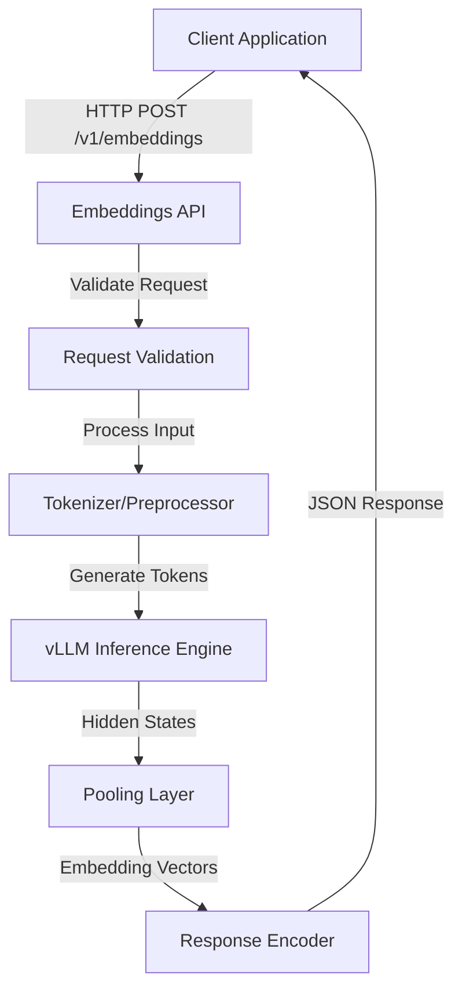
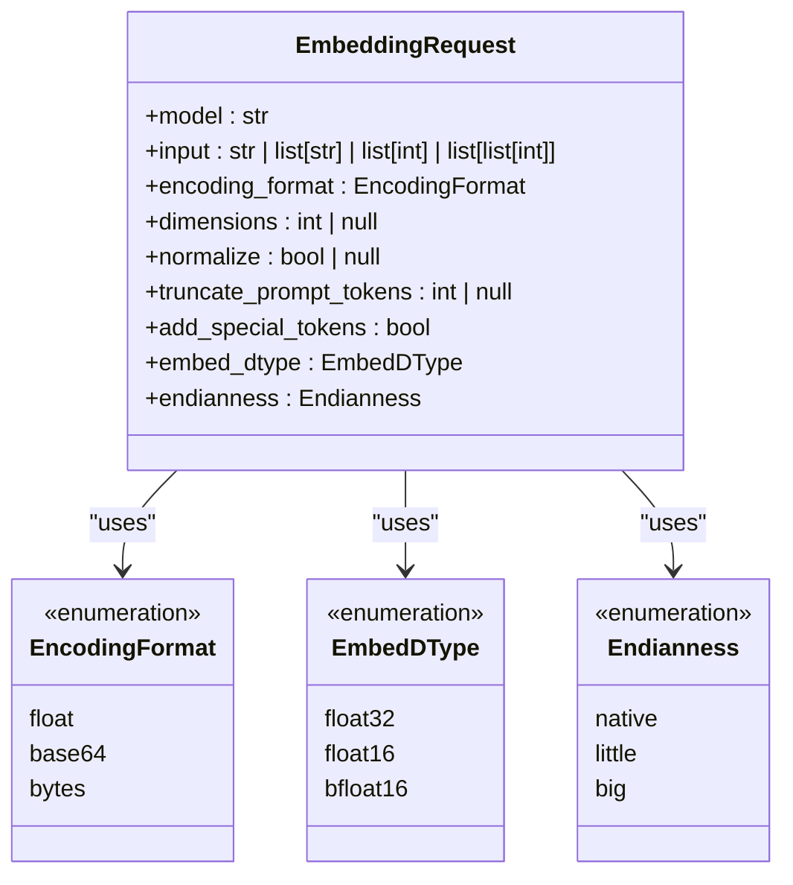
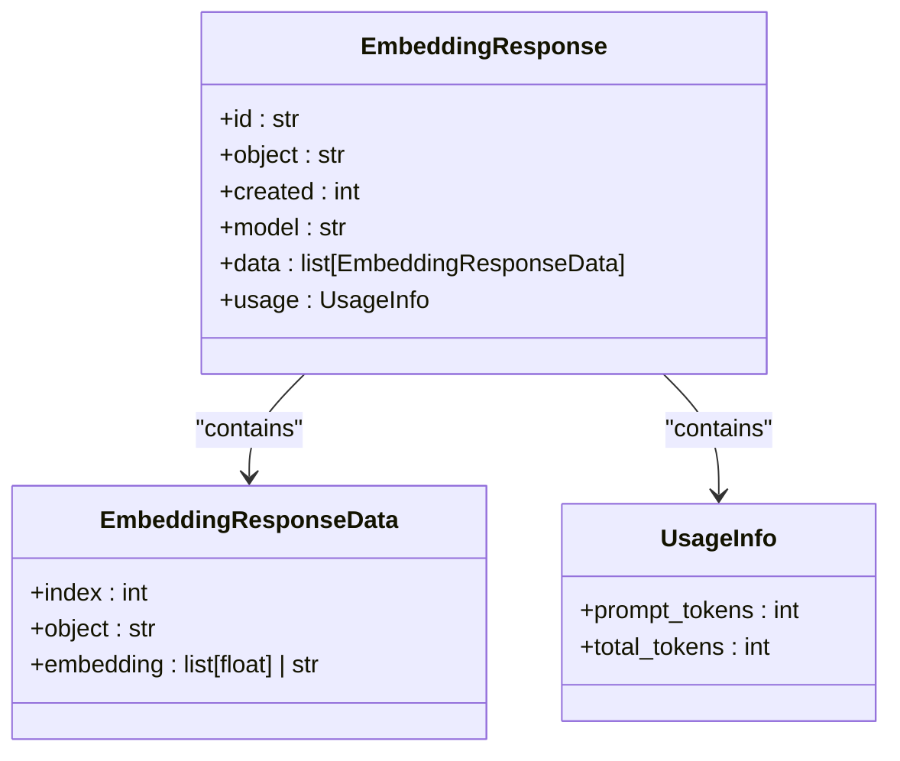
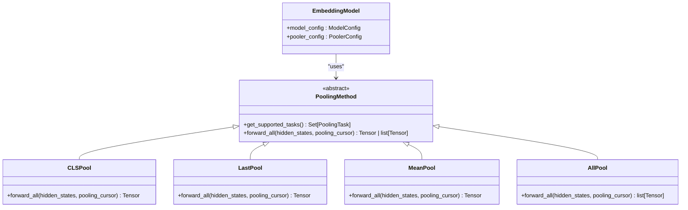
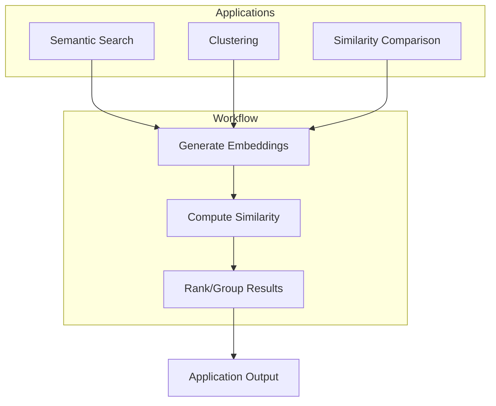

# Embeddings API

<cite>
**Referenced Files in This Document**   
- [api_server.py](file://vllm/entrypoints/openai/api_server.py)
- [serving.py](file://vllm/entrypoints/pooling/embed/serving.py)
- [protocol.py](file://vllm/entrypoints/pooling/embed/protocol.py)
- [pooler.py](file://vllm/model_executor/layers/pooler.py)
- [pooling_params.py](file://vllm/pooling_params.py)
- [embed_jina_embeddings_v3.py](file://examples/pooling/embed/embed_jina_embeddings_v3.py)
- [embedding_requests_base64_client.py](file://examples/pooling/embed/embedding_requests_base64_client.py)
</cite>

## Table of Contents
1. [Introduction](#introduction)
2. [API Endpoint Overview](#api-endpoint-overview)
3. [Request Parameters](#request-parameters)
4. [Response Schema](#response-schema)
5. [Pooling Methods and Model Integration](#pooling-methods-and-model-integration)
6. [Practical Applications](#practical-applications)
7. [Performance Considerations](#performance-considerations)
8. [Troubleshooting Guide](#troubleshooting-guide)
9. [Conclusion](#conclusion)

## Introduction

The Embeddings API endpoint in vLLM provides a powerful interface for generating text embeddings through the vLLM inference engine. This API enables users to convert text inputs into high-dimensional vector representations that capture semantic meaning, enabling various downstream applications such as semantic search, clustering, and similarity comparison. The API follows the OpenAI embeddings API specification, making it compatible with existing workflows while leveraging vLLM's optimized inference capabilities for embedding models.

The endpoint supports various pooling methods and embedding dimensions, allowing flexibility in how embeddings are generated from transformer model outputs. It integrates seamlessly with vLLM's efficient inference engine, providing high throughput and low latency for embedding generation tasks. The API supports both single and batch requests, with options for different encoding formats and data types to optimize for various use cases and performance requirements.

**Section sources**
- [api_server.py](file://vllm/entrypoints/openai/api_server.py#L91)
- [serving.py](file://vllm/entrypoints/pooling/embed/serving.py#L615)

## API Endpoint Overview

The Embeddings API exposes a single HTTP POST endpoint at the URL pattern `/v1/embeddings` for generating text embeddings. This endpoint accepts JSON payloads containing text inputs and configuration parameters, returning embedding vectors in a standardized format. The API is designed to be compatible with the OpenAI embeddings API specification, allowing easy integration with existing applications and tools.

The endpoint supports multiple input formats, including single strings, arrays of strings, token IDs, or arrays of token IDs, providing flexibility in how text data is provided. This allows users to either pass raw text for tokenization by the server or provide pre-tokenized inputs for more control over the tokenization process. The API handles the complete workflow from input processing through model inference to embedding generation and response formatting.

The endpoint is implemented as part of vLLM's OpenAI-compatible API server, which provides a comprehensive interface for various AI model interactions. The embeddings functionality is specifically handled by the `OpenAIServingEmbedding` class, which extends the base serving functionality to support embedding-specific operations and pooling methods.

**Diagram sources**
- [api_server.py](file://vllm/entrypoints/openai/api_server.py#L26)
- [serving.py](file://vllm/entrypoints/pooling/embed/serving.py#L615)
- [protocol.py](file://vllm/entrypoints/pooling/embed/protocol.py#L18)

## Request Parameters

The Embeddings API accepts several parameters in the request body to control embedding generation. The primary parameters include input, model, and encoding_format, with additional options for customization.

The `input` parameter accepts various formats including a single string, an array of strings, token IDs, or arrays of token IDs. This flexibility allows users to provide text data directly or use pre-tokenized inputs. The `model` parameter specifies which embedding model to use, with the system supporting various transformer-based embedding models that implement appropriate pooling methods.

The `encoding_format` parameter determines how embedding vectors are encoded in the response, with options for "float" (array of floats), "base64" (base64-encoded binary data), or "bytes" (streaming binary response). Additional parameters include `dimensions` for specifying the desired embedding dimensionality, `normalize` for controlling vector normalization, and `truncate_prompt_tokens` for handling long inputs by truncation.

**Diagram sources**
- [protocol.py](file://vllm/entrypoints/pooling/embed/protocol.py#L18)
- [pooling_params.py](file://vllm/pooling_params.py#L42)

**Section sources**
- [protocol.py](file://vllm/entrypoints/pooling/embed/protocol.py#L18)
- [pooling_params.py](file://vllm/pooling_params.py#L42)

## Response Schema

The Embeddings API returns a standardized JSON response containing the generated embeddings and usage statistics. The response structure follows the OpenAI embeddings API specification, ensuring compatibility with existing applications.

The response includes a `data` array containing objects with embedding vectors, where each object has an `index` field indicating its position in the input batch and an `embedding` field containing the vector values. The embedding format depends on the `encoding_format` parameter, with options for float arrays, base64-encoded strings, or binary streaming responses.

The response also includes a `usage` object with `prompt_tokens` and `total_tokens` fields that track the number of tokens processed. This information is valuable for monitoring and billing purposes. The response contains metadata such as `id` and `created` timestamp for request tracking and debugging.

**Diagram sources**
- [protocol.py](file://vllm/entrypoints/pooling/embed/protocol.py#L196)
- [serving.py](file://vllm/entrypoints/pooling/embed/serving.py#L134)

## Pooling Methods and Model Integration

The Embeddings API leverages vLLM's pooling infrastructure to generate embeddings from transformer model outputs. Different pooling methods are available depending on the model architecture and use case requirements.

The system supports various pooling strategies including CLS (using the first token representation), LAST (using the last token representation), MEAN (averaging all token representations), and ALL (returning all token embeddings). The choice of pooling method depends on the model configuration and the specific embedding task. Models are configured with their supported pooling methods through the pooler configuration.

The integration with vLLM's inference engine allows efficient batch processing of embedding requests, with support for different embedding dimensions as specified by the model architecture. The system handles the complete workflow from input tokenization through model inference to pooling and output formatting, providing a seamless interface for embedding generation.

**Diagram sources**
- [pooler.py](file://vllm/model_executor/layers/pooler.py#L183)
- [serving.py](file://vllm/entrypoints/pooling/embed/serving.py#L61)

## Practical Applications

The Embeddings API enables various practical applications in natural language processing and information retrieval. Key use cases include semantic search, clustering, and similarity comparison.

For semantic search, embeddings can be generated for both queries and documents, with similarity measured using cosine distance or other metrics. This approach enables finding relevant content based on meaning rather than keyword matching. Clustering applications use embeddings to group similar texts together, useful for topic modeling or content organization.

Similarity comparison applications leverage embeddings to measure the semantic similarity between texts, useful for tasks like duplicate detection, paraphrase identification, or recommendation systems. The API's support for batch processing makes it efficient for computing similarity matrices across large collections of texts.

**Diagram sources**
- [embed_jina_embeddings_v3.py](file://examples/pooling/embed/embed_jina_embeddings_v3.py#L24)
- [embedding_requests_base64_client.py](file://examples/pooling/embed/embedding_requests_base64_client.py#L41)

## Performance Considerations

The Embeddings API includes several features to optimize performance for different use cases and deployment scenarios. Batch processing is supported to maximize throughput by processing multiple inputs simultaneously.

Memory usage patterns depend on the input length, batch size, and embedding dimensionality. The system implements efficient memory management through vLLM's paged attention mechanism, reducing memory overhead for long sequences. For very long inputs, chunked processing can be used to handle texts that exceed the model's maximum context length.

Performance can be further optimized by selecting appropriate encoding formats. Binary formats like base64 or bytes reduce response size and transmission time compared to float arrays, especially for high-dimensional embeddings. The choice of pooling method also affects performance, with simpler methods like CLS generally being faster than more complex operations like MEAN pooling.

**Section sources**
- [serving.py](file://vllm/entrypoints/pooling/embed/serving.py#L67)
- [pooler.py](file://vllm/model_executor/layers/pooler.py#L225)

## Troubleshooting Guide

Common issues with the Embeddings API include input length limitations, model compatibility problems, and configuration errors. Input texts that exceed the model's maximum context length will result in validation errors. This can be addressed by truncating long inputs using the `truncate_prompt_tokens` parameter or enabling chunked processing for models that support it.

Model compatibility issues may arise when using models that don't support embedding tasks or the requested pooling method. Ensure that the selected model is specifically designed for embedding generation and supports the required pooling strategy. Configuration errors can occur when specifying invalid parameter combinations or unsupported values.

Error responses follow the standard error format with descriptive messages to help diagnose issues. Monitoring tools and logging can provide additional insights into performance bottlenecks or resource constraints.

**Section sources**
- [serving.py](file://vllm/entrypoints/pooling/embed/serving.py#L295)
- [protocol.py](file://vllm/entrypoints/pooling/embed/protocol.py#L74)

## Conclusion

The Embeddings API in vLLM provides a robust and efficient interface for generating text embeddings with state-of-the-art transformer models. By leveraging vLLM's optimized inference engine, the API delivers high performance and scalability for embedding generation tasks. The comprehensive feature set, including support for various pooling methods, encoding formats, and batch processing, makes it suitable for a wide range of applications from semantic search to clustering and similarity analysis.

The API's compatibility with the OpenAI embeddings specification ensures easy integration with existing workflows while providing the performance benefits of vLLM's advanced inference optimizations. With proper configuration and understanding of the available parameters and pooling methods, users can effectively leverage this API for their embedding needs.