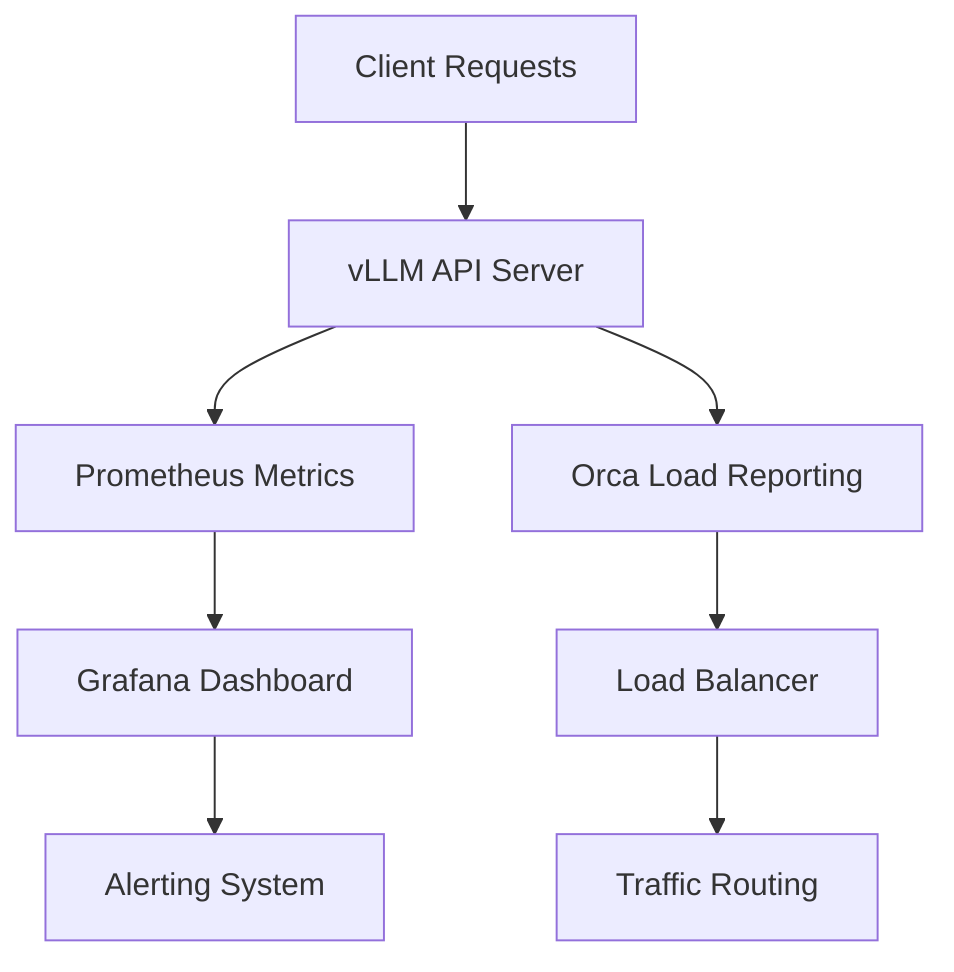

# Server Configuration

<cite>
**Referenced Files in This Document**   
- [api_server.py](file://vllm/entrypoints/openai/api_server.py)
- [cli_args.py](file://vllm/entrypoints/openai/cli_args.py)
- [launcher.py](file://vllm/entrypoints/launcher.py)
- [orca_metrics.py](file://vllm/entrypoints/openai/orca_metrics.py)
- [ssl.py](file://vllm/entrypoints/ssl.py)
- [constants.py](file://vllm/entrypoints/constants.py)
</cite>

## Table of Contents
1. [Introduction](#introduction)
2. [Server Configuration Overview](#server-configuration-overview)
3. [Command-Line Arguments and Environment Variables](#command-line-arguments-and-environment-variables)
4. [Model Loading and Distributed Serving](#model-loading-and-distributed-serving)
5. [Metrics and Monitoring Setup](#metrics-and-monitoring-setup)
6. [Security Configurations](#security-configurations)
7. [Production-Ready Configuration Examples](#production-ready-configuration-examples)
8. [Troubleshooting Common Issues](#troubleshooting-common-issues)
9. [Conclusion](#conclusion)

## Introduction
This document provides comprehensive guidance for configuring the vLLM OpenAI-compatible API server. It covers essential configuration options for deployment, performance optimization, security, and monitoring. The vLLM server enables high-performance serving of large language models with OpenAI API compatibility, supporting various deployment scenarios from development to production environments.

The configuration system is designed to be flexible, allowing users to customize server behavior through command-line arguments, environment variables, and configuration files. This documentation details all available configuration options, their purposes, and recommended settings for different use cases.

**Section sources**
- [api_server.py](file://vllm/entrypoints/openai/api_server.py#L1-L1892)
- [cli_args.py](file://vllm/entrypoints/openai/cli_args.py#L1-L303)

## Server Configuration Overview
The vLLM OpenAI-compatible API server is configured through a combination of command-line arguments, environment variables, and optional configuration files. The server is built on FastAPI and uvicorn, providing a robust foundation for serving large language models with high throughput and low latency.

The configuration system follows a hierarchical approach where command-line arguments take precedence over configuration file settings, which in turn override environment variables and default values. This allows for flexible deployment scenarios where base configurations can be defined in files and overridden for specific deployments.

The server supports various configuration aspects including network settings, security, model loading, distributed serving, and monitoring. Configuration options are organized into logical groups, with the main categories being frontend settings (API server configuration) and engine settings (model serving configuration).

**Section sources**
- [api_server.py](file://vllm/entrypoints/openai/api_server.py#L1-L1892)
- [cli_args.py](file://vllm/entrypoints/openai/cli_args.py#L1-L303)

## Command-Line Arguments and Environment Variables
The vLLM server provides extensive configuration options through command-line arguments and environment variables. These settings control server behavior, network configuration, security, and performance characteristics.

### Host and Port Configuration
The server's network interface can be configured using the following command-line arguments:

- `--host`: Specifies the host address to bind the server to. Default is None, which binds to all available interfaces.
- `--port`: Sets the port number for the server. Default is 8000, with validation ensuring the port is between 1024 and 65535.
- `--uds`: Allows specification of a Unix domain socket path, which takes precedence over host and port settings when provided.

These settings can also be controlled through environment variables when using wrapper scripts, such as in SageMaker deployments where the port is automatically set to 8080.

### SSL/TLS Configuration
Secure communication is supported through SSL/TLS configuration options:

- `--ssl-keyfile`: Path to the SSL key file for HTTPS encryption.
- `--ssl-certfile`: Path to the SSL certificate file.
- `--ssl-ca-certs`: Path to the CA certificates file for client certificate verification.
- `--ssl-cert-reqs`: Controls whether client certificates are required (using SSL module constants).
- `--enable-ssl-refresh`: Enables automatic refresh of SSL context when certificate files change.

These options allow for secure deployment in production environments, with support for certificate rotation without server restart when refresh is enabled.

### CORS Configuration
Cross-Origin Resource Sharing (CORS) settings control which origins can access the API:

- `--allowed-origins`: List of allowed origins (default is ["*"] for all origins).
- `--allowed-methods`: HTTP methods allowed in CORS requests (default ["*"]).
- `--allowed-headers`: Headers allowed in CORS requests (default ["*"]).
- `--allow-credentials`: Whether to allow credentials in CORS requests.

These settings can be provided as JSON-formatted strings to specify complex configurations.

### API Key Authentication
The server supports API key-based authentication for securing access:

- `--api-key`: One or more API keys that clients must provide in the Authorization header.
- Keys are stored as SHA-256 hashes for security.
- Authentication is required for all /v1/* endpoints when keys are configured.
- The authorization header must use the Bearer scheme.

**Section sources**
- [api_server.py](file://vllm/entrypoints/openai/api_server.py#L1-L1892)
- [cli_args.py](file://vllm/entrypoints/openai/cli_args.py#L76-L97)
- [launcher.py](file://vllm/entrypoints/launcher.py#L27-L176)
- [ssl.py](file://vllm/entrypoints/ssl.py)

## Model Loading and Distributed Serving
vLLM provides comprehensive options for model loading and distributed serving configurations to optimize performance across different hardware setups.

### Model Loading Configuration
The server supports various model loading options through the AsyncEngineArgs class:

- Model specification through positional arguments or configuration files.
- Support for LoRA (Low-Rank Adaptation) modules via `--lora-modules` with flexible configuration formats.
- Chat template configuration through `--chat-template` for custom prompt formatting.
- Various optimization settings for memory usage and computation efficiency.

### Tensor Parallelism and Distributed Serving
Distributed serving configurations enable scaling across multiple GPUs and nodes:

- `--tensor-parallel-size`: Number of GPUs to split model layers across.
- Support for expert parallelism in mixture-of-experts models.
- Context parallelism for handling long sequences.
- Sequence parallelism for improved throughput.

The server also supports disaggregated serving architectures where prefill and decode operations are handled by separate node groups, allowing for specialized hardware optimization.

### Configuration File Support
Configuration can be provided via YAML files using the `--config` argument:

- Allows centralized management of complex configurations.
- Supports all command-line options in structured format.
- Can be combined with command-line arguments for overrides.
- Provides better maintainability for production deployments.

**Section sources**
- [cli_args.py](file://vllm/entrypoints/openai/cli_args.py#L278-L303)
- [api_server.py](file://vllm/entrypoints/openai/api_server.py#L158-L243)
- [constants.py](file://vllm/entrypoints/constants.py)

## Metrics and Monitoring Setup
vLLM provides comprehensive metrics and monitoring capabilities to track server performance and health.

### Prometheus Integration
The server exposes metrics via a Prometheus endpoint at `/metrics`:

- Automatic integration with Prometheus monitoring systems.
- Metrics include request rates, latencies, GPU utilization, and KV cache usage.
- Configurable via standard Prometheus instrumentation.
- Accessible without authentication for monitoring purposes.

The metrics endpoint is automatically mounted in the FastAPI application and provides detailed performance data in Prometheus format.

### Orca Metrics Integration
vLLM supports Orca load reporting for advanced monitoring scenarios:

- Configurable through request headers to specify output format.
- Provides key metrics like KV cache utilization and request queue length.
- Supports both TEXT and JSON output formats.
- Enabled via the `enable_server_load_tracking` configuration option.

The Orca metrics system collects data from Prometheus and formats it according to the ORCA load reporting specification, allowing integration with advanced load balancing and monitoring systems.

### Monitoring Configuration
Key configuration options for monitoring include:

- `--enable-server-load-tracking`: Enables collection of server load metrics.
- Custom middleware can be added for specialized monitoring needs.
- Request logging can be enabled for detailed performance analysis.
- Health checks are available at the `/health` endpoint.



**Diagram sources **
- [api_server.py](file://vllm/entrypoints/openai/api_server.py#L252-L279)
- [orca_metrics.py](file://vllm/entrypoints/openai/orca_metrics.py#L16-L121)

**Section sources**
- [api_server.py](file://vllm/entrypoints/openai/api_server.py#L252-L279)
- [orca_metrics.py](file://vllm/entrypoints/openai/orca_metrics.py#L16-L121)

## Security Configurations
vLLM provides multiple layers of security configuration to protect deployments in production environments.

### Request Validation
The server includes built-in request validation mechanisms:

- Input validation for all API endpoints.
- JSON request validation middleware.
- Parameter validation based on model capabilities.
- Rate limiting considerations through external middleware.

### Secure Deployment Practices
Recommended security practices for production deployments:

- Always use HTTPS with valid SSL/TLS certificates.
- Configure appropriate CORS policies for your deployment.
- Use API keys to control access to the service.
- Deploy behind a reverse proxy for additional security layers.
- Regularly update to the latest version to receive security patches.

### Environment Variable Security
The server respects various environment variables for configuration:

- `VLLM_LOGGING_CONFIG_PATH`: Path to custom logging configuration.
- `VLLM_CONFIGURE_LOGGING`: Controls whether logging is configured.
- Configuration through environment variables should be secured in production.

The server also supports SageMaker-style environment variable configuration where prefixed environment variables are automatically converted to command-line arguments.

**Section sources**
- [api_server.py](file://vllm/entrypoints/openai/api_server.py#L1114-L1143)
- [cli_args.py](file://vllm/entrypoints/openai/cli_args.py#L88-L97)
- [examples/online_serving/sagemaker-entrypoint.sh](file://examples/online_serving/sagemaker-entrypoint.sh#L1-L24)

## Production-Ready Configuration Examples
This section provides example configurations for common production deployment scenarios.

### Basic Production Configuration
```bash
vllm serve \
  --host 0.0.0.0 \
  --port 8000 \
  --ssl-keyfile /path/to/key.pem \
  --ssl-certfile /path/to/cert.pem \
  --api-key your-secret-key \
  --allowed-origins '["https://yourdomain.com"]' \
  --tensor-parallel-size 4 \
  --gpu-memory-utilization 0.9 \
  --max-model-len 32768
```

### High-Availability Cluster Configuration
```bash
vllm serve \
  --host 0.0.0.0 \
  --port 8000 \
  --api-key key1,key2,key3 \
  --allowed-origins '["https://service1.com", "https://service2.com"]' \
  --tensor-parallel-size 8 \
  --pipeline-parallel-size 2 \
  --distributed-executor-backend ray \
  --enable-prefix-caching \
  --max-num-seqs 256 \
  --max-num-batched-tokens 8192
```

### Disaggregated Serving Configuration
```bash
# Prefill nodes
vllm serve \
  --host prefill-node \
  --port 8000 \
  --tensor-parallel-size 4 \
  --enable-chunked-prefill \
  --max-num-batched-tokens 16384

# Decode nodes  
vllm serve \
  --host decode-node \
  --port 8000 \
  --tensor-parallel-size 2 \
  --max-num-seqs 512
```

### SageMaker Deployment Configuration
Environment variables in SageMaker:
```
SM_VLLM_HOST=0.0.0.0
SM_VLLM_PORT=8080
SM_VLLM_API_KEY=your-key
SM_VLLM_TENSOR_PARALLEL_SIZE=4
```

These examples demonstrate how to configure the server for different deployment patterns, balancing performance, security, and resource utilization.

**Section sources**
- [cli_args.py](file://vllm/entrypoints/openai/cli_args.py)
- [examples/online_serving/sagemaker-entrypoint.sh](file://examples/online_serving/sagemaker-entrypoint.sh)
- [examples/online_serving/disaggregated_serving/disagg_proxy_demo.py](file://examples/online_serving/disaggregated_serving/disagg_proxy_demo.py)

## Troubleshooting Common Issues
This section addresses common configuration issues and provides guidance for resolving server startup and connectivity problems.

### Server Startup Failures
Common startup issues and solutions:

- **Port already in use**: Check for existing processes using the port with `lsof -i :8000` or similar tools.
- **SSL certificate errors**: Verify certificate file paths and permissions, ensure key and certificate match.
- **Model loading failures**: Check model path accessibility and format compatibility.
- **GPU memory issues**: Reduce gpu-memory-utilization parameter or use smaller models.

The server provides detailed logging that can help diagnose startup issues, with log levels configurable via `--uvicorn-log-level`.

### Connectivity Problems
Common connectivity issues:

- **Connection refused**: Verify the server is running and bound to the correct interface.
- **SSL handshake failures**: Check certificate validity and client trust settings.
- **CORS errors**: Verify allowed origins configuration matches the client domain.
- **Authentication failures**: Check API key format and ensure Bearer scheme is used.

### Configuration Validation
Best practices for configuration validation:

- Test configurations in staging environments before production deployment.
- Use configuration files for complex setups to avoid command-line errors.
- Validate SSL certificates with tools like openssl before deployment.
- Monitor server logs during startup for configuration warnings.

The server's `/health` endpoint can be used to verify basic connectivity and server status.

**Section sources**
- [api_server.py](file://vllm/entrypoints/openai/api_server.py)
- [launcher.py](file://vllm/entrypoints/launcher.py)
- [tests/entrypoints/openai/test_optional_middleware.py](file://tests/entrypoints/openai/test_optional_middleware.py)

## Conclusion
The vLLM OpenAI-compatible API server provides a comprehensive and flexible configuration system for deploying large language models in various environments. Through command-line arguments, environment variables, and configuration files, users can customize server behavior to meet specific performance, security, and operational requirements.

Key takeaways include:
- The hierarchical configuration system allows for flexible deployment patterns.
- Comprehensive security features enable safe production deployments.
- Advanced monitoring integrations support observability and load balancing.
- Distributed serving options optimize performance across different hardware configurations.

For production deployments, it is recommended to use configuration files for maintainability, implement proper security measures, and establish comprehensive monitoring. The examples provided in this documentation serve as starting points that can be adapted to specific use cases and infrastructure requirements.