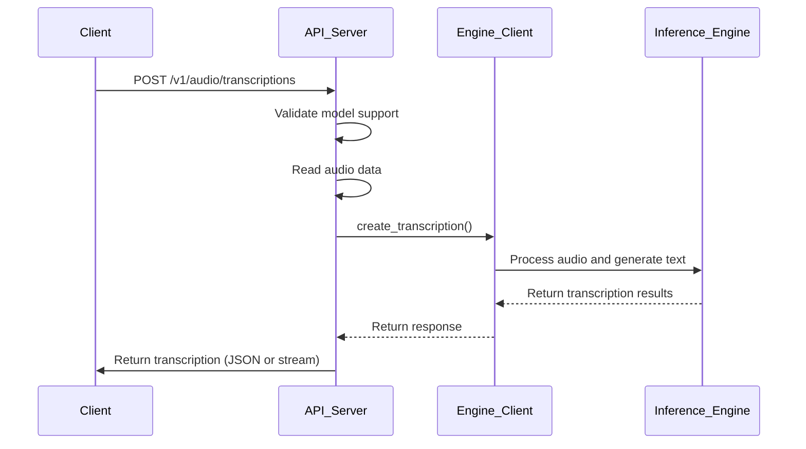
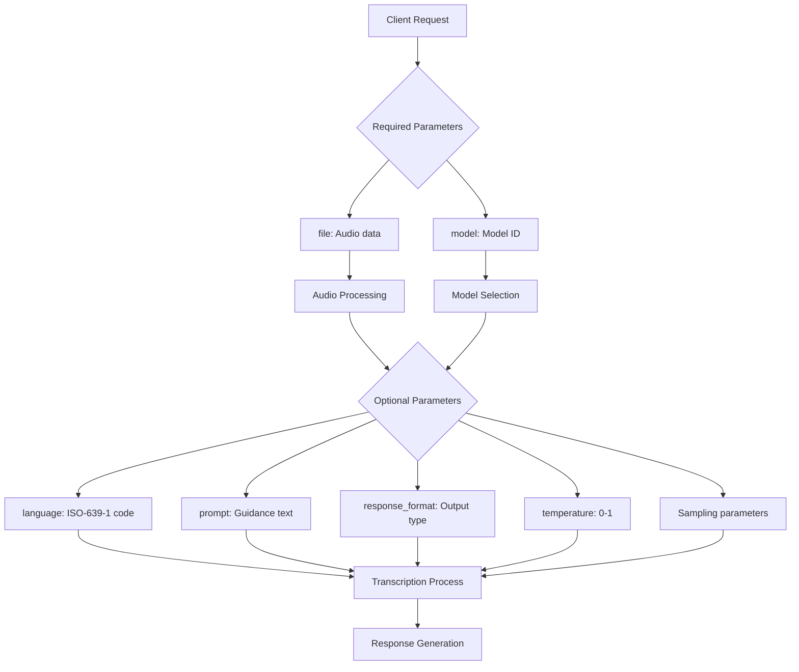
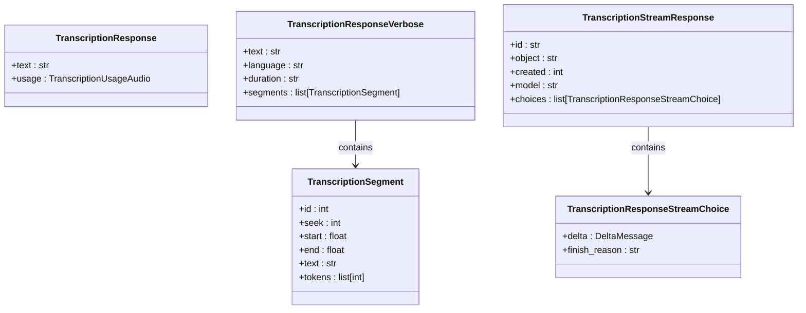
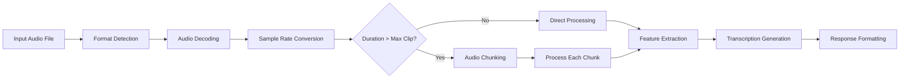
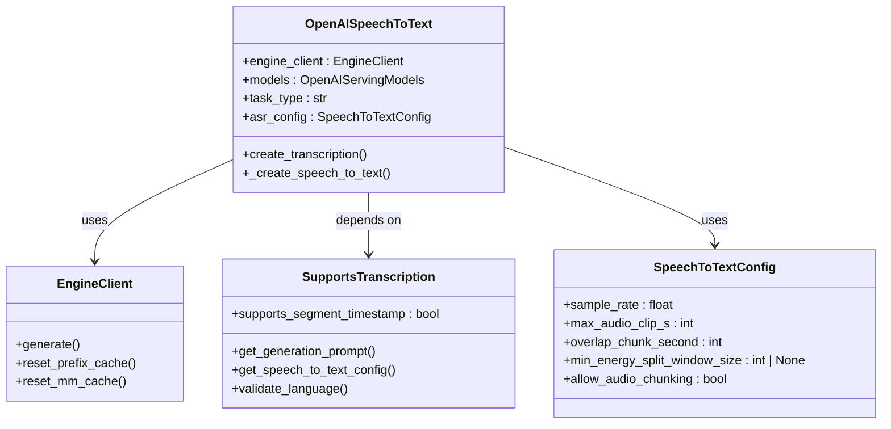
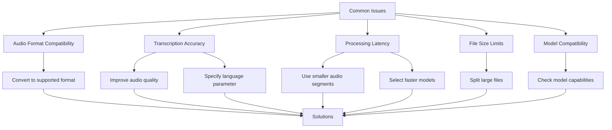
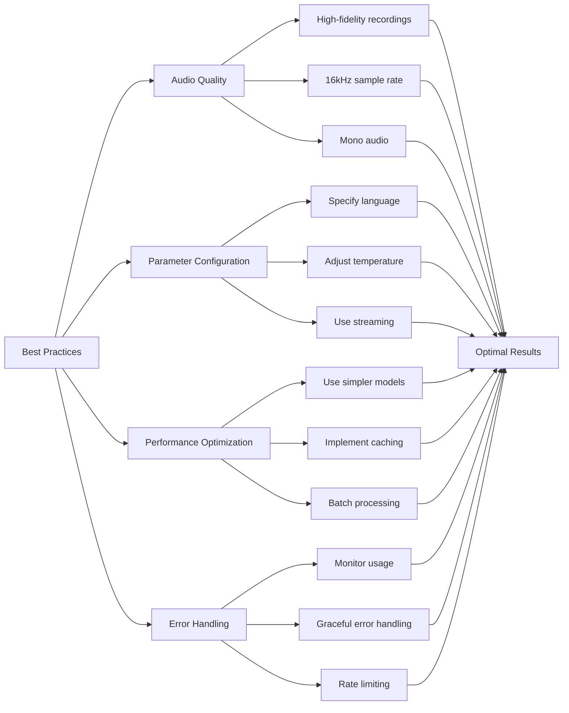

# Transcription API

<cite>
**Referenced Files in This Document**   
- [serving_transcription.py](file://vllm/entrypoints/openai/serving_transcription.py)
- [protocol.py](file://vllm/entrypoints/openai/protocol.py)
- [api_server.py](file://vllm/entrypoints/openai/api_server.py)
- [speech_to_text.py](file://vllm/entrypoints/openai/speech_to_text.py)
- [speech_to_text.py](file://vllm/config/speech_to_text.py)
- [audio.py](file://vllm/multimodal/audio.py)
- [openai_transcription_client.py](file://examples/online_serving/openai_transcription_client.py)
- [test_transcription_validation.py](file://tests/entrypoints/openai/test_transcription_validation.py)
</cite>

## Table of Contents
1. [Introduction](#introduction)
2. [API Endpoint and Method](#api-endpoint-and-method)
3. [Request Parameters](#request-parameters)
4. [Response Formats](#response-formats)
5. [Audio Processing Pipeline](#audio-processing-pipeline)
6. [Integration with Speech-to-Text Models](#integration-with-speech-to-text-models)
7. [Usage Examples](#usage-examples)
8. [Common Issues and Troubleshooting](#common-issues-and-troubleshooting)
9. [Best Practices](#best-practices)
10. [Conclusion](#conclusion)

## Introduction
The Transcription API endpoint in vLLM provides speech-to-text conversion capabilities through the vLLM framework, supporting OpenAI-compatible API interfaces. This API enables users to transcribe audio files into text using advanced speech recognition models. The endpoint is designed to handle various audio formats and languages, providing flexible response formats and configurable transcription parameters. The implementation follows the OpenAI API specification for audio transcription, ensuring compatibility with existing applications that use OpenAI's speech-to-text services.

The API is built on vLLM's high-performance inference engine, which optimizes the execution of large language models and multimodal models. It supports both synchronous and streaming transcription, allowing clients to receive results either as complete responses or incrementally as they become available. The system is designed to handle various audio processing tasks, including resampling, chunking, and feature extraction, to ensure high-quality transcription results across different input formats and lengths.

**Section sources**
- [serving_transcription.py](file://vllm/entrypoints/openai/serving_transcription.py#L31-L169)
- [api_server.py](file://vllm/entrypoints/openai/api_server.py#L779-L854)

## API Endpoint and Method
The Transcription API endpoint is accessible via HTTP POST method at the URL pattern `/v1/audio/transcriptions`. This endpoint follows the OpenAI API specification for audio transcription, enabling compatibility with applications designed for OpenAI's speech-to-text service. The API accepts audio files as input and returns transcribed text in various formats based on the client's request.

The endpoint is implemented as a FastAPI route in the vLLM server, handling incoming HTTP requests and orchestrating the transcription process. When a request is received, the server validates the model support for transcription, processes the audio data, and coordinates with the inference engine to generate the transcription. The implementation supports both regular and streaming responses, with the response type determined by the `stream` parameter in the request.

The API also includes comprehensive error handling, returning appropriate HTTP status codes and error messages for various failure scenarios, such as unsupported models, invalid audio files, or server errors. This ensures that clients can properly handle different error conditions and provide meaningful feedback to end users.



**Diagram sources**
- [api_server.py](file://vllm/entrypoints/openai/api_server.py#L779-L815)
- [serving_transcription.py](file://vllm/entrypoints/openai/serving_transcription.py#L54-L77)

**Section sources**
- [api_server.py](file://vllm/entrypoints/openai/api_server.py#L779-L815)
- [serving_transcription.py](file://vllm/entrypoints/openai/serving_transcription.py#L54-L77)

## Request Parameters
The Transcription API supports several request parameters that control the transcription process and output format. These parameters are sent as form data in the HTTP POST request and include essential options for customizing the transcription behavior.

The `file` parameter is required and contains the audio file to be transcribed. The API supports multiple audio formats including flac, mp3, mp4, mpeg, mpga, m4a, ogg, wav, and webm. The audio file is processed by the server, which handles format decoding and necessary preprocessing steps like resampling.

The `model` parameter specifies the ID of the model to use for transcription. This allows clients to select different speech recognition models based on their requirements for accuracy, speed, or language support. The `language` parameter indicates the language of the input audio using ISO-639-1 codes, which helps improve transcription accuracy and latency by guiding the model's language processing.

Additional parameters include `prompt`, which provides optional text to guide the model's style or continue a previous audio segment; `response_format`, which determines the output format (json, text, srt, verbose_json, or vtt); and `temperature`, which controls the randomness of the transcription output. The API also supports sampling parameters like `top_p`, `top_k`, `min_p`, `seed`, `frequency_penalty`, `repetition_penalty`, and `presence_penalty` to fine-tune the generation process.



**Diagram sources**
- [protocol.py](file://vllm/entrypoints/openai/protocol.py#L1922-L2026)
- [speech_to_text.py](file://vllm/entrypoints/openai/speech_to_text.py#L236-L391)

**Section sources**
- [protocol.py](file://vllm/entrypoints/openai/protocol.py#L1922-L2026)
- [speech_to_text.py](file://vllm/entrypoints/openai/speech_to_text.py#L236-L391)

## Response Formats
The Transcription API supports multiple response formats to accommodate different use cases and integration requirements. The response format is specified by the `response_format` parameter in the request, with options including json, text, srt, verbose_json, and vtt.

The `json` format returns a simple JSON object containing the transcribed text and usage information. This format is ideal for programmatic processing and integration with other systems. The `text` format returns only the transcribed text as plain text, which is useful when minimal processing is required on the client side.

The `srt` (SubRip Subtitle) and `vtt` (WebVTT) formats generate subtitle files with timestamps, making them suitable for video captioning and accessibility applications. These formats include timecodes that indicate when each text segment should appear and disappear, enabling synchronization with audio or video content.

The `verbose_json` format provides detailed transcription information, including individual segments with timestamps, confidence scores, and other metadata. This format is particularly useful for applications that require detailed analysis of the transcription process or need to display timing information alongside the text.

For streaming requests, the API returns responses in the text/event-stream format, allowing clients to receive transcription results incrementally as they become available. This is beneficial for real-time applications where immediate feedback is important, such as live captioning or voice assistants.



**Diagram sources**
- [protocol.py](file://vllm/entrypoints/openai/protocol.py#L2108-L2119)
- [speech_to_text.py](file://vllm/entrypoints/openai/speech_to_text.py#L355-L376)

**Section sources**
- [protocol.py](file://vllm/entrypoints/openai/protocol.py#L2108-L2119)
- [speech_to_text.py](file://vllm/entrypoints/openai/speech_to_text.py#L355-L376)

## Audio Processing Pipeline
The Transcription API implements a comprehensive audio processing pipeline that handles various aspects of audio preparation before transcription. This pipeline ensures that audio files are properly formatted and optimized for the speech recognition models, regardless of their original format or characteristics.

The pipeline begins with audio decoding, where the input audio file is decoded into a raw waveform. The system supports multiple audio formats and uses librosa for audio loading and processing. After decoding, the audio is resampled to the target sample rate specified in the model configuration, typically 16,000 Hz, which is the standard for most speech recognition models.

For long audio files exceeding the maximum clip duration (default 30 seconds), the pipeline implements chunking to split the audio into smaller segments. This process uses energy-based splitting to identify quiet periods in the audio, minimizing the chance of cutting through speech. The chunks are processed sequentially, and their transcriptions are combined to form the complete output.

The pipeline also includes audio validation and error checking, such as verifying file size limits and ensuring the audio duration is within acceptable bounds. These checks help prevent resource exhaustion and ensure consistent performance across different input sizes.



**Diagram sources**
- [speech_to_text.py](file://vllm/entrypoints/openai/speech_to_text.py#L122-L177)
- [audio.py](file://vllm/multimodal/audio.py#L53-L86)

**Section sources**
- [speech_to_text.py](file://vllm/entrypoints/openai/speech_to_text.py#L122-L177)
- [audio.py](file://vllm/multimodal/audio.py#L53-L86)
- [speech_to_text.py](file://vllm/config/speech_to_text.py#L15-L38)

## Integration with Speech-to-Text Models
The Transcription API integrates with various speech-to-text models through vLLM's model execution framework. This integration allows the API to leverage different speech recognition architectures, including Whisper-based models and other multimodal models with speech processing capabilities.

The integration is facilitated by the `SupportsTranscription` interface, which defines the contract between the API layer and the underlying speech models. Models that implement this interface provide methods for generating prompts, processing audio inputs, and producing transcription outputs. The API uses reflection to dynamically load and instantiate the appropriate model class based on the requested model ID.

The model integration includes support for language-specific processing, where the model can be guided by the input language parameter to improve accuracy. The system also handles model-specific configuration options, such as sample rate requirements and maximum audio clip durations, ensuring optimal performance for each model.

For multimodal models that combine speech processing with language understanding, the integration enables advanced features like context-aware transcription and cross-modal reasoning. This allows the models to leverage both acoustic and linguistic information for more accurate transcription, particularly in challenging audio conditions.



**Diagram sources**
- [serving_transcription.py](file://vllm/entrypoints/openai/serving_transcription.py#L31-L77)
- [speech_to_text.py](file://vllm/entrypoints/openai/speech_to_text.py#L67-L121)
- [speech_to_text.py](file://vllm/config/speech_to_text.py#L10-L39)

**Section sources**
- [serving_transcription.py](file://vllm/entrypoints/openai/serving_transcription.py#L31-L77)
- [speech_to_text.py](file://vllm/entrypoints/openai/speech_to_text.py#L67-L121)
- [speech_to_text.py](file://vllm/config/speech_to_text.py#L10-L39)

## Usage Examples
The Transcription API can be used in various scenarios, from simple synchronous transcription to complex streaming applications. The following examples demonstrate common use cases and implementation patterns.

For synchronous transcription, clients can send an audio file and receive the complete transcription in a single response. This approach is suitable for batch processing or applications where the complete result is needed before further processing. The example below shows how to use the OpenAI-compatible client library to perform synchronous transcription:

```python
from openai import OpenAI

client = OpenAI(
    api_key="EMPTY",
    base_url="http://localhost:8000/v1"
)

with open("audio.mp3", "rb") as f:
    transcription = client.audio.transcriptions.create(
        file=f,
        model="openai/whisper-large-v3",
        language="en",
        response_format="json",
        temperature=0.0
    )
    print(transcription.text)
```

For streaming transcription, clients can receive transcription results incrementally as they become available. This is useful for real-time applications like live captioning or voice assistants:

```python
import asyncio
from openai import AsyncOpenAI

async def stream_transcription():
    client = AsyncOpenAI(
        api_key="EMPTY",
        base_url="http://localhost:8000/v1"
    )
    
    with open("audio.mp3", "rb") as f:
        transcription = await client.audio.transcriptions.create(
            file=f,
            model="openai/whisper-large-v3",
            language="en",
            response_format="text",
            temperature=0.0,
            stream=True
        )
        
        async for chunk in transcription:
            if chunk.choices:
                content = chunk.choices[0].get("delta", {}).get("content")
                print(content, end="", flush=True)

asyncio.run(stream_transcription())
```

These examples demonstrate the flexibility of the Transcription API and its compatibility with existing OpenAI client libraries, making it easy to integrate into applications that already use OpenAI's speech-to-text services.

**Section sources**
- [openai_transcription_client.py](file://examples/online_serving/openai_transcription_client.py#L28-L71)
- [test_transcription_validation.py](file://tests/entrypoints/openai/test_transcription_validation.py#L32-L38)

## Common Issues and Troubleshooting
Several common issues may arise when using the Transcription API, and understanding these can help in troubleshooting and optimizing the transcription process.

Audio format compatibility is a frequent concern, as not all audio formats may be supported or may require specific codecs for proper decoding. Clients should ensure their audio files are in one of the supported formats (flac, mp3, mp4, mpeg, mpga, m4a, ogg, wav, or webm) and consider converting files to a standard format like WAV or MP3 for better compatibility.

Transcription accuracy can be affected by various factors, including audio quality, background noise, speaker accents, and overlapping speech. To improve accuracy, users should provide high-quality audio recordings with minimal background noise and consider using the language parameter to specify the expected language. For noisy environments, preprocessing the audio to reduce noise may improve results.

Processing latency is another common issue, particularly for long audio files or when using complex models. The API may experience increased latency for files that require chunking or when the server is under heavy load. To mitigate this, users can break long audio files into smaller segments or use simpler models for faster processing.

Other issues include file size limits, where audio files exceeding the maximum allowed size will be rejected, and model compatibility, where certain models may not support all API features like verbose JSON output or streaming. Users should check the model documentation and API responses for error messages that can help diagnose these issues.



**Diagram sources**
- [speech_to_text.py](file://vllm/entrypoints/openai/speech_to_text.py#L136-L137)
- [protocol.py](file://vllm/entrypoints/openai/protocol.py#L2085-L2087)

**Section sources**
- [speech_to_text.py](file://vllm/entrypoints/openai/speech_to_text.py#L136-L137)
- [protocol.py](file://vllm/entrypoints/openai/protocol.py#L2085-L2087)

## Best Practices
To optimize transcription quality and performance when using the Transcription API, several best practices should be followed.

For audio quality, use high-fidelity recordings with minimal background noise and ensure consistent volume levels. Sample rates of 16,000 Hz are optimal for most speech recognition models, and stereo audio should be converted to mono to reduce file size and processing time. For long recordings, consider breaking them into smaller segments (under 30 seconds) to improve processing efficiency and reduce latency.

When configuring transcription parameters, set the language parameter to match the audio content using ISO-639-1 codes, as this significantly improves accuracy and processing speed. Use a temperature of 0.0 for more deterministic outputs or higher values (up to 1.0) for more creative or varied transcriptions. For streaming applications, enable the stream parameter to receive results incrementally and provide immediate feedback to users.

For performance optimization, consider using simpler models for real-time applications or when processing large volumes of audio. Implement client-side caching of transcription results to avoid redundant processing of the same audio files. When processing multiple files, use batch processing where possible to maximize server utilization and reduce overhead.

Monitor API usage and error rates to identify potential issues early. Implement proper error handling to gracefully manage cases where transcription fails due to unsupported formats, file size limits, or server errors. For production applications, consider implementing rate limiting and queuing mechanisms to prevent overwhelming the transcription service during peak usage periods.



**Diagram sources**
- [protocol.py](file://vllm/entrypoints/openai/protocol.py#L1932-L1938)
- [speech_to_text.py](file://vllm/entrypoints/openai/speech_to_text.py#L1993-L2000)

**Section sources**
- [protocol.py](file://vllm/entrypoints/openai/protocol.py#L1932-L1938)
- [speech_to_text.py](file://vllm/entrypoints/openai/speech_to_text.py#L1993-L2000)

## Conclusion
The Transcription API in vLLM provides a robust and flexible solution for speech-to-text conversion, offering OpenAI-compatible interfaces for easy integration with existing applications. The API supports various audio formats and languages, with multiple response formats to suit different use cases. Its implementation leverages vLLM's high-performance inference engine to deliver efficient transcription services with support for both synchronous and streaming operations.

The API's architecture separates concerns effectively, with clear interfaces between the HTTP server, transcription handler, and underlying speech models. This design enables easy extension and integration of new speech recognition models while maintaining compatibility with the OpenAI API specification. The comprehensive audio processing pipeline handles format conversion, resampling, and chunking, ensuring consistent performance across diverse input types.

For developers and organizations looking to implement speech-to-text capabilities, the Transcription API offers a powerful solution that balances ease of use with advanced features. By following the best practices outlined in this documentation, users can optimize transcription quality and performance while effectively troubleshooting common issues. As speech recognition technology continues to evolve, the extensible architecture of the API will facilitate the integration of new models and capabilities, ensuring its relevance in future applications.

**Section sources**
- [serving_transcription.py](file://vllm/entrypoints/openai/serving_transcription.py)
- [api_server.py](file://vllm/entrypoints/openai/api_server.py)
- [speech_to_text.py](file://vllm/entrypoints/openai/speech_to_text.py)