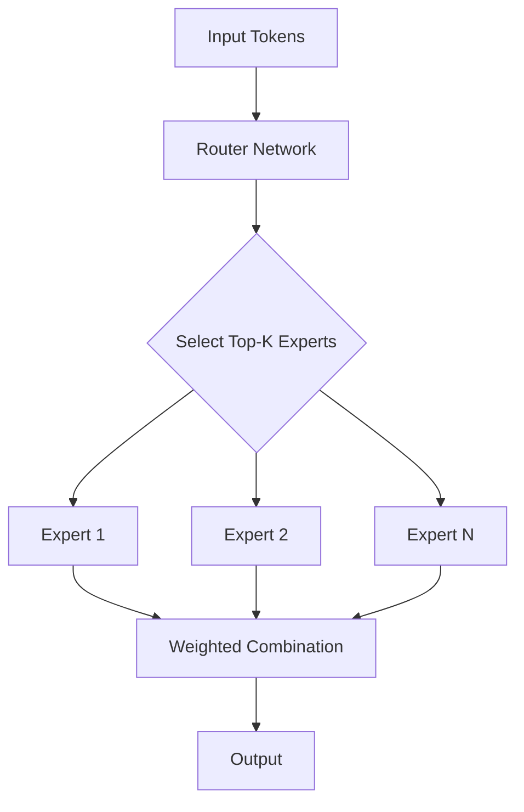
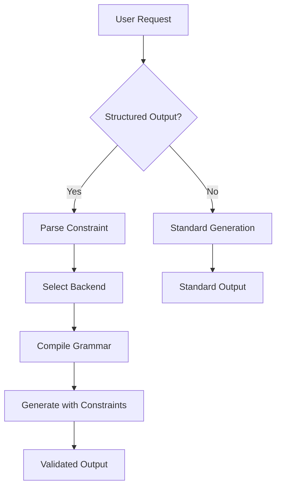

# Advanced Features

<cite>
**Referenced Files in This Document**   
- [lora.py](file://vllm/lora/models.py)
- [lora.py](file://vllm/config/lora.py)
- [multilora_inference.py](file://examples/offline_inference/multilora_inference.py)
- [fused_moe.py](file://vllm/model_executor/layers/fused_moe/layer.py)
- [fused_moe.py](file://vllm/model_executor/layers/fused_moe/fused_moe.py)
- [vision_language.py](file://examples/offline_inference/vision_language.py)
- [image.py](file://vllm/multimodal/image.py)
- [structured_outputs.py](file://examples/offline_inference/structured_outputs.py)
- [structured_outputs.py](file://vllm/config/structured_outputs.py)
- [backend_xgrammar.py](file://vllm/v1/structured_output/backend_xgrammar.py)
</cite>

## Table of Contents
1. [Introduction](#introduction)
2. [LoRA Support](#lora-support)
3. [Mixture-of-Experts Models](#mixture-of-experts-models)
4. [Multimodal Inference](#multimodal-inference)
5. [Structured Outputs](#structured-outputs)
6. [Common Issues and Solutions](#common-issues-and-solutions)
7. [Conclusion](#conclusion)

## Introduction
vLLM provides advanced features that extend beyond basic text generation capabilities. This document explores specialized capabilities including LoRA support for efficient fine-tuning, Mixture-of-Experts (MoE) models for parameter efficiency, multimodal inference for processing both text and images, and structured outputs for constraining generation to specific formats. These features enable more efficient, specialized, and controlled language model applications.

## LoRA Support

LoRA (Low-Rank Adaptation) support in vLLM enables efficient fine-tuning of large language models without the need to maintain multiple full model instances. This approach allows users to switch between different adapters dynamically while sharing the same base model parameters, significantly reducing memory requirements and enabling rapid adaptation to different tasks.

The LoRA implementation in vLLM manages multiple adapters through a LoRAModelManager that handles adapter lifecycle operations including addition, activation, deactivation, and removal. Each adapter is assigned a unique identifier and can be activated for specific requests. The system supports pinning adapters to prevent them from being evicted from memory, which is particularly useful for frequently used adapters.

Configuration of LoRA functionality is controlled through the LoRAConfig class, which specifies parameters such as maximum rank, maximum number of concurrent adapters, and data types for LoRA weights. The system also supports CPU offloading of LoRA weights to manage memory usage when working with a large number of adapters.

**Section sources**
- [models.py](file://vllm/lora/models.py#L289-L326)
- [lora.py](file://vllm/config/lora.py#L31-L97)
- [multilora_inference.py](file://examples/offline_inference/multilora_inference.py#L12-L119)

## Mixture-of-Experts Models

Mixture-of-Experts (MoE) models in vLLM implement an architecture where only a subset of model parameters (experts) are activated for each request, improving computational efficiency. This approach allows for larger overall model capacity while maintaining reasonable inference costs, as each input is processed by only a few experts rather than the entire network.

The implementation uses a router mechanism to determine which experts should handle each input token based on learned routing weights. The system supports various quantization methods for MoE layers, including FP8, INT8, and WNA16 quantization, which further optimize memory usage and computation. The fused_moe layer efficiently handles the routing, expert computation, and combination of results in a single optimized operation.

MoE models in vLLM are designed to work with tensor parallelism, where experts can be distributed across multiple GPUs to balance the computational load. The system automatically manages the parallelization strategy based on the number of experts, top-k selection parameter, and available hardware resources.

**Diagram sources **
- [layer.py](file://vllm/model_executor/layers/fused_moe/layer.py#L379-L411)
- [fused_moe.py](file://vllm/model_executor/layers/fused_moe/fused_moe.py#L1426-L1514)

**Section sources**
- [layer.py](file://vllm/model_executor/layers/fused_moe/layer.py#L379-L411)
- [fused_moe.py](file://vllm/model_executor/layers/fused_moe/fused_moe.py#L890-L950)

## Multimodal Inference

Multimodal inference in vLLM enables models to process both text and image inputs within a single unified framework. This capability allows for applications such as image captioning, visual question answering, and content analysis that require understanding of both visual and textual information.

The multimodal system handles image preprocessing through specialized image processors that convert raw image data into token sequences compatible with the language model. Different models may require specific prompt formatting to indicate the presence and position of images within the text context. The system supports various image modalities and can handle multiple images per request when supported by the underlying model architecture.

Image processing includes operations such as resizing, cropping, and feature extraction to prepare visual data for the language model. The integration between vision encoders and language models is handled transparently, allowing users to provide images alongside text prompts using standardized input formats.

**Section sources**
- [vision_language.py](file://examples/offline_inference/vision_language.py#L1-L800)
- [image.py](file://vllm/multimodal/image.py#L1-L100)

## Structured Outputs

Structured outputs in vLLM provide mechanisms to constrain model generation to specific formats, ensuring that outputs adhere to predefined schemas. This capability supports various constraint types including JSON schemas, regular expressions, choice lists, and custom grammars, enabling reliable integration with downstream applications that expect specific data formats.

The structured output system uses grammar-based guidance to restrict the token generation process, ensuring that only valid sequences according to the specified constraints are produced. Multiple backend engines are supported, including xgrammar, guidance, and outlines, with automatic selection based on the request type and content. The system validates constraints during request processing and provides clear error messages for invalid specifications.

For JSON schema constraints, the system supports a wide range of JSON Schema features including type validation, string patterns, numeric ranges, and enumerated values. Regular expression constraints allow for precise control over output format, while choice constraints limit generation to a specified set of options.

**Diagram sources **
- [backend_xgrammar.py](file://vllm/v1/structured_output/backend_xgrammar.py#L77-L114)
- [structured_outputs.py](file://examples/offline_inference/structured_outputs.py#L1-L114)

**Section sources**
- [backend_xgrammar.py](file://vllm/v1/structured_output/backend_xgrammar.py#L77-L319)
- [structured_outputs.py](file://vllm/config/structured_outputs.py#L18-L95)
- [structured_outputs.py](file://examples/offline_inference/structured_outputs.py#L1-L114)

## Common Issues and Solutions

When working with advanced vLLM features, several common issues may arise, particularly related to adapter management and resource constraints. Adapter conflicts can occur when multiple adapters are loaded simultaneously without proper isolation, potentially leading to incorrect parameter updates or memory exhaustion.

The primary solution for adapter conflicts is proper isolation through the use of adapter pinning and careful management of the adapter lifecycle. By pinning frequently used adapters, users can ensure they remain available in memory and are not evicted during high-load periods. The system's support for CPU offloading of less frequently used adapters provides an additional mechanism for managing memory usage when working with large numbers of adapters.

Resource allocation issues, particularly with MoE models and multimodal processing, can be addressed through appropriate configuration of batch sizes, sequence lengths, and parallelization strategies. Monitoring tools and performance profiling can help identify bottlenecks and optimize resource utilization for specific workloads.

**Section sources**
- [models.py](file://vllm/lora/models.py#L289-L326)
- [test_lora_manager.py](file://tests/lora/test_lora_manager.py#L168-L383)

## Conclusion

vLLM's advanced features provide powerful capabilities for specialized language model applications. LoRA support enables efficient fine-tuning and adapter switching, MoE models offer parameter efficiency through selective expert activation, multimodal inference extends functionality to visual content, and structured outputs ensure reliable integration with downstream systems. By understanding and properly configuring these features, users can build highly optimized and specialized language model applications that meet specific requirements while maintaining efficiency and reliability.