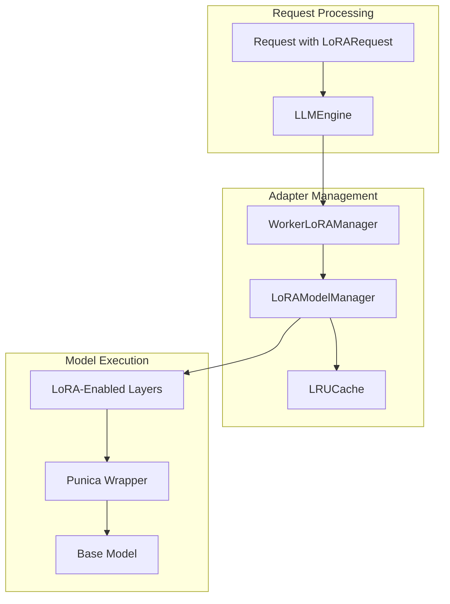
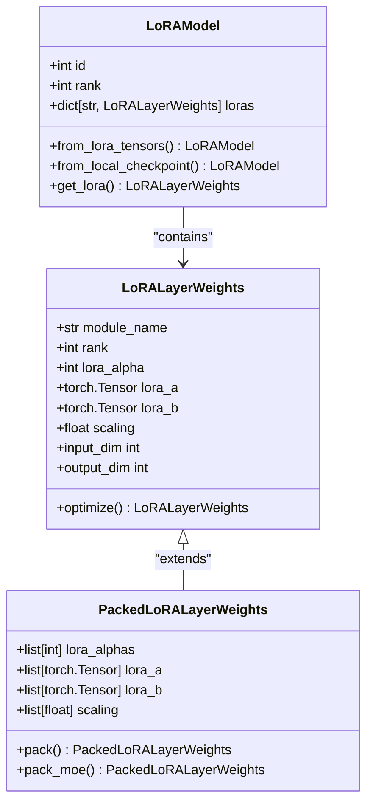
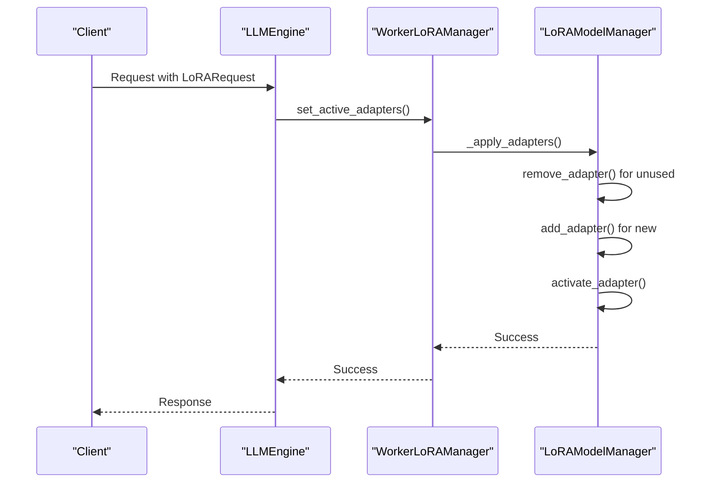

# LoRA Support

<cite>
**Referenced Files in This Document**   
- [LoRAConfig](file://vllm/config/lora.py)
- [LoRAModel](file://vllm/lora/models.py)
- [LoRAModelManager](file://vllm/lora/models.py)
- [LoRARequest](file://vllm/lora/request.py)
- [WorkerLoRAManager](file://vllm/lora/worker_manager.py)
- [LRUCacheWorkerLoRAManager](file://vllm/lora/worker_manager.py)
- [LoRALayerWeights](file://vllm/lora/lora_weights.py)
- [PackedLoRALayerWeights](file://vllm/lora/lora_weights.py)
- [PunicaWrapperBase](file://vllm/lora/punica_wrapper/punica_base.py)
- [get_punica_wrapper](file://vllm/lora/punica_wrapper/punica_selector.py)
- [multilora_inference.py](file://examples/offline_inference/multilora_inference.py)
- [lora_with_quantization_inference.py](file://examples/offline_inference/lora_with_quantization_inference.py)
</cite>

## Table of Contents
1. [Introduction](#introduction)
2. [Core Components](#core-components)
3. [Architecture Overview](#architecture-overview)
4. [Detailed Component Analysis](#detailed-component-analysis)
5. [Adapter Lifecycle Management](#adapter-lifecycle-management)
6. [Performance Considerations](#performance-considerations)
7. [Troubleshooting Guide](#troubleshooting-guide)
8. [Conclusion](#conclusion)

## Introduction
LoRA (Low-Rank Adaptation) support in vLLM enables efficient fine-tuning of large language models without requiring full model retraining. This implementation allows users to load, manage, and apply multiple LoRA adapters during inference, providing a flexible mechanism for adapting models to specific tasks or domains. The system is designed to handle adapter loading, switching, and lifecycle management efficiently, with support for both CPU and GPU memory management. This document provides a comprehensive overview of the LoRA implementation in vLLM, covering the core components, architecture, and practical usage patterns.

## Core Components
The LoRA implementation in vLLM consists of several key components that work together to enable efficient adapter management. The `LoRAConfig` class defines the configuration parameters for LoRA support, including maximum rank, number of adapters, and memory limits. The `LoRAModel` class represents a single LoRA adapter, containing the adapter weights and metadata. The `LoRAModelManager` class manages multiple LoRA adapters, handling their activation, deactivation, and memory allocation. The `WorkerLoRAManager` class provides the interface between the model executor and the LoRA system, managing adapter loading and unloading on worker nodes. The `PunicaWrapper` classes implement the low-level operations for applying LoRA weights during inference.

**Section sources**
- [LoRAConfig](file://vllm/config/lora.py#L24-L97)
- [LoRAModel](file://vllm/lora/models.py#L65-L98)
- [LoRAModelManager](file://vllm/lora/models.py#L289-L350)
- [WorkerLoRAManager](file://vllm/lora/worker_manager.py#L24-L84)

## Architecture Overview
The LoRA architecture in vLLM follows a layered approach with clear separation of concerns. At the core is the `LoRAModelManager` which maintains a registry of loaded adapters and manages their activation state. The manager interacts with the model through specialized LoRA-enabled layers that can dynamically apply adapter weights. The `PunicaWrapper` system provides optimized kernel operations for applying LoRA transformations efficiently. The request processing pipeline integrates LoRA support through the `LoRARequest` class, which specifies which adapter should be used for each request. The system supports both immediate loading of requested adapters and LRU-based caching for efficient memory utilization.

**Diagram sources **
- [LoRARequest](file://vllm/lora/request.py#L9-L101)
- [WorkerLoRAManager](file://vllm/lora/worker_manager.py#L24-L269)
- [LoRAModelManager](file://vllm/lora/models.py#L289-L794)

## Detailed Component Analysis

### LoRA Configuration and Initialization
The `LoRAConfig` class defines the parameters that control LoRA behavior in vLLM. Key configuration options include `max_lora_rank` which sets the maximum rank of any LoRA adapter, `max_loras` which determines the maximum number of adapters that can be active simultaneously in a batch, and `max_cpu_loras` which controls the size of the CPU cache for LoRA adapters. The configuration is validated to ensure that `max_cpu_loras` is at least as large as `max_loras`, preventing memory allocation issues. When initializing an LLM with LoRA support, these parameters are passed through the `EngineArgs` class, which configures the `LLMEngine` to enable LoRA functionality.

**Section sources**
- [LoRAConfig](file://vllm/config/lora.py#L24-L97)
- [EngineArgs](file://vllm/engine/arg_utils.py#L1-L100)

### Adapter Loading and Weight Management
The `LoRAModel` class represents a single LoRA adapter and is responsible for loading and managing adapter weights. Adapters can be loaded from local checkpoints or downloaded from Hugging Face repositories. The `from_local_checkpoint` method validates that the adapter's target modules match the expected modules in the base model, preventing incompatible adapters from being loaded. The `LoRALayerWeights` class manages the actual LoRA weight tensors (lora_A and lora_B matrices) and provides optimization methods to merge scaling factors into the weights for improved inference performance. For packed layers like QKV projections, the `PackedLoRALayerWeights` class handles the special case of multiple LoRA adapters applied to different parts of the same layer.

**Diagram sources **
- [LoRAModel](file://vllm/lora/models.py#L65-L287)
- [LoRALayerWeights](file://vllm/lora/lora_weights.py#L14-L98)
- [PackedLoRALayerWeights](file://vllm/lora/lora_weights.py#L100-L228)

### Adapter Management and Switching
The `LoRAModelManager` class provides the core functionality for managing multiple LoRA adapters. It maintains a registry of loaded adapters and tracks which adapters are currently active. The manager uses a slot-based system where each active adapter occupies a slot, with the number of slots determined by the `max_loras` configuration parameter. When a new adapter is activated, it is assigned to an available slot, and when deactivated, the slot is freed for reuse. The manager also handles the complex case of packed modules and MoE (Mixture of Experts) models, where multiple LoRA adapters may need to be merged or split appropriately. The `activate_adapter` and `deactivate_adapter` methods provide the interface for switching between adapters during inference.

**Diagram sources **
- [WorkerLoRAManager](file://vllm/lora/worker_manager.py#L159-L189)
- [LoRAModelManager](file://vllm/lora/models.py#L368-L458)

### Integration with Model Executor
The integration between LoRA and the model executor is handled through the `WorkerLoRAManager` class, which acts as an adapter between the high-level engine and the low-level model execution. The manager is responsible for creating the `LoRAModelManager` instance and integrating it with the model. During request processing, the manager ensures that the appropriate LoRA adapters are loaded and activated before inference begins. The `maybe_select_dummy_loras` context manager is used to handle cases where LoRA is enabled but no adapter is specified, ensuring consistent behavior. The system supports both immediate loading of requested adapters and LRU-based caching through the `LRUCacheWorkerLoRAManager` subclass, which automatically evicts least recently used adapters when the cache is full.

**Section sources**
- [WorkerLoRAManager](file://vllm/lora/worker_manager.py#L24-L269)
- [LRUCacheWorkerLoRAManager](file://vllm/lora/worker_manager.py#L201-L269)

## Adapter Lifecycle Management
The lifecycle of a LoRA adapter in vLLM follows a well-defined sequence from loading to unloading. When a request specifies a LoRA adapter, the system first checks if the adapter is already loaded in the manager's registry. If not, the adapter is loaded from disk or downloaded from a remote repository, validated for compatibility, and added to the registry. The adapter is then activated, which assigns it to an available slot and prepares its weights for use during inference. After inference is complete, the adapter may be deactivated but remains in the registry for potential reuse. The system provides explicit methods for removing adapters from the registry when they are no longer needed, freeing up memory resources. For applications with many adapters, the LRU cache automatically manages memory by evicting least recently used adapters when the cache limit is reached.

**Section sources**
- [LoRAModelManager](file://vllm/lora/models.py#L768-L787)
- [WorkerLoRAManager](file://vllm/lora/worker_manager.py#L183-L193)

## Performance Considerations
The LoRA implementation in vLLM is designed with performance as a primary consideration. The use of pre-allocated slots for active adapters eliminates the overhead of dynamic memory allocation during inference. The `PunicaWrapper` system provides optimized kernel operations that efficiently apply LoRA transformations, minimizing the computational overhead of adapter application. Memory usage is carefully managed through the separation of CPU and GPU memory pools, with inactive adapters stored on CPU memory and only active adapters loaded on GPU. The system allows tuning of performance parameters such as `max_loras` and `max_lora_rank` to balance memory usage and inference speed. For applications with predictable adapter usage patterns, pinning adapters in memory can prevent the overhead of repeated loading and unloading.

**Section sources**
- [LoRAConfig](file://vllm/config/lora.py#L24-L97)
- [PunicaWrapperBase](file://vllm/lora/punica_wrapper/punica_base.py#L1-L130)

## Troubleshooting Guide
Common issues with LoRA in vLLM typically relate to adapter compatibility, memory limits, and configuration errors. Adapter conflicts can occur when multiple adapters target the same modules with incompatible configurations; this is prevented by the validation performed during adapter loading. Memory overhead issues may arise when the number of active adapters exceeds the configured limits; this can be addressed by adjusting the `max_loras` and `max_cpu_loras` parameters. Version compatibility issues between the base model and LoRA adapters are handled through comprehensive validation of adapter metadata against the model configuration. Best practices include using consistent rank values across adapters, monitoring memory usage during peak load, and implementing proper error handling for adapter loading failures. The system provides detailed logging to help diagnose issues with adapter loading and activation.

**Section sources**
- [LoRAModel](file://vllm/lora/models.py#L153-L287)
- [LoRAConfig](file://vllm/config/lora.py#L80-L97)

## Conclusion
The LoRA support in vLLM provides a robust and efficient mechanism for adapting large language models to specific tasks without requiring full retraining. The system's modular architecture separates concerns between configuration, adapter management, and model execution, enabling flexible and scalable deployment of fine-tuned models. By supporting multiple adapters, efficient memory management, and seamless integration with the inference pipeline, vLLM makes it practical to deploy and serve a wide variety of specialized models from a single base model. The implementation balances performance, memory efficiency, and ease of use, making it suitable for both research and production applications.