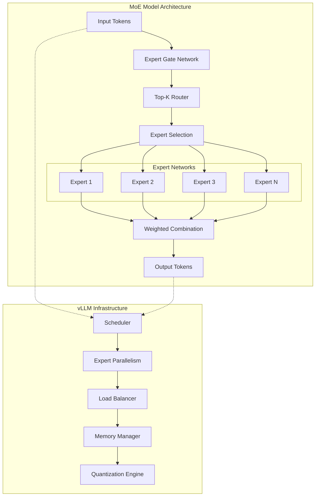
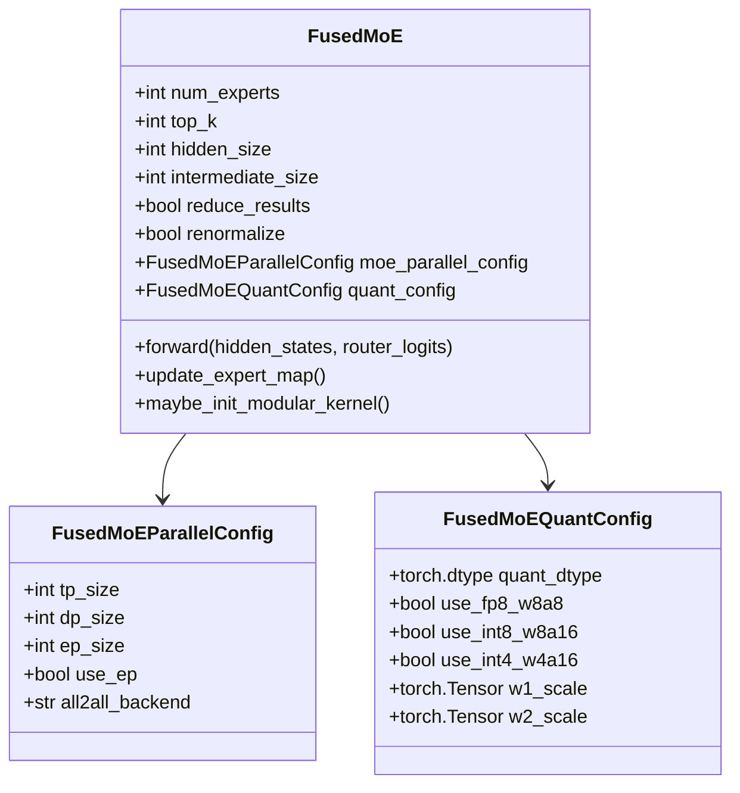
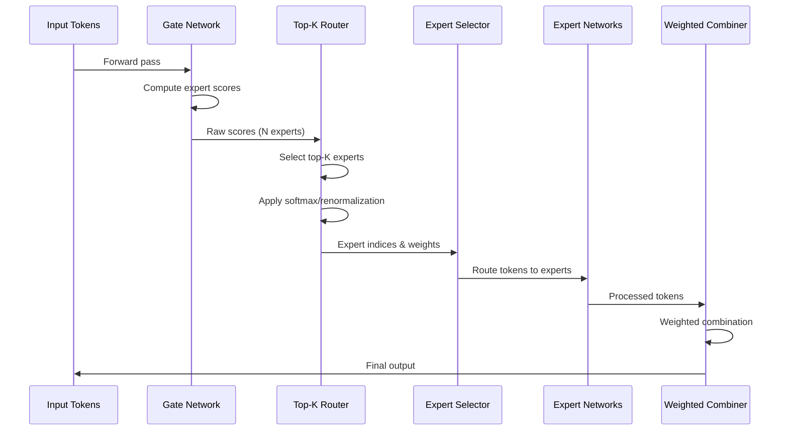
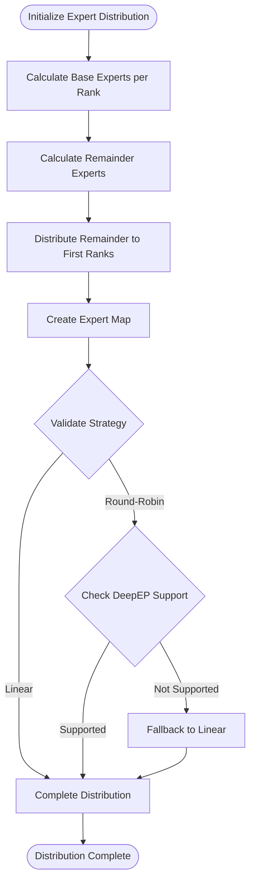
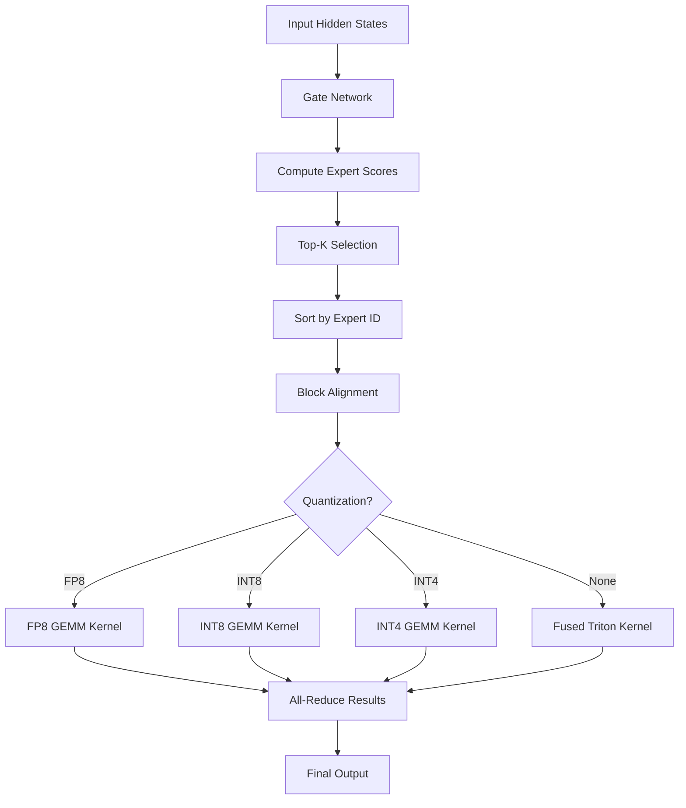
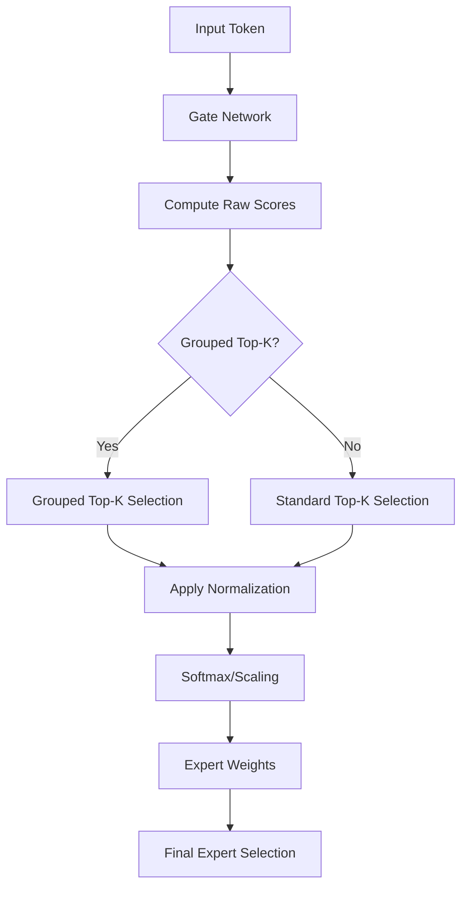
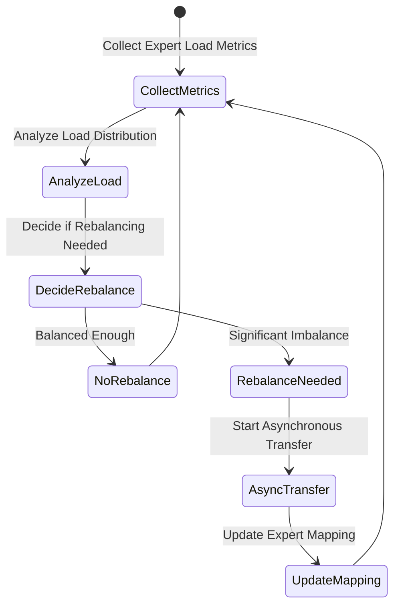
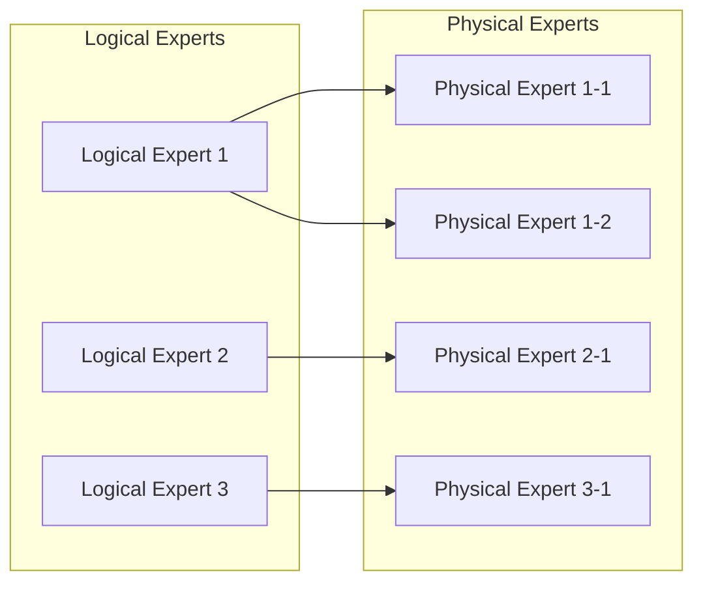
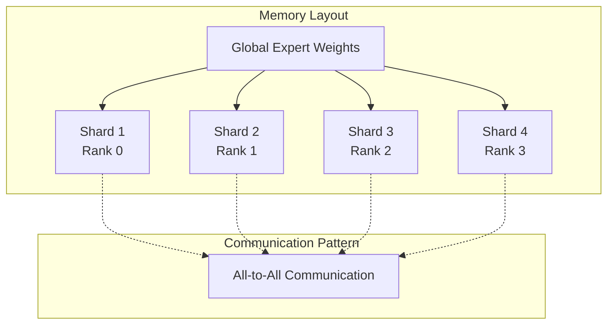

# Mixture-of-Experts Models

<cite>
**Referenced Files in This Document**
- [layer.py](file://vllm/model_executor/layers/fused_moe/layer.py)
- [fused_moe.py](file://vllm/model_executor/layers/fused_moe/fused_moe.py)
- [mixtral.py](file://vllm/model_executor/models/mixtral.py)
- [config.py](file://vllm/model_executor/layers/fused_moe/config.py)
- [eplb_state.py](file://vllm/distributed/eplb/eplb_state.py)
- [moe_ops.h](file://csrc/moe/moe_ops.h)
- [grouped_topk_kernels.cu](file://csrc/moe/grouped_topk_kernels.cu)
- [benchmark_moe.py](file://benchmarks/kernels/benchmark_moe.py)
- [test_expert_placement.py](file://tests/distributed/test_expert_placement.py)
</cite>

## Table of Contents
1. [Introduction](#introduction)
2. [Architecture Overview](#architecture-overview)
3. [Core Components](#core-components)
4. [Expert Placement Strategies](#expert-placement-strategies)
5. [Fused MoE Layer Implementation](#fused-moe-layer-implementation)
6. [Routing and Gating Mechanisms](#routing-and-gating-mechanisms)
7. [Load Balancing and EPLB](#load-balancing-and-eplb)
8. [Memory Management and Optimization](#memory-management-and-optimization)
9. [Performance Considerations](#performance-considerations)
10. [Common Issues and Solutions](#common-issues-and-solutions)
11. [Configuration Examples](#configuration-examples)
12. [Troubleshooting Guide](#troubleshooting-guide)

## Introduction

Mixture-of-Experts (MoE) models represent a powerful architectural approach that combines multiple specialized neural networks (experts) to achieve superior performance while maintaining computational efficiency. In vLLM, MoE models are implemented through a sophisticated framework that handles expert routing, load balancing, memory optimization, and distributed execution across multiple devices.

The vLLM MoE implementation focuses on efficient inference with several key innovations:
- **Fused Execution**: Combines expert selection and computation into single kernels
- **Expert Parallelism**: Distributes experts across multiple devices for scalability
- **Load Balancing**: Dynamic redistribution of experts based on workload
- **Memory Optimization**: Efficient memory usage through expert sharding and quantization
- **Quantization Support**: Multiple quantization schemes for reduced memory footprint

## Architecture Overview

The vLLM MoE architecture consists of several interconnected components that work together to provide efficient MoE inference:



**Diagram sources**
- [layer.py](file://vllm/model_executor/layers/fused_moe/layer.py#L307-L400)
- [mixtral.py](file://vllm/model_executor/models/mixtral.py#L74-L145)

## Core Components

### FusedMoE Layer

The core of the MoE implementation is the `FusedMoE` layer, which combines expert selection and computation into optimized kernels:



**Diagram sources**
- [layer.py](file://vllm/model_executor/layers/fused_moe/layer.py#L307-L400)
- [config.py](file://vllm/model_executor/layers/fused_moe/config.py#L689-L740)

### Expert Routing System

The routing system determines which experts process each token through a learned gating mechanism:



**Diagram sources**
- [fused_moe.py](file://vllm/model_executor/layers/fused_moe/fused_moe.py#L8-L50)
- [layer.py](file://vllm/model_executor/layers/fused_moe/layer.py#L195-L250)

**Section sources**
- [layer.py](file://vllm/model_executor/layers/fused_moe/layer.py#L307-L400)
- [config.py](file://vllm/model_executor/layers/fused_moe/config.py#L120-L200)

## Expert Placement Strategies

vLLM supports multiple expert placement strategies to optimize performance and resource utilization:

### Linear Placement Strategy

Distributes experts sequentially across ranks:

```python
# Example: 8 experts across 4 ranks
# Rank 0: Experts 0, 1, 2
# Rank 1: Experts 3, 4
# Rank 2: Experts 5, 6
# Rank 3: Experts 7
```

### Round-Robin Placement Strategy

Distributes experts in a round-robin fashion for better load balancing:

```python
# Example: 8 experts across 4 ranks
# Rank 0: Experts 0, 4
# Rank 1: Experts 1, 5  
# Rank 2: Experts 2, 6
# Rank 3: Experts 3, 7
```

### Expert Distribution Algorithm



**Diagram sources**
- [layer.py](file://vllm/model_executor/layers/fused_moe/layer.py#L106-L193)

**Section sources**
- [layer.py](file://vllm/model_executor/layers/fused_moe/layer.py#L195-L250)
- [test_expert_placement.py](file://tests/distributed/test_expert_placement.py#L1-L100)

## Fused MoE Layer Implementation

### Core Forward Pass

The fused MoE layer executes the entire expert computation pipeline efficiently:



**Diagram sources**
- [fused_moe.py](file://vllm/model_executor/layers/fused_moe/fused_moe.py#L544-L735)

### Quantization Support

The implementation supports multiple quantization schemes for memory efficiency:

| Quantization Type | Precision | Memory Reduction | Performance Impact |
|-------------------|-----------|------------------|-------------------|
| FP8 W8A8 | 8-bit weights, 8-bit activations | 50% | Low |
| INT8 W8A16 | 8-bit weights, 16-bit activations | 75% | Medium |
| INT4 W4A16 | 4-bit weights, 16-bit activations | 87.5% | High |
| MXFP4 | Mixed-precision 4-bit | Variable | Medium |

**Section sources**
- [fused_moe.py](file://vllm/model_executor/layers/fused_moe/fused_moe.py#L1-L200)
- [config.py](file://vllm/model_executor/layers/fused_moe/config.py#L484-L600)

## Routing and Gating Mechanisms

### Expert Selection Algorithm

The routing mechanism uses a sophisticated algorithm to select the most appropriate experts for each token:



**Diagram sources**
- [grouped_topk_kernels.cu](file://csrc/moe/grouped_topk_kernels.cu#L1-L100)

### Top-K Selection Kernels

The implementation includes highly optimized CUDA kernels for top-K selection:

```cpp
// Simplified kernel structure for grouped top-k selection
template<typename T>
__global__ void grouped_topk_kernel(
    const T* scores,
    int n_group,
    int topk_group,
    int topk,
    bool renormalize,
    T* topk_weights,
    int* topk_indices
) {
    // Cooperative group processing for optimal performance
    // Bitonic sort implementation for small top-K values
    // Warp-level primitives for reduction operations
}
```

**Section sources**
- [grouped_topk_kernels.cu](file://csrc/moe/grouped_topk_kernels.cu#L1-L200)
- [moe_ops.h](file://csrc/moe/moe_ops.h#L1-L51)

## Load Balancing and EPLB

### Expert Parallelism Load Balancer (EPLB)

The EPLB system dynamically redistributes experts across devices to balance workload:



**Diagram sources**
- [eplb_state.py](file://vllm/distributed/eplb/eplb_state.py#L512-L650)

### Load Balancing Algorithm

The EPLB uses a sliding window approach to track expert utilization:

```python
# Load balancing metrics structure
class EplbModelState:
    physical_to_logical_map: torch.Tensor  # Physical → Logical expert mapping
    logical_to_physical_map: torch.Tensor  # Logical → Physical expert mapping
    logical_replica_count: torch.Tensor    # Number of replicas per logical expert
    expert_load_pass: torch.Tensor         # Current forward pass load
    expert_load_window: torch.Tensor       # Sliding window of load history
```

### Redundant Expert System

To achieve load balancing, the system creates redundant copies of popular experts:



**Diagram sources**
- [eplb_state.py](file://vllm/distributed/eplb/eplb_state.py#L54-L120)

**Section sources**
- [eplb_state.py](file://vllm/distributed/eplb/eplb_state.py#L1-L200)
- [layer.py](file://vllm/model_executor/layers/fused_moe/layer.py#L467-L520)

## Memory Management and Optimization

### Expert Sharding Strategy

The implementation uses sophisticated memory management to distribute experts efficiently:



### Memory Optimization Techniques

1. **Expert Weight Sharing**: Common experts share weights across ranks
2. **Dynamic Memory Allocation**: Allocate memory based on current workload
3. **Memory Pool Management**: Reuse memory buffers across forward passes
4. **Quantization Integration**: Reduce memory footprint through quantization

### Block Alignment Optimization

The system optimizes memory access patterns through careful block alignment:

```python
# Block alignment for optimal memory coalescing
def align_block_size(tokens, experts, block_size=128):
    # Align token count to block boundary
    aligned_tokens = round_up(tokens, block_size)
    # Align expert count to warp boundary
    aligned_experts = round_up(experts, WARP_SIZE)
    return aligned_tokens, aligned_experts
```

**Section sources**
- [fused_moe.py](file://vllm/model_executor/layers/fused_moe/fused_moe.py#L736-L800)
- [config.py](file://vllm/model_executor/layers/fused_moe/config.py#L689-L740)

## Performance Considerations

### Benchmarking and Profiling

The vLLM MoE implementation includes comprehensive benchmarking tools:

```python
# Performance benchmarking configuration
benchmark_config = {
    "BLOCK_SIZE_M": 128,
    "BLOCK_SIZE_N": 128, 
    "BLOCK_SIZE_K": 128,
    "GROUP_SIZE_M": 8,
    "num_warps": 4,
    "num_stages": 3
}
```

### Performance Optimization Strategies

1. **Kernel Fusion**: Combine expert selection and computation into single kernels
2. **Memory Coalescing**: Optimize memory access patterns for GPU efficiency
3. **Warp-Level Primitives**: Utilize warp-level operations for better occupancy
4. **Asynchronous Transfers**: Overlap computation with communication

### Throughput vs Latency Trade-offs

Different configurations offer varying performance characteristics:

| Configuration | Throughput | Latency | Memory Usage | Best Use Case |
|---------------|------------|---------|--------------|---------------|
| FP16 Baseline | High | Low | Standard | General inference |
| INT8 Quantized | Very High | Medium | Reduced | Production deployment |
| INT4 Quantized | Maximum | High | Minimal | Resource-constrained |
| EPLB Enabled | Variable | Variable | Optimized | Dynamic workloads |

**Section sources**
- [benchmark_moe.py](file://benchmarks/kernels/benchmark_moe.py#L1-L150)

## Common Issues and Solutions

### Expert Imbalance

**Problem**: Some experts receive significantly more tokens than others, causing performance degradation.

**Solutions**:
1. Enable EPLB for dynamic load balancing
2. Increase number of redundant experts
3. Use round-robin expert placement strategy
4. Monitor expert utilization metrics

### Memory Fragmentation

**Problem**: Inefficient memory usage leading to out-of-memory errors.

**Solutions**:
1. Use quantization to reduce memory footprint
2. Enable expert weight sharing across ranks
3. Optimize block alignment parameters
4. Monitor memory usage patterns

### Communication Bottlenecks

**Problem**: All-to-all communication becomes a bottleneck in distributed setups.

**Solutions**:
1. Use optimized all-to-all backends (DeepEP, PPLX)
2. Enable asynchronous communication
3. Optimize expert placement strategy
4. Tune communication buffer sizes

### Performance Degradation

**Problem**: Unexpected performance drops in production environments.

**Solutions**:
1. Profile kernel execution times
2. Verify optimal block size configuration
3. Check for memory bandwidth limitations
4. Validate expert placement effectiveness

## Configuration Examples

### Basic MoE Configuration

```python
# Basic Mixtral-like configuration
moe_config = {
    "num_experts": 8,
    "top_k": 2,
    "hidden_size": 4096,
    "intermediate_size": 14336,
    "expert_parallel_size": 4,
    "quantization": {
        "type": "fp8_w8a8",
        "block_size": [128, 128]
    }
}
```

### Advanced EPLB Configuration

```python
# Enhanced configuration with load balancing
eplb_config = {
    "enabled": True,
    "num_redundant_experts": 4,
    "window_size": 10,
    "step_interval": 100,
    "use_async": True,
    "expert_placement_strategy": "round_robin"
}
```

### Quantization-Aware Configuration

```python
# High-performance quantized configuration
quantized_config = {
    "quantization": {
        "type": "int4_w4a16",
        "block_shape": [128, 128],
        "per_channel": False
    },
    "memory_efficient": True,
    "compute_efficient": False
}
```

## Troubleshooting Guide

### Debugging Expert Routing

1. **Enable Expert Logging**: Monitor expert selection patterns
2. **Check Score Distributions**: Verify gate network behavior
3. **Validate Top-K Selection**: Ensure proper expert ranking
4. **Monitor Load Balancing**: Track expert utilization across ranks

### Memory Debugging

1. **Profile Memory Usage**: Use CUDA memory profilers
2. **Check Buffer Sizes**: Verify communication buffer allocations
3. **Monitor Fragmentation**: Track memory allocation patterns
4. **Validate Quantization**: Ensure proper quantization scaling

### Performance Debugging

1. **Benchmark Individual Kernels**: Isolate performance bottlenecks
2. **Profile Communication Patterns**: Analyze all-to-all performance
3. **Check Occupancy**: Verify GPU utilization levels
4. **Validate Configuration**: Ensure optimal parameter settings

### Common Error Messages

| Error Message | Cause | Solution |
|---------------|-------|----------|
| "Expert map mismatch" | Incorrect expert placement | Verify EP configuration |
| "Out of memory during MoE" | Insufficient memory for experts | Enable quantization or reduce expert count |
| "Load imbalance detected" | Uneven expert distribution | Enable EPLB or adjust placement strategy |
| "Quantization error" | Invalid quantization parameters | Check quantization configuration |

**Section sources**
- [benchmark_moe.py](file://benchmarks/kernels/benchmark_moe.py#L1-L200)
- [test_expert_placement.py](file://tests/distributed/test_expert_placement.py#L1-L100)

## Conclusion

The vLLM MoE implementation provides a comprehensive and efficient framework for deploying mixture-of-experts models at scale. Through sophisticated expert placement strategies, advanced load balancing mechanisms, and extensive optimization techniques, it enables high-performance inference for large-scale sparse models.

Key strengths of the implementation include:

- **Scalability**: Support for thousands of experts across distributed systems
- **Flexibility**: Multiple quantization schemes and placement strategies
- **Performance**: Optimized kernels and memory management
- **Reliability**: Robust load balancing and error handling
- **Ease of Use**: Simple configuration with powerful defaults

The framework continues to evolve with new optimizations and features, making it an excellent choice for production deployments of MoE models in large language model applications.