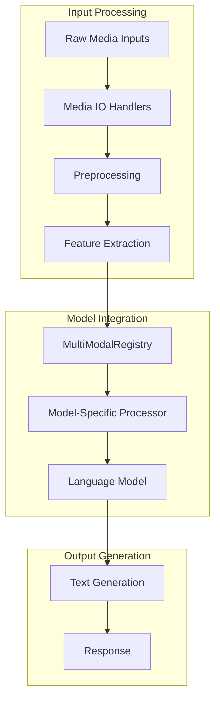
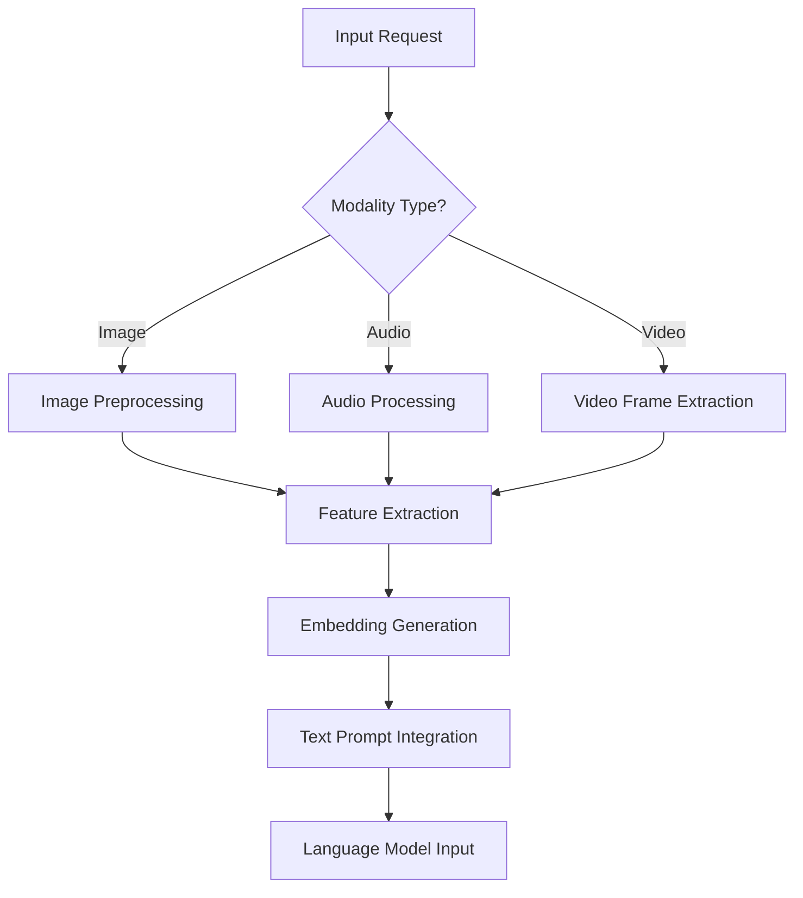
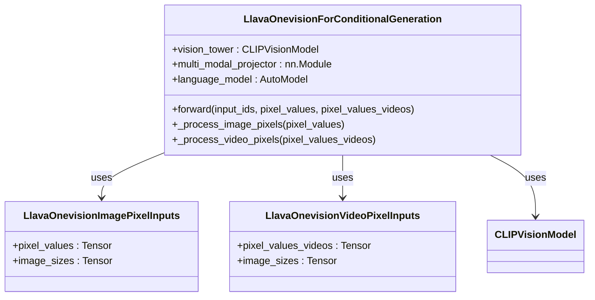
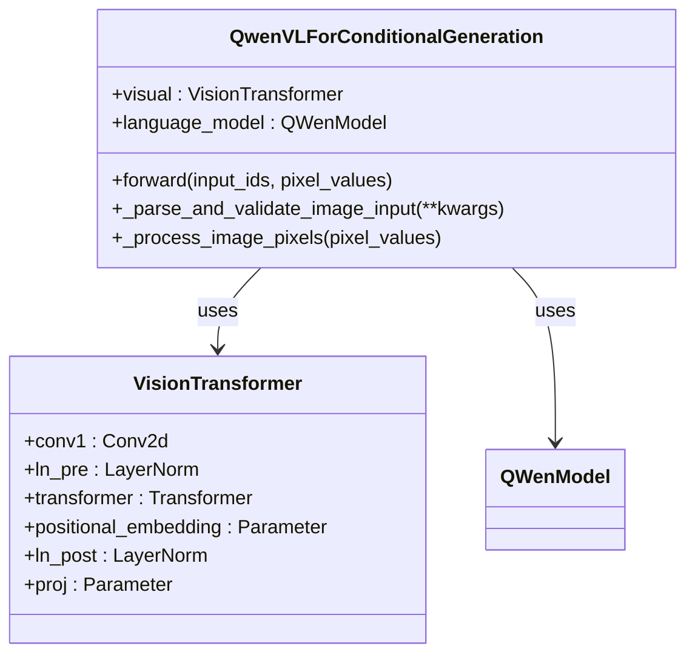
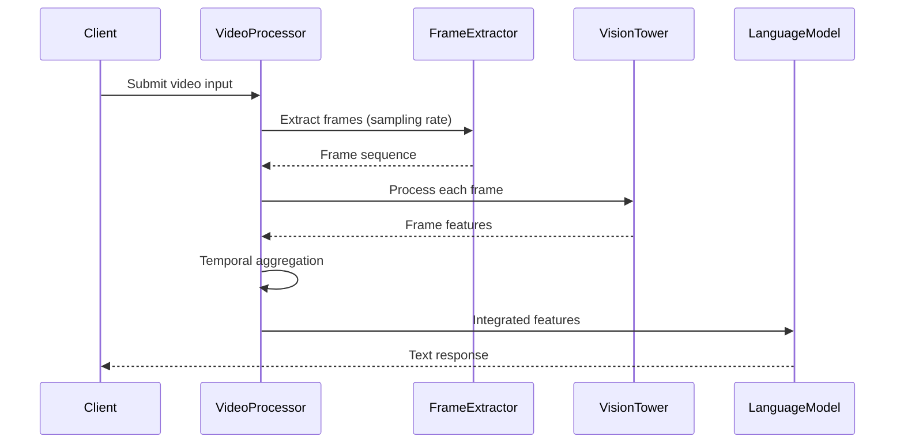
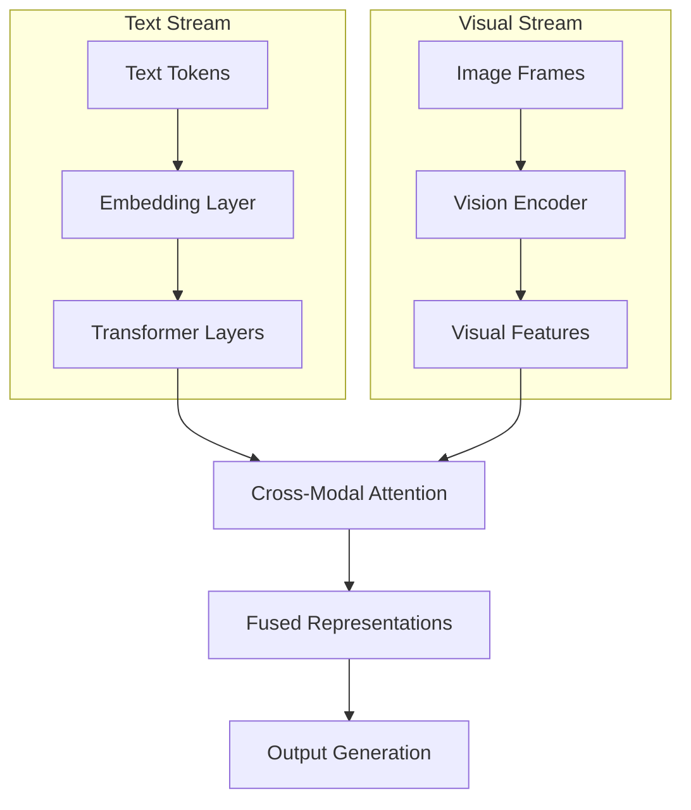

# Multi-modal Inference

<cite>
**Referenced Files in This Document**   
- [qwen2_5_omni_thinker.py](file://vllm/model_executor/models/qwen2_5_omni_thinker.py)
- [llava_onevision.py](file://vllm/model_executor/models/llava_onevision.py)
- [qwen_vl.py](file://vllm/model_executor/models/qwen_vl.py)
- [vision_language.py](file://examples/offline_inference/vision_language.py)
- [vision_language_multi_image.py](file://examples/offline_inference/vision_language_multi_image.py)
- [multimodal/__init__.py](file://vllm/multimodal/__init__.py)
- [multimodal/processing.py](file://vllm/multimodal/processing.py)
- [multimodal/inputs.py](file://vllm/multimodal/inputs.py)
- [multimodal/registry.py](file://vllm/multimodal/registry.py)
- [multimodal/image.py](file://vllm/multimodal/image.py)
- [multimodal/audio.py](file://vllm/multimodal/audio.py)
- [multimodal/video.py](file://vllm/multimodal/video.py)
</cite>

## Table of Contents
1. [Introduction](#introduction)
2. [Multi-modal Architecture Overview](#multi-modal-architecture-overview)
3. [Input Processing Pipeline](#input-processing-pipeline)
4. [Vision-Language Models Implementation](#vision-language-models-implementation)
5. [Audio and Video Processing](#audio-and-video-processing)
6. [Cross-modal Attention Mechanisms](#cross-modal-attention-mechanisms)
7. [KV Cache Management](#kv-cache-management)
8. [Performance Optimization](#performance-optimization)
9. [Troubleshooting Common Issues](#troubleshooting-common-issues)
10. [Conclusion](#conclusion)

## Introduction

vLLM provides a comprehensive framework for multi-modal inference, enabling the integration of text, images, audio, and video within a unified inference system. This documentation details the architecture and implementation of vLLM's multi-modal capabilities, focusing on how different media types are processed, encoded, and fused with language representations to enable rich multimodal understanding and generation.

The system supports various vision-language models such as LLaVA, Qwen-VL, and others, allowing users to process image inputs and generate text responses conditioned on visual content. The architecture is designed to efficiently handle the computational challenges associated with multi-modal processing while maintaining compatibility with the high-throughput inference capabilities that vLLM is known for.

**Section sources**
- [multimodal/__init__.py](file://vllm/multimodal/__init__.py#L1-L41)

## Multi-modal Architecture Overview

vLLM's multi-modal architecture is built around a modular design that separates concerns between input processing, feature extraction, and language modeling. The core components include:

1. **MultiModalRegistry**: A central registry that dispatches data processing according to the target model, enabling model-specific handling of multi-modal inputs.
2. **Processor Pipeline**: A series of processors that handle the transformation of raw media into model-ready inputs.
3. **Feature Extractors**: Specialized components for extracting features from different modalities (vision tower for images, audio encoder for audio, etc.).
4. **Language Model Integration**: Mechanisms for fusing multi-modal features with the language model's token embeddings.

The architecture follows a clean separation between the multi-modal processing components and the core language model, allowing for flexible integration of different vision encoders and language backbones.

**Diagram sources**
- [multimodal/registry.py](file://vllm/multimodal/registry.py#L91-L358)
- [multimodal/__init__.py](file://vllm/multimodal/__init__.py#L17-L41)

## Input Processing Pipeline

The input processing pipeline in vLLM handles the transformation of multi-modal inputs from their raw form to processed features that can be consumed by the language model. The pipeline consists of several key components:

### Media Input Handling

vLLM supports various input formats for different modalities through specialized MediaIO classes:

- **ImageMediaIO**: Handles image inputs in various formats (JPEG, PNG, etc.)
- **AudioMediaIO**: Processes audio files with support for resampling
- **VideoMediaIO**: Manages video inputs with frame sampling capabilities

Each MediaIO implementation provides methods for loading data from bytes, base64 strings, or file paths, ensuring consistent handling across different input sources.

### Multi-modal Data Processing

The processing pipeline follows a structured approach:

1. **Input Validation**: Ensures that provided inputs meet the requirements for the target model
2. **Preprocessing**: Applies model-specific transformations (resizing, normalization, etc.)
3. **Feature Extraction**: Generates embeddings from the preprocessed inputs
4. **Placeholder Replacement**: Integrates the extracted features into the text prompt at appropriate locations

The pipeline is designed to be extensible, allowing new modalities to be added through the registration system.

**Section sources**
- [multimodal/image.py](file://vllm/multimodal/image.py#L1-L135)
- [multimodal/audio.py](file://vllm/multimodal/audio.py#L1-L143)
- [multimodal/video.py](file://vllm/multimodal/video.py#L1-L334)
- [multimodal/processing.py](file://vllm/multimodal/processing.py#L1-L800)

## Vision-Language Models Implementation

vLLM supports several vision-language models through specialized implementations that handle the integration of visual features with language generation.

### LLaVA-OneVision Implementation

The LLaVA-OneVision model implementation demonstrates the integration of vision and language processing:

The implementation processes both images and videos through a shared vision tower (CLIP or SigLIP), with the extracted features projected into the language model's embedding space through a multi-modal projector.

### Qwen-VL Implementation

The Qwen-VL model follows a similar pattern with its own specialized components:

The Qwen-VL implementation uses a Vision Transformer architecture for image processing, with the extracted features integrated into the QWen language model.

**Section sources**
- [llava_onevision.py](file://vllm/model_executor/models/llava_onevision.py#L1-L200)
- [qwen_vl.py](file://vllm/model_executor/models/qwen_vl.py#L1-L200)

## Audio and Video Processing

vLLM provides specialized processing for audio and video modalities, handling the unique challenges associated with these media types.

### Audio Processing

Audio inputs are processed through a dedicated audio encoder that handles:

- **Resampling**: Converting audio to the required sample rate
- **Feature Extraction**: Generating spectrograms or other audio features
- **Temporal Processing**: Handling variable-length audio inputs

The system supports both raw audio inputs and pre-extracted audio embeddings, providing flexibility for different use cases.

### Video Processing

Video processing in vLLM involves several key steps:

1. **Frame Extraction**: Sampling frames from the video at specified intervals
2. **Frame Preprocessing**: Applying image preprocessing to each frame
3. **Temporal Modeling**: Handling the temporal relationships between frames
4. **Feature Aggregation**: Combining features from multiple frames

The VideoMediaIO component manages video loading and frame extraction, supporting various backends including OpenCV. The system can handle both uniform frame sampling and dynamic sampling based on video duration.

**Section sources**
- [multimodal/audio.py](file://vllm/multimodal/audio.py#L1-L143)
- [multimodal/video.py](file://vllm/multimodal/video.py#L1-L334)
- [qwen2_5_omni_thinker.py](file://vllm/model_executor/models/qwen2_5_omni_thinker.py#L762-L848)

## Cross-modal Attention Mechanisms

The integration of multi-modal features with language representations relies on sophisticated attention mechanisms that enable cross-modal understanding.

### Feature Fusion Strategies

vLLM implements several strategies for fusing multi-modal features with text:

1. **Early Fusion**: Visual features are projected into the token embedding space and concatenated with text embeddings
2. **Late Fusion**: Separate processing streams for text and vision, with fusion at later layers
3. **Cross-Attention**: Direct attention between text and visual features

The choice of fusion strategy depends on the specific model architecture and requirements.

### Attention Patterns

The cross-modal attention patterns vary by model but generally follow these principles:

- **Text-to-Image Attention**: Language model attends to relevant visual regions when generating text
- **Image-to-Text Attention**: Visual features influence the generation of text tokens
- **Multi-modal Context**: Both text and visual context are considered simultaneously

These attention mechanisms enable the model to ground its responses in the visual content while maintaining linguistic coherence.

**Section sources**
- [llava_onevision.py](file://vllm/model_executor/models/llava_onevision.py#L871-L906)
- [qwen_vl.py](file://vllm/model_executor/models/qwen_vl.py#L505-L655)

## KV Cache Management

Efficient KV cache management is crucial for multi-modal inference, especially when dealing with large visual feature sequences.

### Cache Optimization

vLLM implements several optimizations for multi-modal KV caching:

- **Selective Caching**: Only caching relevant portions of visual features
- **Memory Compression**: Efficient storage of multi-modal key-value pairs
- **Cache Sharing**: Reusing cached visual features across similar inputs

These optimizations help reduce memory overhead while maintaining inference performance.

### Cache Integration

The KV cache system integrates multi-modal features by:

1. **Extending Cache Structure**: Adding multi-modal key-value pairs to the standard text cache
2. **Positional Encoding**: Handling positional information for visual features
3. **Attention Masking**: Managing attention patterns between text and visual tokens

This integration allows the model to maintain context across both text and visual modalities during generation.

**Section sources**
- [multimodal/inputs.py](file://vllm/multimodal/inputs.py#L1-L800)
- [multimodal/processing.py](file://vllm/multimodal/processing.py#L668-L800)

## Performance Optimization

vLLM employs several strategies to optimize the performance of multi-modal inference.

### Computational Efficiency

Key optimization techniques include:

- **Batch Processing**: Efficient batching of multi-modal inputs
- **Memory Management**: Optimized memory allocation for large feature tensors
- **Kernel Optimization**: Specialized kernels for multi-modal operations

These optimizations ensure that multi-modal inference can be performed efficiently even on resource-constrained systems.

### Parallel Processing

The system leverages parallel processing capabilities:

- **Model Parallelism**: Distributing model components across multiple devices
- **Data Parallelism**: Processing multiple inputs simultaneously
- **Pipeline Parallelism**: Overlapping computation and communication

These parallelization strategies enable scalable multi-modal inference.

**Section sources**
- [multimodal/processing.py](file://vllm/multimodal/processing.py#L1-L800)
- [multimodal/inputs.py](file://vllm/multimodal/inputs.py#L1-L800)

## Troubleshooting Common Issues

When working with multi-modal inference in vLLM, several common issues may arise:

### Modality Alignment

Issues with aligning visual features with text prompts can occur due to:
- Incorrect placeholder positioning
- Mismatched feature dimensions
- Timing issues in video processing

Solutions include careful prompt engineering and validation of feature dimensions.

### Memory Requirements

Multi-modal models often have high memory requirements due to:
- Large visual feature sequences
- Extended KV caches
- Multiple processing streams

Mitigation strategies include batch size reduction, memory-efficient attention, and selective caching.

### Computational Overhead

The computational overhead of multi-modal processing can be addressed by:
- Using pre-extracted embeddings
- Optimizing preprocessing pipelines
- Leveraging hardware acceleration

These approaches help maintain acceptable inference latency.

**Section sources**
- [vision_language.py](file://examples/offline_inference/vision_language.py#L1-L800)
- [vision_language_multi_image.py](file://examples/offline_inference/vision_language_multi_image.py#L653-L693)

## Conclusion

vLLM's multi-modal inference capabilities provide a robust framework for integrating various media types with language generation. The architecture combines efficient processing pipelines with sophisticated fusion mechanisms, enabling high-quality multi-modal understanding and generation. By leveraging the system's modular design and optimization techniques, developers can build powerful applications that leverage the synergy between different modalities while maintaining performance and scalability.

The implementation details covered in this documentation provide a comprehensive understanding of how vLLM handles multi-modal inputs, from initial processing through to final generation, making it accessible to both beginners and experienced developers working with multi-modal AI systems.