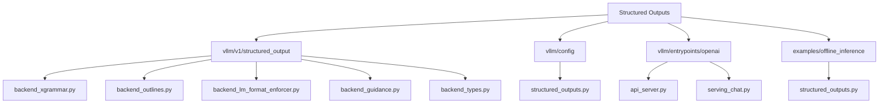
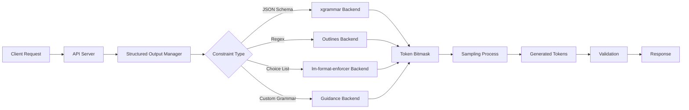
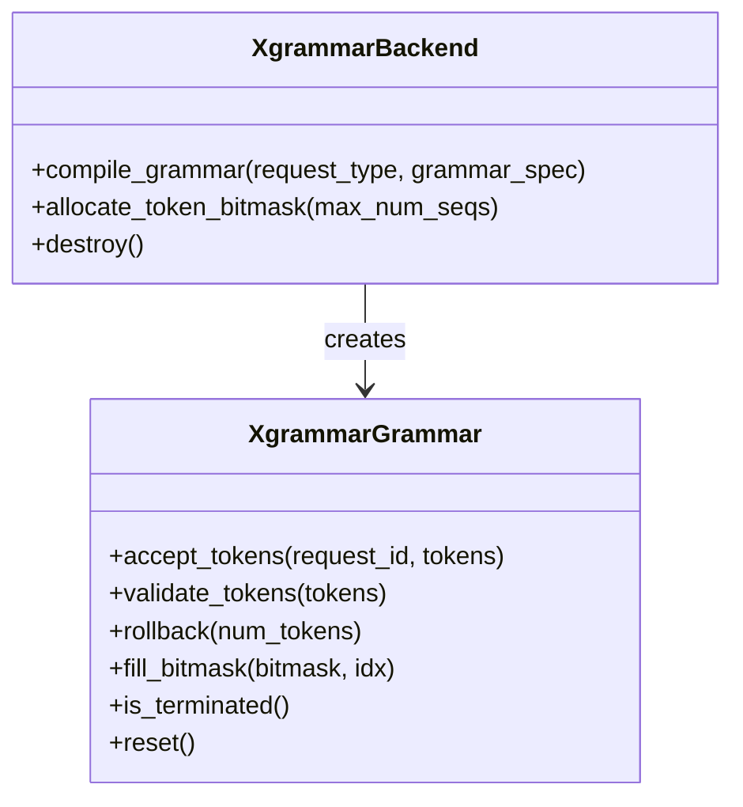
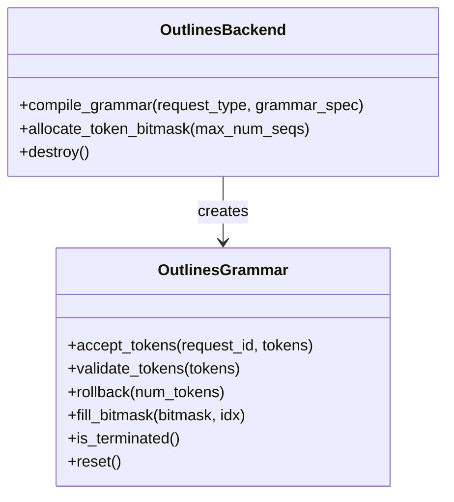
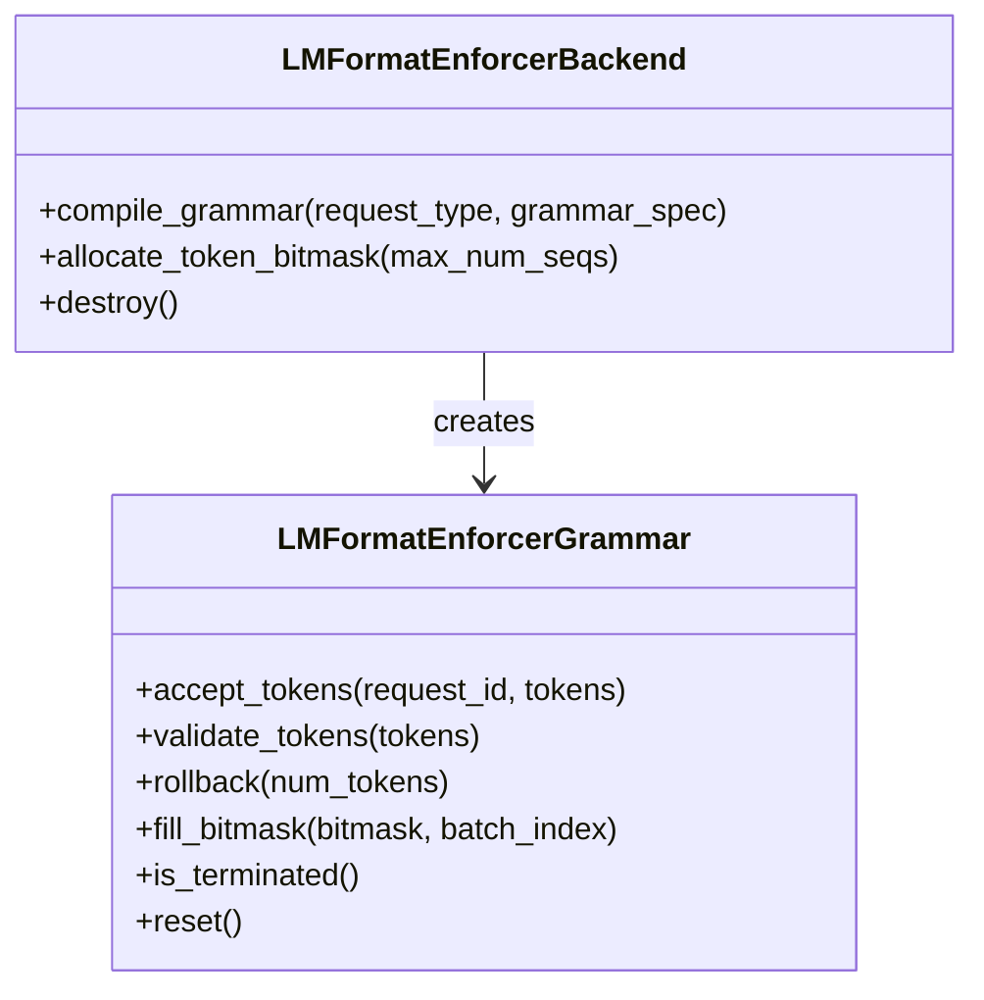
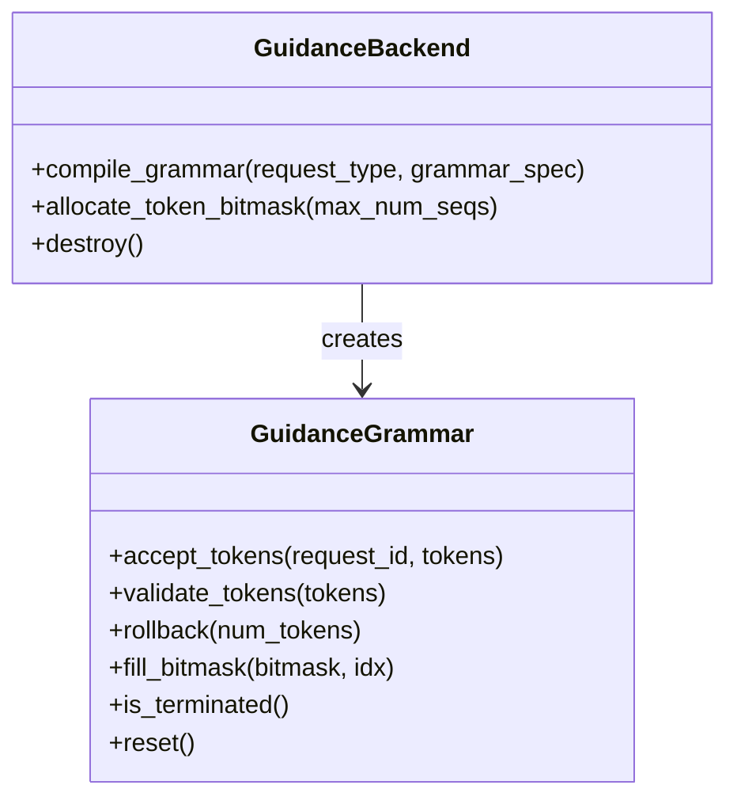
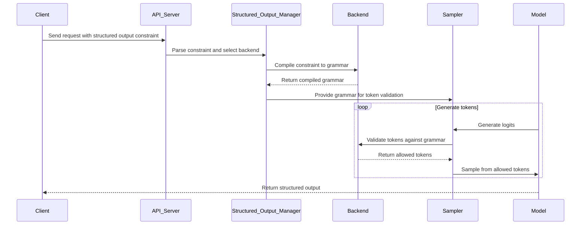
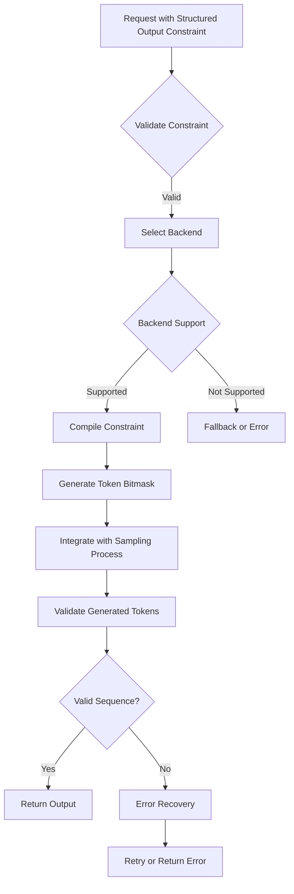
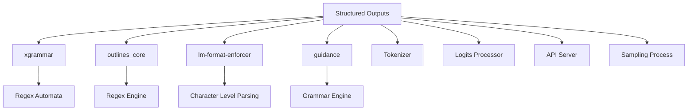

# Structured Outputs

<cite>
**Referenced Files in This Document**   
- [structured_outputs.py](file://vllm/sampling_params.py#L33-L46)
- [backend_xgrammar.py](file://vllm/v1/structured_output/backend_xgrammar.py)
- [backend_outlines.py](file://vllm/v1/structured_output/backend_outlines.py)
- [backend_lm_format_enforcer.py](file://vllm/v1/structured_output/backend_lm_format_enforcer.py)
- [backend_guidance.py](file://vllm/v1/structured_output/backend_guidance.py)
- [backend_types.py](file://vllm/v1/structured_output/backend_types.py)
- [request.py](file://vllm/v1/structured_output/request.py)
- [structured_outputs.py](file://vllm/config/structured_outputs.py)
- [gpu_input_batch.py](file://vllm/v1/worker/gpu_input_batch.py)
- [structured_outputs.py](file://examples/offline_inference/structured_outputs.py)
- [api_server.py](file://vllm/entrypoints/openai/api_server.py)
- [serving_chat.py](file://vllm/entrypoints/openai/serving_chat.py)
</cite>

## Table of Contents
1. [Introduction](#introduction)
2. [Project Structure](#project-structure)
3. [Core Components](#core-components)
4. [Architecture Overview](#architecture-overview)
5. [Detailed Component Analysis](#detailed-component-analysis)
6. [Dependency Analysis](#dependency-analysis)
7. [Performance Considerations](#performance-considerations)
8. [Troubleshooting Guide](#troubleshooting-guide)
9. [Conclusion](#conclusion)

## Introduction
The vLLM structured outputs system enables constrained text generation to produce valid JSON outputs according to specified schemas. This documentation provides a comprehensive analysis of the implementation details, architecture, and integration points of the structured output engine. The system supports multiple backend libraries including xgrammar, outlines, and lm-format-enforcer to validate generated tokens against target schemas during the sampling process. This ensures reliable generation of structured data for applications requiring predictable output formats.

## Project Structure
The structured outputs functionality in vLLM is organized across multiple directories with clear separation of concerns. The core implementation resides in the `vllm/v1/structured_output` directory, which contains backend-specific implementations and shared types. Configuration options are defined in `vllm/config/structured_outputs.py`, while integration with the API server is handled in `vllm/entrypoints/openai/`. Example implementations can be found in the examples directory, demonstrating various use cases for structured output constraints.

**Diagram sources**
- [backend_xgrammar.py](file://vllm/v1/structured_output/backend_xgrammar.py)
- [backend_outlines.py](file://vllm/v1/structured_output/backend_outlines.py)
- [backend_lm_format_enforcer.py](file://vllm/v1/structured_output/backend_lm_format_enforcer.py)
- [backend_guidance.py](file://vllm/v1/structured_output/backend_guidance.py)
- [backend_types.py](file://vllm/v1/structured_output/backend_types.py)
- [structured_outputs.py](file://vllm/config/structured_outputs.py)
- [api_server.py](file://vllm/entrypoints/openai/api_server.py)
- [serving_chat.py](file://vllm/entrypoints/openai/serving_chat.py)
- [structured_outputs.py](file://examples/offline_inference/structured_outputs.py)

**Section sources**
- [backend_xgrammar.py](file://vllm/v1/structured_output/backend_xgrammar.py)
- [backend_outlines.py](file://vllm/v1/structured_output/backend_outlines.py)
- [backend_lm_format_enforcer.py](file://vllm/v1/structured_output/backend_lm_format_enforcer.py)
- [backend_guidance.py](file://vllm/v1/structured_output/backend_guidance.py)
- [backend_types.py](file://vllm/v1/structured_output/backend_types.py)
- [structured_outputs.py](file://vllm/config/structured_outputs.py)
- [api_server.py](file://vllm/entrypoints/openai/api_server.py)
- [serving_chat.py](file://vllm/entrypoints/openai/serving_chat.py)
- [structured_outputs.py](file://examples/offline_inference/structured_outputs.py)

## Core Components
The structured outputs system in vLLM consists of several core components that work together to constrain text generation. The `StructuredOutputsParams` class defines the parameters for structured output constraints, including JSON schema, regex patterns, choice lists, and custom grammars. Multiple backend implementations handle the actual validation and token restriction during generation. The system integrates with the sampling process through logits processors that modify the probability distribution of tokens based on the current state of the structured output constraint.

**Section sources**
- [structured_outputs.py](file://vllm/sampling_params.py#L33-L46)
- [backend_xgrammar.py](file://vllm/v1/structured_output/backend_xgrammar.py)
- [backend_outlines.py](file://vllm/v1/structured_output/backend_outlines.py)
- [backend_lm_format_enforcer.py](file://vllm/v1/structured_output/backend_lm_format_enforcer.py)
- [backend_guidance.py](file://vllm/v1/structured_output/backend_guidance.py)

## Architecture Overview
The structured outputs architecture in vLLM follows a modular design with clear separation between the configuration layer, backend implementations, and integration points. The system uses a pluggable backend architecture that allows different constraint validation libraries to be used interchangeably. When a request with structured output constraints is received, the system selects an appropriate backend based on the constraint type and configuration. The selected backend compiles the constraint into a finite state machine that guides the token generation process.

**Diagram sources**
- [backend_xgrammar.py](file://vllm/v1/structured_output/backend_xgrammar.py)
- [backend_outlines.py](file://vllm/v1/structured_output/backend_outlines.py)
- [backend_lm_format_enforcer.py](file://vllm/v1/structured_output/backend_lm_format_enforcer.py)
- [backend_guidance.py](file://vllm/v1/structured_output/backend_guidance.py)
- [gpu_input_batch.py](file://vllm/v1/worker/gpu_input_batch.py)

## Detailed Component Analysis

### Backend Implementations
The structured outputs system in vLLM supports multiple backend libraries, each with its own strengths and capabilities. The choice of backend can be specified in the configuration or automatically selected based on the constraint type and other factors.

#### xgrammar Backend
The xgrammar backend provides high-performance validation for JSON schemas, regex patterns, and custom grammars. It compiles constraints into efficient finite state machines that can be used to validate token sequences during generation. The backend supports advanced features like jump-forward decoding for improved performance.

**Diagram sources**
- [backend_xgrammar.py](file://vllm/v1/structured_output/backend_xgrammar.py)

#### Outlines Backend
The outlines backend uses the outlines_core library to provide structured output capabilities. It converts JSON schemas to regex patterns and uses a guide-based approach to constrain token generation. This backend is particularly effective for complex JSON schema validation.

**Diagram sources**
- [backend_outlines.py](file://vllm/v1/structured_output/backend_outlines.py)

#### lm-format-enforcer Backend
The lm-format-enforcer backend uses the lm-format-enforcer library to enforce structured output constraints. It provides a flexible framework for defining custom parsers and validators for various output formats.

**Diagram sources**
- [backend_lm_format_enforcer.py](file://vllm/v1/structured_output/backend_lm_format_enforcer.py)

#### Guidance Backend
The guidance backend uses the guidance library to provide structured output capabilities. It supports complex grammar definitions and provides fine-grained control over the generation process.

**Diagram sources**
- [backend_guidance.py](file://vllm/v1/structured_output/backend_guidance.py)

### Integration with Sampling Process
The structured outputs system integrates with the sampling process through a logits processor that modifies the probability distribution of tokens based on the current state of the structured output constraint. When a request with structured output constraints is processed, the system creates a grammar bitmask that indicates which tokens are allowed at each position in the sequence.

**Diagram sources**
- [backend_types.py](file://vllm/v1/structured_output/backend_types.py)
- [gpu_input_batch.py](file://vllm/v1/worker/gpu_input_batch.py)
- [structured_outputs.py](file://vllm/sampling_params.py#L33-L46)

### Configuration and Validation
The structured outputs system provides comprehensive configuration options through the `StructuredOutputsConfig` class. These options allow fine-tuning of the behavior for different use cases and constraints.

**Diagram sources**
- [structured_outputs.py](file://vllm/config/structured_outputs.py)
- [backend_xgrammar.py](file://vllm/v1/structured_output/backend_xgrammar.py)
- [backend_outlines.py](file://vllm/v1/structured_output/backend_outlines.py)
- [backend_lm_format_enforcer.py](file://vllm/v1/structured_output/backend_lm_format_enforcer.py)

**Section sources**
- [structured_outputs.py](file://vllm/config/structured_outputs.py)
- [backend_xgrammar.py](file://vllm/v1/structured_output/backend_xgrammar.py)
- [backend_outlines.py](file://vllm/v1/structured_output/backend_outlines.py)
- [backend_lm_format_enforcer.py](file://vllm/v1/structured_output/backend_lm_format_enforcer.py)
- [backend_guidance.py](file://vllm/v1/structured_output/backend_guidance.py)

## Dependency Analysis
The structured outputs system in vLLM has dependencies on several external libraries and internal components. The primary external dependencies are the backend libraries: xgrammar, outlines_core, lm-format-enforcer, and guidance. These libraries provide the core constraint validation capabilities. The system also depends on the tokenizer, logits processor, and API server components within vLLM.

**Diagram sources**
- [backend_xgrammar.py](file://vllm/v1/structured_output/backend_xgrammar.py)
- [backend_outlines.py](file://vllm/v1/structured_output/backend_outlines.py)
- [backend_lm_format_enforcer.py](file://vllm/v1/structured_output/backend_lm_format_enforcer.py)
- [backend_guidance.py](file://vllm/v1/structured_output/backend_guidance.py)
- [gpu_input_batch.py](file://vllm/v1/worker/gpu_input_batch.py)

## Performance Considerations
The structured outputs system in vLLM is designed to minimize performance overhead while ensuring reliable constraint validation. The use of compiled finite state machines and efficient bitmask operations allows for fast token validation during generation. The system also supports speculative decoding to further improve throughput for structured output requests.

**Section sources**
- [backend_xgrammar.py](file://vllm/v1/structured_output/backend_xgrammar.py)
- [backend_outlines.py](file://vllm/v1/structured_output/backend_outlines.py)
- [backend_lm_format_enforcer.py](file://vllm/v1/structured_output/backend_lm_format_enforcer.py)
- [backend_guidance.py](file://vllm/v1/structured_output/backend_guidance.py)

## Troubleshooting Guide
Common issues with structured outputs in vLLM include schema validation errors, unsupported constraint types, and performance bottlenecks. The system provides detailed error messages to help diagnose and resolve these issues. For schema validation errors, ensure that the JSON schema is valid and supported by the selected backend. For performance issues, consider using the xgrammar backend which provides optimized validation for common constraint types.

**Section sources**
- [backend_xgrammar.py](file://vllm/v1/structured_output/backend_xgrammar.py)
- [backend_outlines.py](file://vllm/v1/structured_output/backend_outlines.py)
- [backend_lm_format_enforcer.py](file://vllm/v1/structured_output/backend_lm_format_enforcer.py)
- [backend_guidance.py](file://vllm/v1/structured_output/backend_guidance.py)
- [api_server.py](file://vllm/entrypoints/openai/api_server.py)

## Conclusion
The structured outputs system in vLLM provides a robust and flexible framework for generating valid JSON outputs according to specified schemas. By supporting multiple backend libraries and integrating seamlessly with the sampling process, the system enables reliable structured data generation for a wide range of applications. The modular architecture allows for easy extension and customization, making it suitable for both simple and complex use cases.