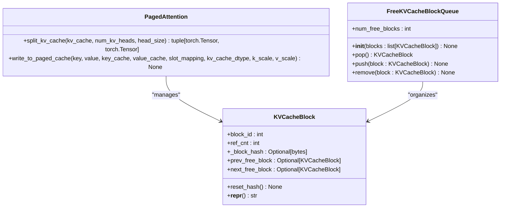
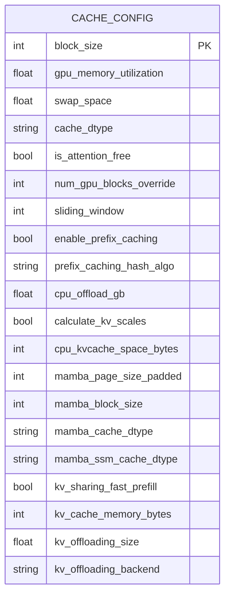
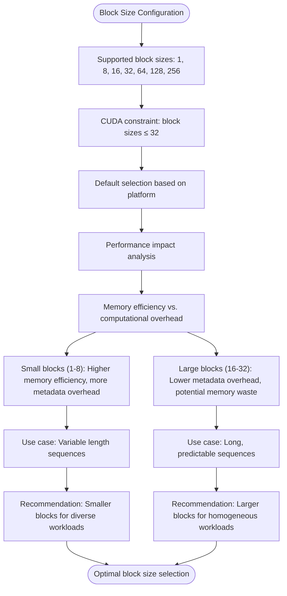
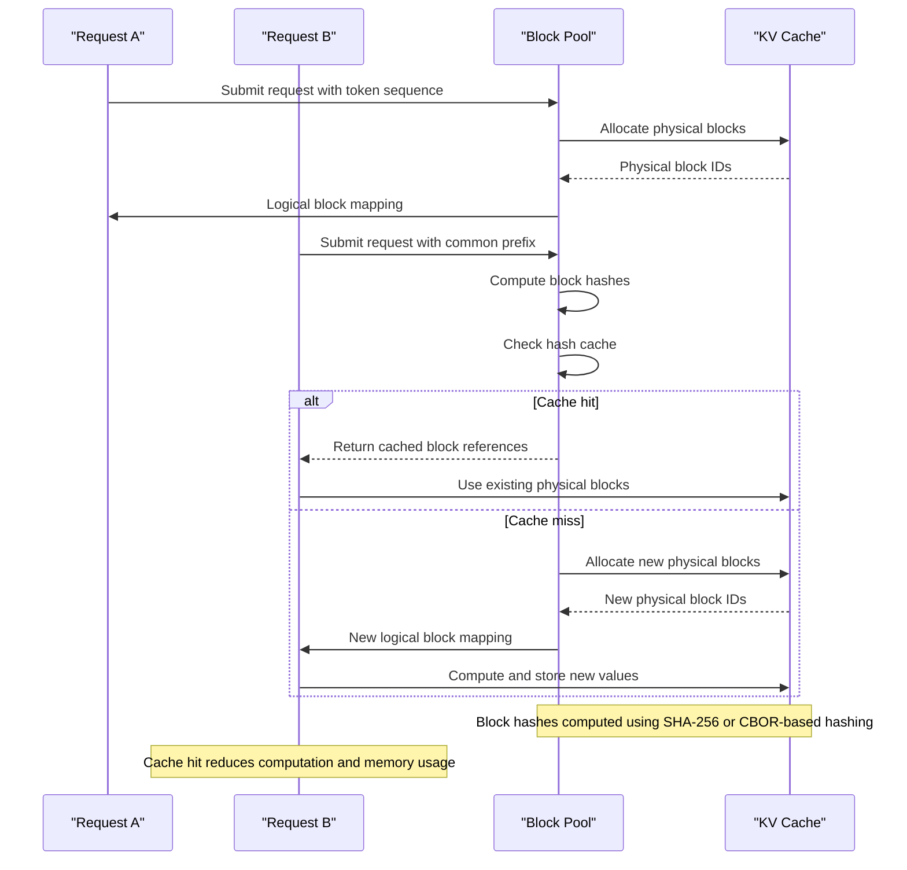
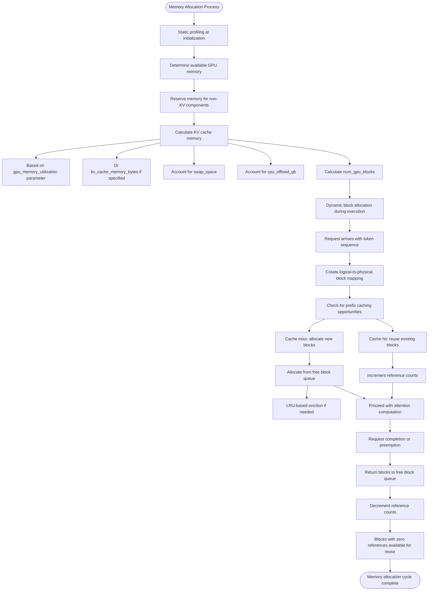
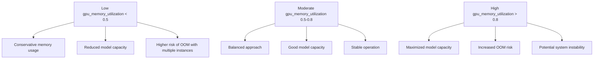
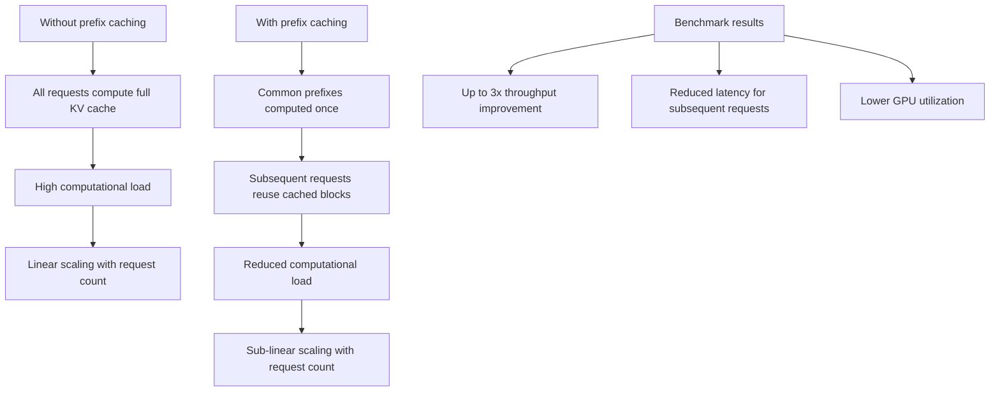
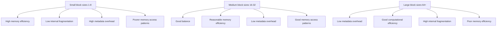

# Cache Configuration

<cite>
**Referenced Files in This Document**   
- [cache.py](file://vllm/config/cache.py)
- [paged_attn.py](file://vllm/attention/ops/paged_attn.py)
- [kv_cache_manager.py](file://vllm/v1/core/kv_cache_manager.py)
- [block_pool.py](file://vllm/v1/core/block_pool.py)
- [kv_cache_utils.py](file://vllm/v1/core/kv_cache_utils.py)
- [mem_utils.py](file://vllm/utils/mem_utils.py)
- [prefix_caching.py](file://examples/offline_inference/prefix_caching.py)
- [test_prefix_caching.py](file://tests/v1/core/test_prefix_caching.py)
</cite>

## Table of Contents
1. [Introduction](#introduction)
2. [PagedAttention Memory Management](#pagedattention-memory-management)
3. [Cache Configuration Parameters](#cache-configuration-parameters)
4. [Block Size Settings](#block-size-settings)
5. [Cache Eviction Policies](#cache-eviction-policies)
6. [Physical vs Logical Token Blocks](#physical-vs-logical-token-blocks)
7. [Cache Hit/Miss Patterns](#cache-hitmiss-patterns)
8. [Memory Allocation Strategies](#memory-allocation-strategies)
9. [Attention Backend Integration](#attention-backend-integration)
10. [Configuration Examples](#configuration-examples)
11. [Performance Impact Analysis](#performance-impact-analysis)
12. [Common Issues and Solutions](#common-issues-and-solutions)
13. [Conclusion](#conclusion)

## Introduction

vLLM's KV cache management system implements an advanced memory management approach based on PagedAttention, which enables efficient handling of large language model workloads. The system is designed to optimize memory utilization while maintaining high throughput for both prefill and decoding phases. This documentation provides a comprehensive analysis of the cache configuration system, focusing on the implementation details of PagedAttention, block size settings, cache eviction policies, and their impact on performance.

The KV cache system in vLLM addresses the memory bottleneck in large language models by implementing a paged memory approach similar to virtual memory in operating systems. Instead of allocating a contiguous memory space for the entire KV cache, the system divides it into fixed-size blocks that can be managed independently. This approach enables several key benefits including memory sharing between requests with common prefixes, efficient memory utilization, and support for variable sequence lengths.

**Section sources**
- [cache.py](file://vllm/config/cache.py#L1-L221)
- [kv_cache_manager.py](file://vllm/v1/core/kv_cache_manager.py#L1-L412)

## PagedAttention Memory Management

PagedAttention is the core memory management mechanism in vLLM that enables efficient KV cache handling through a paged memory approach. The system divides the KV cache into fixed-size blocks, allowing for non-contiguous memory allocation and efficient memory sharing between requests.

The implementation separates key and value caches into distinct tensors, with each block containing a fixed number of tokens determined by the block_size parameter. The memory layout is optimized for GPU architectures, with key and value caches stored in a format that maximizes memory bandwidth utilization during attention computations.



**Diagram sources**
- [paged_attn.py](file://vllm/attention/ops/paged_attn.py#L15-L52)
- [kv_cache_utils.py](file://vllm/v1/core/kv_cache_utils.py#L120-L190)

The PagedAttention system implements two primary operations: splitting the KV cache into key and value components, and writing to the paged cache. The split_kv_cache method separates the combined KV cache tensor into individual key and value caches with appropriate reshaping for efficient memory access patterns. The write_to_paged_cache method handles the actual writing of key-value pairs to the paged cache system, using custom CUDA operations for optimal performance.

**Section sources**
- [paged_attn.py](file://vllm/attention/ops/paged_attn.py#L1-L52)
- [csrc/attention/paged_attention_v1.cu](file://csrc/attention/paged_attention_v1.cu)
- [csrc/attention/paged_attention_v2.cu](file://csrc/attention/paged_attention_v2.cu)

## Cache Configuration Parameters

The CacheConfig class in vLLM provides comprehensive control over the KV cache system through a variety of parameters that affect memory management, performance, and functionality.



**Diagram sources**
- [cache.py](file://vllm/config/cache.py#L39-L221)

The key configuration parameters include:

- **block_size**: Determines the number of tokens per cache block, with supported values of 1, 8, 16, 32, 64, 128, and 256. On CUDA devices, only block sizes up to 32 are supported.
- **gpu_memory_utilization**: Controls the fraction of GPU memory allocated for the model executor, ranging from 0 to 1. The default value is 0.9.
- **cache_dtype**: Specifies the data type for KV cache storage, with options including "auto", "bfloat16", "fp8", "fp8_e4m3", "fp8_e5m2", "fp8_inc", and "fp8_ds_mla".
- **enable_prefix_caching**: Enables or disables prefix caching, which allows sharing of KV cache blocks between requests with common prefixes.
- **prefix_caching_hash_algo**: Sets the hash algorithm for prefix caching, with options "sha256" and "sha256_cbor".
- **cpu_offload_gb**: Specifies the amount of space in GiB to offload to CPU per GPU, enabling virtual expansion of GPU memory.
- **kv_offloading_size** and **kv_offloading_backend**: Enable KV cache offloading to CPU with configurable buffer size and backend selection.

**Section sources**
- [cache.py](file://vllm/config/cache.py#L39-L221)
- [engine/arg_utils.py](file://vllm/engine/arg_utils.py#L58-L64)

## Block Size Settings

Block size configuration is a critical aspect of vLLM's KV cache management system, directly impacting memory efficiency, computational performance, and cache utilization patterns. The block_size parameter determines the number of tokens stored in each physical cache block.



**Diagram sources**
- [cache.py](file://vllm/config/cache.py#L22-L23)
- [test_prefix_caching.py](file://tests/v1/core/test_prefix_caching.py#L132-L133)

The block size selection involves a trade-off between memory efficiency and computational overhead. Smaller block sizes (1-8 tokens) provide higher memory efficiency by reducing internal fragmentation, as unused space within blocks is minimized. However, they increase metadata overhead due to the larger number of blocks that need to be tracked. Larger block sizes (16-32 tokens) reduce metadata overhead and can improve computational efficiency through better memory access patterns, but may lead to increased memory waste when sequences don't align perfectly with block boundaries.

The system automatically selects an appropriate block size based on the current platform when not explicitly specified. For CUDA devices, only block sizes up to 32 are supported, reflecting hardware and performance considerations. The choice of block size also affects cache hit rates in prefix caching scenarios, as larger blocks require more exact sequence alignment to achieve cache hits.

**Section sources**
- [cache.py](file://vllm/config/cache.py#L22-L48)
- [test_prefix_caching.py](file://tests/v1/core/test_prefix_caching.py#L132-L133)

## Cache Eviction Policies

vLLM implements a sophisticated cache eviction system based on a free block queue that manages unused KV cache blocks using a least-recently-used (LRU) policy with additional considerations for block allocation patterns.

```mermaid
classDiagram
class FreeKVCacheBlockQueue {
+num_free_blocks : int
+__init__(blocks : list[KVCacheBlock]) None
+pop() KVCacheBlock
+push(block : KVCacheBlock) None
+remove(block : KVCacheBlock) None
}
class KVCacheBlock {
+block_id : int
+ref_cnt : int
+_block_hash : Optional[bytes]
+prev_free_block : Optional[KVCacheBlock]
+next_free_block : Optional[KVCacheBlock]
+reset_hash() None
}
FreeKVCacheBlockQueue "1" --> "0..*" KVCacheBlock : "manages"
note right of FreeKVCacheBlockQueue
Implements LRU eviction policy with
secondary ordering by block chain position
- Least recently used blocks at front
- Within same access time, tail blocks prioritized
- Doubly-linked list for O(1) removal
end note
```

**Diagram sources**
- [kv_cache_utils.py](file://vllm/v1/core/kv_cache_utils.py#L155-L190)
- [block_pool.py](file://vllm/v1/core/block_pool.py)

The eviction policy prioritizes blocks based on two criteria:
1. **Last accessed time**: The primary factor is how recently a block was used, with least recently used blocks evicted first (LRU policy).
2. **Block chain position**: When multiple blocks have the same last accessed time (allocated in the same sequence), blocks at the tail of block chains are prioritized for eviction.

The implementation uses a doubly-linked list structure to enable O(1) removal of blocks from the middle of the queue, which is essential for efficient memory management in high-throughput scenarios. The free block queue is initialized with all available blocks ordered by block ID, and as blocks are allocated and freed, they are reorganized according to the eviction policy.

When a request completes or is preempted, its blocks are returned to the free block queue in reverse order of their allocation. This ensures that blocks at the end of sequences (which are less likely to be reused) are prioritized for eviction, while preserving blocks at the beginning of sequences that may be shared with other requests through prefix caching.

**Section sources**
- [kv_cache_utils.py](file://vllm/v1/core/kv_cache_utils.py#L155-L190)
- [block_pool.py](file://vllm/v1/core/block_pool.py)

## Physical vs Logical Token Blocks

The distinction between physical and logical token blocks is fundamental to vLLM's memory management system, enabling efficient memory utilization while maintaining the abstraction of contiguous token sequences.

```mermaid
classDiagram
class LogicalTokenBlock {
+token_ids : List[int]
+prev_block : Optional[LogicalTokenBlock]
+next_block : Optional[LogicalTokenBlock]
+is_full() : bool
+remaining_space() : int
}
class PhysicalTokenBlock {
+block_id : int
+memory_address : int
+ref_cnt : int
+block_hash : Optional[bytes]
+prev_free_block : Optional[PhysicalTokenBlock]
+next_free_block : Optional[PhysicalTokenBlock]
}
class BlockTable {
+logical_to_physical : Dict[int, int]
+physical_to_logical : Dict[int, int]
+get_physical_block_id(logical_id : int) : int
+get_logical_block_id(physical_id : int) : int
+map_block(logical_id : int, physical_id : int) None
}
LogicalTokenBlock "1" --> "1" PhysicalTokenBlock : "mapped to"
BlockTable "1" --> "0..*" LogicalTokenBlock : "manages"
BlockTable "1" --> "0..*" PhysicalTokenBlock : "manages"
note right of LogicalTokenBlock
Represents the logical view of token
sequences from the model's perspective
- Abstracts away physical memory layout
- Maintains sequence continuity
- Handles variable length sequences
end note
note right of PhysicalTokenBlock
Represents the physical memory
allocation units
- Fixed size memory chunks
- Managed by memory allocator
- Shared between logical sequences
end note
```

**Diagram sources**
- [kv_cache_utils.py](file://vllm/v1/core/kv_cache_utils.py#L120-L152)
- [block_pool.py](file://vllm/v1/core/block_pool.py)

Physical token blocks are fixed-size memory allocations that serve as the basic unit of memory management in the KV cache system. Each physical block has a unique block_id and contains a fixed number of tokens determined by the block_size parameter. Physical blocks are managed by the memory allocator and can be shared between multiple logical sequences when prefix caching is enabled.

Logical token blocks represent the model's view of the token sequence and are mapped to physical blocks through a block table. This indirection allows the system to maintain the abstraction of contiguous token sequences while enabling non-contiguous physical memory allocation. The logical block structure maintains sequence continuity and handles variable-length sequences, while the physical block structure enables efficient memory management and sharing.

The mapping between logical and physical blocks is stored in block tables, which are used during attention operations to locate the physical memory locations corresponding to logical token positions. This two-level addressing system enables the key benefits of PagedAttention, including memory sharing, efficient memory utilization, and support for variable sequence lengths.

**Section sources**
- [kv_cache_utils.py](file://vllm/v1/core/kv_cache_utils.py#L120-L152)
- [block_pool.py](file://vllm/v1/core/block_pool.py)

## Cache Hit/Miss Patterns

Cache hit and miss patterns in vLLM's KV cache system are determined by the prefix caching mechanism, which enables sharing of KV cache blocks between requests with common token sequences.



**Diagram sources**
- [kv_cache_manager.py](file://vllm/v1/core/kv_cache_manager.py#L164-L194)
- [block_pool.py](file://vllm/v1/core/block_pool.py#L209-L268)

Cache hits occur when a request's token sequence matches previously computed blocks, as determined by cryptographic hashing of block contents. The system uses either SHA-256 or CBOR-based hashing (sha256_cbor) to generate unique identifiers for blocks based on their token content and parent block relationships. When a cache hit is detected, the system can reuse existing KV cache blocks instead of recomputing them, resulting in significant computational savings.

The cache hit detection process involves:
1. Computing block hashes for the request's token sequence
2. Checking the block hash cache for matching entries
3. Returning references to existing physical blocks for cache hits
4. Allocating new blocks for cache misses

Cache misses occur when no matching blocks are found in the cache, requiring the system to allocate new physical blocks and compute the corresponding KV values. The frequency of cache misses depends on the similarity of request sequences and the block size configuration, with smaller blocks requiring more exact sequence alignment to achieve cache hits.

The system maintains reference counts for each physical block to track how many logical sequences are using it. When a request completes, the reference count is decremented, and blocks with zero references are returned to the free block pool for reuse.

**Section sources**
- [kv_cache_manager.py](file://vllm/v1/core/kv_cache_manager.py#L164-L194)
- [block_pool.py](file://vllm/v1/core/block_pool.py#L209-L268)

## Memory Allocation Strategies

vLLM employs a sophisticated memory allocation strategy that combines static profiling with dynamic allocation to optimize KV cache utilization across different workloads and hardware configurations.



**Diagram sources**
- [cache.py](file://vllm/config/cache.py#L49-L58)
- [mem_utils.py](file://vllm/utils/mem_utils.py)
- [kv_cache_manager.py](file://vllm/v1/core/kv_cache_manager.py)

The memory allocation strategy begins with static profiling at initialization, where the system determines the number of GPU blocks (num_gpu_blocks) based on the available GPU memory and configuration parameters. The gpu_memory_utilization parameter controls the fraction of GPU memory allocated for the model executor, while the swap_space parameter specifies the CPU swap space per GPU.

During execution, the system dynamically allocates blocks to requests based on their token sequences. When a request arrives, the system creates a logical-to-physical block mapping and checks for prefix caching opportunities. If a cache hit is detected, existing blocks are reused; otherwise, new blocks are allocated from the free block queue.

The allocation process considers several factors:
- **Memory availability**: The system tracks available memory and evicts least recently used blocks when necessary
- **Prefix caching**: Common prefixes between requests are identified and shared to reduce memory usage
- **Block size alignment**: Allocations are aligned to block boundaries for efficient memory access
- **Reference counting**: Blocks in use by multiple requests are tracked to prevent premature deallocation

The system also supports CPU offloading through the cpu_offload_gb parameter, which specifies the amount of space in GiB to offload to CPU per GPU. This enables virtual expansion of GPU memory by storing less frequently accessed blocks on CPU memory and transferring them to GPU memory on demand.

**Section sources**
- [cache.py](file://vllm/config/cache.py#L49-L91)
- [mem_utils.py](file://vllm/utils/mem_utils.py)
- [kv_cache_manager.py](file://vllm/v1/core/kv_cache_manager.py)

## Attention Backend Integration

The integration between cache parameters and attention backends in vLLM is a critical aspect of the system's performance optimization, enabling efficient utilization of hardware-specific features and memory hierarchies.

```mermaid
classDiagram
class CacheConfig {
+block_size : int
+cache_dtype : str
+gpu_memory_utilization : float
+enable_prefix_caching : bool
}
class AttentionBackend {
+create_attention_metadata() AttentionMetadata
+attention_forward(query, key, value, metadata) torch.Tensor
}
class PagedAttentionBackend {
+create_paged_metadata(block_tables, slot_mappings) PagedAttentionMetadata
+paged_attention_forward(query, key_cache, value_cache, metadata) torch.Tensor
}
class FlashAttentionBackend {
+create_flash_metadata() FlashAttentionMetadata
+flash_attention_forward(query, key, value, metadata) torch.Tensor
}
CacheConfig --> AttentionBackend : "configures"
AttentionBackend <|-- PagedAttentionBackend
AttentionBackend <|-- FlashAttentionBackend
PagedAttentionBackend --> CacheConfig : "uses block_size, cache_dtype"
FlashAttentionBackend --> CacheConfig : "uses cache_dtype"
note right of PagedAttentionBackend
Uses block_size for block table
creation and slot mapping
Leverages cache_dtype for
memory layout optimization
end note
note right of FlashAttentionBackend
Uses cache_dtype for kernel
selection and memory layout
May ignore block_size when
using contiguous memory
end note
```

**Diagram sources**
- [cache.py](file://vllm/config/cache.py)
- [attention/ops/paged_attn.py](file://vllm/attention/ops/paged_attn.py)
- [attention/backends/](file://vllm/attention/backends/)

The cache configuration parameters directly influence the behavior of attention backends through several mechanisms:

1. **Block size propagation**: The block_size parameter is used by PagedAttention backends to create block tables and slot mappings that translate logical token positions to physical memory locations. This information is encapsulated in attention metadata that is passed to the attention kernel.

2. **Data type optimization**: The cache_dtype parameter determines the memory layout and kernel selection for attention operations. Different data types (bfloat16, fp8, etc.) require different memory access patterns and computational kernels, which are selected based on this parameter.

3. **Memory allocation strategy**: The gpu_memory_utilization parameter affects how much memory is available for KV caches, which in turn influences the attention backend's ability to buffer intermediate results and optimize memory access patterns.

4. **Prefix caching integration**: When enable_prefix_caching is true, the attention backend receives metadata about shared blocks, allowing it to optimize computation by skipping redundant operations on cached prefixes.

The system supports multiple attention backends, including PagedAttention and FlashAttention, each with different requirements and optimizations. PagedAttention backends fully leverage the block-based memory management system, while FlashAttention backends may use different memory layouts optimized for specific hardware features.

**Section sources**
- [cache.py](file://vllm/config/cache.py)
- [attention/ops/paged_attn.py](file://vllm/attention/ops/paged_attn.py)
- [attention/backends/](file://vllm/attention/backends/)

## Configuration Examples

This section provides concrete examples of cache configuration patterns for different workload types and memory-constrained environments, demonstrating practical applications of the vLLM cache system.

### Memory-Constrained Environment Configuration

For systems with limited GPU memory, the cache configuration can be optimized to maximize model capacity while maintaining acceptable performance:

```python
# Example from examples/offline_inference/prefix_caching.py
regular_llm = LLM(
    model="facebook/opt-125m", 
    gpu_memory_utilization=0.4  # Use only 40% of GPU memory
)
```

This configuration reduces GPU memory utilization to 40%, allowing other processes to coexist on the same GPU or enabling the loading of larger models within memory constraints.

### High-Throughput Prefix Caching Configuration

For workloads with significant common prefixes, enabling prefix caching can dramatically improve throughput:

```python
# Example from examples/offline_inference/prefix_caching.py
prefix_cached_llm = LLM(
    model="facebook/opt-125m",
    enable_prefix_caching=True,
    gpu_memory_utilization=0.4,
)
```

This configuration enables prefix caching while maintaining moderate GPU memory utilization, ideal for scenarios like batch processing of similar prompts or chat applications with common opening sequences.

### FP8 Quantized Cache Configuration

For models that support FP8 quantization, configuring the cache to use reduced precision can significantly reduce memory footprint:

```python
# Example configuration for FP8 cache
cache_config = CacheConfig(
    cache_dtype="fp8",  # Use FP8 for KV cache storage
    calculate_kv_scales=True,  # Dynamically calculate scaling factors
    gpu_memory_utilization=0.8,
    enable_prefix_caching=True,
)
```

This configuration uses FP8 data type for KV cache storage, which halves the memory requirement compared to bfloat16 while maintaining reasonable accuracy through dynamic scale calculation.

### CPU Offloading Configuration

For systems with fast CPU-GPU interconnects, CPU offloading can effectively extend GPU memory:

```python
# Example configuration with CPU offloading
cache_config = CacheConfig(
    cpu_offload_gb=10,  # Offload 10GB to CPU per GPU
    gpu_memory_utilization=0.9,
    swap_space=4,  # 4GB swap space per GPU
    enable_prefix_caching=True,
)
```

This configuration uses CPU memory as an extension of GPU memory, enabling the processing of larger models or longer sequences than would fit in GPU memory alone.

**Section sources**
- [prefix_caching.py](file://examples/offline_inference/prefix_caching.py#L39-L67)
- [cache.py](file://vllm/config/cache.py)

## Performance Impact Analysis

The cache configuration parameters in vLLM have significant performance implications that vary depending on workload characteristics and hardware constraints.

### GPU Memory Utilization Impact

The gpu_memory_utilization parameter directly affects the trade-off between model capacity and system stability:



**Diagram sources**
- [cache.py](file://vllm/config/cache.py#L49-L56)

Lower values provide more headroom for other processes but limit model capacity, while higher values maximize model size but increase the risk of out-of-memory errors. The optimal value depends on the specific deployment scenario and whether multiple vLLM instances share the same GPU.

### Prefix Caching Performance Benefits

Enabling prefix caching can provide substantial performance improvements for workloads with common prefixes:



**Diagram sources**
- [test_prefix_caching.py](file://tests/v1/core/test_prefix_caching.py)
- [prefix_caching.py](file://examples/offline_inference/prefix_caching.py)

The performance benefits are most pronounced in scenarios with high request similarity, such as batch processing of related prompts or chat applications with common opening sequences. The actual improvement depends on the degree of prefix overlap between requests.

### Block Size Performance Trade-offs

The block_size parameter involves a complex trade-off between memory efficiency and computational overhead:



**Diagram sources**
- [cache.py](file://vllm/config/cache.py#L22-L23)
- [test_prefix_caching.py](file://tests/v1/core/test_prefix_caching.py#L132-L133)

The optimal block size depends on the typical sequence length distribution and variability in the workload. Workloads with highly variable sequence lengths benefit from smaller blocks, while workloads with long, predictable sequences perform better with larger blocks.

**Section sources**
- [cache.py](file://vllm/config/cache.py)
- [test_prefix_caching.py](file://tests/v1/core/test_prefix_caching.py)
- [prefix_caching.py](file://examples/offline_inference/prefix_caching.py)

## Common Issues and Solutions

This section addresses common issues encountered when configuring and using vLLM's KV cache system, along with their solutions and mitigation strategies.

### Out-of-Memory Errors

Out-of-memory (OOM) errors are a common issue when the cache configuration exceeds available GPU memory.

**Causes:**
- gpu_memory_utilization set too high
- Insufficient CPU swap space for the workload
- Large batch sizes overwhelming memory capacity
- Memory fragmentation over time

**Solutions:**
```python
# Reduce GPU memory utilization
cache_config = CacheConfig(
    gpu_memory_utilization=0.7,  # Reduce from default 0.9
    swap_space=8,  # Increase swap space
)

# Enable CPU offloading for memory extension
cache_config = CacheConfig(
    cpu_offload_gb=8,  # Offload 8GB to CPU
    gpu_memory_utilization=0.8,
)
```

**Prevention strategies:**
- Monitor memory usage with vLLM's built-in metrics
- Start with conservative memory settings and gradually increase
- Use the num_gpu_blocks_override parameter for testing memory requirements
- Implement request batching strategies that consider memory constraints

### Cache Fragmentation

Cache fragmentation can occur over time as blocks are allocated and freed, leading to inefficient memory utilization.

**Symptoms:**
- Reduced effective memory capacity
- Increased allocation failures despite available memory
- Performance degradation over time

**Solutions:**
```python
# Use appropriate block size for workload characteristics
cache_config = CacheConfig(
    block_size=16,  # Balance between fragmentation and overhead
)

# Implement periodic restarts for long-running instances
# Or use preemption and re-computation strategies
```

**Mitigation strategies:**
- Choose block sizes that align with typical sequence lengths
- Monitor fragmentation through vLLM's memory metrics
- Implement workload-aware scheduling to minimize fragmentation
- Consider using larger block sizes for more predictable workloads

### Prefix Caching Ineffectiveness

Prefix caching may not provide expected performance benefits in certain scenarios.

**Causes:**
- Low similarity between request prefixes
- Block size too large for effective caching
- Hash algorithm overhead outweighing benefits

**Solutions:**
```python
# Adjust block size for better cache alignment
cache_config = CacheConfig(
    block_size=8,  # Smaller blocks for better cache hit rate
    enable_prefix_caching=True,
    prefix_caching_hash_algo="sha256_cbor",  # More efficient hashing
)

# Profile workload to determine optimal configuration
# Consider disabling prefix caching for low-similarity workloads
```

**Optimization strategies:**
- Analyze request patterns to determine prefix similarity
- Experiment with different block sizes to find optimal cache hit rate
- Monitor prefix cache hit rates through vLLM's metrics
- Consider workload-specific optimizations like request batching by similarity

**Section sources**
- [cache.py](file://vllm/config/cache.py)
- [kv_cache_manager.py](file://vllm/v1/core/kv_cache_manager.py)
- [mem_utils.py](file://vllm/utils/mem_utils.py)

## Conclusion

vLLM's KV cache management system provides a sophisticated and flexible framework for optimizing memory utilization in large language model inference. The PagedAttention mechanism, combined with configurable parameters for block size, memory allocation, and caching strategies, enables efficient handling of diverse workloads across different hardware configurations.

The system's key strengths include:
- **Memory efficiency**: Through paged memory management and prefix caching
- **Performance optimization**: Via configurable data types, block sizes, and attention backends
- **Flexibility**: Support for various deployment scenarios from memory-constrained environments to high-throughput servers
- **Scalability**: Ability to handle variable sequence lengths and batch sizes

When configuring the cache system, practitioners should consider their specific workload characteristics, hardware constraints, and performance requirements. The optimal configuration involves balancing competing factors such as memory efficiency, computational overhead, and cache hit rates.

For beginners, starting with the default configuration and gradually tuning parameters based on observed performance is recommended. For experienced developers, deep understanding of the underlying mechanisms enables fine-grained optimization for specific use cases, potentially achieving significant performance improvements through careful configuration of block sizes, memory utilization, and caching strategies.

The comprehensive set of configuration options, combined with detailed metrics and monitoring capabilities, makes vLLM's cache system a powerful tool for optimizing large language model inference across a wide range of applications and deployment scenarios.

**Section sources**
- [cache.py](file://vllm/config/cache.py)
- [paged_attn.py](file://vllm/attention/ops/paged_attn.py)
- [kv_cache_manager.py](file://vllm/v1/core/kv_cache_manager.py)
- [block_pool.py](file://vllm/v1/core/block_pool.py)
- [kv_cache_utils.py](file://vllm/v1/core/kv_cache_utils.py)
- [mem_utils.py](file://vllm/utils/mem_utils.py)
- [prefix_caching.py](file://examples/offline_inference/prefix_caching.py)
- [test_prefix_caching.py](file://tests/v1/core/test_prefix_caching.py)