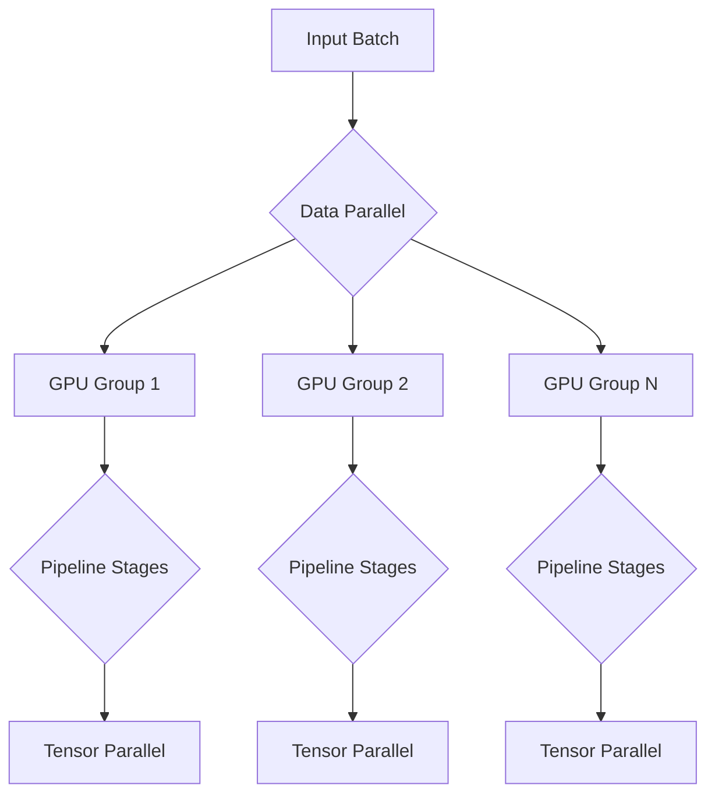
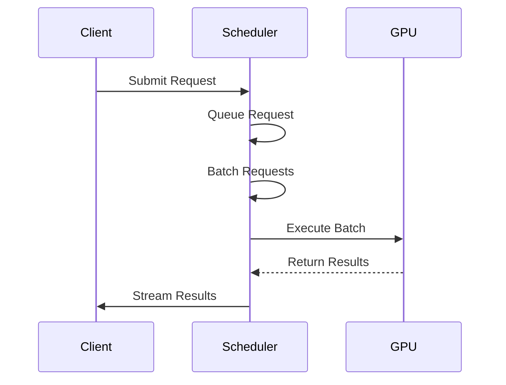

# Configuration

<cite>
**Referenced Files in This Document**   
- [vllm/config/vllm.py](file://vllm/config/vllm.py)
- [vllm/config/model.py](file://vllm/config/model.py)
- [vllm/config/cache.py](file://vllm/config/cache.py)
- [vllm/config/parallel.py](file://vllm/config/parallel.py)
- [vllm/config/scheduler.py](file://vllm/config/scheduler.py)
- [vllm/engine/arg_utils.py](file://vllm/engine/arg_utils.py)
- [vllm/config/compilation.py](file://vllm/config/compilation.py)
</cite>

## Table of Contents
1. [Introduction](#introduction)
2. [Configuration Philosophy](#configuration-philosophy)
3. [Engine Configuration](#engine-configuration)
4. [Model Configuration](#model-configuration)
5. [Cache Configuration](#cache-configuration)
6. [Scheduler Configuration](#scheduler-configuration)
7. [Compilation Configuration](#compilation-configuration)
8. [Practical Configuration Examples](#practical-configuration-examples)
9. [Common Configuration Issues and Solutions](#common-configuration-issues-and-solutions)
10. [Conclusion](#conclusion)

## Introduction

vLLM provides a comprehensive and flexible configuration system that enables fine-grained control over engine behavior, resource allocation, and performance characteristics. This documentation details the extensive configuration options available in vLLM, covering engine parameters, model settings, cache management, scheduling policies, and compilation options. The configuration system is designed to allow users to optimize vLLM for various deployment scenarios, from single-GPU inference to large-scale distributed serving.

The configuration system in vLLM is built around a modular architecture where different aspects of the engine are controlled by specialized configuration classes. These classes are designed to work together seamlessly while providing independent control over specific subsystems. The primary configuration components include engine configuration, model configuration, cache configuration, scheduler configuration, and compilation configuration, each addressing different aspects of the inference pipeline.

**Section sources**
- [vllm/config/vllm.py](file://vllm/config/vllm.py#L158-L198)

## Configuration Philosophy

vLLM's configuration system follows a philosophy of explicit control with sensible defaults. The system is designed to provide maximum flexibility while maintaining ease of use for common scenarios. The configuration approach emphasizes several key principles:

1. **Modularity**: Configuration is divided into distinct components (engine, model, cache, scheduler, etc.) that can be configured independently.
2. **Hierarchical defaults**: The system provides sensible defaults at multiple levels, allowing users to override only the parameters they need to customize.
3. **Validation and error handling**: Comprehensive validation ensures that configuration conflicts are caught early with clear error messages.
4. **Performance optimization**: Configuration options are designed to enable performance tuning for specific hardware and workload characteristics.

The configuration system uses a dataclass-based approach with Pydantic validation, providing type safety and automatic documentation. Each configuration class includes detailed docstrings that explain the purpose and valid values for each parameter. The system also supports environment variable overrides and command-line argument parsing, making it flexible for different deployment scenarios.

A key aspect of vLLM's configuration philosophy is the separation of concerns between different subsystems. For example, the cache configuration is independent of the model configuration, allowing users to tune memory allocation without modifying model parameters. Similarly, the scheduler configuration can be adjusted independently of the parallel execution strategy.

**Section sources**
- [vllm/config/vllm.py](file://vllm/config/vllm.py#L158-L198)
- [vllm/config/model.py](file://vllm/config/model.py#L113-L115)

## Engine Configuration

Engine configuration in vLLM controls the overall behavior of the inference engine, including parallel execution strategies and resource allocation. The `ParallelConfig` class manages distributed execution parameters that determine how computation is distributed across multiple devices.

### Tensor, Pipeline, and Data Parallelism

The parallel execution strategy is controlled by three key parameters:

- **Tensor Parallel Size**: Controls model parallelism by splitting model layers across multiple GPUs. This parameter determines how many GPUs are used to parallelize individual model operations.
- **Pipeline Parallel Size**: Implements pipeline parallelism by dividing the model into stages that are executed on different GPU groups. This allows for larger models to be run on multiple GPUs.
- **Data Parallel Size**: Controls data parallelism by replicating the model across multiple GPU groups and distributing input batches.



**Diagram sources**
- [vllm/config/parallel.py](file://vllm/config/parallel.py#L74-L81)

The `distributed_executor_backend` parameter determines whether multiprocessing ("mp") or Ray ("ray") is used for distributed execution. The system automatically selects the appropriate backend based on available resources and configuration.

### Expert Parallelism and Load Balancing

For models with mixture-of-experts (MoE) architectures, vLLM provides specialized configuration options:

- **enable_expert_parallel**: When enabled, uses expert parallelism instead of tensor parallelism for MoE layers.
- **enable_eplb**: Enables expert parallelism load balancing to optimize expert distribution.
- **expert_placement_strategy**: Determines how experts are distributed across ranks ("linear" or "round_robin").

These parameters allow fine-tuning of MoE model execution for optimal performance and load balancing.

**Section sources**
- [vllm/config/parallel.py](file://vllm/config/parallel.py#L74-L125)

## Model Configuration

Model configuration parameters control the behavior and characteristics of the language model itself. The `ModelConfig` class provides extensive options for model loading, processing, and optimization.

### Model and Tokenizer Settings

Key model configuration parameters include:

- **model**: Specifies the Hugging Face model name or path to load.
- **tokenizer**: Name or path of the tokenizer to use (defaults to the model value if not specified).
- **tokenizer_mode**: Determines the tokenizer implementation to use ("auto", "hf", "slow", or "mistral").
- **trust_remote_code**: When enabled, allows loading models with custom code from Hugging Face.

The tokenizer configuration also includes revision parameters for the model configuration (`hf_config_path`), model code (`code_revision`), and tokenizer (`tokenizer_revision`), allowing precise control over which model versions are loaded.

### Maximum Model Length and Context Management

The `max_model_len` parameter is critical for determining the maximum sequence length the model can handle. This value can be specified in human-readable format with k/m/g suffixes (e.g., "25.6k" for 25,600 tokens). The system automatically derives this value from the model configuration if not explicitly set.

Additional context management parameters include:
- **disable_sliding_window**: When enabled, disables the sliding window functionality, capping sequences to the sliding window size.
- **disable_cascade_attn**: Disables cascade attention optimization, which may be useful for preventing numerical issues.

### Quantization Options

vLLM supports various quantization methods to reduce model memory footprint and improve inference speed:

- **quantization**: Specifies the quantization method to use (e.g., "awq", "gptq", "fp8").
- **dtype**: Controls the data type for model weights and activations ("auto", "half", "bfloat16", "float32").
- **enforce_eager**: When enabled, disables CUDA graph optimization and uses eager execution mode.

The quantization system automatically validates compatibility between the selected quantization method and the underlying hardware capabilities, ensuring that unsupported configurations are caught early.

**Section sources**
- [vllm/config/model.py](file://vllm/config/model.py#L118-L204)

## Cache Configuration

Cache configuration in vLLM controls the management of the key-value (KV) cache, which is critical for efficient autoregressive generation. The `CacheConfig` class provides options for optimizing cache performance and memory usage.

### Block Size and Memory Management

The KV cache is organized into blocks of fixed size, controlled by the `block_size` parameter. This parameter determines the number of tokens stored in each contiguous cache block. On CUDA devices, only block sizes up to 32 are supported.

Memory allocation for the KV cache is managed through several parameters:
- **gpu_memory_utilization**: Fraction of GPU memory to allocate for the model executor (default: 0.9).
- **swap_space**: Size of CPU swap space per GPU in GiB.
- **cpu_offload_gb**: Amount of KV cache to offload to CPU memory per GPU.

```mermaid
graph LR
A[GPU Memory] --> B[KV Cache Blocks]
A --> C[Model Weights]
D[CPU Memory] --> E[Swapped KV Blocks]
B < --> E
style A fill:#f9f,stroke:#333
style D fill:#bbf,stroke:#333
```

**Diagram sources**
- [vllm/config/cache.py](file://vllm/config/cache.py#L42-L58)

### Cache Data Types and Optimization

The `cache_dtype` parameter controls the data type used for KV cache storage:
- "auto": Uses the model's data type
- "bfloat16": 16-bit brain floating point
- "fp8": 8-bit floating point (with variants "fp8_e4m3", "fp8_e5m2")

Using lower-precision data types like fp8 can significantly reduce memory footprint and improve performance, though it may affect numerical accuracy. The system provides warnings when fp8 quantization is enabled to alert users to potential accuracy implications.

### Prefix Caching

Prefix caching is enabled by default (`enable_prefix_caching=True`) and can significantly improve performance for workloads with shared prompt prefixes. The `prefix_caching_hash_algo` parameter controls the hash algorithm used for prefix caching:
- "sha256": Uses Pickle for object serialization before hashing
- "sha256_cbor": Provides reproducible, cross-language compatible hashing using canonical CBOR serialization

**Section sources**
- [vllm/config/cache.py](file://vllm/config/cache.py#L42-L83)

## Scheduler Configuration

The scheduler configuration controls request handling policies, priorities, and batching strategies. The `SchedulerConfig` class manages how requests are processed and executed.

### Request Scheduling Policies

vLLM supports multiple scheduling policies through the `policy` parameter:
- **fcfs (First-Come, First-Served)**: Requests are handled in order of arrival.
- **priority**: Requests are handled based on assigned priority (lower values indicate higher priority), with arrival time breaking ties.

The scheduler also manages batching parameters that control throughput and latency:
- **max_num_batched_tokens**: Maximum number of tokens to process in a single iteration.
- **max_num_seqs**: Maximum number of sequences to process in a single iteration.
- **stream_interval**: Interval for streaming output in terms of token length.

### Chunked Prefill and Partial Prefilling

For large input sequences, vLLM supports chunked prefill operations:
- **enable_chunked_prefill**: Enables chunking of prefill requests based on available `max_num_batched_tokens`.
- **max_num_partial_prefills**: Maximum number of sequences that can be partially prefilled concurrently.
- **long_prefill_token_threshold**: Defines what constitutes a "long" prompt for scheduling purposes.

These parameters allow the scheduler to efficiently handle requests with very long input sequences by breaking them into manageable chunks.



**Diagram sources**
- [vllm/config/scheduler.py](file://vllm/config/scheduler.py#L47-L67)

**Section sources**
- [vllm/config/scheduler.py](file://vllm/config/scheduler.py#L47-L137)

## Compilation Configuration

The compilation configuration controls optimization and compilation settings for the model execution. The `CompilationConfig` class manages options for `torch.compile` and CUDA graph capture.

### Optimization Levels

vLLM provides optimization levels that trade startup time for performance:
- **O0**: No optimization (eager mode only)
- **O1**: Quick optimizations (Dynamo+Inductor compilation with piecewise CUDA graphs)
- **O2**: Full optimizations (O1 plus full and piecewise CUDA graphs)
- **O3**: Currently equivalent to O2

The optimization level can be set via the `optimization_level` parameter or the `-O` command-line flag.

### CUDA Graph Configuration

CUDA graph capture settings control how computation graphs are captured and reused:
- **cudagraph_mode**: Controls CUDA graph capture mode ("NONE", "PIECEWISE", "FULL_AND_PIECEWISE")
- **cudagraph_capture_sizes**: Specific batch sizes for which CUDA graphs should be captured
- **max_cudagraph_capture_size**: Maximum batch size for CUDA graph capture

These parameters allow fine-tuning of graph capture to balance memory usage and performance gains.

**Section sources**
- [vllm/config/compilation.py](file://vllm/config/compilation.py#L61-L73)
- [vllm/config/vllm.py](file://vllm/config/vllm.py#L61-L74)

## Practical Configuration Examples

### Command-Line Configuration

vLLM can be configured using command-line arguments. Here are examples of common configuration patterns:

```bash
# Basic configuration with tensor parallelism
vllm serve Qwen/Qwen3-0.6B --tensor-parallel-size 4

# Configuration with quantization and custom batch size
vllm serve meta-llama/Llama-3-8B --quantization awq \
  --max-num-batched-tokens 8192 --max-num-seqs 256

# Configuration with chunked prefill for long contexts
vllm serve Qwen/Qwen1.5-72B --enable-chunked-prefill \
  --max-num-batched-tokens 16384 --max-model-len 32768

# Configuration with CPU offloading
vllm serve meta-llama/Llama-3-70B --cpu-offload-gb 100 \
  --gpu-memory-utilization 0.8
```

### Configuration File Usage

Configuration can also be specified via JSON or YAML files:

```json
{
  "model": "Qwen/Qwen3-0.6B",
  "tensor_parallel_size": 4,
  "pipeline_parallel_size": 2,
  "max_model_len": 8192,
  "gpu_memory_utilization": 0.9,
  "enable_prefix_caching": true,
  "scheduler": {
    "max_num_batched_tokens": 4096,
    "max_num_seqs": 128,
    "policy": "fcfs"
  },
  "compilation": {
    "mode": 2,
    "cudagraph_mode": "FULL_AND_PIECEWISE"
  }
}
```

The configuration file can be loaded using:
```bash
vllm serve --config config.json
```

### API Configuration

When using vLLM programmatically, configuration can be set directly in code:

```python
from vllm import EngineArgs, LLMEngine

engine_args = EngineArgs(
    model="Qwen/Qwen3-0.6B",
    tensor_parallel_size=4,
    max_model_len=8192,
    gpu_memory_utilization=0.9,
    enable_prefix_caching=True
)
engine = LLMEngine.from_engine_args(engine_args)
```

**Section sources**
- [vllm/engine/arg_utils.py](file://vllm/engine/arg_utils.py#L351-L566)

## Common Configuration Issues and Solutions

### Memory Configuration Issues

**Issue**: Out of memory errors during model loading
**Solution**: Adjust memory allocation parameters:
- Reduce `gpu_memory_utilization` (e.g., from 0.9 to 0.8)
- Enable `cpu_offload_gb` to offload part of the model to CPU
- Use quantization (`quantization="awq"` or `quantization="gptq"`)

**Issue**: Swapping overhead degrading performance
**Solution**: Optimize swap configuration:
- Reduce `swap_space` if CPU memory bandwidth is a bottleneck
- Ensure sufficient CPU memory is available (at least 1.5x the swap space)

### Parallelism Configuration Issues

**Issue**: Tensor parallel size does not match available GPUs
**Solution**: Verify that `tensor_parallel_size` is appropriate for your hardware:
- For 4 GPUs: `--tensor-parallel-size 4`
- For 8 GPUs: `--tensor-parallel-size 8`

**Issue**: Pipeline parallelism causing idle GPUs
**Solution**: Ensure `pipeline_parallel_size` divides evenly into the total number of GPUs, or consider using tensor parallelism instead for better utilization.

### Performance Optimization Issues

**Issue**: Poor throughput with small batch sizes
**Solution**: Adjust scheduler parameters:
- Increase `max_num_batched_tokens` to allow larger batches
- Increase `max_num_seqs` to allow more concurrent sequences
- Consider enabling chunked prefill for variable-length inputs

**Issue**: High latency for first token
**Solution**: Optimize compilation settings:
- Use `-O2` or `-O3` for better optimization
- Pre-warm the model with representative inputs
- Ensure CUDA graphs are properly captured for common batch sizes

The configuration system provides detailed validation and error messages to help diagnose and resolve configuration issues. When a configuration conflict is detected, vLLM typically provides a descriptive error message explaining the issue and suggesting potential solutions.

**Section sources**
- [vllm/config/vllm.py](file://vllm/config/vllm.py#L487-L797)
- [vllm/config/parallel.py](file://vllm/config/parallel.py#L272-L320)

## Conclusion

vLLM's extensive configuration system provides fine-grained control over engine behavior, resource allocation, and performance characteristics. The modular design separates concerns between different subsystems while allowing them to work together seamlessly. Key configuration areas include engine parameters for parallel execution, model settings for loading and processing, cache management for memory optimization, scheduler policies for request handling, and compilation options for performance tuning.

The configuration system balances flexibility with usability, providing sensible defaults while allowing deep customization for specific use cases. Through command-line arguments, configuration files, and programmatic interfaces, users can optimize vLLM for their specific hardware and workload requirements. The comprehensive validation and error handling ensure that configuration issues are caught early with clear guidance for resolution.

By understanding and properly configuring these parameters, users can achieve optimal performance and efficiency from vLLM across a wide range of deployment scenarios, from single-GPU inference to large-scale distributed serving.