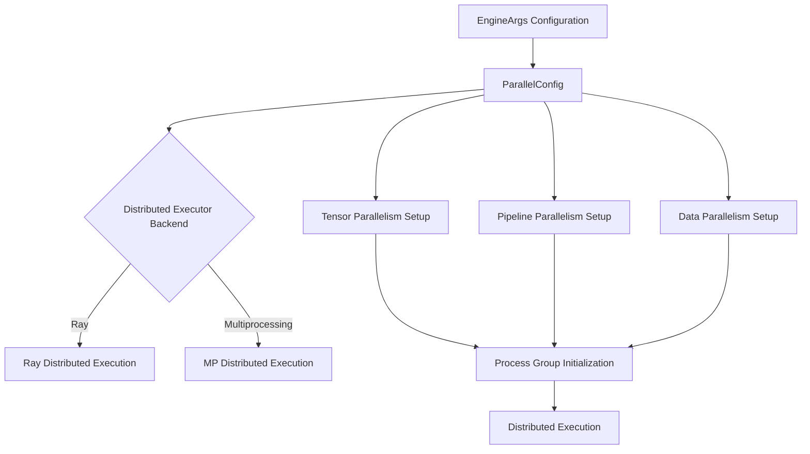
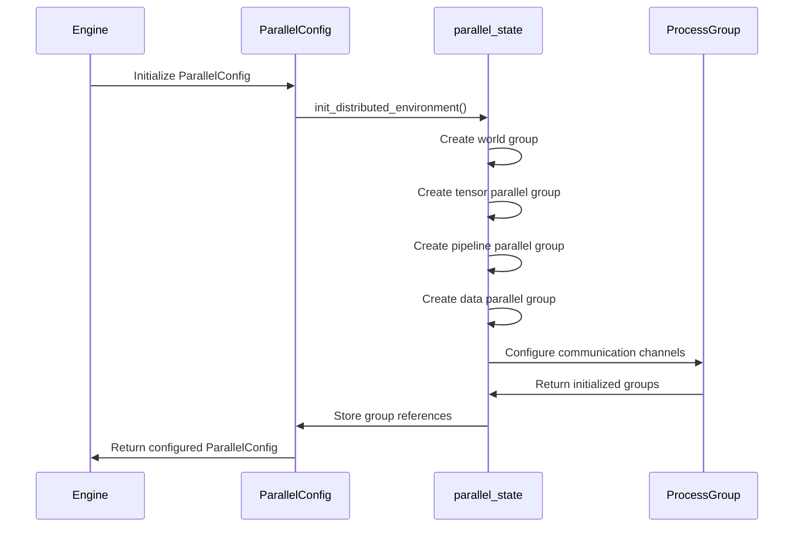
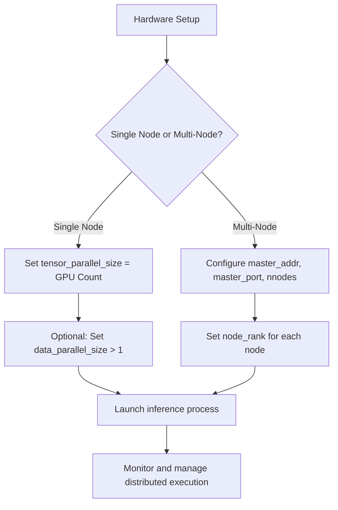

# Engine Configuration

<cite>
**Referenced Files in This Document**   
- [arg_utils.py](file://vllm/engine/arg_utils.py)
- [parallel.py](file://vllm/config/parallel.py)
- [parallel_state.py](file://vllm/distributed/parallel_state.py)
- [data_parallel.py](file://examples/offline_inference/data_parallel.py)
- [torchrun_example.py](file://examples/offline_inference/torchrun_example.py)
- [multiproc_executor.py](file://vllm/v1/executor/multiproc_executor.py)
</cite>

## Table of Contents
1. [Introduction](#introduction)
2. [Distributed Parallelism Configuration](#distributed-parallelism-configuration)
3. [Engine Arguments and Distributed Execution](#engine-arguments-and-distributed-execution)
4. [Domain Models for Device Placement](#domain-models-for-device-placement)
5. [Process Group Initialization](#process-group-initialization)
6. [Configuration Patterns for Multi-GPU and Multi-Node Setups](#configuration-patterns-for-multi-gpu-and-multi-node-setups)
7. [Performance Impact Parameters](#performance-impact-parameters)
8. [Common Issues and Solutions](#common-issues-and-solutions)
9. [Conclusion](#conclusion)

## Introduction
This document provides comprehensive guidance on configuring vLLM's distributed computing setup for large-scale inference. It covers the implementation details of tensor parallelism, pipeline parallelism, and data parallelism configurations, explaining how these parallelization strategies work together to enable efficient inference on large language models across multiple GPUs and nodes. The document details the invocation relationship between engine arguments and distributed execution, providing concrete examples from the codebase to illustrate configuration patterns. It also addresses common deployment challenges and their solutions, making the content accessible to beginners while providing sufficient technical depth for experienced developers.

## Distributed Parallelism Configuration

vLLM implements three primary parallelism strategies: tensor parallelism, pipeline parallelism, and data parallelism. These strategies are configured through the `ParallelConfig` class, which defines the parameters for distributed execution.

Tensor parallelism splits model layers across multiple GPUs, allowing for larger models to be processed by distributing the computational load. This is configured using the `tensor_parallel_size` parameter, which specifies the number of tensor parallel groups. The implementation leverages PyTorch's distributed capabilities to coordinate computation across these groups, with each GPU handling a portion of the tensor operations and communicating results as needed.

Pipeline parallelism divides the model into stages, with each stage processed on different GPU groups. This is controlled by the `pipeline_parallel_size` parameter. The pipeline parallelism implementation uses a stage-based execution model where intermediate activations are passed between stages, reducing memory requirements per GPU while maintaining computational efficiency.

Data parallelism replicates the model across multiple GPU groups and processes different data batches in parallel. This is configured with the `data_parallel_size` parameter. The data parallelism implementation includes sophisticated load balancing mechanisms and supports both Ray and multiprocessing backends for distributed execution coordination.

The configuration also supports expert parallelism for MoE (Mixture of Experts) models through the `enable_expert_parallel` parameter, which allows for specialized parallelization of expert layers in these models.

**Section sources**
- [parallel.py](file://vllm/config/parallel.py#L74-L110)
- [parallel_state.py](file://vllm/distributed/parallel_state.py#L1032-L1042)

## Engine Arguments and Distributed Execution

The engine configuration is primarily managed through the `EngineArgs` class in `arg_utils.py`, which defines the interface for specifying distributed execution parameters. The key arguments for distributed computing include `tensor_parallel_size`, `pipeline_parallel_size`, and `distributed_executor_backend`.

The `tensor_parallel_size` argument specifies the number of GPUs to use for tensor parallelism. When set to a value greater than 1, the model's tensor operations are distributed across that many GPUs, with each GPU handling a partition of the tensors. This enables larger models to be processed by distributing the computational load.

The `pipeline_parallel_size` argument determines the number of pipeline stages. Each stage processes a portion of the model layers, with activations passed between stages. This reduces memory requirements per GPU while maintaining computational efficiency for large models.

The `distributed_executor_backend` parameter specifies the backend for distributed execution, with options including "ray" and "mp" (multiprocessing). The choice of backend affects how distributed workers are managed and coordinated. When using Ray, additional parameters like `ray_workers_use_nsight` can be used to enable profiling of Ray workers.

These arguments are processed during engine initialization, where they are used to configure the distributed execution environment. The engine validates the arguments and sets up the appropriate process groups and communication channels based on the specified parallelism configuration.

**Diagram sources **
- [arg_utils.py](file://vllm/engine/arg_utils.py#L352-L800)
- [parallel.py](file://vllm/config/parallel.py#L71-L654)

**Section sources**
- [arg_utils.py](file://vllm/engine/arg_utils.py#L352-L800)

## Domain Models for Device Placement

The device placement model in vLLM is designed to efficiently distribute model components across available hardware resources. The core domain model is implemented in the `ParallelConfig` class, which defines the topology of the distributed system.

The model uses a hierarchical approach to device placement, with tensor parallel groups forming the innermost level, pipeline parallel groups at the intermediate level, and data parallel groups at the outermost level. This hierarchy allows for flexible configuration of the distributed system, enabling different parallelism strategies to be combined as needed.

For tensor parallelism, devices are grouped into tensor parallel groups, with each group handling a partition of the model's tensor operations. The size of these groups is determined by the `tensor_parallel_size` parameter. The implementation ensures that communication between devices in a tensor parallel group is optimized for low latency and high bandwidth.

Pipeline parallelism groups devices into pipeline stages, with each stage processing a portion of the model layers. The `pipeline_parallel_size` parameter determines the number of stages. The model ensures that activations are efficiently passed between stages, minimizing communication overhead.

Data parallelism creates replicas of the model across data parallel groups, with each group processing different data batches. The `data_parallel_size` parameter specifies the number of data parallel groups. The implementation includes mechanisms for synchronizing gradients and parameters across data parallel groups.

The domain model also supports hybrid configurations, where different parallelism strategies are combined. For example, tensor and pipeline parallelism can be used together to distribute both model layers and tensor operations across the available hardware.

**Section sources**
- [parallel.py](file://vllm/config/parallel.py#L71-L654)
- [parallel_state.py](file://vllm/distributed/parallel_state.py#L1027-L1042)

## Process Group Initialization

Process group initialization in vLLM is handled by the `parallel_state.py` module, which manages the creation and coordination of distributed process groups. The initialization process follows a systematic approach to ensure proper setup of communication channels between distributed workers.

The initialization begins with the creation of the world group, which encompasses all processes in the distributed system. This is followed by the creation of specialized process groups for different parallelism strategies, including tensor parallel, pipeline parallel, and data parallel groups.

For tensor parallelism, the `get_tp_group()` function creates a process group for tensor parallel communication. This group is used for all-reduce operations and other collective communications required for tensor parallel computation. The implementation ensures that the group is properly configured with the appropriate backend (typically NCCL for GPU communication).

Pipeline parallelism requires the creation of a pipeline parallel group using `get_pp_group()`. This group manages communication between pipeline stages, handling the transfer of activations and gradients between stages. The implementation includes optimizations for minimizing communication latency between stages.

Data parallelism initialization involves creating a data parallel group with `get_dp_group()`. This group is used for gradient synchronization and other collective operations across data parallel replicas. The implementation supports both Ray and multiprocessing backends, with appropriate configuration for each.

The initialization process also includes setting up communication buffers and validating the configuration to ensure compatibility between different parallelism strategies. Error handling is implemented to detect and report configuration issues during initialization.

**Diagram sources **
- [parallel_state.py](file://vllm/distributed/parallel_state.py#L1027-L1042)
- [parallel.py](file://vllm/config/parallel.py#L504-L514)

**Section sources**
- [parallel_state.py](file://vllm/distributed/parallel_state.py#L1027-L1042)

## Configuration Patterns for Multi-GPU and Multi-Node Setups

vLLM supports various configuration patterns for multi-GPU and multi-node deployments, as demonstrated in the example scripts. These patterns illustrate how to effectively configure the system for different hardware setups and use cases.

For single-node multi-GPU setups, the configuration typically involves setting the `tensor_parallel_size` to match the number of available GPUs. For example, with 4 GPUs, setting `tensor_parallel_size=4` distributes the model across all GPUs using tensor parallelism. The `data_parallel_size` can be set to 1 in this case, as data parallelism is less beneficial when all GPUs are already utilized by tensor parallelism.

Multi-node setups require additional configuration parameters to coordinate between nodes. The `master_addr` and `master_port` parameters specify the address and port of the master node for distributed coordination. The `nnodes` parameter indicates the total number of nodes in the cluster, while `node_rank` specifies the rank of the current node.

The `data_parallel.py` example demonstrates a pattern for data parallel inference across multiple nodes. It shows how to set environment variables like `VLLM_DP_RANK` and `VLLM_DP_SIZE` to configure data parallelism, and how to use multiprocessing to launch multiple inference processes on each node.

For hybrid configurations combining tensor and pipeline parallelism, the product of `tensor_parallel_size` and `pipeline_parallel_size` should match the total number of GPUs available. For example, with 8 GPUs, configurations like `tensor_parallel_size=4` and `pipeline_parallel_size=2`, or `tensor_parallel_size=2` and `pipeline_parallel_size=4` are valid options.

The `torchrun_example.py` demonstrates using external launchers like torchrun for distributed execution. This pattern uses `distributed_executor_backend="external_launcher"` to integrate with external distributed training frameworks, allowing for flexible deployment configurations.

**Diagram sources **
- [data_parallel.py](file://examples/offline_inference/data_parallel.py#L1-L263)
- [torchrun_example.py](file://examples/offline_inference/torchrun_example.py#L1-L77)

**Section sources**
- [data_parallel.py](file://examples/offline_inference/data_parallel.py#L1-L263)
- [torchrun_example.py](file://examples/offline_inference/torchrun_example.py#L1-L77)

## Performance Impact Parameters

Several configuration parameters in vLLM have significant performance implications for distributed inference. Understanding these parameters and their impact is crucial for optimizing system performance.

The `ray_workers_use_nsight` parameter enables profiling of Ray workers using NVIDIA Nsight, which can help identify performance bottlenecks in distributed execution. However, this profiling overhead can reduce overall throughput, so it should be used primarily for debugging and optimization rather than in production deployments.

The `worker_use_ray` parameter (implied by `distributed_executor_backend="ray"`) determines whether Ray is used for distributed execution coordination. Ray provides robust fault tolerance and resource management but introduces additional overhead compared to the multiprocessing backend. The choice between Ray and multiprocessing should be based on the specific requirements for fault tolerance and performance.

The `disable_custom_all_reduce` parameter controls whether vLLM uses its custom all-reduce kernel or falls back to NCCL. The custom kernel is optimized for vLLM's specific communication patterns and can provide better performance in many cases, but may need to be disabled for compatibility with certain hardware or network configurations.

The `enable_dbo` parameter enables dual batch overlap, which can improve throughput by overlapping computation and communication. The `dbo_decode_token_threshold` and `dbo_prefill_token_threshold` parameters control when microbatching is used for decode and prefill operations, respectively. Tuning these thresholds can significantly impact performance based on the workload characteristics.

The `compilation_config` parameter controls the level of compilation optimization, with higher values enabling more aggressive optimizations that can improve performance but may increase initialization time.

**Section sources**
- [parallel.py](file://vllm/config/parallel.py#L150-L165)
- [arg_utils.py](file://vllm/engine/arg_utils.py#L352-L800)

## Common Issues and Solutions

Deploying vLLM in distributed configurations can encounter several common issues, primarily related to GPU visibility, network configuration, and process coordination.

GPU visibility mismatches occur when the system's GPU enumeration doesn't match the expected configuration. This can happen when using containerized environments or when GPU devices are not properly exposed to the process. The solution is to ensure consistent GPU visibility by setting the `CUDA_VISIBLE_DEVICES` environment variable appropriately or using the `worker_cls` parameter to specify a custom worker class that handles device placement.

Network configuration problems often manifest as connection timeouts or refused connections between distributed workers. These issues can be addressed by ensuring that the `master_addr` and `master_port` parameters are correctly configured and that firewalls or network security groups allow the necessary communication. Using well-known ports and ensuring network connectivity between nodes can prevent these issues.

Process coordination problems can occur when using external launchers or when the distributed execution backend is misconfigured. Ensuring that the `distributed_executor_backend` parameter matches the actual deployment environment is crucial. For example, using `distributed_executor_backend="external_launcher"` when integrating with torchrun or similar frameworks.

Another common issue is resource contention when multiple processes try to access the same GPU resources. This can be mitigated by carefully configuring the `tensor_parallel_size`, `pipeline_parallel_size`, and `data_parallel_size` parameters to match the available hardware resources, and by using appropriate process isolation techniques.

For multi-node setups, ensuring clock synchronization between nodes can prevent timing-related issues in distributed coordination. Using network time protocol (NTP) to synchronize clocks across the cluster can help maintain consistent timing for distributed operations.

**Section sources**
- [parallel.py](file://vllm/config/parallel.py#L337-L382)
- [parallel_state.py](file://vllm/distributed/parallel_state.py#L232-L366)

## Conclusion
vLLM's distributed computing configuration provides a flexible and powerful framework for scaling large language model inference across multiple GPUs and nodes. By understanding the implementation details of tensor parallelism, pipeline parallelism, and data parallelism, developers can effectively configure the system for their specific hardware and workload requirements. The engine arguments provide a comprehensive interface for controlling distributed execution, while the domain models for device placement and process group initialization ensure efficient resource utilization. With proper configuration and attention to performance impact parameters, vLLM can deliver high-throughput, low-latency inference for large-scale language models. The examples provided in the codebase demonstrate practical patterns for multi-GPU and multi-node setups, while the guidance on common issues and solutions helps ensure smooth deployment and operation.