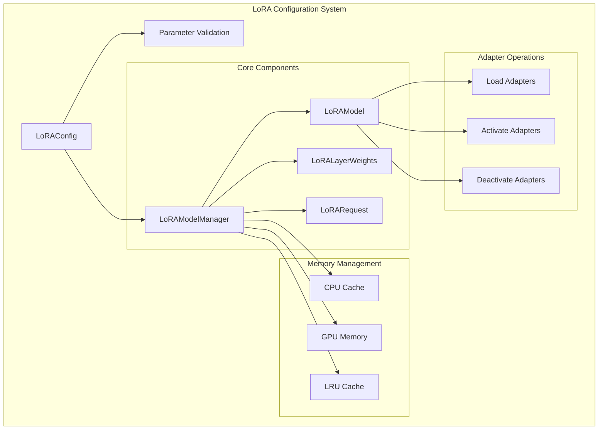
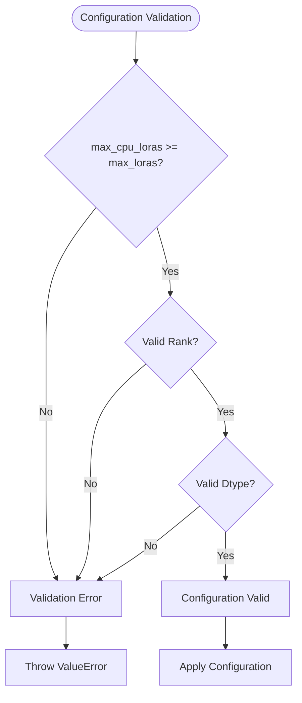
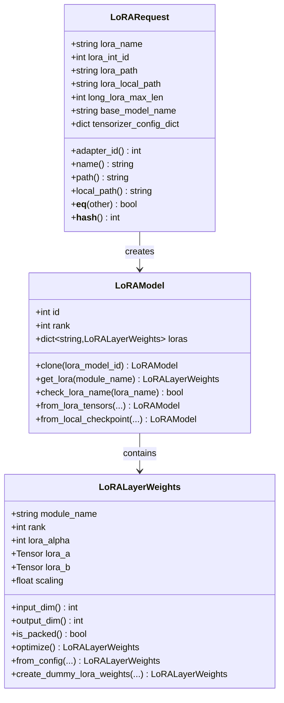
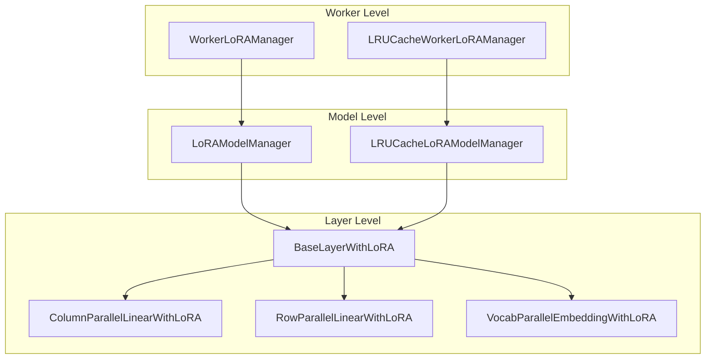
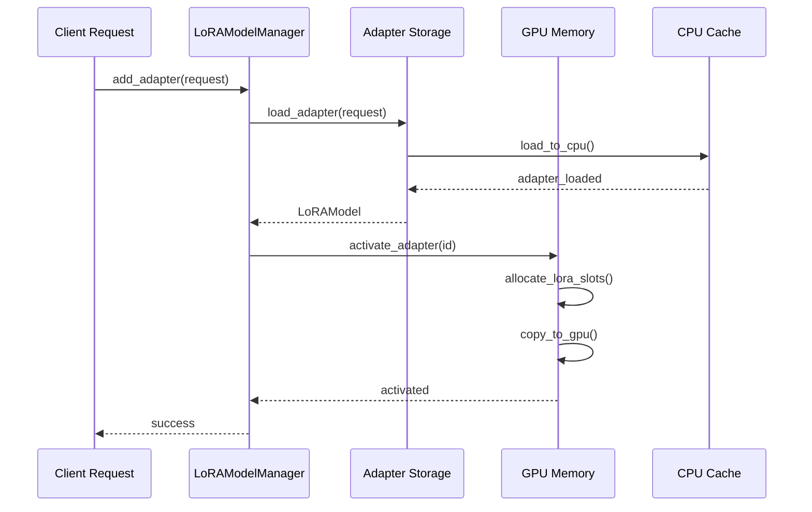
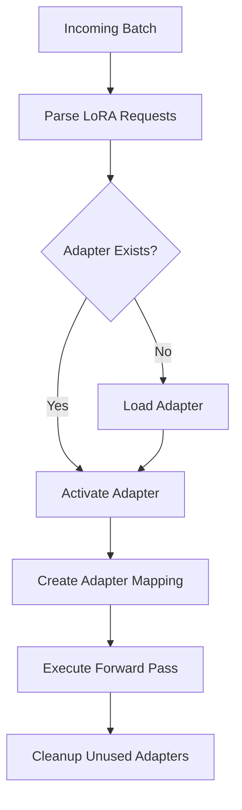
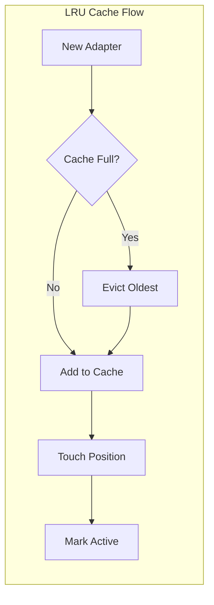

# LoRA Configuration

<cite>
**Referenced Files in This Document**
- [vllm/config/lora.py](file://vllm/config/lora.py)
- [vllm/lora/models.py](file://vllm/lora/models.py)
- [vllm/lora/request.py](file://vllm/lora/request.py)
- [vllm/lora/utils.py](file://vllm/lora/utils.py)
- [vllm/lora/lora_weights.py](file://vllm/lora/lora_weights.py)
- [vllm/lora/worker_manager.py](file://vllm/lora/worker_manager.py)
- [vllm/lora/layers/base.py](file://vllm/lora/layers/base.py)
- [examples/offline_inference/multilora_inference.py](file://examples/offline_inference/multilora_inference.py)
- [tests/lora/test_llm_with_multi_loras.py](file://tests/lora/test_llm_with_multi_loras.py)
- [tests/lora/test_lora_manager.py](file://tests/lora/test_lora_manager.py)
</cite>

## Table of Contents
1. [Introduction](#introduction)
2. [LoRA Configuration Overview](#lora-configuration-overview)
3. [Core Configuration Parameters](#core-configuration-parameters)
4. [Domain Models and Architecture](#domain-models-and-architecture)
5. [Adapter Management System](#adapter-management-system)
6. [Memory Management and Optimization](#memory-management-and-optimization)
7. [Implementation Patterns](#implementation-patterns)
8. [Common Issues and Solutions](#common-issues-and-solutions)
9. [Best Practices](#best-practices)
10. [Advanced Configuration Examples](#advanced-configuration-examples)

## Introduction

Low-Rank Adaptation (LoRA) is a memory-efficient technique for fine-tuning large language models by introducing low-rank matrices that modify specific layers during inference. vLLM provides comprehensive support for LoRA configuration, enabling efficient serving of multiple LoRA adapters simultaneously while optimizing memory usage and computational performance.

This documentation covers the complete LoRA configuration system in vLLM, from basic parameter setup to advanced multi-adapter management and memory optimization strategies.

## LoRA Configuration Overview

vLLM's LoRA implementation is built around a flexible configuration system that supports various deployment scenarios, from single adapter serving to complex multi-adapter setups with sophisticated memory management.



**Diagram sources**
- [vllm/config/lora.py](file://vllm/config/lora.py#L29-L97)
- [vllm/lora/models.py](file://vllm/lora/models.py#L289-L350)

**Section sources**
- [vllm/config/lora.py](file://vllm/config/lora.py#L29-L97)
- [vllm/lora/models.py](file://vllm/lora/models.py#L65-L106)

## Core Configuration Parameters

### Basic LoRA Parameters

The `LoRAConfig` class defines the fundamental parameters for LoRA operation:

| Parameter | Type | Default | Description |
|-----------|------|---------|-------------|
| `max_lora_rank` | `MaxLoRARanks` | `16` | Maximum LoRA rank for all adapters |
| `max_loras` | `int` | `1` | Maximum number of LoRAs in a single batch |
| `fully_sharded_loras` | `bool` | `False` | Enable fully sharded LoRA computation |
| `max_cpu_loras` | `int \| None` | `None` | Maximum LoRAs to store in CPU memory |

### Advanced Configuration Options

| Parameter | Type | Default | Description |
|-----------|------|---------|-------------|
| `lora_dtype` | `torch.dtype \| LoRADType` | `"auto"` | Data type for LoRA weights |
| `default_mm_loras` | `dict[str, str] \| None` | `None` | Default LoRA mappings for modalities |

### Parameter Validation and Constraints

The configuration system enforces several important constraints:



**Diagram sources**
- [vllm/config/lora.py](file://vllm/config/lora.py#L80-L96)

**Section sources**
- [vllm/config/lora.py](file://vllm/config/lora.py#L34-L46)
- [vllm/config/lora.py](file://vllm/config/lora.py#L80-L96)

## Domain Models and Architecture

### LoRA Request Model

The `LoRARequest` class encapsulates all information needed to load and manage a LoRA adapter:



**Diagram sources**
- [vllm/lora/request.py](file://vllm/lora/request.py#L9-L101)
- [vllm/lora/models.py](file://vllm/lora/models.py#L65-L150)
- [vllm/lora/lora_weights.py](file://vllm/lora/lora_weights.py#L14-L98)

### Adapter Management Architecture

The LoRA system uses a hierarchical manager structure for optimal resource utilization:



**Diagram sources**
- [vllm/lora/worker_manager.py](file://vllm/lora/worker_manager.py#L24-L269)
- [vllm/lora/models.py](file://vllm/lora/models.py#L289-L350)

**Section sources**
- [vllm/lora/request.py](file://vllm/lora/request.py#L9-L101)
- [vllm/lora/models.py](file://vllm/lora/models.py#L65-L150)
- [vllm/lora/lora_weights.py](file://vllm/lora/lora_weights.py#L14-L98)

## Adapter Management System

### Adapter Lifecycle Management

The adapter management system handles the complete lifecycle of LoRA adapters from loading to deactivation:



**Diagram sources**
- [vllm/lora/worker_manager.py](file://vllm/lora/worker_manager.py#L183-L190)
- [vllm/lora/models.py](file://vllm/lora/models.py#L368-L458)

### Multi-Adapter Switching

vLLM supports seamless switching between multiple LoRA adapters within the same batch:



**Diagram sources**
- [vllm/lora/models.py](file://vllm/lora/models.py#L777-L780)
- [vllm/lora/worker_manager.py](file://vllm/lora/worker_manager.py#L159-L162)

**Section sources**
- [vllm/lora/worker_manager.py](file://vllm/lora/worker_manager.py#L183-L190)
- [vllm/lora/models.py](file://vllm/lora/models.py#L368-L458)

## Memory Management and Optimization

### Memory Allocation Strategy

vLLM implements a sophisticated memory management system that balances performance and resource utilization:

| Memory Tier | Purpose | Capacity | Access Speed |
|-------------|---------|----------|--------------|
| GPU Memory | Active LoRA weights | `max_loras` slots | Fastest |
| CPU Cache | Cached adapters | `max_cpu_loras` | Medium |
| Disk Storage | Persistent adapters | Unlimited | Slowest |

### LRU Cache Implementation

The LRU (Least Recently Used) cache optimizes memory usage by automatically managing adapter eviction:



**Diagram sources**
- [vllm/lora/worker_manager.py](file://vllm/lora/worker_manager.py#L241-L268)

### Memory Optimization Techniques

1. **Weight Optimization**: Automatic merging of scaling factors into LoRA weights
2. **Packing**: Combining multiple LoRA operations into single kernels
3. **Lazy Loading**: Loading adapters only when needed
4. **Shared Memory**: Reusing GPU memory across compatible adapters

**Section sources**
- [vllm/lora/models.py](file://vllm/lora/models.py#L356-L367)
- [vllm/lora/worker_manager.py](file://vllm/lora/worker_manager.py#L241-L268)
- [vllm/lora/lora_weights.py](file://vllm/lora/lora_weights.py#L37-L43)

## Implementation Patterns

### Basic LoRA Setup Pattern

Here's the standard pattern for configuring and using LoRA in vLLM:

```python
# Configuration pattern from multilora_inference.py
engine_args = EngineArgs(
    model="meta-llama/Llama-3.2-3B-Instruct",
    enable_lora=True,
    max_loras=1,           # Number of LoRAs per batch
    max_lora_rank=8,       # Maximum rank
    max_cpu_loras=2,       # CPU cache size
    max_num_seqs=256,      # Maximum sequences
)
```

### Multi-LoRA Serving Pattern

For serving multiple LoRA adapters simultaneously:

```python
# Pattern from test_llm_with_multi_loras.py
llm = LLM(
    model=MODEL_PATH,
    enable_lora=True,
    max_loras=2,           # Allow 2 LoRAs per batch
    max_lora_rank=LORA_RANK,
    max_cpu_loras=4,       # Cache 4 LoRAs
    tensor_parallel_size=2 # Enable tensor parallelism
)
```

### Dynamic Adapter Management Pattern

Runtime adapter loading and unloading:

```python
# Pattern for dynamic management
def manage_lora_adapters(llm):
    # Add adapters dynamically
    alice_lora = LoRARequest("Alice", 1, "path/to/alice")
    bob_lora = LoRARequest("Bob", 2, "path/to/bob")
    
    llm.llm_engine.add_lora(alice_lora)
    llm.llm_engine.add_lora(bob_lora)
    
    # Use with specific requests
    outputs = llm.generate(prompts, lora_request=alice_lora)
```

**Section sources**
- [examples/offline_inference/multilora_inference.py](file://examples/offline_inference/multilora_inference.py#L98-L106)
- [tests/lora/test_llm_with_multi_loras.py](file://tests/lora/test_llm_with_multi_loras.py#L55-L64)

## Common Issues and Solutions

### Adapter Loading Failures

**Issue**: Adapter fails to load with "No adapter found" error

**Causes and Solutions**:
1. **Invalid Path**: Ensure the LoRA path exists and contains required files
   ```python
   # Solution: Verify path exists
   import os
   assert os.path.exists(lora_path), f"Path {lora_path} not found"
   ```

2. **Unsupported Module Types**: LoRA modules don't match model architecture
   ```python
   # Solution: Check supported modules
   supported_modules = manager.supported_lora_modules
   ```

3. **Memory Constraints**: Insufficient GPU/CPU memory
   ```python
   # Solution: Adjust memory limits
   max_cpu_loras = min(max_cpu_loras, available_memory // adapter_size)
   ```

### Memory Exhaustion Issues

**Issue**: Out of memory errors during adapter loading or inference

**Solutions**:
1. **Reduce `max_loras`**: Limit concurrent adapters
2. **Increase `max_cpu_loras`**: Expand CPU cache
3. **Lower `max_lora_rank`**: Reduce adapter memory footprint
4. **Enable LRU caching**: Automatically manage memory

### Performance Degradation

**Issue**: Slower inference with multiple LoRA adapters

**Optimization Strategies**:
1. **Preload frequently used adapters**: Reduce runtime loading
2. **Use `fully_sharded_loras=True`**: Optimize computation distribution
3. **Batch similar requests**: Minimize adapter switching overhead

**Section sources**
- [vllm/lora/worker_manager.py](file://vllm/lora/worker_manager.py#L137-L141)
- [vllm/lora/worker_manager.py](file://vllm/lora/worker_manager.py#L232-L237)

## Best Practices

### Configuration Guidelines

1. **Memory Planning**:
   - Set `max_cpu_loras` ≥ `max_loras` × 2 for optimal performance
   - Allocate 2-4GB per LoRA adapter depending on rank and model size
   - Monitor GPU memory usage during peak loads

2. **Rank Selection**:
   - Use lowest rank that maintains quality (typically 8-16)
   - Consider model size: smaller models can use higher ranks
   - Test different ranks for quality vs. memory trade-offs

3. **Batch Size Optimization**:
   - Keep `max_loras` ≤ `max_num_seqs` ÷ 2
   - Consider tensor parallelism impact on memory usage
   - Profile different batch sizes for your workload

### Deployment Strategies

1. **Production Deployment**:
   - Use LRU cache for automatic memory management
   - Implement graceful degradation for memory pressure
   - Monitor adapter loading times and cache hit rates

2. **Development Setup**:
   - Start with small ranks (8) and increase gradually
   - Use CPU cache for development to reduce GPU pressure
   - Test with realistic adapter sizes before production

3. **Multi-tenant Scenarios**:
   - Implement adapter quotas per user
   - Use separate cache pools for different user groups
   - Monitor individual user memory consumption

### Monitoring and Debugging

Key metrics to monitor:
- Adapter loading times
- Memory utilization per adapter
- Cache hit rates
- GPU memory fragmentation
- Request queuing delays

**Section sources**
- [vllm/lora/models.py](file://vllm/lora/models.py#L356-L367)
- [tests/lora/test_lora_manager.py](file://tests/lora/test_lora_manager.py#L183-L315)

## Advanced Configuration Examples

### High-Performance Multi-LoRA Setup

```python
# Advanced configuration for high-throughput scenarios
from vllm import LLM, SamplingParams

llm = LLM(
    model="large-model-name",
    enable_lora=True,
    max_loras=4,                    # Support 4 adapters per batch
    max_lora_rank=16,               # Higher rank for better quality
    max_cpu_loras=16,               # Large CPU cache
    fully_sharded_loras=True,       # Enable full sharding
    tensor_parallel_size=4,         # Utilize all GPUs
    gpu_memory_utilization=0.85,    # Leave some headroom
    enforce_eager=True              # Disable compilation overhead
)
```

### Resource-Constrained Environment

```python
# Optimized for limited resources
llm = LLM(
    model="small-model",
    enable_lora=True,
    max_loras=1,                    # Minimal concurrency
    max_lora_rank=8,                # Lower rank
    max_cpu_loras=2,                # Small CPU cache
    gpu_memory_utilization=0.7,     # Conservative memory usage
    max_model_len=2048              # Reduced sequence length
)
```

### Dynamic Adapter Management

```python
# Runtime adapter management with monitoring
class AdaptiveLoRAManager:
    def __init__(self, llm):
        self.llm = llm
        self.active_adapters = {}
        self.memory_threshold = 0.8
    
    def add_adapter_with_monitoring(self, lora_request):
        # Check memory before adding
        if self._check_memory_usage() > self.memory_threshold:
            self._evict_least_used()
        
        # Add adapter
        success = self.llm.llm_engine.add_lora(lora_request)
        if success:
            self.active_adapters[lora_request.lora_name] = lora_request
        return success
    
    def _check_memory_usage(self):
        # Implementation for checking memory usage
        pass
    
    def _evict_least_used(self):
        # Implementation for LRU eviction
        pass
```

These examples demonstrate the flexibility and power of vLLM's LoRA configuration system, enabling everything from simple single-adapter setups to complex multi-tenant deployments with sophisticated memory management.

**Section sources**
- [examples/offline_inference/multilora_inference.py](file://examples/offline_inference/multilora_inference.py#L98-L106)
- [tests/lora/test_llm_with_multi_loras.py](file://tests/lora/test_llm_with_multi_loras.py#L55-L64)