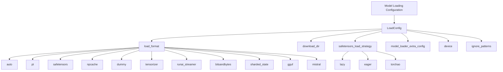
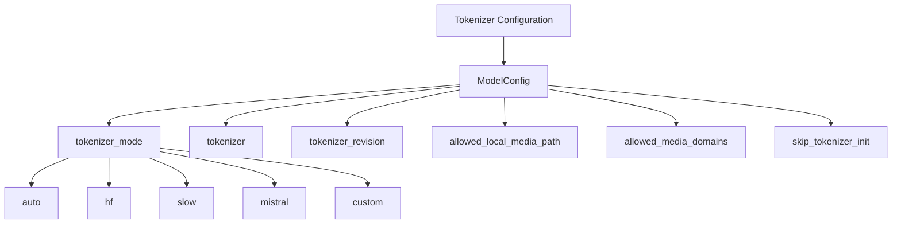
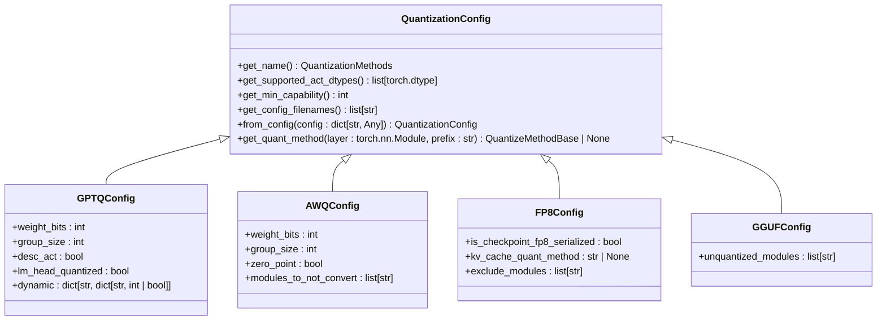
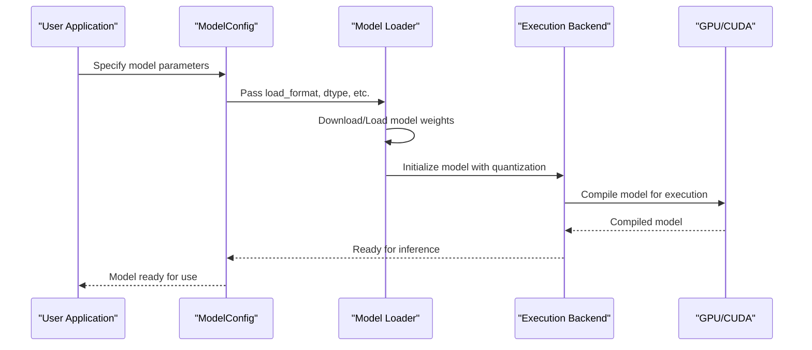
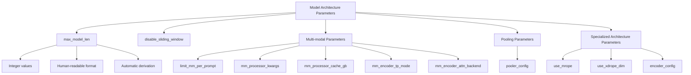

# Model Configuration

<cite>
**Referenced Files in This Document**   
- [model.py](file://vllm/config/model.py)
- [load.py](file://vllm/config/load.py)
- [gptq.py](file://vllm/model_executor/layers/quantization/gptq.py)
- [awq.py](file://vllm/model_executor/layers/quantization/awq.py)
- [fp8.py](file://vllm/model_executor/layers/quantization/fp8.py)
- [gguf.py](file://vllm/model_executor/layers/quantization/gguf.py)
- [weight_utils.py](file://vllm/model_executor/model_loader/weight_utils.py)
- [__init__.py](file://vllm/model_executor/model_loader/__init__.py)
</cite>

## Table of Contents
1. [Introduction](#introduction)
2. [Model Loading Configuration](#model-loading-configuration)
3. [Tokenizer Configuration](#tokenizer-configuration)
4. [Quantization Schemes](#quantization-schemes)
5. [Compilation and Execution Backend Integration](#compilation-and-execution-backend-integration)
6. [Model Architecture Parameters](#model-architecture-parameters)
7. [Configuration Patterns for Different Model Types](#configuration-patterns-for-different-model-types)
8. [Common Issues and Solutions](#common-issues-and-solutions)
9. [Conclusion](#conclusion)

## Introduction

This document provides comprehensive guidance on configuring vLLM for optimal model loading, compilation, and execution. It covers the essential parameters and configuration options that control how models are loaded, quantized, and executed within the vLLM framework. The content is designed to be accessible to beginners while providing sufficient technical depth for experienced developers seeking to optimize model performance.

The vLLM framework offers a flexible and powerful configuration system that allows users to fine-tune various aspects of model execution, from basic model loading parameters to advanced quantization techniques and compilation options. Understanding these configuration options is crucial for achieving optimal performance and compatibility across different model types and hardware platforms.

**Section sources**
- [model.py](file://vllm/config/model.py#L1-L2273)
- [load.py](file://vllm/config/load.py#L1-L125)

## Model Loading Configuration

The model loading configuration in vLLM is primarily controlled through the `LoadConfig` class, which defines how model weights are loaded and processed. This configuration is critical for determining the efficiency and compatibility of model loading operations.

The `load_format` parameter is one of the most important settings, specifying the format of the model weights to load. Supported formats include:
- "auto": Attempts to load weights in safetensors format, falling back to pytorch bin format if unavailable
- "pt": Loads weights in pytorch bin format
- "safetensors": Loads weights in safetensors format
- "npcache": Loads weights in pytorch format and stores a numpy cache to speed up loading
- "dummy": Initializes weights with random values, primarily for profiling
- "tensorizer": Uses CoreWeave's tensorizer library for fast weight loading
- "runai_streamer": Loads safetensors weights using Run:ai Model Streamer
- "bitsandbytes": Loads weights using bitsandbytes quantization
- "sharded_state": Loads weights from pre-sharded checkpoint files
- "gguf": Loads weights from GGUF format files
- "mistral": Loads weights from consolidated safetensors files used by Mistral models

The `download_dir` parameter specifies the directory to download and load the weights, defaulting to the Hugging Face cache directory. For large models, specifying a custom download directory can help manage storage requirements.

The `safetensors_load_strategy` parameter controls the loading strategy for safetensors weights:
- "lazy" (default): Weights are memory-mapped from the file, enabling on-demand loading
- "eager": The entire file is read into CPU memory upfront, recommended for network filesystems
- "torchao": Weights are loaded upfront and reconstructed into torchao tensor subclasses

Additional parameters include `model_loader_extra_config` for passing extra configuration to the model loader, `device` for specifying the target device for weight loading, and `ignore_patterns` for specifying patterns to ignore when loading the model (defaulting to "original/**/*" to avoid repeated loading of llama's checkpoints).



**Diagram sources **
- [load.py](file://vllm/config/load.py#L28-L52)
- [__init__.py](file://vllm/model_executor/model_loader/__init__.py#L31-L46)

**Section sources**
- [load.py](file://vllm/config/load.py#L1-L125)
- [__init__.py](file://vllm/model_executor/model_loader/__init__.py#L1-L151)

## Tokenizer Configuration

Tokenizer configuration in vLLM is managed through the `ModelConfig` class, with the `tokenizer_mode` parameter playing a crucial role in determining how tokenization is performed. This parameter offers several options to accommodate different tokenizer implementations and requirements.

The `tokenizer_mode` parameter accepts the following values:
- "auto": Uses the "hf" tokenizer if Mistral's tokenizer is not available
- "hf": Uses the fast tokenizer if available
- "slow": Always uses the slow tokenizer
- "mistral": Always uses the tokenizer from `mistral_common`
- Custom values can be supported via plugins

The `tokenizer` parameter specifies the name or path of the Hugging Face tokenizer to use. If unspecified, the model name or path will be used. The `tokenizer_revision` parameter allows specifying a particular revision of the tokenizer on the Hugging Face Hub.

For multi-modal models, additional tokenizer-related parameters include `allowed_local_media_path` and `allowed_media_domains`, which control access to local media files and restrict media URLs to specific domains for security purposes.

The tokenizer configuration also includes parameters for handling special cases, such as `skip_tokenizer_init`, which skips initialization of the tokenizer and detokenizer, expecting valid `prompt_token_ids` and `None` for prompt from the input. This can be useful for advanced use cases where tokenization is handled externally.



**Diagram sources **
- [model.py](file://vllm/config/model.py#L138-L144)
- [model.py](file://vllm/config/model.py#L177-L186)

**Section sources**
- [model.py](file://vllm/config/model.py#L138-L186)

## Quantization Schemes

vLLM supports multiple quantization schemes to optimize model performance and memory usage. These schemes are implemented through specialized configuration classes that extend the base `QuantizationConfig` class.

### GPTQ Quantization

GPTQ (Generalized Post-Training Quantization) is implemented through the `GPTQConfig` class. Key parameters include:
- `weight_bits`: Number of bits for weight quantization (2, 3, 4, or 8)
- `group_size`: Size of weight groups for quantization
- `desc_act`: Whether to use descending activation order
- `lm_head_quantized`: Whether the language model head is quantized
- `dynamic`: Dictionary for per-module quantization configuration

GPTQ supports dynamic quantization configuration through regex patterns that can perform positive ("+:") or negative ("-:") matching of modules. This allows for fine-grained control over which parts of the model are quantized and with what parameters.

### AWQ Quantization

AWQ (Activation-aware Weight Quantization) is implemented through the `AWQConfig` class. Key parameters include:
- `weight_bits`: Number of bits for weight quantization (currently only 4-bit is supported)
- `group_size`: Size of weight groups for quantization
- `zero_point`: Whether to use zero-point quantization
- `modules_to_not_convert`: List of modules to exclude from quantization

AWQ is particularly effective for maintaining model accuracy while reducing memory footprint, with the framework automatically detecting quantized layers from safetensors metadata when `modules_to_not_convert` is not specified.

### FP8 Quantization

FP8 (8-bit floating point) quantization is supported through multiple implementations:
- `ModelOptFp8Config`: For Model Optimizer static quantization
- `FBGEMMFp8Config`: For Facebook's FBGEMM library
- `CompressedTensorsW8A8Fp8Config`: For compressed tensors with W8A8 FP8 quantization

FP8 quantization offers a balance between precision and memory efficiency, with support for both static and dynamic scaling. The framework automatically detects FP8 quantization from model configuration when "FP8" appears in the quantization method.

### GGUF Quantization

GGUF (GGML Universal Format) quantization is implemented through the `GGUFConfig` class. This format supports various quantization types including:
- Q4_0, Q4_1: 4-bit quantization
- Q5_0, Q5_1: 5-bit quantization
- Q6_K: 6-bit quantization
- Q8_0: 8-bit quantization

GGUF quantization is particularly useful for running large models on consumer hardware, with the ability to specify `unquantized_modules` to exclude certain modules from quantization.



**Diagram sources **
- [gptq.py](file://vllm/model_executor/layers/quantization/gptq.py#L43-L200)
- [awq.py](file://vllm/model_executor/layers/quantization/awq.py#L32-L200)
- [fp8.py](file://vllm/model_executor/layers/quantization/fp8.py#L33-L150)
- [gguf.py](file://vllm/model_executor/layers/quantization/gguf.py#L41-L86)

**Section sources**
- [gptq.py](file://vllm/model_executor/layers/quantization/gptq.py#L43-L200)
- [awq.py](file://vllm/model_executor/layers/quantization/awq.py#L32-L200)
- [fp8.py](file://vllm/model_executor/layers/quantization/fp8.py#L33-L150)
- [gguf.py](file://vllm/model_executor/layers/quantization/gguf.py#L41-L86)

## Compilation and Execution Backend Integration

The integration between model loading arguments and execution backends in vLLM is a critical aspect of achieving optimal performance. This integration is managed through the `ModelConfig` class and various backend-specific configuration options.

The `enforce_eager` parameter controls whether to always use eager-mode PyTorch. When set to `True`, CUDA graph execution is disabled, and the model runs in eager mode. When `False` (default), CUDA graph and eager execution are used in hybrid mode for maximal performance and flexibility.

The `dtype` parameter determines the data type for model weights and activations, with options including:
- "auto": Automatically selects FP16 for FP32/FP16 models and BF16 for BF16 models
- "half" or "float16": FP16 precision, recommended for AWQ quantization
- "bfloat16": BF16 precision for balance between precision and range
- "float" or "float32": FP32 precision

For compilation, vLLM supports various backends through the `compilation` module, including:
- CUDA graph compilation for optimized execution
- Inductor pass management for PyTorch 2.0+
- Custom graph passes for specific optimization patterns

The `max_model_len` parameter is particularly important as it defines the model context length (prompt and output). This parameter can be specified in human-readable format with k/m/g/K/M/G suffixes (e.g., 1k = 1000, 1K = 1024). The framework automatically derives this value from the model config if unspecified.

The `logprobs_mode` parameter controls the content returned in logprobs and prompt_logprobs, with options including:
- "raw_logprobs": Values before applying any logit processors
- "processed_logprobs": Values after applying all processors
- "raw_logits": Raw logits before processing
- "processed_logits": Logits after processing



**Diagram sources **
- [model.py](file://vllm/config/model.py#L148-L156)
- [model.py](file://vllm/config/model.py#L188-L196)
- [model.py](file://vllm/config/model.py#L214-L221)

**Section sources**
- [model.py](file://vllm/config/model.py#L148-L221)

## Model Architecture Parameters

vLLM's model configuration system provides extensive control over model architecture parameters, allowing for fine-tuning of various aspects of model behavior and performance.

The `max_model_len` parameter is one of the most critical architecture parameters, defining the maximum context length for the model. This parameter can be specified in various formats, including:
- Integer values (e.g., 4096)
- Human-readable format with k/m/g/K/M/G suffixes (e.g., 1k = 1000, 1K = 1024)
- Automatic derivation from model config when unspecified

The `disable_sliding_window` parameter controls whether to disable the sliding window functionality of the model. When enabled, the model is capped to the sliding window size, which can be useful for certain use cases.

For multi-modal models, several architecture parameters are available:
- `limit_mm_per_prompt`: Limits the number of multi-modal inputs per prompt
- `mm_processor_kwargs`: Additional arguments for multi-modal processors
- `mm_processor_cache_gb`: Size of the multi-modal processor cache in GB
- `mm_encoder_tp_mode`: Tensor parallelism mode for multi-modal encoders
- `mm_encoder_attn_backend`: Attention backend for multi-modal encoders

The `pooler_config` parameter controls the behavior of output pooling in pooling models, with options for different pooling types and normalization settings.

For models with specialized architectures, vLLM provides parameters such as:
- `use_mrope`: Enables multi-resolution RoPE for certain models
- `use_xdrope_dim`: Enables XD RoPE dimension for specific architectures
- `encoder_config`: Configuration for encoder-decoder models



**Diagram sources **
- [model.py](file://vllm/config/model.py#L188-L225)
- [model.py](file://vllm/config/model.py#L304-L320)
- [model.py](file://vllm/config/model.py#L299-L302)

**Section sources**
- [model.py](file://vllm/config/model.py#L188-L320)

## Configuration Patterns for Different Model Types

vLLM supports various model types with specific configuration patterns optimized for each architecture. Understanding these patterns is essential for achieving optimal performance and compatibility.

### Llama Models

For Llama models, the recommended configuration pattern includes:
- `load_format="auto"` for automatic format detection
- `dtype="half"` for FP16 precision
- `tokenizer_mode="auto"` to use the appropriate tokenizer
- `max_model_len` set according to the specific Llama version (e.g., 4096 for Llama 2, 32768 for Llama 3)
- `quantization="gptq"` or `"awq"` for quantized versions

Special considerations for Llama models include handling the original checkpoints pattern by including "original/**/*" in `ignore_patterns` to avoid repeated loading.

### Mixtral Models

Mixtral models, being mixture-of-experts (MoE) architectures, require specific configuration:
- `load_format="auto"` for format flexibility
- `dtype="bfloat16"` recommended for better precision with MoE
- `max_model_len=32768` to match the model's context window
- `quantization="awq"` preferred due to better MoE support
- Proper configuration of MoE-specific parameters like `moe_config`

The framework automatically detects MoE architectures and applies appropriate optimizations, but explicit configuration can further enhance performance.

### Multi-modal Models

Multi-modal models require additional configuration for handling various input types:
- `limit_mm_per_prompt` to control the number of multi-modal inputs
- `mm_processor_kwargs` for processor-specific settings
- `mm_processor_cache_gb` to manage processor cache size
- `allowed_local_media_path` and `allowed_media_domains` for security
- Proper tokenizer configuration to handle multi-modal tokens

For vision-language models, specific parameters like `image_token_id` and `vision_config` may need to be configured based on the model architecture.

```mermaid
graph TD
A[Configuration Patterns] --> B[Llama Models]
A --> C[Mixtral Models]
A --> D[Multi-modal Models]
B --> E[load_format="auto"]
B --> F[dtype="half"]
B --> G[tokenizer_mode="auto"]
B --> H[max_model_len=4096/32768]
B --> I[quantization="gptq"/"awq"]
C --> J[load_format="auto"]
C --> K[dtype="bfloat16"]
C --> L[max_model_len=32768]
C --> M[quantization="awq"]
C --> N[moe_config settings]
D --> O[limit_mm_per_prompt]
D --> P[mm_processor_kwargs]
D --> Q[mm_processor_cache_gb]
D --> R[allowed_local_media_path]
D --> S[allowed_media_domains]
D --> T[tokenizer configuration]
```

**Diagram sources **
- [model.py](file://vllm/config/model.py#L118-L196)
- [model.py](file://vllm/config/model.py#L304-L320)
- [weight_utils.py](file://vllm/model_executor/model_loader/weight_utils.py#L562-L565)

**Section sources**
- [model.py](file://vllm/config/model.py#L118-L320)
- [weight_utils.py](file://vllm/model_executor/model_loader/weight_utils.py#L562-L565)

## Common Issues and Solutions

When configuring vLLM models, several common issues may arise. Understanding these issues and their solutions is crucial for successful deployment.

### Model Format Incompatibility

One common issue is model format incompatibility, where the specified `load_format` does not match the actual model format. Solutions include:
- Using `load_format="auto"` to let vLLM automatically detect the format
- Verifying the model files and their extensions
- Converting models to supported formats using appropriate tools
- Checking for mixed format files (e.g., both safetensors and pytorch bin files)

The framework includes utilities like `filter_duplicate_safetensors_files` to handle cases where both index-based and consolidated safetensors files exist.

### Tokenizer Mismatches

Tokenizer mismatches can occur when the tokenizer configuration does not match the model requirements. Solutions include:
- Ensuring the tokenizer revision matches the model revision
- Using the same model name for both model and tokenizer when unspecified
- Verifying tokenizer compatibility with the model architecture
- Handling special tokens for multi-modal models

The `maybe_download_from_modelscope` function helps ensure consistent model and tokenizer downloads when using ModelScope.

### Quantization Compatibility Issues

Quantization compatibility issues may arise when the quantization method is not supported by the hardware or model architecture. Solutions include:
- Checking GPU capability requirements for specific quantization methods
- Using fallback quantization methods when primary methods are not supported
- Verifying model architecture compatibility with quantization schemes
- Updating to compatible vLLM versions

For example, the 4-bit GPTQ kernel has known issues, and users are advised to use `gptq_marlin` or `gptq_bitblas` instead.

### Memory and Performance Issues

Memory and performance issues can occur with large models or complex configurations. Solutions include:
- Adjusting `max_model_len` to match actual requirements
- Using appropriate quantization to reduce memory footprint
- Configuring swap space and CPU offload for memory-constrained systems
- Optimizing batch sizes for throughput and latency requirements

```mermaid
flowchart TD
A[Common Issues] --> B[Model Format Incompatibility]
A --> C[Tokenizer Mismatches]
A --> D[Quantization Compatibility]
A --> E[Memory and Performance]
B --> F[Use load_format="auto"]
B --> G[Verify model files]
B --> H[Convert to supported formats]
B --> I[Check for mixed formats]
C --> J[Match tokenizer revision]
C --> K[Use consistent model names]
C --> L[Verify tokenizer compatibility]
C --> M[Handle special tokens]
D --> N[Check GPU capability]
D --> O[Use fallback methods]
D --> P[Verify architecture compatibility]
D --> Q[Update vLLM version]
E --> R[Adjust max_model_len]
E --> S[Use appropriate quantization]
E --> T[Configure swap space]
E --> U[Optimize batch sizes]
```

**Diagram sources **
- [weight_utils.py](file://vllm/model_executor/model_loader/weight_utils.py#L145-L177)
- [gptq.py](file://vllm/model_executor/layers/quantization/gptq.py#L97-L101)
- [model.py](file://vllm/config/model.py#L480-L487)

**Section sources**
- [weight_utils.py](file://vllm/model_executor/model_loader/weight_utils.py#L145-L177)
- [gptq.py](file://vllm/model_executor/layers/quantization/gptq.py#L97-L101)
- [model.py](file://vllm/config/model.py#L480-L487)

## Conclusion

This document has provided a comprehensive overview of vLLM's model configuration system, covering model loading, tokenizer configuration, quantization schemes, compilation integration, and architecture parameters. The flexible configuration system allows users to optimize model performance across various hardware platforms and use cases.

Key takeaways include:
- The importance of selecting appropriate `load_format` and `dtype` parameters for optimal performance
- The flexibility of tokenizer configuration through the `tokenizer_mode` parameter
- The range of quantization options available, from GPTQ and AWQ to FP8 and GGUF
- The integration between model loading arguments and execution backends
- The specialized configuration patterns for different model types

By understanding these configuration options and their implications, users can effectively deploy and optimize vLLM for their specific requirements, whether for research, development, or production use cases.

[No sources needed since this section summarizes without analyzing specific files]