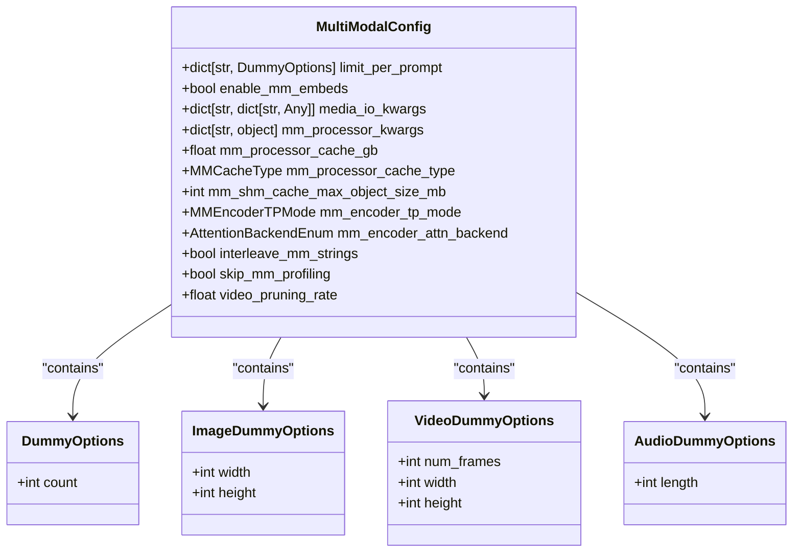
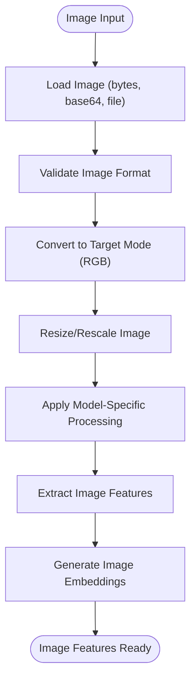
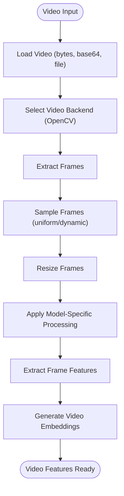
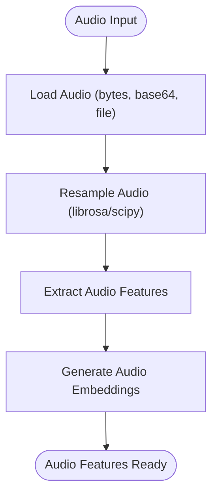
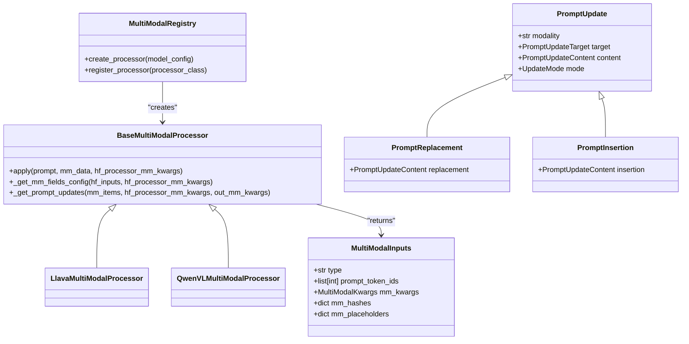
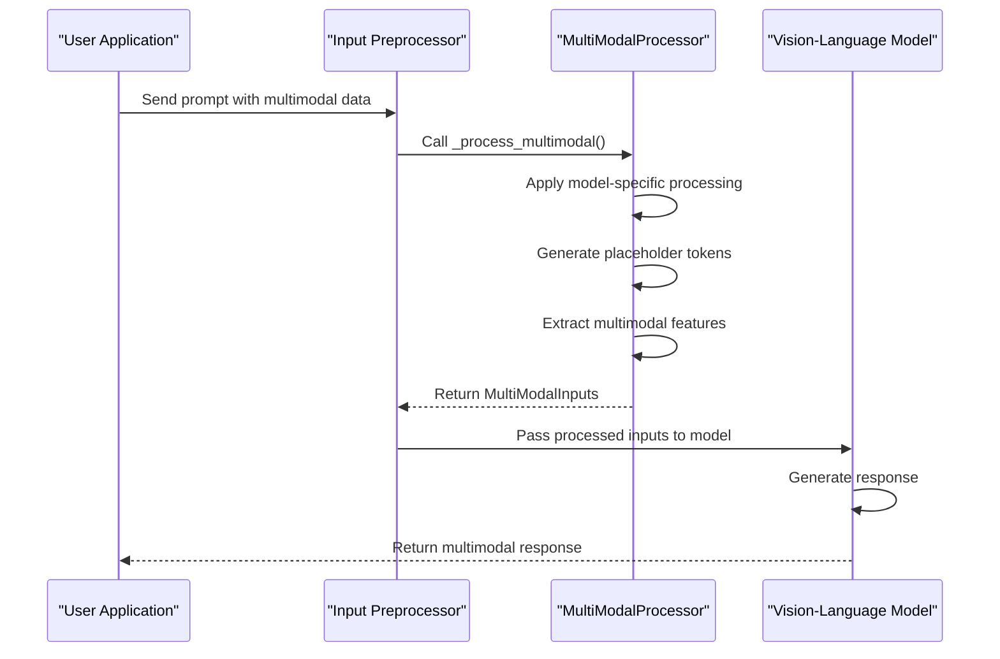
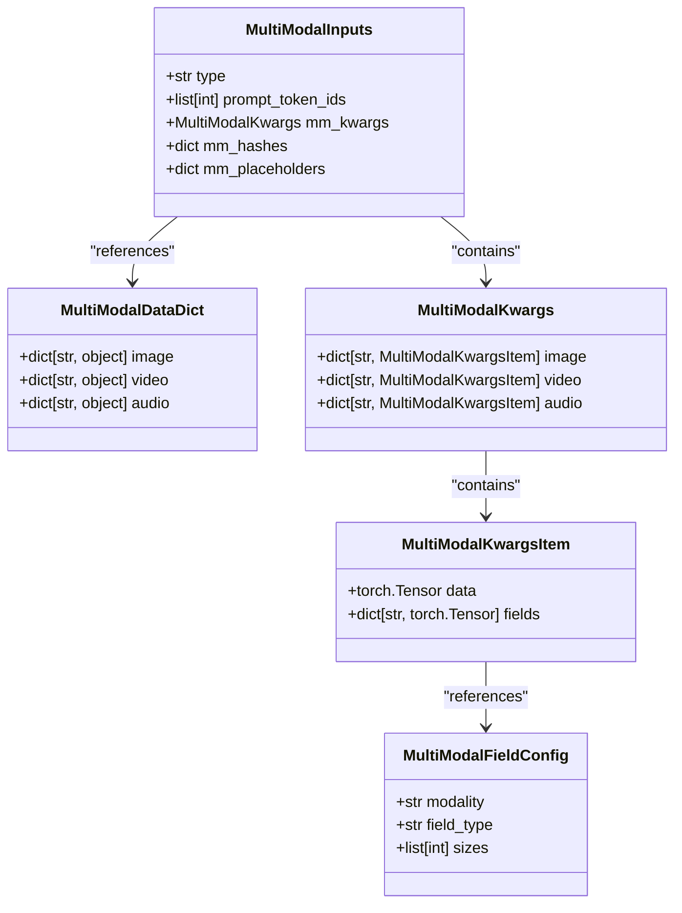
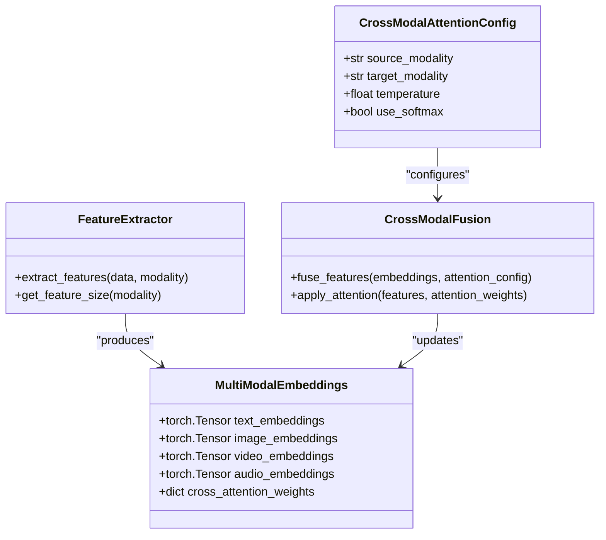
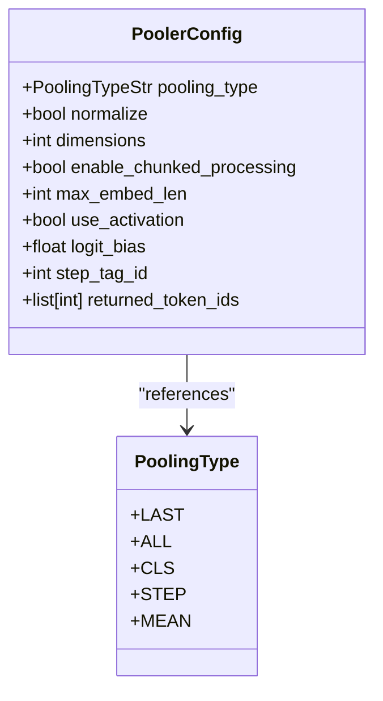

# Multimodal Configuration

<cite>
**Referenced Files in This Document**   
- [multimodal.py](file://vllm/config/multimodal.py)
- [processing.py](file://vllm/multimodal/processing.py)
- [image.py](file://vllm/multimodal/image.py)
- [video.py](file://vllm/multimodal/video.py)
- [audio.py](file://vllm/multimodal/audio.py)
- [pooler.py](file://vllm/config/pooler.py)
- [model.py](file://vllm/config/model.py)
- [vision_language.py](file://examples/offline_inference/vision_language.py)
- [mistral-small.py](file://examples/offline_inference/mistral-small.py)
</cite>

## Table of Contents
1. [Introduction](#introduction)
2. [Core Configuration Parameters](#core-configuration-parameters)
3. [Image Processing Configuration](#image-processing-configuration)
4. [Video Handling Configuration](#video-handling-configuration)
5. [Audio Integration Configuration](#audio-integration-configuration)
6. [Processing Pipeline and Invocation](#processing-pipeline-and-invocation)
7. [Domain Models and Data Structures](#domain-models-and-data-structures)
8. [Configuration Examples](#configuration-examples)
9. [Pooler Configuration](#pooler-configuration)
10. [Common Issues and Solutions](#common-issues-and-solutions)

## Introduction
vLLM provides comprehensive support for multimodal inputs, enabling vision-language models to process images, videos, and audio alongside text. This documentation details the configuration system for multimodal inputs, covering implementation details, processing pipelines, domain models, and practical examples for models like LLaVA and Qwen-VL. The system is designed to be both accessible to beginners and technically deep enough for experienced developers working with multimodal applications.

## Core Configuration Parameters
The multimodal configuration in vLLM is controlled through several key parameters that govern the behavior of multimodal processing. These parameters are defined in the `MultiModalConfig` class and can be set during model initialization.



**Diagram sources**
- [multimodal.py](file://vllm/config/multimodal.py#L53-L248)

**Section sources**
- [multimodal.py](file://vllm/config/multimodal.py#L53-L248)
- [model.py](file://vllm/config/model.py#L304-L320)

### mm_processor_kwargs
The `mm_processor_kwargs` parameter allows users to pass additional arguments to the model's processor for multimodal data. These arguments override the default settings obtained from `transformers.AutoProcessor.from_pretrained`. For example, in Phi-3-Vision models, you can set `{"num_crops": 4}` to control the number of image crops processed.

### mm_limit_per_prompt
The `mm_limit_per_prompt` parameter controls the maximum number of input items allowed per prompt for each modality. It supports both legacy count-only format and configurable format with options:

```python
# Legacy format (count only)
{"image": 16, "video": 2}

# Configurable format (with options)
{"video": {"count": 1, "num_frames": 32, "width": 512, "height": 512}, 
 "image": {"count": 5, "width": 512, "height": 512}}

# Mixed format (combining both)
{"image": 16, "video": {"count": 1, "num_frames": 32, "width": 512, "height": 512}}
```

### image_input_type
While not a direct parameter, the image input type is determined by the media processing pipeline. vLLM supports various image input types including raw image data, base64 encoded images, and image URLs. The system automatically handles the conversion between these types through the `ImageMediaIO` class.

## Image Processing Configuration
Image processing in vLLM is handled through a dedicated pipeline that manages image loading, preprocessing, and feature extraction. The configuration is designed to be flexible and support various vision-language models.

### Image Processing Pipeline
The image processing pipeline follows a structured flow from input to feature extraction:



**Diagram sources**
- [image.py](file://vllm/multimodal/image.py#L1-L135)
- [processing.py](file://vllm/multimodal/processing.py#L1-L800)

### Image Processing Parameters
The image processing configuration includes several parameters that control how images are handled:

- **image_mode**: Specifies the target image mode (default: "RGB")
- **rgba_background_color**: Background color for converting RGBA images to RGB (default: white)
- **min_pixels** and **max_pixels**: Constraints on image size for dynamic resizing
- **num_crops**: Number of crops to extract from an image

These parameters can be passed through `media_io_kwargs` or `mm_processor_kwargs` depending on their scope.

**Section sources**
- [image.py](file://vllm/multimodal/image.py#L46-L102)
- [multimodal.py](file://vllm/config/multimodal.py#L82-L95)

## Video Handling Configuration
Video processing in vLLM is designed to handle temporal data efficiently, with support for frame sampling, resizing, and metadata extraction.

### Video Processing Pipeline
The video processing pipeline manages the conversion of video data into a format suitable for vision-language models:



**Diagram sources**
- [video.py](file://vllm/multimodal/video.py#L1-L334)
- [processing.py](file://vllm/multimodal/processing.py#L1-L800)

### Video Processing Parameters
The video processing configuration includes parameters that control frame extraction and processing:

- **num_frames**: Number of frames to sample from the video
- **fps**: Target frames per second for sampling
- **max_duration**: Maximum duration for dynamic sampling
- **video_backend**: Video processing backend (default: "opencv")

These parameters can be set through `media_io_kwargs` or `mm_processor_kwargs`. For example, to set the number of frames for video processing:

```python
media_io_kwargs = {"video": {"num_frames": 40}}
```

**Section sources**
- [video.py](file://vllm/multimodal/video.py#L270-L315)
- [multimodal.py](file://vllm/config/multimodal.py#L84-L85)

## Audio Integration Configuration
Audio processing in vLLM enables speech-to-text and audio understanding capabilities in multimodal models.

### Audio Processing Pipeline
The audio processing pipeline converts audio data into features that can be processed by multimodal models:



**Diagram sources**
- [audio.py](file://vllm/multimodal/audio.py#L1-L143)
- [processing.py](file://vllm/multimodal/processing.py#L1-L800)

### Audio Processing Parameters
The audio processing configuration includes parameters for audio resampling and feature extraction:

- **target_sr**: Target sample rate for audio resampling
- **method**: Resampling method ("librosa" or "scipy")
- **length**: Length of audio to process

These parameters are passed through `media_io_kwargs` or `mm_processor_kwargs`. The system supports various audio formats and automatically handles the conversion to the required format.

**Section sources**
- [audio.py](file://vllm/multimodal/audio.py#L53-L87)
- [multimodal.py](file://vllm/config/multimodal.py#L84-L85)

## Processing Pipeline and Invocation
The multimodal processing pipeline in vLLM orchestrates the flow of data from input to model processing, handling the integration of different modalities.

### Processing Pipeline Architecture
The processing pipeline follows a modular architecture that separates concerns and enables extensibility:



**Diagram sources**
- [processing.py](file://vllm/multimodal/processing.py#L290-L490)
- [base.py](file://vllm/multimodal/base.py#L1-L55)

### Invocation Flow
The invocation of multimodal processing follows a specific sequence of operations:



**Diagram sources**
- [preprocess.py](file://vllm/inputs/preprocess.py#L231-L267)
- [processing.py](file://vllm/multimodal/processing.py#L1-L800)

The processing begins with the `_process_multimodal` method in the input preprocessor, which creates a multi-modal processor instance and applies it to the input data. The processor then handles the model-specific processing, including generating placeholder tokens and extracting multimodal features.

**Section sources**
- [preprocess.py](file://vllm/inputs/preprocess.py#L231-L267)
- [processing.py](file://vllm/multimodal/processing.py#L1-L800)

## Domain Models and Data Structures
vLLM uses a rich set of domain models to represent multimodal data and processing parameters. These models provide a structured way to handle complex multimodal inputs.

### MultiModal Data Models
The core data structures for multimodal processing include:



**Diagram sources**
- [inputs.py](file://vllm/multimodal/inputs.py#L1-L43)
- [processing.py](file://vllm/multimodal/processing.py#L33-L43)

### Cross-Modal Attention Models
For models that support cross-modal attention, vLLM provides data structures to represent the interactions between different modalities:



**Diagram sources**
- [processing.py](file://vllm/multimodal/processing.py#L1-L800)
- [base.py](file://vllm/multimodal/base.py#L1-L55)

These models enable sophisticated cross-modal interactions, where information from one modality can influence the processing of another. The `CrossModalAttentionConfig` class defines the parameters for attention between modalities, while `MultiModalEmbeddings` stores the combined representations.

**Section sources**
- [processing.py](file://vllm/multimodal/processing.py#L1-L800)
- [base.py](file://vllm/multimodal/base.py#L1-L55)

## Configuration Examples
This section provides concrete examples of multimodal configuration for popular vision-language models.

### LLaVA Configuration
For LLaVA models, the configuration focuses on image processing and placeholder management:

```python
from vllm import EngineArgs

engine_args = EngineArgs(
    model="llava-hf/llava-v1.6-mistral-7b-hf",
    trust_remote_code=True,
    max_model_len=4096,
    limit_mm_per_prompt={"image": 1},
    mm_processor_kwargs={
        "image_token": "<image>",
        "image_start_tag": "",
        "image_end_tag": "</img>",
    }
)
```

The configuration sets limits on the number of images per prompt and customizes the image placeholder tokens used in the prompt.

**Section sources**
- [mistral-small.py](file://examples/offline_inference/mistral-small.py#L105-L109)

### Qwen-VL Configuration
Qwen-VL models require specific configuration for image and video processing:

```python
engine_args = EngineArgs(
    model="Qwen/Qwen2-VL-7B-Instruct",
    max_model_len=4096,
    max_num_seqs=5,
    mm_processor_kwargs={
        "min_pixels": 28 * 28,
        "max_pixels": 1280 * 28 * 28,
    },
    limit_mm_per_prompt={"image": 1},
)
```

The configuration includes pixel constraints for dynamic image resizing and limits on the number of images per prompt.

```python
engine_args = EngineArgs(
    model="Qwen/Qwen2.5-VL-3B-Instruct",
    max_model_len=4096,
    max_num_seqs=5,
    mm_processor_kwargs={
        "min_pixels": 28 * 28,
        "max_pixels": 1280 * 28 * 28,
        "fps": 1,
    },
    limit_mm_per_prompt={"video": 1},
)
```

For video processing, the configuration includes frame rate settings in addition to pixel constraints.

**Section sources**
- [vision_language.py](file://examples/offline_inference/vision_language.py#L1488-L1530)

### Phi-3-Vision Configuration
Phi-3-Vision models use a different approach to image processing with crop-based features:

```python
engine_args = EngineArgs(
    model="microsoft/Phi-3-vision-128k-instruct",
    trust_remote_code=True,
    max_model_len=128000,
    limit_mm_per_prompt={"image": 1},
    mm_processor_kwargs={
        "num_crops": 4,
    }
)
```

The configuration specifies the number of crops to extract from each image, which affects the feature extraction process.

**Section sources**
- [mistral-small.py](file://examples/offline_inference/mistral-small.py#L105-L109)

## Pooler Configuration
The pooler configuration in vLLM controls how model outputs are aggregated and processed for different tasks.

### Pooler Configuration Parameters
The `PoolerConfig` class defines parameters for output pooling:



**Diagram sources**
- [pooler.py](file://vllm/config/pooler.py#L1-L125)
- [pooler.py](file://vllm/model_executor/layers/pooler.py#L42-L757)

### Pooling Type Impact
The `pooling_type` parameter determines how the model's hidden states are aggregated:

- **LAST**: Use the last token's hidden state
- **ALL**: Use all token hidden states
- **CLS**: Use the CLS token's hidden state
- **STEP**: Use step-specific hidden states
- **MEAN**: Use mean pooling of hidden states

The choice of pooling type affects the dimensionality and semantic meaning of the output embeddings.

**Section sources**
- [pooler.py](file://vllm/config/pooler.py#L1-L125)
- [pooler.py](file://vllm/model_executor/layers/pooler.py#L42-L757)

## Common Issues and Solutions
This section addresses common issues encountered when configuring multimodal inputs in vLLM and provides solutions.

### Input Dimension Mismatches
Input dimension mismatches occur when the processed multimodal data doesn't match the model's expected input dimensions.

**Symptoms:**
- RuntimeError: "Input size does not match expected size"
- Shape mismatch errors during tensor operations
- Invalid output dimensions

**Solutions:**
1. Verify image dimensions match model requirements:
```python
# Check model's expected image size
vision_config = model.config.vision_config
expected_size = vision_config.image_size
```

2. Use dynamic resizing with proper constraints:
```python
mm_processor_kwargs = {
    "min_pixels": 28 * 28,
    "max_pixels": 1280 * 28 * 28,
}
```

3. Ensure consistent tensor shapes across batches.

**Section sources**
- [qwen_vl.py](file://vllm/model_executor/models/qwen_vl.py#L603-L605)
- [multimodal.py](file://vllm/config/multimodal.py#L86-L95)

### Processor Loading Failures
Processor loading failures occur when the multimodal processor cannot be initialized or loaded.

**Symptoms:**
- ValueError: "Could not load processor"
- ImportError: "Processor module not found"
- NoneType errors when accessing processor attributes

**Solutions:**
1. Ensure required dependencies are installed:
```bash
pip install transformers[vision] pillow opencv-python
```

2. Verify model ID and trust_remote_code setting:
```python
engine_args = EngineArgs(
    model="model_id",
    trust_remote_code=True,  # Required for custom processors
)
```

3. Check processor registration:
```python
# Verify processor is registered
from vllm.multimodal import MULTIMODAL_REGISTRY
processor = MULTIMODAL_REGISTRY.create_processor(model_config)
```

**Section sources**
- [plugins/io_processors/__init__.py](file://vllm/plugins/io_processors/__init__.py#L34-L68)
- [model.py](file://vllm/config/model.py#L304-L320)

### Cache Configuration Issues
Cache configuration issues affect performance and memory usage during multimodal processing.

**Symptoms:**
- High memory usage
- Slow processing for repeated inputs
- Cache eviction warnings

**Solutions:**
1. Configure processor cache size appropriately:
```python
engine_args = EngineArgs(
    mm_processor_cache_gb=4,  # Cache size in GiB
    mm_processor_cache_type="lru",  # Cache type
)
```

2. Monitor cache performance and adjust size based on workload.

3. Disable cache for memory-constrained environments:
```python
engine_args = EngineArgs(
    mm_processor_cache_gb=0,  # Disable cache
)
```

**Section sources**
- [multimodal.py](file://vllm/config/multimodal.py#L95-L110)
- [mistral-small.py](file://examples/offline_inference/mistral-small.py#L108-L109)