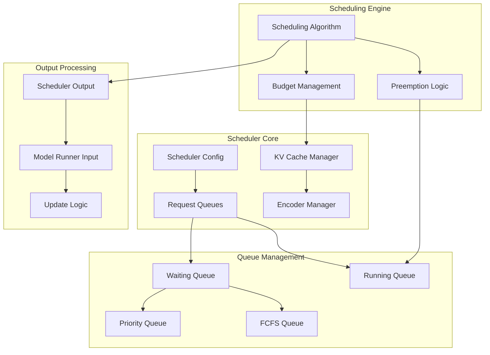
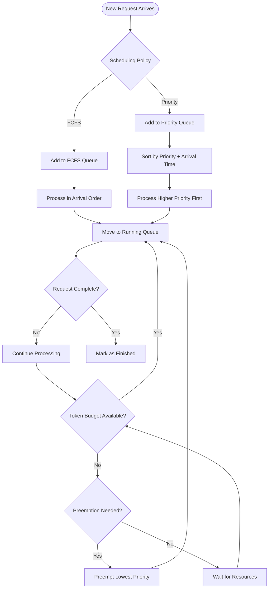
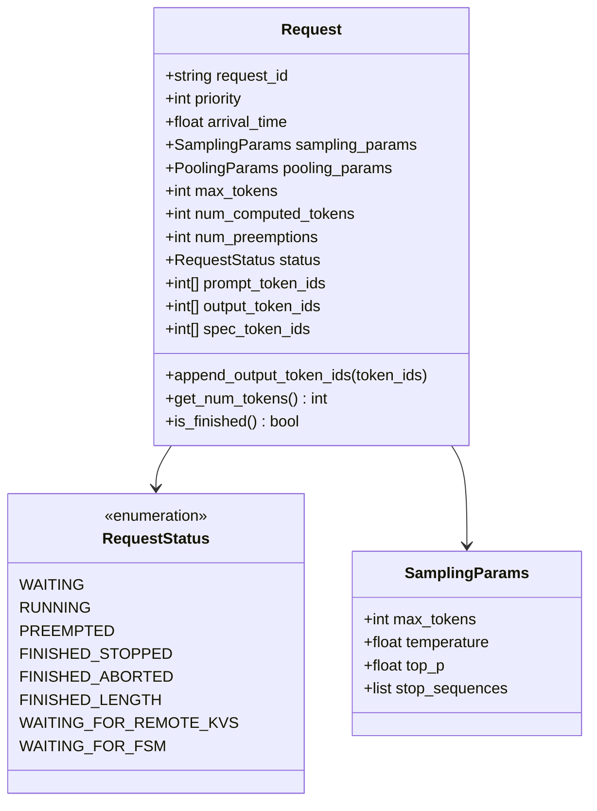
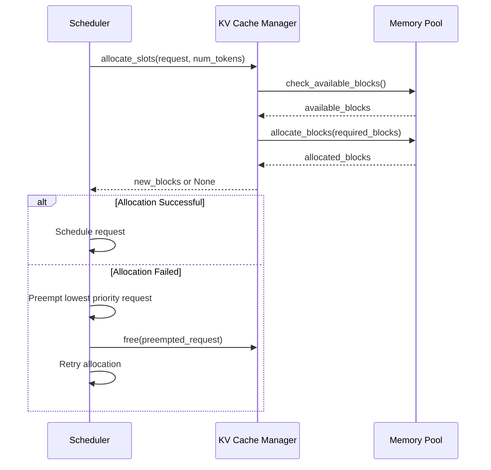

# Scheduler Configuration

<cite>
**Referenced Files in This Document**
- [scheduler.py](file://vllm/config/scheduler.py)
- [scheduler.py](file://vllm/v1/core/sched/scheduler.py)
- [async_scheduler.py](file://vllm/v1/core/sched/async_scheduler.py)
- [interface.py](file://vllm/v1/core/sched/interface.py)
- [request_queue.py](file://vllm/v1/core/sched/request_queue.py)
- [request.py](file://vllm/v1/request.py)
- [batch_llm_inference.py](file://examples/offline_inference/batch_llm_inference.py)
- [test_scheduler.py](file://tests/v1/core/test_scheduler.py)
- [test_priority_scheduler_random.py](file://tests/v1/core/test_priority_scheduler_random.py)
</cite>

## Table of Contents
1. [Introduction](#introduction)
2. [Core Scheduler Architecture](#core-scheduler-architecture)
3. [Key Configuration Parameters](#key-configuration-parameters)
4. [Request Prioritization and Queue Management](#request-prioritization-and-queue-management)
5. [Domain Models](#domain-models)
6. [Configuration Patterns for Different Use Cases](#configuration-patterns-for-different-use-cases)
7. [Advanced Features and Optimization](#advanced-features-and-optimization)
8. [Common Issues and Solutions](#common-issues-and-solutions)
9. [Performance Tuning Guidelines](#performance-tuning-guidelines)
10. [Best Practices](#best-practices)

## Introduction

The vLLM scheduler is a sophisticated request management system that handles the complex task of scheduling inference requests across multiple GPUs while optimizing for both throughput and latency. It serves as the central orchestrator for managing sequence groups, maintaining queue discipline, and making intelligent decisions about resource allocation.

The scheduler operates at the heart of vLLM's engine, making critical decisions about which requests to process, how many tokens to process, and when to preempt running requests to accommodate new arrivals. Its design supports both high-throughput batch processing and low-latency interactive workloads through configurable parameters and scheduling policies.

## Core Scheduler Architecture

The scheduler architecture consists of several interconnected components that work together to manage request lifecycle and optimize resource utilization.



**Diagram sources**
- [scheduler.py](file://vllm/v1/core/sched/scheduler.py#L57-L205)
- [interface.py](file://vllm/v1/core/sched/interface.py#L21-L188)

The scheduler implements a dual-mode operation supporting both synchronous and asynchronous scheduling approaches, with the ability to adapt dynamically to changing workload characteristics.

**Section sources**
- [scheduler.py](file://vllm/v1/core/sched/scheduler.py#L57-L205)
- [interface.py](file://vllm/v1/core/sched/interface.py#L21-L188)

## Key Configuration Parameters

### Core Scheduling Parameters

The scheduler configuration provides several critical parameters that control the fundamental behavior of request processing and resource allocation.

#### max_num_seqs
Controls the maximum number of concurrent sequences that can be processed simultaneously. This parameter directly impacts memory usage and GPU utilization.

```python
# Example configuration for high-throughput serving
scheduler_config = SchedulerConfig(
    max_num_seqs=1024,  # High concurrency for batch processing
    max_num_batched_tokens=16384
)

# Example configuration for low-latency interactive use
scheduler_config = SchedulerConfig(
    max_num_seqs=256,   # Lower concurrency for better responsiveness
    max_num_batched_tokens=8192
)
```

#### max_num_batched_tokens
Defines the maximum number of tokens that can be processed in a single scheduling iteration. This parameter balances memory usage with processing efficiency.

#### async_scheduling
Enables asynchronous scheduling mode that helps maintain continuous GPU utilization by avoiding gaps between processing batches.

#### stream_interval
Controls the buffering behavior for streaming responses, affecting the trade-off between latency and throughput.

**Section sources**
- [scheduler.py](file://vllm/config/scheduler.py#L44-L142)

### Advanced Scheduling Parameters

#### priority_policy
Determines the scheduling policy for request ordering:

- `"fcfs"` (First Come First Serve): Requests are processed in arrival order
- `"priority"`: Requests are processed based on priority values and arrival time

```python
# Priority-based scheduling for mixed workloads
scheduler_config = SchedulerConfig(
    policy="priority",
    max_num_seqs=512
)

# FCFS scheduling for predictable batch processing
scheduler_config = SchedulerConfig(
    policy="fcfs",
    max_num_seqs=1024
)
```

#### enable_chunked_prefill
Allows partial prefilling of long requests to improve memory utilization and reduce head-of-line blocking.

#### long_prefill_token_threshold
Sets the threshold for considering requests as "long" for chunked prefill optimization.

**Section sources**
- [scheduler.py](file://vllm/config/scheduler.py#L103-L117)

## Request Prioritization and Queue Management

### Scheduling Policies

The scheduler supports multiple scheduling policies to accommodate different workload characteristics and performance requirements.



**Diagram sources**
- [request_queue.py](file://vllm/v1/core/sched/request_queue.py#L136-L217)
- [scheduler.py](file://vllm/v1/core/sched/scheduler.py#L301-L330)

### Priority-Based Scheduling

When using priority-based scheduling, the scheduler orders requests using a composite key of priority value and arrival time:

```python
# Priority calculation logic
preempted_req = max(
    self.running,
    key=lambda r: (r.priority, r.arrival_time),
)
```

Lower priority values indicate higher priority, with requests arriving earlier taking precedence when priorities are equal.

**Section sources**
- [request_queue.py](file://vllm/v1/core/sched/request_queue.py#L136-L217)
- [scheduler.py](file://vllm/v1/core/sched/scheduler.py#L301-L330)

### Queue Management Strategies

The scheduler maintains separate queues for different request states and implements sophisticated algorithms for queue management:

#### Waiting Queue Operations
- **Add Request**: New requests are added to the appropriate queue based on policy
- **Peek Request**: Allows previewing the next request without removing it
- **Pop Request**: Removes and returns the next request for processing
- **Prepend Request**: Moves requests back to the front of the queue (for preemption)

#### Running Queue Management
- **Token Budget Allocation**: Distributes available processing capacity among running requests
- **Preemption Logic**: Implements intelligent preemption to make room for new requests
- **Resource Tracking**: Monitors memory usage and adjusts allocation dynamically

**Section sources**
- [scheduler.py](file://vllm/v1/core/sched/scheduler.py#L1302-L1341)

## Domain Models

### Request Model

The Request class encapsulates all information about a single inference request, including metadata, state, and processing history.



**Diagram sources**
- [request.py](file://vllm/v1/request.py#L30-L200)

### Sequence Groups and State Management

The scheduler manages requests as sequence groups, tracking their progression through different states:

#### Request Lifecycle States
1. **WAITING**: Request is queued but not yet scheduled
2. **RUNNING**: Request is actively being processed
3. **PREEMPTED**: Request was preempted to make room for others
4. **FINISHED_***: Various completion states based on termination conditions

#### State Transitions
The scheduler implements complex state transition logic to handle various scenarios:
- Normal completion through token generation
- Early termination via stop sequences or length limits
- Preemption due to resource constraints
- Aborted requests from client cancellation

**Section sources**
- [request.py](file://vllm/v1/request.py#L30-L200)

### KV Cache Management

The scheduler integrates closely with the KV cache system to manage memory allocation efficiently:



**Diagram sources**
- [scheduler.py](file://vllm/v1/core/sched/scheduler.py#L304-L356)

## Configuration Patterns for Different Use Cases

### High-Throughput Serving Configuration

For high-throughput batch processing scenarios, the scheduler should be configured to maximize GPU utilization and minimize idle time:

```python
# High-throughput serving configuration
high_throughput_config = SchedulerConfig(
    max_num_seqs=1024,              # Maximize concurrency
    max_num_batched_tokens=16384,   # Large batch size
    enable_chunked_prefill=True,     # Enable partial prefilling
    max_num_partial_prefills=4,     # Allow multiple partial prefills
    long_prefill_token_threshold=2048,  # Threshold for chunked prefill
    async_scheduling=True,          # Maintain continuous GPU utilization
    policy="fcfs"                   # Predictable batch processing
)
```

#### Key Characteristics:
- **High Concurrency**: Large `max_num_seqs` enables many simultaneous requests
- **Large Batches**: High `max_num_batched_tokens` improves memory efficiency
- **Chunked Prefill**: Enables processing of long requests without blocking
- **Async Scheduling**: Maintains continuous GPU utilization

### Low-Latency Interactive Configuration

For interactive applications requiring low response times:

```python
# Low-latency interactive configuration
low_latency_config = SchedulerConfig(
    max_num_seqs=256,               # Moderate concurrency
    max_num_batched_tokens=8192,    # Balanced batch size
    enable_chunked_prefill=False,   # Disable for immediate processing
    async_scheduling=True,          # Reduce scheduling delays
    policy="priority",              # Prioritize recent requests
    stream_interval=1               # Minimal streaming buffer
)
```

#### Key Characteristics:
- **Moderate Concurrency**: Smaller `max_num_seqs` for better responsiveness
- **Immediate Processing**: Disable chunked prefill for faster startup
- **Priority Scheduling**: Recent requests get priority
- **Minimal Buffering**: Small `stream_interval` for low latency

### Mixed Workload Configuration

For systems handling both batch and interactive workloads:

```python
# Mixed workload configuration
mixed_config = SchedulerConfig(
    max_num_seqs=512,               # Balanced concurrency
    max_num_batched_tokens=12288,   # Medium batch size
    enable_chunked_prefill=True,     # Support both short and long requests
    max_num_partial_prefills=2,     # Moderate partial prefilling
    policy="priority",              # Flexible prioritization
    priority_range=(-10, 10)        # Wide priority range
)
```

**Section sources**
- [batch_llm_inference.py](file://examples/offline_inference/batch_llm_inference.py#L44-L54)
- [test_scheduler.py](file://tests/v1/core/test_scheduler.py#L43-L106)

## Advanced Features and Optimization

### Speculative Decoding Integration

The scheduler seamlessly integrates with speculative decoding to improve throughput:

```python
# Speculative decoding configuration
speculative_config = SpeculativeConfig(
    num_speculative_tokens=5,        # Number of lookahead tokens
    use_eagle=True                   # Enable EAGLE algorithm
)

scheduler_config = SchedulerConfig(
    max_num_seqs=512,
    max_num_batched_tokens=8192,
    async_scheduling=True
)
```

### Prefix Caching Optimization

The scheduler supports prefix caching to avoid recomputing common prefixes:

```python
# Prefix caching configuration
cache_config = CacheConfig(
    enable_prefix_caching=True,      # Enable prefix caching
    block_size=16                    # Optimal block size for caching
)
```

### Asynchronous Scheduling

The async scheduling mode helps maintain continuous GPU utilization:

```python
# Asynchronous scheduling configuration
async_scheduler = AsyncScheduler(
    vllm_config=vllm_config,
    kv_cache_config=kv_cache_config,
    structured_output_manager=structured_output_manager,
    block_size=16
)
```

**Section sources**
- [async_scheduler.py](file://vllm/v1/core/sched/async_scheduler.py#L12-L69)

## Common Issues and Solutions

### Head-of-Line Blocking

**Problem**: Long-running requests block shorter requests from starting.

**Solution**: Use chunked prefill and priority scheduling:

```python
# Configuration to mitigate head-of-line blocking
scheduler_config = SchedulerConfig(
    enable_chunked_prefill=True,
    max_num_partial_prefills=4,
    long_prefill_token_threshold=1024,
    policy="priority"
)
```

### Request Timeouts

**Problem**: Requests wait indefinitely in the queue.

**Solution**: Implement request timeout mechanisms and proper queue management:

```python
# Timeout handling in request lifecycle
def handle_timeout(request):
    if time.time() - request.arrival_time > MAX_WAIT_TIME:
        scheduler.finish_requests(
            request.request_id, 
            RequestStatus.FINISHED_TIMEOUT
        )
```

### Memory Fragmentation

**Problem**: Inefficient memory allocation leads to fragmentation.

**Solution**: Use optimal block sizes and monitoring:

```python
# Memory optimization configuration
cache_config = CacheConfig(
    block_size=16,                  # Power-of-2 block sizes
    num_gpu_blocks=10000           # Sufficient blocks for workload
)
```

### Preemption Storms

**Problem**: Excessive preemption causes performance degradation.

**Solution**: Implement intelligent preemption policies:

```python
# Preemption prevention configuration
scheduler_config = SchedulerConfig(
    max_num_seqs=512,
    async_scheduling=True,
    policy="priority"
)
```

**Section sources**
- [scheduler.py](file://vllm/v1/core/sched/scheduler.py#L301-L330)
- [test_priority_scheduler_random.py](file://tests/v1/core/test_priority_scheduler_random.py#L173-L245)

## Performance Tuning Guidelines

### Throughput Optimization

For maximizing throughput:

1. **Increase Concurrency**: Set `max_num_seqs` high (512-1024+)
2. **Enable Chunked Prefill**: Allow processing of long requests
3. **Use Async Scheduling**: Maintain continuous GPU utilization
4. **Optimize Batch Size**: Balance `max_num_batched_tokens` with memory

### Latency Optimization

For minimizing latency:

1. **Reduce Concurrency**: Set `max_num_seqs` moderate (128-256)
2. **Disable Chunked Prefill**: Enable immediate processing
3. **Use Priority Scheduling**: Prioritize recent requests
4. **Minimize Buffering**: Set small `stream_interval`

### Memory Optimization

For efficient memory usage:

1. **Optimal Block Size**: Use power-of-2 block sizes (16, 32, 64)
2. **Monitor Usage**: Track KV cache utilization
3. **Adjust Limits**: Tune `max_num_seqs` and `max_num_batched_tokens`
4. **Enable Caching**: Use prefix caching for repeated patterns

## Best Practices

### Configuration Selection

Choose configurations based on workload characteristics:

- **Batch Processing**: High concurrency, large batches, FCFS policy
- **Interactive Use**: Moderate concurrency, immediate processing, priority policy  
- **Mixed Workloads**: Balanced settings with flexible scheduling

### Monitoring and Observability

Implement comprehensive monitoring:

```python
# Monitor scheduler performance
def monitor_scheduler(scheduler):
    stats = scheduler.make_stats()
    return {
        'waiting_requests': len(scheduler.waiting),
        'running_requests': len(scheduler.running),
        'total_requests': scheduler.get_num_unfinished_requests(),
        'preemption_count': sum(r.num_preemptions for r in scheduler.running)
    }
```

### Resource Planning

Plan resources based on expected workload:

1. **Memory Calculation**: `max_num_seqs * avg_seq_len * memory_per_token`
2. **GPU Utilization**: Target 80-90% GPU utilization
3. **Queue Depth**: Monitor average queue lengths
4. **Response Times**: Track P50, P95, P99 response times

### Testing and Validation

Validate configurations through comprehensive testing:

```python
# Load testing configuration
def test_scheduler_config(config, workload):
    scheduler = create_scheduler(config)
    results = run_workload(scheduler, workload)
    return validate_performance(results)
```

The vLLM scheduler provides a powerful foundation for managing complex inference workloads while maintaining flexibility for diverse deployment scenarios. By understanding its configuration parameters, scheduling policies, and optimization techniques, you can tune the system for optimal performance in your specific use case.