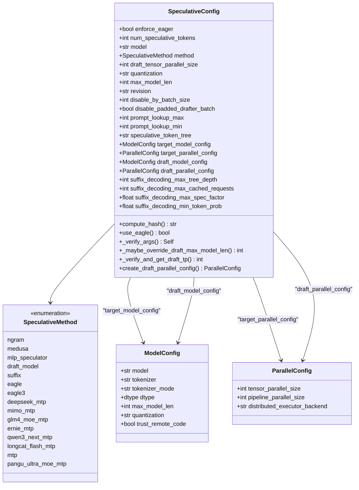
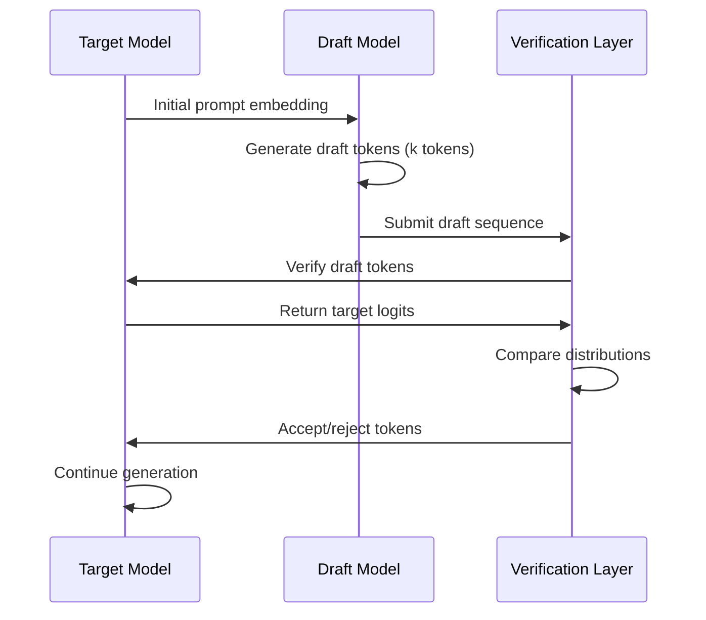
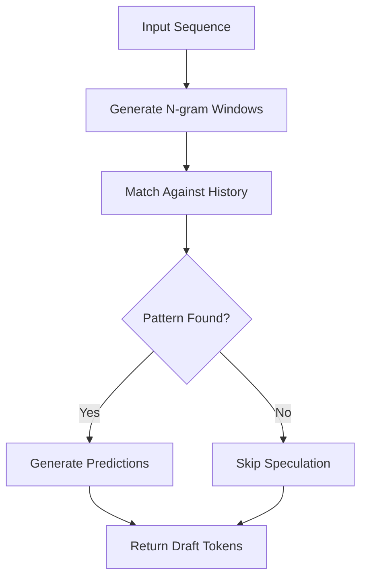
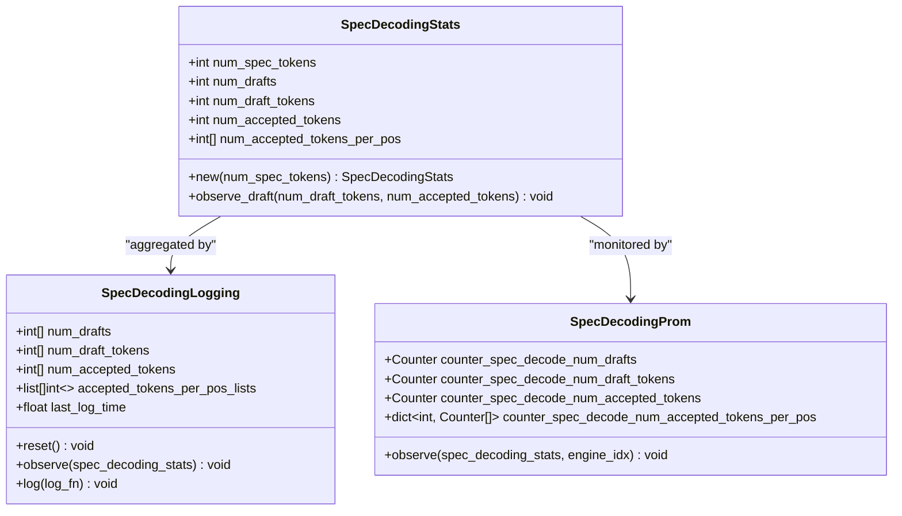
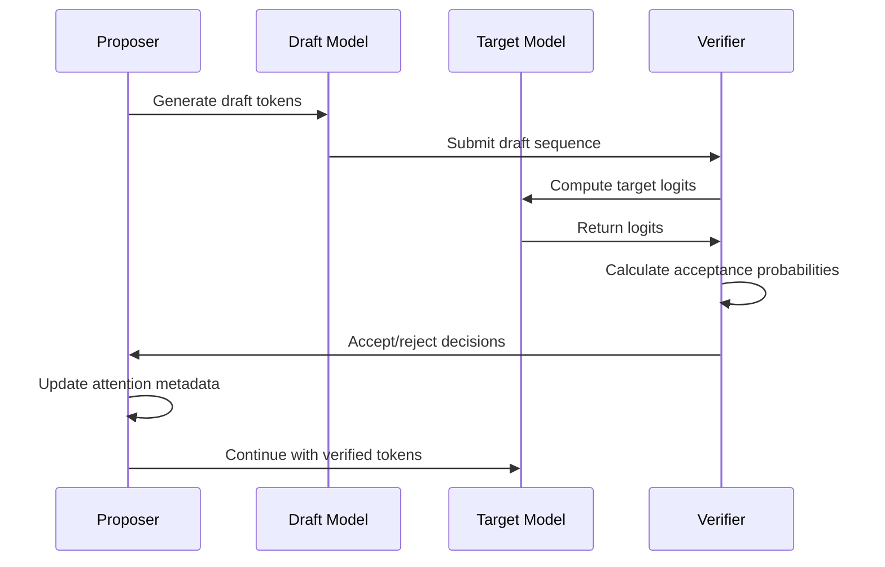
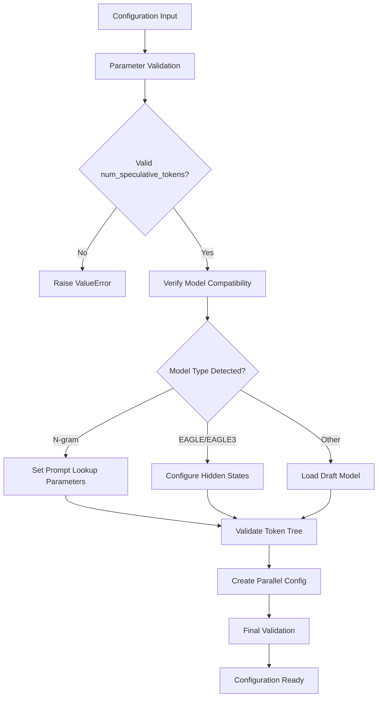
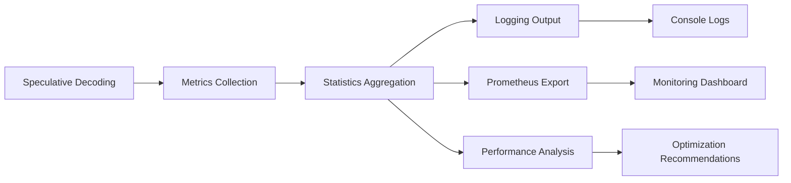
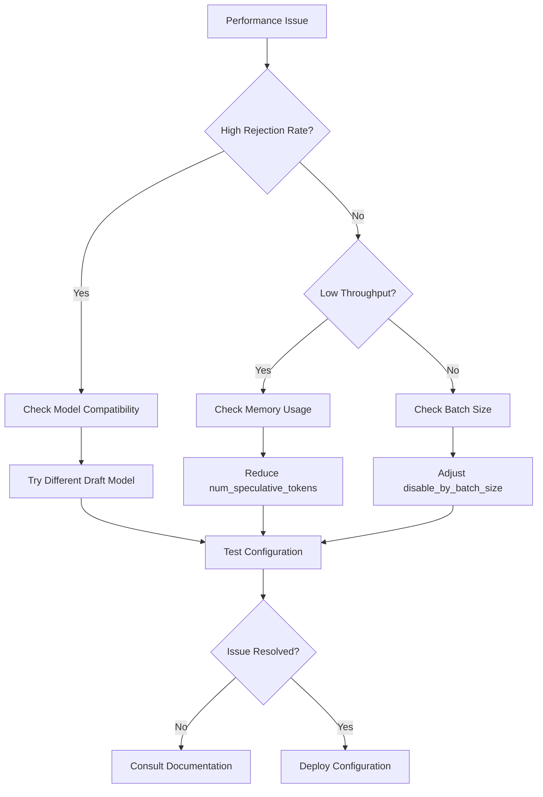

# Speculative Configuration

<cite>
**Referenced Files in This Document**
- [speculative.py](file://vllm/config/speculative.py)
- [spec_decode.py](file://examples/offline_inference/spec_decode.py)
- [eagle.py](file://vllm/v1/spec_decode/eagle.py)
- [ngram_proposer.py](file://vllm/v1/spec_decode/ngram_proposer.py)
- [suffix_decoding.py](file://vllm/v1/spec_decode/suffix_decoding.py)
- [metrics.py](file://vllm/v1/spec_decode/metrics.py)
- [metadata.py](file://vllm/v1/spec_decode/metadata.py)
- [test_eagle.py](file://tests/v1/spec_decode/test_eagle.py)
- [test_spec_decode.py](file://tests/v1\e2e\test_spec_decode.py)
- [__init__.py](file://vllm/config/__init__.py)
</cite>

## Table of Contents
1. [Introduction](#introduction)
2. [Core Configuration Architecture](#core-configuration-architecture)
3. [Key Configuration Parameters](#key-configuration-parameters)
4. [Speculative Methods and Models](#speculative-methods-and-models)
5. [Domain Models and Data Structures](#domain-models-and-data-structures)
6. [Implementation Patterns](#implementation-patterns)
7. [Performance Optimization Guidelines](#performance-optimization-guidelines)
8. [Common Issues and Solutions](#common-issues-and-solutions)
9. [Monitoring and Metrics](#monitoring-and-metrics)
10. [Best Practices](#best-practices)

## Introduction

Speculative decoding in vLLM is a powerful technique that accelerates text generation by using a smaller, faster draft model to predict multiple tokens ahead of the main target model. This configuration system provides fine-grained control over the speculative decoding process, enabling optimal performance across different model architectures and workload patterns.

The speculative configuration system manages the complex interplay between draft models, verification algorithms, and acceptance criteria while maintaining correctness guarantees. It supports multiple speculative methods including EAGLE, Medusa, MLP Speculator, N-gram, and MTP (Multi-Token Prediction) approaches.

## Core Configuration Architecture

The speculative configuration system is built around the `SpeculativeConfig` class, which serves as the central hub for all speculative decoding parameters and validation logic.



**Diagram sources**
- [speculative.py](file://vllm/config/speculative.py#L52-L644)

**Section sources**
- [speculative.py](file://vllm/config/speculative.py#L52-L644)

## Key Configuration Parameters

### Core Speculative Parameters

#### `num_speculative_tokens`
The primary parameter controlling the number of tokens predicted ahead of the main model. This parameter directly impacts both performance gains and memory usage.

- **Type**: `int`
- **Range**: `> 0`
- **Default**: Determined by draft model configuration or required
- **Impact**: Higher values increase throughput but require more memory and computational resources

#### `model`
Specifies the draft model or speculative method to use. This parameter enables automatic method detection when combined with the `method` parameter.

- **Type**: `str | None`
- **Examples**: `"yuhuili/EAGLE-LLaMA3.1-Instruct-8B"`, `"meta-llama/Llama-3.1-8B-Instruct"`
- **Behavior**: When `None`, method is inferred from model name or defaults to draft model

#### `method`
Explicitly specifies the speculative decoding method to use. When provided, it overrides automatic detection.

- **Type**: `SpeculativeMethod | None`
- **Supported Values**: `ngram`, `medusa`, `mlp_speculator`, `draft_model`, `suffix`, `eagle`, `eagle3`, `mtp`

### Advanced Control Parameters

#### `disable_by_batch_size`
Threshold for disabling speculative decoding when batch size exceeds this value.

- **Type**: `int | None`
- **Range**: `>= 2`
- **Purpose**: Prevents speculative decoding from degrading performance in high-load scenarios
- **Default**: `None` (no automatic disabling)

#### `disable_padded_drafter_batch`
Controls whether to disable input padding for speculative decoding batches.

- **Type**: `bool`
- **Default**: `False`
- **Impact**: Affects memory usage and compatibility with attention backends

### Draft Model Configuration

#### `quantization`
Quantization method used for the draft model weights.

- **Type**: `me_quant.QuantizationMethods | None`
- **Options**: `fp8`, `int8`, `int4`, `awq`, `gptq`
- **Purpose**: Reduces memory footprint and improves inference speed

#### `max_model_len`
Maximum sequence length for the draft model.

- **Type**: `int | None`
- **Range**: `>= 1`
- **Purpose**: Controls memory allocation and prevents overflow

#### `revision` and `code_revision`
Version control parameters for draft model loading.

- **Type**: `str | None`
- **Purpose**: Ensures reproducible model loading across environments

**Section sources**
- [speculative.py](file://vllm/config/speculative.py#L60-L100)

## Speculative Methods and Models

### EAGLE and EAGLE3 Methods

EAGLE (Efficiently Accelerated Generative Large-language model Engine) represents one of the most efficient speculative decoding approaches in vLLM.



**Diagram sources**
- [eagle.py](file://vllm/v1/spec_decode/eagle.py#L57-L200)

#### EAGLE Configuration Example
```python
speculative_config = {
    "method": "eagle",
    "model": "yuhuili/EAGLE-LLaMA3.1-Instruct-8B",
    "num_speculative_tokens": 3,
    "max_model_len": 16384
}
```

#### EAGLE3 Enhancements
EAGLE3 extends the original EAGLE method with improved architecture support and enhanced verification mechanisms.

### N-gram Method

N-gram proposer uses sliding window matching to predict subsequent tokens based on historical patterns.



**Diagram sources**
- [ngram_proposer.py](file://vllm/v1/spec_decode/ngram_proposer.py#L132-L200)

#### N-gram Configuration Parameters
- `prompt_lookup_min`: Minimum n-gram size (default: 5)
- `prompt_lookup_max`: Maximum n-gram size (default: 5)

### Suffix Decoding

Suffix decoding employs dynamic tree-based speculation with probabilistic token selection.

#### Suffix Decoding Configuration
```python
speculative_config = {
    "method": "suffix",
    "num_speculative_tokens": 24,  # Default for suffix decoding
    "suffix_decoding_max_tree_depth": 24,
    "suffix_decoding_max_cached_requests": 10000,
    "suffix_decoding_max_spec_factor": 1.0,
    "suffix_decoding_min_token_prob": 0.1
}
```

### MTP (Multi-Token Prediction)

MTP methods leverage specialized architectures designed for predicting multiple tokens simultaneously.

**Section sources**
- [speculative.py](file://vllm/config/speculative.py#L340-L420)
- [eagle.py](file://vllm/v1/spec_decode/eagle.py#L1-L200)
- [ngram_proposer.py](file://vllm/v1/spec_decode/ngram_proposer.py#L1-L200)

## Domain Models and Data Structures

### SpecDecodingStats

The `SpecDecodingStats` class captures comprehensive performance metrics for speculative decoding operations.



**Diagram sources**
- [metrics.py](file://vllm/v1/spec_decode/metrics.py#L16-L226)

### SpecDecodeMetadata

The metadata structure coordinates the speculative decoding process between draft and target models.

#### Key Metadata Fields
- `draft_token_ids`: Tensor containing proposed draft tokens
- `num_draft_tokens`: List of draft token counts per request
- `cu_num_draft_tokens`: Cumulative draft token positions
- `target_logits_indices`: Indices for target model logits computation
- `bonus_logits_indices`: Indices for bonus token logits

### Verification Sequences

The verification process follows a sophisticated pattern to ensure correctness while maximizing performance:



**Diagram sources**
- [eagle.py](file://vllm/v1/spec_decode\eagle.py#L847-L895)

**Section sources**
- [metrics.py](file://vllm/v1/spec_decode/metrics.py#L16-L226)
- [metadata.py](file://vllm/v1/spec_decode/metadata.py#L1-L44)

## Implementation Patterns

### Configuration Validation Pipeline

The speculative configuration system implements a comprehensive validation pipeline that ensures parameter consistency and model compatibility.



**Diagram sources**
- [speculative.py](file://vllm/config/speculative.py#L593-L634)

### Invocation Relationship Pattern

The speculative configuration orchestrates multiple components through a well-defined invocation pattern:

1. **Initialization Phase**: Configuration validation and model loading
2. **Proposal Phase**: Draft token generation using selected method
3. **Verification Phase**: Target model validation of draft tokens
4. **Integration Phase**: Updated attention metadata and token acceptance

### Memory Management Patterns

Speculative decoding requires careful memory management to balance performance and resource utilization:

#### Buffer Management
- Persistent buffers for CUDA graphs
- Dynamic allocation for varying batch sizes
- Efficient tensor operations for token manipulation

#### Parallel Processing
- Tensor parallelism coordination
- Pipeline parallelism handling
- Distributed execution support

**Section sources**
- [speculative.py](file://vllm/config/speculative.py#L235-L461)
- [eagle.py](file://vllm/v1/spec_decode\eagle.py#L57-L200)

## Performance Optimization Guidelines

### Draft Model Size Selection

Choosing the appropriate draft model size is crucial for optimal performance:

#### Small Draft Models (< 1B Parameters)
- **Advantages**: Lower memory usage, faster inference
- **Use Cases**: Resource-constrained environments, real-time applications
- **Configuration**: `num_speculative_tokens = 2-3`

#### Medium Draft Models (1B-7B Parameters)
- **Advantages**: Balanced performance and accuracy
- **Use Cases**: General-purpose deployments
- **Configuration**: `num_speculative_tokens = 3-5`

#### Large Draft Models (> 7B Parameters)
- **Advantages**: Higher accuracy, better token prediction
- **Use Cases**: High-quality generation requirements
- **Configuration**: `num_speculative_tokens = 5-8`

### Target Workload Optimization

Different workload patterns benefit from specific configuration adjustments:

#### High-Throughput Workloads
```python
speculative_config = {
    "method": "eagle",
    "num_speculative_tokens": 5,
    "disable_by_batch_size": 16,
    "disable_padded_drafter_batch": True
}
```

#### Low-Latency Workloads
```python
speculative_config = {
    "method": "ngram",
    "num_speculative_tokens": 2,
    "prompt_lookup_min": 3,
    "prompt_lookup_max": 3
}
```

#### Balanced Workloads
```python
speculative_config = {
    "method": "suffix",
    "num_speculative_tokens": 24,
    "suffix_decoding_max_spec_factor": 0.5,
    "suffix_decoding_min_token_prob": 0.2
}
```

### Performance Tuning Parameters

#### speculative_max_model_len Impact
The `max_model_len` parameter significantly affects performance gains:

- **Lower Values**: Reduced memory usage, potentially higher acceptance rates
- **Higher Values**: Better coverage, increased memory requirements
- **Optimal Range**: 1.5-2x target model maximum length

#### Batch Size Considerations
- **Small Batches (< 8)**: Enable speculative decoding for maximum benefit
- **Medium Batches (8-32)**: Moderate speculative decoding with monitoring
- **Large Batches (> 32)**: Consider disabling to prevent contention

**Section sources**
- [speculative.py](file://vllm/config/speculative.py#L500-L537)

## Common Issues and Solutions

### Draft Model Incompatibility

#### Issue: Model Architecture Mismatch
**Symptoms**: Runtime errors during draft model loading
**Solution**: Ensure draft model architecture compatibility with target model

```python
# Check model compatibility
if speculative_config.method == "eagle":
    if speculative_config.target_model_config.hf_text_config.model_type not in ["llama", "qwen"]:
        raise ValueError("EAGLE only supports LLaMA and Qwen models")
```

#### Issue: Quantization Mismatch
**Symptoms**: Performance degradation or incorrect predictions
**Solution**: Match quantization settings between draft and target models

```python
# Automatic quantization alignment
if not speculative_config.quantization:
    speculative_config.quantization = speculative_config.target_model_config.quantization
```

### Reduced Acceptance Rates

#### Issue: Low Token Acceptance
**Symptoms**: High rejection rates, poor performance gains
**Causes and Solutions**:

1. **Model Mismatch**: Use compatible draft models
   ```python
   # Use proven draft-target pairs
   if target_model == "Llama-3.1-8B":
       draft_model = "yuhuili/EAGLE-LLaMA3.1-Instruct-8B"
   ```

2. **Token Tree Configuration**: Optimize speculative token tree
   ```python
   # Chain-like tree for sequential generation
   speculative_token_tree = str([(i + 1) * (0,) for i in range(k)])
   ```

3. **Batch Size Issues**: Adjust batch size thresholds
   ```python
   # Disable speculation for large batches
   disable_by_batch_size = min(16, max_batch_size // 2)
   ```

#### Issue: Memory Pressure
**Symptoms**: Out-of-memory errors, degraded performance
**Solutions**:

1. **Reduce num_speculative_tokens**: Lower speculative token count
2. **Enable disable_padded_drafter_batch**: Allow variable-length batches
3. **Adjust max_model_len**: Reduce draft model sequence length

### Performance Degradation

#### Issue: Overhead from Speculative Decoding
**Symptoms**: Slower generation than baseline
**Root Causes**:

1. **High Rejection Rate**: Poor draft model quality
2. **Memory Contention**: Insufficient GPU memory
3. **Network Latency**: Distributed speculative decoding

**Solutions**:

```python
# Monitor and adjust based on metrics
if acceptance_rate < 0.7:
    # Reduce speculative tokens
    num_speculative_tokens = max(1, num_speculative_tokens - 1)
elif memory_usage > 0.9:
    # Reduce batch size or tokens
    disable_by_batch_size = max(2, disable_by_batch_size - 1)
```

**Section sources**
- [speculative.py](file://vllm/config/speculative.py#L613-L634)
- [test_eagle.py](file://tests/v1/spec_decode/test_eagle.py#L1-L200)

## Monitoring and Metrics

### Key Performance Indicators

The speculative decoding system provides comprehensive metrics for monitoring and optimization:

#### Acceptance Metrics
- **Mean Acceptance Length**: Average number of accepted speculative tokens per request
- **Acceptance Rate**: Percentage of speculative tokens that are accepted
- **Position-wise Acceptance**: Distribution of acceptance across token positions

#### Throughput Metrics
- **Draft Throughput**: Tokens generated by draft model per second
- **Accepted Throughput**: Tokens accepted by target model per second
- **Overall Throughput**: Effective tokens generated per second

#### Memory Metrics
- **Memory Utilization**: GPU memory usage during speculative decoding
- **Cache Efficiency**: Effectiveness of speculative caches

### Metrics Collection and Analysis



**Diagram sources**
- [metrics.py](file://vllm/v1/spec_decode/metrics.py#L47-L226)

### Prometheus Integration

The system exports metrics in Prometheus-compatible format for production monitoring:

#### Available Metrics
- `vllm:spec_decode_num_drafts`: Total number of speculative drafts
- `vllm:spec_decode_num_draft_tokens`: Total draft tokens generated
- `vllm:spec_decode_num_accepted_tokens`: Total accepted tokens
- `vllm:spec_decode_num_accepted_tokens_per_pos`: Position-wise acceptance rates

#### Query Examples
```promql
# Calculate acceptance rate
rate(vllm:spec_decode_num_accepted_tokens_total[$interval]) /
rate(vllm:spec_decode_num_draft_tokens_total[$interval])

# Mean acceptance length
1 + (
rate(vllm:spec_decode_num_accepted_tokens_total[$interval]) /
rate(vllm:spec_decode_num_drafts[$interval])
)
```

**Section sources**
- [metrics.py](file://vllm/v1/spec_decode/metrics.py#L120-L226)

## Best Practices

### Configuration Best Practices

#### Production Deployment
1. **Start Conservative**: Begin with low `num_speculative_tokens` and increase gradually
2. **Monitor Metrics**: Track acceptance rates and throughput continuously
3. **Batch Size Tuning**: Adjust `disable_by_batch_size` based on observed patterns
4. **Memory Management**: Monitor GPU memory usage and adjust accordingly

#### Development and Testing
1. **Use Reference Models**: Compare against baseline models for validation
2. **Metric Tracking**: Implement comprehensive logging for performance analysis
3. **A/B Testing**: Compare different configurations systematically
4. **Load Testing**: Validate under realistic workload conditions

### Model Selection Guidelines

#### Draft Model Compatibility
- **Architecture Matching**: Ensure draft model architecture aligns with target model
- **Size Ratios**: Use draft models that are 10-50% the size of target models
- **Quality Trade-offs**: Balance draft model quality with computational efficiency

#### Method Selection
- **EAGLE**: Best for general-purpose applications, good balance of speed and accuracy
- **N-gram**: Suitable for repetitive text generation, low computational overhead
- **Suffix Decoding**: Optimal for dynamic content generation, adaptive token prediction
- **MTP**: Specialized for multi-token prediction scenarios

### Performance Optimization Strategies

#### Memory Optimization
1. **Dynamic Allocation**: Use variable-length batches when possible
2. **Gradient Checkpointing**: Enable for memory-intensive configurations
3. **Mixed Precision**: Leverage FP16/BF16 for draft model inference

#### Computational Optimization
1. **CUDA Graphs**: Enable for consistent batch sizes and shapes
2. **Tensor Parallelism**: Distribute draft model across multiple GPUs
3. **Pipeline Parallelism**: Overlap draft and target model computations

#### Network Optimization
1. **Local Models**: Deploy draft models locally to reduce latency
2. **Model Caching**: Cache frequently used models in memory
3. **Connection Pooling**: Reuse network connections for model loading

### Troubleshooting Workflow



**Section sources**
- [spec_decode.py](file://examples/offline_inference/spec_decode.py#L1-L235)
- [test_spec_decode.py](file://tests/v1\e2e\test_spec_decode.py#L489-L531)