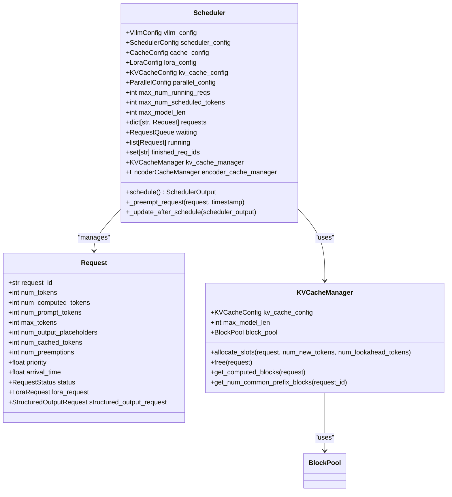
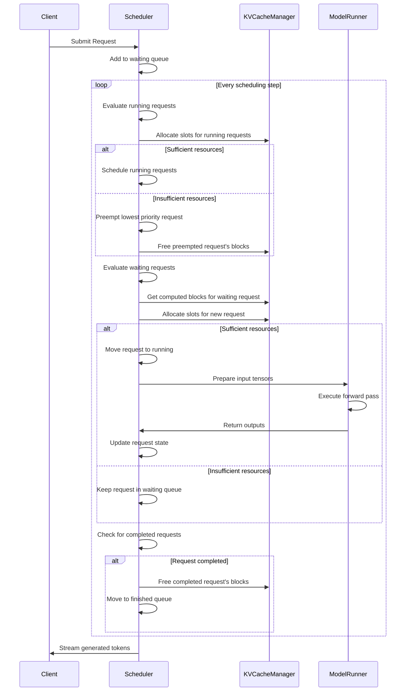
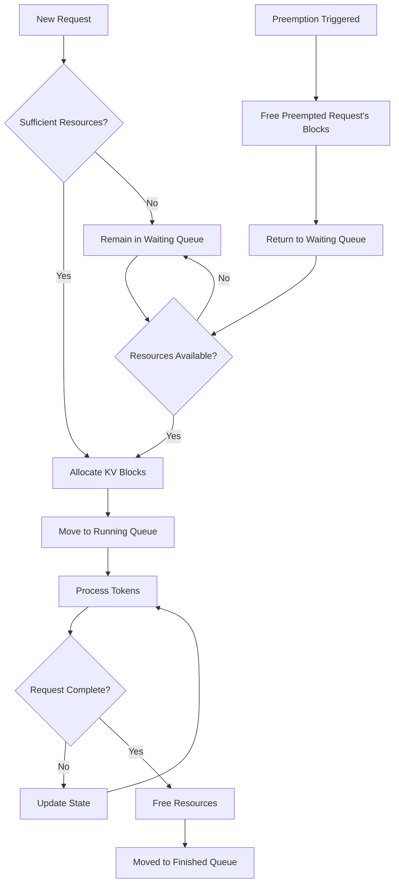
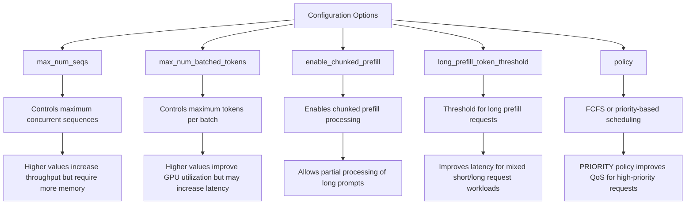
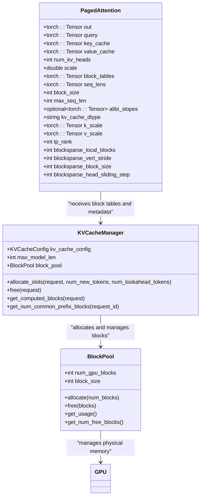
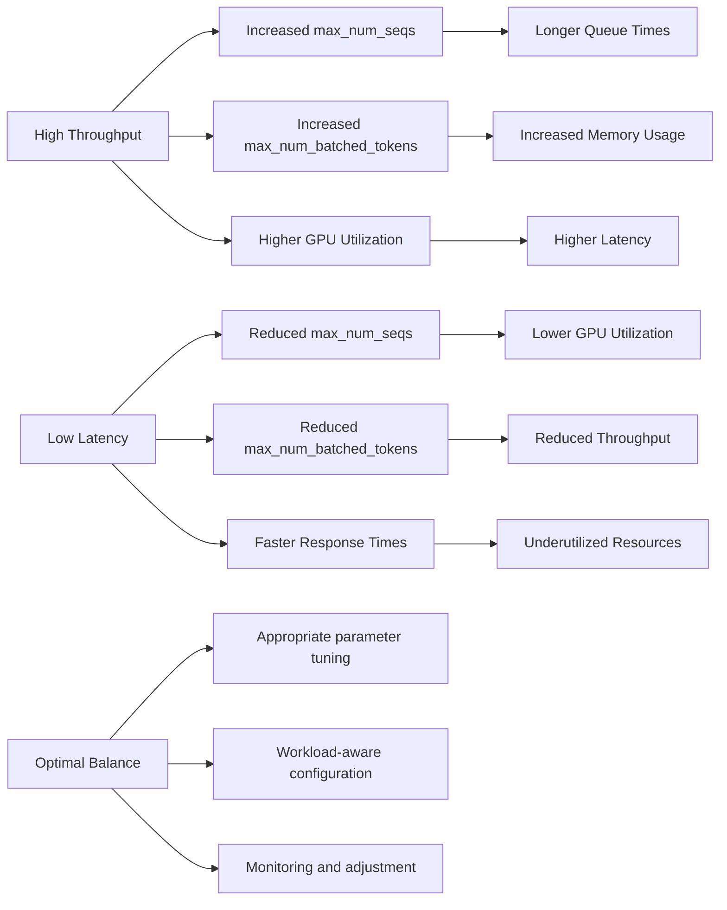

# Continuous Batching

<cite>
**Referenced Files in This Document**   
- [scheduler.py](file://vllm/v1/core/sched/scheduler.py)
- [kv_cache_manager.py](file://vllm/v1/core/kv_cache_manager.py)
- [scheduler.py](file://vllm/config/scheduler.py)
- [paged_attention_v2.cu](file://csrc/attention/paged_attention_v2.cu)
- [ops.h](file://csrc/ops.h)
</cite>

## Table of Contents
1. [Introduction](#introduction)
2. [Continuous Batching Overview](#continuous-batching-overview)
3. [Scheduler Architecture](#scheduler-architecture)
4. [Sequence Management System](#sequence-management-system)
5. [Batch Evolution and Request Lifecycle](#batch-evolution-and-request-lifecycle)
6. [Configuration Options](#configuration-options)
7. [Integration with PagedAttention](#integration-with-pagedattention)
8. [Performance Trade-offs](#performance-trade-offs)
9. [Throughput Improvements](#throughput-improvements)
10. [Conclusion](#conclusion)

## Introduction
Continuous batching is a sophisticated request scheduling system in vLLM that enables dynamic addition of new requests to ongoing batches, maximizing GPU utilization by maintaining high occupancy. Unlike traditional static batching approaches, continuous batching allows the system to adaptively manage incoming requests while processing existing ones, significantly improving throughput without compromising latency requirements. This document provides a comprehensive analysis of vLLM's dynamic request scheduling system, focusing on how continuous batching works, its integration with PagedAttention, and the various configuration options that affect performance.

## Continuous Batching Overview
Continuous batching in vLLM represents a paradigm shift from traditional static batching methods by allowing new requests to be seamlessly integrated into active processing batches. This approach eliminates the inefficiencies associated with waiting for batch completion before accepting new requests, thereby maintaining optimal GPU utilization. The system achieves this through a sophisticated scheduler that dynamically manages request lifecycles, prioritization, preemption, and resource allocation.

The core principle behind continuous batching is to treat the batch as a fluid entity rather than a fixed collection of requests. As requests complete their processing, their allocated resources are immediately reclaimed and made available for new incoming requests. This creates a continuous flow of computation where the GPU remains highly occupied, minimizing idle periods that typically occur in static batching systems.

The scheduler plays a pivotal role in this process by continuously evaluating the state of all active requests and making real-time decisions about which requests to include in the current processing cycle. It considers multiple factors including request priority, resource requirements, and completion status to optimize the composition of each batch. This dynamic decision-making process ensures that the system can adapt to varying workloads and maintain high throughput across different usage scenarios.

**Section sources**
- [scheduler.py](file://vllm/v1/core/sched/scheduler.py#L56-L1725)

## Scheduler Architecture
The scheduler in vLLM's continuous batching system is designed as a sophisticated state machine that manages the entire lifecycle of requests from arrival to completion. At its core, the scheduler maintains three primary queues: waiting, running, and finished requests. The architecture is built around the `Scheduler` class, which implements the `SchedulerInterface` and coordinates the complex interactions between these queues.

The scheduling algorithm operates in discrete steps, with each step involving the evaluation and potential reorganization of the current batch. The process begins by examining the running requests to determine which ones can continue processing in the current step. For each running request, the scheduler calculates the number of new tokens that can be processed based on the remaining token budget and the request's current state.

**Diagram sources **
- [scheduler.py](file://vllm/v1/core/sched/scheduler.py#L56-L1725)
- [kv_cache_manager.py](file://vllm/v1/core/kv_cache_manager.py#L94-L412)

The scheduler's decision-making process is governed by several key constraints defined in the `SchedulerConfig`. These include `max_num_seqs`, which limits the maximum number of sequences that can be processed simultaneously, and `max_num_batched_tokens`, which constrains the total number of tokens that can be scheduled in a single iteration. These parameters work together to balance throughput and memory usage, ensuring that the system remains stable under varying loads.

When processing running requests, the scheduler employs a preemption mechanism to handle cases where resource constraints prevent all requests from being scheduled. If a request cannot be accommodated due to insufficient token budget or block availability, the scheduler may preempt lower-priority requests to make room for higher-priority ones. This preemption is implemented through the `_preempt_request` method, which removes a request from the running queue, frees its allocated resources, and returns it to the waiting queue for potential rescheduling.

The scheduler also incorporates sophisticated handling of speculative decoding through the `use_eagle` flag and `num_lookahead_tokens` parameter. When speculative decoding is enabled, the scheduler must account for potential draft tokens that may be rejected, adjusting the scheduling decisions accordingly to maintain efficiency.

**Section sources**
- [scheduler.py](file://vllm/v1/core/sched/scheduler.py#L56-L1725)

## Sequence Management System
The sequence management system in vLLM's continuous batching architecture is responsible for tracking the processing state of each request throughout its lifecycle. This system maintains detailed information about prompt processing and token generation phases, enabling the scheduler to make informed decisions about resource allocation and request prioritization.

At the heart of the sequence management system is the `Request` class, which encapsulates all the state information for an individual request. Key attributes include `num_tokens`, which represents the total number of tokens in the request (including both prompt and generated tokens), and `num_computed_tokens`, which tracks how many tokens have been processed so far. The difference between these values indicates the number of tokens remaining to be processed.

The system distinguishes between different phases of request processing through the `num_prompt_tokens` attribute, which specifically tracks the length of the initial prompt. This distinction is crucial for proper scheduling, as prompt processing typically requires different computational patterns than token generation. The scheduler uses this information to optimize the allocation of resources and manage the transition between prefill and decode phases.

**Diagram sources **
- [scheduler.py](file://vllm/v1/core/sched/scheduler.py#L56-L1725)
- [kv_cache_manager.py](file://vllm/v1/core/kv_cache_manager.py#L94-L412)

The sequence management system also handles the complex state transitions that occur during request processing. When a request is first submitted, it enters the waiting queue with `num_computed_tokens` set to zero. As the scheduler processes the request, this value is incrementally updated to reflect the progress made. The system carefully tracks the number of cached tokens through the `num_cached_tokens` attribute, which helps optimize prefix caching and reduce redundant computation.

For requests that require preemption and resumption, the sequence management system maintains sufficient state information to allow seamless continuation of processing. When a preempted request is rescheduled, the system can quickly restore its context and continue from where it left off, minimizing the overhead associated with context switching.

The system also incorporates sophisticated handling of output placeholders through the `num_output_placeholders` attribute. This feature is particularly important for speculative decoding scenarios, where the system may generate draft tokens that could potentially be rejected. By accounting for these placeholders in the scheduling decisions, the system can maintain high throughput while ensuring correctness.

**Section sources**
- [scheduler.py](file://vllm/v1/core/sched/scheduler.py#L56-L1725)

## Batch Evolution and Request Lifecycle
The evolution of batches in vLLM's continuous batching system follows a dynamic pattern that maximizes GPU utilization while maintaining responsiveness to new requests. Unlike static batching systems where batches are fixed at creation time, continuous batching allows for fluid composition changes as requests complete and new ones are added.

The request lifecycle begins when a new request is submitted to the system. Initially, the request is placed in the waiting queue, where it remains until sufficient resources become available for processing. The scheduler evaluates waiting requests during each scheduling step, considering factors such as priority, resource requirements, and current system load.

**Diagram sources **
- [scheduler.py](file://vllm/v1/core/sched/scheduler.py#L56-L1725)

As the batch evolves over time, completed requests are removed from the running queue, freeing their allocated KV cache blocks and other resources. These freed resources are immediately made available for new incoming requests, creating a continuous flow of computation. The scheduler uses the `kv_cache_manager` to efficiently manage the allocation and deallocation of KV cache blocks, ensuring that memory is optimally utilized.

The system handles request preemption through a sophisticated mechanism that balances priority and fairness. When resource constraints prevent all requests from being scheduled, the scheduler may preempt lower-priority requests to accommodate higher-priority ones. Preempted requests are returned to the waiting queue with their state preserved, allowing them to be rescheduled when resources become available. This approach ensures that high-priority requests receive timely processing while still providing eventual service to lower-priority ones.

The batch evolution process is further optimized through the use of prefix caching. When requests share common prefixes, the system can reuse previously computed KV cache blocks, reducing redundant computation and improving efficiency. The `get_num_common_prefix_blocks` method in the `KVCacheManager` identifies shared prefixes among running requests, enabling the scheduler to make informed decisions about resource allocation.

Throughout the batch evolution process, the scheduler maintains detailed statistics about resource utilization, request completion rates, and other performance metrics. These statistics are used to inform scheduling decisions and provide insights into system behavior, helping to identify potential bottlenecks and optimization opportunities.

**Section sources**
- [scheduler.py](file://vllm/v1/core/sched/scheduler.py#L56-L1725)
- [kv_cache_manager.py](file://vllm/v1/core/kv_cache_manager.py#L94-L412)

## Configuration Options
vLLM's continuous batching system provides several configuration options that allow fine-tuning of performance characteristics to match specific use cases and hardware constraints. These options are primarily defined in the `SchedulerConfig` class and can significantly impact both throughput and latency.

The most critical configuration parameters are `max_num_seqs` and `max_num_batched_tokens`. The `max_num_seqs` parameter limits the maximum number of sequences that can be processed simultaneously, directly affecting the degree of parallelism and memory usage. A higher value allows more requests to be processed concurrently, potentially increasing throughput but also increasing memory consumption. The `max_num_batched_tokens` parameter constrains the total number of tokens that can be scheduled in a single iteration, balancing computational load and memory requirements.

**Diagram sources **
- [scheduler.py](file://vllm/config/scheduler.py#L26-L298)

The `enable_chunked_prefill` option enables chunked prefill processing, which allows long prompts to be processed in smaller segments. This can significantly improve latency for mixed workloads containing both short and long requests, as shorter requests don't have to wait for long prompts to complete processing. When combined with the `long_prefill_token_threshold` parameter, the system can prioritize shorter requests while still making progress on longer ones.

The scheduling `policy` parameter determines how requests are prioritized in the queue. The default "fcfs" (first-come, first-served) policy ensures fairness and predictable behavior, while the "priority" policy allows requests to be processed based on assigned priority values. The priority policy can improve quality of service for critical requests but may lead to starvation of lower-priority ones if not carefully managed.

Additional configuration options include `max_num_partial_prefills` and `max_long_partial_prefills`, which control the concurrent processing of partial prefill requests. These parameters allow fine-tuning of the system's behavior when handling mixed workloads with varying prompt lengths, balancing throughput and latency requirements.

The configuration system also includes validation mechanisms to ensure that parameter values are reasonable and compatible with each other. For example, the `verify_max_model_len` method checks that `max_num_batched_tokens` is not smaller than `max_model_len` when chunked prefill is disabled, preventing configurations that would effectively limit sequence length.

**Section sources**
- [scheduler.py](file://vllm/config/scheduler.py#L26-L298)

## Integration with PagedAttention
The integration between continuous batching and PagedAttention represents a key innovation in vLLM's architecture, enabling efficient memory management and high throughput for large language model inference. PagedAttention extends the traditional attention mechanism by organizing KV cache blocks in a manner analogous to virtual memory paging, allowing for non-contiguous memory allocation and efficient block reuse.

The core of this integration lies in the `KVCacheManager` class, which manages the allocation and organization of KV cache blocks across multiple requests. Instead of requiring contiguous memory for each request's KV cache, PagedAttention allows blocks to be scattered throughout memory and linked through block tables. This approach eliminates the memory fragmentation problems that plague traditional attention implementations and enables more efficient memory utilization.

**Diagram sources **
- [paged_attention_v2.cu](file://csrc/attention/paged_attention_v2.cu#L52-L80)
- [kv_cache_manager.py](file://vllm/v1/core/kv_cache_manager.py#L94-L412)
- [ops.h](file://csrc/ops.h#L32-L42)

The integration works by having the scheduler coordinate with the `KVCacheManager` to allocate appropriate blocks for each request. When a request is scheduled, the `allocate_slots` method is called to reserve the necessary KV cache blocks. The `KVCacheManager` then returns a `KVCacheBlocks` object containing the allocated blocks, which is used to construct the block tables passed to the PagedAttention kernel.

This integration provides several key benefits. First, it enables efficient memory sharing between requests with common prefixes, as identical blocks can be reused across multiple requests. Second, it allows for flexible block allocation that adapts to the varying lengths of different requests, eliminating the need for padding to fixed sizes. Third, it facilitates efficient preemption and resumption, as blocks can be quickly freed and reallocated without requiring memory compaction.

The PagedAttention implementation in vLLM is optimized for GPU execution, with specialized CUDA kernels that efficiently handle the scattered memory access patterns inherent in the paging approach. The `paged_attention_v2` kernel, defined in `paged_attention_v2.cu`, implements the core attention computation using the block tables and sequence length information provided by the scheduler and `KVCacheManager`.

This tight integration between continuous batching and PagedAttention creates a synergistic effect where each component enhances the effectiveness of the other. Continuous batching maximizes GPU utilization by maintaining high occupancy, while PagedAttention ensures that this high occupancy can be sustained without running into memory limitations or fragmentation issues.

**Section sources**
- [paged_attention_v2.cu](file://csrc/attention/paged_attention_v2.cu#L52-L80)
- [kv_cache_manager.py](file://vllm/v1/core/kv_cache_manager.py#L94-L412)
- [ops.h](file://csrc/ops.h#L32-L42)

## Performance Trade-offs
The continuous batching system in vLLM involves several important trade-offs between latency, throughput, and resource utilization that must be carefully balanced to achieve optimal performance. Understanding these trade-offs is crucial for configuring the system to meet specific application requirements.

The primary trade-off exists between throughput and latency. Higher throughput can be achieved by increasing parameters like `max_num_seqs` and `max_num_batched_tokens`, allowing more requests to be processed simultaneously. However, this comes at the cost of increased latency for individual requests, as they may have to wait longer in the queue before being scheduled. Conversely, optimizing for low latency by reducing these parameters may result in underutilization of GPU resources and lower overall throughput.

**Diagram sources **
- [scheduler.py](file://vllm/config/scheduler.py#L26-L298)
- [scheduler.py](file://vllm/v1/core/sched/scheduler.py#L56-L1725)

Another important trade-off involves memory usage and computational efficiency. The PagedAttention mechanism reduces memory fragmentation and enables more efficient memory utilization, but it introduces additional computational overhead due to the indirection required to access non-contiguous memory blocks. This overhead is generally outweighed by the benefits of improved memory utilization, but it can become significant in certain scenarios.

The choice of scheduling policy also represents a key trade-off. The default FCFS (first-come, first-served) policy ensures fairness and predictable behavior, but may not be optimal for workloads with varying request priorities. The priority-based scheduling policy can improve quality of service for critical requests, but risks starving lower-priority requests if not carefully managed.

The use of chunked prefill processing introduces another dimension to the trade-off space. While it can significantly improve latency for mixed workloads by allowing shorter requests to jump ahead of longer ones, it may reduce overall throughput due to the overhead of processing requests in smaller chunks. The `long_prefill_token_threshold` parameter allows fine-tuning of this trade-off, balancing the benefits of improved latency against the costs of reduced throughput.

Finally, the system must balance the benefits of prefix caching against the memory overhead of storing cached blocks. While prefix caching can dramatically reduce computation for requests with common prefixes, it requires additional memory to store the cached blocks. The effectiveness of prefix caching depends on the degree of similarity among incoming requests, making it more beneficial for certain workloads than others.

**Section sources**
- [scheduler.py](file://vllm/config/scheduler.py#L26-L298)
- [scheduler.py](file://vllm/v1/core/sched/scheduler.py#L56-L1725)

## Throughput Improvements
Continuous batching in vLLM delivers significant throughput improvements compared to traditional static batching approaches by maintaining high GPU utilization and minimizing idle periods. The key to these improvements lies in the system's ability to dynamically adapt to changing workloads and efficiently manage resources.

One of the primary mechanisms for throughput improvement is the elimination of batch boundary delays. In static batching systems, the GPU must wait for all requests in a batch to complete before starting a new batch, creating periods of idle time. Continuous batching eliminates these delays by allowing new requests to be added to the batch as soon as resources become available from completed requests. This creates a continuous flow of computation that keeps the GPU highly occupied.

The system achieves additional throughput improvements through sophisticated resource management and optimization techniques. The PagedAttention mechanism reduces memory fragmentation and enables more efficient memory utilization, allowing more requests to be processed simultaneously within the same memory footprint. This increased memory efficiency directly translates to higher throughput, as more requests can be accommodated in each batch.

Practical examples demonstrate the magnitude of these throughput improvements. In workloads with mixed request lengths, continuous batching can achieve 2-3x higher throughput compared to static batching by allowing shorter requests to be processed while longer ones are still being handled. For workloads with high request arrival rates, the system can maintain throughput levels close to the theoretical maximum by minimizing idle time and efficiently utilizing available resources.

The integration of prefix caching provides another significant throughput boost for workloads with repetitive patterns or common prefixes. By reusing previously computed KV cache blocks, the system can process subsequent requests with minimal additional computation, dramatically increasing the number of requests that can be handled per unit time.

These throughput improvements are not achieved at the expense of latency. In fact, continuous batching can improve latency for many request types by reducing queue times and enabling more responsive processing. The system's ability to dynamically adjust to workload characteristics ensures that both throughput and latency requirements can be met simultaneously, providing a superior overall performance profile compared to traditional batching approaches.

**Section sources**
- [scheduler.py](file://vllm/v1/core/sched/scheduler.py#L56-L1725)
- [kv_cache_manager.py](file://vllm/v1/core/kv_cache_manager.py#L94-L412)

## Conclusion
vLLM's continuous batching system represents a significant advancement in large language model inference efficiency, combining dynamic request scheduling with sophisticated memory management to achieve high throughput and low latency. The system's ability to add new requests to ongoing batches maximizes GPU utilization by maintaining high occupancy, eliminating the idle periods that plague traditional static batching approaches.

The scheduler architecture provides a robust foundation for managing complex request lifecycles, with sophisticated mechanisms for prioritization, preemption, and resource allocation. The integration with PagedAttention enables efficient memory management through non-contiguous block allocation and reuse, further enhancing the system's performance capabilities.

Key configuration options like `max_num_seqs` and `max_num_batched_tokens` allow fine-tuning of performance characteristics to match specific use cases, while features like chunked prefill processing and prefix caching provide additional optimization opportunities. The system successfully navigates the trade-offs between throughput, latency, and resource utilization, delivering superior performance across a wide range of workloads.

The practical throughput improvements demonstrated by continuous batching make it an essential component for high-performance LLM serving, particularly in scenarios with mixed request lengths or high arrival rates. By maintaining a continuous flow of computation and efficiently managing resources, vLLM's continuous batching system sets a new standard for efficient and scalable LLM inference.