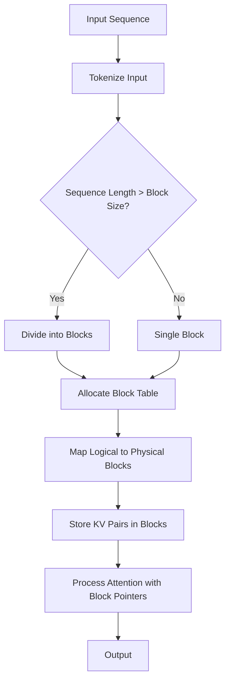
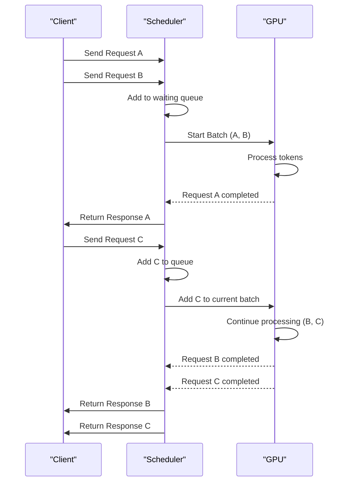
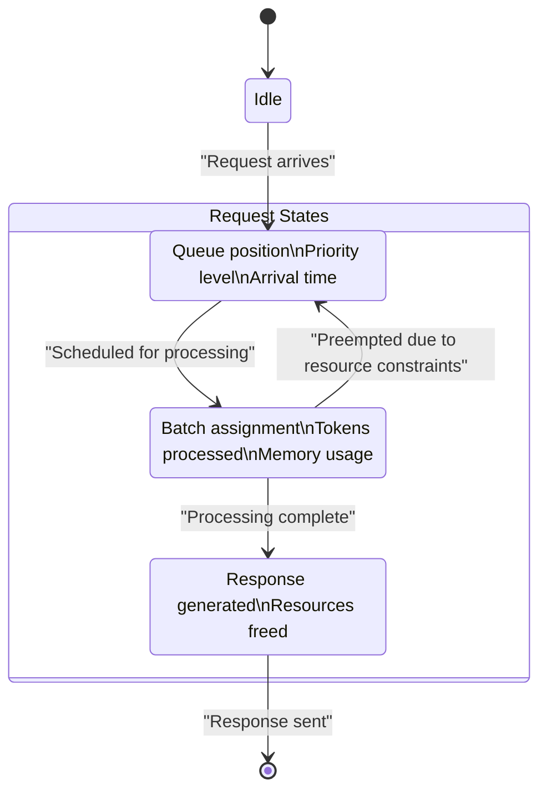
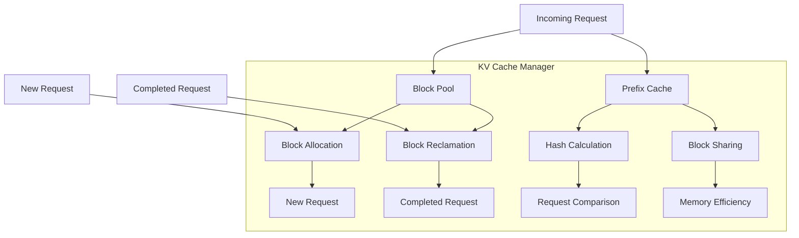
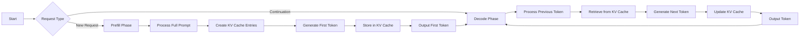
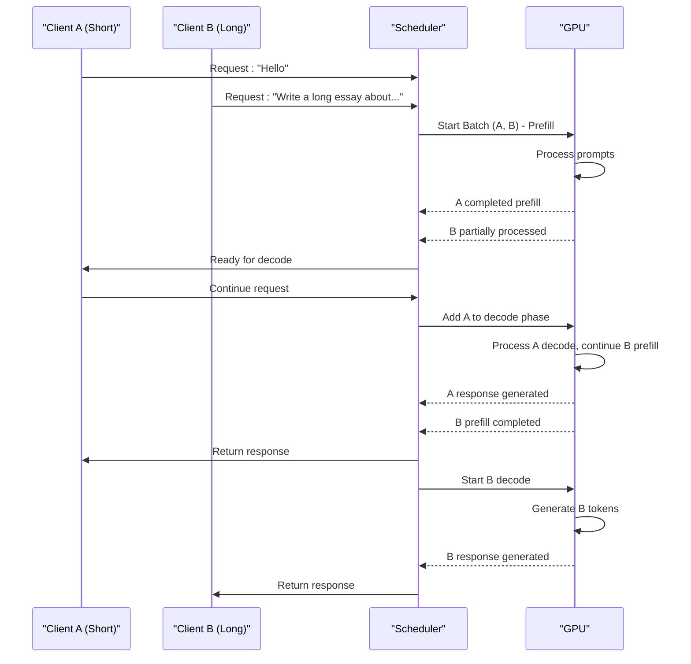

# Core Concepts

<cite>
**Referenced Files in This Document**   
- [paged_attn.py](file://vllm/attention/ops/paged_attn.py)
- [scheduler.py](file://vllm/v1/core/sched/scheduler.py)
- [kv_cache_manager.py](file://vllm/v1/core/kv_cache_manager.py)
- [cache.py](file://vllm/config/cache.py)
- [csrc/attention/paged_attention_v2.cu](file://csrc/attention/paged_attention_v2.cu)
- [csrc/attention/paged_attention_v1.cu](file://csrc/attention/paged_attention_v1.cu)
- [vllm/v1/core/sched/request_queue.py](file://vllm/v1/core/sched/request_queue.py)
- [vllm/v1/core/kv_cache_utils.py](file://vllm/v1/core/kv_cache_utils.py)
- [vllm/benchmarks/serve.py](file://vllm/benchmarks/serve.py)
- [vllm/v1/metrics/stats.py](file://vllm/v1/metrics/stats.py)
</cite>

## Table of Contents
1. [Introduction](#introduction)
2. [PagedAttention Memory Management](#pagedattention-memory-management)
3. [Continuous Batching](#continuous-batching)
4. [Request Scheduling System](#request-scheduling-system)
5. [KV Cache Management Strategies](#kv-cache-management-strategies)
6. [Token Generation Process](#token-generation-process)
7. [Practical Examples and Interactions](#practical-examples-and-interactions)
8. [Common Issues and Solutions](#common-issues-and-solutions)

## Introduction
vLLM is a high-throughput and memory-efficient inference engine for large language models that implements several innovative architectural components to optimize performance. This document explores the core concepts that enable vLLM to efficiently handle long sequences, maximize GPU utilization, and manage complex inference workloads. The key innovations include PagedAttention for efficient KV cache management, continuous batching for dynamic request processing, sophisticated request scheduling, and advanced KV cache optimization strategies. These components work together to provide high-performance inference capabilities while addressing common challenges like out-of-memory errors.

## PagedAttention Memory Management
PagedAttention is a key innovation in vLLM that enables efficient handling of long sequences by dividing the KV (Key-Value) cache into fixed-size blocks, similar to virtual memory paging in operating systems. This approach addresses the memory fragmentation issues that plague traditional attention mechanisms.

The PagedAttention system works by:
- Dividing the KV cache into fixed-size blocks (typically 16 tokens per block)
- Using a block table to map logical token positions to physical block locations
- Allowing non-contiguous allocation of blocks in memory
- Enabling shared blocks between sequences with common prefixes

This block-based memory management allows vLLM to:
- Handle variable-length sequences efficiently without memory waste
- Reduce memory fragmentation by reusing freed blocks
- Support very long sequences that would otherwise exceed GPU memory limits
- Enable prefix caching by sharing common blocks between related requests

**Diagram sources**
- [paged_attn.py](file://vllm/attention/ops/paged_attn.py#L15-L52)
- [csrc/attention/paged_attention_v2.cu](file://csrc/attention/paged_attention_v2.cu#L167-L192)

**Section sources**
- [paged_attn.py](file://vllm/attention/ops/paged_attn.py#L15-L52)
- [csrc/attention/paged_attention_v2.cu](file://csrc/attention/paged_attention_v2.cu#L167-L192)

## Continuous Batching
Continuous batching is a scheduling technique that allows vLLM to dynamically add requests to ongoing batches, significantly improving GPU utilization compared to static batching approaches. Unlike traditional batching where the batch is fixed for the entire processing cycle, continuous batching enables the system to add new requests as soon as space becomes available in the current batch.

Key features of continuous batching in vLLM:
- Dynamic addition of requests during batch processing
- Improved GPU utilization by minimizing idle time
- Support for requests with different sequence lengths
- Ability to process new requests while others are still generating tokens

The continuous batching system works by:
1. Maintaining a queue of incoming requests
2. Starting a batch with available requests
3. Monitoring the batch for completed sequences
4. Adding new requests to fill freed memory slots
5. Continuing this process until all requests are processed

This approach contrasts with static batching, where the system must wait for all requests in a batch to complete before starting a new batch, leading to potential GPU underutilization.

**Diagram sources**
- [scheduler.py](file://vllm/v1/core/sched/scheduler.py#L57-L200)
- [vllm/v1/core/sched/request_queue.py](file://vllm/v1/core/sched/request_queue.py#L80-L200)

**Section sources**
- [scheduler.py](file://vllm/v1/core/sched/scheduler.py#L57-L200)
- [vllm/v1/core/sched/request_queue.py](file://vllm/v1/core/sched/request_queue.py#L80-L200)

## Request Scheduling System
The request scheduling system in vLLM manages the lifecycle of requests from arrival to completion, implementing sophisticated policies to optimize throughput and latency. The scheduler is responsible for deciding which requests to process, when to process them, and how to allocate resources.

Key components of the request scheduling system:
- **Request Queue**: Maintains incoming requests according to scheduling policy
- **Scheduling Policy**: Determines the order of request processing (FCFS or priority)
- **Resource Management**: Tracks available GPU memory and computational resources
- **Lifecycle Management**: Handles request states from waiting to running to finished

The scheduler operates in cycles, with each cycle consisting of:
1. **Scheduling Phase**: Selecting requests to include in the next batch
2. **Execution Phase**: Processing the selected requests on the GPU
3. **Update Phase**: Updating request states and freeing resources

The system supports multiple scheduling policies:
- **First-Come-First-Served (FCFS)**: Processes requests in arrival order
- **Priority Scheduling**: Processes requests based on assigned priority levels

**Diagram sources**
- [scheduler.py](file://vllm/v1/core/sched/scheduler.py#L57-L200)
- [vllm/v1/core/sched/request_queue.py](file://vllm/v1/core/sched/request_queue.py#L136-L200)

**Section sources**
- [scheduler.py](file://vllm/v1/core/sched/scheduler.py#L57-L200)
- [vllm/v1/core/sched/request_queue.py](file://vllm/v1/core/sched/request_queue.py#L136-L200)

## KV Cache Management Strategies
vLLM employs sophisticated KV cache management strategies to optimize memory usage across multiple sequences. The KV cache stores key-value pairs from previous attention computations, allowing the model to maintain context across token generations.

Key KV cache management components:
- **Block Pool**: Manages a pool of fixed-size memory blocks for KV cache storage
- **Prefix Caching**: Shares common prefix blocks between related requests
- **Memory Reclamation**: Frees blocks when requests are completed
- **Eviction Policies**: Determines which blocks to evict when memory is full

The KV cache manager implements several optimization strategies:
- **Block Reuse**: Reuses freed blocks for new requests
- **Prefix Sharing**: Identifies and shares common prefixes between requests
- **Efficient Allocation**: Allocates blocks in a way that minimizes fragmentation
- **Memory Monitoring**: Tracks cache usage and triggers cleanup when necessary

The system also supports configurable parameters for cache management:
- Block size (configurable via `block_size` parameter)
- GPU memory utilization threshold
- CPU swap space for overflow
- Cache data type (auto, bfloat16, fp8)

**Diagram sources**
- [kv_cache_manager.py](file://vllm/v1/core/kv_cache_manager.py#L94-L200)
- [cache.py](file://vllm/config/cache.py#L42-L200)

**Section sources**
- [kv_cache_manager.py](file://vllm/v1/core/kv_cache_manager.py#L94-L200)
- [cache.py](file://vllm/config/cache.py#L42-L200)

## Token Generation Process
The token generation process in vLLM consists of two main phases: prefill and decode. Understanding these phases is crucial for optimizing inference performance and resource utilization.

### Prefill Phase
The prefill phase processes the initial input prompt to generate the first token. This phase is typically more computationally intensive because:
- The entire prompt must be processed through the model
- KV cache entries must be created for all prompt tokens
- Attention computations involve all previous tokens

During prefill, vLLM:
1. Tokenizes the input prompt
2. Processes all tokens through the model layers
3. Stores KV pairs in the paged KV cache
4. Generates the first output token

### Decode Phase
The decode phase generates subsequent tokens one at a time. This phase is generally faster than prefill because:
- Only the most recent token is processed
- KV cache allows efficient attention computation
- Memory access patterns are more predictable

During decode, vLLM:
1. Takes the previous output token as input
2. Processes only this token through the model
3. Retrieves previous KV pairs from cache
4. Generates the next output token
5. Updates the KV cache with new KV pairs

The transition between phases is managed by the scheduler, which optimizes batch composition based on the current phase of each request.

**Diagram sources**
- [scheduler.py](file://vllm/v1/core/sched/scheduler.py#L517-L546)
- [vllm/v1/metrics/stats.py](file://vllm/v1/metrics/stats.py#L194-L227)

**Section sources**
- [scheduler.py](file://vllm/v1/core/sched/scheduler.py#L517-L546)
- [vllm/v1/metrics/stats.py](file://vllm/v1/metrics/stats.py#L194-L227)

## Practical Examples and Interactions
To illustrate how these concepts work together in practice, consider a scenario with multiple concurrent requests of varying lengths:

### Example 1: Mixed Request Processing

### Example 2: Prefix Caching
When multiple requests share a common prefix (e.g., the same system prompt), vLLM can significantly improve efficiency:

1. First request arrives with prompt: "You are a helpful assistant. How can I help you today?"
2. KV cache blocks are created for the entire prompt
3. Second request arrives with the same prefix but different continuation
4. The scheduler detects the prefix match through block hashing
5. Existing KV cache blocks are reused, avoiding redundant computation
6. Only new tokens require fresh KV cache allocation

This interaction demonstrates how PagedAttention, continuous batching, and KV cache management work together to optimize performance.

**Section sources**
- [kv_cache_manager.py](file://vllm/v1/core/kv_cache_manager.py#L164-L200)
- [vllm/v1/core/kv_cache_utils.py](file://vllm/v1/core/kv_cache_utils.py#L68-L113)
- [scheduler.py](file://vllm/v1/core/sched/scheduler.py#L775-L813)

## Common Issues and Solutions
Despite its sophisticated design, vLLM users may encounter certain issues, particularly related to memory management. Understanding these issues and their solutions is crucial for optimal deployment.

### Out-of-Memory (OOM) Errors
OOM errors are the most common issue, typically occurring when:
- The model is too large for available GPU memory
- Too many concurrent requests exceed memory capacity
- Long sequences consume excessive KV cache space

Solutions for OOM errors include:

**Configuration Adjustments:**
- Reduce `gpu_memory_utilization` below the default 0.9
- Increase `swap_space` to provide CPU-based overflow storage
- Use smaller `block_size` values (8 or 16 instead of 32)
- Enable CPU offloading with `cpu_offload_gb`

**Architectural Solutions:**
- Implement prefix caching to reduce redundant computation
- Use continuous batching to optimize GPU utilization
- Adjust max batch sizes based on available memory
- Consider model quantization to reduce memory footprint

**Monitoring and Diagnostics:**
- Enable detailed logging to track memory usage patterns
- Monitor KV cache hit rates to assess prefix caching effectiveness
- Use profiling tools to identify memory bottlenecks
- Implement request prioritization to manage resource contention

The key to preventing OOM errors is proper configuration based on the specific model, hardware, and workload characteristics. By understanding the interplay between PagedAttention, continuous batching, and KV cache management, users can optimize their vLLM deployments for maximum performance and reliability.

**Section sources**
- [cache.py](file://vllm/config/cache.py#L49-L91)
- [scheduler.py](file://vllm/v1/core/sched/scheduler.py#L95-L102)
- [kv_cache_manager.py](file://vllm/v1/core/kv_cache_manager.py#L144-L151)