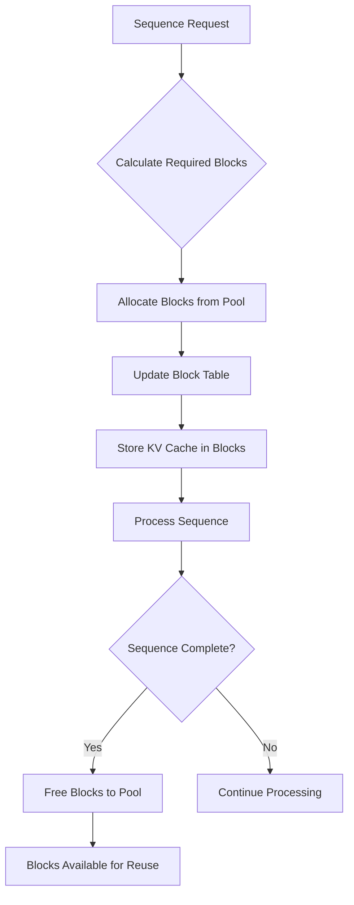
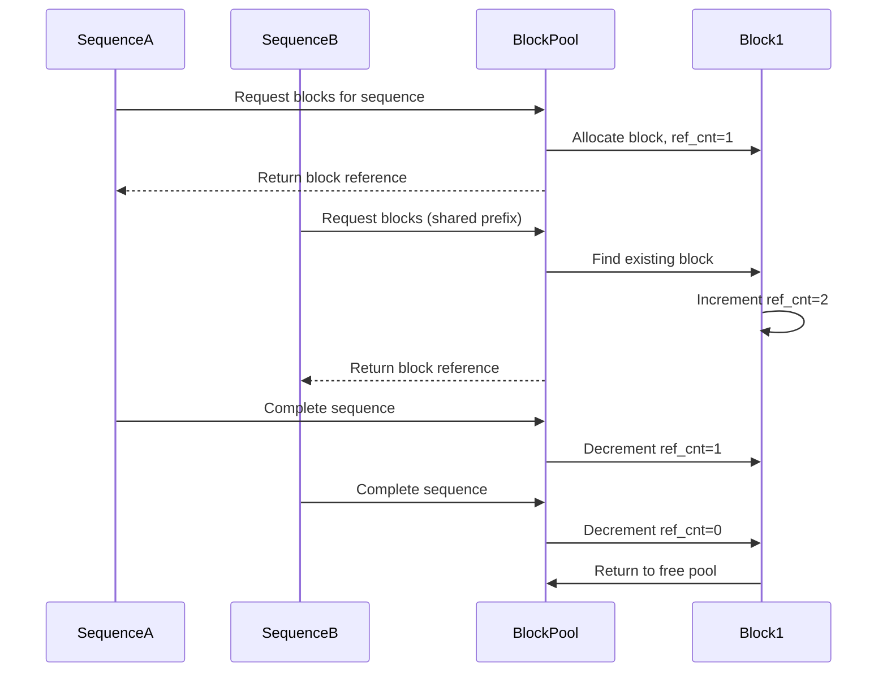
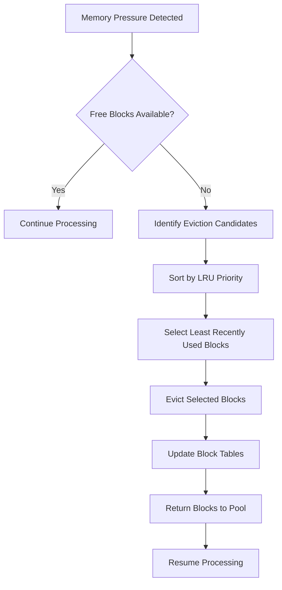
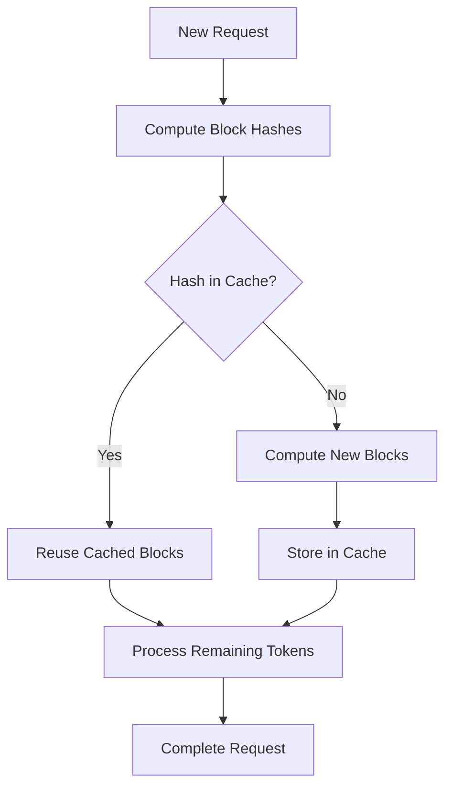
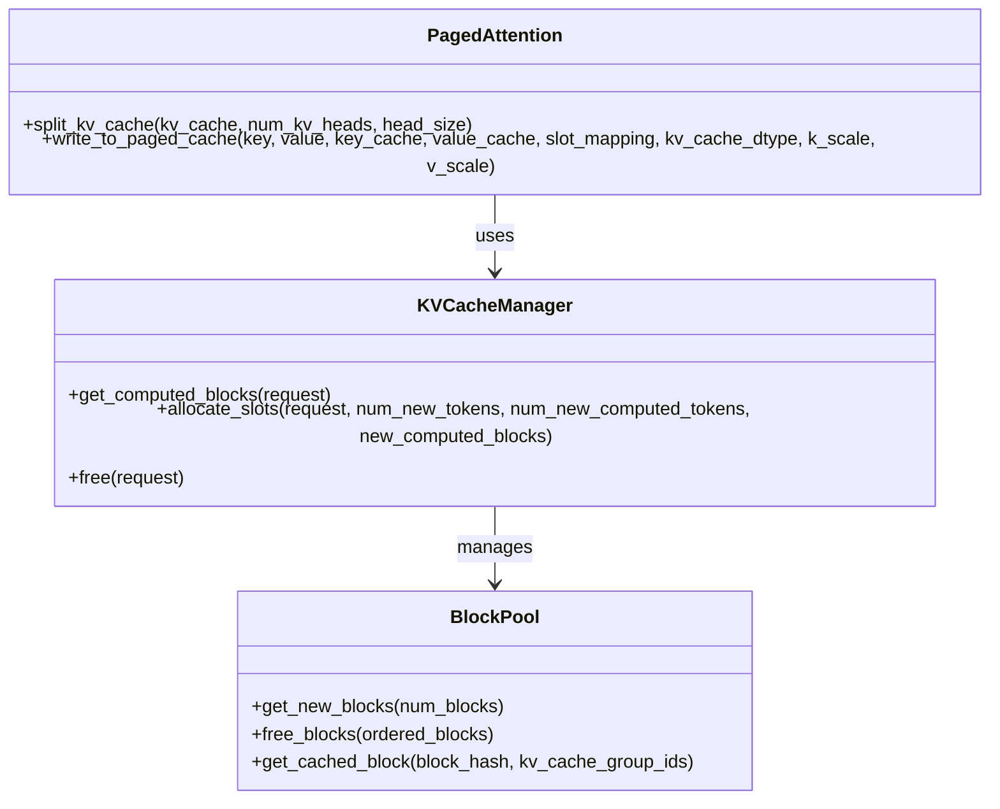

# KV Cache Management

<cite>
**Referenced Files in This Document**   
- [block_pool.py](file://vllm/v1/core/block_pool.py)
- [kv_cache_utils.py](file://vllm/v1/core/kv_cache_utils.py)
- [kv_cache_manager.py](file://vllm/v1/core/kv_cache_manager.py)
- [single_type_kv_cache_manager.py](file://vllm/v1/core/single_type_kv_cache_manager.py)
- [paged_attn.py](file://vllm/attention/ops/paged_attn.py)
- [automatic_prefix_caching.py](file://examples/offline_inference/automatic_prefix_caching.py)
</cite>

## Table of Contents
1. [Introduction](#introduction)
2. [Block-Based Allocation](#block-based-allocation)
3. [Reference Counting Mechanism](#reference-counting-mechanism)
4. [Cache Eviction Policies](#cache-eviction-policies)
5. [Shared KV Cache for Prefix Caching](#shared-kv-cache-for-prefix-caching)
6. [PagedAttention Integration](#pagedattention-integration)
7. [Configuration Options](#configuration-options)
8. [Memory Fragmentation and Solutions](#memory-fragmentation-and-solutions)
9. [Performance Trade-offs](#performance-trade-offs)
10. [Practical Examples](#practical-examples)
11. [Conclusion](#conclusion)

## Introduction
vLLM implements an advanced KV cache management system that optimizes memory usage through block-based allocation, reference counting, and prefix caching. This system enables efficient handling of multiple sequences by sharing KV cache blocks across requests with common prefixes, significantly reducing redundant computation. The integration with PagedAttention allows for flexible memory management that adapts to varying sequence lengths and workloads. This document explores the architecture and implementation details of vLLM's KV cache management, focusing on memory optimization strategies that enable high-throughput LLM inference.

## Block-Based Allocation
vLLM employs a block-based allocation strategy for KV cache management, where the GPU memory is divided into fixed-size blocks that can be dynamically allocated to different sequences. Each block contains a predetermined number of tokens (typically 16), and sequences are mapped to block tables that track which blocks contain their KV cache data. This approach provides several advantages over contiguous memory allocation:

- **Flexible memory utilization**: Blocks can be allocated non-contiguously, allowing for more efficient memory usage
- **Dynamic scaling**: Sequences can grow by allocating additional blocks as needed
- **Reduced fragmentation**: The block pool can efficiently manage free blocks for reuse

The block allocation system is implemented in the `BlockPool` class, which maintains a pool of available blocks and manages their allocation and deallocation. When a new sequence requires KV cache space, the system allocates the necessary number of blocks from the pool, updating the block table to map the sequence to its allocated blocks.

**Diagram sources**
- [block_pool.py](file://vllm/v1/core/block_pool.py#L128-L467)
- [kv_cache_manager.py](file://vllm/v1/core/kv_cache_manager.py#L94-L412)

## Reference Counting Mechanism
The reference counting mechanism in vLLM's KV cache management enables efficient sharing of cache blocks across multiple sequences. Each KV cache block maintains a reference count that tracks how many sequences are currently using it. This approach allows for safe block sharing while ensuring that blocks are only freed when no longer needed by any sequence.

When a block is first allocated to a sequence, its reference count is set to 1. If another sequence with a common prefix accesses the same block, the reference count is incremented. The block remains allocated as long as its reference count is greater than zero. When a sequence completes or is evicted, the reference count is decremented, and the block is only returned to the free pool when the count reaches zero.

This mechanism is particularly effective for prefix caching, where multiple sequences share common initial tokens. The reference counting system ensures that shared prefix blocks remain available for all sequences that need them, while allowing non-shared blocks to be freed when individual sequences complete.

**Diagram sources**
- [block_pool.py](file://vllm/v1/core/block_pool.py#L107-L153)
- [kv_cache_utils.py](file://vllm/v1/core/kv_cache_utils.py#L106-L153)

## Cache Eviction Policies
vLLM implements a sophisticated cache eviction policy that balances memory efficiency with performance. The system uses a Least Recently Used (LRU) eviction strategy combined with block-level tracking to determine which blocks to remove when memory pressure occurs.

The eviction policy prioritizes blocks based on two key factors:
1. **Last access time**: Less recently used blocks are evicted first
2. **Block position in sequence**: When blocks have the same last access time, the system prioritizes evicting tail blocks (those with more hash tokens) over head blocks

This approach ensures that frequently accessed prefix blocks are retained in cache while allowing for the removal of less critical blocks. The system maintains a free block queue ordered by eviction priority, with the least recently used blocks at the front of the queue.

The eviction process is tightly integrated with the block pool management system, which tracks free blocks in a doubly linked list. When blocks are freed, they are appended to the queue in reverse order of their allocation, maintaining the LRU ordering. This design enables efficient O(1) operations for both block allocation and deallocation.

**Diagram sources**
- [block_pool.py](file://vllm/v1/core/block_pool.py#L155-L188)
- [kv_cache_utils.py](file://vllm/v1/core/kv_cache_utils.py#L155-L206)

## Shared KV Cache for Prefix Caching
vLLM's shared KV cache implementation enables significant performance improvements through prefix caching, where common prompt prefixes are cached and reused across multiple requests. This feature is particularly beneficial for applications with repetitive prompts or batched queries with shared initial content.

The prefix caching system works by computing cryptographic hashes (using SHA-256) of token blocks and storing them in a hash map. When a new request arrives, the system checks if any of its prefix blocks have been previously computed by comparing their hashes against the cache. If a match is found, the corresponding KV cache blocks are reused, eliminating the need to recompute attention for those tokens.

Key components of the shared KV cache system include:
- **Block hashing**: Each full block's content is hashed using SHA-256 combined with the parent block's hash to create a unique identifier
- **Hash map storage**: Cached blocks are stored in a hash map (BlockHashToBlockMap) for O(1) lookup
- **Group identification**: Blocks are tagged with their KV cache group ID to support models with multiple attention types

The system also handles special cases such as multimodal inputs, LoRA adapters, and custom cache salts by incorporating additional metadata into the hash computation. This ensures that cached blocks are only reused when all relevant context matches.

**Diagram sources**
- [block_pool.py](file://vllm/v1/core/block_pool.py#L182-L268)
- [kv_cache_utils.py](file://vllm/v1/core/kv_cache_utils.py#L524-L552)

## PagedAttention Integration
vLLM's KV cache management is tightly integrated with PagedAttention, a memory-efficient attention mechanism inspired by virtual memory and paging in operating systems. This integration enables flexible memory management that adapts to varying sequence lengths and workloads.

PagedAttention divides the KV cache into fixed-size blocks that can be stored non-contiguously in GPU memory. The attention operation is modified to work with this block-based layout, using a block table to map logical token positions to physical block locations. This approach provides several key benefits:

- **Memory efficiency**: Eliminates the need for over-allocation of memory for variable-length sequences
- **Scalability**: Enables handling of very long sequences by only allocating memory for actually used tokens
- **Fragmentation reduction**: Allows for more efficient memory utilization across multiple sequences

The integration between KV cache management and PagedAttention is implemented through the `PagedAttention` class, which provides methods for splitting KV cache tensors into blocks and writing to paged cache. The system maintains separate key and value cache views that are reshaped to accommodate the block-based layout.

**Diagram sources**
- [paged_attn.py](file://vllm/attention/ops/paged_attn.py#L15-L52)
- [kv_cache_manager.py](file://vllm/v1/core/kv_cache_manager.py#L94-L412)

## Configuration Options
vLLM provides several configuration options that control KV cache behavior and memory utilization. These settings allow users to fine-tune the system for their specific hardware and workload requirements.

Key configuration parameters include:

- **gpu_memory_utilization**: Controls the fraction of GPU memory allocated to KV cache (default: 0.9). Higher values increase cache capacity but may reduce memory available for other operations.
- **enable_prefix_caching**: Enables or disables prefix caching (default: True). Disabling can improve performance for workloads with minimal prompt repetition.
- **block_size**: Sets the number of tokens per KV cache block (default: 16). Smaller blocks reduce internal fragmentation but increase metadata overhead.
- **max_model_len**: Defines the maximum sequence length the model can handle, which affects total KV cache requirements.

The system also includes advanced options for specialized use cases:
- **hash_block_size**: Controls the granularity of block hashing for prefix caching
- **enable_kv_cache_events**: Enables KV cache event tracking for monitoring and debugging
- **num_gpu_blocks_override**: Allows manual override of the number of GPU blocks

These configuration options are typically set when initializing the vLLM engine and can significantly impact performance and memory usage patterns.

**Section sources**
- [kv_cache_utils.py](file://vllm/v1/core/kv_cache_utils.py#L608-L715)
- [kv_cache_manager.py](file://vllm/v1/core/kv_cache_manager.py#L95-L133)

## Memory Fragmentation and Solutions
Memory fragmentation is a potential challenge in block-based KV cache management systems. vLLM addresses this issue through several strategies that maintain memory efficiency over time.

The primary causes of fragmentation in KV cache systems include:
- **Internal fragmentation**: When a sequence doesn't fully utilize its allocated blocks
- **External fragmentation**: When free blocks are scattered throughout memory, preventing allocation of large contiguous regions

vLLM mitigates these issues through:
1. **Block-level allocation**: Using fixed-size blocks reduces internal fragmentation compared to variable-size allocation
2. **LRU eviction policy**: Prioritizing eviction of tail blocks helps maintain contiguous free space
3. **Reverse deallocation order**: Freeing blocks in reverse order of allocation maintains LRU ordering and reduces fragmentation
4. **Null block handling**: Using a null block placeholder simplifies block management and reduces edge cases

The system also includes a `reset_prefix_cache` method that can be used to completely clear the prefix cache and defragment memory, which is particularly useful in RLHF workflows where model weights are frequently updated.

**Section sources**
- [block_pool.py](file://vllm/v1/core/block_pool.py#L400-L433)
- [kv_cache_utils.py](file://vllm/v1/core/kv_cache_utils.py#L155-L206)

## Performance Trade-offs
vLLM's KV cache management system involves several performance trade-offs that users should consider when configuring their deployment:

**Cache Size vs. Model Capacity**
- Larger KV cache allows for more sequence parallelism but reduces memory available for model weights and activations
- The optimal balance depends on the specific workload and hardware configuration

**Block Size Considerations**
- Smaller blocks (e.g., 8 tokens): Reduce internal fragmentation but increase metadata overhead
- Larger blocks (e.g., 32 tokens): Improve memory throughput but may waste space for short sequences

**Prefix Caching Overhead**
- Enabled: Reduces computation for repeated prefixes but adds hash computation and lookup overhead
- Disabled: Eliminates caching overhead but loses opportunity for computation reuse

The system automatically estimates the maximum model length that can fit in available memory, helping users understand these trade-offs. The `get_max_concurrency_for_kv_cache_config` function provides guidance on expected throughput based on the current configuration.

**Section sources**
- [kv_cache_utils.py](file://vllm/v1/core/kv_cache_utils.py#L608-L715)
- [kv_cache_manager.py](file://vllm/v1/core/kv_cache_manager.py#L144-L151)

## Practical Examples
The effectiveness of vLLM's KV cache management can be demonstrated through practical examples. The `automatic_prefix_caching.py` example shows how prefix caching can significantly reduce generation time for queries with shared prompts.

In this example, a long Markdown table is used as a shared prompt prefix for two different queries:
1. First query: "What is the age of John Doe?"
2. Second query: "What is the age of Zack Blue?"

When prefix caching is enabled, the second query benefits from the cached KV cache of the shared table prefix, avoiding redundant computation. This results in substantially faster generation times for subsequent queries with common prefixes.

The performance improvement is particularly pronounced for:
- Long shared prefixes (e.g., documentation, tables, or code)
- Batched queries with similar initial content
- Interactive applications with repetitive system prompts

Users can enable prefix caching by setting `enable_prefix_caching=True` when initializing the vLLM engine, as shown in the example code.

**Section sources**
- [automatic_prefix_caching.py](file://examples/offline_inference/automatic_prefix_caching.py#L79-L103)

## Conclusion
vLLM's KV cache management system represents a sophisticated approach to memory optimization in LLM inference. By combining block-based allocation, reference counting, and prefix caching with PagedAttention, the system achieves high memory efficiency and throughput. The implementation balances multiple competing factors, including memory utilization, computational efficiency, and scalability.

Key strengths of the system include:
- Efficient block-level memory management that minimizes fragmentation
- Effective prefix caching that reduces redundant computation
- Flexible configuration options that adapt to different hardware and workloads
- Tight integration between KV cache management and attention mechanisms

These features make vLLM particularly well-suited for high-throughput LLM serving scenarios where memory efficiency and performance are critical. The system's design principles could serve as a model for other memory-intensive AI applications requiring efficient resource management.