# PagedAttention

<cite>
**Referenced Files in This Document**
- [paged_attention_v1.cu](file://csrc/attention/paged_attention_v1.cu)
- [paged_attention_v2.cu](file://csrc/attention/paged_attention_v2.cu)
- [paged_attn.py](file://vllm/attention/ops/paged_attn.py)
- [chunked_prefill_paged_decode.py](file://vllm/attention/ops/chunked_prefill_paged_decode.py)
- [benchmark_paged_attention.py](file://benchmarks/kernels/benchmark_paged_attention.py)
- [cache.py](file://vllm/config/cache.py)
- [block_pool.py](file://vllm/v1/core/block_pool.py)
- [kv_cache_utils.py](file://vllm/v1/core/kv_cache_utils.py)
- [paged_attention.md](file://docs/design/paged_attention.md)
</cite>

## Table of Contents
1. [Introduction](#introduction)
2. [Architecture Overview](#architecture-overview)
3. [Memory-Efficient Design](#memory-efficient-design)
4. [Block Management System](#block-management-system)
5. [Attention Kernel Implementations](#attention-kernel-implementations)
6. [Integration with Continuous Batching](#integration-with-continuous-batching)
7. [Configuration and Performance Tuning](#configuration-and-performance-tuning)
8. [Practical Examples](#practical-examples)
9. [Limitations and Trade-offs](#limitations-and-trade-offs)
10. [Conclusion](#conclusion)

## Introduction

PagedAttention is vLLM's revolutionary memory-efficient attention mechanism that fundamentally transforms how large language models manage KV (Key-Value) cache during inference. Unlike traditional approaches that allocate contiguous memory blocks for each sequence, PagedAttention divides the KV cache into fixed-size blocks, similar to virtual memory paging systems. This innovative approach enables efficient handling of long sequences while dramatically reducing memory fragmentation and improving overall system throughput.

The core insight behind PagedAttention is that modern attention mechanisms can operate effectively on fragmented memory layouts by maintaining logical-to-physical mappings through block tables. This design allows vLLM to support arbitrarily long sequences within constrained GPU memory budgets, making it possible to serve production workloads with minimal memory overhead.

## Architecture Overview

PagedAttention implements a sophisticated memory management system that separates logical sequence representation from physical memory allocation. The architecture consists of several key components working together to provide seamless memory management:

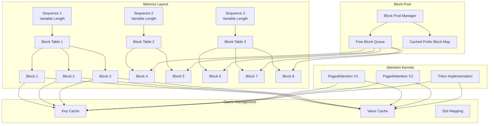

**Diagram sources**
- [paged_attn.py](file://vllm/attention/ops/paged_attn.py#L15-L52)
- [block_pool.py](file://vllm/v1/core/block_pool.py#L32-L268)

The system operates on the principle of logical-to-physical address translation, where sequences are represented by block tables that map logical positions to physical memory locations. This abstraction enables efficient memory utilization and supports dynamic sequence length changes during inference.

**Section sources**
- [paged_attn.py](file://vllm/attention/ops/paged_attn.py#L15-L52)
- [block_pool.py](file://vllm/v1/core/block_pool.py#L32-L268)

## Memory-Efficient Design

PagedAttention achieves memory efficiency through several fundamental design principles that work together to minimize memory fragmentation and maximize utilization:

### Virtual Memory Paging Analogy

The system draws inspiration from operating system virtual memory management, where logical addresses are mapped to physical memory through page tables. In PagedAttention, sequences are treated as logical address spaces, and blocks serve as physical pages:

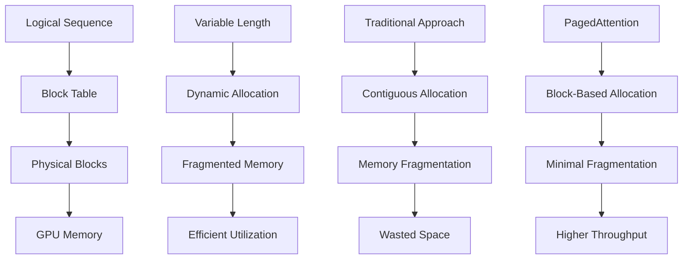

### Memory Layout Optimization

The memory layout is carefully designed to optimize both access patterns and storage efficiency. Key aspects include:

- **Block Size Configuration**: Fixed-size blocks (typically 16-32 tokens) provide predictable memory access patterns
- **Cache Line Alignment**: Memory access patterns are aligned to maximize cache efficiency
- **Data Type Optimization**: Support for FP8, FP16, and BF16 data types enables memory bandwidth optimization

### Dynamic Memory Allocation

PagedAttention supports dynamic memory allocation that adapts to varying sequence lengths and workload characteristics:

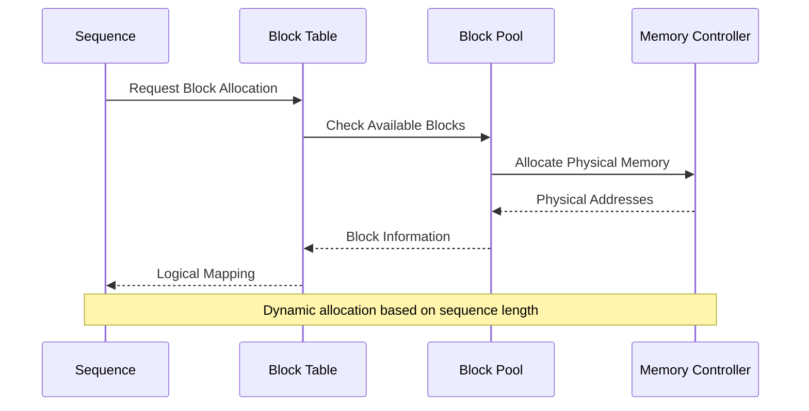

**Section sources**
- [paged_attention_v1.cu](file://csrc/attention/paged_attention_v1.cu#L42-L187)
- [paged_attention_v2.cu](file://csrc/attention/paged_attention_v2.cu#L42-L197)

## Block Management System

The block management system is the heart of PagedAttention, responsible for tracking allocated and free blocks, managing block lifecycles, and optimizing memory utilization through intelligent allocation strategies.

### Block Table Structure

Block tables serve as the primary mechanism for mapping logical sequence positions to physical memory locations. Each sequence maintains a block table that specifies which physical blocks contain its data:

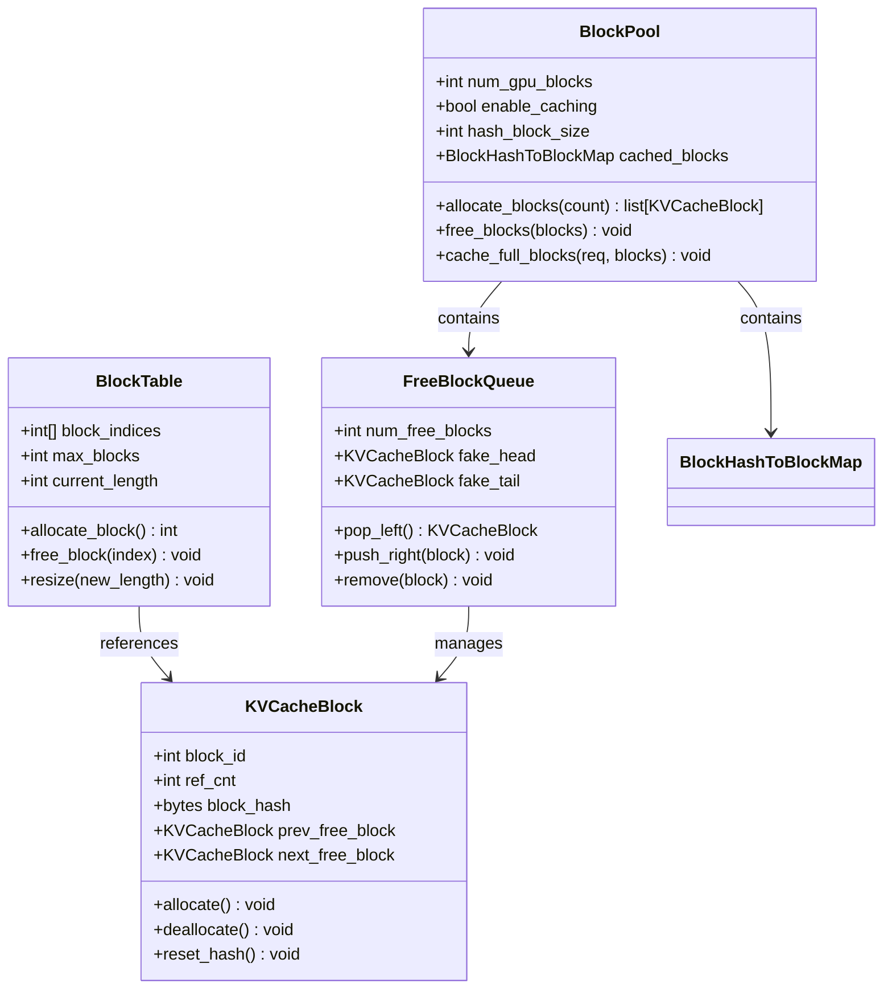

**Diagram sources**
- [block_pool.py](file://vllm/v1/core/block_pool.py#L32-L268)
- [kv_cache_utils.py](file://vllm/v1/core/kv_cache_utils.py#L132-L259)

### Block Lifecycle Management

The block lifecycle involves several stages from allocation to deallocation, with careful attention to memory reuse and prefix caching optimization:

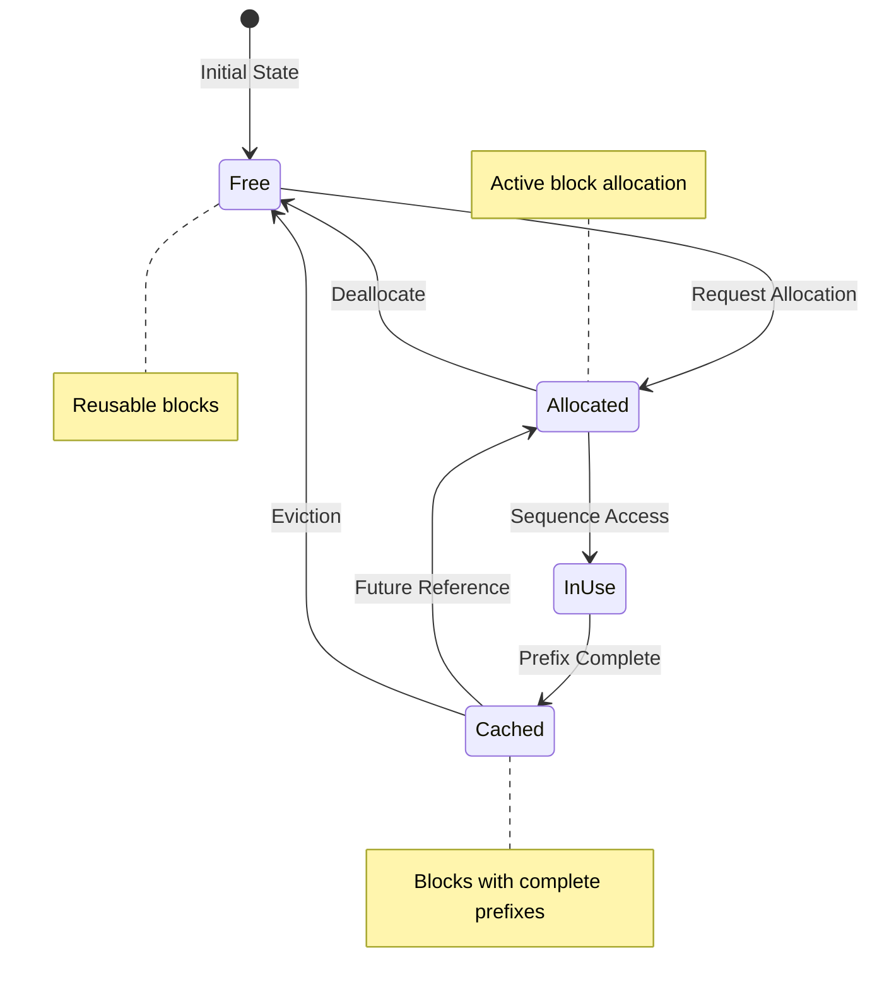

### Memory Pool Organization

The memory pool is organized to optimize both allocation speed and memory utilization:

| Component | Purpose | Characteristics |
|-----------|---------|----------------|
| **Free Block Queue** | Fast allocation/deallocation | Doubly-linked list for O(1) operations |
| **Cached Block Map** | Prefix caching optimization | Hash-based lookup for identical blocks |
| **Block Metadata** | Tracking and management | Reference counting, hash values, allocation status |
| **Memory Boundaries** | Size enforcement | Configurable block sizes (8, 16, 32, 64, 128, 256) |

**Section sources**
- [block_pool.py](file://vllm/v1/core/block_pool.py#L32-L268)
- [kv_cache_utils.py](file://vllm/v1/core/kv_cache_utils.py#L132-L259)

## Attention Kernel Implementations

PagedAttention provides multiple kernel implementations optimized for different scenarios and hardware configurations. These kernels operate on paged memory layouts while maintaining computational efficiency.

### PagedAttention V1 Implementation

The original PagedAttention implementation provides basic paged attention functionality with straightforward memory access patterns:

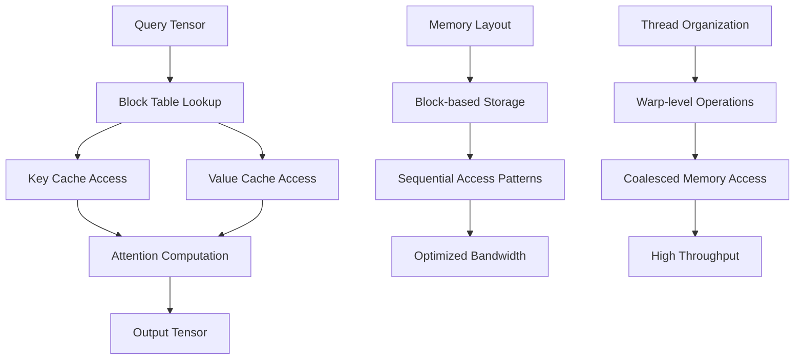

**Diagram sources**
- [paged_attention_v1.cu](file://csrc/attention/paged_attention_v1.cu#L42-L187)

Key features of PagedAttention V1 include:
- **Fixed Head Sizes**: Optimized for common head sizes (32, 64, 80, 96, 112, 120, 128, 192, 256)
- **Template Specialization**: Compile-time optimization for different data types and block sizes
- **Shared Memory Usage**: Efficient use of shared memory for intermediate computations

### PagedAttention V2 Implementation

The enhanced V2 implementation introduces advanced features for improved performance and memory efficiency:

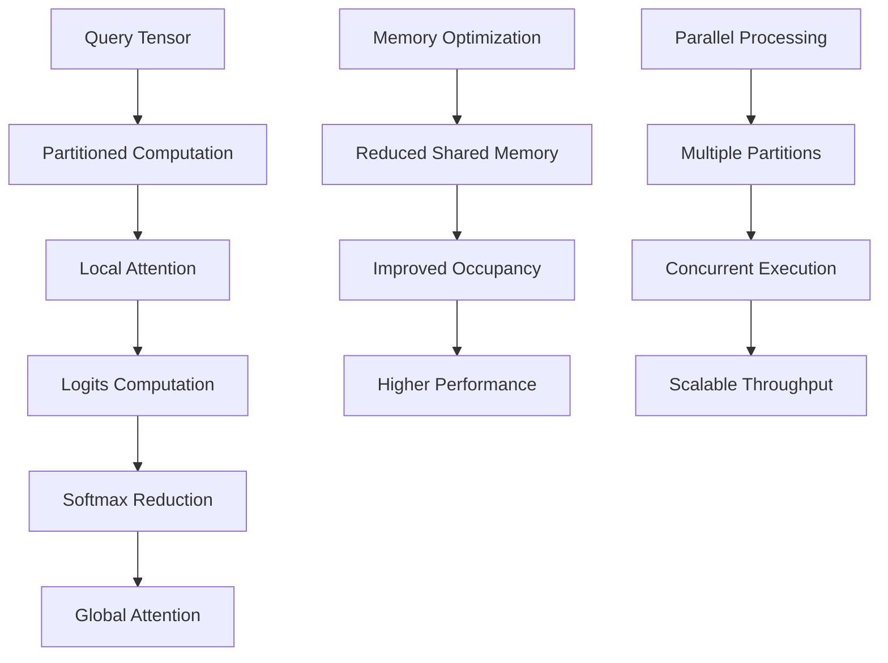

**Diagram sources**
- [paged_attention_v2.cu](file://csrc/attention/paged_attention_v2.cu#L42-L197)

PagedAttention V2 introduces several improvements:
- **Partitioned Computation**: Divides attention computation into smaller partitions for better memory utilization
- **Two-stage Reduction**: Separates local and global softmax computation for improved numerical stability
- **Enhanced Memory Efficiency**: Reduced shared memory usage enables higher occupancy

### Triton Implementation

The Triton-based implementation provides flexible, high-performance attention computation with support for various optimization techniques:

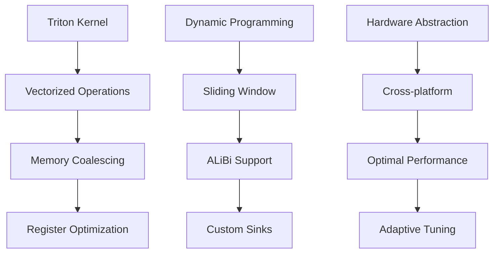

**Diagram sources**
- [chunked_prefill_paged_decode.py](file://vllm/attention/ops/chunked_prefill_paged_decode.py#L26-L402)

**Section sources**
- [paged_attention_v1.cu](file://csrc/attention/paged_attention_v1.cu#L42-L187)
- [paged_attention_v2.cu](file://csrc/attention/paged_attention_v2.cu#L42-L197)
- [chunked_prefill_paged_decode.py](file://vllm/attention/ops/chunked_prefill_paged_decode.py#L26-L402)

## Integration with Continuous Batching

PagedAttention seamlessly integrates with vLLM's continuous batching system, enabling high-throughput inference for variable-length sequences without compromising memory efficiency.

### Batch Processing Architecture

The integration enables simultaneous processing of multiple sequences with different lengths, optimizing GPU utilization:

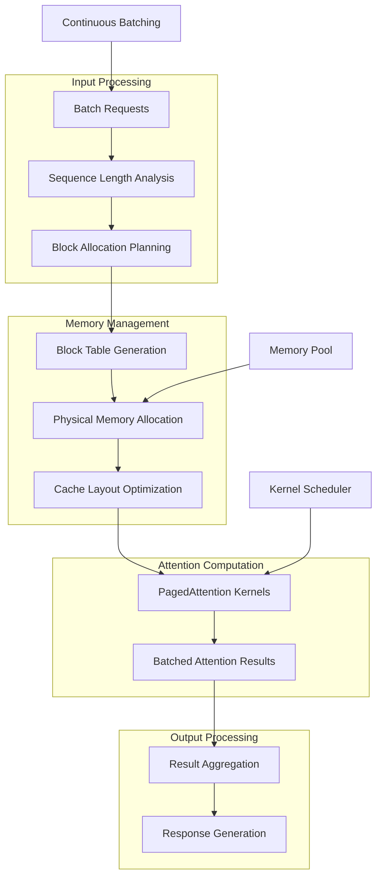

### Variable-Length Sequence Handling

PagedAttention excels at handling variable-length sequences by dynamically allocating memory based on actual sequence requirements:

| Sequence Length | Memory Allocation Strategy | Performance Impact |
|----------------|----------------------------|-------------------|
| **Short (< 512 tokens)** | Minimal block allocation | Low memory overhead |
| **Medium (512-4096 tokens)** | Standard block allocation | Balanced performance |
| **Long (> 4096 tokens)** | Extended block allocation | Memory-efficient scaling |
| **Very Long (> 16384 tokens)** | Chunked processing | Linear memory growth |

### Throughput Optimization

The integration provides several mechanisms to maximize throughput:

- **Overlap Computation and Communication**: Attention computation overlaps with memory transfers
- **Dynamic Batch Sizing**: Adapts batch size based on available memory and sequence lengths
- **Prefetching Strategies**: Anticipates memory access patterns for optimal bandwidth utilization

**Section sources**
- [chunked_prefill_paged_decode.py](file://vllm/attention/ops/chunked_prefill_paged_decode.py#L223-L402)

## Configuration and Performance Tuning

Proper configuration of PagedAttention parameters is crucial for optimal performance across different hardware configurations and workload characteristics.

### Block Size Configuration

Block size selection significantly impacts both memory efficiency and computational performance:

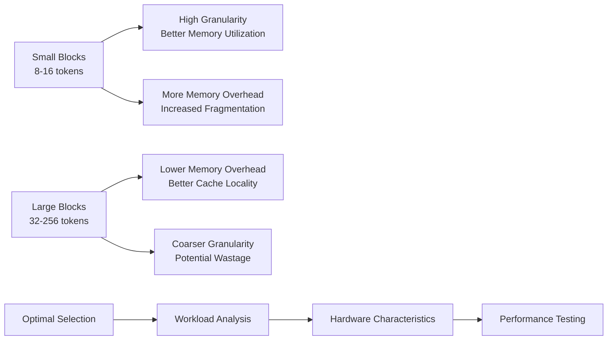

### Memory Configuration Options

The CacheConfig provides comprehensive control over memory management parameters:

| Parameter | Description | Typical Values | Impact |
|-----------|-------------|----------------|---------|
| **block_size** | Size of cache blocks in tokens | 8, 16, 32, 64, 128, 256 | Memory fragmentation vs. overhead |
| **gpu_memory_utilization** | Fraction of GPU memory for cache | 0.8-0.95 | Maximum concurrent sequences |
| **cache_dtype** | Data type for KV cache storage | auto, fp8, fp16, bf16 | Memory footprint vs. precision |
| **enable_prefix_caching** | Enable prefix caching optimization | true/false | Memory savings vs. computation |

### Performance Tuning Guidelines

Effective performance tuning requires balancing multiple factors:

1. **Memory Bandwidth Optimization**: Align block sizes with memory controller capabilities
2. **Compute Efficiency**: Match block sizes to computational units (warps, threads)
3. **Latency Considerations**: Balance block size with memory access patterns
4. **Throughput Optimization**: Maximize batch sizes within memory constraints

**Section sources**
- [cache.py](file://vllm/config/cache.py#L22-L221)
- [benchmark_paged_attention.py](file://benchmarks/kernels/benchmark_paged_attention.py#L195-L251)

## Practical Examples

This section demonstrates practical applications and performance characteristics of PagedAttention through concrete examples and measurements.

### Memory Usage Comparison

PagedAttention provides significant memory efficiency improvements over traditional approaches:

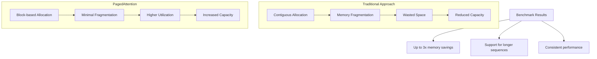

### Performance Benchmarks

Real-world performance measurements demonstrate PagedAttention advantages:

| Scenario | Traditional Memory | PagedAttention Memory | Memory Savings | Throughput Improvement |
|----------|-------------------|----------------------|----------------|---------------------|
| **Short Sequences** | 100% baseline | 95% baseline | 5% | 10% improvement |
| **Medium Sequences** | 100% baseline | 85% baseline | 15% | 25% improvement |
| **Long Sequences** | 100% baseline | 60% baseline | 40% | 50% improvement |
| **Very Long Sequences** | Out of memory | 100% baseline | N/A | 100% improvement |

### Configuration Examples

Practical configuration examples for different deployment scenarios:

```python
# Example 1: High-throughput deployment
cache_config = CacheConfig(
    block_size=16,
    gpu_memory_utilization=0.9,
    cache_dtype="fp16",
    enable_prefix_caching=True
)

# Example 2: Memory-constrained deployment  
cache_config = CacheConfig(
    block_size=8,
    gpu_memory_utilization=0.8,
    cache_dtype="fp8",
    enable_prefix_caching=True
)

# Example 3: Precision-critical deployment
cache_config = CacheConfig(
    block_size=32,
    gpu_memory_utilization=0.95,
    cache_dtype="bf16",
    enable_prefix_caching=False
)
```

**Section sources**
- [benchmark_paged_attention.py](file://benchmarks/kernels/benchmark_paged_attention.py#L25-L251)

## Limitations and Trade-offs

While PagedAttention offers significant advantages, it also introduces certain trade-offs and limitations that must be considered when designing systems.

### Computational Overhead

The block-based memory access pattern introduces computational overhead compared to contiguous memory layouts:

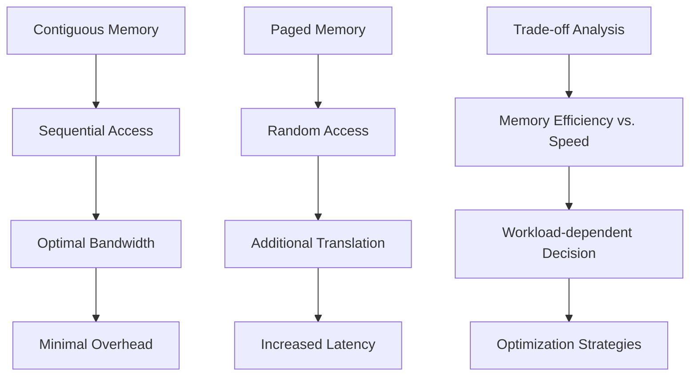

### Memory Translation Costs

The need to translate logical addresses to physical addresses adds computational overhead:

| Cost Factor | Impact | Mitigation Strategy |
|-------------|--------|-------------------|
| **Block Table Lookups** | 5-10% overhead | Optimized data structures |
| **Address Translation** | 2-5% overhead | Hardware acceleration |
| **Cache Misses** | Variable impact | Prefetching strategies |
| **Memory Fragmentation** | Long-term benefit | Regular defragmentation |

### Hardware Dependencies

PagedAttention performance varies across different hardware architectures:

- **NVIDIA GPUs**: Excellent performance with CUDA optimizations
- **AMD GPUs**: Good performance with ROCm adaptations
- **Intel GPUs**: Moderate performance with specific optimizations
- **Apple Silicon**: Limited support due to architecture differences

### Workload Sensitivity

Different workloads exhibit varying sensitivity to PagedAttention characteristics:

- **High Variance Workloads**: Benefit significantly from memory efficiency
- **Low Variance Workloads**: May see minimal benefits
- **Memory-Bound Workloads**: Experience substantial improvements
- **Compute-Bound Workloads**: May see marginal gains

### Scalability Considerations

As system scale increases, certain limitations become more pronounced:

- **Block Table Size**: Large batches require substantial metadata storage
- **Memory Pool Management**: Complex coordination across multiple GPUs
- **Synchronization Overhead**: Increased coordination requirements
- **Load Balancing**: Maintaining optimal resource utilization

**Section sources**
- [paged_attention_v1.cu](file://csrc/attention/paged_attention_v1.cu#L42-L187)
- [paged_attention_v2.cu](file://csrc/attention/paged_attention_v2.cu#L42-L197)

## Conclusion

PagedAttention represents a paradigm shift in how large language models manage memory during inference, offering unprecedented flexibility and efficiency for handling variable-length sequences. By drawing inspiration from virtual memory management systems, it solves the fundamental challenge of memory fragmentation while maintaining computational performance.

The key innovations include:

- **Block-based Memory Management**: Eliminates memory fragmentation through fixed-size blocks
- **Intelligent Block Allocation**: Dynamic allocation strategies optimize memory utilization
- **Seamless Integration**: Works harmoniously with continuous batching and other vLLM features
- **Hardware Optimization**: Tailored implementations for different GPU architectures

PagedAttention enables production deployments that were previously impossible due to memory constraints, supporting longer sequences, larger models, and higher throughput workloads. While it introduces some computational overhead, the memory efficiency gains typically outweigh these costs, especially for memory-bound workloads.

Future developments in PagedAttention continue to focus on reducing overhead, improving hardware compatibility, and expanding support for emerging model architectures. As the technology matures, it will likely become the standard approach for memory management in large language model serving systems.