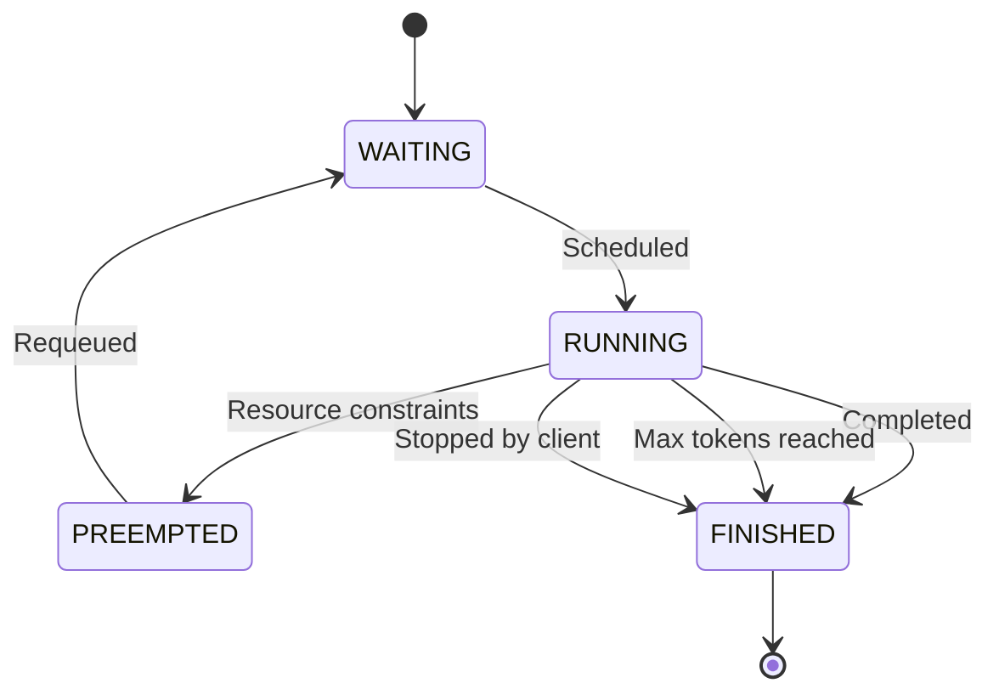
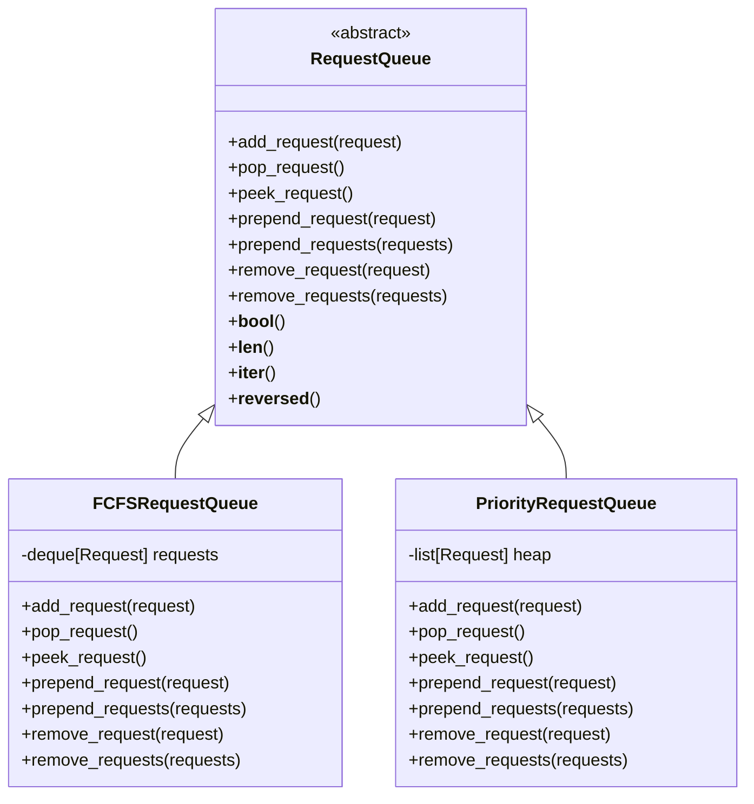
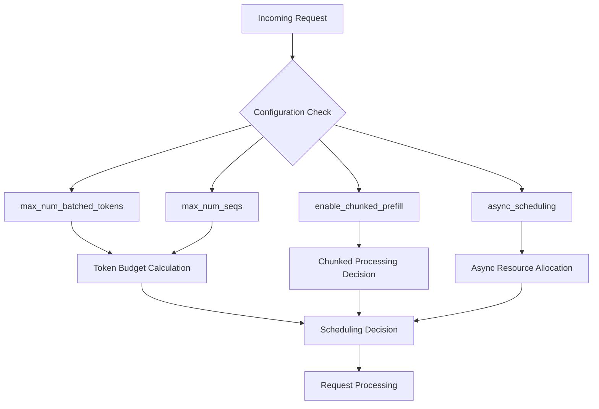
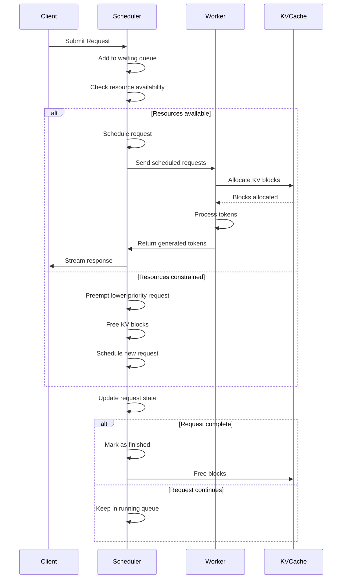
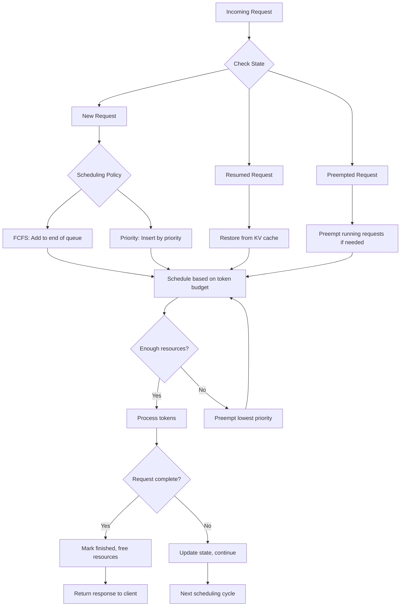

# Request Scheduling

<cite>
**Referenced Files in This Document**   
- [scheduler.py](file://vllm/v1/core/sched/scheduler.py)
- [request_queue.py](file://vllm/v1/core/sched/request_queue.py)
- [config.py](file://vllm/config/scheduler.py)
- [request.py](file://vllm/v1/request.py)
- [output.py](file://vllm/v1/core/sched/output.py)
- [async_scheduler.py](file://vllm/v1/core/sched/async_scheduler.py)
</cite>

## Table of Contents
1. [Introduction](#introduction)
2. [Request Management System](#request-management-system)
3. [Scheduling Phases: Prefill and Decode](#scheduling-phases-prefill-and-decode)
4. [Scheduling Policies](#scheduling-policies)
5. [Request Queue Implementation](#request-queue-implementation)
6. [Output Processing Pipeline](#output-processing-pipeline)
7. [Configuration Options](#configuration-options)
8. [Distributed Inference Integration](#distributed-inference-integration)
9. [Common Issues and Solutions](#common-issues-and-solutions)
10. [Practical Examples](#practical-examples)
11. [Diagrams](#diagrams)

## Introduction
The vLLM request scheduling system manages the processing of incoming inference requests through a sophisticated scheduler that handles request states, implements various scheduling policies, and coordinates with distributed inference components. This document provides a comprehensive overview of the request management system, focusing on how requests are handled through prefill and decode phases, prioritized according to different policies, and processed through the output pipeline.

## Request Management System
The vLLM scheduler manages incoming requests through a state-based system that tracks each request's progress through the inference pipeline. The core components include the Scheduler class, request queues, and state management.

The scheduler handles requests in different states defined in the RequestStatus enum:
- WAITING: Requests waiting to be scheduled
- RUNNING: Requests currently being processed
- PREEMPTED: Requests temporarily removed from processing
- Various finished states (FINISHED_STOPPED, FINISHED_LENGTH_CAPPED, etc.)

Each request contains metadata such as priority, arrival time, prompt token IDs, sampling parameters, and status information. The scheduler maintains separate queues for waiting and running requests, allowing for efficient management of request lifecycles.

**Section sources**
- [request.py](file://vllm/v1/request.py#L244-L281)
- [scheduler.py](file://vllm/v1/core/sched/scheduler.py#L137-L149)

## Scheduling Phases: Prefill and Decode
The vLLM scheduler manages requests through two primary phases: prefill and decode. These phases are not explicitly separated in the scheduler but are handled through the request's token processing state.

During the prefill phase, the scheduler processes the entire prompt in a single step or through chunked prefill when enabled. The number of tokens processed is determined by the request's prompt length and system constraints. For long prompts, chunked prefill allows processing in smaller batches, improving latency for shorter requests.

The decode phase occurs when the model generates output tokens one or more at a time. The scheduler determines how many tokens to generate in each step based on available resources and scheduling policies. The transition between phases is managed by tracking the number of computed tokens versus total tokens needed.

The scheduler uses the num_computed_tokens and num_tokens_with_spec attributes to track progress through these phases. When a request has more tokens to compute than have been computed, it remains in the processing queue.



**Diagram sources**
- [scheduler.py](file://vllm/v1/core/sched/scheduler.py#L205-L800)
- [request.py](file://vllm/v1/request.py#L103-L104)

## Scheduling Policies
vLLM supports multiple scheduling policies that determine how requests are prioritized and processed. The primary policies are:

### FCFS (First-Come-First-Served)
The default scheduling policy where requests are processed in the order of arrival. This policy ensures fairness and predictability in request processing.

### Priority-Based Scheduling
Requests are processed based on their assigned priority value, with lower values indicating higher priority. When priorities are equal, arrival time breaks ties, maintaining fairness among requests of the same priority level.

The scheduling policy is configured through the SchedulerConfig class, which allows setting the policy via the 'policy' parameter. The scheduler uses different queue implementations based on the selected policy:

- FCFS uses a deque-based queue (FCFSRequestQueue)
- Priority scheduling uses a heap-based priority queue (PriorityRequestQueue)

The choice of policy affects system behavior significantly. FCFS provides predictable latency characteristics, while priority scheduling allows critical requests to be processed more quickly, potentially at the expense of lower-priority requests.

**Section sources**
- [config.py](file://vllm/config/scheduler.py#L23-L108)
- [request_queue.py](file://vllm/v1/core/sched/request_queue.py#L13-L218)

## Request Queue Implementation
The request queue implementation in vLLM provides a flexible foundation for different scheduling policies. The system uses an abstract RequestQueue base class with concrete implementations for different policies.

### FCFS Request Queue
The FCFSRequestQueue extends Python's deque and provides first-in-first-out semantics. Key operations include:
- add_request: Appends requests to the end of the queue
- pop_request: Removes and returns the request at the front
- peek_request: Views the next request without removal
- prepend_request: Adds a request to the front (used for preemption recovery)

### Priority Request Queue
The PriorityRequestQueue uses Python's heapq module to maintain requests in priority order. Requests are ordered by (priority, arrival_time), ensuring that higher-priority requests are processed first, with arrival time as a tiebreaker.

The queue interface provides consistent methods across implementations, allowing the scheduler to work with any policy without modification. This abstraction enables easy extension to support additional scheduling policies in the future.



**Diagram sources**
- [request_queue.py](file://vllm/v1/core/sched/request_queue.py#L20-L218)

## Output Processing Pipeline
The output processing pipeline in vLLM collects generated tokens and formats them for delivery to clients. The pipeline consists of several components that work together to manage token generation, formatting, and transmission.

The SchedulerOutput class contains the results of each scheduling step, including:
- scheduled_new_reqs: New requests being processed
- scheduled_cached_reqs: Previously scheduled requests with updates
- num_scheduled_tokens: Number of tokens processed for each request
- scheduled_spec_decode_tokens: Speculative decoding tokens
- finished_req_ids: Requests that have completed

The output processor handles incremental detokenization, converting token IDs to text strings as they are generated. It supports different streaming intervals through the stream_interval configuration, allowing clients to receive tokens immediately (interval=1) or in batches for reduced overhead.

For structured output requests, the pipeline includes grammar bitmask computation to ensure generated text adheres to specified formats. The pending_structured_output_tokens flag indicates when additional tokens are needed for grammar validation.

**Section sources**
- [output.py](file://vllm/v1/core/sched/output.py#L34-L231)
- [scheduler.py](file://vllm/v1/core/sched/scheduler.py#L711-L747)

## Configuration Options
vLLM provides several configuration options that affect request scheduling behavior and performance characteristics.

### max_num_batched_tokens
This parameter sets the maximum number of tokens to be processed in a single iteration. It directly impacts throughput and memory usage. Higher values can improve throughput by better utilizing GPU resources but may increase latency for individual requests.

### max_num_seqs
Defines the maximum number of sequences processed in a single iteration. This limits the batch size and affects memory allocation for KV caches.

### enable_chunked_prefill
When enabled, allows long prompts to be processed in chunks rather than all at once. This improves latency for shorter requests by preventing long prompts from monopolizing resources.

### max_num_partial_prefills and max_long_partial_prefills
These parameters control concurrent partial prefill operations. They allow shorter prompts to jump ahead of longer ones in some cases, improving overall latency characteristics.

### async_scheduling
Enables asynchronous scheduling, which helps avoid gaps in GPU utilization by pre-allocating resources for upcoming steps. This can lead to better latency and throughput but is not compatible with all features.

### stream_interval
Controls the frequency of token streaming to clients. A value of 1 provides the smoothest streaming experience, while higher values reduce host overhead by batching multiple tokens.



**Diagram sources**
- [config.py](file://vllm/config/scheduler.py#L50-L139)
- [scheduler.py](file://vllm/v1/core/sched/scheduler.py#L95-L97)

## Distributed Inference Integration
The vLLM scheduler integrates with distributed inference systems to coordinate scheduling decisions across multiple GPUs. This integration is handled through several components:

### KV Cache Management
The KVCacheManager coordinates KV cache allocation and management across distributed GPUs. It handles block allocation, freeing, and sharing between devices, ensuring efficient memory utilization.

### Context Parallelism
The scheduler supports both prefill and decode context parallelism through pcp_world_size and dcp_world_size parameters. These enable splitting attention computations across multiple GPUs for larger batch sizes.

### KV Transfer and External Connectors
The system supports KV transfer between scheduler and workers through KVConnector and ECConnector components. These handle remote KV loading, caching, and synchronization across distributed components.

### Multi-Engine Coordination
For multi-engine setups, the scheduler can include finished request sets to efficiently track request lifetimes across distributed components. This enables coordinated resource management and cleanup.

The distributed scheduling maintains consistency through synchronized state updates and metadata exchange between components, ensuring coherent processing across the distributed system.

**Section sources**
- [scheduler.py](file://vllm/v1/core/sched/scheduler.py#L103-L129)
- [scheduler.py](file://vllm/v1/core/sched/scheduler.py#L130-L136)

## Common Issues and Solutions
The vLLM request scheduling system addresses several common issues in large language model inference:

### Request Timeouts
Timeouts can occur when requests exceed system limits or when resources are constrained. The system handles this through:
- Preemption of lower-priority requests to free resources
- Chunked prefill to process long prompts incrementally
- Proper timeout handling in client connections

### Resource Exhaustion
When GPU memory is insufficient for new requests, the scheduler:
- Preempts running requests (using LRU or priority-based eviction)
- Returns appropriate error messages to clients
- Maintains queue integrity for resumed processing

### Long Prompt Handling
For very long prompts, the system uses:
- Chunked prefill to process in manageable segments
- Prefix caching to avoid reprocessing common prefixes
- Memory-efficient KV cache management

### Priority Inversion
To prevent high-priority requests from being blocked by long-running low-priority ones:
- Priority scheduling with proper preemption
- Configurable limits on concurrent long requests
- Async scheduling to overlap computation and I/O

These mechanisms ensure reliable operation under various load conditions and prevent system degradation.

**Section sources**
- [scheduler.py](file://vllm/v1/core/sched/scheduler.py#L317-L355)
- [scheduler.py](file://vllm/v1/core/sched/scheduler.py#L749-L772)

## Practical Examples
The following examples illustrate how different scheduling configurations affect system behavior:

### Example 1: High-Throughput Configuration
```python
scheduler_config = SchedulerConfig(
    max_num_batched_tokens=4096,
    max_num_seqs=256,
    enable_chunked_prefill=True,
    async_scheduling=True,
    stream_interval=5
)
```
This configuration maximizes throughput by processing large batches, using async scheduling to minimize GPU idle time, and streaming tokens in batches to reduce overhead.

### Example 2: Low-Latency Configuration
```python
scheduler_config = SchedulerConfig(
    max_num_batched_tokens=1024,
    max_num_seqs=64,
    enable_chunked_prefill=True,
    max_num_partial_prefills=4,
    max_long_partial_prefills=1,
    long_prefill_token_threshold=512,
    stream_interval=1
)
```
This setup prioritizes low latency by limiting batch sizes, enabling shorter requests to jump ahead of longer ones, and streaming tokens immediately.

### Example 3: Priority-Based Scheduling
```python
# High-priority request
high_priority_request = Request(
    request_id="urgent",
    priority=0,  # Lower value = higher priority
    prompt_token_ids=short_prompt
)

# Low-priority request  
low_priority_request = Request(
    request_id="background",
    priority=10,
    prompt_token_ids=long_prompt
)
```
With priority scheduling, the high-priority request will be processed before the low-priority one, even if it arrived later.

These examples demonstrate how configuration choices directly impact system performance characteristics and request handling behavior.

**Section sources**
- [config.py](file://vllm/config/scheduler.py#L28-L298)
- [request.py](file://vllm/v1/request.py#L30-L140)

## Diagrams
The following diagrams illustrate key aspects of the vLLM request scheduling system.



**Diagram sources**
- [scheduler.py](file://vllm/v1/core/sched/scheduler.py#L205-L800)
- [output.py](file://vllm/v1/core/sched/output.py#L160-L223)



**Diagram sources**
- [scheduler.py](file://vllm/v1/core/sched/scheduler.py#L205-L800)
- [request_queue.py](file://vllm/v1/core/sched/request_queue.py#L20-L218)