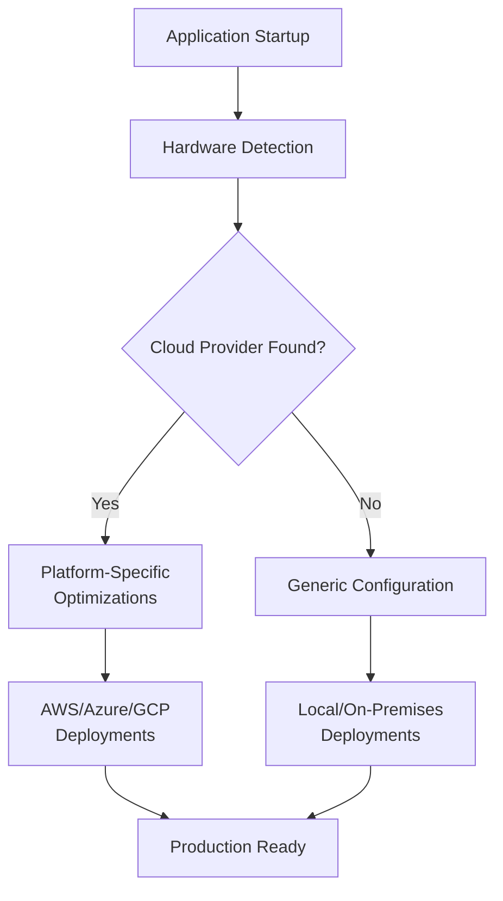
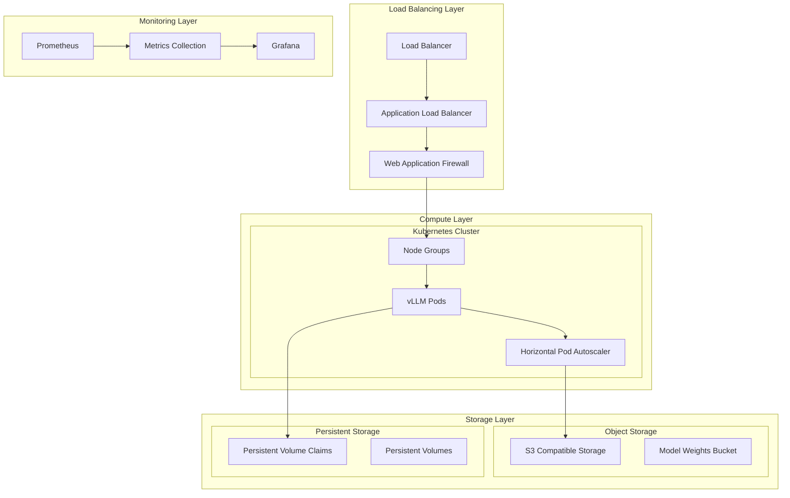
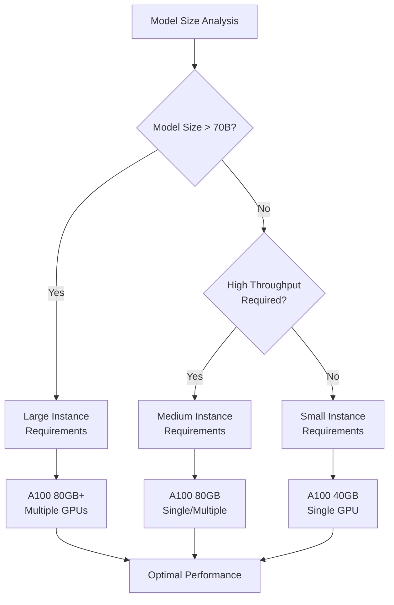
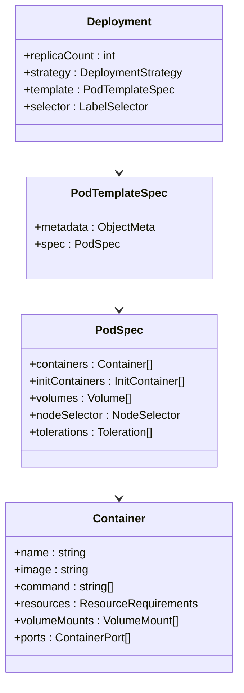
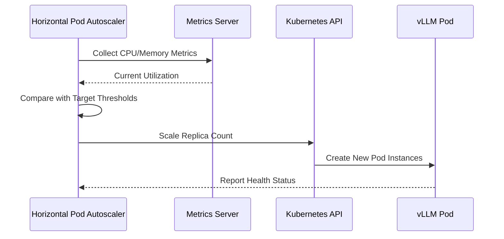
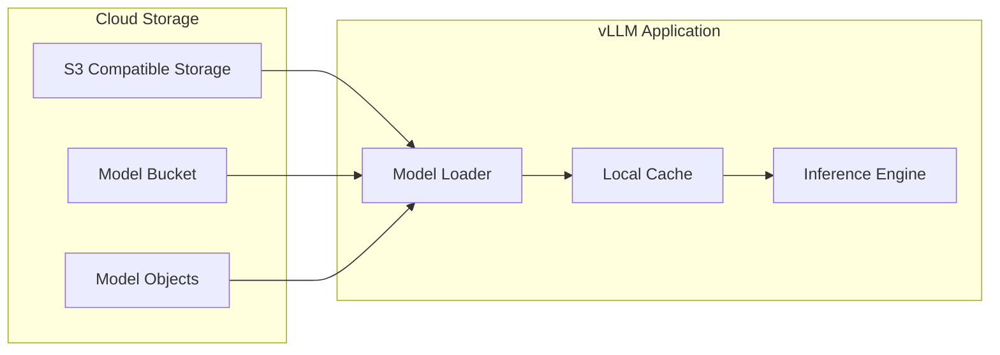
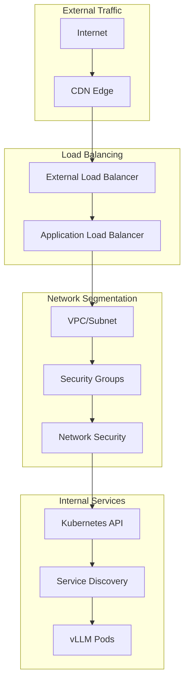
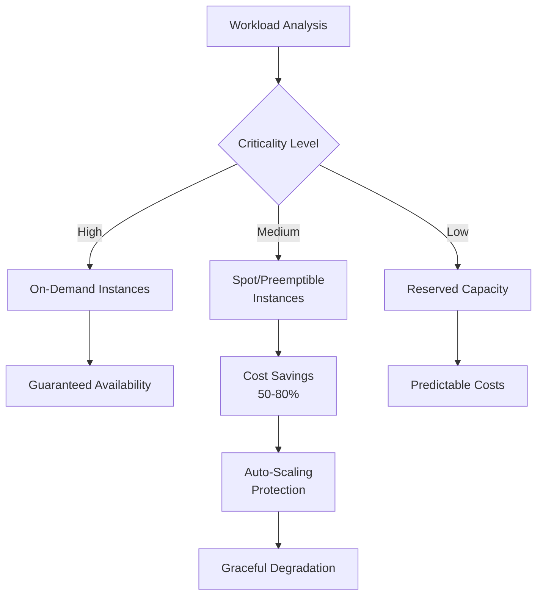
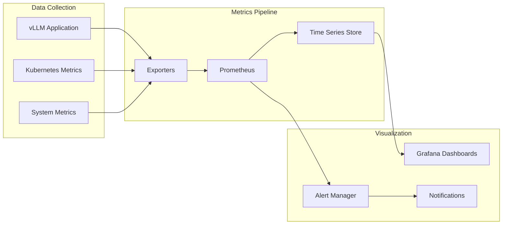

# Cloud Deployment

<cite>
**Referenced Files in This Document**
- [values.yaml](file://examples/online_serving/chart-helm/values.yaml)
- [Chart.yaml](file://examples/online_serving/chart-helm/Chart.yaml)
- [deployment.yaml](file://examples/online_serving/chart-helm/templates/deployment.yaml)
- [hpa.yaml](file://examples/online_serving/chart-helm/templates/hpa.yaml)
- [job.yaml](file://examples/online_serving/chart-helm/templates/job.yaml)
- [pvc.yaml](file://examples/online_serving/chart-helm/templates/pvc.yaml)
- [service.yaml](file://examples/online_serving/chart-helm/templates/service.yaml)
- [values.schema.json](file://examples/online_serving/chart-helm/values.schema.json)
- [prometheus.yaml](file://examples/online_serving/prometheus_grafana/prometheus.yaml)
- [docker-compose.yaml](file://examples/online_serving/prometheus_grafana/docker-compose.yaml)
- [s3_utils.py](file://vllm/transformers_utils/s3_utils.py)
- [tensorizer.py](file://vllm/model_executor/model_loader/tensorizer.py)
- [usage_lib.py](file://vllm/usage/usage_lib.py)
- [pynvml.py](file://vllm/third_party/pynvml.py)
- [README.md](file://README.md)
</cite>

## Table of Contents
1. [Introduction](#introduction)
2. [Cloud Platform Overview](#cloud-platform-overview)
3. [Infrastructure Architecture](#infrastructure-architecture)
4. [VM Instance Selection](#vm-instance-selection)
5. [Container Orchestration](#container-orchestration)
6. [Storage Solutions](#storage-solutions)
7. [Networking and Security](#networking-and-security)
8. [Cost Optimization Strategies](#cost-optimization-strategies)
9. [Performance Monitoring](#performance-monitoring)
10. [Troubleshooting Guide](#troubleshooting-guide)
11. [Best Practices](#best-practices)
12. [Conclusion](#conclusion)

## Introduction

vLLM (Very Large Language Model) is a high-performance inference engine designed for efficient large language model serving. This comprehensive guide covers cloud deployment strategies across major platforms including AWS, Google Cloud Platform (GCP), and Microsoft Azure. The deployment architecture emphasizes scalability, cost optimization, and operational excellence while leveraging cloud-native technologies for production-grade AI inference services.

The cloud deployment framework addresses key challenges in large language model serving: managing massive model weights, optimizing GPU utilization, handling variable traffic loads, and maintaining high availability. By leveraging container orchestration, automated scaling, and cloud storage solutions, this architecture provides a robust foundation for enterprise AI applications.

## Cloud Platform Overview

### Platform Detection and Compatibility

vLLM includes built-in platform detection capabilities that automatically identify cloud environments and optimize configurations accordingly. The system recognizes major cloud providers through hardware identification and environment variables.



**Diagram sources**
- [usage_lib.py](file://vllm/usage/usage_lib.py#L80-L123)

The platform detection mechanism examines system firmware information and environment variables to identify cloud environments. This enables automatic configuration adjustments for optimal performance in each cloud provider's infrastructure.

**Section sources**
- [usage_lib.py](file://vllm/usage/usage_lib.py#L80-L123)

### Major Cloud Provider Support

| Cloud Provider | Detection Method | Special Features |
|----------------|------------------|------------------|
| Amazon Web Services (AWS) | DMI vendor identification | P4/P5 instances, Spot instances |
| Google Cloud Platform (GCP) | DMI vendor identification | A2 instances, preemptible VMs |
| Microsoft Azure | DMI vendor identification | ND series, Low-priority VMs |
| Oracle Cloud Infrastructure (OCI) | DMI vendor identification | Ampere/A1 instances |

## Infrastructure Architecture

### High-Level Deployment Architecture

The cloud deployment architecture follows a multi-tier approach with clear separation of concerns across compute, storage, networking, and monitoring layers.



**Diagram sources**
- [deployment.yaml](file://examples/online_serving/chart-helm/templates/deployment.yaml#L1-L122)
- [hpa.yaml](file://examples/online_serving/chart-helm/templates/hpa.yaml#L1-L31)

### Component Responsibilities

Each architectural layer serves specific functions in the cloud deployment:

- **Load Balancing Layer**: Distributes traffic, handles SSL termination, and provides DDoS protection
- **Compute Layer**: Orchestrates vLLM workloads with automatic scaling capabilities
- **Storage Layer**: Manages model artifacts and persistent data with high durability
- **Monitoring Layer**: Provides real-time visibility into system performance and health

## VM Instance Selection

### GPU Instance Recommendations

Selecting appropriate GPU instances is crucial for vLLM deployment performance and cost optimization. The choice depends on model size, inference requirements, and budget constraints.

#### AWS Instance Types

| Instance Family | GPU Type | VRAM | Use Cases | Cost Efficiency |
|----------------|----------|------|-----------|-----------------|
| P4de.xlarge | A100 | 80GB | Large models, high throughput | Premium |
| P4d.24xlarge | A100 | 80GB | Enterprise workloads | Premium |
| P4de.24xlarge | A100 | 80GB | Maximum performance | Premium |
| P4de.24xlarge | H100 | 80GB | Latest generation, highest throughput | Premium |

#### GCP Instance Types

| Instance Family | GPU Type | VRAM | Use Cases | Cost Efficiency |
|----------------|----------|------|-----------|-----------------|
| A2-highgpu-1g | A100 | 80GB | Balanced performance | Standard |
| A2-highgpu-2g | A100 | 80GB | Medium workloads | Standard |
| A2-highgpu-4g | A100 | 80GB | Large deployments | Standard |
| A2-highgpu-8g | A100 | 80GB | Enterprise scale | Standard |

#### Azure Instance Types

| Instance Family | GPU Type | VRAM | Use Cases | Cost Efficiency |
|----------------|----------|------|-----------|-----------------|
| ND96asr_v4 | A100 | 80GB | High-performance inference | Premium |
| ND96amsr_A100_v4 | A100 | 80GB | Maximum throughput | Premium |
| NC96ads_A100_v4 | A100 | 80GB | Balanced compute/storage | Premium |

### Instance Configuration Guidelines



**Section sources**
- [values.yaml](file://examples/online_serving/chart-helm/values.yaml#L28-L44)

## Container Orchestration

### Kubernetes Deployment Strategy

The Helm chart provides a comprehensive deployment solution for Kubernetes environments, featuring automated resource management, scaling policies, and lifecycle management.

#### Core Deployment Configuration

The deployment template defines essential container specifications including resource requirements, security contexts, and runtime configurations.



**Diagram sources**
- [deployment.yaml](file://examples/online_serving/chart-helm/templates/deployment.yaml#L1-L122)

#### Resource Management

The deployment configuration includes precise resource specifications for optimal cluster utilization and pod scheduling.

**Section sources**
- [deployment.yaml](file://examples/online_serving/chart-helm/templates/deployment.yaml#L1-L122)
- [values.yaml](file://examples/online_serving/chart-helm/values.yaml#L28-L44)

### Horizontal Pod Autoscaling

Automatic scaling ensures optimal resource utilization while maintaining performance SLAs across varying traffic loads.



**Diagram sources**
- [hpa.yaml](file://examples/online_serving/chart-helm/templates/hpa.yaml#L1-L31)

**Section sources**
- [hpa.yaml](file://examples/online_serving/chart-helm/templates/hpa.yaml#L1-L31)
- [values.yaml](file://examples/online_serving/chart-helm/values.yaml#L50-L60)

### Init Containers for Model Loading

The deployment includes sophisticated init container logic for downloading and preparing model artifacts before the main application starts.

**Section sources**
- [job.yaml](file://examples/online_serving/chart-helm/templates/job.yaml#L1-L37)
- [deployment.yaml](file://examples/online_serving/chart-helm/templates/deployment.yaml#L75-L104)

## Storage Solutions

### Cloud Object Storage Integration

vLLM integrates seamlessly with cloud object storage systems for efficient model artifact management and distribution.

#### S3-Compatible Storage Configuration

The storage abstraction layer supports multiple cloud providers through standardized S3 APIs, enabling seamless migration between cloud environments.



**Diagram sources**
- [s3_utils.py](file://vllm/transformers_utils/s3_utils.py#L1-L133)
- [tensorizer.py](file://vllm/model_executor/model_loader/tensorizer.py#L152-L175)

#### Storage Performance Considerations

| Storage Type | Throughput | Latency | Use Case | Cost |
|-------------|------------|---------|----------|------|
| SSD Block Storage | High | Low | Active model data | Medium |
| Object Storage | Very High | Medium | Model artifacts | Low |
| Local NVMe | Ultra High | Ultra Low | High-frequency access | High |

**Section sources**
- [s3_utils.py](file://vllm/transformers_utils/s3_utils.py#L1-L133)
- [values.yaml](file://examples/online_serving/chart-helm/values.yaml#L132-L135)

### Persistent Volume Management

Persistent storage ensures data durability and consistency across pod restarts and migrations.

**Section sources**
- [pvc.yaml](file://examples/online_serving/chart-helm/templates/pvc.yaml#L1-L20)

## Networking and Security

### Network Architecture

The cloud deployment implements a multi-layered networking strategy with proper segmentation and security controls.



### Security Group Configuration

Proper security group rules ensure minimal attack surface while maintaining operational functionality.

| Port Range | Protocol | Purpose | Source Restriction |
|------------|----------|---------|-------------------|
| 80, 443 | TCP | HTTP/HTTPS Traffic | Internet (restricted) |
| 8000 | TCP | vLLM API | Internal only |
| 9090 | TCP | Prometheus | Monitoring network |
| 3000 | TCP | Grafana | Admin network |

### Load Balancer Configuration

Application load balancers provide traffic distribution, SSL termination, and health checking capabilities.

**Section sources**
- [service.yaml](file://examples/online_serving/chart-helm/templates/service.yaml#L1-L20)

## Cost Optimization Strategies

### Spot/Preemptible Instance Utilization

Cost optimization strategies leverage spot instances and preemptible VMs for non-critical workloads while maintaining availability through redundancy.



### Auto-Scaling Strategies

Intelligent scaling policies balance performance requirements with cost constraints.

| Scaling Metric | Threshold | Action | Cool-down Period |
|---------------|-----------|--------|------------------|
| CPU Utilization | 70% | Scale Up | 5 minutes |
| Memory Utilization | 80% | Scale Up | 5 minutes |
| Request Queue Length | 100 requests | Scale Up | 2 minutes |
| Response Time | >2 seconds | Scale Up | 3 minutes |

**Section sources**
- [values.yaml](file://examples/online_serving/chart-helm/values.yaml#L50-L60)

### Resource Right-Sizing

Continuous monitoring and optimization ensure optimal resource allocation across different workload patterns.

## Performance Monitoring

### Observability Stack

The monitoring infrastructure provides comprehensive visibility into system performance, resource utilization, and application health.



**Diagram sources**
- [prometheus.yaml](file://examples/online_serving/prometheus_grafana/prometheus.yaml#L1-L11)
- [docker-compose.yaml](file://examples/online_serving/prometheus_grafana/docker-compose.yaml#L1-L19)

### Key Performance Indicators

Critical metrics for monitoring vLLM deployments include:

| Metric Category | Key Indicators | Alert Thresholds |
|----------------|----------------|------------------|
| Throughput | Requests per second, Tokens per second | < 80% of baseline |
| Latency | P50, P95, P99 response times | > 2 seconds |
| Resource Utilization | CPU, Memory, GPU utilization | > 85% sustained |
| Error Rates | 4xx, 5xx error percentages | > 1% error rate |

**Section sources**
- [prometheus.yaml](file://examples/online_serving/prometheus_grafana/prometheus.yaml#L1-L11)
- [docker-compose.yaml](file://examples/online_serving/prometheus_grafana/docker-compose.yaml#L1-L19)

### GPU Performance Monitoring

Advanced GPU monitoring capabilities track compute utilization, memory usage, and interconnect performance.

**Section sources**
- [pynvml.py](file://vllm/third_party/pynvml.py#L894-L5617)

## Troubleshooting Guide

### Common Cloud-Specific Issues

#### IP Whitelisting Problems

Network connectivity issues often stem from incorrect security group configurations or IP whitelisting restrictions.

**Symptoms:**
- Connection timeouts to cloud services
- Authentication failures
- DNS resolution problems

**Resolution Steps:**
1. Verify security group rules allow outbound internet access
2. Check VPC endpoint configurations for S3/Aurora access
3. Validate IAM role permissions for service access
4. Review network ACL settings for subnet-level restrictions

#### VPC Configuration Issues

VPC misconfigurations can prevent proper pod networking and service discovery.

**Common Problems:**
- CIDR block conflicts
- Route table misconfigurations
- NAT gateway limitations
- Private DNS resolution failures

#### Storage Access Issues

Model loading failures often relate to storage permission or network connectivity problems.

**Diagnostic Commands:**
```bash
# Test S3 connectivity
aws s3 ls s3://your-bucket-name/

# Check IAM permissions
aws sts get-caller-identity

# Verify network connectivity
curl -I https://s3.amazonaws.com
```

### Performance Troubleshooting

#### GPU Utilization Issues

Low GPU utilization can indicate bottlenecks in data loading, memory management, or workload distribution.

**Investigation Checklist:**
- Monitor GPU memory usage patterns
- Check for memory fragmentation
- Analyze data preprocessing bottlenecks
- Verify batch size optimization

#### Network Bandwidth Constraints

Insufficient network bandwidth can limit model loading speed and inference throughput.

**Monitoring Metrics:**
- Network ingress/egress rates
- Storage transfer speeds
- Inter-node communication latency
- CDN hit ratios

**Section sources**
- [pynvml.py](file://vllm/third_party/pynvml.py#L894-L5617)

## Best Practices

### Deployment Configuration

#### Resource Allocation Guidelines

Proper resource sizing prevents both under-provisioning and waste:

- **CPU**: Start with 4 cores per vLLM instance, adjust based on CPU utilization
- **Memory**: Allocate 16GB per GPU, considering model size and batch requirements
- **GPU**: Match GPU count to model parallelism requirements
- **Storage**: Provision 2x model size for caching and temporary files

#### Security Hardening

Implement comprehensive security measures:

- Use dedicated service accounts with minimal privileges
- Enable network policies for pod-to-pod communication
- Regularly rotate credentials and certificates
- Implement secrets management for sensitive data
- Enable audit logging for compliance requirements

#### High Availability Design

Ensure system resilience through proper redundancy:

- Deploy across multiple availability zones
- Implement graceful degradation strategies
- Configure health checks and circuit breakers
- Plan for disaster recovery scenarios

### Operational Excellence

#### Monitoring and Alerting

Establish comprehensive monitoring coverage:

- Application-level metrics (response times, error rates)
- Infrastructure metrics (CPU, memory, GPU utilization)
- Business metrics (throughput, revenue impact)
- Proactive alerting for capacity planning

#### Maintenance Procedures

Regular maintenance ensures system reliability:

- Automated patch management for base images
- Scheduled model updates and validation
- Capacity planning reviews
- Security vulnerability assessments

## Conclusion

The cloud deployment architecture for vLLM provides a robust, scalable, and cost-effective foundation for large language model serving. By leveraging cloud-native technologies and best practices, organizations can deploy production-ready AI inference services with confidence in performance, reliability, and operational efficiency.

Key success factors include proper instance selection based on workload characteristics, intelligent cost optimization through spot/preemptible instances, comprehensive monitoring for operational excellence, and security hardening for enterprise compliance. The modular architecture allows for easy customization and extension based on specific organizational requirements.

Future enhancements may include advanced machine learning operations (MLOps) integration, enhanced multi-cloud capabilities, and specialized optimizations for emerging hardware architectures. The foundation provided by this deployment guide enables organizations to focus on their core AI applications while benefiting from proven cloud infrastructure patterns.