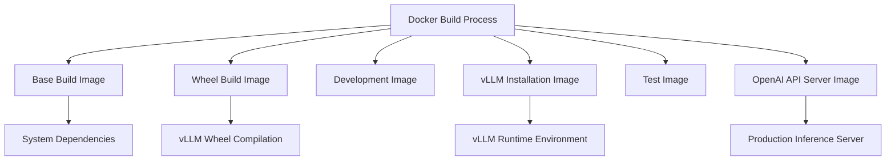
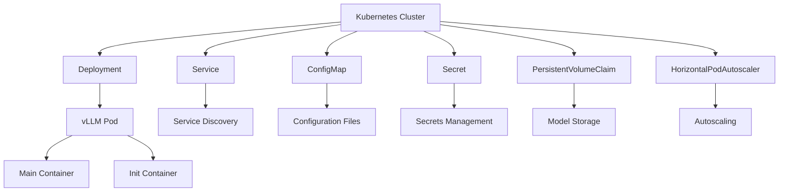
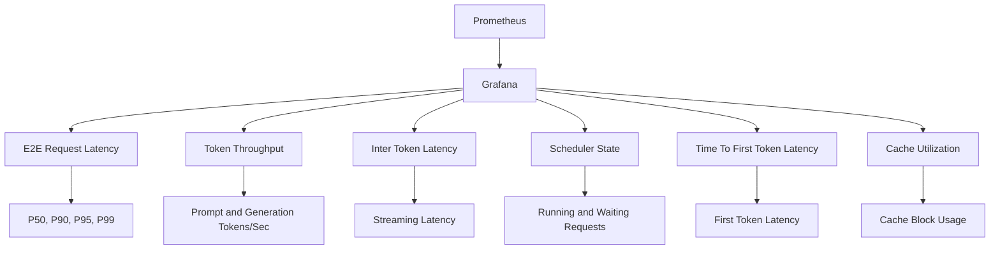

# Deployment

<cite>
**Referenced Files in This Document**   
- [Dockerfile](file://docker/Dockerfile)
- [deployment.yaml](file://examples/online_serving/chart-helm/templates/deployment.yaml)
- [values.yaml](file://examples/online_serving/chart-helm/values.yaml)
- [docker-compose.yaml](file://examples/online_serving/prometheus_grafana/docker-compose.yaml)
- [prometheus.yaml](file://examples/online_serving/prometheus_grafana/prometheus.yaml)
- [grafana.json](file://examples/online_serving/prometheus_grafana/grafana.json)
- [sagemaker-entrypoint.sh](file://examples/online_serving/sagemaker-entrypoint.sh)
- [common.txt](file://requirements/common.txt)
- [cuda.txt](file://requirements/cuda.txt)
- [envs.py](file://vllm/envs.py)
</cite>

## Table of Contents
1. [Introduction](#introduction)
2. [Docker Deployment](#docker-deployment)
3. [Kubernetes Deployment](#kubernetes-deployment)
4. [Cloud Deployment Options](#cloud-deployment-options)
5. [Performance Tuning](#performance-tuning)
6. [Monitoring and Logging](#monitoring-and-logging)
7. [Security Considerations](#security-considerations)
8. [Backup and Disaster Recovery](#backup-and-disaster-recovery)
9. [Conclusion](#conclusion)

## Introduction

vLLM provides a high-throughput and memory-efficient inference engine for large language models (LLMs). This document outlines various deployment options and production considerations for running vLLM in different environments. The goal is to enable reliable, scalable, and monitored inference services that can handle diverse workloads and hardware configurations.

vLLM supports multiple deployment methods including Docker containers, Kubernetes orchestration, and cloud platforms such as AWS, GCP, and Azure. Each deployment option offers different advantages in terms of scalability, resource utilization, and operational complexity. The choice of deployment method depends on factors such as infrastructure requirements, team expertise, and operational needs.

The deployment architecture focuses on providing low-latency inference while maximizing GPU utilization through advanced techniques like PagedAttention, continuous batching, and tensor parallelism. Proper configuration and optimization are essential to achieve optimal performance and reliability in production environments.

**Section sources**
- [README.md](file://README.md#L1-L100)

## Docker Deployment

### Container Configuration and Optimization

vLLM provides a comprehensive Dockerfile that enables containerized deployment of the inference server. The Dockerfile is designed to support both development and production environments with optimized configurations for different use cases.

The Docker build process uses a multi-stage approach with separate stages for building, testing, and runtime environments. This ensures that the final image contains only the necessary components for running vLLM, reducing image size and attack surface. The build process supports various configuration options through build arguments:

- `CUDA_VERSION`: Specifies the CUDA version for GPU acceleration
- `PYTHON_VERSION`: Sets the Python version for the runtime environment
- `BUILD_BASE_IMAGE`: Allows customization of the base image for build operations
- `FINAL_BASE_IMAGE`: Specifies the base image for the final runtime environment

The Dockerfile includes optimizations for different hardware architectures and deployment scenarios. It supports installation of optional components like KV-connectors through the `INSTALL_KV_CONNECTORS` flag. The image also includes pre-compiled kernel caches from FlashInfer to improve JIT compilation performance at runtime.

For production deployments, the Docker image can be customized with specific model weights and configuration files. The entrypoint is configured to run the OpenAI-compatible API server by default, making it easy to integrate with existing applications and tools.



**Diagram sources**
- [Dockerfile](file://docker/Dockerfile#L1-L545)

### Running vLLM with Docker

To deploy vLLM using Docker, pull the official image from Docker Hub:

```bash
docker pull vllm/vllm-openai:latest
```

For local development and testing, run the container with basic configuration:

```bash
docker run --gpus all -p 8000:8000 \
  -v /path/to/models:/models \
  vllm/vllm-openai:latest \
  --model /models/llama-2-7b-chat-hf \
  --host 0.0.0.0 \
  --port 8000
```

For production deployments, consider using Docker Compose to manage multiple services and configurations:

```yaml
version: '3'
services:
  vllm:
    image: vllm/vllm-openai:latest
    deploy:
      resources:
        reservations:
          devices:
            - driver: nvidia
              count: 1
              capabilities: [gpu]
    ports:
      - "8000:8000"
    volumes:
      - ./models:/models
    command:
      - "--model"
      - "/models/llama-2-7b-chat-hf"
      - "--tensor-parallel-size"
      - "1"
      - "--max-model-len"
      - "4096"
```

**Section sources**
- [Dockerfile](file://docker/Dockerfile#L1-L545)
- [common.txt](file://requirements/common.txt#L1-L52)
- [cuda.txt](file://requirements/cuda.txt#L1-L14)

## Kubernetes Deployment

### Helm Chart Configuration

vLLM provides a Helm chart for Kubernetes deployment, located in `examples/online_serving/chart-helm`. The Helm chart enables easy deployment and management of vLLM instances in Kubernetes clusters with support for autoscaling, persistent storage, and service discovery.

The Helm chart configuration is defined in `values.yaml`, which contains various parameters for customizing the deployment:

- `image`: Specifies the container image and tag
- `replicaCount`: Sets the number of pod replicas
- `resources`: Defines CPU, memory, and GPU resource requests and limits
- `autoscaling`: Configures horizontal pod autoscaling based on CPU or memory utilization
- `extraInit`: Configures init containers for model downloading and preparation

The deployment template includes support for init containers that can download models from external storage before the main container starts. This ensures that models are available locally, reducing startup time and improving reliability.



**Diagram sources**
- [deployment.yaml](file://examples/online_serving/chart-helm/templates/deployment.yaml#L1-L110)
- [service.yaml](file://examples/online_serving/chart-helm/templates/service.yaml#L1-L14)
- [values.yaml](file://examples/online_serving/chart-helm/values.yaml#L1-L175)

### Deployment Configuration

The Helm chart supports various deployment configurations for different use cases. For production deployments, configure resource limits and requests based on the model size and expected workload:

```yaml
resources:
  requests:
    cpu: 4
    memory: 16Gi
    nvidia.com/gpu: 1
  limits:
    cpu: 4
    memory: 16Gi
    nvidia.com/gpu: 1
```

Enable autoscaling to handle variable workloads:

```yaml
autoscaling:
  enabled: true
  minReplicas: 1
  maxReplicas: 10
  targetCPUUtilizationPercentage: 80
```

Configure init containers for model downloading from S3 or other storage systems:

```yaml
extraInit:
  modelDownload:
    enabled: true
    image:
      repository: amazon/aws-cli
      tag: "2.6.4"
    waitContainer:
      command: ["/bin/bash"]
      args:
        - "-eucx"
        - "while aws --endpoint-url $S3_ENDPOINT_URL s3 sync --dryrun s3://$S3_BUCKET_NAME/$S3_PATH /data | grep -q download; do sleep 10; done"
```

The deployment also supports custom configurations through ConfigMaps and secrets management for API keys and other sensitive information.

**Section sources**
- [values.yaml](file://examples/online_serving/chart-helm/values.yaml#L1-L175)
- [deployment.yaml](file://examples/online_serving/chart-helm/templates/deployment.yaml#L1-L110)
- [hpa.yaml](file://examples/online_serving/chart-helm/templates/hpa.yaml#L1-L31)

## Cloud Deployment Options

### AWS Deployment

vLLM can be deployed on AWS using various services such as EC2, ECS, and SageMaker. The deployment leverages AWS's scalable infrastructure and managed services for reliable inference serving.

For EC2 deployment, use GPU-optimized instances such as p3, p4, or g5 series with appropriate AMIs that include NVIDIA drivers and CUDA toolkit. Configure the instances with sufficient storage for model weights and ephemeral storage for caching.

The Helm chart can be used with Amazon EKS for Kubernetes-based deployments. Configure the cluster with GPU node groups and use Amazon EBS for persistent storage of models. Integrate with Amazon S3 for model storage and retrieval:

```yaml
extraInit:
  modelDownload:
    enabled: true
    image:
      repository: amazon/aws-cli
      tag: "2.6.4"
    waitContainer:
      command: ["/bin/bash"]
      args:
        - "-eucx"
        - "while aws --endpoint-url $S3_ENDPOINT_URL s3 sync --dryrun s3://$S3_BUCKET_NAME/$S3_PATH /data | grep -q download; do sleep 10; done"
```

For serverless deployment options, consider using Amazon SageMaker with the provided entrypoint script:

```bash
./sagemaker-entrypoint.sh
```

This enables managed inference with automatic scaling, monitoring, and integration with other AWS services.

**Section sources**
- [sagemaker-entrypoint.sh](file://examples/online_serving/sagemaker-entrypoint.sh#L1-L50)
- [values.yaml](file://examples/online_serving/chart-helm/values.yaml#L1-L175)

### GCP and Azure Deployment

vLLM can be deployed on Google Cloud Platform (GCP) using Compute Engine with GPU instances or Google Kubernetes Engine (GKE). Similar to AWS, use GPU-optimized machine types such as A2 or N1 series with appropriate CUDA configurations.

For Azure deployments, use Azure Kubernetes Service (AKS) with GPU-enabled node pools. Configure the cluster with NVIDIA GPU operators and appropriate device plugins. Use Azure Blob Storage for model storage and retrieval.

Infrastructure-as-code templates can be created using Terraform or Pulumi for consistent deployments across cloud providers. Example Terraform configuration for GCP:

```hcl
resource "google_container_cluster" "vllm_cluster" {
  name     = "vllm-cluster"
  location = "us-central1"

  node_pool {
    name       = "gpu-pool"
    node_count = 1

    node_config {
      machine_type = "a2-highgpu-1g"
      oauth_scopes = [
        "https://www.googleapis.com/auth/cloud-platform"
      ]
      metadata = {
        disable-legacy-endpoints = "true"
      }
      labels = {
        accelerator = "nvidia-tesla-a100"
      }
      taint {
        key    = "nvidia.com/gpu"
        value  = "present"
        effect = "NO_SCHEDULE"
      }
    }
  }
}
```

Cross-cloud deployment considerations include:
- Consistent network policies and security groups
- Unified monitoring and logging configuration
- Standardized model storage and retrieval patterns
- Global load balancing for multi-region deployments

**Section sources**
- [values.yaml](file://examples/online_serving/chart-helm/values.yaml#L1-L175)
- [envs.py](file://vllm/envs.py#L166-L321)

## Performance Tuning

### Hardware Optimization

vLLM provides various configuration options for optimizing performance on different hardware configurations. The performance characteristics depend on factors such as GPU architecture, memory bandwidth, and interconnect topology.

For NVIDIA GPUs, configure the power profile for LLM inference:

```python
NVML_POWER_PROFILE_LLM_INFERENCE = 6
```

This optimizes the GPU for inference workloads by balancing power consumption and performance. Adjust the tensor parallelism size based on the number of available GPUs:

```bash
vllm serve --tensor-parallel-size N
```

Where N is the number of GPUs available for model parallelism. For multi-node deployments, configure the distributed backend:

```bash
vllm serve --distributed-executor-backend ray
```

This enables scaling across multiple nodes using Ray for distributed coordination.

### Workload Pattern Optimization

Different workload patterns require specific optimization strategies:

**High-throughput batch processing:**
- Increase max_num_seqs to maximize batch size
- Use continuous batching to combine multiple requests
- Optimize block size for memory efficiency

```bash
vllm serve --max-num-seqs 256 --block-size 16
```

**Low-latency interactive applications:**
- Prioritize request scheduling for faster response times
- Use speculative decoding to reduce latency
- Optimize KV cache management for memory efficiency

```bash
vllm serve --scheduler-delay-factor 0.1 --enable-chunked-prefill
```

**Memory-constrained environments:**
- Use quantization techniques like AWQ or GPTQ
- Enable prefix caching to reduce memory usage
- Configure appropriate max_model_len based on available memory

```bash
vllm serve --quantization awq --enable-prefix-caching
```

Monitor performance metrics to identify bottlenecks and adjust configuration accordingly. Key metrics include:
- GPU utilization
- Memory usage
- Request latency
- Token throughput
- Cache hit rate

**Section sources**
- [envs.py](file://vllm/envs.py#L166-L321)
- [config.py](file://vllm/config/model.py#L1-L100)
- [scheduler.py](file://vllm/config/scheduler.py#L1-L50)

## Monitoring and Logging

### Prometheus and Grafana Integration

vLLM provides built-in support for Prometheus metrics, enabling comprehensive monitoring of inference performance and system health. The metrics are exposed on the `/metrics` endpoint and can be scraped by Prometheus.

The example configuration in `examples/online_serving/prometheus_grafana` demonstrates how to set up monitoring with Prometheus and Grafana:

```yaml
# prometheus.yaml
global:
  scrape_interval: 5s
  evaluation_interval: 30s

scrape_configs:
  - job_name: vllm
    static_configs:
      - targets:
          - 'host.docker.internal:8000'
```

This configuration scrapes metrics from the vLLM server running on localhost. For production deployments, update the target to the appropriate service endpoint.

The Grafana dashboard (`grafana.json`) provides visualizations for key performance metrics:



**Diagram sources**
- [prometheus.yaml](file://examples/online_serving/prometheus_grafana/prometheus.yaml#L1-L11)
- [grafana.json](file://examples/online_serving/prometheus_grafana/grafana.json#L1-L800)
- [docker-compose.yaml](file://examples/online_serving/prometheus_grafana/docker-compose.yaml#L1-L19)

### Key Performance Metrics

vLLM exposes various metrics for monitoring inference performance:

**Latency metrics:**
- `vllm:e2e_request_latency_seconds`: End-to-end request latency
- `vllm:time_to_first_token_seconds`: Time to first token latency
- `vllm:inter_token_latency_seconds`: Inter-token latency for streaming responses

**Throughput metrics:**
- `vllm:prompt_tokens_total`: Total prompt tokens processed
- `vllm:generation_tokens_total`: Total generation tokens produced
- `vllm:request_throughput`: Number of requests processed per second

**Resource utilization metrics:**
- `vllm:num_requests_running`: Number of currently running requests
- `vllm:num_requests_waiting`: Number of requests waiting in queue
- `vllm:gpu_utilization`: GPU utilization percentage
- `vllm:cache_usage`: KV cache utilization

**Error metrics:**
- `vllm:request_failure_count`: Number of failed requests
- `vllm:tokenization_error_count`: Number of tokenization errors
- `vllm:generation_error_count`: Number of generation errors

Set up alerts for critical metrics to detect and respond to performance issues promptly. For example, alert when:
- End-to-end latency exceeds service level objectives
- Error rate exceeds acceptable thresholds
- GPU utilization is consistently low (indicating underutilization)
- Request queue length grows beyond capacity

**Section sources**
- [grafana.json](file://examples/online_serving/prometheus_grafana/grafana.json#L1-L800)
- [prometheus.yaml](file://examples/online_serving/prometheus_grafana/prometheus.yaml#L1-L11)
- [common.txt](file://requirements/common.txt#L1-L52)

## Security Considerations

### Container Security

The vLLM Docker image follows security best practices to minimize attack surface and protect against common vulnerabilities:

- Uses minimal base images with only necessary dependencies
- Runs containers with non-root users where possible
- Implements principle of least privilege for file permissions
- Regularly updates dependencies to address security vulnerabilities

Configure appropriate security contexts for Kubernetes deployments:

```yaml
securityContext:
  runAsNonRoot: true
  runAsUser: 1000
  allowPrivilegeEscalation: false
  capabilities:
    drop:
      - ALL
```

Use network policies to restrict traffic between services and implement mutual TLS for service-to-service communication.

### Data Protection

Protect sensitive data in vLLM deployments through:

- Encryption of model weights at rest and in transit
- Secure storage of API keys and credentials using Kubernetes secrets or cloud provider secret management services
- Input validation and sanitization to prevent prompt injection attacks
- Rate limiting to prevent abuse and denial-of-service attacks

Configure environment variables for security settings:

```bash
VLLM_ALLOW_INSECURE_SERIALIZATION=False
VLLM_USE_SSL=True
VLLM_SSL_KEYFILE=/path/to/key.pem
VLLM_SSL_CERTFILE=/path/to/cert.pem
```

Implement proper access controls and authentication for the API endpoints. Use API keys, OAuth, or other authentication mechanisms to control access to the inference service.

**Section sources**
- [Dockerfile](file://docker/Dockerfile#L1-L545)
- [envs.py](file://vllm/envs.py#L166-L321)
- [SECURITY.md](file://SECURITY.md#L1-L12)

## Backup and Disaster Recovery

### Model Storage Strategies

Implement robust backup strategies for model weights and configuration files:

- Store model weights in durable object storage (S3, GCS, Azure Blob)
- Use versioning to track model iterations and enable rollback
- Implement cross-region replication for disaster recovery
- Regularly test backup restoration procedures

For Kubernetes deployments, use persistent volume claims with appropriate storage classes:

```yaml
apiVersion: v1
kind: PersistentVolumeClaim
metadata:
  name: vllm-model-storage
spec:
  accessModes:
    - ReadWriteOnce
  resources:
    requests:
      storage: 1Ti
  storageClassName: premium-rwo
```

### High Availability Configuration

Design vLLM deployments for high availability:

- Deploy across multiple availability zones
- Use multiple replicas with proper load balancing
- Implement health checks and readiness probes
- Configure appropriate pod disruption budgets

```yaml
readinessProbe:
  initialDelaySeconds: 5
  periodSeconds: 5
  failureThreshold: 3
  httpGet:
    path: /health
    port: 8000

livenessProbe:
  initialDelaySeconds: 15
  periodSeconds: 10
  failureThreshold: 3
  httpGet:
    path: /health
    port: 8000

podDisruptionBudget:
  maxUnavailable: 1
```

Implement monitoring and alerting to detect and respond to failures promptly. Use automated recovery procedures where possible, but maintain manual intervention options for complex failure scenarios.

**Section sources**
- [values.yaml](file://examples/online_serving/chart-helm/values.yaml#L1-L175)
- [pvc.yaml](file://examples/online_serving/chart-helm/templates/pvc.yaml#L1-L13)
- [poddisruptionbudget.yaml](file://examples/online_serving/chart-helm/templates/poddisruptionbudget.yaml#L1-L7)

## Conclusion

vLLM provides flexible deployment options for running large language model inference in various environments. From Docker containers to Kubernetes clusters and cloud platforms, vLLM supports scalable and reliable inference services.

Key considerations for production deployments include:
- Proper resource allocation and performance tuning
- Comprehensive monitoring and alerting
- Security best practices for container and data protection
- Robust backup and disaster recovery procedures
- High availability configuration for critical applications

By following the deployment patterns and best practices outlined in this document, organizations can deploy vLLM instances that are reliable, scalable, and performant. Regular monitoring and optimization are essential to maintain optimal performance as workloads and requirements evolve.

The choice of deployment method depends on specific requirements such as scalability needs, operational expertise, and infrastructure constraints. Organizations should evaluate their requirements and choose the deployment option that best meets their needs while considering factors such as cost, complexity, and maintenance overhead.