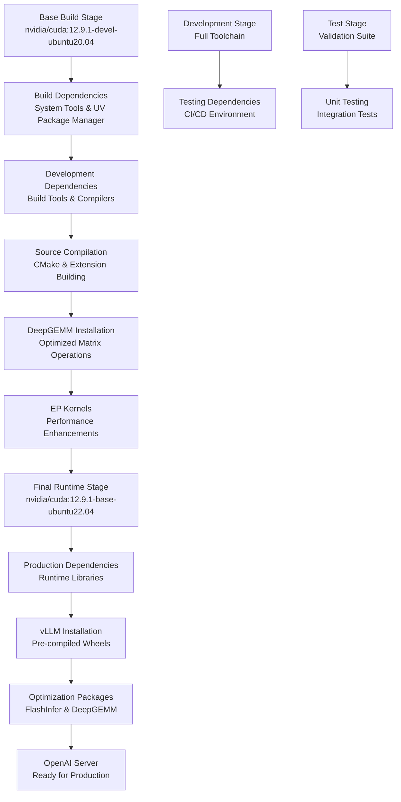
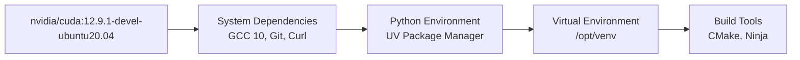
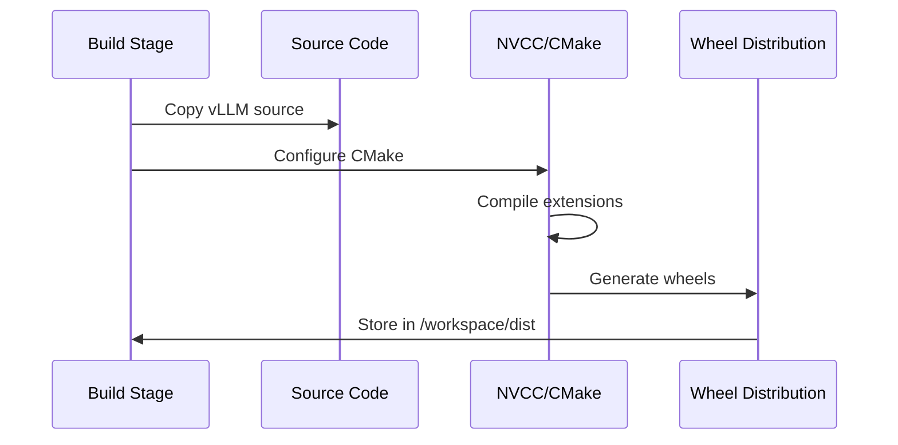
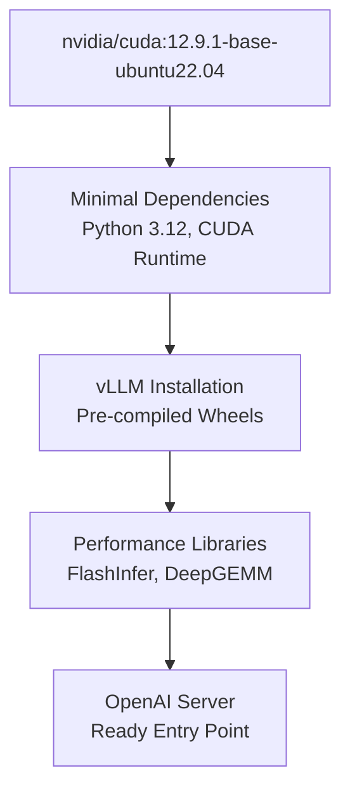
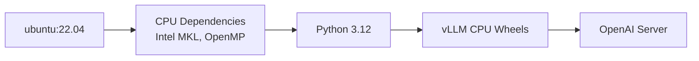
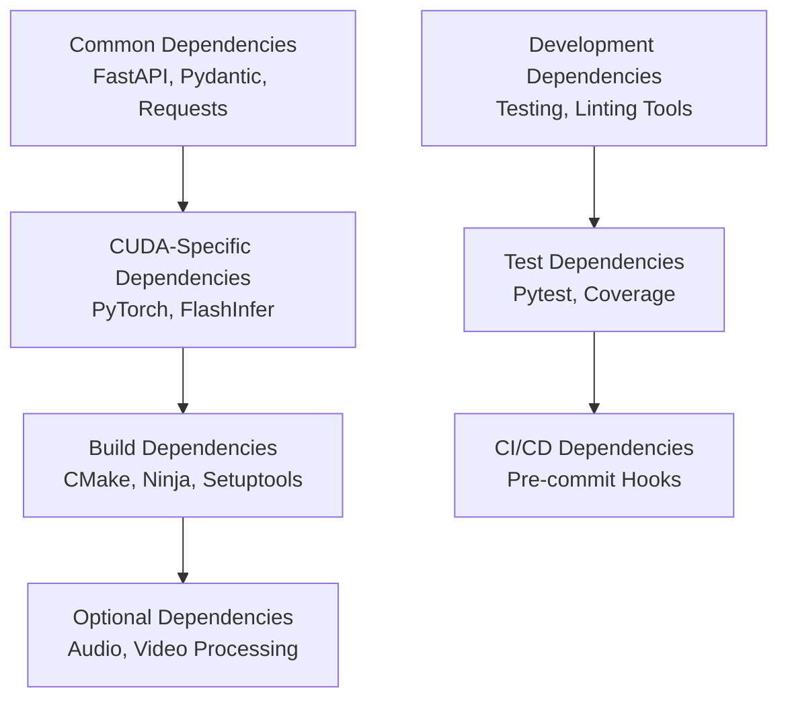
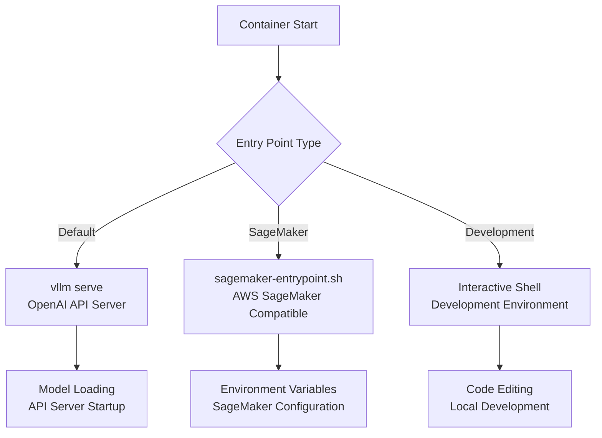
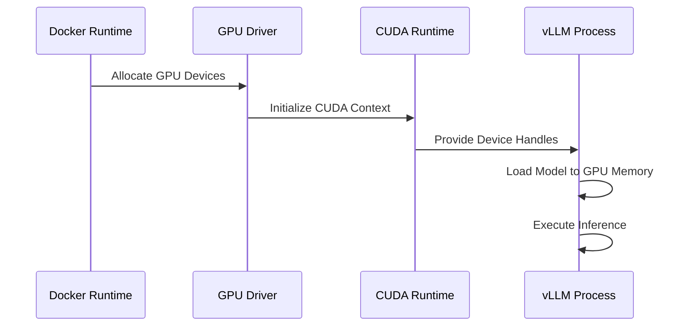
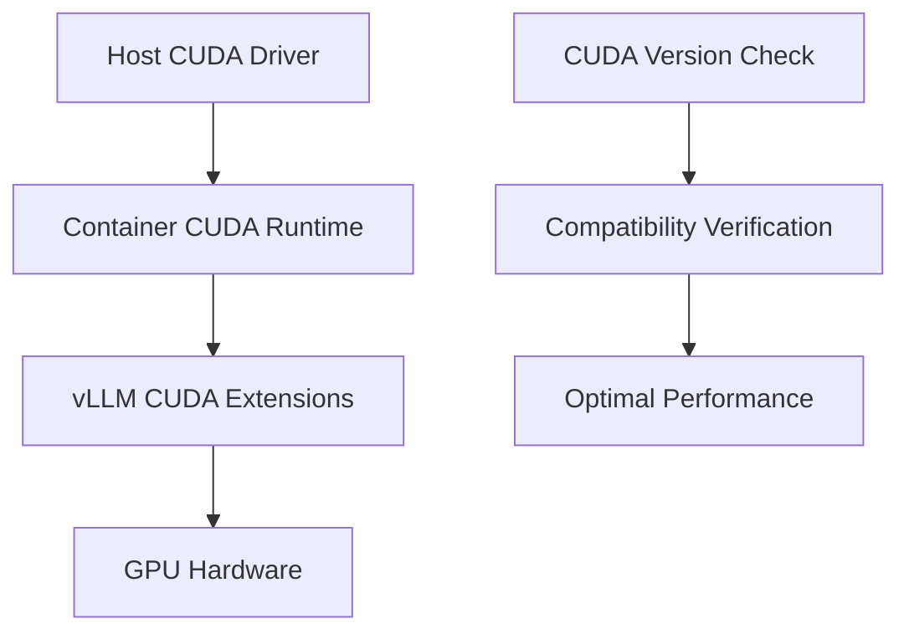

# Docker Deployment

<cite>
**Referenced Files in This Document**
- [docker/Dockerfile](file://docker/Dockerfile)
- [docker/Dockerfile.cpu](file://docker/Dockerfile.cpu)
- [requirements/cuda.txt](file://requirements/cuda.txt)
- [requirements/common.txt](file://requirements/common.txt)
- [requirements/build.txt](file://requirements/build.txt)
- [setup.py](file://setup.py)
- [examples/online_serving/sagemaker-entrypoint.sh](file://examples/online_serving/sagemaker-entrypoint.sh)
- [examples/online_serving/prometheus_grafana/docker-compose.yaml](file://examples/online_serving/prometheus_grafana/docker-compose.yaml)
- [docs/deployment/docker.md](file://docs/deployment/docker.md)
- [README.md](file://README.md)
</cite>

## Table of Contents
1. [Introduction](#introduction)
2. [Docker Benefits for vLLM](#docker-benefits-for-vllm)
3. [Dockerfile Architecture](#dockerfile-architecture)
4. [Multi-Stage Build Process](#multi-stage-build-process)
5. [Base Image Selection](#base-image-selection)
6. [Dependency Management](#dependency-management)
7. [Container Configuration](#container-configuration)
8. [Resource Allocation](#resource-allocation)
9. [Environment Variables](#environment-variables)
10. [Volume Mounting](#volume-mounting)
11. [Security Considerations](#security-considerations)
12. [Performance Optimization](#performance-optimization)
13. [Deployment Examples](#deployment-examples)
14. [Troubleshooting](#troubleshooting)
15. [Best Practices](#best-practices)

## Introduction

Docker deployment provides a standardized, isolated, and portable way to containerize vLLM for production use. This comprehensive guide covers the complete Docker deployment process for vLLM, from basic containerization to advanced production configurations.

vLLM's Docker implementation supports multiple deployment scenarios including GPU-accelerated inference servers, CPU-only deployments, and specialized hardware configurations. The multi-stage Dockerfile architecture ensures optimal image size while maintaining build flexibility and dependency management.

## Docker Benefits for vLLM

### Consistency and Reproducibility
Docker ensures consistent environments across development, testing, and production by packaging vLLM with all dependencies in a single container. This eliminates "works on my machine" issues and provides predictable performance characteristics.

### Isolation and Security
Containers provide process isolation, preventing conflicts between different applications and system dependencies. This is particularly important for production deployments where security and stability are paramount.

### Portability
Docker containers can run consistently across different infrastructure environments, from local development machines to cloud platforms and edge devices. This portability simplifies deployment workflows and reduces environment-specific bugs.

### Resource Efficiency
Containerized deployments enable efficient resource utilization through process isolation and shared kernel capabilities. Combined with proper resource limits, this leads to cost-effective scaling.

### Scalability
Docker integrates seamlessly with orchestration platforms like Kubernetes, enabling horizontal scaling, load balancing, and automated deployment strategies for high-throughput vLLM serving.

## Dockerfile Architecture

The vLLM Dockerfile implements a sophisticated multi-stage build process designed for optimal performance and maintainability.



**Diagram sources**
- [docker/Dockerfile](file://docker/Dockerfile#L73-L545)

### Stage-Based Architecture

The Dockerfile defines multiple build stages, each serving specific purposes in the deployment pipeline:

- **Base Build Image**: Establishes the foundation with CUDA development tools and Python environment
- **Build Stage**: Compiles vLLM extensions and creates optimized wheels
- **Development Stage**: Provides tools for local development and debugging
- **Test Stage**: Enables comprehensive testing with production dependencies
- **Final Runtime Stages**: Optimized images for production deployment

**Section sources**
- [docker/Dockerfile](file://docker/Dockerfile#L73-L545)

## Multi-Stage Build Process

### Base Build Stage (Stage 1)

The first stage establishes the build environment with essential dependencies:



**Diagram sources**
- [docker/Dockerfile](file://docker/Dockerfile#L75-L125)

Key configurations in the base stage include:
- **Ubuntu 20.04 Base**: Ensures broad compatibility with older distributions
- **GCC 10 Upgrade**: Resolves compilation issues with CUTLASS kernels
- **UV Package Manager**: Provides fast Python package installation
- **Virtual Environment**: Isolates Python dependencies from system packages

### Build Stage (Stage 2)

The build stage compiles vLLM extensions and creates optimized wheels:



**Diagram sources**
- [docker/Dockerfile](file://docker/Dockerfile#L154-L235)

### Final Runtime Stage (Stage 3)

The final stage creates optimized production images:



**Diagram sources**
- [docker/Dockerfile](file://docker/Dockerfile#L296-L452)

**Section sources**
- [docker/Dockerfile](file://docker/Dockerfile#L73-L545)

## Base Image Selection

### CUDA Version Compatibility

vLLM's Dockerfile uses carefully selected base images optimized for different deployment scenarios:

| Base Image | Purpose | CUDA Version | OS Version |
|------------|---------|--------------|------------|
| `nvidia/cuda:12.9.1-devel-ubuntu20.04` | Build Environment | 12.9.1 | Ubuntu 20.04 |
| `nvidia/cuda:12.9.1-base-ubuntu22.04` | Runtime Environment | 12.9.1 | Ubuntu 22.04 |

### Alternative Base Images

The Dockerfile supports parameterized base images for enterprise environments:

```bash
# Custom base image for private registries
docker build \
    --build-arg BUILD_BASE_IMAGE=registry.acme.org/mirror/nvidia/cuda:12.9.1-devel-ubuntu20.04 \
    --build-arg FINAL_BASE_IMAGE=registry.acme.org/mirror/nvidia/cuda:12.9.1-base-ubuntu22.04 \
    -f docker/Dockerfile .
```

### CPU-Only Deployment

For CPU-only deployments, vLLM provides a specialized Dockerfile:



**Diagram sources**
- [docker/Dockerfile.cpu](file://docker/Dockerfile.cpu#L23-L202)

**Section sources**
- [docker/Dockerfile](file://docker/Dockerfile#L8-L25)
- [docker/Dockerfile.cpu](file://docker/Dockerfile.cpu#L23-L202)

## Dependency Management

### Core Dependencies

vLLM's dependency management follows a layered approach:



**Diagram sources**
- [requirements/common.txt](file://requirements/common.txt#L1-L52)
- [requirements/cuda.txt](file://requirements/cuda.txt#L1-L14)

### Dependency Resolution Strategy

The Dockerfile implements several strategies for efficient dependency management:

1. **UV Package Manager**: Provides fast package installation with caching
2. **Index URL Customization**: Supports private package repositories
3. **Timeout Configuration**: Prevents installation timeouts during dependency resolution
4. **Link Mode Control**: Uses copy mode to avoid hardlink failures with Docker cache mounts

### Version Pinning and Compatibility

Critical dependencies use specific version pinning for stability:

| Package | Version | Purpose |
|---------|---------|---------|
| PyTorch | 2.9.0 | Core ML framework |
| FlashInfer | 0.5.3 | Attention optimization |
| FastAPI | ≥0.115.0 | OpenAI API compatibility |
| NumPy | Latest | Numerical computations |

**Section sources**
- [requirements/common.txt](file://requirements/common.txt#L1-L52)
- [requirements/cuda.txt](file://requirements/cuda.txt#L1-L14)
- [docker/Dockerfile](file://docker/Dockerfile#L110-L125)

## Container Configuration

### Entrypoint Configuration

vLLM provides multiple container entry points for different deployment scenarios:



**Diagram sources**
- [docker/Dockerfile](file://docker/Dockerfile#L534-L545)
- [examples/online_serving/sagemaker-entrypoint.sh](file://examples/online_serving/sagemaker-entrypoint.sh#L1-L24)

### SageMaker Integration

The SageMaker entry point provides AWS-specific configuration:

```bash
#!/bin/bash
# Environment variable prefix: SM_VLLM_
# Automatically converts SM_VLLM_* to --* command-line arguments
```

### Port Configuration

vLLM containers expose port 8000 by default for the OpenAI-compatible API server. Additional ports can be configured as needed:

```bash
# Standard API server
docker run -p 8000:8000 vllm/vllm-openai:latest --model <model-name>

# Custom port mapping
docker run -p 8080:8000 vllm/vllm-openai:latest --model <model-name>
```

**Section sources**
- [docker/Dockerfile](file://docker/Dockerfile#L534-L545)
- [examples/online_serving/sagemaker-entrypoint.sh](file://examples/online_serving/sagemaker-entrypoint.sh#L1-L24)

## Resource Allocation

### GPU Resource Management

Proper GPU resource allocation is crucial for vLLM performance:



**Diagram sources**
- [docker/Dockerfile](file://docker/Dockerfile#L1-L10)

### Memory Configuration

vLLM requires careful memory management for optimal performance:

```bash
# Basic GPU allocation
docker run --gpus all -p 8000:8000 vllm/vllm-openai:latest --model <model>

# Specific GPU allocation
docker run --gpus '"device=0,2"' -p 8000:8000 vllm/vllm-openai:latest --model <model>

# Memory-limited deployment
docker run --gpus all --memory=16g -p 8000:8000 vllm/vllm-openai:latest --model <model>
```

### Shared Memory Settings

vLLM uses shared memory extensively for tensor parallel inference:

```bash
# Host IPC mode (recommended)
docker run --ipc=host -p 8000:8000 vllm/vllm-openai:latest --model <model>

# Explicit shared memory size
docker run --shm-size=2g -p 8000:8000 vllm/vllm-openai:latest --model <model>
```

### CPU Resource Allocation

For CPU deployments, proper resource allocation ensures optimal performance:

```bash
# Single CPU core
docker run --cpus=1 -p 8000:8000 vllm/vllm-openai:latest --model <model>

# Multiple CPU cores with NUMA awareness
docker run --cpuset-cpus=0-3 --cpus=4 -p 8000:8000 vllm/vllm-openai:latest --model <model>
```

**Section sources**
- [docs/deployment/docker.md](file://docs/deployment/docker.md#L32-L36)

## Environment Variables

### Core Configuration Variables

vLLM supports extensive environment variable configuration:

| Variable | Purpose | Default | Example |
|----------|---------|---------|---------|
| `CUDA_VISIBLE_DEVICES` | GPU selection | All GPUs | `"0,1"` |
| `VLLM_ATTENTION_BACKEND` | Attention implementation | FLASH_ATTN | `"FLASH_INFER"` |
| `VLLM_USE_TRITON_FLASH_ATTN` | Triton attention | Auto-detected | `"1"` |
| `VLLM_CPU_DGEMM_THREAD_LIMIT` | CPU DGEMM threads | Auto-detected | `"8"` |
| `VLLM_NCCL_SO_PATH` | NCCL library path | Auto-detected | `"/usr/lib/libnccl.so"` |

### Model and Serving Configuration

```bash
# Model configuration
export VLLM_MODEL=<model-name>
export VLLM_TENSOR_PARALLEL_SIZE=2
export VLLM_GPU_MEMORY_UTILIZATION=0.9

# Serving configuration
export VLLM_HOST=0.0.0.0
export VLLM_PORT=8000
export VLLM_MAX_MODEL_LEN=4096
export VLLM_MAX_NUM_BATCHED_TOKENS=2048
```

### Performance Tuning Variables

```bash
# Memory management
export VLLM_MEMORY_POOL_SIZE=1GiB
export VLLM_CACHE_CONFIG_PATH=/path/to/cache/config

# Parallelism
export VLLM_PIPELINE_PARALLEL_SIZE=2
export VLLM_CONTEXT_PARALLEL_SIZE=2

# Logging
export VLLM_LOGGING_LEVEL=INFO
export VLLM_LOGGING_CONFIG_PATH=/path/to/logging/config
```

### Security and Authentication

```bash
# API authentication
export VLLM_API_KEY=<your-api-key>
export VLLM_OPENAI_API_KEY=<openai-compatible-key>

# SSL/TLS configuration
export VLLM_SSL_CERT_PATH=/path/to/cert.pem
export VLLM_SSL_KEY_PATH=/path/to/key.pem
```

**Section sources**
- [docker/Dockerfile](file://docker/Dockerfile#L145-L150)

## Volume Mounting

### Model Storage

Proper volume mounting ensures persistent model access and storage:

```bash
# Local model storage
docker run -v /local/model/path:/models \
    -p 8000:8000 \
    vllm/vllm-openai:latest \
    --model /models/<model-name>

# HuggingFace model access
docker run -v ~/.cache/huggingface:/root/.cache/huggingface \
    --env "HF_TOKEN=$HF_TOKEN" \
    -p 8000:8000 \
    vllm/vllm-openai:latest \
    --model <hf-model-name>
```

### Log and Metrics Storage

```bash
# Log persistence
docker run -v /local/logs:/logs \
    -p 8000:8000 \
    vllm/vllm-openai:latest \
    --log-path /logs/vllm.log

# Metrics export
docker run -v /local/metrics:/metrics \
    -p 8000:8000 \
    vllm/vllm-openai:latest \
    --enable-prometheus-metrics \
    --metrics-export-path /metrics
```

### Configuration Files

```bash
# Custom configuration
docker run -v /local/config:/config \
    -p 8000:8000 \
    vllm/vllm-openai:latest \
    --config-path /config/custom-config.json
```

### Temporary and Cache Directories

```bash
# Temporary directory
docker run -v /local/tmp:/tmp \
    -p 8000:8000 \
    vllm/vllm-openai:latest

# Cache directory
docker run -v /local/cache:/root/.cache \
    -p 8000:8000 \
    vllm/vllm-openai:latest
```

**Section sources**
- [docs/deployment/docker.md](file://docs/deployment/docker.md#L8-L17)

## Security Considerations

### Non-Root User Execution

Running containers as non-root users enhances security:

```dockerfile
# Create non-root user
RUN useradd -m -u 1000 vllmuser
USER vllmuser

# Set appropriate permissions
RUN mkdir -p /home/vllmuser/.config/vllm && \
    chown -R vllmuser:vllmuser /home/vllmuser
```

### Vulnerability Scanning

Implement regular vulnerability scanning for production deployments:

```bash
# Scan container for vulnerabilities
docker scan vllm/vllm-openai:latest

# Use security-focused base images
FROM ubuntu:22.04-slim AS base
```

### Network Security

Configure network policies for secure container communication:

```bash
# Restrict network access
docker run --network=none \
    -p 8000:8000 \
    vllm/vllm-openai:latest

# Use internal networks
docker network create vllm-network
docker run --network=vllm-network \
    -p 8000:8000 \
    vllm/vllm-openai:latest
```

### Resource Limits

Implement resource limits to prevent resource exhaustion:

```bash
# Memory limits
docker run --memory=8g --memory-swap=8g \
    -p 8000:8000 \
    vllm/vllm-openai:latest

# CPU limits
docker run --cpus=4 \
    -p 8000:8000 \
    vllm/vllm-openai:latest

# Combined limits
docker run --memory=8g --cpus=4 \
    -p 8000:8000 \
    vllm/vllm-openai:latest
```

### Secret Management

Secure handling of sensitive information:

```bash
# Environment variables for secrets
docker run --env HF_TOKEN \
    --env VLLM_API_KEY \
    -p 8000:8000 \
    vllm/vllm-openai:latest

# Docker secrets (Docker Swarm)
docker secret create hf_token /path/to/hf_token
docker service create \
    --secret hf_token \
    -p 8000:8000 \
    vllm/vllm-openai:latest
```

**Section sources**
- [docs/deployment/docker.md](file://docs/deployment/docker.md#L38-L50)

## Performance Optimization

### CUDA Version Compatibility

Ensure CUDA version compatibility across the deployment stack:



**Diagram sources**
- [setup.py](file://setup.py#L621-L633)

### Shared Memory Optimization

Configure shared memory for optimal tensor parallel performance:

```bash
# Check current shared memory settings
docker inspect <container-id> | jq '.[0].HostConfig.ShmSize'

# Set optimal shared memory size
docker run --shm-size=2g \
    -p 8000:8000 \
    vllm/vllm-openai:latest \
    --tensor-parallel-size=2
```

### Compilation Optimization

Optimize build-time compilation for faster container startup:

```bash
# Parallel compilation
docker build --build-arg max_jobs=8 \
    --build-arg nvcc_threads=2 \
    -f docker/Dockerfile .

# Use precompiled wheels
docker build --build-arg VLLM_USE_PRECOMPILED=1 \
    -f docker/Dockerfile .
```

### Memory Pool Configuration

Configure memory pools for reduced allocation overhead:

```bash
# Enable memory pool
docker run -p 8000:8000 \
    vllm/vllm-openai:latest \
    --gpu-memory-utilization 0.9 \
    --memory-pool-size 1GiB
```

### Cache Optimization

Implement efficient caching strategies:

```bash
# Model cache
docker run -v /local/model-cache:/root/.cache/huggingface \
    -p 8000:8000 \
    vllm/vllm-openai:latest

# Disk cache for compiled kernels
docker run -v /local/disk-cache:/root/.cache/vllm \
    -p 8000:8000 \
    vllm/vllm-openai:latest
```

**Section sources**
- [setup.py](file://setup.py#L621-L633)
- [docker/Dockerfile](file://docker/Dockerfile#L180-L218)

## Deployment Examples

### Basic Production Deployment

```bash
#!/bin/bash
# production-deployment.sh

# Environment configuration
export VLLM_MODEL="Qwen/Qwen3-7B-Instruct"
export VLLM_TENSOR_PARALLEL_SIZE=2
export VLLM_GPU_MEMORY_UTILIZATION=0.9
export VLLM_HOST="0.0.0.0"
export VLLM_PORT=8000

# Container deployment
docker run -d \
    --runtime nvidia \
    --gpus all \
    --ipc=host \
    --memory=16g \
    --cpus=8 \
    -p 8000:8000 \
    -v /mnt/models:/models \
    -v /mnt/logs:/logs \
    --env-file .env.production \
    --name vllm-server \
    vllm/vllm-openai:latest \
    --model /models/$VLLM_MODEL \
    --tensor-parallel-size $VLLM_TENSOR_PARALLEL_SIZE \
    --gpu-memory-utilization $VLLM_GPU_MEMORY_UTILIZATION
```

### Kubernetes Deployment

```yaml
# kubernetes-deployment.yaml
apiVersion: apps/v1
kind: Deployment
metadata:
  name: vllm-server
spec:
  replicas: 2
  selector:
    matchLabels:
      app: vllm-server
  template:
    metadata:
      labels:
        app: vllm-server
    spec:
      containers:
      - name: vllm
        image: vllm/vllm-openai:latest
        ports:
        - containerPort: 8000
        resources:
          limits:
            nvidia.com/gpu: 1
            memory: 8Gi
            cpu: 4
          requests:
            nvidia.com/gpu: 1
            memory: 4Gi
            cpu: 2
        volumeMounts:
        - name: model-storage
          mountPath: /models
        - name: logs
          mountPath: /logs
        env:
        - name: VLLM_MODEL
          value: "Qwen/Qwen3-7B-Instruct"
        - name: VLLM_TENSOR_PARALLEL_SIZE
          value: "1"
      volumes:
      - name: model-storage
        persistentVolumeClaim:
          claimName: model-pvc
      - name: logs
        emptyDir: {}
---
apiVersion: v1
kind: Service
metadata:
  name: vllm-service
spec:
  selector:
    app: vllm-server
  ports:
  - port: 80
    targetPort: 8000
  type: LoadBalancer
```

### Docker Compose Deployment

```yaml
# docker-compose.yml
version: '3.8'
services:
  vllm-server:
    image: vllm/vllm-openai:latest
    ports:
      - "8000:8000"
    environment:
      - VLLM_MODEL=Qwen/Qwen3-7B-Instruct
      - VLLM_TENSOR_PARALLEL_SIZE=1
      - VLLM_GPU_MEMORY_UTILIZATION=0.9
    volumes:
      - ./models:/models
      - ./logs:/logs
    deploy:
      resources:
        reservations:
          devices:
          - driver: nvidia
            count: 1
            capabilities: [gpu]
    restart: unless-stopped
    
  prometheus:
    image: prom/prometheus:latest
    ports:
      - "9090:9000"
    volumes:
      - ./prometheus.yml:/etc/prometheus/prometheus.yml
    restart: unless-stopped
    
  grafana:
    image: grafana/grafana:latest
    ports:
      - "3000:3000"
    depends_on:
      - prometheus
    restart: unless-stopped
```

### High-Availability Deployment

```bash
#!/bin/bash
# ha-deployment.sh

# Load balancer configuration
docker run -d \
    --name nginx-lb \
    -p 80:80 \
    -v /etc/nginx/nginx.conf:/etc/nginx/nginx.conf \
    nginx:alpine

# Application instances
for i in {1..3}; do
    docker run -d \
        --name "vllm-$i" \
        --runtime nvidia \
        --gpus all \
        --ipc=host \
        -p $((8000+$i)):8000 \
        -v /mnt/models:/models \
        vllm/vllm-openai:latest \
        --model /models/Qwen/Qwen3-7B-Instruct \
        --tensor-parallel-size 1
done

# Health check configuration
docker run -d \
    --name health-check \
    -v /var/run/docker.sock:/var/run/docker.sock \
    willfarrell/autoheal
```

**Section sources**
- [examples/online_serving/prometheus_grafana/docker-compose.yaml](file://examples/online_serving/prometheus_grafana/docker-compose.yaml#L1-L20)
- [docs/deployment/docker.md](file://docs/deployment/docker.md#L63-L133)

## Troubleshooting

### Common Container Issues

#### GPU Access Errors

**Problem**: Container cannot access GPU devices
```
ERROR: could not find the driver. Make sure you have installed the driver properly
```

**Solution**:
```bash
# Check NVIDIA Docker installation
docker run --rm --gpus all nvidia/cuda:11.0-base nvidia-smi

# Verify GPU visibility
docker run --rm --gpus all \
    -e CUDA_VISIBLE_DEVICES=all \
    vllm/vllm-openai:latest \
    --help

# Use host GPU driver
docker run --runtime nvidia \
    --gpus all \
    --device /dev/nvidia0:/dev/nvidia0 \
    --device /dev/nvidiactl:/dev/nvidiactl \
    --device /dev/nvidia-uvm:/dev/nvidia-uvm \
    vllm/vllm-openai:latest \
    --model <model>
```

#### Out-of-Memory Conditions

**Problem**: Container runs out of memory during inference
```
RuntimeError: CUDA out of memory
```

**Solution**:
```bash
# Reduce memory utilization
docker run --memory=16g \
    vllm/vllm-openai:latest \
    --gpu-memory-utilization 0.8 \
    --model <model>

# Enable memory pool
docker run --memory=16g \
    vllm/vllm-openai:latest \
    --gpu-memory-utilization 0.9 \
    --memory-pool-size 1GiB \
    --model <model>
```

#### Shared Memory Issues

**Problem**: Insufficient shared memory for tensor parallel inference
```
RuntimeError: std::bad_alloc
```

**Solution**:
```bash
# Increase shared memory
docker run --shm-size=2g \
    vllm/vllm-openai:latest \
    --tensor-parallel-size 2 \
    --model <model>

# Use host IPC
docker run --ipc=host \
    vllm/vllm-openai:latest \
    --tensor-parallel-size 2 \
    --model <model>
```

### Debugging Commands

#### Container Inspection

```bash
# Check container status
docker ps -a
docker logs <container-id>
docker exec -it <container-id> bash

# Inspect resource usage
docker stats <container-id>
docker inspect <container-id> | jq '.[0].HostConfig.Resources'

# Check GPU availability
docker exec <container-id> nvidia-smi
docker exec <container-id> python3 -c "import torch; print(torch.cuda.is_available())"
```

#### Model Loading Issues

```bash
# Test model loading
docker run --rm \
    vllm/vllm-openai:latest \
    --model <model> \
    --dry-run

# Check model accessibility
docker run --rm \
    -v /path/to/model:/models \
    vllm/vllm-openai:latest \
    --model /models/<model> \
    --dry-run
```

### Performance Diagnostics

#### Memory Profiling

```bash
# Monitor memory usage
docker stats <container-id>

# Check GPU memory usage
docker exec <container-id> watch -n 1 nvidia-smi

# Profile memory allocation
docker run --rm \
    -v /tmp/profile:/profile \
    vllm/vllm-openai:latest \
    --model <model> \
    --enable-memory-profiler \
    --memory-profile-output /profile/memory.json
```

#### Performance Benchmarking

```bash
# Throughput benchmark
docker run --rm \
    vllm/vllm-openai:latest \
    --model <model> \
    --benchmark-mode \
    --batch-size 32 \
    --input-length 512 \
    --output-length 128

# Latency benchmark
docker run --rm \
    vllm/vllm-openai:latest \
    --model <model> \
    --benchmark-mode \
    --batch-size 1 \
    --input-length 512 \
    --output-length 128
```

**Section sources**
- [docs/deployment/docker.md](file://docs/deployment/docker.md#L32-L36)

## Best Practices

### Container Size Optimization

Minimize container size for faster deployment and reduced storage requirements:

```dockerfile
# Multi-stage build for smaller final image
FROM vllm-build AS vllm-production
WORKDIR /workspace/
RUN --mount=type=bind,from=vllm-build,src=/workspace/vllm/dist,target=dist \
    uv pip install dist/*.whl

# Remove build dependencies
RUN apt-get purge -y --auto-remove \
    build-essential \
    cmake \
    ninja-build \
    && rm -rf /var/lib/apt/lists/*

# Optimize layer ordering
COPY requirements/prod.txt /tmp/requirements.txt
RUN uv pip install -r /tmp/requirements.txt
```

### Build Optimization

Implement efficient build strategies:

```bash
# Enable BuildKit for parallel builds
export DOCKER_BUILDKIT=1

# Use build cache effectively
docker build --cache-from vllm/vllm-openai:latest \
    --target vllm-openai \
    -t vllm/vllm-openai:$(date +%Y%m%d) \
    -f docker/Dockerfile .

# Parallel compilation
docker build --build-arg max_jobs=8 \
    --build-arg nvcc_threads=2 \
    -f docker/Dockerfile .
```

### Monitoring and Observability

Implement comprehensive monitoring:

```yaml
# Prometheus configuration
global:
  scrape_interval: 15s
  
scrape_configs:
  - job_name: 'vllm'
    static_configs:
      - targets: ['vllm-server:8000']
    metrics_path: '/metrics'
```

### Security Hardening

Apply security best practices:

```dockerfile
# Minimal base image
FROM ubuntu:22.04-slim

# Non-root user
RUN groupadd -r vllm && useradd -r -g vllm vllm
USER vllm

# Minimal attack surface
RUN apt-get update && apt-get install -y \
    ca-certificates \
    && rm -rf /var/lib/apt/lists/*

# Security scanning
RUN apt-get update && apt-get install -y \
    yara \
    && rm -rf /var/lib/apt/lists/*
```

### Configuration Management

Use environment-specific configurations:

```bash
# Development environment
export VLLM_LOG_LEVEL=DEBUG
export VLLM_ENABLE_PROFILING=1

# Production environment  
export VLLM_LOG_LEVEL=INFO
export VLLM_ENABLE_PROFILING=0

# Staging environment
export VLLM_LOG_LEVEL=WARN
export VLLM_ENABLE_PROFILING=0
```

### Resource Management

Implement proper resource governance:

```bash
# Resource quotas
docker run --memory=8g --cpus=4 \
    --oom-kill-disable=false \
    --memory-swap=16g \
    vllm/vllm-openai:latest

# Health checks
docker run --health-cmd="wget --quiet --tries=1 --timeout=2 --spider http://localhost:8000/health || exit 1" \
    --health-interval=30s \
    --health-timeout=10s \
    --health-retries=3 \
    vllm/vllm-openai:latest
```

### Deployment Automation

Automate deployment processes:

```bash
#!/bin/bash
# deployment-automation.sh

# Pre-deployment validation
validate_environment() {
    docker run --rm vllm/vllm-openai:latest --dry-run --model "$VLLM_MODEL"
    docker run --rm --gpus all nvidia/cuda:11.0-base nvidia-smi
}

# Rolling deployment
rolling_update() {
    kubectl set image deployment/vllm-server vllm=vllm/vllm-openai:$(date +%Y%m%d)
    kubectl rollout status deployment/vllm-server
}

# Post-deployment verification
verify_deployment() {
    curl -f http://localhost:8000/health
    curl -f http://localhost:8000/v1/models
}
```

**Section sources**
- [docker/Dockerfile](file://docker/Dockerfile#L1-L10)
- [docs/deployment/docker.md](file://docs/deployment/docker.md#L1-L134)