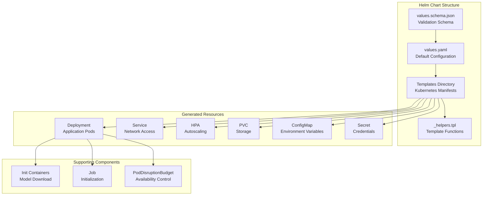
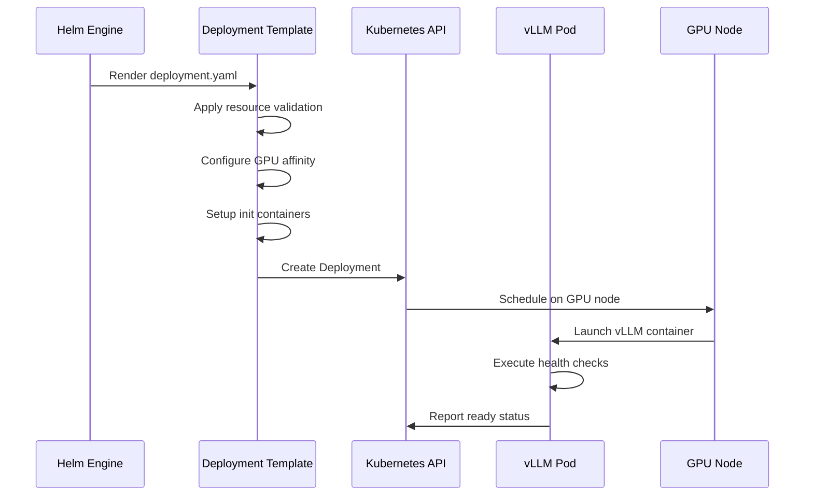
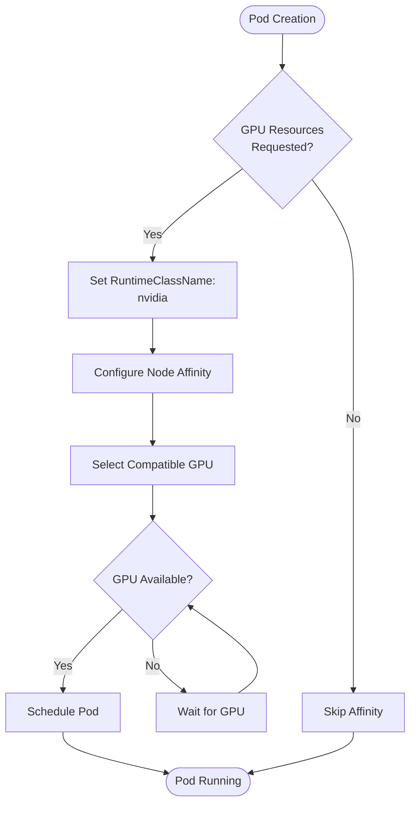
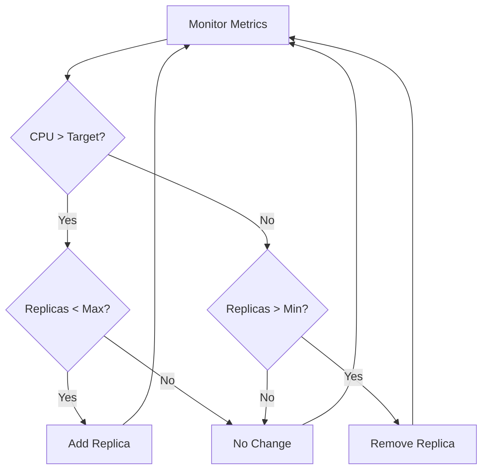
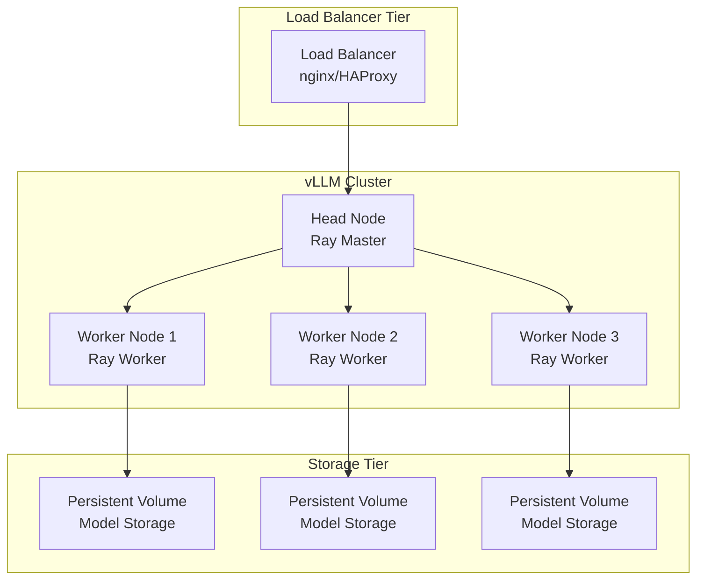
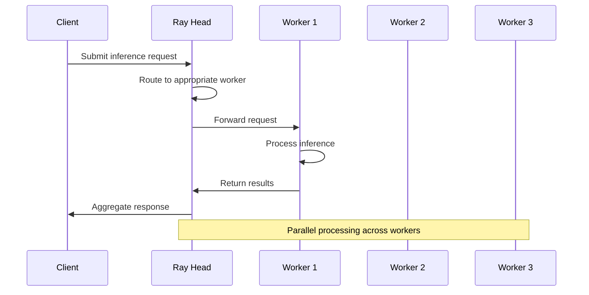
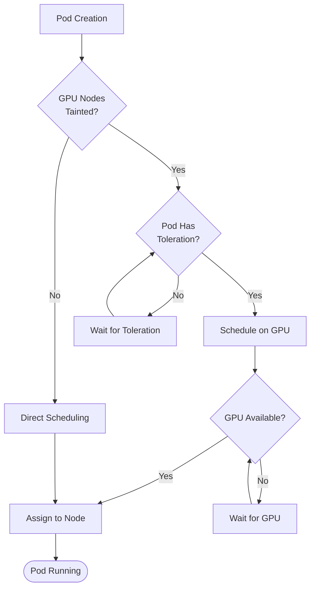
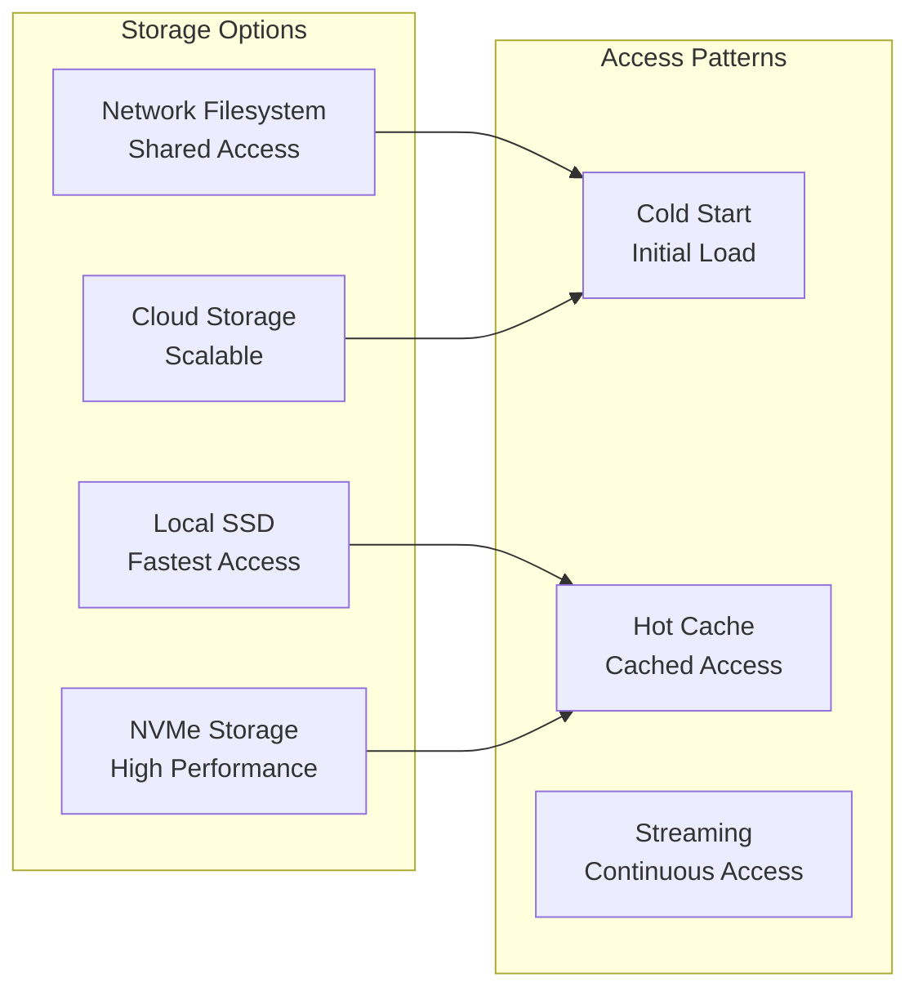

# Kubernetes Deployment

<cite>
**Referenced Files in This Document**
- [values.yaml](file://examples/online_serving/chart-helm/values.yaml)
- [deployment.yaml](file://examples/online_serving/chart-helm/templates/deployment.yaml)
- [service.yaml](file://examples/online_serving/chart-helm/templates/service.yaml)
- [hpa.yaml](file://examples/online_serving/chart-helm/templates/hpa.yaml)
- [_helpers.tpl](file://examples/online_serving/chart-helm/templates/_helpers.tpl)
- [pvc.yaml](file://examples\online_serving\chart-helm\templates\pvc.yaml)
- [poddisruptionbudget.yaml](file://examples\online_serving/chart-helm/templates\poddisruptionbudget.yaml)
- [job.yaml](file://examples\online_serving/chart-helm/templates\job.yaml)
- [configmap.yaml](file://examples\online_serving/chart-helm\templates\configmap.yaml)
- [secrets.yaml](file://examples\online_serving/chart-helm\templates\secrets.yaml)
- [custom-objects.yaml](file://examples\online_serving/chart-helm\templates\custom-objects.yaml)
- [values.schema.json](file://examples\online_serving/chart-helm\values.schema.json)
- [multi-node-serving.sh](file://examples\online_serving\multi-node-serving.sh)
- [run_cluster.sh](file://examples\online_serving\run_cluster.sh)
</cite>

## Table of Contents
1. [Introduction](#introduction)
2. [Helm Chart Architecture](#helm-chart-architecture)
3. [Core Configuration Files](#core-configuration-files)
4. [Resource Management and GPU Configuration](#resource-management-and-gpu-configuration)
5. [High Availability and Pod Anti-Affinity](#high-availability-and-pod-anti-affinity)
6. [Horizontal Pod Autoscaling](#horizontal-pod-autoscaling)
7. [Service Discovery and Load Balancing](#service-discovery-and-load-balancing)
8. [Multi-Node Distributed Inference](#multi-node-distributed-inference)
9. [Pod Scheduling and Node Management](#pod-scheduling-and-node-management)
10. [Performance Optimization](#performance-optimization)
11. [Common Issues and Solutions](#common-issues-and-solutions)
12. [Best Practices](#best-practices)

## Introduction

vLLM provides a comprehensive Kubernetes deployment solution through a Helm chart that orchestrates large language model serving at scale. The deployment architecture supports distributed inference across multiple nodes, GPU resource management, and sophisticated load balancing mechanisms. This documentation covers the complete implementation details of deploying vLLM on Kubernetes using Helm charts, including configuration patterns, resource allocation strategies, and operational considerations.

The vLLM Kubernetes deployment leverages several key technologies:
- **Helm Charts**: Templated Kubernetes manifests for declarative deployment
- **Ray Cluster**: Distributed computing framework for multi-node coordination
- **GPU Orchestration**: NVIDIA GPU scheduling and resource management
- **Persistent Storage**: Model persistence and state management
- **Service Mesh**: Network connectivity and load balancing

## Helm Chart Architecture

The vLLM Helm chart follows a modular architecture with clear separation of concerns:



**Diagram sources**
- [values.yaml](file://examples\online_serving\chart-helm\values.yaml#L1-L175)
- [deployment.yaml](file://examples\online_serving\chart-helm\templates\deployment.yaml#L1-L131)
- [_helpers.tpl](file://examples\online_serving\chart-helm\templates\_helpers.tpl#L1-L165)

**Section sources**
- [values.yaml](file://examples\online_serving\chart-helm\values.yaml#L1-L175)
- [deployment.yaml](file://examples\online_serving\chart-helm\templates\deployment.yaml#L1-L131)

## Core Configuration Files

### values.yaml Structure

The main configuration file defines all deployment parameters with comprehensive defaults:

| Configuration Category | Purpose | Key Parameters |
|------------------------|---------|----------------|
| **Image Configuration** | Container image settings | repository, tag, command |
| **Resource Management** | CPU/GPU/memory allocation | requests, limits, nvidia.com/gpu |
| **Scaling Configuration** | Replica and autoscaling | replicaCount, autoscaling |
| **Storage Configuration** | Persistent volume claims | extraInit.pvcStorage |
| **Network Configuration** | Service and port settings | containerPort, servicePort |
| **Security Configuration** | Authentication and secrets | secrets, configs |

### Deployment Template Implementation

The deployment template demonstrates advanced Kubernetes patterns:



**Diagram sources**
- [deployment.yaml](file://examples\online_serving\chart-helm\templates\deployment.yaml#L1-L131)
- [values.yaml](file://examples\online_serving\chart-helm\values.yaml#L1-L175)

**Section sources**
- [deployment.yaml](file://examples\online_serving\chart-helm\templates\deployment.yaml#L1-L131)
- [values.yaml](file://examples\online_serving\chart-helm\values.yaml#L1-L175)

## Resource Management and GPU Configuration

### GPU Resource Allocation

vLLM deployments require precise GPU resource management for optimal performance:

| Resource Type | Request Value | Limit Value | Purpose |
|---------------|---------------|-------------|---------|
| **CPU** | 4 cores | 4 cores | General computation |
| **Memory** | 16Gi | 16Gi | Model and cache memory |
| **GPU** | 1 NVIDIA GPU | 1 NVIDIA GPU | Inference acceleration |

### GPU Affinity Configuration

The deployment automatically configures GPU affinity when GPU resources are requested:



**Diagram sources**
- [deployment.yaml](file://examples\online_serving\chart-helm\templates\deployment.yaml#L118-L130)

### Resource Validation Schema

The JSON schema ensures configuration correctness:

| Field | Type | Required | Description |
|-------|------|----------|-------------|
| `resources.requests.cpu` | integer | Yes | Minimum CPU cores |
| `resources.requests.memory` | string | Yes | Minimum memory (e.g., "16Gi") |
| `resources.requests.nvidia.com/gpu` | integer | Conditional | GPU count requirement |
| `resources.limits.cpu` | integer | Yes | Maximum CPU cores |
| `resources.limits.memory` | string | Yes | Maximum memory |
| `resources.limits.nvidia.com/gpu` | integer | Conditional | GPU limit |

**Section sources**
- [values.yaml](file://examples\online_serving\chart-helm\values.yaml#L28-L44)
- [values.schema.json](file://examples\online_serving/chart-helm\values.schema.json#L46-L91)

## High Availability and Pod Anti-Affinity

### Pod Disruption Budget Configuration

The Pod Disruption Budget ensures service availability during maintenance:

```yaml
apiVersion: policy/v1
kind: PodDisruptionBudget
metadata:
  name: "{{ .Release.Name }}-pdb"
spec:
  maxUnavailable: {{ default 1 .Values.maxUnavailablePodDisruptionBudget }}
```

### Service Discovery Patterns

The service configuration enables seamless load balancing:

```yaml
apiVersion: v1
kind: Service
metadata:
  name: "{{ .Release.Name }}-service"
spec:
  type: ClusterIP
  ports:
    - name: {{ include "chart.service-port-name" . }}
      port: {{ include "chart.service-port" . }}
      targetPort: {{ include "chart.container-port-name" . }}
      protocol: TCP
  selector:
    {{- include "chart.labels" . | nindent 4 }}
```

### Load Balancing Strategies

vLLM supports multiple load balancing approaches:

| Strategy | Use Case | Configuration |
|----------|----------|---------------|
| **ClusterIP** | Internal load balancing | Default service type |
| **NodePort** | External access | Expose on node ports |
| **LoadBalancer** | Cloud environments | Cloud provider LB |
| **Ingress** | HTTP routing | Layer 7 load balancing |

**Section sources**
- [poddisruptionbudget.yaml](file://examples\online_serving\chart-helm\templates\poddisruptionbudget.yaml#L1-L7)
- [service.yaml](file://examples\online_serving\chart-helm\templates\service.yaml#L1-L14)

## Horizontal Pod Autoscaling

### HPA Configuration

The Horizontal Pod Autoscaler automatically adjusts replica counts based on resource utilization:

```yaml
apiVersion: autoscaling/v2
kind: HorizontalPodAutoscaler
metadata:
  name: "{{ .Release.Name }}-hpa"
spec:
  scaleTargetRef:
    apiVersion: apps/v1
    kind: Deployment
    name: vllm
  minReplicas: {{ .Values.autoscaling.minReplicas }}
  maxReplicas: {{ .Values.autoscaling.maxReplicas }}
  metrics:
    - type: Resource
      resource:
        name: cpu
        target:
          type: Utilization
          averageUtilization: {{ .Values.autoscaling.targetCPUUtilizationPercentage }}
```

### Scaling Metrics

| Metric Type | Threshold | Action |
|-------------|-----------|--------|
| **CPU Utilization** | 80% | Scale up/down |
| **Memory Utilization** | Not configured | Manual monitoring |
| **Custom Metrics** | Application-specific | Prometheus integration |

### Autoscaling Decision Matrix



**Diagram sources**
- [hpa.yaml](file://examples\online_serving\chart-helm\templates\hpa.yaml#L1-L31)

**Section sources**
- [hpa.yaml](file://examples\online_serving\chart-helm\templates\hpa.yaml#L1-L31)
- [values.yaml](file://examples\online_serving\chart-helm\values.yaml#L50-L59)

## Service Discovery and Load Balancing

### Multi-Node Service Architecture

vLLM deployments support distributed inference across multiple nodes:



**Diagram sources**
- [multi-node-serving.sh](file://examples\online_serving\multi-node-serving.sh#L1-L120)
- [run_cluster.sh](file://examples\online_serving\run_cluster.sh#L1-L124)

### Ray Cluster Coordination

The Ray cluster provides distributed computing capabilities:

| Component | Role | Communication |
|-----------|------|---------------|
| **Ray Head** | Master coordinator | Port 6379 |
| **Ray Workers** | Compute nodes | Connect to head |
| **Object Store** | Shared memory | Intra-node communication |
| **Placement Groups** | Resource allocation | Cross-node coordination |

**Section sources**
- [multi-node-serving.sh](file://examples\online_serving\multi-node-serving.sh#L1-L120)
- [run_cluster.sh](file://examples\online_serving\run_cluster.sh#L1-L124)

## Multi-Node Distributed Inference

### Ray Cluster Initialization

The multi-node setup uses Ray for distributed coordination:

```bash
# Leader node initialization
./multi-node-serving.sh leader \
  --ray_port=6379 \
  --ray_cluster_size=<SIZE> \
  [<extra ray args>] && \
vllm serve meta-llama/Meta-Llama-3.1-405B-Instruct \
  --port 8080 \
  --tensor-parallel-size 8 \
  --pipeline_parallel_size 2
```

### Distributed Communication Patterns

vLLM implements sophisticated distributed communication:



**Diagram sources**
- [multi-node-serving.sh](file://examples\online_serving\multi-node-serving.sh#L13-L14)

### Model Distribution Strategies

| Strategy | Use Case | Advantages | Considerations |
|----------|----------|------------|----------------|
| **Shared Storage** | Large models | Single copy, consistent | Network I/O overhead |
| **Local Copy** | Small models | Low latency | Storage redundancy |
| **Hybrid Approach** | Mixed scenarios | Balanced performance | Complexity |

**Section sources**
- [multi-node-serving.sh](file://examples\online_serving\multi-node-serving.sh#L1-L120)

## Pod Scheduling and Node Management

### Node Affinity Configuration

The deployment automatically configures GPU node affinity:

```yaml
affinity:
  nodeAffinity:
    requiredDuringSchedulingIgnoredDuringExecution:
      nodeSelectorTerms:
        - matchExpressions:
          - key: nvidia.com/gpu.product
            operator: In
            values:
              {{- toYaml .Values.gpuModels | nindent 20 }}
```

### Taints and Tolerations

Proper node management requires understanding taints and tolerations:

| Taint Effect | Purpose | Configuration |
|--------------|---------|---------------|
| **NoSchedule** | Prevent non-tolerated pods | GPU-exclusive nodes |
| **PreferNoSchedule** | Prefer non-scheduling | Mixed workloads |
| **NoExecute** | Evict non-tolerated pods | Maintenance windows |

### GPU Node Selection



**Diagram sources**
- [deployment.yaml](file://examples\online_serving\chart-helm\templates\deployment.yaml#L118-L130)

**Section sources**
- [deployment.yaml](file://examples\online_serving\chart-helm\templates\deployment.yaml#L110-L130)

## Performance Optimization

### Network Latency Optimization

Network performance is critical for distributed inference:

| Optimization | Implementation | Benefit |
|--------------|----------------|---------|
| **Host Networking** | `--network host` | Eliminate NAT overhead |
| **RDMA Support** | InfiniBand configuration | High-bandwidth communication |
| **Connection Pooling** | HTTP keep-alive | Reduced connection overhead |
| **Compression** | Protocol-level compression | Bandwidth savings |

### Storage Optimization

Model loading performance impacts inference latency:



### Memory Management

Effective memory management prevents out-of-memory conditions:

| Memory Type | Allocation | Monitoring |
|-------------|------------|------------|
| **Model Memory** | Static allocation | GPU memory usage |
| **KV Cache** | Dynamic allocation | Memory pressure alerts |
| **System Memory** | Shared allocation | Host memory monitoring |
| **Swap Space** | Emergency fallback | Performance degradation |

**Section sources**
- [run_cluster.sh](file://examples\online_serving\run_cluster.sh#L110-L123)

## Common Issues and Solutions

### Pod Scheduling Failures

**Issue**: Pods fail to schedule on GPU nodes
**Symptoms**: Pending pods with `Insufficient nvidia.com/gpu` errors
**Solution**: Verify GPU node taints and pod tolerations

```yaml
# Add to pod specification
tolerations:
- key: "nvidia.com/gpu"
  operator: "Exists"
  effect: "NoSchedule"
```

### Model Loading Issues

**Issue**: Model download failures during initialization
**Symptoms**: Init container failures, pod restart loops
**Solution**: Configure proper S3 credentials and network access

```yaml
# values.yaml configuration
extraInit:
  modelDownload:
    enabled: true
    image:
      repository: "amazon/aws-cli"
      tag: "2.6.4"
  s3modelpath: "models/llama-7b"
  awsEc2MetadataDisabled: true
```

### Network Connectivity Problems

**Issue**: Ray cluster communication failures
**Symptoms**: Workers unable to connect to head node
**Solution**: Verify network policies and firewall rules

```bash
# Test connectivity between nodes
kubectl exec -it <pod-name> -- ping <head-node-ip>
kubectl exec -it <pod-name> -- telnet <head-node-ip> 6379
```

### Resource Exhaustion

**Issue**: Out-of-memory errors during inference
**Symptoms**: Pod termination, OOMKilled events
**Solution**: Adjust resource limits and optimize model loading

```yaml
# values.yaml adjustments
resources:
  requests:
    memory: "32Gi"
  limits:
    memory: "32Gi"
```

**Section sources**
- [deployment.yaml](file://examples\online_serving\chart-helm\templates\deployment.yaml#L114-L117)
- [values.yaml](file://examples\online_serving\chart-helm\values.yaml#L79-L137)

## Best Practices

### Configuration Management

1. **Environment-Specific Values**: Use separate values files for different environments
2. **Secret Management**: Store sensitive data in Kubernetes Secrets
3. **Version Pinning**: Specify exact image tags for reproducible deployments
4. **Validation**: Use JSON schema validation for configuration files

### Monitoring and Observability

1. **Metrics Collection**: Implement Prometheus metrics for resource monitoring
2. **Logging**: Centralized logging with structured log formats
3. **Health Checks**: Comprehensive readiness and liveness probes
4. **Alerting**: Set up alerts for critical system events

### Security Considerations

1. **RBAC**: Implement least-privilege access controls
2. **Network Policies**: Restrict inter-pod communication
3. **Image Scanning**: Regular vulnerability assessments
4. **Secret Rotation**: Automated secret rotation mechanisms

### Operational Excellence

1. **Blue-Green Deployments**: Zero-downtime deployment strategies
2. **Canary Releases**: Gradual rollout procedures
3. **Backup Strategies**: Model and configuration backups
4. **Disaster Recovery**: Multi-region deployment patterns

### Performance Tuning

1. **Resource Planning**: Accurate capacity forecasting
2. **Load Testing**: Regular performance validation
3. **Optimization**: Continuous performance improvement
4. **Capacity Planning**: Scalability assessment