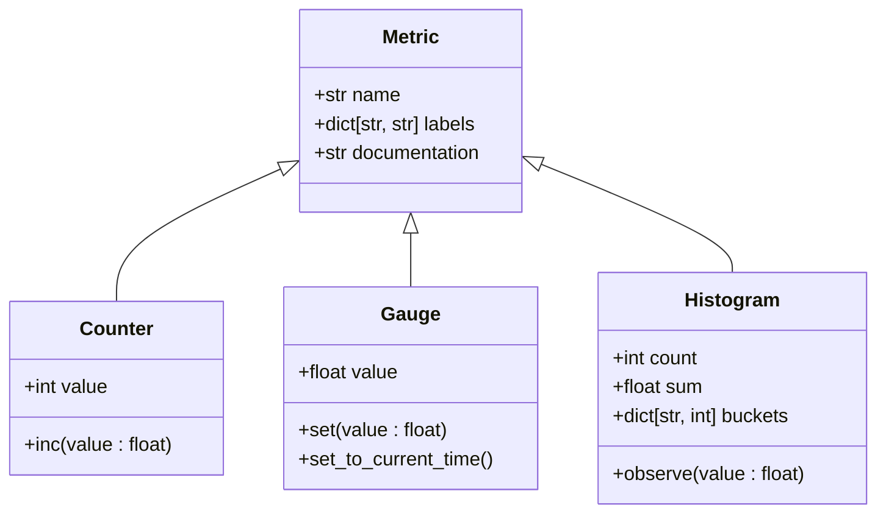
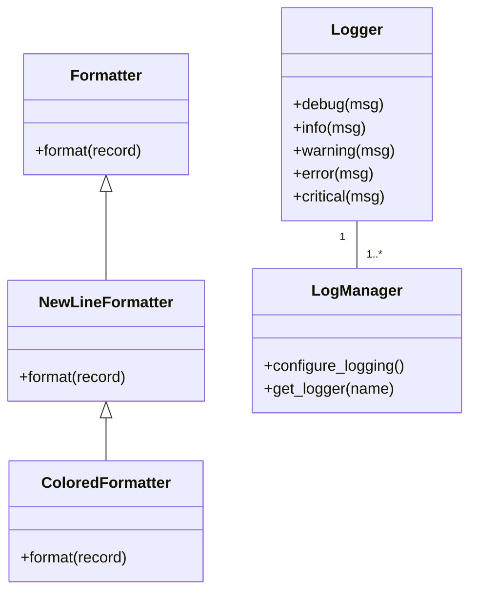

# Monitoring and Logging

<cite>
**Referenced Files in This Document**   
- [docker-compose.yaml](file://examples/online_serving/prometheus_grafana/docker-compose.yaml)
- [prometheus.yaml](file://examples/online_serving/prometheus_grafana/prometheus.yaml)
- [grafana.json](file://examples/online_serving/prometheus_grafana/grafana.json)
- [orca_metrics.py](file://vllm/entrypoints/openai/orca_metrics.py)
- [logger.py](file://vllm/logger.py)
- [formatter.py](file://vllm/logging_utils/formatter.py)
- [logging_configuration.md](file://examples/others/logging_configuration.md)
- [api_server.py](file://vllm/entrypoints/openai/api_server.py)
- [ray_wrappers.py](file://vllm/v1/metrics/ray_wrappers.py)
- [reader.py](file://vllm/v1/metrics/reader.py)
</cite>

## Table of Contents
1. [Introduction](#introduction)
2. [Built-in Metrics System](#built-in-metrics-system)
3. [Prometheus Integration](#prometheus-integration)
4. [Grafana Dashboard Configuration](#grafana-dashboard-configuration)
5. [Structured Logging Configuration](#structured-logging-configuration)
6. [Common Issues and Solutions](#common-issues-and-solutions)
7. [Performance Considerations](#performance-considerations)
8. [Alerting Best Practices](#alerting-best-practices)
9. [Conclusion](#conclusion)

## Introduction

vLLM provides comprehensive monitoring and logging capabilities for production deployments of large language models. The system includes built-in metrics collection, Prometheus integration for time-series monitoring, Grafana visualization, and configurable structured logging. This documentation covers the implementation details and configuration options for monitoring vLLM deployments, including setting up the monitoring stack, configuring logging formats, and addressing common operational issues.

The monitoring system exposes key performance indicators such as request throughput, latency percentiles, GPU utilization, and memory usage through a standardized metrics endpoint. The logging system supports flexible configuration through environment variables and JSON configuration files, allowing users to customize log formats, levels, and output destinations according to their operational requirements.

**Section sources**
- [api_server.py](file://vllm/entrypoints/openai/api_server.py#L1-L185)
- [logging_configuration.md](file://examples/others/logging_configuration.md#L1-L163)

## Built-in Metrics System

vLLM implements a comprehensive metrics system that tracks key performance indicators for LLM serving. The system exposes metrics through a standardized endpoint and supports multiple metric types including counters, gauges, and histograms. The metrics are organized around key operational dimensions such as request processing, resource utilization, and system health.

The metrics system is built on Prometheus client libraries and exposes metrics in the standard Prometheus text format. Key metric categories include:

- **Request processing metrics**: Track request throughput, latency, and scheduling behavior
- **Resource utilization metrics**: Monitor GPU memory usage, cache utilization, and computational resources
- **System health metrics**: Provide insights into the internal state of the serving system

The implementation uses a registry pattern to manage metrics, with specific classes for different metric types (Counter, Gauge, Histogram) that provide the standard Prometheus API. The metrics are labeled with contextual information such as model name and engine index, enabling multi-dimensional analysis.



**Diagram sources**
- [ray_wrappers.py](file://vllm/v1/metrics/ray_wrappers.py#L106-L194)
- [reader.py](file://vllm/v1/metrics/reader.py#L52-L182)

**Section sources**
- [ray_wrappers.py](file://vllm/v1/metrics/ray_wrappers.py#L106-L194)
- [reader.py](file://vllm/v1/metrics/reader.py#L52-L182)

## Prometheus Integration

vLLM integrates with Prometheus through a dedicated metrics endpoint that exposes time-series data in the standard Prometheus format. The integration is enabled by default in the OpenAI-compatible server and requires minimal configuration to set up.

To configure Prometheus integration, create a `prometheus.yaml` configuration file that specifies the scraping job for the vLLM server:

```yaml
global:
  scrape_interval: 5s
  evaluation_interval: 30s

scrape_configs:
  - job_name: vllm
    static_configs:
      - targets:
          - 'host.docker.internal:8000'
```

This configuration sets up Prometheus to scrape metrics from the vLLM server running on port 8000 every 5 seconds. The target uses `host.docker.internal` to allow Docker containers to access services running on the host machine.

The metrics endpoint is automatically exposed at `/metrics` on the vLLM server. When accessed, it returns metrics in the following format:

```
# HELP vllm:num_requests_running Number of requests currently running
# TYPE vllm:num_requests_running gauge
vllm:num_requests_running{model_name="mistralai/Mistral-7B-v0.1"} 3

# HELP vllm:e2e_request_latency_seconds End-to-end request latency in seconds
# TYPE vllm:e2e_request_latency_seconds histogram
vllm:e2e_request_latency_seconds_bucket{model_name="mistralai/Mistral-7B-v0.1",le="0.1"} 10
vllm:e2e_request_latency_seconds_bucket{model_name="mistralai/Mistral-7B-v0.1",le="0.5"} 45
vllm:e2e_request_latency_seconds_bucket{model_name="mistralai/Mistral-7B-v0.1",le="+Inf"} 50
vllm:e2e_request_latency_seconds_count{model_name="mistralai/Mistral-7B-v0.1"} 50
vllm:e2e_request_latency_seconds_sum{model_name="mistralai/Mistral-7B-v0.1"} 22.5
```

**Section sources**
- [prometheus.yaml](file://examples/online_serving/prometheus_grafana/prometheus.yaml#L1-L11)
- [api_server.py](file://vllm/entrypoints/openai/api_server.py#L1-L185)

## Grafana Dashboard Configuration

vLLM provides a pre-configured Grafana dashboard for visualizing key performance metrics. The dashboard displays critical KPIs such as request throughput, latency percentiles, GPU utilization, and memory usage in an intuitive interface.

To set up the Grafana dashboard, first launch Prometheus and Grafana using Docker Compose:

```yaml
version: "3"

services:
  prometheus:
    image: prom/prometheus:latest
    extra_hosts:
      - "host.docker.internal:host-gateway"
    ports:
      - "9090:9090"
    volumes:
      - ${PWD}/prometheus.yaml:/etc/prometheus/prometheus.yml

  grafana:
    image: grafana/grafana:latest
    depends_on:
      - prometheus
    ports:
      - "3000:3000"
```

After launching the services, configure Grafana by:

1. Navigating to `http://localhost:3000` and logging in with the default credentials (admin/admin)
2. Adding Prometheus as a data source with URL `http://prometheus:9090`
3. Importing the `grafana.json` dashboard configuration

The imported dashboard displays the following key visualizations:

- **E2E Request Latency**: P50, P90, P95, and P99 percentiles of end-to-end request latency
- **Token Throughput**: Prompt and generation tokens processed per second
- **Inter Token Latency**: Time between consecutive token generations
- **Scheduler State**: Number of requests in RUNNING, WAITING, and SWAPPED states
- **Time To First Token**: Latency from request submission to first token generation
- **KV Cache Usage**: Percentage of used cache blocks by vLLM

```mermaid
flowchart TD
A[vLLM Server] --> |Exposes metrics| B[/metrics endpoint]
B --> C[Prometheus]
C --> |Scrapes every 5s| B
C --> D[Grafana]
D --> |Visualizes| E[Dashboard]
E --> F[Latency Metrics]
E --> G[Throughput Metrics]
E --> H[Resource Utilization]
E --> I[Scheduler State]
```

**Diagram sources**
- [docker-compose.yaml](file://examples/online_serving/prometheus_grafana/docker-compose.yaml#L1-L20)
- [grafana.json](file://examples/online_serving/prometheus_grafana/grafana.json#L1-L800)

**Section sources**
- [docker-compose.yaml](file://examples/online_serving/prometheus_grafana/docker-compose.yaml#L1-L20)
- [grafana.json](file://examples/online_serving/prometheus_grafana/grafana.json#L1-L800)

## Structured Logging Configuration

vLLM provides flexible logging configuration through environment variables and JSON configuration files. The logging system supports multiple log levels, output formats, and destinations, enabling users to customize logging behavior according to their operational requirements.

The logging system is controlled by two environment variables:

- `VLLM_CONFIGURE_LOGGING`: Controls whether vLLM configures logging (1 to enable, 0 to disable)
- `VLLM_LOGGING_CONFIG_PATH`: Path to a JSON file with custom logging configuration

By default, vLLM configures logging with the following settings:
- Log level: INFO
- Output: stdout
- Format: `%(levelname)s %(asctime)s [%(fileinfo)s:%(lineno)d] %(message)s`
- Colorized output when writing to a terminal

To customize logging, create a JSON configuration file:

```json
{
  "formatters": {
    "json": {
      "class": "pythonjsonlogger.jsonlogger.JsonFormatter"
    }
  },
  "handlers": {
    "console": {
      "class": "logging.StreamHandler",
      "formatter": "json",
      "level": "INFO",
      "stream": "ext://sys.stdout"
    }
  },
  "loggers": {
    "vllm": {
      "handlers": ["console"],
      "level": "INFO",
      "propagate": false
    }
  },
  "version": 1
}
```

Then launch vLLM with the custom configuration:

```bash
VLLM_LOGGING_CONFIG_PATH=/path/to/logging_config.json \
    vllm serve mistralai/Mistral-7B-v0.1 --max-model-len 2048
```

The logging system also supports silencing specific loggers by configuring them with `propagate: false` in the configuration file.



**Diagram sources**
- [logger.py](file://vllm/logger.py#L1-L192)
- [formatter.py](file://vllm/logging_utils/formatter.py#L67-L127)

**Section sources**
- [logger.py](file://vllm/logger.py#L1-L192)
- [formatter.py](file://vllm/logging_utils/formatter.py#L67-L127)
- [logging_configuration.md](file://examples/others/logging_configuration.md#L47-L163)

## Common Issues and Solutions

### Metric Scraping Failures

Metric scraping failures can occur due to network connectivity issues or incorrect configuration. Common causes and solutions include:

- **Connection refused**: Ensure the vLLM server is running and accessible at the configured address
- **Host not found**: Use `host.docker.internal` in Docker environments to access host services
- **Permission denied**: Verify that the Prometheus server has network access to the vLLM server

To troubleshoot scraping issues:

1. Verify the vLLM server is running and accessible:
```bash
curl http://localhost:8000/health
```

2. Check that metrics are exposed:
```bash
curl http://localhost:8000/metrics
```

3. Verify Prometheus configuration and scraping status in the Prometheus web interface.

### Log Rotation Problems

Log rotation issues can lead to disk space exhaustion. Solutions include:

- Configure external log rotation using tools like logrotate
- Use structured logging with JSON format for easier log management
- Implement log level filtering to reduce verbosity

### Endpoint Configuration Issues

Common endpoint configuration problems and solutions:

- **Incorrect target address**: Use `host.docker.internal:8000` when running Prometheus in Docker
- **Firewall blocking**: Ensure ports 8000 (vLLM) and 9090 (Prometheus) are accessible
- **Authentication requirements**: The metrics endpoint does not require authentication by default

**Section sources**
- [api_server.py](file://vllm/entrypoints/openai/api_server.py#L40-L43)
- [prometheus.yaml](file://examples/online_serving/prometheus_grafana/prometheus.yaml#L1-L11)
- [docker-compose.yaml](file://examples/online_serving/prometheus_grafana/docker-compose.yaml#L1-L20)

## Performance Considerations

Monitoring overhead in vLLM deployments should be carefully considered, as metrics collection and logging can impact overall system performance. Key considerations include:

- **Metrics collection frequency**: The default scrape interval of 5 seconds provides a good balance between granularity and overhead
- **Log verbosity**: Use appropriate log levels (INFO or WARNING in production) to minimize I/O overhead
- **Metric cardinality**: Avoid high-cardinality labels that can lead to metric explosion
- **Resource monitoring**: Monitor the monitoring system itself to ensure it doesn't become a bottleneck

The metrics system is designed to have minimal overhead by using efficient data structures and batched operations. However, in high-throughput scenarios, consider:

- Reducing the scrape interval if real-time monitoring is not required
- Filtering metrics to collect only essential KPIs
- Using asynchronous logging to avoid blocking request processing

For large-scale deployments, consider implementing metrics aggregation or sampling to reduce the volume of data collected.

**Section sources**
- [ray_wrappers.py](file://vllm/v1/metrics/ray_wrappers.py#L106-L194)
- [reader.py](file://vllm/v1/metrics/reader.py#L52-L182)

## Alerting Best Practices

Effective alerting on critical system metrics is essential for maintaining service reliability. Recommended alerts include:

- **High request latency**: Alert when P99 latency exceeds service level objectives
- **Low throughput**: Alert when token generation rate falls below expected levels
- **High GPU memory usage**: Alert when VRAM usage exceeds 80-90% of capacity
- **Request queue buildup**: Alert when the number of waiting requests exceeds a threshold
- **Service unavailability**: Alert when the health check endpoint returns non-200 status

Example Prometheus alert rules:

```yaml
groups:
- name: vllm-alerts
  rules:
  - alert: HighRequestLatency
    expr: histogram_quantile(0.99, sum by(le) (rate(vllm:e2e_request_latency_seconds_bucket[5m]))) > 10
    for: 5m
    labels:
      severity: warning
    annotations:
      summary: "High request latency"
      description: "P99 request latency is above 10 seconds"

  - alert: HighGPUUtilization
    expr: vllm:gpu_utilization > 0.9
    for: 10m
    labels:
      severity: warning
    annotations:
      summary: "High GPU utilization"
      description: "GPU utilization is above 90% for 10 minutes"
```

Alerts should be configured with appropriate thresholds and durations to avoid alert fatigue while ensuring timely notification of genuine issues.

**Section sources**
- [grafana.json](file://examples/online_serving/prometheus_grafana/grafana.json#L50-L404)
- [orca_metrics.py](file://vllm/entrypoints/openai/orca_metrics.py#L73-L97)

## Conclusion

vLLM provides a comprehensive monitoring and logging solution for LLM serving deployments. The built-in metrics system exposes key performance indicators through a standardized Prometheus endpoint, enabling integration with popular monitoring stacks. The Grafana dashboard provides intuitive visualization of critical KPIs, while the flexible logging configuration allows customization of log formats and verbosity.

By following the configuration guidelines and best practices outlined in this document, operators can effectively monitor vLLM deployments, troubleshoot issues, and maintain service reliability. The combination of time-series metrics, structured logging, and alerting enables proactive management of LLM serving infrastructure at scale.