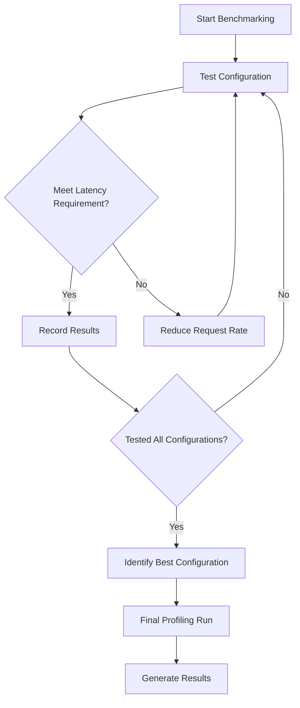

# Performance Tuning

<cite>
**Referenced Files in This Document**   
- [auto_tune.sh](file://benchmarks/auto_tune/auto_tune.sh)
- [vllm.py](file://vllm/config/vllm.py)
- [parallel_state.py](file://vllm/distributed/parallel_state.py)
- [paged_attention_v1.cu](file://csrc/attention/paged_attention_v1.cu)
- [paged_attention_v2.cu](file://csrc/attention/paged_attention_v2.cu)
- [automatic_prefix_caching.py](file://examples/offline_inference/automatic_prefix_caching.py)
- [benchmark_w8a8_block_fp8.py](file://benchmarks/kernels/benchmark_w8a8_block_fp8.py)
- [pallas.py](file://vllm/v1/attention/backends/pallas.py)
</cite>

## Table of Contents
1. [Introduction](#introduction)
2. [Parallelism Configuration](#parallelism-configuration)
3. [PagedAttention Block Size Tuning](#pagedattention-block-size-tuning)
4. [Performance Benchmarking](#performance-benchmarking)
5. [Memory Management and Batch Size Optimization](#memory-management-and-batch-size-optimization)
6. [Advanced Performance Features](#advanced-performance-features)
7. [Hardware-Specific Optimization](#hardware-specific-optimization)

## Introduction
This document provides comprehensive guidance on performance tuning for vLLM deployments. It covers critical configuration parameters, benchmarking methodologies, and optimization strategies to maximize throughput and efficiency. The document focuses on key aspects such as tensor and pipeline parallelism, PagedAttention block size settings, and advanced features like prefix caching and speculative decoding. By understanding the relationships between hardware characteristics and optimal configuration settings, users can achieve significant performance improvements in their vLLM deployments.

## Parallelism Configuration

vLLM supports multiple parallelism strategies to optimize model execution across multiple GPUs. The configuration of tensor parallelism and pipeline parallelism is critical for achieving optimal performance.

The `parallel_state.py` file contains the implementation for initializing model parallel groups, where tensor model parallelism and pipeline model parallelism can be configured independently. For example, with 8 GPUs, using 2 GPUs for tensor parallelism and 4 for pipeline parallelism creates 4 tensor model-parallel groups and 2 pipeline model-parallel groups. This allows for efficient distribution of model parameters and computation across the available hardware resources.

The configuration is set through parameters such as `tensor_model_parallel_size` and `pipeline_model_parallel_size`, which determine the number of GPUs used for each type of parallelism. Proper configuration of these parameters is essential for balancing the computational load and minimizing communication overhead between GPUs.

**Section sources**
- [parallel_state.py](file://vllm/distributed/parallel_state.py#L1269-L1393)

## PagedAttention Block Size Tuning

PagedAttention is a key feature in vLLM that enables efficient memory management for attention operations. The block size configuration significantly impacts performance and memory utilization.

The implementation supports specific block sizes for both PagedAttention V1 and V2. In `paged_attention_v1.cu`, the supported block sizes are 8, 16, and 32, while `paged_attention_v2.cu` supports block sizes of 8, 16, and 32 as well. The choice of block size affects memory allocation patterns and cache efficiency.

Smaller block sizes can lead to better memory utilization but may increase the overhead of managing more blocks. Larger block sizes reduce management overhead but may lead to higher memory fragmentation. The optimal block size depends on the specific model architecture, sequence length, and hardware characteristics.

For TPU deployments, the `pallas.py` backend automatically determines the page size based on the maximum model length, using a power-of-2 approach that ensures the page size remains within the range of 16 to 256.

**Section sources**
- [paged_attention_v1.cu](file://csrc/attention/paged_attention_v1.cu#L140-L166)
- [paged_attention_v2.cu](file://csrc/attention/paged_attention_v2.cu#L160-L186)
- [pallas.py](file://vllm/v1/attention/backends/pallas.py#L154-L169)

## Performance Benchmarking

vLLM provides comprehensive benchmarking tools to measure and optimize performance across different configurations. The benchmarking framework allows users to evaluate throughput, latency, and other performance metrics under various workloads.

The `auto_tune.sh` script is a key tool for performance optimization, automatically testing different server parameter combinations to maximize throughput while meeting latency requirements. It systematically evaluates configurations with varying `max_num_seqs` and `max_num_batched_tokens` values, measuring request throughput and end-to-end latency.

The benchmarking process follows these steps:
1. Start with the highest possible request rate (infinite)
2. Measure throughput and latency
3. If latency requirements are not met, gradually reduce the request rate
4. Identify the configuration that maximizes throughput while satisfying latency constraints

The script also performs a final profiling run on the best configuration found, providing detailed performance insights for further optimization.

**Diagram sources**
- [auto_tune.sh](file://benchmarks/auto_tune/auto_tune.sh#L182-L232)

**Section sources**
- [auto_tune.sh](file://benchmarks/auto_tune/auto_tune.sh#L1-L314)

## Memory Management and Batch Size Optimization

Effective memory management and batch size tuning are crucial for maximizing GPU utilization and throughput in vLLM deployments. The system provides several configuration options to optimize memory usage and batch processing.

The `gpu_memory_utilization` parameter controls the fraction of GPU memory allocated for the model, with the auto-tuning script automatically finding the maximum value that avoids out-of-memory errors. This ensures optimal memory utilization without risking GPU memory overflow.

Batch size optimization involves balancing between throughput and latency. Larger batch sizes generally improve throughput by better utilizing GPU parallelism, but may increase latency due to longer processing times. The optimal batch size depends on the specific workload characteristics and hardware capabilities.

The `max_num_seqs` and `max_num_batched_tokens` parameters control the maximum number of sequences and tokens that can be processed in a single batch. These parameters should be tuned based on the available GPU memory and the typical input sizes for the target application.

**Section sources**
- [auto_tune.sh](file://benchmarks/auto_tune/auto_tune.sh#L244-L264)

## Advanced Performance Features

vLLM includes several advanced features designed to further enhance performance and efficiency in production deployments.

### Prefix Caching
Prefix caching allows the system to reuse cached key-value (KV) pairs from previous prompts when a new query shares the same prefix. This reduces redundant computation and significantly improves inference speed for queries with common prefixes.

The `automatic_prefix_caching.py` example demonstrates this feature, showing how subsequent queries with the same long prompt prefix can be processed much faster. To enable prefix caching, set `enable_prefix_caching=True` when initializing the vLLM engine.

### Speculative Decoding
Speculative decoding is another optimization technique that can improve throughput by predicting multiple tokens ahead and verifying them in parallel. This reduces the number of sequential decoding steps required, particularly beneficial for high-throughput scenarios.

### Continuous Batching
Continuous batching allows the system to dynamically combine multiple requests into batches, even when they arrive at different times. This maximizes GPU utilization by ensuring the GPU is always processing a full batch of requests.

**Section sources**
- [automatic_prefix_caching.py](file://examples/offline_inference/automatic_prefix_caching.py#L1-L104)

## Hardware-Specific Optimization

Optimal performance in vLLM deployments requires consideration of specific hardware characteristics and capabilities. Different GPU architectures and interconnect technologies may require different configuration approaches.

For example, the `benchmark_w8a8_block_fp8.py` script includes functionality for tuning kernel configurations on specific GPU architectures, automatically distributing batch size testing across available GPUs. This parallel tuning approach significantly reduces the time required to find optimal configurations.

The system also considers hardware-specific features such as NVLink bandwidth and memory capacity when determining optimal parallelism configurations. For instance, tensor parallelism benefits more from high-bandwidth interconnects like NVLink, while pipeline parallelism may be more suitable for systems with lower interconnect bandwidth.

Understanding the specific capabilities of the target hardware, such as FP8 support in Hopper or Ada architectures, allows for more effective utilization of advanced features and quantization techniques that can further improve performance.

**Section sources**
- [benchmark_w8a8_block_fp8.py](file://benchmarks/kernels/benchmark_w8a8_block_fp8.py#L251-L383)