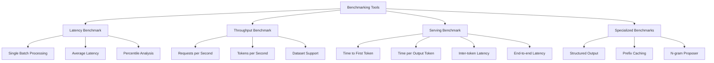

# Benchmarking

<cite>
**Referenced Files in This Document**   
- [benchmarks/README.md](file://benchmarks/README.md)
- [benchmarks/benchmark_latency.py](file://benchmarks/benchmark_latency.py)
- [benchmarks/benchmark_throughput.py](file://benchmarks/benchmark_throughput.py)
- [benchmarks/backend_request_func.py](file://benchmarks/backend_request_func.py)
- [benchmarks/benchmark_utils.py](file://benchmarks/benchmark_utils.py)
- [vllm/benchmarks/latency.py](file://vllm/benchmarks/latency.py)
- [vllm/benchmarks/throughput.py](file://vllm/benchmarks/throughput.py)
- [vllm/benchmarks/datasets.py](file://vllm/benchmarks/datasets.py)
- [benchmarks/benchmark_serving.py](file://benchmarks/benchmark_serving.py)
- [benchmarks/benchmark_serving_structured_output.py](file://benchmarks/benchmark_serving_structured_output.py)
- [benchmarks/benchmark_prefix_caching.py](file://benchmarks/benchmark_prefix_caching.py)
- [benchmarks/benchmark_ngram_proposer.py](file://benchmarks/benchmark_ngram_proposer.py)
- [benchmarks/kernels/benchmark_shapes.py](file://benchmarks/kernels/benchmark_shapes.py)
</cite>

## Table of Contents
1. [Introduction](#introduction)
2. [Benchmarking Infrastructure](#benchmarking-infrastructure)
3. [Performance Evaluation Tools](#performance-evaluation-tools)
4. [Request Generation and Synthetic Workloads](#request-generation-and-synthetic-workloads)
5. [Timing Measurement and Result Aggregation](#timing-measurement-and-result-aggregation)
6. [Running Benchmarks for Different Scenarios](#running-benchmarks-for-different-scenarios)
7. [Relationship Between Benchmarking Tools and Core Engine](#relationship-between-benchmarking-tools-and-core-engine)
8. [Common Benchmarking Issues and Experimental Design](#common-benchmarking-issues-and-experimental-design)
9. [Advanced Benchmarking Features](#advanced-benchmarking-features)
10. [Conclusion](#conclusion)

## Introduction
The vLLM benchmarking framework provides comprehensive tools for evaluating the performance of large language models across various scenarios. This documentation details the infrastructure, methodologies, and implementation specifics of the benchmarking system, focusing on latency, throughput, and parameter sweep tools. The framework supports both online serving and offline inference scenarios, with specialized benchmarks for features like structured output, prefix caching, and multi-modal inference. The system is designed to provide accurate performance measurements while addressing common benchmarking challenges such as warmup requirements and statistical significance.

## Benchmarking Infrastructure
The vLLM benchmarking infrastructure is organized into several key components that work together to provide comprehensive performance evaluation capabilities. The framework has evolved from standalone scripts to a CLI-based system, with the primary benchmarking functionality now accessible through the `vllm bench` command. The infrastructure supports multiple benchmarking modes including latency measurement, throughput evaluation, and serving performance testing.

The core of the benchmarking system consists of specialized modules for different evaluation scenarios. The latency benchmark measures the time required to process a single batch of requests, while the throughput benchmark evaluates offline inference performance. The serving benchmark simulates real-world online inference scenarios with configurable request rates and traffic patterns. Each benchmark type has its own specialized implementation while sharing common infrastructure components for request generation, timing measurement, and result aggregation.

The infrastructure is designed to be extensible, allowing for the addition of new benchmark types and evaluation methodologies. The system supports various backends including vLLM, Hugging Face, and MII, enabling cross-platform performance comparisons. The benchmarking tools are integrated with the core vLLM engine, providing direct access to model execution and performance metrics.

**Section sources**
- [benchmarks/README.md](file://benchmarks/README.md#L3-L21)
- [benchmarks/benchmark_latency.py](file://benchmarks/benchmark_latency.py#L1-L18)
- [benchmarks/benchmark_throughput.py](file://benchmarks/benchmark_throughput.py#L1-L18)

## Performance Evaluation Tools
The vLLM benchmarking framework provides several specialized tools for performance evaluation, each designed for specific measurement scenarios. These tools have been migrated to the vLLM CLI system, with the primary commands being `vllm bench latency`, `vllm bench throughput`, and `vllm bench serve`.

The latency benchmark tool measures the time required to process a single batch of requests, providing detailed timing information including average latency and percentile distributions. This tool is particularly useful for evaluating the performance of individual inference operations and identifying potential bottlenecks in the model execution pipeline.

The throughput benchmark tool evaluates offline inference performance by measuring the number of requests processed per second and tokens generated per second. This benchmark supports various dataset types including random synthetic data, ShareGPT conversations, and custom datasets. The tool provides comprehensive metrics including requests per second, total tokens per second, and output tokens per second.

The serving benchmark tool simulates online inference scenarios with configurable request rates, burstiness factors, and concurrency limits. This tool measures key performance indicators such as time to first token (TTFT), time per output token (TPOT), inter-token latency (ITL), and end-to-end latency (E2EL). The serving benchmark supports various traffic patterns, including Poisson processes and gamma-distributed intervals, allowing for realistic simulation of production workloads.



**Diagram sources**
- [vllm/benchmarks/latency.py](file://vllm/benchmarks/latency.py#L3-L173)
- [vllm/benchmarks/throughput.py](file://vllm/benchmarks/throughput.py#L3-L800)
- [benchmarks/benchmark_serving.py](file://benchmarks/benchmark_serving.py#L1-L18)

## Request Generation and Synthetic Workloads
The vLLM benchmarking framework includes sophisticated request generation capabilities that support both real-world datasets and synthetic workloads. The system provides multiple dataset types through the `BenchmarkDataset` base class, with specialized implementations for different evaluation scenarios.

The RandomDataset class generates synthetic text-only workloads with configurable input and output lengths. This dataset type uses a reproducible sampling strategy that combines a fixed random prefix with a sequence generated from a reproducible formula: (offset + index + arange(input_len)) % vocab_size. The random dataset supports range ratios for sampling input/output token lengths, allowing for evaluation across a range of sequence lengths.

For multimodal evaluation, the RandomMultiModalDataset extends the random dataset functionality to include synthetic image and video data. This dataset type samples the number of items per request from a configurable range and generates multimodal content with specified dimensions and frame counts. The multimodal dataset supports bucket configurations that define probability distributions for different content shapes.

The framework also supports real-world datasets including ShareGPT conversations, Hugging Face datasets, and custom JSON formats. The ShareGPT dataset processes conversation data from JSON files, filtering and sampling requests based on configurable length criteria. The Hugging Face dataset integration supports various multimodal datasets including VisionArena, InstructCoder, and Conversation datasets.

The request generation system includes utilities for validating sequences based on length criteria, ensuring that generated requests meet minimum and maximum length requirements. The system also supports oversampling to ensure a sufficient number of requests for evaluation, with duplicate request IDs prevented through validation.


**Diagram sources**
- [vllm/benchmarks/datasets.py](file://vllm/benchmarks/datasets.py#L92-L800)

## Timing Measurement and Result Aggregation
The vLLM benchmarking framework implements comprehensive timing measurement and result aggregation capabilities to provide detailed performance insights. The system captures multiple timing metrics for each request, including end-to-end latency, time to first token (TTFT), inter-token latency (ITL), and time per output token (TPOT).

The timing measurement system uses high-resolution timers (time.perf_counter) to capture precise timing information. For streaming responses, the system records timestamps for each received token, enabling detailed analysis of token generation patterns. The first token timestamp is used to calculate TTFT, while subsequent token timestamps are used to compute ITL values and TPOT.

Result aggregation is performed through specialized classes like TimeCollector, which collects timing samples and computes statistical metrics including averages, maximums, and percentiles. The TimeCollector class implements Python's context manager protocol, allowing for convenient timing of code blocks using the 'with' statement.

The framework supports multiple output formats for benchmark results, including JSON and PyTorch benchmark format. The JSON output includes detailed timing information for each request, while the PyTorch benchmark format organizes results according to the PyTorch OSS benchmark database schema. The system also supports saving results to files and generating comprehensive reports with statistical summaries.

For serving benchmarks, the framework calculates additional metrics including request throughput (requests per second), output throughput (tokens per second), and total token throughput. The system also computes percentile distributions for key metrics, providing insights into performance consistency and tail latency behavior.


**Diagram sources**
- [vllm/benchmarks/latency.py](file://vllm/benchmarks/latency.py#L1-L173)
- [vllm/benchmarks/throughput.py](file://vllm/benchmarks/throughput.py#L3-L800)
- [benchmarks/benchmark_utils.py](file://benchmarks/benchmark_utils.py#L86-L126)

## Running Benchmarks for Different Scenarios
The vLLM benchmarking framework supports various scenarios including single GPU, distributed, and quantized model configurations. Each scenario requires specific command-line arguments and configuration options to properly evaluate performance characteristics.

For single GPU benchmarks, the basic command structure uses the vLLM CLI with minimal configuration. The latency benchmark can be run with default parameters using: `vllm bench latency --model <model_name>`. This configuration evaluates performance on a single GPU with default batch size, input length, and output length parameters.

Distributed benchmarks require additional configuration to specify tensor parallelism and other distributed execution parameters. The command `vllm bench throughput --model <model_name> --tensor-parallel-size <N>` runs a throughput benchmark with tensor parallelism across N GPUs. For data parallel scenarios, the `--data-parallel-size` parameter specifies the number of data parallel workers.

Quantized model benchmarks leverage vLLM's quantization capabilities to evaluate performance with reduced precision models. The command `vllm bench throughput --model <model_name> --quantization awq` runs a throughput benchmark with AWQ quantization. Other supported quantization methods include GPTQ, FP8, and Marlin, each accessible through the `--quantization` parameter.

Specialized scenarios like structured output generation require additional parameters to configure the structured output ratio and schema type. The command `vllm bench serve --model <model_name> --structured-output-ratio 1.0 --structure-type json` runs a serving benchmark with 100% structured output requests using JSON schema.

The framework also supports parameter sweeps across multiple configurations using scripts like batch_auto_tune.sh in the auto_tune directory. These scripts automate the process of running benchmarks with different parameter combinations to identify optimal configurations.


**Diagram sources**
- [vllm/benchmarks/latency.py](file://vllm/benchmarks/latency.py#L81-L173)
- [vllm/benchmarks/throughput.py](file://vllm/benchmarks/throughput.py#L694-L800)
- [benchmarks/auto_tune/auto_tune.sh](file://benchmarks/auto_tune/auto_tune.sh)

## Relationship Between Benchmarking Tools and Core Engine
The vLLM benchmarking tools are tightly integrated with the core engine, leveraging its APIs and internal components to provide accurate performance measurements. The relationship between the benchmarking infrastructure and the core engine is designed to minimize overhead while providing comprehensive access to performance metrics.

The benchmarking tools primarily interact with the core engine through the LLM class interface, which provides high-level methods for text generation and model execution. The latency and throughput benchmarks use the LLM.generate() method to process requests, while the serving benchmark uses asynchronous generation for more realistic performance evaluation.

For detailed profiling and performance analysis, the benchmarking tools can leverage the engine's built-in profiling capabilities. When the `--profile` flag is specified, the benchmarks can start and stop the engine's profiler, capturing detailed execution traces that can be analyzed to identify performance bottlenecks.

The integration also extends to specialized engine features like prefix caching, LoRA support, and speculative decoding. The benchmarking tools can enable and evaluate these features through configuration parameters, allowing for comprehensive assessment of their performance impact. For example, the prefix caching benchmark can be run with and without the `--enable-prefix-caching` flag to measure the performance difference.

The framework's dataset system is closely tied to the engine's tokenization and input processing capabilities. The benchmarking tools use the same tokenizer interface as the core engine, ensuring consistent tokenization behavior between benchmarking and production use. This integration allows for accurate measurement of token processing performance, including the impact of special tokens and tokenizer-specific behaviors.

```mermaid
graph TD
A[Benchmarking Tools] --> B[Core Engine Integration]
B --> C[LLM Interface]
C --> C1[generate()]
C --> C2[beam_search()]
C --> C3[chat()]
B --> D[Profiling System]
D --> D1[start_profile()]
D --> D2[stop_profile()]
B --> E[Feature Configuration]
E --> E1[Prefix Caching]
E --> E2[LoRA Support]
E --> E3[Speculative Decoding]
E --> E4[Quantization]
B --> F[Tokenization System]
F --> F1[Tokenizer Interface]
F --> F2[Input Processing]
F --> F3[Special Tokens]
B --> G[Memory Management]
G --> G1[Cache Configuration]
G --> G2[Memory Pool]
G --> G3[Block Management]
```

**Diagram sources**
- [vllm/benchmarks/latency.py](file://vllm/benchmarks/latency.py#L90-L139)
- [vllm/benchmarks/throughput.py](file://vllm/benchmarks/throughput.py#L48-L121)
- [benchmarks/benchmark_prefix_caching.py](file://benchmarks/benchmark_prefix_caching.py#L38-L54)

## Common Benchmarking Issues and Experimental Design
The vLLM benchmarking framework addresses several common issues in performance evaluation through careful experimental design and built-in safeguards. These issues include warmup requirements, statistical significance, and configuration consistency.

Warmup is critical for accurate performance measurement, as the first few iterations of model execution often exhibit different performance characteristics due to CUDA kernel compilation, memory allocation, and cache population. The framework automatically includes warmup iterations in its benchmarks, with configurable warmup counts through parameters like `--num-iters-warmup`. This ensures that performance measurements reflect steady-state behavior rather than transient startup effects.

Statistical significance is addressed through multiple iterations and comprehensive statistical analysis. The benchmarks run multiple iterations (configurable via `--num-iters`) and compute percentile distributions to provide insights into performance consistency. The framework reports not only average metrics but also median, standard deviation, and percentile values (10th, 25th, 50th, 75th, 90th, 99th), enabling assessment of tail latency behavior.

Configuration consistency is maintained through comprehensive argument validation and error checking. The framework validates parameters such as model length constraints, ensuring that input and output lengths do not exceed the model's maximum context window. Dataset-specific validations prevent incompatible configurations, such as using multimodal datasets with non-multimodal backends.

The experimental design also considers reproducibility through configurable random seeds. The `--seed` parameter allows for deterministic benchmark runs, ensuring that results can be reproduced across different executions. This is particularly important for comparative evaluations and regression testing.

For serving benchmarks, the framework addresses request rate stability through burstiness control. The `--burstiness` parameter allows for simulation of different traffic patterns, from smooth Poisson processes (burstiness=1.0) to more bursty gamma distributions (burstiness<1.0), enabling evaluation under realistic production conditions.

**Section sources**
- [vllm/benchmarks/latency.py](file://vllm/benchmarks/latency.py#L47-L54)
- [vllm/benchmarks/throughput.py](file://vllm/benchmarks/throughput.py#L702-L704)
- [benchmarks/benchmark_serving_structured_output.py](file://benchmarks/benchmark_serving_structured_output.py#L267-L310)

## Advanced Benchmarking Features
The vLLM benchmarking framework includes several advanced features for specialized performance evaluation scenarios. These features extend the core benchmarking capabilities to address specific optimization and analysis requirements.

Pareto analysis is supported through parameter sweep capabilities that allow for multi-dimensional performance evaluation. The auto_tune directory contains scripts like auto_tune.sh and batch_auto_tune.sh that automate the process of running benchmarks across multiple configuration combinations. These scripts can vary parameters such as tensor parallelism, batch size, and quantization settings to identify optimal configurations based on performance metrics.

SLA (Service Level Agreement) sweeping is implemented through the goodput measurement system, which evaluates the percentage of requests that meet specified performance thresholds. The `--goodput` parameter allows specification of service level objectives for metrics like TTFT, TPOT, and E2EL, enabling calculation of request goodput (the rate of successfully completed requests that meet SLA requirements).

The framework includes specialized benchmarks for advanced features like prefix caching and N-gram proposers. The prefix caching benchmark evaluates the performance impact of enabling automatic prefix caching, which can significantly improve throughput for workloads with repetitive prefixes. The N-gram proposer benchmark measures the performance of speculative decoding using n-gram matching, with configurable parameters for n-gram ranges and speculative token counts.

For kernel-level performance analysis, the benchmarks/kernels directory contains specialized benchmarks for evaluating low-level operations. These include benchmarks for different GEMM (General Matrix Multiply) implementations, activation functions, and attention mechanisms. The benchmark_shapes.py file defines weight shapes for different model architectures and tensor parallelism configurations, enabling evaluation of kernel performance across various scenarios.

The framework also supports structured output benchmarking, which evaluates performance when generating content according to specific schemas (JSON, regex, choice). This feature is particularly important for applications requiring structured responses, as it measures the performance impact of constrained generation.


**Diagram sources**
- [benchmarks/auto_tune/auto_tune.sh](file://benchmarks/auto_tune/auto_tune.sh)
- [benchmarks/benchmark_prefix_caching.py](file://benchmarks/benchmark_prefix_caching.py#L1-L278)
- [benchmarks/benchmark_ngram_proposer.py](file://benchmarks/benchmark_ngram_proposer.py#L1-L217)
- [benchmarks/kernels/benchmark_shapes.py](file://benchmarks/kernels/benchmark_shapes.py#L1-L95)

## Conclusion
The vLLM benchmarking framework provides a comprehensive suite of tools for evaluating the performance of large language models across various scenarios. The system has evolved from standalone scripts to a unified CLI-based interface, offering consistent and extensible performance evaluation capabilities. The framework supports multiple benchmark types including latency measurement, throughput evaluation, and serving performance testing, each designed to address specific performance characteristics.

Key strengths of the benchmarking infrastructure include its integration with the core engine, support for various dataset types, and comprehensive timing measurement capabilities. The system addresses common benchmarking challenges through careful experimental design, including warmup iterations, statistical significance analysis, and configuration validation. Advanced features like Pareto analysis, SLA sweeping, and specialized benchmarks for features like prefix caching and structured output generation extend the framework's capabilities for sophisticated performance evaluation.

The framework's modular design and extensible architecture make it well-suited for both routine performance testing and in-depth optimization studies. By providing detailed performance metrics and supporting various evaluation scenarios, the vLLM benchmarking tools enable developers and researchers to make informed decisions about model configuration, hardware selection, and deployment strategies.