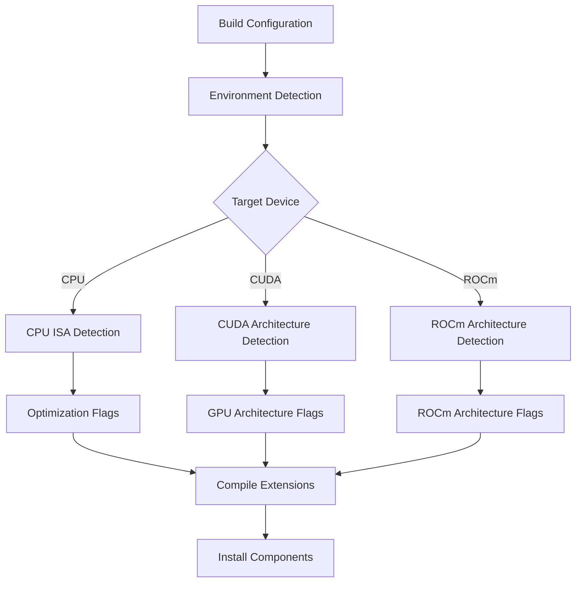
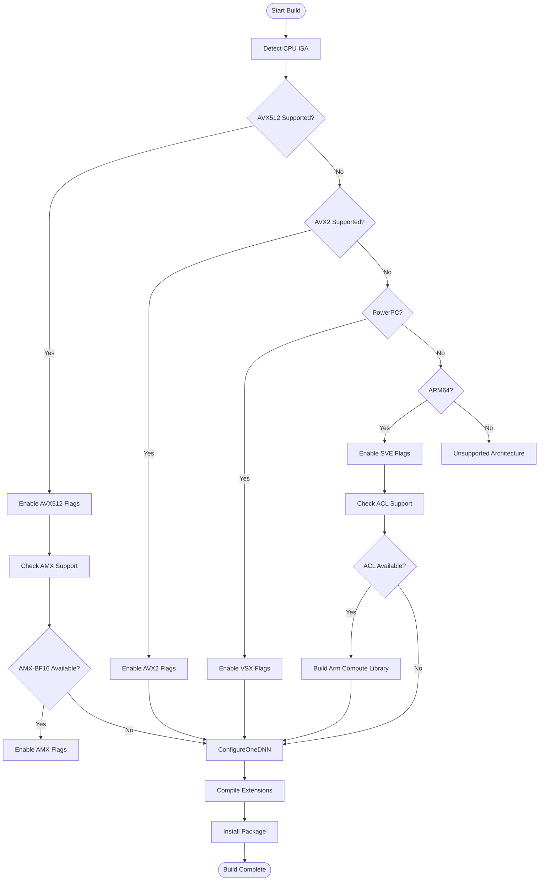
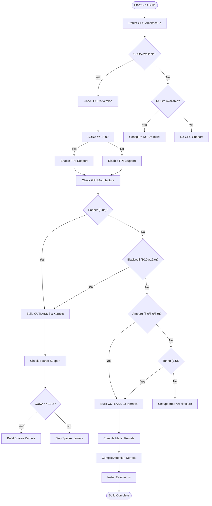
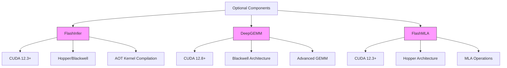

# Building from Source

<cite>
**Referenced Files in This Document**   
- [CMakeLists.txt](file://CMakeLists.txt)
- [setup.py](file://setup.py)
- [pyproject.toml](file://pyproject.toml)
- [requirements/build.txt](file://requirements/build.txt)
- [requirements/cuda.txt](file://requirements/cuda.txt)
- [requirements/cpu.txt](file://requirements/cpu.txt)
- [cmake/utils.cmake](file://cmake/utils.cmake)
- [cmake/cpu_extension.cmake](file://cmake/cpu_extension.cmake)
- [cmake/external_projects/flashmla.cmake](file://cmake/external_projects/flashmla.cmake)
- [tools/install_deepgemm.sh](file://tools/install_deepgemm.sh)
- [tools/flashinfer-build.sh](file://tools/flashinfer-build.sh)
</cite>

## Table of Contents
1. [Introduction](#introduction)
2. [Build Requirements](#build-requirements)
3. [Build Process Overview](#build-process-overview)
4. [CMake Configuration System](#cmake-configuration-system)
5. [CPU Build Process](#cpu-build-process)
6. [GPU Build Process](#gpu-build-process)
7. [Optional Components](#optional-components)
8. [Custom Build Configurations](#custom-build-configurations)
9. [Common Build Issues](#common-build-issues)
10. [Performance Considerations](#performance-considerations)

## Introduction

Building vLLM from source enables developers to access the latest features, contribute to the project, and optimize performance for specific hardware configurations. This approach provides several advantages over using precompiled binaries, including the ability to customize build options, enable specific optimizations, and ensure compatibility with particular hardware targets. The build system is designed to be flexible and support multiple platforms, including CPU-only environments and various GPU architectures.

The vLLM build process leverages CMake as the primary build system, integrated with Python's setuptools for package management. This hybrid approach allows for sophisticated configuration of native extensions while maintaining compatibility with Python's packaging ecosystem. The build system automatically detects available hardware capabilities and configures appropriate compilation flags, ensuring optimal performance across different platforms.

**Section sources**
- [CMakeLists.txt](file://CMakeLists.txt#L1-L800)
- [setup.py](file://setup.py#L1-L800)

## Build Requirements

To build vLLM from source, several dependencies must be installed. The core requirements include CMake (version 3.26.1 or higher), Ninja build system, Python (versions 3.10-3.13 supported), and setuptools. These build tools are specified in both pyproject.toml and requirements/build.txt files. For GPU support, CUDA toolkit (version 11.8 or higher recommended) or ROCm must be installed, along with compatible NVIDIA or AMD drivers.

Python dependencies vary based on the target platform. For CUDA-enabled builds, the requirements/cuda.txt file specifies dependencies including PyTorch 2.9.0, FlashInfer 0.5.3, and other GPU-specific libraries. CPU-only builds use requirements/cpu.txt, which includes Intel Extension for PyTorch for x86_64 systems and py-cpuinfo for ARM-based processors. The build system automatically selects the appropriate requirements based on the detected hardware environment.

Additional system-level dependencies include development tools such as gcc/g++ (version 12.3 or higher recommended for AVX512 support), libgomp, and numa libraries. For ARM64 platforms, the build process automatically fetches and compiles Arm Compute Library as a dependency for oneDNN. The build system also supports optional acceleration libraries like sccache or ccache for faster compilation times.

**Section sources**
- [pyproject.toml](file://pyproject.toml#L1-L306)
- [requirements/build.txt](file://requirements/build.txt#L1-L12)
- [requirements/cuda.txt](file://requirements/cuda.txt#L1-L14)
- [requirements/cpu.txt](file://requirements/cpu.txt#L1-L22)

## Build Process Overview

The vLLM build process follows a standardized workflow that begins with configuration and ends with installation. The process is initiated through Python's setuptools interface, which orchestrates the CMake build system for compiling native extensions. When running `pip install .` or `python setup.py install`, the build_ext command in setup.py configures and executes the CMake build, ensuring proper integration with Python's packaging system.

The build process consists of several key phases: environment detection, dependency resolution, configuration, compilation, and installation. During environment detection, the build system identifies the target device (CPU, CUDA, or ROCm) and available hardware capabilities. Dependency resolution fetches required external projects like CUTLASS or oneDNN using CMake's FetchContent module. The configuration phase sets appropriate compilation flags and architecture targets based on the detected environment.

Compilation is optimized through parallel processing, with the number of jobs automatically determined based on available CPU cores. For CUDA builds, nvcc compilation threads can be controlled via the NVCC_THREADS environment variable to balance compilation speed and system resource usage. The final installation phase places compiled extensions in the appropriate location within the Python package structure, making them available for import.

**Section sources**
- [setup.py](file://setup.py#L88-L274)
- [CMakeLists.txt](file://CMakeLists.txt#L1-L800)

## CMake Configuration System

The vLLM build system uses CMake as the foundation for managing the compilation of native extensions. The CMakeLists.txt file defines the project structure, specifies compilation requirements, and orchestrates the build process for various components. Key configuration variables include VLLM_TARGET_DEVICE (specifying cpu, cuda, or rocm), CMAKE_BUILD_TYPE (setting optimization level), and VLLM_PYTHON_EXECUTABLE (identifying the Python interpreter).

The build system employs a modular approach to configuration, with specialized CMake scripts for different components. The cmake/utils.cmake file contains utility functions for architecture detection, flag management, and extension definition. For CPU builds, cpu_extension.cmake handles ISA detection and optimization flag configuration based on available CPU features like AVX512, AMX, or ARM SVE. The system automatically detects available instruction sets and enables appropriate optimizations.

Architecture-specific compilation is managed through CUDA_ARCHS variable, which controls the GPU architectures targeted during compilation. The build system supports per-file architecture specification, allowing different components to be compiled for optimal architectures. This approach reduces compilation time while ensuring compatibility with the target hardware. The system also supports advanced features like PTX generation for forward compatibility with future GPU architectures.

**Diagram sources **
- [CMakeLists.txt](file://CMakeLists.txt#L1-L800)
- [cmake/utils.cmake](file://cmake/utils.cmake#L1-L544)
- [cmake/cpu_extension.cmake](file://cmake/cpu_extension.cmake#L1-L417)

**Section sources**
- [CMakeLists.txt](file://CMakeLists.txt#L1-L800)
- [cmake/utils.cmake](file://cmake/utils.cmake#L1-L544)

## CPU Build Process

The CPU build process for vLLM automatically detects available instruction set architectures (ISAs) and configures appropriate optimizations. The build system checks for AVX512, AVX2, PowerPC VSX, ARM SVE, and other CPU features, enabling corresponding optimizations when available. For x86_64 platforms with AVX512 support, the build enables AVX512F, AVX512VL, AVX512BW, and AVX512DQ instruction sets, along with optional AVX512-BF16 and AVX512-VNNI if supported.

The build process also configures matrix multiplication kernels using oneDNN with appropriate backends. For x86-AVX512 and PowerPC platforms, oneDNN is built with native kernels. For ARM64 platforms, the build system automatically fetches and compiles Arm Compute Library as the backend for oneDNN, providing optimized GEMM operations. The system also links against libgomp from PyTorch's distribution to ensure ABI compatibility.

Compilation flags are set based on the detected CPU features. For AVX512-capable processors, the build enables aggressive optimizations including f16c, avx512f, avx512vl, avx512bw, and avx512dq. For processors with AMX-BF16 support, the build enables amx-bf16 and amx-tile instruction sets. On ARM64 platforms, the build sets appropriate march flags including armv8.2-a+bf16+dotprod+fp16 when BF16 extensions are available.

**Diagram sources **
- [cmake/cpu_extension.cmake](file://cmake/cpu_extension.cmake#L1-L417)

**Section sources**
- [cmake/cpu_extension.cmake](file://cmake/cpu_extension.cmake#L1-L417)

## GPU Build Process

The GPU build process for vLLM is designed to maximize performance across different NVIDIA architectures. The build system automatically detects available GPU architectures and compiles kernels optimized for each supported architecture. For CUDA builds, the system uses nvcc to compile CUDA kernels with architecture-specific optimizations, targeting compute capabilities from 7.5 to 12.0 depending on the CUDA toolkit version.

The build process includes several specialized components for different GPU features. Marlin kernels are compiled for architectures 8.0 and higher, providing optimized GEMM operations for quantized models. CUTLASS-based kernels are compiled for specific architectures: CUTLASS 2.x kernels for architectures 7.5, 8.0, 8.7, and 8.9, and CUTLASS 3.x kernels for Hopper (9.0a) and Blackwell (10.0a, 12.0) architectures. The build system automatically selects the appropriate CUTLASS version based on the target architecture and CUDA toolkit version.

For advanced features like FP8 computation and sparse kernels, the build process includes conditional compilation. FP8 kernels are only compiled for architectures that support FP8 operations (8.9, 10.0a, 12.0), while sparse kernels require CUDA 12.2 or later and are only compiled for Hopper architecture. The system also generates architecture-specific kernels for attention operations, including optimized implementations for Hopper's Transformer Engine.

**Diagram sources **
- [CMakeLists.txt](file://CMakeLists.txt#L1-L800)

**Section sources**
- [CMakeLists.txt](file://CMakeLists.txt#L1-L800)

## Optional Components

vLLM supports several optional components that can be built to enhance performance for specific use cases. These components include FlashInfer for optimized attention operations, DeepGEMM for advanced matrix multiplication, and FlashMLA for multi-head latency attention. Each optional component has specific build requirements and is conditionally compiled based on the target hardware and software environment.

FlashInfer provides optimized attention kernels for Hopper and Blackwell architectures, requiring CUDA 12.3 or later for full functionality. The component is built using the flashinfer-build.sh script, which configures the appropriate CUDA architecture list and builds AOT (Ahead-of-Time) kernels for the target platform. FlashInfer integration enables significant performance improvements for long-context inference scenarios.

DeepGEMM is an optional component that provides highly optimized GEMM operations for Blackwell architecture, requiring CUDA 12.8 or later. The install_deepgemm.sh script handles the build process, automatically detecting the CUDA version and building wheels for the appropriate architecture. DeepGEMM integration can significantly improve throughput for models with large matrix operations.

**Diagram sources **
- [tools/flashinfer-build.sh](file://tools/flashinfer-build.sh#L1-L63)
- [tools/install_deepgemm.sh](file://tools/install_deepgemm.sh#L1-L125)
- [cmake/external_projects/flashmla.cmake](file://cmake/external_projects/flashmla.cmake#L1-L134)

**Section sources**
- [tools/flashinfer-build.sh](file://tools/flashinfer-build.sh#L1-L63)
- [tools/install_deepgemm.sh](file://tools/install_deepgemm.sh#L1-L125)
- [cmake/external_projects/flashmla.cmake](file://cmake/external_projects/flashmla.cmake#L1-L134)

## Custom Build Configurations

The vLLM build system supports various custom configurations to optimize performance for specific hardware targets. Environment variables allow fine-grained control over the build process, enabling developers to customize compilation for their specific use cases. For CPU builds, environment variables like VLLM_CPU_AVX512BF16, VLLM_CPU_AVX512VNNI, and VLLM_CPU_AMXBF16 can be set to explicitly enable or disable specific instruction sets.

For GPU builds, the VLLM_CUTLASS_SRC_DIR environment variable allows using a custom CUTLASS source directory instead of downloading from the default repository. This feature is useful for testing CUTLASS modifications or using optimized versions. The NVCC_THREADS environment variable controls the number of parallel threads used by nvcc during compilation, allowing users to balance compilation speed with system resource usage.

The build system also supports cross-compilation scenarios through environment variables that specify target architecture features. For CPU builds, VLLM_CPU_DISABLE_AVX512 can be set to disable AVX512 instructions even on compatible processors, useful for creating portable binaries. The build process respects these environment variables while maintaining sensible defaults for automatic hardware detection.

**Section sources**
- [cmake/cpu_extension.cmake](file://cmake/cpu_extension.cmake#L1-L417)
- [CMakeLists.txt](file://CMakeLists.txt#L1-L800)

## Common Build Issues

Several common issues may arise during the vLLM build process, primarily related to CUDA version mismatches, missing dependencies, or incompatible hardware configurations. One frequent issue is CUDA version incompatibility, where the installed CUDA toolkit version does not match the requirements of optional components like FlashInfer or DeepGEMM. The build system provides warnings for version mismatches but continues compilation with reduced functionality.

Missing dependencies are another common issue, particularly for CPU builds that require specific development libraries. On Linux systems, missing libgomp or numa development packages can prevent successful compilation. The build system attempts to locate libgomp from PyTorch's distribution, but system-level installation of development packages may be required in some cases.

Hardware capability mismatches can also cause build failures. For CPU builds, the requirement for AVX512, AVX2, or equivalent instruction sets means the build will fail on older processors. The error message clearly indicates the missing instruction set support. For GPU builds, attempting to compile for architectures not supported by the installed CUDA toolkit will result in compilation errors, with the build system providing guidance on minimum required versions for specific features.

**Section sources**
- [CMakeLists.txt](file://CMakeLists.txt#L1-L800)
- [cmake/cpu_extension.cmake](file://cmake/cpu_extension.cmake#L1-L417)

## Performance Considerations

The vLLM build configuration significantly impacts runtime performance, with different options providing varying levels of optimization for specific hardware targets. For CPU deployments, enabling AVX512 and AMX-BF16 instructions can provide substantial performance improvements for quantized models, while oneDNN with Arm Compute Library backend optimizes performance on ARM64 platforms.

For GPU deployments, the choice of kernel implementations affects both memory usage and computational efficiency. Marlin kernels provide excellent performance for 4-bit quantized models on Ampere and newer architectures, while CUTLASS-based kernels offer flexibility across different architectures. The build system automatically selects the most appropriate kernel implementations based on the target hardware, balancing performance and compatibility.

Compilation optimization flags also impact performance. The build system uses RelWithDebInfo as the default build type, providing a balance between optimization and debuggability. For maximum performance, rebuilding with Release configuration can provide additional speed improvements, though at the cost of reduced debug information. The use of compilation caches like sccache can significantly reduce rebuild times during development.

**Section sources**
- [CMakeLists.txt](file://CMakeLists.txt#L1-L800)
- [cmake/cpu_extension.cmake](file://cmake/cpu_extension.cmake#L1-L417)