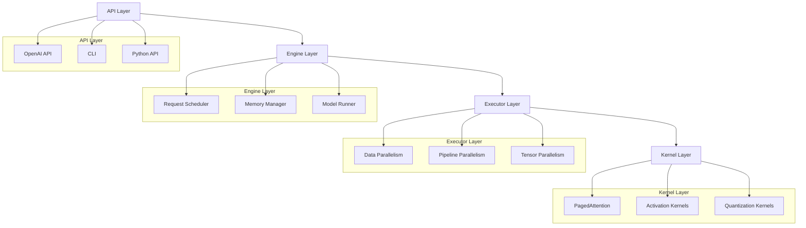
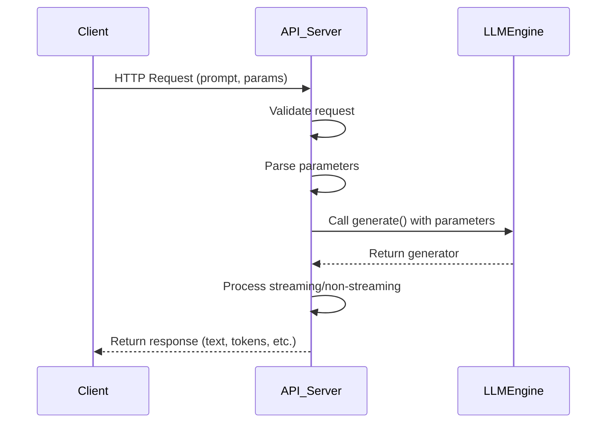
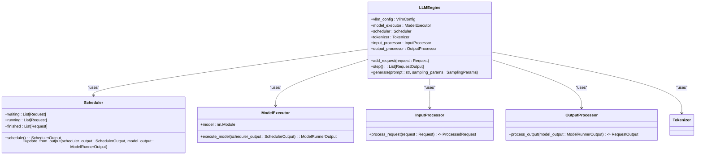
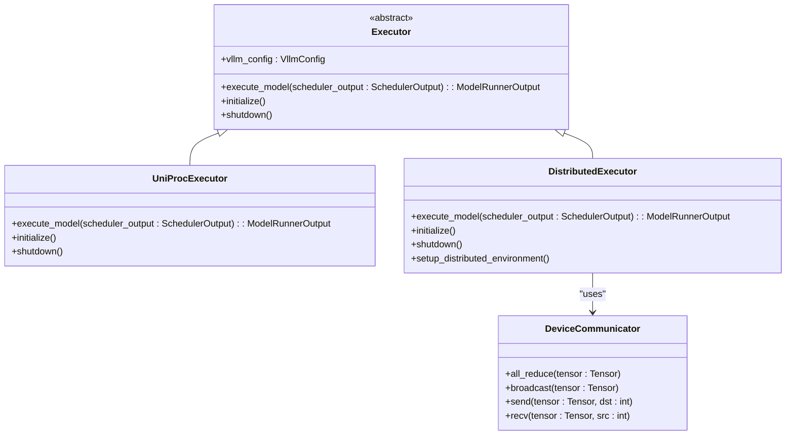
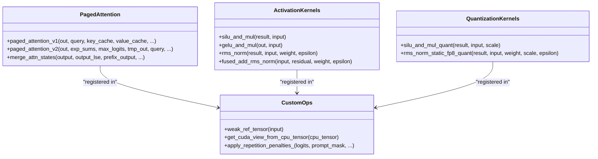
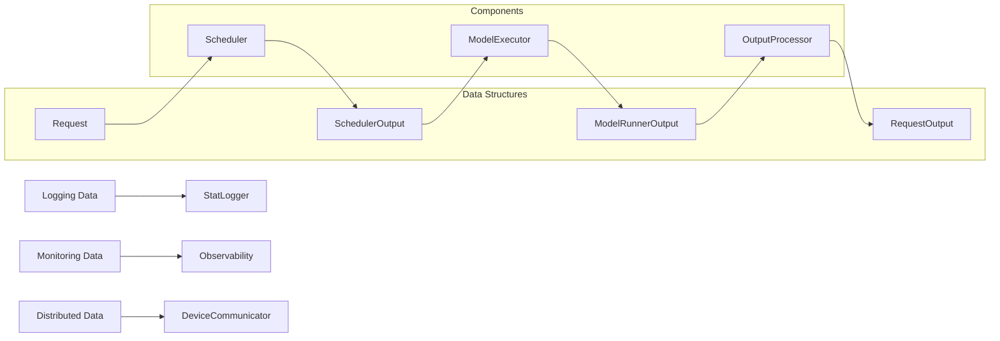
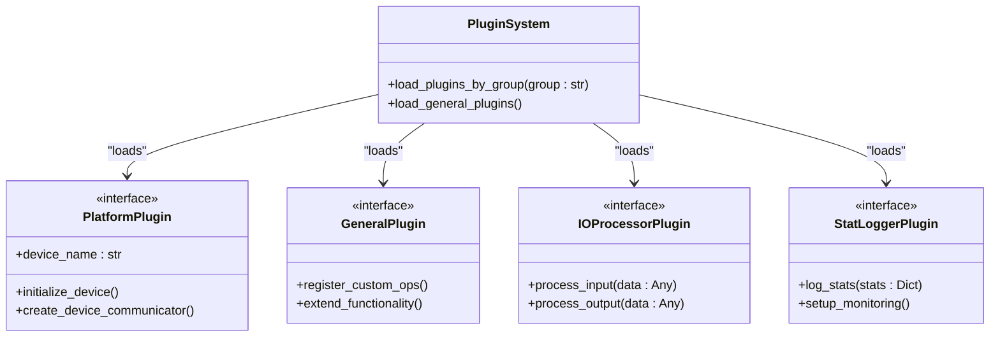
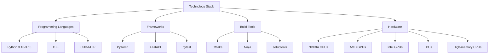
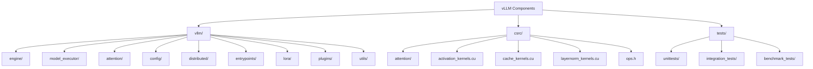
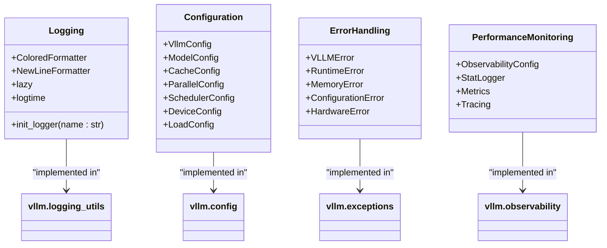

# Code Structure Overview

<cite>
**Referenced Files in This Document**   
- [README.md](file://README.md)
- [setup.py](file://setup.py)
- [pyproject.toml](file://pyproject.toml)
- [vllm/__init__.py](file://vllm/__init__.py)
- [vllm/engine/llm_engine.py](file://vllm/engine/llm_engine.py)
- [vllm/v1/engine/llm_engine.py](file://vllm/v1/engine/llm_engine.py)
- [vllm/entrypoints/api_server.py](file://vllm/entrypoints/api_server.py)
- [vllm/model_executor/__init__.py](file://vllm/model_executor/__init__.py)
- [vllm/platforms/__init__.py](file://vllm/platforms/__init__.py)
- [vllm/config/__init__.py](file://vllm/config/__init__.py)
- [vllm/logging_utils/__init__.py](file://vllm/logging_utils/__init__.py)
- [csrc/torch_bindings.cpp](file://csrc/torch_bindings.cpp)
- [csrc/activation_kernels.cu](file://csrc/activation_kernels.cu)
- [vllm/plugins/__init__.py](file://vllm/plugins/__init__.py)
- [vllm/model_executor/models/registry.py](file://vllm/model_executor/models/registry.py)
</cite>

## Table of Contents
1. [Introduction](#introduction)
2. [Component Organization and Layering](#component-organization-and-layering)
3. [API Layer](#api-layer)
4. [Engine Layer](#engine-layer)
5. [Executor Layer](#executor-layer)
6. [Kernel Layer](#kernel-layer)
7. [Request Flow from Ingestion to Execution](#request-flow-from-ingestion-to-execution)
8. [Data Flows Between Components](#data-flows-between-components)
9. [Modular Architecture and Plugin System](#modular-architecture-and-plugin-system)
10. [Infrastructure Requirements and Technology Stack](#infrastructure-requirements-and-technology-stack)
11. [Component Breakdown](#component-breakdown)
12. [Cross-Cutting Concerns](#cross-cutting-concerns)
13. [Conclusion](#conclusion)

## Introduction

vLLM is a high-throughput and memory-efficient inference and serving engine for Large Language Models (LLMs). The architecture is designed with clear separation between different layers: API layer, engine layer, executor layer, and kernel layer. This documentation provides a comprehensive overview of the code structure, component organization, and architectural decisions that enable vLLM's performance and flexibility.

The system is built to support various hardware platforms including NVIDIA GPUs, AMD GPUs, Intel GPUs, TPUs, and CPUs, with optimized kernels for each platform. The modular design allows for extensibility through a plugin system while maintaining high performance through efficient memory management and optimized execution.

**Section sources**
- [README.md](file://README.md#L67-L91)

## Component Organization and Layering

vLLM's architecture follows a layered approach with four main layers: API layer, engine layer, executor layer, and kernel layer. Each layer has a specific responsibility and interacts with adjacent layers through well-defined interfaces.

The API layer handles client requests and responses, providing multiple interfaces including OpenAI-compatible API, CLI, and direct Python API. The engine layer manages the core inference workflow, including request scheduling, memory management, and execution orchestration. The executor layer handles distributed execution across multiple devices or nodes, managing data and model parallelism. The kernel layer contains optimized CUDA/HIP kernels for critical operations like attention and activation functions.

This layered architecture enables clear separation of concerns, making the system easier to maintain and extend. Each layer can be developed and optimized independently, while the well-defined interfaces ensure compatibility across the system.



**Diagram sources**
- [vllm/entrypoints/api_server.py](file://vllm/entrypoints/api_server.py#L18-L37)
- [vllm/v1/engine/llm_engine.py](file://vllm/v1/engine/llm_engine.py#L64-L84)
- [vllm/v1/executor/__init__.py](file://vllm/v1/executor/__init__.py#L3-L6)
- [csrc/torch_bindings.cpp](file://csrc/torch_bindings.cpp#L19-L200)

**Section sources**
- [README.md](file://README.md#L71-L89)
- [vllm/__init__.py](file://vllm/__init__.py#L16-L41)

## API Layer

The API layer in vLLM provides multiple interfaces for interacting with the inference engine. The primary interface is the OpenAI-compatible API server, which allows seamless integration with existing applications that use the OpenAI API. This server is built using FastAPI and provides endpoints for text generation, chat completions, embeddings, and other LLM operations.

In addition to the HTTP API, vLLM provides a CLI interface for command-line operations and a Python API for programmatic access. The Python API exposes classes like `LLM` and `AsyncLLMEngine` that can be directly imported and used in Python applications. The API layer handles request validation, parameter parsing, and response formatting, abstracting away the complexity of the underlying engine.

The API layer is designed to be extensible, with support for custom endpoints and middleware. It also includes features like request batching, streaming responses, and OpenAPI documentation generation. The separation of the API layer from the engine layer allows for independent development and deployment of API interfaces.



**Diagram sources**
- [vllm/entrypoints/api_server.py](file://vllm/entrypoints/api_server.py#L46-L94)
- [vllm/__init__.py](file://vllm/__init__.py#L21-L23)

**Section sources**
- [vllm/entrypoints/api_server.py](file://vllm/entrypoints/api_server.py#L18-L185)
- [vllm/__init__.py](file://vllm/__init__.py#L16-L41)

## Engine Layer

The engine layer is the core of vLLM's inference system, responsible for managing the entire inference workflow. The main component is the `LLMEngine` class, which orchestrates request scheduling, memory management, model execution, and result generation. The engine layer is designed to be both efficient and flexible, supporting various inference patterns and optimization techniques.

Key components of the engine layer include the request scheduler, which implements continuous batching of incoming requests; the memory manager, which uses PagedAttention for efficient attention key-value memory management; and the model runner, which executes the model layers and handles tensor operations. The engine layer also manages advanced features like speculative decoding, prefix caching, and LoRA (Low-Rank Adaptation) support.

The engine layer is configurable through various parameters that control batching behavior, memory usage, and execution options. It supports both synchronous and asynchronous operation modes, allowing integration with different application architectures. The design emphasizes throughput and memory efficiency, making it suitable for high-load serving scenarios.



**Diagram sources**
- [vllm/v1/engine/llm_engine.py](file://vllm/v1/engine/llm_engine.py#L64-L295)
- [vllm/v1/core/sched/scheduler.py](file://vllm/v1/core/sched/scheduler.py#L1214-L1246)

**Section sources**
- [vllm/v1/engine/llm_engine.py](file://vllm/v1/engine/llm_engine.py#L64-L295)
- [vllm/engine/llm_engine.py](file://vllm/engine/llm_engine.py#L4-L7)

## Executor Layer

The executor layer in vLLM handles distributed execution across multiple devices or nodes, enabling scaling to large models and high throughput requirements. The executor layer abstracts the complexity of distributed computing, providing a unified interface for data parallelism, pipeline parallelism, and tensor parallelism.

The main component is the `Executor` class, which is responsible for managing the distributed execution environment. Different executor implementations handle specific parallelism strategies and hardware configurations. For example, the `UniProcExecutor` handles single-process execution, while other executors manage multi-process or multi-node setups.

The executor layer manages device communication, data transfer between devices, and synchronization of distributed operations. It integrates with PyTorch's distributed communication backends (like NCCL for NVIDIA GPUs) and provides abstractions for collective operations like all-reduce and broadcast. The layer also handles model partitioning and device placement, ensuring efficient utilization of available hardware resources.



**Diagram sources**
- [vllm/v1/executor/__init__.py](file://vllm/v1/executor/__init__.py#L3-L6)
- [vllm/distributed/device_communicators/__init__.py](file://vllm/distributed/device_communicators/__init__.py)

**Section sources**
- [vllm/v1/executor/__init__.py](file://vllm/v1/executor/__init__.py#L3-L6)
- [vllm/distributed/__init__.py](file://vllm/distributed/__init__.py)

## Kernel Layer

The kernel layer in vLLM contains optimized CUDA/HIP kernels for critical operations that benefit from low-level optimization. These kernels are implemented in C++ and CUDA, exposed to Python through PyTorch's C++ extension mechanism. The kernel layer is responsible for the highest-performance operations in the system, particularly those involving large tensor computations.

Key components of the kernel layer include PagedAttention kernels for efficient attention computation with paged memory management, activation function kernels (like SiLU, GELU, and custom activations), and quantization kernels for low-precision computation. The layer also includes custom operators for specialized operations like fused attention and normalization.

The kernel layer is designed to be hardware-agnostic where possible, with conditional compilation for different GPU architectures (NVIDIA, AMD). It integrates with optimized libraries like FlashAttention and FlashInfer when available, providing fallback implementations when these libraries are not present. The kernels are exposed as PyTorch operators, allowing seamless integration with the PyTorch computational graph.



**Diagram sources**
- [csrc/torch_bindings.cpp](file://csrc/torch_bindings.cpp#L19-L200)
- [csrc/activation_kernels.cu](file://csrc/activation_kernels.cu#L205-L235)

**Section sources**
- [csrc/torch_bindings.cpp](file://csrc/torch_bindings.cpp#L19-L200)
- [csrc/activation_kernels.cu](file://csrc/activation_kernels.cu#L205-L235)

## Request Flow from Ingestion to Execution

The request flow in vLLM follows a well-defined path from ingestion through the API layer to final execution and response generation. This flow is designed for high throughput and low latency, with optimizations at each stage.

When a request arrives at the API server, it is first validated and parsed into a structured format. The request parameters are converted into a `SamplingParams` object, and the prompt is tokenized. The request is then passed to the `LLMEngine` which adds it to the scheduler's waiting queue.

During the scheduling phase, the scheduler determines which requests can be processed together in the next batch based on available memory and other constraints. Selected requests are moved to the running state, and their execution metadata is prepared. The scheduler output, containing information about which requests to process and how to process them, is passed to the model executor.

The model executor executes the model layers on the selected requests, using the appropriate kernels for each operation. For the first tokens (prefill phase), the full prompt is processed. For subsequent tokens (decode phase), only the new token is processed. The model output is then processed by the output processor to generate the final response, which is returned to the client.

```mermaid
flowchart TD
A[Client Request] --> B[API Server]
B --> C[Request Validation]
C --> D[Parameter Parsing]
D --> E[Tokenization]
E --> F[LLMEngine.add_request()]
F --> G[Scheduler Waiting Queue]
G --> H{Scheduler.cycle()}
H --> I[Batch Selection]
I --> J[Memory Allocation]
J --> K[Model Execution]
K --> L[PagedAttention Kernel]
L --> M[Activation Functions]
M --> N[Output Processing]
N --> O[Response Generation]
O --> P[Client Response]
style A fill:#f9f,stroke:#333
style P fill:#f9f,stroke:#333
```

**Diagram sources**
- [vllm/entrypoints/api_server.py](file://vllm/entrypoints/api_server.py#L46-L94)
- [vllm/v1/engine/llm_engine.py](file://vllm/v1/engine/llm_engine.py#L285-L294)
- [vllm/v1/core/sched/scheduler.py](file://vllm/v1/core/sched/scheduler.py#L1214-L1246)

**Section sources**
- [vllm/entrypoints/api_server.py](file://vllm/entrypoints/api_server.py#L46-L94)
- [vllm/v1/engine/llm_engine.py](file://vllm/v1/engine/llm_engine.py#L285-L294)

## Data Flows Between Components

Data flows in vLLM follow a structured pattern between components, with well-defined data structures and interfaces. The primary data flow is the request data, which includes the input prompt, sampling parameters, and metadata, and the output data, which includes generated tokens, probabilities, and timing information.

Key data structures include the `Request` object, which represents an inference request throughout its lifecycle; the `SchedulerOutput` object, which contains scheduling decisions and execution metadata; the `ModelRunnerOutput` object, which contains the raw model outputs; and the `RequestOutput` object, which represents the final response to the client.

Data flows from the API layer to the engine layer as a request, which is then transformed through various stages. The scheduler produces scheduling decisions that guide the model execution. The model executor produces raw outputs that are processed into the final response format. Throughout this flow, data is optimized for performance, with techniques like tensor fusion and memory pooling.

The system also manages auxiliary data flows for features like logging, monitoring, and distributed coordination. These flows are kept separate from the main inference path to minimize overhead and ensure reliability.



**Diagram sources**
- [vllm/v1/engine/llm_engine.py](file://vllm/v1/engine/llm_engine.py#L291-L294)
- [vllm/outputs.py](file://vllm/outputs.py)
- [vllm/sampling_params.py](file://vllm/sampling_params.py)

**Section sources**
- [vllm/v1/engine/llm_engine.py](file://vllm/v1/engine/llm_engine.py#L291-L294)
- [vllm/outputs.py](file://vllm/outputs.py)
- [vllm/sampling_params.py](file://vllm/sampling_params.py)

## Modular Architecture and Plugin System

vLLM's architecture is designed to be highly modular, with a plugin system that allows for extensibility without modifying the core codebase. The plugin system is based on Python's entry points mechanism, allowing external packages to register plugins that extend vLLM's functionality.

There are several types of plugins supported by vLLM:
- Platform plugins: Add support for new hardware platforms
- General plugins: Extend functionality with custom operations or features
- IO processor plugins: Customize input/output processing
- Stat logger plugins: Add custom logging and monitoring capabilities

The plugin system is designed to be non-invasive, with plugins loaded at runtime and integrated through well-defined interfaces. This allows the community to contribute new features and integrations without requiring changes to the core vLLM codebase. The system also supports out-of-tree plugins, enabling private or experimental extensions.

The modular design extends to other aspects of the system, with components like attention backends, quantization methods, and model architectures implemented as pluggable modules. This modularity enables vLLM to support a wide range of models and use cases while maintaining a clean and maintainable codebase.



**Diagram sources**
- [vllm/plugins/__init__.py](file://vllm/plugins/__init__.py#L1-L81)
- [vllm/platforms/__init__.py](file://vllm/platforms/__init__.py#L1-L278)
- [tests/plugins/vllm_add_dummy_platform/setup.py](file://tests/plugins/vllm_add_dummy_platform/setup.py#L1-L18)

**Section sources**
- [vllm/plugins/__init__.py](file://vllm/plugins/__init__.py#L1-L81)
- [vllm/platforms/__init__.py](file://vllm/platforms/__init__.py#L1-L278)
- [tests/plugins/vllm_add_dummy_platform/setup.py](file://tests/plugins/vllm_add_dummy_platform/setup.py#L1-L18)

## Infrastructure Requirements and Technology Stack

vLLM has specific infrastructure requirements and is built on a modern technology stack that enables its high-performance inference capabilities. The system is primarily implemented in Python, with performance-critical components written in C++ and CUDA for GPU acceleration.

The core technology stack includes:
- Python 3.10-3.13 as the primary programming language
- PyTorch as the deep learning framework
- CUDA/HIP for GPU kernel execution
- CMake and Ninja for build automation
- FastAPI for the HTTP API server
- Various testing frameworks including pytest

Hardware requirements vary depending on the model size and inference workload, but generally include:
- NVIDIA GPUs with compute capability 7.0 or higher (Ampere or newer)
- AMD GPUs with CDNA architecture
- Intel GPUs with Xe architecture
- TPUs for Google Cloud deployments
- High-memory systems for large models

The build system is designed to be flexible, supporting both pre-compiled wheels and source compilation. The setup.py script handles platform detection and configuration, ensuring that the appropriate dependencies and optimizations are applied for the target environment.



**Diagram sources**
- [pyproject.toml](file://pyproject.toml#L1-L44)
- [setup.py](file://setup.py#L1-L800)
- [requirements/cuda.txt](file://requirements/cuda.txt)
- [requirements/rocm.txt](file://requirements/rocm.txt)

**Section sources**
- [pyproject.toml](file://pyproject.toml#L1-L44)
- [setup.py](file://setup.py#L1-L800)
- [README.md](file://README.md#L89)

## Component Breakdown

The vLLM codebase is organized into several main components, each with a specific responsibility. The primary package is `vllm/`, which contains the core functionality, while `csrc/` contains the C++ and CUDA kernels, and `tests/` contains the test suite.

The `vllm/` package is further divided into subpackages:
- `engine/`: Core engine components like LLMEngine and scheduler
- `model_executor/`: Model loading and execution logic
- `attention/`: Attention mechanisms and backends
- `config/`: Configuration classes and utilities
- `distributed/`: Distributed computing components
- `entrypoints/`: API endpoints and CLI interfaces
- `lora/`: LoRA (Low-Rank Adaptation) support
- `plugins/`: Plugin system and interfaces
- `utils/`: Utility functions and helpers

The `csrc/` directory contains the performance-critical kernels implemented in C++ and CUDA, organized by functionality:
- `attention/`: PagedAttention and related kernels
- `activation_kernels.cu`: Activation function kernels
- `cache_kernels.cu`: KV cache management kernels
- `layernorm_kernels.cu`: Normalization kernels
- `ops.h`: Operator declarations

This component breakdown enables clear separation of concerns and makes the codebase easier to navigate and maintain. Each component has a well-defined interface and responsibility, reducing coupling between different parts of the system.



**Diagram sources**
- [vllm/__init__.py](file://vllm/__init__.py)
- [csrc/torch_bindings.cpp](file://csrc/torch_bindings.cpp)
- [tests/__init__.py](file://tests/__init__.py)

**Section sources**
- [vllm/__init__.py](file://vllm/__init__.py)
- [csrc/torch_bindings.cpp](file://csrc/torch_bindings.cpp)
- [vllm/model_executor/models/registry.py](file://vllm/model_executor/models/registry.py#L1130-L1183)

## Cross-Cutting Concerns

vLLM addresses several cross-cutting concerns that affect multiple components of the system. These include logging, configuration, error handling, and performance monitoring, which are implemented consistently across the codebase.

Logging in vLLM is handled through Python's standard logging module, with custom formatters and handlers for different output formats. The system provides detailed logs for debugging and monitoring, with configurable log levels and output destinations. Logging is used extensively throughout the codebase to track request processing, memory usage, and performance metrics.

Configuration is managed through a comprehensive system of configuration classes that represent different aspects of the system (model, cache, parallelism, etc.). These configurations are validated and combined into a unified `VllmConfig` object that is passed to components that need it. The configuration system supports both programmatic and command-line interfaces, making it flexible for different deployment scenarios.

Error handling follows Python best practices, with specific exception types for different error conditions. The system includes comprehensive error handling for hardware failures, memory allocation errors, and invalid inputs. Errors are logged with context information to aid debugging, and appropriate error responses are returned to clients.



**Diagram sources**
- [vllm/logging_utils/__init__.py](file://vllm/logging_utils/__init__.py#L1-L14)
- [vllm/config/__init__.py](file://vllm/config/__init__.py#L1-L103)
- [vllm/logger.py](file://vllm/logger.py)

**Section sources**
- [vllm/logging_utils/__init__.py](file://vllm/logging_utils/__init__.py#L1-L14)
- [vllm/config/__init__.py](file://vllm/config/__init__.py#L1-L103)
- [vllm/logger.py](file://vllm/logger.py)

## Conclusion

vLLM's architecture is designed for high-performance LLM inference with a clear separation of concerns between different layers. The system's modular design, with distinct API, engine, executor, and kernel layers, enables both high throughput and flexibility. The request flow is optimized for continuous batching and efficient memory management, while the plugin system allows for extensibility without compromising the core codebase.

The technology stack leverages Python for high-level orchestration and C++/CUDA for performance-critical operations, providing a balance between developer productivity and execution efficiency. The cross-cutting concerns of logging, configuration, and error handling are addressed consistently throughout the codebase, making the system robust and maintainable.

This architectural approach has enabled vLLM to achieve state-of-the-art performance in LLM serving while supporting a wide range of models, hardware platforms, and use cases. The design principles of modularity, performance, and usability continue to guide the project's development and evolution.