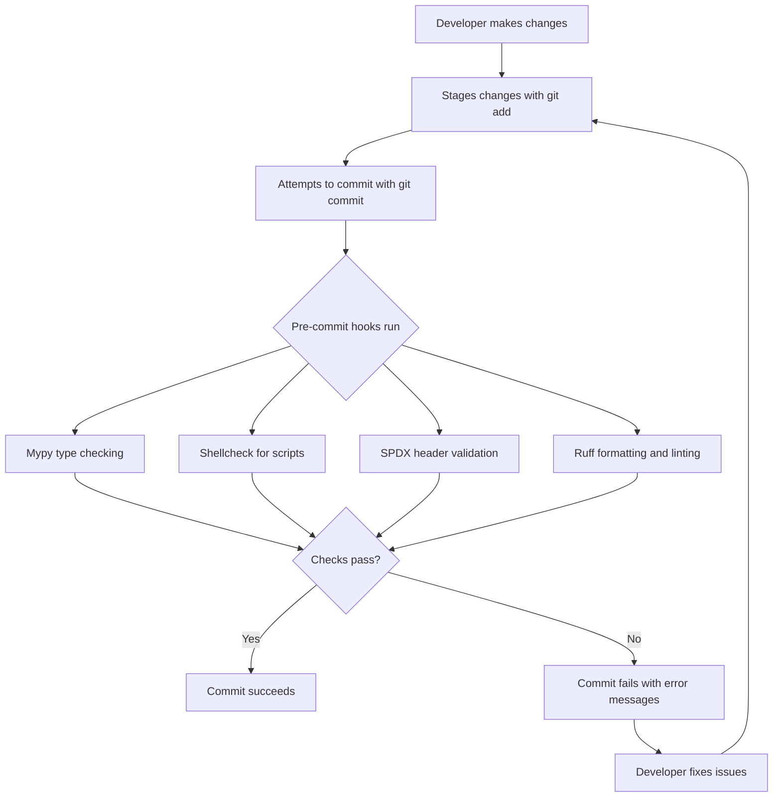
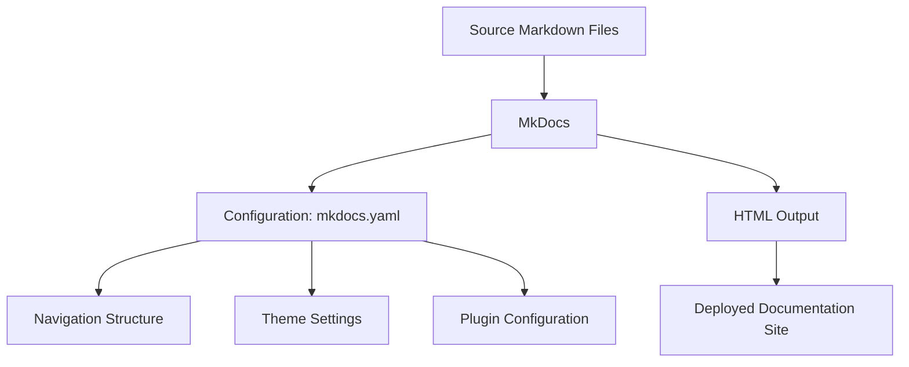

# Contributing Guidelines

<cite>
**Referenced Files in This Document**   
- [CONTRIBUTING.md](file://CONTRIBUTING.md)
- [CODE_OF_CONDUCT.md](file://CODE_OF_CONDUCT.md)
- [README.md](file://README.md)
- [pyproject.toml](file://pyproject.toml)
- [requirements/lint.txt](file://requirements/lint.txt)
- [tools/pre_commit/check_spdx_header.py](file://tools/pre_commit/check_spdx_header.py)
- [tools/pre_commit/mypy.py](file://tools/pre_commit/mypy.py)
- [tools/pre_commit/shellcheck.sh](file://tools/pre_commit/shellcheck.sh)
- [SECURITY.md](file://SECURITY.md)
- [mkdocs.yaml](file://mkdocs.yaml)
</cite>

## Table of Contents
1. [Introduction](#introduction)
2. [Code of Conduct](#code-of-conduct)
3. [Contribution Workflow](#contribution-workflow)
4. [Code Quality and Style Requirements](#code-quality-and-style-requirements)
5. [Testing Requirements](#testing-requirements)
6. [Documentation Updates](#documentation-updates)
7. [Pull Request Review Process](#pull-request-review-process)
8. [Backward Compatibility](#backward-compatibility)
9. [Security Reporting](#security-reporting)
10. [Conclusion](#conclusion)

## Introduction

This document provides comprehensive guidelines for contributing to the vLLM project, a high-throughput and memory-efficient inference and serving engine for Large Language Models (LLMs). The vLLM project welcomes contributions from the community and has established processes to ensure code quality, consistency, and maintainability across all contributions.

The contribution process is designed to be accessible to both new and experienced contributors, with clear workflows from issue creation to pull request merging. This document outlines the complete contribution workflow, including code style requirements, testing expectations, documentation updates, and the code review process.

vLLM is a community-driven project originally developed in the Sky Computing Lab at UC Berkeley, with contributions from both academia and industry. The project aims to provide a fast, easy-to-use library for LLM inference and serving, with features including state-of-the-art serving throughput, efficient memory management with PagedAttention, continuous batching of incoming requests, and support for various quantization methods.

**Section sources**
- [README.md](file://README.md#L65-L115)
- [CONTRIBUTING.md](file://CONTRIBUTING.md#L1-L4)

## Code of Conduct

The vLLM community is committed to fostering a welcoming, diverse, inclusive, and healthy environment for all members, contributors, and leaders. The Code of Conduct establishes clear standards for behavior within the community and applies to all community spaces as well as when individuals are officially representing the community in public spaces.

### Our Pledge

All members, contributors, and leaders pledge to make participation in the vLLM community a harassment-free experience for everyone, regardless of age, body size, disability, ethnicity, gender identity and expression, experience level, education, socioeconomic status, nationality, appearance, race, religion, or sexual identity and orientation.

### Our Standards

Positive behaviors that contribute to a healthy community include:
- Demonstrating empathy and kindness toward others
- Being respectful of differing opinions, viewpoints, and experiences
- Giving and gracefully accepting constructive feedback
- Accepting responsibility and apologizing for mistakes
- Focusing on what is best for the overall community

Unacceptable behaviors include:
- Use of sexualized language or imagery
- Trolling, insults, derogatory comments, or personal attacks
- Public or private harassment
- Publishing others' private information without permission
- Other conduct inappropriate in a professional setting

### Enforcement

Instances of abusive, harassing, or otherwise unacceptable behavior can be reported to community leaders in the #code-of-conduct channel in the vLLM Slack. All complaints are reviewed and investigated promptly and fairly, with community leaders respecting the privacy and security of reporters.

**Section sources**
- [CODE_OF_CONDUCT.md](file://CODE_OF_CONDUCT.md#L1-L128)

## Contribution Workflow

The vLLM contribution workflow follows a standardized process from issue creation to pull request merging, ensuring that all contributions are properly reviewed and integrated into the codebase.

### Issue Creation

Before submitting a pull request, contributors are encouraged to create an issue to discuss the proposed changes. This allows for early feedback and ensures alignment with the project's goals and roadmap. Issues should include:

- A clear description of the problem or feature
- Steps to reproduce (for bug reports)
- Expected behavior vs. actual behavior
- Environment information (vLLM version, Python version, hardware)

Issues are triaged by the core team, who may label them according to priority, type (bug, feature, enhancement), and area of the codebase.

### Development Process

Once an issue has been discussed and approved, contributors can begin development:

1. Fork the vLLM repository
2. Create a new branch for the changes
3. Implement the changes following code style guidelines
4. Write appropriate tests
5. Update documentation as needed
6. Run pre-commit hooks to ensure code quality

### Pull Request Submission

When development is complete, contributors should submit a pull request (PR) with:

- A clear title describing the changes
- A detailed description explaining the motivation, implementation approach, and any alternatives considered
- References to the related issue(s)
- Information about testing performed
- Any breaking changes or backward compatibility considerations

The PR template guides contributors to provide all necessary information for reviewers to evaluate the changes effectively.

**Section sources**
- [CONTRIBUTING.md](file://CONTRIBUTING.md#L1-L4)
- [README.md](file://README.md#L178-L182)

## Code Quality and Style Requirements

vLLM enforces strict code quality and style requirements through automated pre-commit hooks and CI/CD pipelines to maintain consistency and prevent common errors.

### Pre-commit Hooks

The project uses pre-commit hooks to automatically check code quality before commits are made. These hooks are configured in the repository and run automatically when changes are committed. The main pre-commit checks include:

- **Mypy**: Static type checking for Python code
- **Shellcheck**: Linting for shell scripts
- **SPDX headers**: Verification of license and copyright headers
- **Ruff**: Python code formatting and linting



**Diagram sources**
- [tools/pre_commit/mypy.py](file://tools/pre_commit/mypy.py#L110-L158)
- [tools/pre_commit/shellcheck.sh](file://tools/pre_commit/shellcheck.sh)
- [tools/pre_commit/check_spdx_header.py](file://tools/pre_commit/check_spdx_header.py#L1-L151)

### Code Style Guidelines

#### Python Code

Python code in vLLM follows PEP 8 style guidelines with some project-specific conventions:

- Use Ruff for code formatting (configured in pyproject.toml)
- Include type hints for all function parameters and return values
- Follow the project's import ordering and grouping conventions
- Write comprehensive docstrings using Google style format
- Keep lines under 88 characters (configured in Ruff)

#### SPDX License Headers

All source files must include proper SPDX license headers to ensure proper licensing and copyright attribution:

```python
# SPDX-License-Identifier: Apache-2.0
# SPDX-FileCopyrightText: Copyright contributors to the vLLM project
```

The pre-commit hook `check_spdx_header.py` automatically verifies that all Python files have the correct headers and will fail the commit if headers are missing or incorrect.

#### Commit Message Format

Commit messages should follow a conventional format:

```
<type>: <subject>

<body>

<footer>
```

Where:
- `<type>` is one of: feat, fix, docs, style, refactor, test, chore
- `<subject>` is a brief description (50 characters or less)
- `<body>` provides additional context and motivation
- `<footer>` references issues or PRs (e.g., "Fixes #123")

**Section sources**
- [pyproject.toml](file://pyproject.toml#L54-L87)
- [tools/pre_commit/check_spdx_header.py](file://tools/pre_commit/check_spdx_header.py#L1-L151)
- [requirements/lint.txt](file://requirements/lint.txt#L1-L3)

## Testing Requirements

Comprehensive testing is a critical requirement for all contributions to ensure code quality and prevent regressions.

### Test Coverage

All new code must be accompanied by appropriate tests with sufficient coverage. The project uses pytest as the primary testing framework, with tests organized by functionality in the `tests/` directory.

Test types include:
- Unit tests: Testing individual functions and classes in isolation
- Integration tests: Testing interactions between components
- End-to-end tests: Testing complete workflows
- Benchmark tests: Performance testing and regression detection

### Writing Effective Tests

When writing tests, contributors should follow these guidelines:

1. **Test one thing at a time**: Each test should verify a single behavior or functionality
2. **Use descriptive test names**: Test function names should clearly describe what is being tested
3. **Include edge cases**: Test boundary conditions and error scenarios
4. **Use fixtures for setup**: Leverage pytest fixtures to reduce code duplication
5. **Parameterize when appropriate**: Use pytest.mark.parametrize for testing multiple inputs

Example test structure:
```python
def test_function_name():
    # Arrange: Set up test data and dependencies
    input_data = {...}
    expected_output = {...}
    
    # Act: Execute the function or method being tested
    result = function_under_test(input_data)
    
    # Assert: Verify the results match expected behavior
    assert result == expected_output
```

### Running Tests

Tests can be run locally using pytest:
```bash
# Run all tests
pytest

# Run tests in a specific directory
pytest tests/models/

# Run a specific test file
pytest tests/test_config.py

# Run tests with coverage reporting
pytest --cov=vllm
```

The CI/CD pipeline runs tests automatically on all pull requests, including unit tests, integration tests, and style checks.

**Section sources**
- [tests/test_config.py](file://tests/test_config.py#L1-L800)
- [pyproject.toml](file://pyproject.toml#L98-L110)

## Documentation Updates

Documentation updates are required for all new features and significant changes to ensure users can effectively use and understand the functionality.

### Types of Documentation

The vLLM project maintains several types of documentation:

1. **API Documentation**: Auto-generated from docstrings, providing detailed information about classes, functions, and parameters
2. **User Guides**: Step-by-step tutorials and how-to guides for common use cases
3. **Conceptual Documentation**: Explanations of key concepts, architecture, and design decisions
4. **Reference Documentation**: Comprehensive reference material for configuration options, command-line interfaces, and APIs

### Documentation Standards

When updating documentation, contributors should follow these standards:

- Use clear, concise language accessible to users with varying technical backgrounds
- Include code examples demonstrating usage
- Provide context for why a feature exists and when to use it
- Update examples to reflect current best practices
- Use consistent terminology throughout the documentation

### MkDocs Configuration

The project uses MkDocs for documentation generation, with configuration in `mkdocs.yaml`. This file defines the site structure, navigation, and build settings.



**Diagram sources**
- [mkdocs.yaml](file://mkdocs.yaml)
- [README.md](file://README.md#L14-L15)

**Section sources**
- [mkdocs.yaml](file://mkdocs.yaml)
- [README.md](file://README.md#L14-L15)

## Pull Request Review Process

The pull request review process is designed to ensure code quality, maintainability, and alignment with project goals.

### Review Criteria

Pull requests are evaluated based on several criteria:

1. **Functionality**: Does the code work as intended and solve the stated problem?
2. **Code Quality**: Is the code well-structured, readable, and maintainable?
3. **Testing**: Are appropriate tests included with good coverage?
4. **Documentation**: Is the code properly documented and are user-facing changes documented?
5. **Performance**: Are there any performance implications or optimizations needed?
6. **Security**: Are there any potential security vulnerabilities?
7. **Style**: Does the code follow project style guidelines?

### Review Workflow

1. **Automated Checks**: When a PR is submitted, automated checks run (CI/CD pipeline):
   - Code formatting and style checks
   - Static type checking
   - Test execution
   - Coverage reporting

2. **Initial Review**: A maintainer performs an initial review to:
   - Verify the PR addresses a valid issue or feature request
   - Check that all required elements are present (description, tests, documentation)
   - Assign appropriate labels and reviewers

3. **Technical Review**: Assigned reviewers conduct a thorough code review, focusing on:
   - Code correctness and logic
   - Architecture and design decisions
   - Error handling and edge cases
   - Performance considerations
   - Test quality and coverage

4. **Iteration**: The contributor addresses feedback and makes requested changes. Additional review cycles may occur until all concerns are resolved.

5. **Approval and Merge**: Once all reviewers approve and automated checks pass, a maintainer merges the PR.

### Reviewer Expectations

Reviewers are expected to:
- Provide timely feedback (within a few business days)
- Be constructive and respectful in comments
- Focus on the code, not the contributor
- Suggest alternatives when rejecting approaches
- Acknowledge good work and improvements

Contributors are expected to:
- Respond to review comments promptly
- Be open to feedback and willing to make changes
- Provide clarification when needed
- Test changes after addressing feedback

**Section sources**
- [CONTRIBUTING.md](file://CONTRIBUTING.md#L1-L4)
- [README.md](file://README.md#L178-L182)

## Backward Compatibility

Maintaining backward compatibility is a high priority for the vLLM project to ensure users can upgrade safely and predictably.

### Compatibility Principles

The project follows these principles for backward compatibility:

1. **No Breaking Changes in Patch Releases**: Patch releases (e.g., 0.4.1 to 0.4.2) should not contain breaking changes.
2. **Deprecation Period**: Before removing or significantly changing public APIs, a deprecation period of at least one minor release is required.
3. **Clear Migration Paths**: When breaking changes are necessary, clear migration guides should be provided.
4. **Versioned APIs**: Where appropriate, maintain multiple versions of APIs during transition periods.

### Handling Breaking Changes

When a breaking change is necessary:

1. **Deprecate First**: Mark the old functionality as deprecated with warnings.
2. **Provide Alternative**: Implement and document the new approach.
3. **Document Changes**: Update documentation to explain the change and migration steps.
4. **Communicate**: Announce the change in release notes and appropriate channels.

Example deprecation pattern:
```python
import warnings

def old_function():
    warnings.warn(
        "old_function is deprecated and will be removed in v0.5.0. "
        "Use new_function instead.",
        DeprecationWarning,
        stacklevel=2
    )
    # Original implementation
```

### API Stability

The project distinguishes between public and internal APIs:

- **Public APIs**: Stable interfaces intended for user consumption (e.g., classes in vllm.api, configuration options)
- **Internal APIs**: Implementation details subject to change without notice (e.g., modules with underscore prefixes, private methods)

Contributors should avoid making internal APIs public without careful consideration and review.

**Section sources**
- [README.md](file://README.md#L117-L120)

## Security Reporting

Security is a critical concern for the vLLM project, and responsible disclosure is essential for maintaining the safety of users.

### Reporting Security Issues

Security issues should be reported privately using GitHub's Security Advisories feature rather than through public issues or discussions. This allows the core team to address the vulnerability before it is publicly known, preventing potential exploitation.

To report a security issue:
1. Visit the [vulnerability submission form](https://github.com/vllm-project/vllm/security/advisories/new)
2. Provide detailed information about the vulnerability
3. Include steps to reproduce and potential impact
4. The vulnerability management team will acknowledge receipt and begin triage

### Vulnerability Management

Reports are triaged by the vulnerability management team, which assesses the severity and coordinates a fix. The team follows a structured process:

1. **Triage**: Initial assessment of the reported issue
2. **Reproduction**: Verify the vulnerability can be reproduced
3. **Impact Analysis**: Determine the severity and affected versions
4. **Fix Development**: Develop and test a fix
5. **Coordinated Disclosure**: Plan the public disclosure with appropriate timing

### Severity Levels

The project uses the following severity categories:

- **CRITICAL**: Remote code execution, full system compromise (CVSS ≥ 9.0)
- **HIGH**: Serious security flaws requiring advanced conditions (CVSS 7.0-8.9)
- **MODERATE**: Denial of service or partial disruption (CVSS 4.0-6.9)
- **LOW**: Minor issues with negligible impact (CVSS < 4.0)

### Prenotification

For severe issues (CRITICAL, HIGH, or MODERATE severity), the project may prenotify certain organizations or vendors that ship vLLM. This allows for coordinated release of fixes and helps protect users during the vulnerability remediation process.

**Section sources**
- [SECURITY.md](file://SECURITY.md#L1-L51)

## Conclusion

Contributing to vLLM is a collaborative process that values code quality, thorough testing, comprehensive documentation, and respectful community interactions. By following the guidelines outlined in this document, contributors can ensure their work aligns with project standards and is efficiently integrated into the codebase.

The contribution workflow—from issue creation to pull request merging—is designed to maintain the high quality and reliability that vLLM users expect. Automated tools like pre-commit hooks and CI/CD pipelines help enforce code style and catch issues early, while the code review process ensures technical excellence and alignment with project goals.

Maintaining backward compatibility and addressing security responsibly are critical aspects of the project's commitment to its users. By following these guidelines, contributors help ensure that vLLM continues to be a robust, reliable, and innovative platform for LLM inference and serving.

The vLLM community welcomes contributions of all kinds, from bug fixes and feature implementations to documentation improvements and issue triaging. Every contribution helps advance the project's mission of providing easy, fast, and cheap LLM serving for everyone.

[No sources needed since this section summarizes without analyzing specific files]