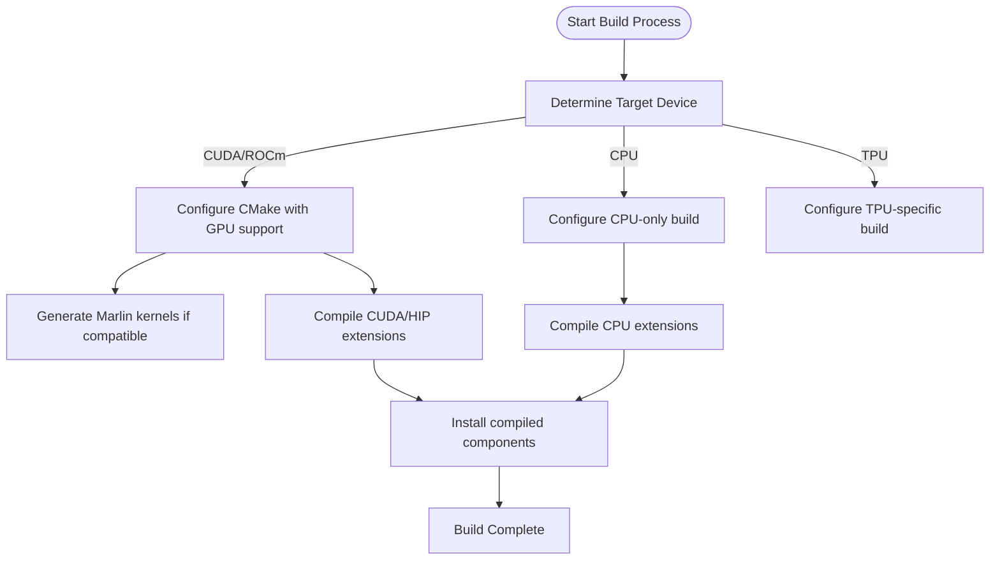
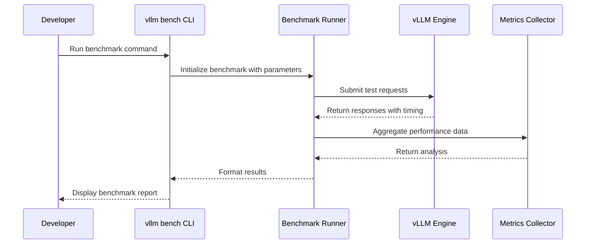

# Development

<cite>
**Referenced Files in This Document**   
- [CONTRIBUTING.md](file://CONTRIBUTING.md)
- [README.md](file://README.md)
- [pyproject.toml](file://pyproject.toml)
- [setup.py](file://setup.py)
- [CMakeLists.txt](file://CMakeLists.txt)
- [requirements/dev.txt](file://requirements/dev.txt)
- [requirements/build.txt](file://requirements/build.txt)
- [tests/conftest.py](file://tests/conftest.py)
- [benchmarks/README.md](file://benchmarks/README.md)
- [tests/benchmarks/test_throughput_cli.py](file://tests/benchmarks/test_throughput_cli.py)
- [tests/benchmarks/test_latency_cli.py](file://tests/benchmarks/test_latency_cli.py)
</cite>

## Table of Contents
1. [Introduction](#introduction)
2. [Community Contributions and Code Quality](#community-contributions-and-code-quality)
3. [Build Process from Source](#build-process-from-source)
4. [Testing Framework](#testing-framework)
5. [Contribution Guidelines](#contribution-guidelines)
6. [Development Workflow](#development-workflow)
7. [Performance Measurement and Optimization](#performance-measurement-and-optimization)
8. [Troubleshooting Common Issues](#troubleshooting-common-issues)
9. [Conclusion](#conclusion)

## Introduction

This document provides comprehensive guidance for developers contributing to the vLLM codebase. vLLM is a high-throughput and memory-efficient inference and serving engine for large language models (LLMs), originally developed at UC Berkeley's Sky Computing Lab and now maintained as a community-driven project. The documentation covers essential aspects of development including build processes, testing frameworks, contribution guidelines, and performance optimization strategies. The goal is to enable developers to effectively contribute to the project while maintaining high code quality standards.

## Community Contributions and Code Quality

vLLM welcomes contributions from the community and values collaboration between academia and industry. The project maintains high code quality through several mechanisms:

- **Code of Conduct**: All contributors are expected to follow the project's code of conduct which promotes a respectful and inclusive environment.
- **Peer Review**: All contributions undergo thorough code review by maintainers and community members.
- **Automated Testing**: Comprehensive test suites ensure code changes don't introduce regressions.
- **Documentation Standards**: Clear documentation is required for new features and significant changes.
- **Sponsorship and Support**: The project receives support from leading technology organizations including NVIDIA, AMD, AWS, and Google Cloud, ensuring resources for development and testing.

The project's success depends on maintaining these quality standards while enabling community participation. Contributions are coordinated through GitHub issues, pull requests, and the developer Slack channel.

**Section sources**
- [README.md](file://README.md#L116-L120)
- [CODE_OF_CONDUCT.md](file://CODE_OF_CONDUCT.md)

## Build Process from Source

### Dependencies

The build process requires several dependencies that are specified in the project's configuration files. Key dependencies include:

- CMake (≥3.26.1)
- Ninja build system
- Python (3.10-3.13)
- PyTorch (2.9.0)
- CUDA toolkit (for GPU support)
- ROCm (for AMD GPU support)

These dependencies are managed through the `requirements/build.txt` file and `pyproject.toml` configuration.

### Compilation Steps

The build process is orchestrated through setuptools and CMake, with different paths depending on the target device:



**Diagram sources**
- [setup.py](file://setup.py#L723-L779)
- [CMakeLists.txt](file://CMakeLists.txt#L1-L800)

The build process automatically detects the appropriate configuration based on the system environment and available hardware. For CUDA builds, the process generates optimized kernels for the specific GPU architecture, including Marlin kernels for quantized models when compatible architectures are detected.

### Build Configuration

The build system supports several configuration options through environment variables:

- `VLLM_TARGET_DEVICE`: Specifies the target device (cuda, rocm, cpu, tpu)
- `VLLM_USE_PRECOMPILED`: Uses precompiled binaries instead of building from source
- `MAX_JOBS`: Controls the number of parallel compilation jobs
- `NVCC_THREADS`: Sets the number of threads for nvcc compilation

These options allow developers to customize the build process based on their specific requirements and hardware capabilities.

**Section sources**
- [setup.py](file://setup.py#L38-L62)
- [CMakeLists.txt](file://CMakeLists.txt#L20-L23)

## Testing Framework

### Unit Tests

vLLM uses pytest as its primary testing framework, with tests organized by functionality in the `tests/` directory. The test suite includes:

- Basic correctness tests
- Distributed execution tests
- Kernel-level tests
- Model-specific tests
- Multimodal input tests

The testing framework provides fixtures for common testing scenarios, including the `HfRunner` fixture which facilitates comparison between vLLM and Hugging Face Transformers outputs.

### Integration Tests

Integration tests verify the interaction between different components of the system. These tests are organized in subdirectories based on functionality:

- `distributed/`: Tests for multi-GPU and multi-node configurations
- `entrypoints/`: Tests for API endpoints and command-line interfaces
- `kernels/`: Tests for custom CUDA kernels
- `lora/`: Tests for LoRA (Low-Rank Adaptation) functionality
- `model_executor/`: Tests for model loading and execution

### Benchmarking Tools

vLLM includes comprehensive benchmarking tools to measure performance characteristics:

- **Throughput benchmarks**: Measure tokens per second under various batch sizes and sequence lengths
- **Latency benchmarks**: Measure request response times and percentiles
- **Memory benchmarks**: Track GPU memory usage during inference
- **Feature-specific benchmarks**: Test specialized functionality like prefix caching, speculative decoding, and multimodal inference

The benchmarking framework can be accessed through the command line interface:

```bash
vllm bench throughput --model meta-llama/Llama-3.2-1B-Instruct --input-len 32 --output-len 1
vllm bench latency --model meta-llama/Llama-3.2-1B-Instruct --input-len 32 --output-len 1
```



**Diagram sources**
- [benchmarks/README.md](file://benchmarks/README.md#L1-L21)
- [tests/benchmarks/test_throughput_cli.py](file://tests/benchmarks/test_throughput_cli.py#L1-L31)
- [tests/benchmarks/test_latency_cli.py](file://tests/benchmarks/test_latency_cli.py#L1-L31)

**Section sources**
- [tests/conftest.py](file://tests/conftest.py#L1-L800)
- [benchmarks/README.md](file://benchmarks/README.md#L1-L21)

## Contribution Guidelines

### Code Style

The project enforces consistent code style through automated tools:

- **Ruff**: Used for Python linting with rules configured in `pyproject.toml`
- **Mypy**: Static type checking to catch type-related errors
- **Typos**: Spell checking for code and documentation
- **Black**: Code formatting (implied by ruff configuration)

Developers should ensure their code passes all linting checks before submitting pull requests.

### Pull Requests

When creating pull requests, contributors should:

1. Fork the repository and create a feature branch
2. Implement changes with comprehensive tests
3. Ensure all tests pass locally
4. Include clear documentation for new features
5. Reference relevant issues in the pull request description
6. Respond promptly to review feedback

### Code Review

The code review process emphasizes:

- **Correctness**: Ensuring the implementation works as intended
- **Performance**: Verifying that changes don't degrade performance
- **Maintainability**: Code should be clear and well-documented
- **Compatibility**: Changes should maintain backward compatibility when possible
- **Testing**: Adequate test coverage for new functionality

Reviewers typically check for adherence to coding standards, potential edge cases, and overall design quality.

**Section sources**
- [pyproject.toml](file://pyproject.toml#L54-L142)
- [CONTRIBUTING.md](file://CONTRIBUTING.md#L1-L4)

## Development Workflow

### Setting Up the Development Environment

1. Clone the repository:
```bash
git clone https://github.com/vllm-project/vllm.git
cd vllm
```

2. Install development dependencies:
```bash
pip install -r requirements/dev.txt
```

3. Install vLLM in editable mode:
```bash
pip install -e .
```

### Adding New Features

When adding new features, follow this workflow:

1. Create a new branch from main
2. Implement the feature with appropriate tests
3. Verify the feature works as expected
4. Run all tests locally
5. Submit a pull request with detailed documentation

### Fixing Bugs

The bug fixing process involves:

1. Reproducing the issue with a minimal example
2. Writing a test that fails due to the bug
3. Implementing the fix
4. Verifying the test now passes
5. Checking for similar issues in related code

### Writing Tests

Effective tests should:

- Cover both normal and edge cases
- Be isolated and reproducible
- Include clear assertions
- Have descriptive names
- Run efficiently

The testing framework provides utilities like the `HfRunner` fixture to simplify test creation and ensure consistency.

**Section sources**
- [requirements/dev.txt](file://requirements/dev.txt#L1-L6)
- [tests/conftest.py](file://tests/conftest.py#L252-L700)

## Performance Measurement and Optimization

### Methodologies

Performance is measured using several key metrics:

- **Throughput**: Tokens per second across all requests
- **Latency**: Time from request submission to first token and completion
- **Memory Usage**: GPU memory consumption during inference
- **Efficiency**: Utilization of available hardware resources

Benchmarks are run under controlled conditions to ensure consistent and comparable results.

### Optimization Strategies

The project employs several optimization techniques:

- **PagedAttention**: Efficient memory management for attention keys and values
- **Continuous Batching**: Processing multiple requests simultaneously
- **CUDA/HIP Graphs**: Reducing kernel launch overhead
- **Quantization**: Model compression techniques like GPTQ, AWQ, and FP8
- **Kernel Fusion**: Combining multiple operations into single kernels
- **Speculative Decoding**: Accelerating generation with draft models

Developers can measure the impact of optimizations using the built-in benchmarking tools and should focus on improvements that benefit real-world use cases.

**Section sources**
- [README.md](file://README.md#L71-L81)
- [benchmarks/README.md](file://benchmarks/README.md#L1-L21)

## Troubleshooting Common Issues

### Test Failures

Common causes of test failures and their solutions:

- **CUDA Out of Memory**: Reduce batch size or sequence length in the test
- **Numerical Precision Issues**: Adjust tolerance thresholds for floating-point comparisons
- **Race Conditions in Distributed Tests**: Ensure proper synchronization between processes
- **Missing Dependencies**: Verify all required packages are installed
- **Hardware Compatibility Issues**: Check that the test is appropriate for the available hardware

### Debugging Techniques

Effective debugging strategies include:

- **Logging**: Use the project's logging system to trace execution flow
- **Reproduction**: Create minimal examples that reproduce the issue
- **Binary Search**: Comment out code sections to isolate the problem
- **Comparison**: Compare outputs with Hugging Face Transformers using the HfRunner fixture
- **Profiling**: Use built-in profiling tools to identify performance bottlenecks

### Environment Issues

Common environment-related problems:

- **CUDA Version Mismatch**: Ensure CUDA toolkit version matches PyTorch requirements
- **GPU Architecture Compatibility**: Verify that the GPU architecture is supported
- **Memory Constraints**: Monitor GPU memory usage and adjust configurations accordingly
- **Dependency Conflicts**: Use isolated environments to avoid package conflicts

**Section sources**
- [tests/conftest.py](file://tests/conftest.py#L158-L177)
- [setup.py](file://setup.py#L558-L575)

## Conclusion

Contributing to vLLM provides an opportunity to work on cutting-edge LLM inference technology used by organizations worldwide. By following the guidelines outlined in this document, developers can effectively contribute to the project while maintaining high code quality standards. The combination of robust testing, comprehensive benchmarks, and clear contribution processes ensures that vLLM continues to deliver high-performance LLM serving capabilities. As the project evolves, these development practices will continue to adapt to meet the changing needs of the LLM ecosystem.