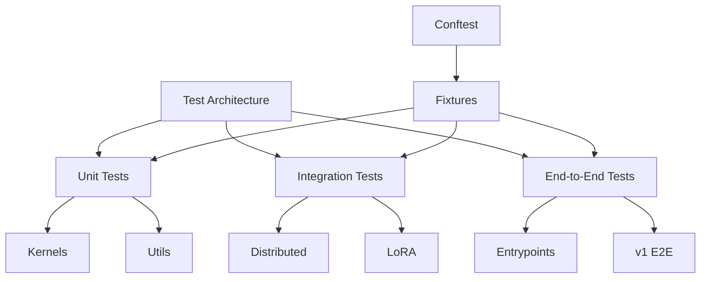
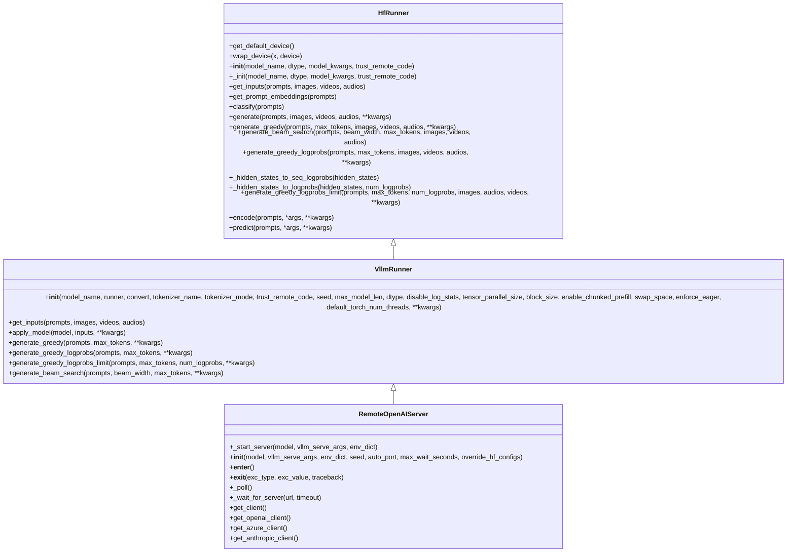
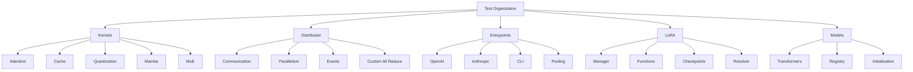
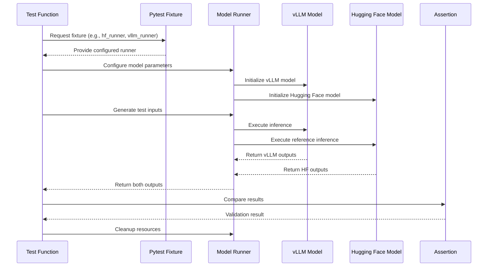
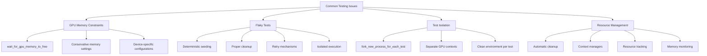

# Testing Guide

<cite>
**Referenced Files in This Document**   
- [conftest.py](file://tests/conftest.py)
- [utils.py](file://tests/utils.py)
- [test_attention.py](file://tests/kernels/attention/test_attention.py)
- [distributed/conftest.py](file://tests/distributed/conftest.py)
- [entrypoints/conftest.py](file://tests/entrypoints/conftest.py)
- [kernels/test_cache_kernels.py](file://tests/kernels/test_cache_kernels.py)
- [lora/test_lora_manager.py](file://tests/lora/test_lora_manager.py)
- [models/test_transformers.py](file://tests/models/test_transformers.py)
- [vllm_test_utils](file://tests/vllm_test_utils)
</cite>

## Table of Contents
1. [Introduction](#introduction)
2. [Test Architecture Overview](#test-architecture-overview)
3. [Pytest-Based Testing Infrastructure](#pytest-based-testing-infrastructure)
4. [Test Organization by Component](#test-organization-by-component)
5. [Writing Tests for Core Components](#writing-tests-for-core-components)
6. [Test Execution Commands](#test-execution-commands)
7. [Common Testing Issues and Solutions](#common-testing-issues-and-solutions)
8. [Conclusion](#conclusion)

## Introduction

The vLLM testing framework is a comprehensive suite designed to ensure the reliability, performance, and correctness of the vLLM inference engine. The test suite is organized into multiple categories including unit tests, integration tests, and end-to-end tests, all built on the pytest framework. The testing infrastructure supports various components of vLLM including attention mechanisms, distributed execution, kernel operations, and model integration. This guide provides detailed documentation on the testing framework, covering the architecture, infrastructure, test organization, and best practices for writing and executing tests.

**Section sources**
- [conftest.py](file://tests/conftest.py#L1-L1465)
- [utils.py](file://tests/utils.py#L1-L1313)

## Test Architecture Overview

The vLLM test architecture is structured to support multiple testing levels from unit tests to end-to-end system tests. The framework is organized into several key directories under the `tests` folder, each serving a specific testing purpose:

- **unit tests**: Located in various component-specific directories, these tests validate individual functions and classes in isolation
- **integration tests**: Found in directories like `distributed`, `lora`, and `kernels`, these tests verify the interaction between multiple components
- **end-to-end tests**: Located in `entrypoints` and `v1/e2e`, these tests validate the complete system workflow from input processing to output generation

The test architecture leverages pytest fixtures extensively to manage test dependencies and setup/teardown operations. The framework supports both CPU and GPU testing, with special handling for distributed execution scenarios. The test suite is designed to be modular, allowing for easy addition of new test cases while maintaining isolation between test categories.

**Diagram sources**
- [conftest.py](file://tests/conftest.py#L1-L1465)
- [utils.py](file://tests/utils.py#L1-L1313)

**Section sources**
- [conftest.py](file://tests/conftest.py#L1-L1465)
- [utils.py](file://tests/utils.py#L1-L1313)

## Pytest-Based Testing Infrastructure

The vLLM testing infrastructure is built on pytest, leveraging its powerful fixture system and plugin ecosystem. The framework uses a hierarchical fixture structure with multiple conftest.py files at different directory levels to provide appropriate fixtures for each test category.

Key components of the pytest infrastructure include:

- **Global fixtures**: Defined in the root `conftest.py`, these include `hf_runner` for Hugging Face model testing and `vllm_runner` for vLLM model testing
- **Distributed testing fixtures**: Located in `tests/distributed/conftest.py`, these handle setup and teardown of distributed environments
- **Entrypoint-specific fixtures**: Found in `tests/entrypoints/conftest.py`, these provide test data and configurations for API endpoint testing

The fixture system enables test isolation while reducing code duplication. For example, the `HfRunner` class provides a consistent interface for running Hugging Face models across different test scenarios, while the `VllmRunner` class does the same for vLLM models. The infrastructure also includes utilities for managing GPU memory, handling timeouts, and ensuring proper cleanup after tests.

**Diagram sources**
- [conftest.py](file://tests/conftest.py#L252-L704)
- [utils.py](file://tests/utils.py#L94-L200)

**Section sources**
- [conftest.py](file://tests/conftest.py#L1-L1465)
- [utils.py](file://tests/utils.py#L1-L1313)

## Test Organization by Component

The vLLM test suite is organized by component to ensure comprehensive coverage of all system aspects. Each component has its dedicated test directory with specific test categories:

- **kernels**: Contains tests for low-level CUDA kernels including attention, cache, and quantization operations
- **distributed**: Includes tests for distributed execution, model parallelism, and communication operations
- **entrypoints**: Covers API endpoints and command-line interfaces
- **lora**: Focuses on LoRA (Low-Rank Adaptation) functionality and integration
- **models**: Validates model loading, configuration, and compatibility with various model types

Each test category serves a specific purpose:
- **Unit tests**: Verify individual functions and methods in isolation
- **Integration tests**: Ensure proper interaction between components
- **End-to-end tests**: Validate complete system workflows from input to output

The organization follows a consistent pattern where each component directory contains test files prefixed with "test_" followed by the specific functionality being tested. This structure enables easy navigation and maintenance of the test suite.

**Diagram sources**
- [project_structure](file://#project-structure)
- [conftest.py](file://tests/conftest.py#L1-L1465)

**Section sources**
- [conftest.py](file://tests/conftest.py#L1-L1465)
- [project_structure](file://#project-structure)

## Writing Tests for Core Components

Writing tests for vLLM core components follows specific patterns and best practices to ensure comprehensive coverage and maintainability. The framework provides utilities and fixtures to simplify test creation for complex components like attention mechanisms and distributed execution.

For attention mechanisms, tests typically follow this pattern:
1. Create test inputs (query, key, value tensors)
2. Set up the attention layer with appropriate configuration
3. Execute the attention operation
4. Compare results against a reference implementation
5. Validate numerical accuracy within acceptable tolerances

For distributed execution, tests focus on:
- Correctness of model parallelism
- Proper communication between processes
- Consistent results across different parallelism configurations
- Memory usage and efficiency

The framework provides specialized utilities like `opcheck` for kernel operation validation and `RemoteOpenAIServer` for end-to-end API testing. When writing tests for new features, developers should leverage existing fixtures and utilities to maintain consistency with the overall test architecture.

**Diagram sources**
- [test_attention.py](file://tests/kernels/attention/test_attention.py#L1-L458)
- [conftest.py](file://tests/conftest.py#L252-L704)
- [utils.py](file://tests/utils.py#L94-L200)

**Section sources**
- [test_attention.py](file://tests/kernels/attention/test_attention.py#L1-L458)
- [conftest.py](file://tests/conftest.py#L1-L1465)
- [utils.py](file://tests/utils.py#L1-L1313)

## Test Execution Commands

The vLLM test suite can be executed using standard pytest commands with various options for controlling test execution. The framework supports running specific test categories, individual test files, or even single test functions.

Common test execution commands include:

- `pytest tests/kernels/` - Run all kernel tests
- `pytest tests/distributed/` - Execute distributed execution tests
- `pytest tests/entrypoints/` - Run API endpoint tests
- `pytest tests/lora/` - Execute LoRA functionality tests
- `pytest tests/models/` - Run model compatibility tests

Additional options for test execution:
- `-v` for verbose output
- `-x` to stop after first failure
- `--tb=short` for concise traceback
- `-k "pattern"` to run tests matching a pattern
- `--durations=N` to show N slowest test durations

For GPU testing, the framework automatically detects available devices and adjusts test parameters accordingly. The test infrastructure includes utilities for managing GPU memory and handling device-specific configurations.

**Section sources**
- [utils.py](file://tests/utils.py#L1-L1313)
- [conftest.py](file://tests/conftest.py#L1-L1465)

## Common Testing Issues and Solutions

The vLLM testing framework addresses several common testing challenges, particularly those related to GPU memory constraints and flaky tests.

**GPU Memory Constraints**: The framework includes utilities for monitoring and managing GPU memory usage during tests. The `wait_for_gpu_memory_to_free` function in `utils.py` allows tests to wait for sufficient GPU memory before proceeding, preventing out-of-memory errors. Tests are designed to use minimal memory where possible, with parameters like `max_model_len` set to conservative values by default.

**Flaky Tests**: The framework employs several strategies to minimize flakiness:
- **Proper test isolation**: Each test runs in isolation with its own resources
- **Deterministic seeding**: Random seeds are set consistently across tests
- **Resource cleanup**: Comprehensive cleanup mechanisms ensure no resource leaks
- **Retry mechanisms**: Critical tests have built-in retry logic for transient failures

**Test Isolation**: The framework uses process-level isolation for distributed tests through the `fork_new_process_for_each_test` decorator. This ensures that each test runs in a clean environment, preventing interference between tests.

**Resource Management**: The test infrastructure includes comprehensive resource management features:
- Automatic cleanup of distributed environments
- Proper teardown of model instances
- Memory cleanup after test completion
- Context manager patterns for resource handling

These solutions ensure reliable and consistent test execution across different environments and configurations.

**Diagram sources**
- [utils.py](file://tests/utils.py#L816-L859)
- [utils.py](file://tests/utils.py#L864-L865)
- [conftest.py](file://tests/conftest.py#L180-L195)

**Section sources**
- [utils.py](file://tests/utils.py#L1-L1313)
- [conftest.py](file://tests/conftest.py#L1-L1465)

## Conclusion

The vLLM testing framework provides a comprehensive and robust infrastructure for ensuring the quality and reliability of the inference engine. Built on pytest, the framework leverages a hierarchical fixture system and modular organization to support unit, integration, and end-to-end testing across all components. The test suite is designed to handle the complexities of modern LLM inference, including distributed execution, kernel optimizations, and advanced features like LoRA. With comprehensive utilities for GPU memory management, test isolation, and resource cleanup, the framework enables reliable and consistent test execution. Developers can leverage the provided patterns and tools to write effective tests for new features, ensuring the continued stability and performance of the vLLM system.