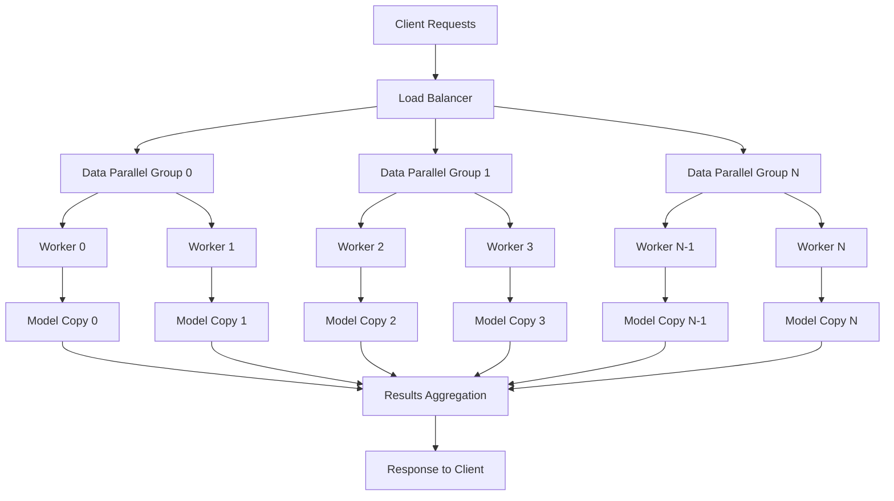
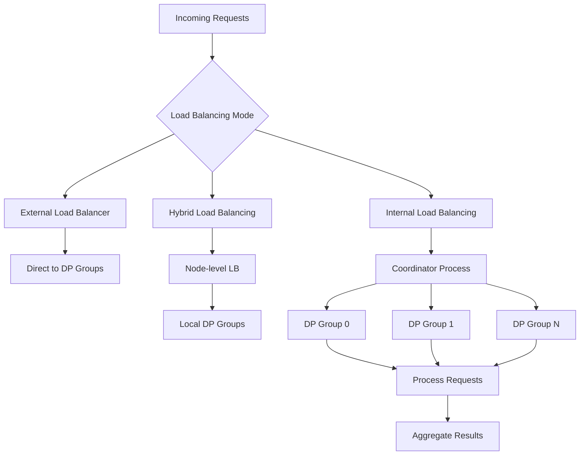
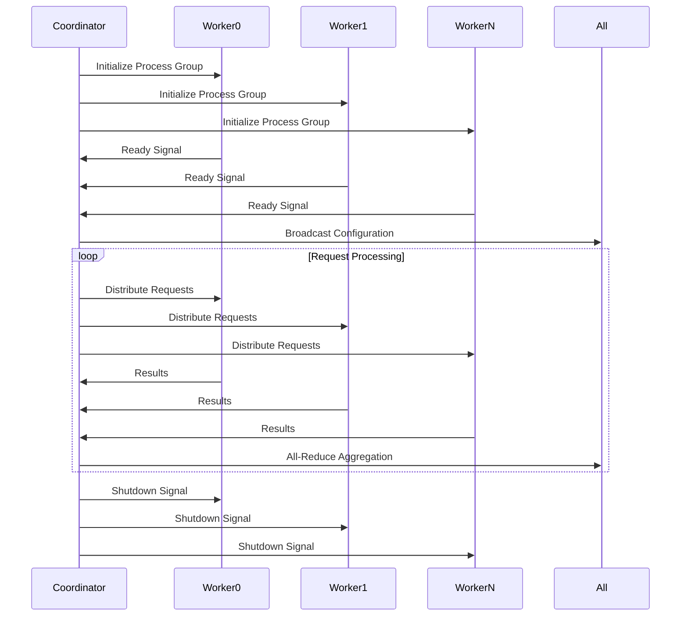
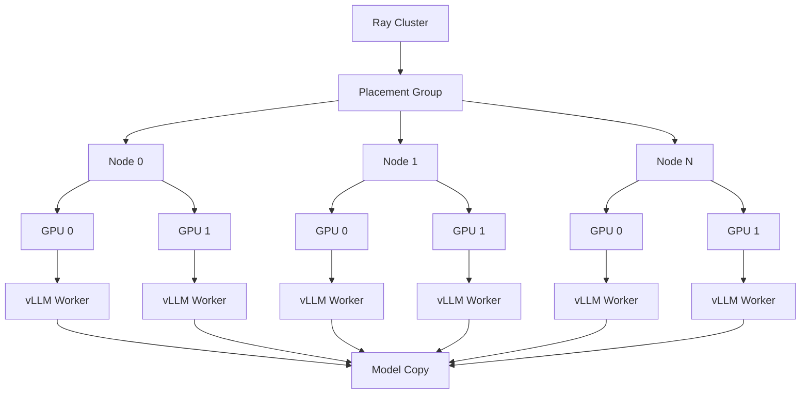

# Data Parallelism

<cite>
**Referenced Files in This Document**   
- [data_parallel.py](file://examples/offline_inference/data_parallel.py)
- [parallel.py](file://vllm/config/parallel.py)
- [parallel_state.py](file://vllm/distributed/parallel_state.py)
- [multiproc_executor.py](file://vllm/v1/executor/multiproc_executor.py)
- [ray_utils.py](file://vllm/v1/executor/ray_utils.py)
</cite>

## Table of Contents
1. [Introduction](#introduction)
2. [Core Architecture](#core-architecture)
3. [Data Parallel Configuration](#data-parallel-configuration)
4. [Request Distribution and Load Balancing](#request-distribution-and-load-balancing)
5. [Synchronization and Communication](#synchronization-and-communication)
6. [Ray Integration for Distributed Execution](#ray-integration-for-distributed-execution)
7. [Implementation Examples](#implementation-examples)
8. [Common Issues and Solutions](#common-issues-and-solutions)
9. [Conclusion](#conclusion)

## Introduction
Data parallelism in vLLM enables high-throughput processing by maintaining multiple copies of the model across different devices to handle multiple requests simultaneously. This approach is particularly effective in high-concurrency scenarios where maximizing throughput is critical. The implementation leverages both multiprocessing and Ray frameworks to distribute workloads efficiently across available hardware resources. By partitioning the request processing across data parallel groups, vLLM can scale horizontally to meet demanding inference requirements while maintaining efficient resource utilization.

## Core Architecture
The data parallelism architecture in vLLM is built around a distributed execution model where multiple worker processes maintain independent copies of the model. Each data parallel group processes a subset of incoming requests, allowing for linear scalability with the number of available devices. The system coordinates these workers through a centralized scheduling mechanism that manages request distribution, result aggregation, and synchronization. The architecture supports both single-node and multi-node deployments, with automatic configuration of communication channels between workers. This design enables efficient load balancing across the cluster while maintaining data consistency through coordinated synchronization points.

**Diagram sources**
- [parallel.py](file://vllm/config/parallel.py#L74-L82)
- [multiproc_executor.py](file://vllm/v1/executor/multiproc_executor.py#L95-L98)

**Section sources**
- [parallel.py](file://vllm/config/parallel.py#L74-L82)
- [multiproc_executor.py](file://vllm/v1/executor/multiproc_executor.py#L95-L98)

## Data Parallel Configuration
The data parallelism implementation in vLLM is controlled through the `ParallelConfig` class, which defines key parameters for distributed execution. The `data_parallel_size` parameter determines the number of data parallel groups, directly impacting system scalability. This configuration works in conjunction with tensor parallelism (`tensor_parallel_size`) and pipeline parallelism (`pipeline_parallel_size`) to create a comprehensive parallelization strategy. The configuration also specifies the backend for distributed execution, supporting both multiprocessing ("mp") and Ray frameworks. Additional parameters control communication settings, including master IP addresses and port numbers for inter-process coordination.

**Section sources**
- [parallel.py](file://vllm/config/parallel.py#L74-L110)

## Request Distribution and Load Balancing
Request distribution in vLLM's data parallelism implementation follows a partitioned approach where incoming requests are divided among available data parallel groups. Each group processes its assigned subset of requests independently, maximizing parallelization efficiency. The system supports multiple load balancing modes, including external, hybrid, and internal load balancing, allowing for flexible deployment configurations. In offline inference scenarios, requests are typically pre-partitioned across ranks, while online serving environments use dynamic load balancing to adapt to changing request patterns. The implementation ensures even distribution of workloads while minimizing communication overhead between parallel groups.

**Diagram sources**
- [data_parallel.py](file://examples/offline_inference/data_parallel.py#L152-L159)
- [parallel.py](file://vllm/config/parallel.py#L98-L109)

**Section sources**
- [data_parallel.py](file://examples/offline_inference/data_parallel.py#L152-L159)
- [parallel.py](file://vllm/config/parallel.py#L98-L109)

## Synchronization and Communication
Synchronization in vLLM's data parallelism implementation relies on PyTorch's distributed communication primitives to coordinate activities across worker processes. The system uses a stateless process group mechanism to establish communication channels between data parallel ranks, with automatic port allocation to prevent conflicts. All-reduce operations are used to synchronize model states and aggregate results, while broadcast operations distribute configuration updates and control signals. The implementation includes robust error handling for worker failures, with monitoring threads that detect process termination and trigger appropriate shutdown procedures. Communication efficiency is optimized through techniques like tensor metadata sharing and asynchronous operations.

**Diagram sources**
- [parallel_state.py](file://vllm/distributed/parallel_state.py#L345-L382)
- [multiproc_executor.py](file://vllm/v1/executor/multiproc_executor.py#L225-L245)

**Section sources**
- [parallel_state.py](file://vllm/distributed/parallel_state.py#L345-L382)
- [multiproc_executor.py](file://vllm/v1/executor/multiproc_executor.py#L225-L245)

## Ray Integration for Distributed Execution
vLLM integrates with the Ray framework to enable distributed execution across multiple nodes and clusters. The Ray integration provides advanced resource management, fault tolerance, and scaling capabilities beyond what's possible with local multiprocessing. When using Ray as the distributed executor backend, vLLM creates a placement group that reserves the necessary GPU resources across the cluster. The `RayWorkerWrapper` class facilitates lazy initialization of worker processes after Ray has configured the CUDA environment. This integration allows for seamless scaling from single-node deployments to large distributed clusters, with automatic handling of inter-node communication and resource allocation.

**Diagram sources**
- [ray_utils.py](file://vllm/v1/executor/ray_utils.py#L41-L124)
- [parallel.py](file://vllm/config/parallel.py#L180-L188)

**Section sources**
- [ray_utils.py](file://vllm/v1/executor/ray_utils.py#L41-L124)
- [parallel.py](file://vllm/config/parallel.py#L180-L188)

## Implementation Examples
The vLLM repository includes concrete examples demonstrating data parallelism implementation in both offline and online scenarios. The offline inference example shows how to distribute a fixed dataset across multiple data parallel ranks, with each rank processing a distinct subset of prompts. This approach is ideal for batch processing workloads where maximum throughput is desired. The example configures data parallel size, tensor parallel size, and other parameters through command-line arguments, making it easy to experiment with different configurations. For online serving, the implementation supports dynamic load balancing and can scale horizontally by adding additional nodes to the cluster.

**Section sources**
- [data_parallel.py](file://examples/offline_inference/data_parallel.py#L142-L172)

## Common Issues and Solutions
Several common challenges arise in data parallelism implementations, including load imbalance, network congestion, and synchronization overhead. vLLM addresses load imbalance through adaptive distribution strategies that account for varying request complexities. Network congestion is mitigated through efficient serialization and batching of communication messages, reducing the frequency and size of data transfers between workers. The system employs adaptive load balancing to dynamically adjust request distribution based on real-time performance metrics. For synchronization issues, vLLM uses timeout mechanisms and health monitoring to detect and recover from worker failures, ensuring system reliability even in large-scale deployments.

**Section sources**
- [parallel.py](file://vllm/config/parallel.py#L167-L169)
- [multiproc_executor.py](file://vllm/v1/executor/multiproc_executor.py#L222-L245)

## Conclusion
vLLM's data parallelism implementation provides a robust foundation for high-throughput inference in both single-node and distributed environments. By leveraging multiple copies of the model across available devices, the system achieves significant performance improvements in high-concurrency scenarios. The integration of Ray for distributed execution enables seamless scaling from local deployments to large clusters, while sophisticated load balancing and synchronization mechanisms ensure efficient resource utilization. The configurable architecture supports various parallelization strategies, allowing users to optimize performance based on their specific hardware and workload requirements. This comprehensive approach makes vLLM well-suited for demanding inference applications that require both high throughput and low latency.