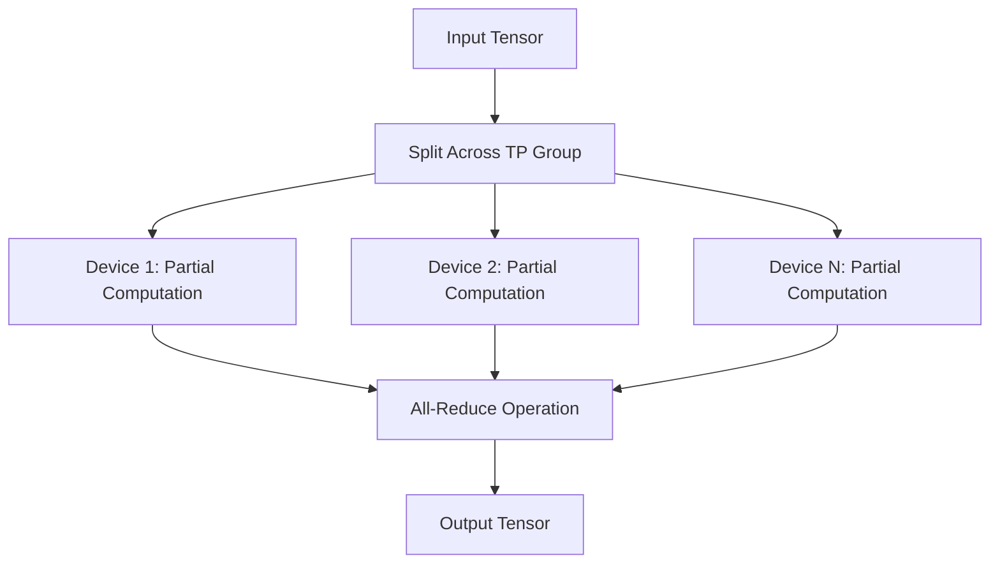
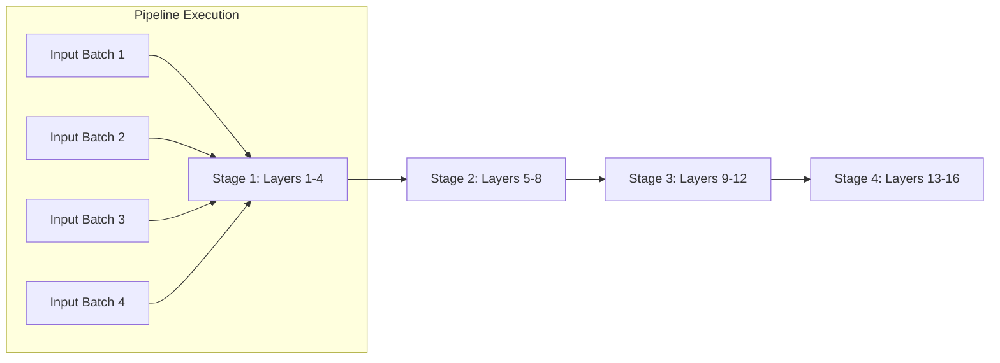
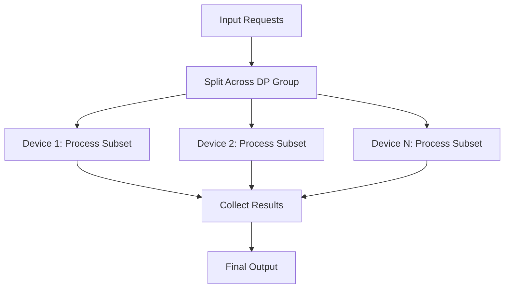
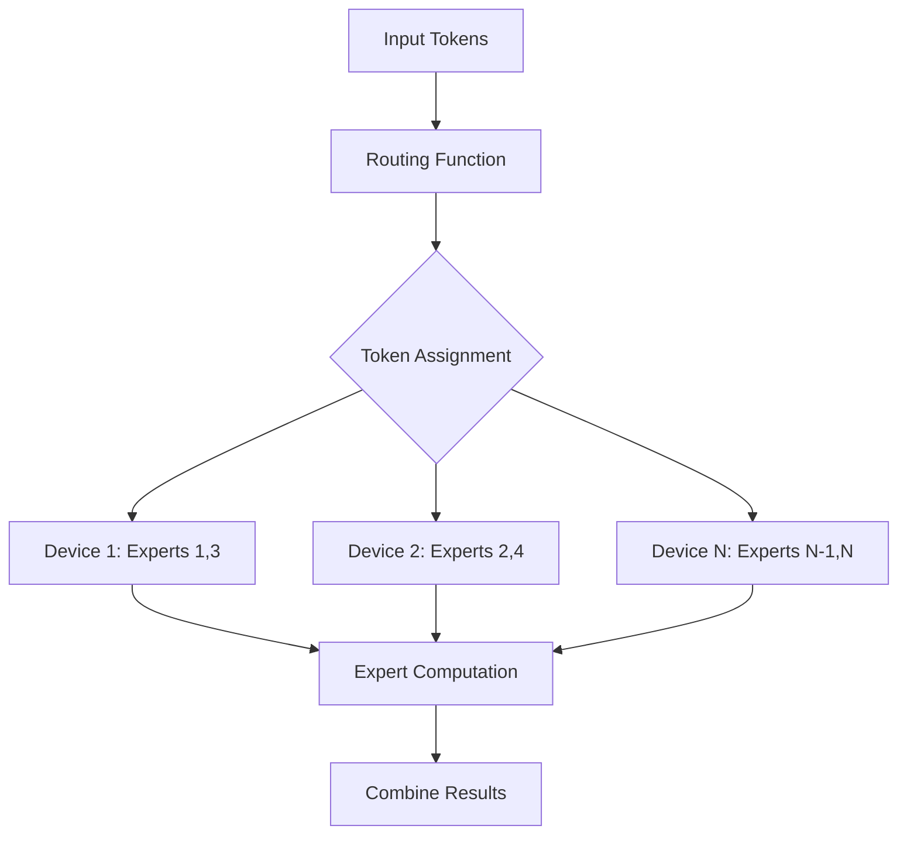
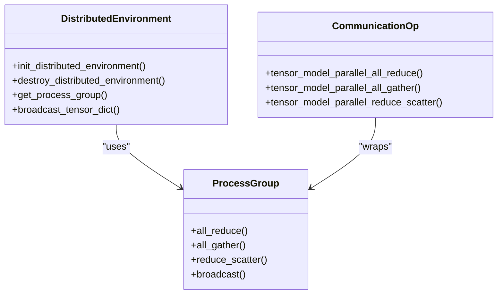
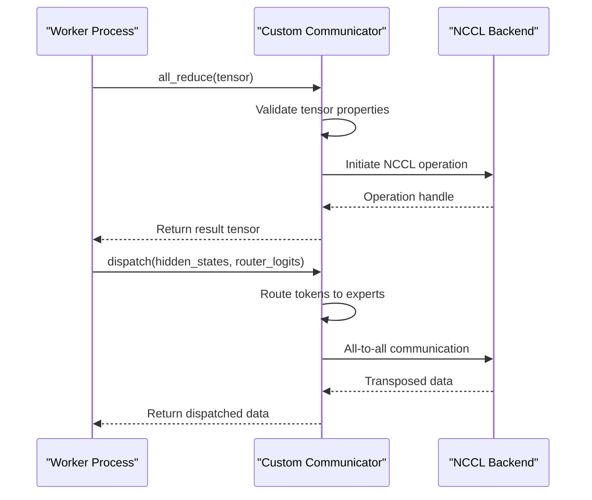

# Distributed Inference

<cite>
**Referenced Files in This Document**   
- [parallel.py](file://vllm/config/parallel.py)
- [parallel_state.py](file://vllm/distributed/parallel_state.py)
- [communication_op.py](file://vllm/distributed/communication_op.py)
- [pynccl.py](file://vllm/distributed/device_communicators/pynccl.py)
- [base_device_communicator.py](file://vllm/distributed/device_communicators/base_device_communicator.py)
- [fused_moe.py](file://vllm/model_executor/layers/fused_moe/fused_moe.py)
- [layer.py](file://vllm/model_executor/layers/fused_moe/layer.py)
- [data_parallel.py](file://examples/offline_inference/data_parallel.py)
- [multi_instance_data_parallel.py](file://examples/online_serving/multi_instance_data_parallel.py)
- [test_expert_parallel.py](file://tests/distributed/test_expert_parallel.py)
</cite>

## Table of Contents
1. [Introduction](#introduction)
2. [Distributed Inference Overview](#distributed-inference-overview)
3. [Parallelism Strategies](#parallelism-strategies)
4. [Implementation Details](#implementation-details)
5. [Command-Line Configuration Examples](#command-line-configuration-examples)
6. [Performance Optimization and Network Considerations](#performance-optimization-and-network-considerations)
7. [Troubleshooting Common Issues](#troubleshooting-common-issues)
8. [Conclusion](#conclusion)

## Introduction
Distributed inference in vLLM enables efficient scaling of large language models across multiple GPUs and nodes, addressing the limitations of single-device inference. This document provides a comprehensive overview of vLLM's distributed inference capabilities, focusing on parallelism strategies that allow models to exceed single GPU memory capacity while improving throughput. The system supports various parallelism techniques including tensor, pipeline, data, and expert parallelism, each designed to optimize different aspects of model execution. The implementation leverages PyTorch distributed and custom communicators to achieve high-performance inference across diverse hardware configurations.

## Distributed Inference Overview
Distributed inference in vLLM is designed to scale large language models beyond the memory constraints of individual GPUs while maximizing computational throughput. The system enables inference on models that cannot fit in single GPU memory by distributing model parameters and computation across multiple devices. This approach is essential for deploying state-of-the-art large language models that require hundreds of gigabytes of memory. vLLM's distributed inference framework supports multiple parallelism strategies that can be combined to optimize performance based on model architecture, hardware configuration, and workload characteristics. The system is built on PyTorch distributed primitives and enhanced with custom communicators that optimize communication patterns for specific use cases. The architecture allows for flexible deployment across single-node multi-GPU systems and multi-node clusters, making it suitable for both research and production environments.

**Section sources**
- [parallel.py](file://vllm/config/parallel.py#L74-L110)
- [parallel_state.py](file://vllm/distributed/parallel_state.py#L1-L20)

## Parallelism Strategies

### Tensor Parallelism
Tensor parallelism in vLLM splits model layers across multiple devices, enabling models to exceed single GPU memory capacity. This strategy partitions the weight matrices of transformer layers, particularly attention and feed-forward networks, across the tensor parallel group. Each device holds a portion of the model parameters and computes partial results that are then combined through all-reduce operations. The implementation ensures that the computational load is balanced across devices while minimizing communication overhead. For attention layers, the query, key, and value projections are split across devices, with the results gathered to compute attention scores. Similarly, feed-forward networks are partitioned to distribute the computational burden. This approach allows vLLM to scale models to sizes that would otherwise be impossible to deploy on single GPUs.



**Diagram sources**
- [parallel.py](file://vllm/config/parallel.py#L76)
- [communication_op.py](file://vllm/distributed/communication_op.py#L12-L14)

### Pipeline Parallelism
Pipeline parallelism divides the model layers across multiple stages, with each stage assigned to a different device or group of devices. This strategy is particularly effective for very deep models, as it allows the entire model to be distributed across multiple devices without requiring each device to store the complete model. vLLM implements pipeline parallelism by partitioning the transformer layers into sequential stages, with activations passed from one stage to the next in a pipelined fashion. The system optimizes the pipeline schedule to minimize idle time and maximize device utilization. Micro-batching is employed to further improve throughput by processing multiple inputs simultaneously through different pipeline stages. This approach reduces memory requirements per device while maintaining high computational efficiency.



**Diagram sources**
- [parallel.py](file://vllm/config/parallel.py#L74)
- [test_pipeline_parallel.py](file://tests/distributed/test_pipeline_parallel.py#L31-L33)

### Data Parallelism
Data parallelism in vLLM handles multiple inference requests by distributing the workload across multiple devices, each maintaining a complete copy of the model. This strategy improves throughput by processing multiple requests simultaneously, making it ideal for serving applications with high request volumes. The system implements both standard data parallelism and specialized variants optimized for specific use cases. In the standard approach, each device processes a subset of the input batch, with gradients aggregated across devices during training. For inference, the results from each device are collected and combined to produce the final output. vLLM also supports hybrid approaches that combine data parallelism with other strategies to optimize resource utilization.



**Diagram sources**
- [data_parallel.py](file://examples/offline_inference/data_parallel.py#L49-L50)
- [parallel.py](file://vllm/config/parallel.py#L80-L82)

### Expert Parallelism for Mixture-of-Experts Models
Expert parallelism in vLLM is specifically designed for Mixture-of-Experts (MoE) models, where different experts are distributed across devices to optimize memory usage and computational efficiency. This strategy allows MoE models to scale beyond the memory capacity of individual devices by partitioning the expert layers across the expert parallel group. Each device hosts a subset of the model's experts, with the routing mechanism directing tokens to the appropriate devices based on the gating function. The implementation includes specialized communication patterns that efficiently handle the all-to-all communication required for expert parallelism. vLLM supports various expert placement strategies, including linear and round-robin distribution, to optimize load balancing and performance.



**Diagram sources**
- [layer.py](file://vllm/model_executor/layers/fused_moe/layer.py#L332-L334)
- [fused_moe.py](file://vllm/model_executor/layers/fused_moe/fused_moe.py#L8-L15)

## Implementation Details

### PyTorch Distributed Integration
vLLM's distributed inference system is built on PyTorch distributed primitives, leveraging the framework's robust communication capabilities while extending them with custom optimizations. The implementation uses PyTorch's process groups to manage communication between devices, with separate groups for different parallelism strategies. The system initializes distributed environment components during startup, establishing the necessary communication channels for tensor, pipeline, and data parallelism. Custom communication operations are implemented as wrappers around PyTorch's distributed functions, providing a consistent interface while enabling performance optimizations. The integration supports both NCCL for GPU communication and Gloo for CPU communication, automatically selecting the appropriate backend based on the hardware configuration.



**Diagram sources**
- [parallel_state.py](file://vllm/distributed/parallel_state.py#L117-L136)
- [communication_op.py](file://vllm/distributed/communication_op.py#L12-L35)

### Custom Communicators
vLLM implements custom communicators to optimize communication patterns for specific use cases, particularly for expert parallelism and high-performance inference. These communicators extend the base device communicator interface, providing specialized implementations for all-reduce, all-gather, and other collective operations. The custom communicators are designed to minimize communication overhead and maximize bandwidth utilization, particularly for the all-to-all patterns required by MoE models. The system includes optimized implementations for different hardware configurations, including NVLink-connected GPUs and multi-node clusters. The communicators also support advanced features like asynchronous communication and communication-computation overlap to further improve performance.



**Diagram sources**
- [pynccl.py](file://vllm/distributed/device_communicators/pynccl.py#L150-L181)
- [base_device_communicator.py](file://vllm/distributed/device_communicators/base_device_communicator.py#L130-L132)

## Command-Line Configuration Examples

### Single-Node Multi-GPU Configuration
For single-node multi-GPU deployments, vLLM provides straightforward command-line options to configure tensor and data parallelism. The following example demonstrates how to run inference on a model using two GPUs with tensor parallelism:

```bash
python examples/offline_inference/data_parallel.py \
    --model="ibm-research/PowerMoE-3b" \
    --dp-size=2 \
    --tp-size=2
```

This configuration splits the model across two GPUs using tensor parallelism while also enabling data parallelism to handle multiple requests. The system automatically manages the distribution of model parameters and computation, requiring minimal configuration from the user.

**Section sources**
- [data_parallel.py](file://examples/offline_inference/data_parallel.py#L6-L9)

### Multi-Node Distributed Configuration
For multi-node deployments, vLLM supports distributed inference across multiple machines, enabling scaling to very large clusters. The following example shows how to configure a two-node setup:

```bash
# Node 0
python examples/offline_inference/data_parallel.py \
    --model="ibm-research/PowerMoE-3b" \
    --dp-size=2 \
    --tp-size=2 \
    --node-size=2 \
    --node-rank=0 \
    --master-addr=10.99.48.128 \
    --master-port=13345

# Node 1
python examples/offline_inference/data_parallel.py \
    --model="ibm-research/PowerMoE-3b" \
    --dp-size=2 \
    --tp-size=2 \
    --node-size=2 \
    --node-rank=1 \
    --master-addr=10.99.48.128 \
    --master-port=13345
```

This configuration establishes a distributed environment across two nodes, with each node contributing GPUs to the overall computation. The master address and port parameters configure the distributed coordination, while the node rank identifies each machine in the cluster.

**Section sources**
- [data_parallel.py](file://examples/offline_inference/data_parallel.py#L12-L29)

### Online Serving with Data Parallelism
For online serving scenarios, vLLM provides specialized configurations that optimize for low-latency inference and high throughput. The following example demonstrates a multi-instance data parallel setup:

```bash
# Instance 1
vllm serve ibm-research/PowerMoE-3b -dp 2 -dpr 0 \
    --data-parallel-address 127.0.0.1 --data-parallel-rpc-port 62300 \
    --data-parallel-size-local 1 --enforce-eager --headless

# Instance 2
vllm serve ibm-research/PowerMoE-3b -dp 2 -dpr 1 \
    --data-parallel-address 127.0.0.1 --data-parallel-rpc-port 62300 \
    --data-parallel-size-local 1 --enforce-eager --headless
```

This configuration enables two serving instances to collaborate on inference requests, with each instance handling a portion of the workload. The data parallel rank (dpr) parameter specifies which instance should process each request, allowing for load balancing across the cluster.

**Section sources**
- [multi_instance_data_parallel.py](file://examples/online_serving/multi_instance_data_parallel.py#L17-L19)

## Performance Optimization and Network Considerations

### Network Bottleneck Identification
Network bottlenecks are a common challenge in distributed inference systems, particularly when scaling across multiple nodes. vLLM provides several mechanisms to identify and mitigate these bottlenecks. The system monitors communication patterns and bandwidth utilization, providing insights into potential performance limitations. For intra-node communication, NVLink and high-bandwidth interconnects are preferred to minimize latency and maximize throughput. For inter-node communication, high-speed networking such as InfiniBand or high-bandwidth Ethernet is recommended. The system also includes profiling tools that can identify specific operations contributing to communication overhead, allowing for targeted optimization.

### Topology Configuration
Proper topology configuration is critical for achieving optimal performance in distributed inference. vLLM automatically detects the hardware topology and configures communication patterns accordingly. For single-node multi-GPU systems, the system prioritizes NVLink connections when available, minimizing communication latency between GPUs. For multi-node clusters, the system optimizes communication patterns based on the network topology, minimizing cross-node traffic when possible. The configuration can be fine-tuned using environment variables and command-line parameters to match specific hardware configurations. This includes setting appropriate master addresses and ports for distributed coordination, as well as configuring communication backends for optimal performance.

### Communication Optimization
vLLM implements several communication optimization techniques to minimize overhead and maximize throughput. These include:
- **Communication-Computation Overlap**: Overlapping communication operations with computation to hide latency
- **Batched Communication**: Combining multiple small messages into larger batches to reduce overhead
- **Asynchronous Communication**: Using non-blocking operations to improve pipeline efficiency
- **Custom All-Reduce Kernels**: Implementing optimized all-reduce operations that outperform standard NCCL implementations

The system also supports various all-to-all backends for expert parallelism, allowing users to select the most appropriate implementation based on their hardware and workload characteristics. These optimizations are transparent to the user, with the system automatically selecting the best approach based on the configuration and hardware.

**Section sources**
- [parallel.py](file://vllm/config/parallel.py#L125-L143)
- [pynccl.py](file://vllm/distributed/device_communicators/pynccl.py#L150-L181)

## Troubleshooting Common Issues

### Network Configuration Problems
Network configuration issues are among the most common challenges in distributed inference deployments. These typically manifest as connection timeouts, address conflicts, or communication failures between nodes. To resolve these issues:
1. Verify that all nodes can communicate over the specified network interface
2. Ensure that firewalls are not blocking the required ports
3. Confirm that the master address and port are correctly configured on all nodes
4. Check that the node rank and size parameters match across all instances

The system provides detailed error messages and logging to help diagnose network issues, including specific information about failed connections and communication timeouts.

### Resource Allocation Conflicts
Resource allocation conflicts can occur when multiple processes attempt to access the same GPUs or when the requested resources exceed available capacity. To avoid these issues:
1. Ensure that the total number of GPUs requested does not exceed the available count
2. Verify that CUDA_VISIBLE_DEVICES is properly configured for each process
3. Check that the tensor and pipeline parallel sizes are compatible with the available hardware
4. Monitor GPU memory usage to ensure sufficient capacity for the model and batch size

The system includes validation checks that detect common configuration errors and provide informative error messages to guide resolution.

### Performance Degradation
Performance degradation in distributed inference can result from various factors, including suboptimal parallelism configurations, network bottlenecks, or hardware limitations. To diagnose and resolve performance issues:
1. Use the built-in profiling tools to identify bottlenecks in the execution pipeline
2. Monitor GPU utilization to ensure all devices are being effectively used
3. Check network bandwidth utilization to identify communication bottlenecks
4. Verify that the model is properly partitioned across devices to balance the computational load

The system provides comprehensive metrics and logging to help identify the root cause of performance issues, enabling targeted optimization.

**Section sources**
- [parallel.py](file://vllm/config/parallel.py#L272-L320)
- [parallel_state.py](file://vllm/distributed/parallel_state.py#L345-L382)

## Conclusion
vLLM's distributed inference system provides a comprehensive solution for scaling large language models across multiple GPUs and nodes. The framework supports multiple parallelism strategies, including tensor, pipeline, data, and expert parallelism, allowing users to optimize performance based on their specific requirements and hardware configuration. The implementation leverages PyTorch distributed primitives while extending them with custom communicators and optimizations for high-performance inference. The system is designed to be both powerful and accessible, with straightforward command-line configurations for common use cases and advanced options for specialized deployments. By addressing the challenges of network bottlenecks, resource allocation, and performance optimization, vLLM enables efficient and scalable inference for state-of-the-art language models.