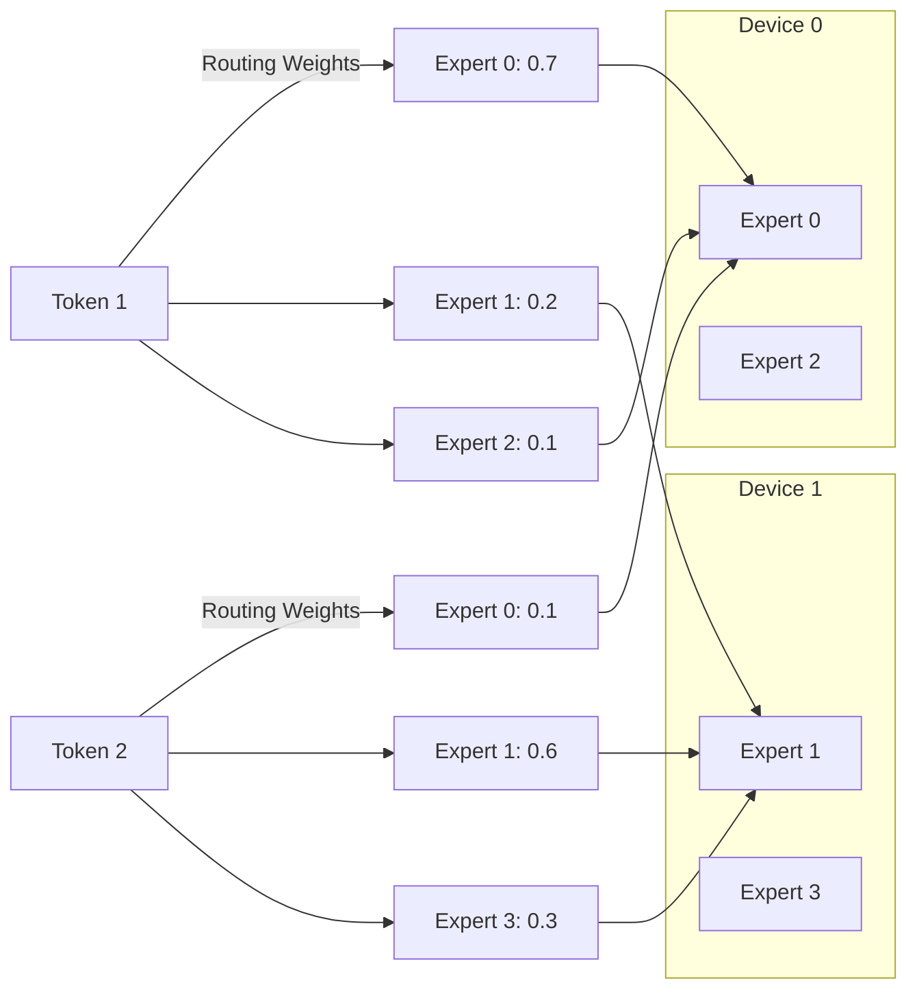
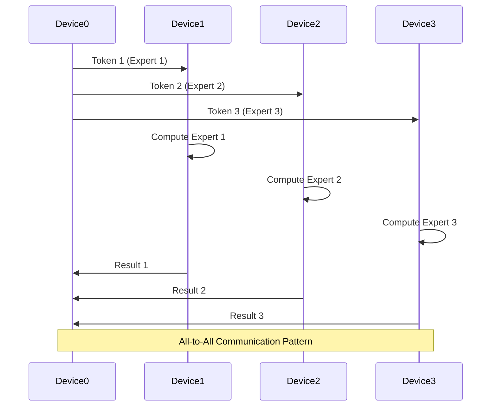
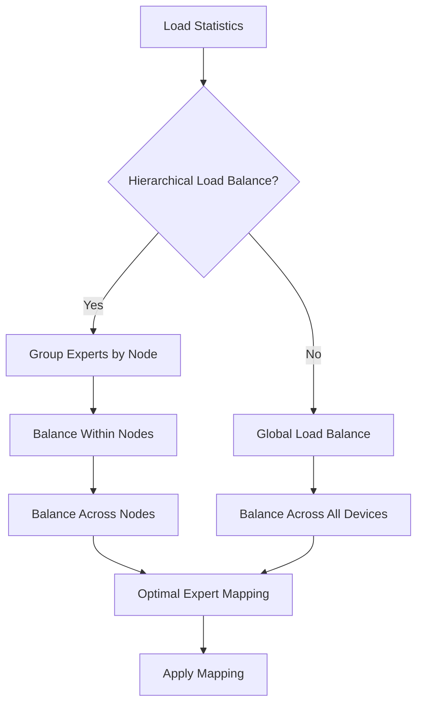
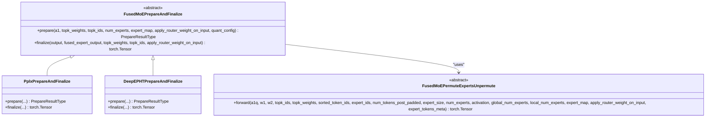
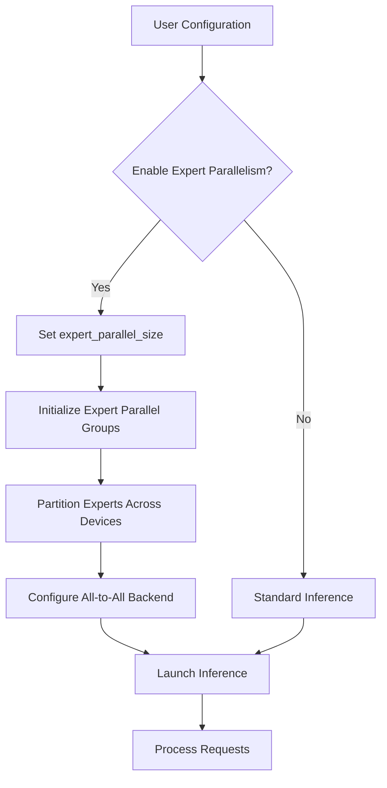
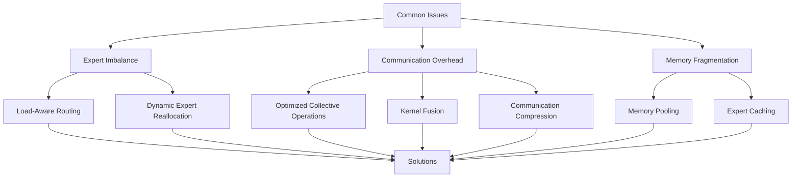

# Expert Parallelism

<cite>
**Referenced Files in This Document**   
- [fused_moe.py](file://vllm/model_executor/layers/fused_moe/__init__.py)
- [parallel_state.py](file://vllm/distributed/parallel_state.py)
- [config.py](file://vllm/model_executor/layers/fused_moe/config.py)
- [all2all_utils.py](file://vllm/model_executor/layers/fused_moe/all2all_utils.py)
- [modular_kernel.py](file://vllm/model_executor/layers/fused_moe/modular_kernel.py)
- [qwen3_vl_moe.py](file://vllm/model_executor/models/qwen3_vl_moe.py)
- [test_expert_placement.py](file://tests/distributed/test_expert_placement.py)
- [rebalance_algo.py](file://vllm/distributed/eplb/rebalance_algo.py)
</cite>

## Table of Contents
1. [Introduction](#introduction)
2. [Expert Parallelism Architecture](#expert-parallelism-architecture)
3. [Expert Routing and Distribution](#expert-routing-and-distribution)
4. [All-to-All Communication Patterns](#all-to-all-communication-patterns)
5. [Load Balancing Strategies](#load-balancing-strategies)
6. [Implementation Details](#implementation-details)
7. [Configuration and Usage](#configuration-and-usage)
8. [Common Issues and Solutions](#common-issues-and-solutions)
9. [Conclusion](#conclusion)

## Introduction

Expert Parallelism (EP) in vLLM enables scalable inference for Mixture-of-Experts (MoE) models by distributing different experts across multiple devices. This approach allows for efficient utilization of computational resources when working with large sparse models like Mixtral and Qwen3-MoE. The implementation leverages sophisticated routing mechanisms, all-to-all communication patterns, and load balancing strategies to ensure optimal performance.

The core concept behind expert parallelism is to partition the expert components of MoE models across multiple GPUs or nodes, allowing each device to specialize in computing specific experts. This enables scaling to models with hundreds or thousands of experts while maintaining efficient memory usage and computation. vLLM's implementation provides multiple backend options for the all-to-all communication phase, including PPLX and DeepEP kernels, each optimized for different performance characteristics.

This document provides a comprehensive overview of the expert parallelism implementation in vLLM, covering the architectural design, key components, configuration options, and practical considerations for deploying MoE models at scale.

**Section sources**
- [fused_moe.py](file://vllm/model_executor/layers/fused_moe/__init__.py#L1-L111)
- [parallel_state.py](file://vllm/distributed/parallel_state.py#L1-L800)

## Expert Parallelism Architecture

The expert parallelism architecture in vLLM is built around a modular design that separates the concerns of expert routing, communication, and computation. The system creates dedicated expert parallel groups through the `parallel_state.py` module, which manages the distributed environment and coordinates communication between devices.

The architecture follows a hierarchical approach to model parallelism, where expert parallelism coexists with tensor parallelism (TP), pipeline parallelism (PP), and data parallelism (DP). When expert parallelism is enabled, the system reconfigures the parallelization strategy to allocate devices specifically for expert computation. The `FusedMoEParallelConfig` class encapsulates the configuration parameters for this setup, including TP size, DP size, and EP size.

```mermaid
graph TD
A[Input Tokens] --> B[Router]
B --> C[Expert Assignment]
C --> D[All-to-All Communication]
D --> E[Expert Computation]
E --> F[All-to-All Communication]
F --> G[Output Combination]
G --> H[Final Output]
subgraph "Device 0"
E1[Expert 0]
E2[Expert 2]
end
subgraph "Device 1"
E3[Expert 1]
E4[Expert 3]
end
D < --> E1
D < --> E3
D < --> E2
D < --> E4
```

**Diagram sources **
- [parallel_state.py](file://vllm/distributed/parallel_state.py#L1355-L1432)
- [config.py](file://vllm/model_executor/layers/fused_moe/config.py#L689-L729)

**Section sources**
- [parallel_state.py](file://vllm/distributed/parallel_state.py#L1355-L1432)
- [config.py](file://vllm/model_executor/layers/fused_moe/config.py#L689-L729)

## Expert Routing and Distribution

Expert routing in vLLM's MoE implementation determines how input tokens are assigned to specific experts based on their content. The routing mechanism uses a gating network to compute routing probabilities for each token, selecting the top-k experts that are most relevant for processing that token. This sparse activation pattern allows the model to maintain high capacity while keeping computational costs manageable.

The distribution of experts across devices follows a round-robin placement strategy by default, ensuring balanced allocation of experts. The `determine_expert_map` function in the expert placement module calculates the mapping between global expert indices and local expert indices on each device. For example, with 8 experts and 2 devices, device 0 would handle experts 0, 2, 4, and 6, while device 1 would handle experts 1, 3, 5, and 7.



**Diagram sources **
- [test_expert_placement.py](file://tests/distributed/test_expert_placement.py#L46-L244)
- [qwen3_vl_moe.py](file://vllm/model_executor/models/qwen3_vl_moe.py#L363-L392)

**Section sources**
- [test_expert_placement.py](file://tests/distributed/test_expert_placement.py#L46-L244)
- [qwen3_vl_moe.py](file://vllm/model_executor/models/qwen3_vl_moe.py#L363-L392)

## All-to-All Communication Patterns

The all-to-all communication pattern is a critical component of expert parallelism, enabling the redistribution of tokens to the devices that host the selected experts. vLLM implements multiple backends for this communication phase, including PPLX and DeepEP kernels, each optimized for different performance characteristics.

The communication process occurs in two phases: dispatch and combine. During the dispatch phase, tokens are sent from their current device to the devices hosting the selected experts. After expert computation, the results are gathered back to the original devices during the combine phase. The `all2all_utils.py` module contains the implementation details for these communication patterns, including the preparation and finalization steps that handle quantization and data movement.



**Diagram sources **
- [all2all_utils.py](file://vllm/model_executor/layers/fused_moe/all2all_utils.py#L67-L172)
- [modular_kernel.py](file://vllm/model_executor/layers/fused_moe/modular_kernel.py#L152-L200)

**Section sources**
- [all2all_utils.py](file://vllm/model_executor/layers/fused_moe/all2all_utils.py#L67-L172)
- [modular_kernel.py](file://vllm/model_executor/layers/fused_moe/modular_kernel.py#L152-L200)

## Load Balancing Strategies

Load balancing is essential for maintaining high efficiency in expert parallel systems, as uneven workloads can lead to underutilization of resources. vLLM implements sophisticated load balancing strategies through the Elastic Expert Parallelism (EELB) framework, which dynamically redistributes experts based on observed load patterns.

The load balancing algorithm takes into account both the computational load and network topology, with hierarchical load balancing that considers intra-node and inter-node communication costs. The `rebalance_experts` function in the EELB module implements this strategy, accepting load statistics for all logical experts and returning an optimal physical-to-logical mapping that minimizes load imbalance.



**Diagram sources **
- [rebalance_algo.py](file://vllm/distributed/eplb/rebalance_algo.py#L200-L260)
- [eplb_state.py](file://vllm/distributed/eplb/eplb_state.py#L747-L1067)

**Section sources**
- [rebalance_algo.py](file://vllm/distributed/eplb/rebalance_algo.py#L200-L260)
- [eplb_state.py](file://vllm/distributed/eplb/eplb_state.py#L747-L1067)

## Implementation Details

The implementation of expert parallelism in vLLM is centered around the `fused_moe.py` module, which provides the core functionality for MoE layers. The implementation uses a modular kernel design that separates the concerns of expert preparation, computation, and finalization, allowing for flexible composition of different communication and computation strategies.

The `FusedMoEPrepareAndFinalize` abstract base class defines the interface for preparation and finalization steps, which handle quantization, dispatching, and result combination. Different implementations of this class support various all-to-all communication backends, such as PPLX and DeepEP. The `FusedMoEPermuteExpertsUnpermute` class handles the core computation of the selected experts, applying the appropriate weights and activations.



**Diagram sources **
- [modular_kernel.py](file://vllm/model_executor/layers/fused_moe/modular_kernel.py#L152-L200)
- [all2all_utils.py](file://vllm/model_executor/layers/fused_moe/all2all_utils.py#L67-L172)

**Section sources**
- [modular_kernel.py](file://vllm/model_executor/layers/fused_moe/modular_kernel.py#L152-L200)
- [all2all_utils.py](file://vllm/model_executor/layers/fused_moe/all2all_utils.py#L67-L172)

## Configuration and Usage

Configuring expert parallelism in vLLM involves setting the appropriate parameters in the model configuration and command-line arguments. The `expert_parallel_size` parameter controls the number of devices used for expert parallelism, directly affecting how experts are distributed across the available hardware.

To enable expert parallelism, users can specify the `--enable-expert-parallel` flag when launching vLLM, or set the corresponding parameter in the API configuration. The system automatically detects the available hardware and configures the parallelization strategy accordingly. For models like Mixtral and Qwen3-MoE, the configuration must align with the model's architecture, ensuring that the number of experts is divisible by the expert parallel size.



**Diagram sources **
- [config.py](file://vllm/model_executor/layers/fused_moe/config.py#L689-L729)
- [benchmark_moe.py](file://benchmarks/kernels/benchmark_moe.py#L596-L790)

**Section sources**
- [config.py](file://vllm/model_executor/layers/fused_moe/config.py#L689-L729)
- [benchmark_moe.py](file://benchmarks/kernels/benchmark_moe.py#L596-L790)

## Common Issues and Solutions

Several common issues can arise when implementing expert parallelism, including expert imbalance, communication overhead, and memory fragmentation. Expert imbalance occurs when some experts receive significantly more tokens than others, leading to inefficient resource utilization. This can be mitigated through load-aware routing strategies that consider both the relevance and current load of experts.

Communication overhead is another challenge, particularly in distributed settings with high-latency networks. vLLM addresses this through optimized collective operations and kernel fusion, reducing the number of communication rounds required. The DeepEP low-latency kernels are specifically designed to minimize communication overhead in such scenarios.



**Diagram sources **
- [rebalance_algo.py](file://vllm/distributed/eplb/rebalance_algo.py#L200-L260)
- [all2all_utils.py](file://vllm/model_executor/layers/fused_moe/all2all_utils.py#L67-L172)

**Section sources**
- [rebalance_algo.py](file://vllm/distributed/eplb/rebalance_algo.py#L200-L260)
- [all2all_utils.py](file://vllm/model_executor/layers/fused_moe/all2all_utils.py#L67-L172)

## Conclusion

Expert parallelism in vLLM provides a powerful framework for scaling Mixture-of-Experts models across multiple devices, enabling efficient inference for large sparse models. The implementation combines sophisticated routing mechanisms, optimized communication patterns, and intelligent load balancing to maximize resource utilization and performance.

The modular design of the system allows for flexibility in choosing different communication backends and load balancing strategies based on the specific requirements of the deployment scenario. Whether prioritizing throughput with the DeepEP high-throughput kernels or minimizing latency with the PPLX implementation, vLLM provides the tools needed to optimize MoE model performance.

As MoE models continue to grow in size and complexity, the expert parallelism capabilities in vLLM will play an increasingly important role in making these models accessible and efficient for real-world applications. The ongoing development of new optimization techniques and communication patterns ensures that vLLM will remain at the forefront of scalable inference for sparse models.

[No sources needed since this section summarizes without analyzing specific files]