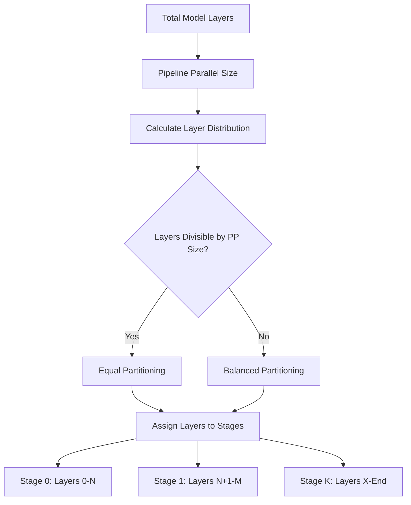
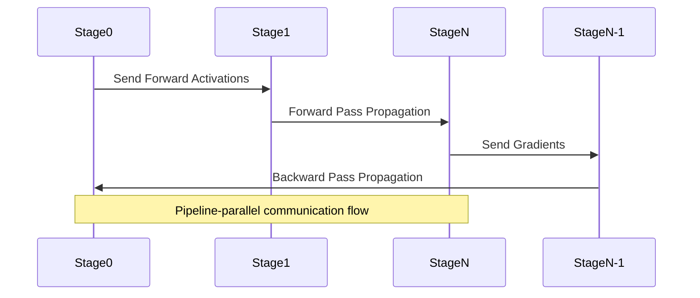
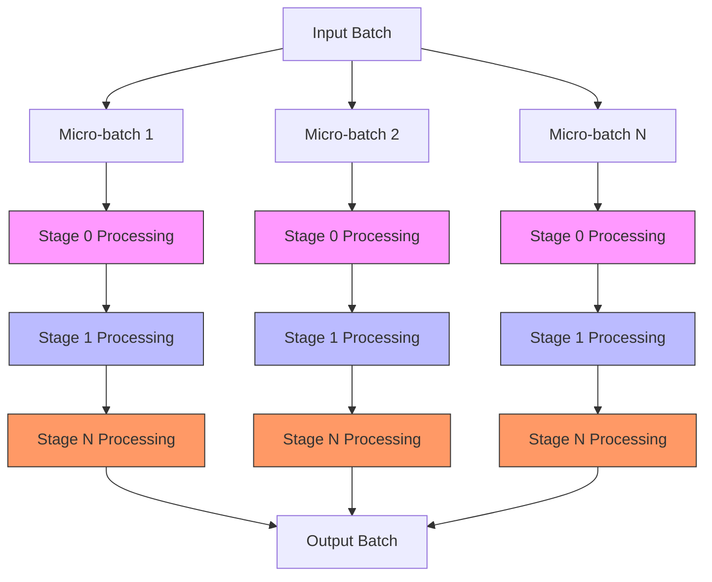
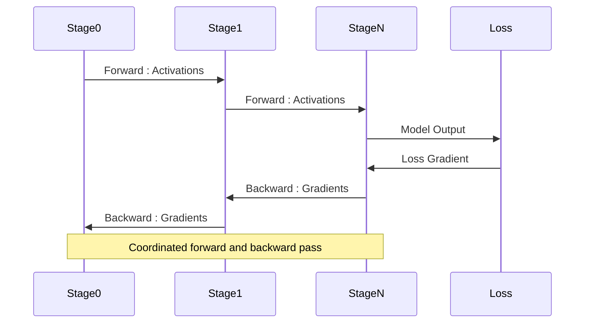
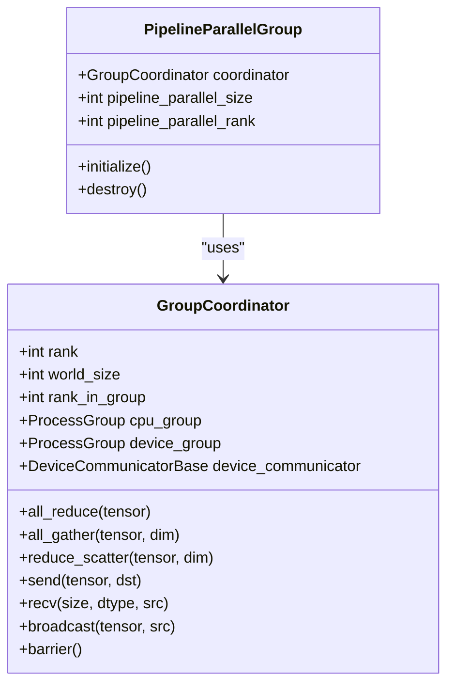

# Pipeline Parallelism

<cite>
**Referenced Files in This Document**   
- [parallel_state.py](file://vllm/distributed/parallel_state.py)
- [parallel.py](file://vllm/config/parallel.py)
- [utils.py](file://vllm/distributed/utils.py)
- [models/utils.py](file://vllm/model_executor/models/utils.py)
- [test_pipeline_partition.py](file://tests/distributed/test_pipeline_partition.py)
</cite>

## Table of Contents
1. [Introduction](#introduction)
2. [Model Layer Partitioning](#model-layer-partitioning)
3. [Inter-Stage Communication](#inter-stage-communication)
4. [Micro-Batching Strategies](#micro-batching-strategies)
5. [Forward and Backward Pass Coordination](#forward-and-backward-pass-coordination)
6. [Parallel State Management](#parallel-state-management)
7. [Configuration and Usage](#configuration-and-usage)
8. [Performance Challenges and Solutions](#performance-challenges-and-solutions)
9. [Conclusion](#conclusion)

## Introduction
Pipeline parallelism in vLLM is a distributed computing technique that partitions large language models across multiple devices in a sequential pipeline fashion. This approach enables the training and inference of models that exceed the memory capacity of individual GPUs by distributing different portions of the model across multiple devices. The implementation leverages PyTorch's distributed capabilities and custom communication primitives to coordinate computation across pipeline stages. This document provides a comprehensive analysis of vLLM's pipeline parallelism implementation, covering model partitioning strategies, inter-stage communication mechanisms, micro-batching techniques, and performance optimization approaches.

## Model Layer Partitioning
vLLM implements model layer partitioning through a systematic approach that evenly distributes transformer layers across available pipeline stages. The partitioning logic is primarily handled by the `get_pp_indices` function in the distributed utilities module, which calculates the start and end layer indices for each pipeline stage based on the total number of hidden layers, pipeline parallel size, and current pipeline rank.

The partitioning algorithm attempts to evenly distribute layers across partitions, with special handling when the number of layers is not perfectly divisible by the pipeline parallel size. In such cases, the implementation employs a balanced distribution strategy that minimizes the difference in layer count between stages. This ensures optimal load balancing and reduces pipeline bubbles caused by uneven computational workloads.

Custom layer partitioning can be configured through the `VLLM_PP_LAYER_PARTITION` environment variable, allowing users to specify non-uniform partitioning schemes for specialized workloads. The system validates partition configurations to ensure they are consistent with the model architecture and available hardware resources.



**Diagram sources**
- [utils.py](file://vllm/distributed/utils.py#L95-L100)
- [test_pipeline_partition.py](file://tests/distributed/test_pipeline_partition.py#L11-L38)

**Section sources**
- [utils.py](file://vllm/distributed/utils.py#L95-L100)
- [test_pipeline_partition.py](file://tests/distributed/test_pipeline_partition.py#L11-L38)

## Inter-Stage Communication
Inter-stage communication in vLLM's pipeline parallelism implementation is managed through dedicated process groups and communication primitives that facilitate data transfer between pipeline stages. The system establishes pipeline parallel groups during initialization, creating separate CPU and device communication groups for efficient coordination.

The communication infrastructure supports various collective operations including send, receive, all-reduce, all-gather, and reduce-scatter, which are essential for coordinating forward and backward passes across stages. These operations are implemented through the `GroupCoordinator` class, which wraps PyTorch's ProcessGroup functionality with additional optimizations and error handling.

For tensor transmission between stages, vLLM employs a combination of synchronous and asynchronous communication patterns. Forward pass activations are sent from upstream to downstream stages, while gradients are transmitted in the reverse direction during backward passes. The implementation includes optimizations such as tensor packing and metadata serialization to minimize communication overhead.



**Diagram sources**
- [parallel_state.py](file://vllm/distributed/parallel_state.py#L278-L1011)
- [parallel_state.py](file://vllm/distributed/parallel_state.py#L973-L987)

**Section sources**
- [parallel_state.py](file://vllm/distributed/parallel_state.py#L278-L1011)

## Micro-Batching Strategies
vLLM employs micro-batching strategies to improve pipeline efficiency and reduce idle time (pipeline bubbles) during model execution. The micro-batching implementation divides large input batches into smaller micro-batches that can be processed sequentially through the pipeline, enabling better overlap of computation and communication.

The system implements a sophisticated scheduling algorithm that coordinates the execution of micro-batches across pipeline stages. Each stage processes one micro-batch at a time, forwarding the results to the next stage while preparing for the subsequent micro-batch. This creates a流水线 effect where multiple micro-batches are in various stages of processing simultaneously, maximizing device utilization.

The micro-batching strategy is particularly effective for long sequences and large models, where the computational cost of processing entire batches would create significant pipeline stalls. By breaking computations into smaller units, vLLM achieves better load balancing and reduced memory pressure on individual devices.



**Diagram sources**
- [parallel_state.py](file://vllm/distributed/parallel_state.py#L278-L1011)
- [utils.py](file://vllm/distributed/utils.py#L67-L92)

**Section sources**
- [parallel_state.py](file://vllm/distributed/parallel_state.py#L278-L1011)

## Forward and Backward Pass Coordination
The coordination of forward and backward passes across pipeline stages is a critical aspect of vLLM's pipeline parallelism implementation. The system employs a synchronized execution model where each stage processes its assigned layers and communicates intermediate results to adjacent stages.

During the forward pass, each pipeline stage executes its portion of the model on the input tensor, then sends the resulting activations to the next stage. The final stage produces the model output, which is used to compute the loss. For the backward pass, gradient computation proceeds in reverse order, with each stage computing gradients for its layers and propagating them backward through the pipeline.

The implementation includes mechanisms to handle the asynchrony between stages, ensuring that each stage receives the necessary inputs before beginning computation. This coordination is managed through the pipeline parallel group's communication primitives, with careful attention to avoiding deadlocks and ensuring proper synchronization.



**Diagram sources**
- [parallel_state.py](file://vllm/distributed/parallel_state.py#L973-L987)
- [parallel_state.py](file://vllm/distributed/parallel_state.py#L480-L502)

**Section sources**
- [parallel_state.py](file://vllm/distributed/parallel_state.py#L973-L987)

## Parallel State Management
Parallel state management in vLLM is handled through the `parallel_state.py` module, which provides a comprehensive interface for managing distributed execution contexts. The core component is the `GroupCoordinator` class, which encapsulates process group management, communication operations, and device coordination.

The system initializes pipeline parallel groups during startup, creating the necessary communication infrastructure for inter-stage coordination. The `initialize_model_parallel` function sets up the parallel environment, including tensor parallel, pipeline parallel, and data parallel groups as configured.

Key interfaces in the parallel state management system include:
- `get_pp_group()`: Retrieves the current pipeline parallel group
- `get_pp_rank()`: Returns the rank of the current process within the pipeline parallel group
- `get_pp_world_size()`: Returns the total number of pipeline parallel stages
- `destroy_model_parallel()`: Cleans up parallel groups and releases resources

The implementation also includes utilities for broadcasting tensors and objects across pipeline stages, ensuring consistent state initialization and configuration across all devices.



**Diagram sources**
- [parallel_state.py](file://vllm/distributed/parallel_state.py#L278-L1011)

**Section sources**
- [parallel_state.py](file://vllm/distributed/parallel_state.py#L278-L1011)

## Configuration and Usage
Pipeline parallelism in vLLM is configured through the `ParallelConfig` class, which exposes the `pipeline_parallel_size` parameter as the primary control for pipeline parallel execution. This parameter determines the number of pipeline stages and directly impacts how model layers are partitioned across devices.

The configuration can be set through command-line arguments when launching vLLM services:
```bash
vllm serve --pipeline-parallel-size 4 --tensor-parallel-size 2
```

Alternatively, the configuration can be specified programmatically through the API:
```python
from vllm import EngineArgs

args = EngineArgs(
    model="meta-llama/Llama-2-70b-hf",
    pipeline_parallel_size=4,
    tensor_parallel_size=2
)
```

The system validates configuration parameters during initialization, ensuring that the specified pipeline parallel size is compatible with the available hardware resources and model architecture. When using pipeline parallelism, the total number of GPUs must be divisible by the pipeline parallel size to ensure balanced resource allocation.

**Section sources**
- [parallel.py](file://vllm/config/parallel.py#L74-L80)
- [parallel_state.py](file://vllm/distributed/parallel_state.py#L109-L114)

## Performance Challenges and Solutions
Pipeline parallelism in vLLM faces several performance challenges, primarily related to pipeline bubbles and low device utilization. Pipeline bubbles occur when stages are idle waiting for data from previous stages, reducing overall throughput. This is particularly problematic at the beginning and end of execution when the pipeline is filling and draining.

To address these challenges, vLLM implements several optimization strategies:

1. **Chunked Prefill**: For long input sequences, the prefill phase is divided into chunks that can be processed in parallel across pipeline stages, reducing the initial pipeline warm-up time.

2. **Optimized Scheduling**: The system employs sophisticated scheduling algorithms that overlap computation and communication, minimizing idle time between stages.

3. **Gradient Accumulation**: For training workloads, gradient accumulation across micro-batches reduces the frequency of communication operations, improving efficiency.

4. **Memory Optimization**: The implementation includes memory-efficient tensor handling and garbage collection strategies to maximize available memory for computation.

5. **Asynchronous Execution**: Where possible, communication operations are performed asynchronously to overlap with computation, improving overall throughput.

These optimizations work together to minimize pipeline bubbles and maximize device utilization, enabling vLLM to achieve high efficiency even with complex pipeline parallel configurations.

**Section sources**
- [parallel_state.py](file://vllm/distributed/parallel_state.py#L278-L1011)
- [utils.py](file://vllm/distributed/utils.py#L67-L92)
- [models/utils.py](file://vllm/model_executor/models/utils.py#L589-L611)

## Conclusion
vLLM's pipeline parallelism implementation provides a robust framework for distributing large language models across multiple devices. By partitioning model layers across pipeline stages and coordinating computation through efficient inter-stage communication, the system enables the execution of models that exceed the memory capacity of individual GPUs. The implementation combines sophisticated partitioning strategies, optimized communication patterns, and advanced scheduling algorithms to maximize performance and resource utilization. Through configurable parameters and comprehensive state management interfaces, vLLM offers both flexibility and ease of use for deploying pipeline parallel models in various scenarios, from research to production environments.