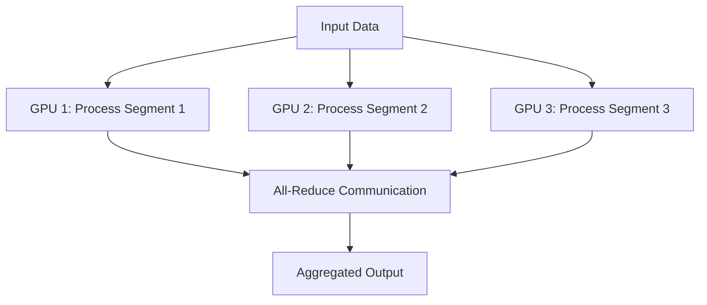
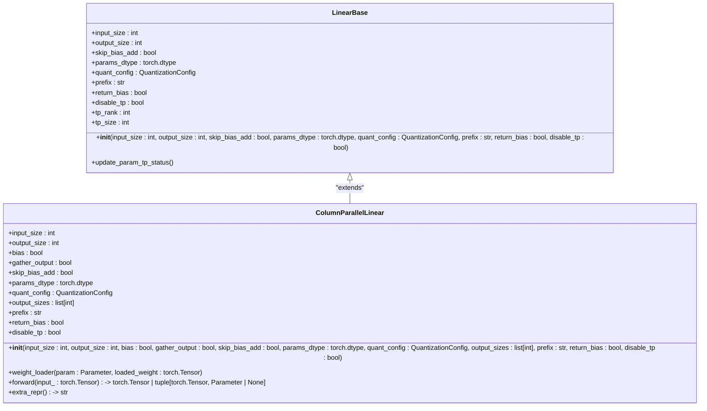
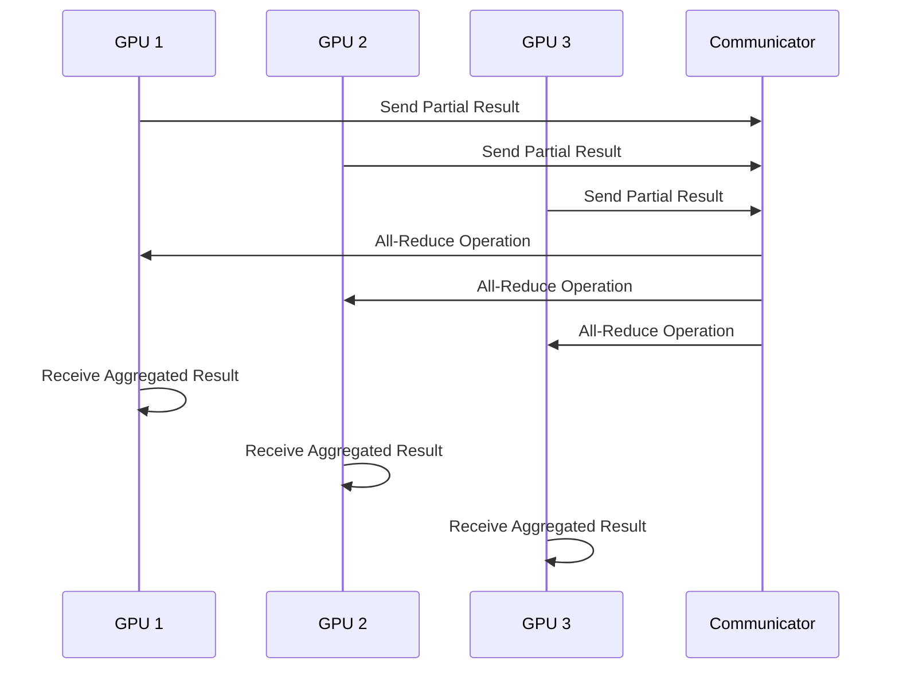
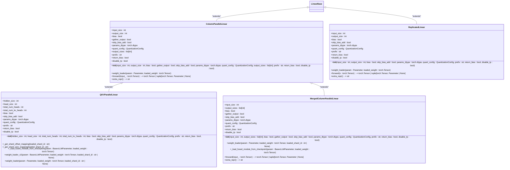
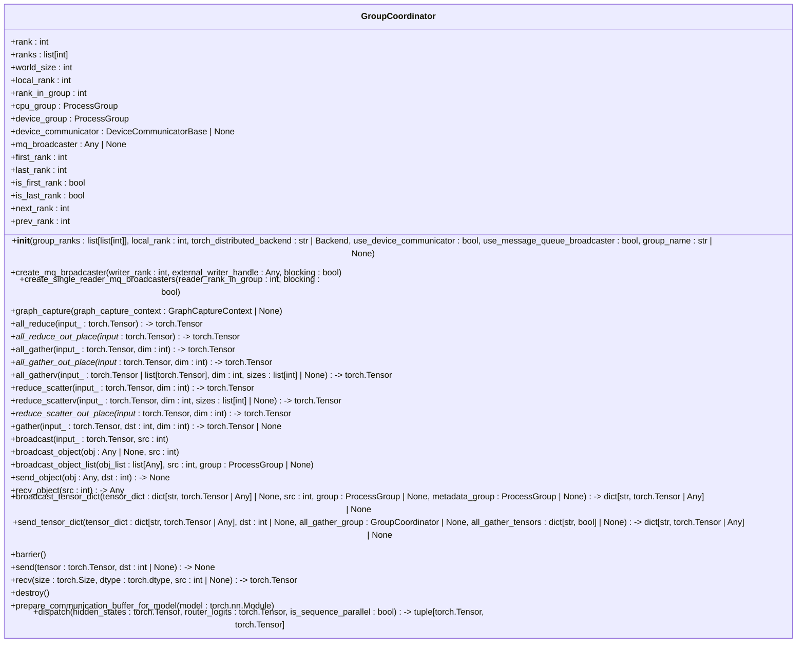
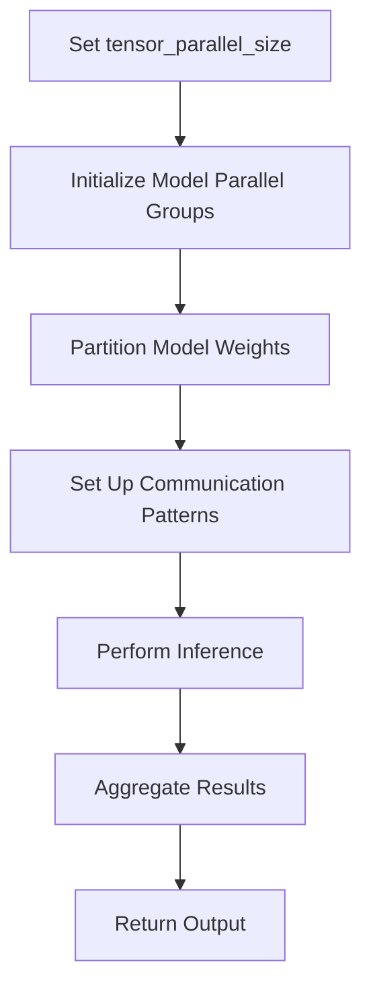
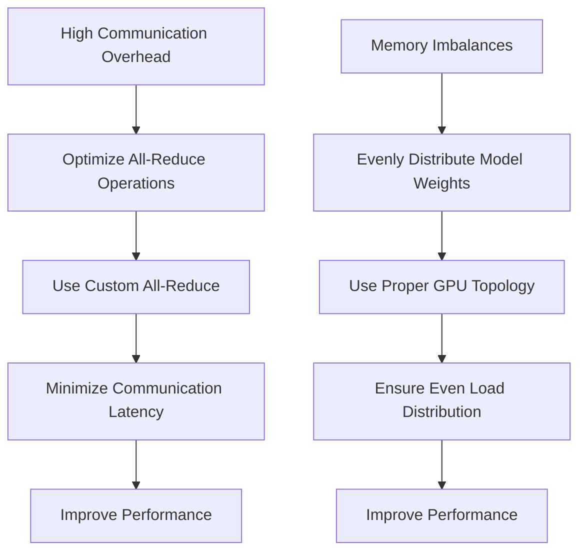

# Tensor Parallelism

<cite>
**Referenced Files in This Document**   
- [parallel_state.py](file://vllm/distributed/parallel_state.py)
- [linear.py](file://vllm/model_executor/layers/linear.py)
- [communication_op.py](file://vllm/distributed/communication_op.py)
- [pynccl.py](file://vllm/distributed/device_communicators/pynccl.py)
- [custom_all_reduce.py](file://vllm/distributed/device_communicators/custom_all_reduce.py)
- [utils.py](file://vllm/distributed/utils.py)
- [parallel.py](file://vllm/config/parallel.py)
</cite>

## Table of Contents
1. [Introduction](#introduction)
2. [Tensor Parallelism Fundamentals](#tensor-parallelism-fundamentals)
3. [Model Weight Partitioning](#model-weight-partitioning)
4. [Communication Patterns](#communication-patterns)
5. [Attention and Linear Layer Implementation](#attention-and-linear-layer-implementation)
6. [Parallel State Management](#parallel-state-management)
7. [Configuration and Usage](#configuration-and-usage)
8. [Performance Considerations](#performance-considerations)
9. [Troubleshooting Common Issues](#troubleshooting-common-issues)
10. [Conclusion](#conclusion)

## Introduction
Tensor parallelism in vLLM enables efficient inference on large language models that exceed the memory capacity of a single GPU by distributing model weights across multiple GPUs within a single layer. This approach allows for the processing of models with billions of parameters by partitioning the computational workload and model parameters across a tensor parallel group. The implementation leverages PyTorch distributed and custom CUDA communicators to manage the communication patterns between GPUs, ensuring efficient data exchange during the forward and backward passes. This document provides a comprehensive overview of the tensor parallelism implementation in vLLM, detailing the mechanisms for model weight partitioning, communication patterns, and the interfaces that manage tensor parallel groups and ranks.

**Section sources**
- [parallel_state.py](file://vllm/distributed/parallel_state.py#L8-L24)
- [linear.py](file://vllm/model_executor/layers/linear.py#L4-L9)

## Tensor Parallelism Fundamentals

Tensor parallelism in vLLM is a technique that partitions the model weights across multiple GPUs, allowing for the inference of models larger than single GPU memory capacity. This is achieved by dividing the model's layers into smaller segments that are distributed across the available GPUs. Each GPU processes a portion of the input data and communicates with other GPUs to exchange necessary information for the computation. The key to this approach is the efficient management of communication patterns between GPUs, which is handled by the custom CUDA communicators and PyTorch distributed. The tensor parallel group is responsible for coordinating the communication between GPUs, ensuring that the model weights are correctly partitioned and that the results are aggregated appropriately.

**Diagram sources** 
- [parallel_state.py](file://vllm/distributed/parallel_state.py#L278-L389)
- [communication_op.py](file://vllm/distributed/communication_op.py#L12-L28)

**Section sources**
- [parallel_state.py](file://vllm/distributed/parallel_state.py#L278-L389)
- [communication_op.py](file://vllm/distributed/communication_op.py#L12-L28)

## Model Weight Partitioning

In vLLM, model weights are partitioned across multiple GPUs using a column-parallel approach, where the weight matrix is divided along its second dimension. This is particularly effective for linear layers, where the weight matrix is split into smaller segments that are distributed across the tensor parallel group. The `ColumnParallelLinear` class in vLLM is responsible for managing this partitioning, ensuring that each GPU receives the appropriate segment of the weight matrix. The partitioning is done in such a way that the input to each GPU is replicated, and the output is gathered from all GPUs to form the complete output. This approach allows for efficient computation while minimizing the communication overhead between GPUs.

The partitioning process is managed by the `divide` function in the `utils.py` file, which ensures that the numerator is divisible by the denominator and returns the division value. This function is used to calculate the size of each partition, ensuring that the weight matrix is evenly distributed across the GPUs. The `split_tensor_along_last_dim` function is also used to split a tensor along its last dimension, which is essential for the partitioning of the weight matrix.

**Diagram sources** 
- [linear.py](file://vllm/model_executor/layers/linear.py#L413-L584)
- [utils.py](file://vllm/distributed/utils.py#L60-L64)

**Section sources**
- [linear.py](file://vllm/model_executor/layers/linear.py#L413-L584)
- [utils.py](file://vllm/distributed/utils.py#L60-L64)

## Communication Patterns

The communication patterns in vLLM's tensor parallelism implementation are designed to minimize the overhead of data exchange between GPUs. The primary communication operations are all-reduce, all-gather, and reduce-scatter, which are used to aggregate and distribute data across the tensor parallel group. The `tensor_model_parallel_all_reduce` function in the `communication_op.py` file is responsible for performing an all-reduce operation on the input tensor across the model parallel group. This operation is essential for aggregating the partial results from each GPU and forming the complete output.

The `tensor_model_parallel_all_gather` function is used to gather the input tensor across the model parallel group, ensuring that each GPU has access to the complete output. This is particularly useful for layers where the output needs to be replicated across all GPUs. The `tensor_model_parallel_reduce_scatter` function is used to reduce and scatter the input tensor across the model parallel group, which is useful for distributing the workload across multiple GPUs.

The custom CUDA communicators in vLLM are optimized for these communication patterns, providing efficient implementations of the all-reduce, all-gather, and reduce-scatter operations. The `PyNcclCommunicator` class in the `pynccl.py` file is responsible for managing the NCCL communicator, which is used to perform the communication operations. The `CustomAllreduce` class in the `custom_all_reduce.py` file provides a custom implementation of the all-reduce operation, which is optimized for the specific hardware and network topology.

**Diagram sources** 
- [communication_op.py](file://vllm/distributed/communication_op.py#L12-L28)
- [pynccl.py](file://vllm/distributed/device_communicators/pynccl.py#L150-L181)
- [custom_all_reduce.py](file://vllm/distributed/device_communicators/custom_all_reduce.py#L105-L136)

**Section sources**
- [communication_op.py](file://vllm/distributed/communication_op.py#L12-L28)
- [pynccl.py](file://vllm/distributed/device_communicators/pynccl.py#L150-L181)
- [custom_all_reduce.py](file://vllm/distributed/device_communicators/custom_all_reduce.py#L105-L136)

## Attention and Linear Layer Implementation

The implementation of attention and linear layers in vLLM is designed to support tensor parallelism by partitioning the model weights and managing the communication patterns between GPUs. The `QKVParallelLinear` class in the `linear.py` file is responsible for managing the linear transformation of the query, key, and value vectors in the attention layer. The weight matrix is concatenated along the output dimension and parallelized along the head dimension. When the number of key/value heads is smaller than the number of query heads, the key/value head may be replicated while the query heads are partitioned.

The `ColumnParallelLinear` class is used for the linear layers, where the weight matrix is divided along its second dimension. The `ReplicatedLinear` class is used for layers where the weight matrix is not partitioned, and the same weights are used across all GPUs. The `MergedColumnParallelLinear` class is used for layers where the weight matrix is concatenated along the output dimension, and the different partitions are sharded separately.

The `weight_loader` method in the `QKVParallelLinear` class is responsible for loading the weights from the checkpoint and partitioning them across the GPUs. The `weight_loader_v2` method is used for models where the QKV layers are already fused on disk, and the weights need to be split and loaded into the appropriate partitions.

**Diagram sources** 
- [linear.py](file://vllm/model_executor/layers/linear.py#L866-L1237)
- [linear.py](file://vllm/model_executor/layers/linear.py#L413-L584)
- [linear.py](file://vllm/model_executor/layers/linear.py#L296-L341)
- [linear.py](file://vllm/model_executor/layers/linear.py#L586-L642)

**Section sources**
- [linear.py](file://vllm/model_executor/layers/linear.py#L866-L1237)
- [linear.py](file://vllm/model_executor/layers/linear.py#L413-L584)
- [linear.py](file://vllm/model_executor/layers/linear.py#L296-L341)
- [linear.py](file://vllm/model_executor/layers/linear.py#L586-L642)

## Parallel State Management

The management of tensor parallel groups and ranks in vLLM is handled by the `GroupCoordinator` class in the `parallel_state.py` file. This class is responsible for creating and managing the process groups for CPU and device communication, as well as the device communicator for GPU communication. The `GroupCoordinator` class also manages the tensor parallel group, which is used to coordinate the communication between GPUs.

The `ensure_model_parallel_initialized` function in the `parallel_state.py` file is responsible for initializing the model parallel groups, ensuring that the tensor parallel group is correctly set up. The `destroy_model_parallel` function is used to destroy the model parallel groups when they are no longer needed. The `get_tp_group` function is used to retrieve the tensor parallel group, which is used for communication operations.

The `GroupCoordinator` class also provides methods for performing communication operations, such as `all_reduce`, `all_gather`, and `reduce_scatter`. These methods are used to perform the communication operations between GPUs, ensuring that the model weights are correctly partitioned and that the results are aggregated appropriately.

**Diagram sources** 
- [parallel_state.py](file://vllm/distributed/parallel_state.py#L278-L1011)

**Section sources**
- [parallel_state.py](file://vllm/distributed/parallel_state.py#L278-L1011)

## Configuration and Usage

The configuration of tensor parallelism in vLLM is managed through the `tensor_parallel_size` parameter, which specifies the number of tensor parallel groups. This parameter is used to determine the number of GPUs that will be used for tensor parallelism and to partition the model weights accordingly. The `tensor_parallel_size` parameter can be set via command-line arguments or API parameters, allowing for flexible configuration of the tensor parallelism setup.

The `parallel.py` file in the `vllm/config` directory contains the configuration for the distributed execution, including the `tensor_parallel_size` parameter. The `ParallelConfig` class in this file is responsible for managing the configuration of the distributed execution, including the tensor parallel size, pipeline parallel size, and data parallel size. The `compute_hash` method in the `ParallelConfig` class is used to compute a hash that uniquely identifies the configuration, which is used for validation and debugging purposes.

The usage of tensor parallelism in vLLM is straightforward, with the `tensor_parallel_size` parameter being the primary configuration option. When setting up a model for inference, the `tensor_parallel_size` parameter should be set to the desired number of tensor parallel groups. The model weights will be automatically partitioned across the available GPUs, and the communication patterns will be managed by the custom CUDA communicators and PyTorch distributed.

**Diagram sources** 
- [parallel.py](file://vllm/config/parallel.py#L74-L81)
- [parallel.py](file://vllm/config/parallel.py#L504-L508)

**Section sources**
- [parallel.py](file://vllm/config/parallel.py#L74-L81)
- [parallel.py](file://vllm/config/parallel.py#L504-L508)

## Performance Considerations

The performance of tensor parallelism in vLLM is influenced by several factors, including the communication overhead, memory imbalances, and the efficiency of the custom CUDA communicators. The communication overhead is primarily determined by the bandwidth and latency of the interconnect between GPUs, with high-bandwidth, low-latency interconnects such as NVLink providing better performance. The memory imbalances can occur when the model weights are not evenly distributed across the GPUs, leading to some GPUs being underutilized while others are overloaded.

To address these issues, vLLM provides several optimizations, including the use of optimized all-reduce operations and proper GPU topology configuration. The `CustomAllreduce` class in the `custom_all_reduce.py` file provides a custom implementation of the all-reduce operation, which is optimized for the specific hardware and network topology. The `PyNcclCommunicator` class in the `pynccl.py` file is responsible for managing the NCCL communicator, which is used to perform the communication operations.

The proper configuration of the GPU topology is also essential for achieving optimal performance. The `tensor_parallel_size` parameter should be set to a value that is a multiple of the number of GPUs in each node, ensuring that the model weights are evenly distributed across the GPUs. The use of high-bandwidth, low-latency interconnects such as NVLink is also recommended to minimize the communication overhead.

**Diagram sources** 
- [custom_all_reduce.py](file://vllm/distributed/device_communicators/custom_all_reduce.py#L105-L136)
- [pynccl.py](file://vllm/distributed/device_communicators/pynccl.py#L150-L181)

**Section sources**
- [custom_all_reduce.py](file://vllm/distributed/device_communicators/custom_all_reduce.py#L105-L136)
- [pynccl.py](file://vllm/distributed/device_communicators/pynccl.py#L150-L181)

## Troubleshooting Common Issues

Common issues with tensor parallelism in vLLM include communication overhead, memory imbalances, and configuration errors. The communication overhead can be minimized by using optimized all-reduce operations and proper GPU topology configuration. The memory imbalances can be addressed by ensuring that the model weights are evenly distributed across the GPUs and that the GPU topology is properly configured.

Configuration errors can occur when the `tensor_parallel_size` parameter is not set correctly, leading to issues with the initialization of the model parallel groups. The `ensure_model_parallel_initialized` function in the `parallel_state.py` file should be used to ensure that the model parallel groups are correctly initialized. The `destroy_model_parallel` function should be used to destroy the model parallel groups when they are no longer needed.

To troubleshoot these issues, it is recommended to use the `compute_hash` method in the `ParallelConfig` class to compute a hash that uniquely identifies the configuration. This hash can be used for validation and debugging purposes, ensuring that the configuration is correct and that the model parallel groups are properly initialized.

**Section sources**
- [parallel_state.py](file://vllm/distributed/parallel_state.py#L37-L389)
- [parallel.py](file://vllm/config/parallel.py#L445-L490)

## Conclusion
Tensor parallelism in vLLM is a powerful technique for enabling inference on large language models that exceed the memory capacity of a single GPU. By partitioning the model weights across multiple GPUs and managing the communication patterns between them, vLLM can efficiently process models with billions of parameters. The implementation leverages PyTorch distributed and custom CUDA communicators to ensure efficient data exchange, with optimizations for communication overhead and memory imbalances. The configuration and usage of tensor parallelism are straightforward, with the `tensor_parallel_size` parameter being the primary configuration option. With proper configuration and optimization, tensor parallelism in vLLM can provide significant performance improvements for large-scale inference tasks.