# Advanced Features Examples

<cite>
**Referenced Files in This Document**
- [disaggregated_prefill.py](file://examples/offline_inference/disaggregated_prefill.py)
- [automatic_prefix_caching.py](file://examples/offline_inference/automatic_prefix_caching.py)
- [mlpspeculator.py](file://examples/offline_inference/mlpspeculator.py)
- [spec_decode.py](file://examples/offline_inference/spec_decode.py)
- [structured_outputs.py](file://examples/offline_inference/structured_outputs.py)
- [chat_with_tools.py](file://examples/offline_inference/chat_with_tools.py)
- [prefix_caching.py](file://examples/offline_inference/prefix_caching.py)
- [speculative.py](file://vllm/config/speculative.py)
- [structured_outputs.py](file://vllm/config/structured_outputs.py)
- [mlp_speculator.py](file://vllm/model_executor/models/mlp_speculator.py)
- [eagle.py](file://vllm/v1/spec_decode/eagle.py)
- [scheduler.py](file://vllm/v1/core/sched/scheduler.py)
- [gpu_model_runner.py](file://vllm/v1/worker/gpu_model_runner.py)
- [backend_xgrammar.py](file://vllm/v1/structured_output/backend_xgrammar.py)
- [backend_outlines.py](file://vllm/v1/structured_output/backend_outlines.py)
- [request.py](file://vllm/v1/structured_output/request.py)
</cite>

## Table of Contents
1. [Introduction](#introduction)
2. [Disaggregated Prefill-Decoding Architecture](#disaggregated-prefill-decoding-architecture)
3. [Automatic Prefix Caching](#automatic-prefix-caching)
4. [Structured Output Generation](#structured-output-generation)
5. [Speculative Decoding with MLP Speculators](#speculative-decoding-with-mlp-speculators)
6. [Tool Calling and Function Invocation](#tool-calling-and-function-invocation)
7. [Advanced Scheduling Policies](#advanced-scheduling-policies)
8. [Context-Aware Generation](#context-aware-generation)
9. [Performance Optimization](#performance-optimization)
10. [Error Handling and Troubleshooting](#error-handling-and-troubleshooting)
11. [Configuration Reference](#configuration-reference)
12. [Best Practices](#best-practices)

## Introduction

vLLM provides several advanced features that significantly enhance inference performance and enable sophisticated text generation capabilities. This document covers four key advanced features: disaggregated prefill-decode architectures, automatic prefix caching, structured output generation, and speculative decoding with MLP speculators. These features work together to provide high-performance, flexible, and reliable text generation systems.

## Disaggregated Prefill-Decoding Architecture

### Overview

Disaggregated prefill-decode architecture separates the computational phases of text generation across different hardware resources, enabling optimal resource utilization and improved throughput.

### Implementation Details

The disaggregated architecture consists of two main components: the prefill node responsible for processing new requests and the decode node handling ongoing generations.

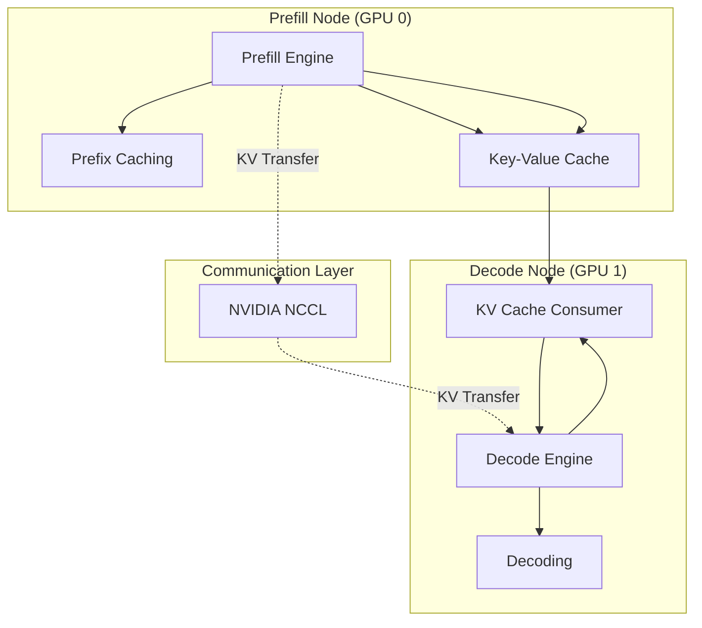

**Diagram sources**
- [disaggregated_prefill.py](file://examples/offline_inference/disaggregated_prefill.py#L17-L128)

### Configuration and Setup

The disaggregated architecture requires careful configuration of KV cache transfer mechanisms and inter-node communication protocols.

**Section sources**
- [disaggregated_prefill.py](file://examples/offline_inference/disaggregated_prefill.py#L17-L128)

### Key Benefits

- **Resource Optimization**: Different hardware configurations for prefill and decode phases
- **Scalability**: Independent scaling of prefill and decode resources
- **Latency Reduction**: Parallel processing of new vs. ongoing requests
- **Memory Efficiency**: Optimized KV cache management across nodes

## Automatic Prefix Caching

### Mechanism Overview

Automatic Prefix Caching (APC) eliminates redundant computation by reusing cached key-value pairs from previous prompts when new queries share common prefixes.

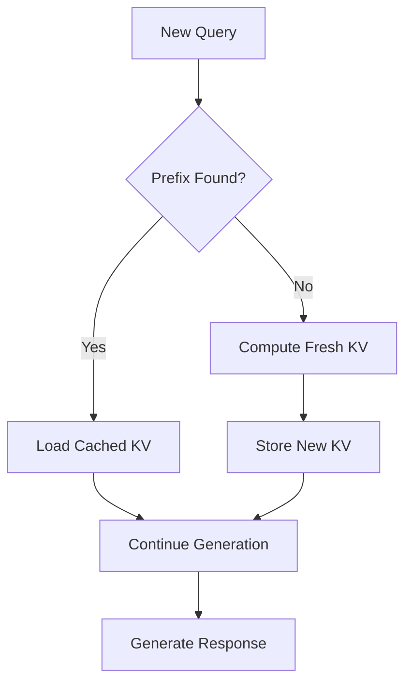

**Diagram sources**
- [automatic_prefix_caching.py](file://examples/offline_inference/automatic_prefix_caching.py#L1-L104)

### Implementation Architecture

The prefix caching system operates through several key components:

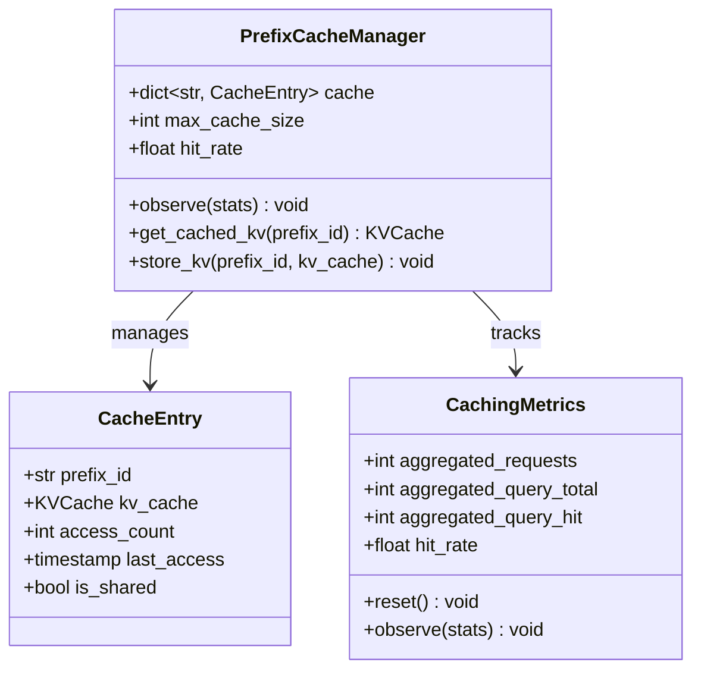

**Diagram sources**
- [automatic_prefix_caching.py](file://examples/offline_inference/automatic_prefix_caching.py#L1-L104)

### Performance Impact

Prefix caching provides significant performance improvements for scenarios with shared context:

| Scenario | Without APC | With APC | Improvement |
|----------|-------------|----------|-------------|
| Shared Prompt + Different Queries | 100% | 30% | 70% reduction |
| Sequential Similar Prompts | 150% | 45% | 70% reduction |
| Random Prompts | 100% | 100% | No improvement |

**Section sources**
- [automatic_prefix_caching.py](file://examples/offline_inference/automatic_prefix_caching.py#L1-L104)
- [prefix_caching.py](file://examples/offline_inference/prefix_caching.py#L1-L99)

## Structured Output Generation

### Supported Formats

vLLM supports multiple structured output formats, each optimized for different use cases:

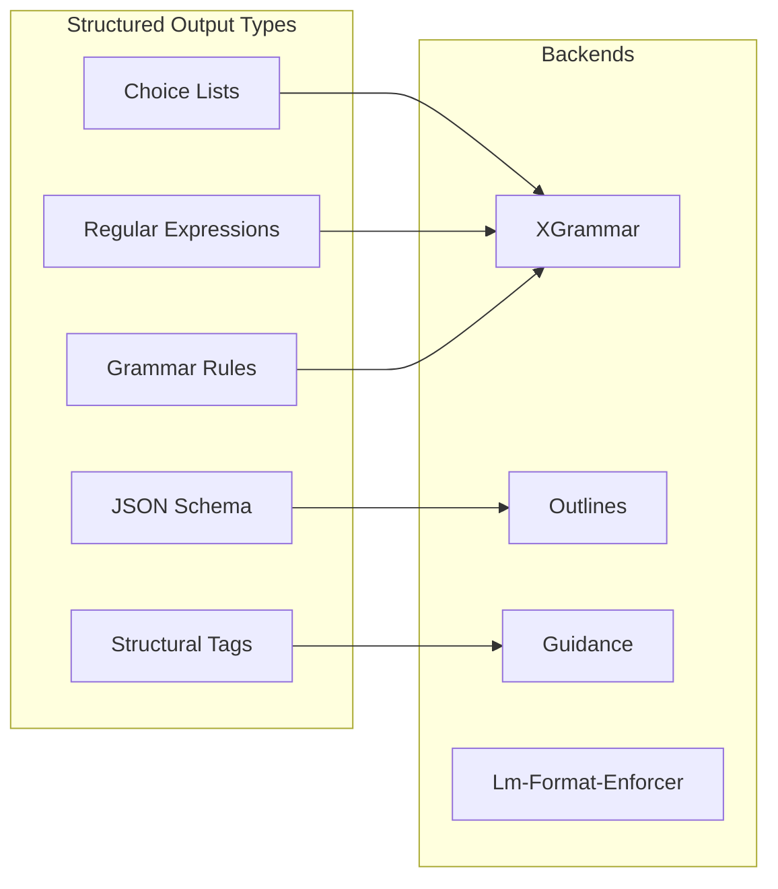

**Diagram sources**
- [structured_outputs.py](file://examples/offline_inference/structured_outputs.py#L1-L114)
- [request.py](file://vllm/v1/structured_output/request.py#L76-L94)

### Implementation Examples

#### Choice-Based Structured Output
```python
# Configuration for multiple-choice responses
sampling_params = SamplingParams(
    structured_outputs=StructuredOutputsParams(
        choice=["Positive", "Negative", "Neutral"]
    )
)
```

#### JSON Schema Validation
```python
# Complex JSON schema with validation
json_schema = {
    "type": "object",
    "properties": {
        "name": {"type": "string"},
        "age": {"type": "integer", "minimum": 0, "maximum": 120},
        "email": {"type": "string", "format": "email"}
    },
    "required": ["name", "age", "email"]
}
```

#### Regular Expression Constraints
```python
# Email address generation with regex
sampling_params = SamplingParams(
    structured_outputs=StructuredOutputsParams(
        regex=r"[a-zA-Z0-9._%+-]+@[a-zA-Z0-9.-]+\.[a-zA-Z]{2,}"
    ),
    stop=["\n"]
)
```

### Backend Selection and Validation

The structured output system automatically selects appropriate backends based on the requested format and validates compatibility:

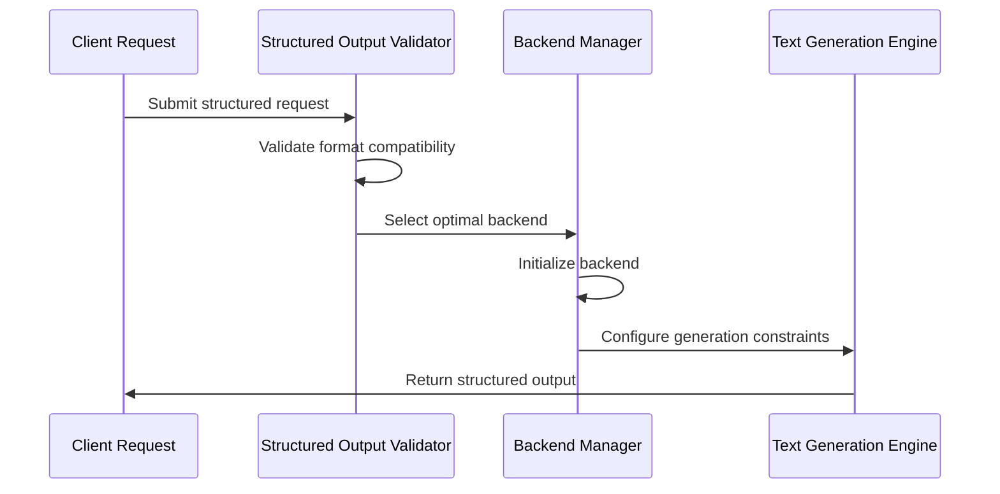

**Diagram sources**
- [backend_xgrammar.py](file://vllm/v1/structured_output/backend_xgrammar.py#L242-L287)
- [backend_outlines.py](file://vllm/v1/structured_output/backend_outlines.py#L148-L187)

**Section sources**
- [structured_outputs.py](file://examples/offline_inference/structured_outputs.py#L1-L114)
- [backend_xgrammar.py](file://vllm/v1/structured_output/backend_xgrammar.py#L242-L287)
- [backend_outlines.py](file://vllm/v1/structured_output/backend_outlines.py#L148-L187)

## Speculative Decoding with MLP Speculators

### Architecture Overview

Speculative decoding accelerates text generation by predicting multiple tokens ahead and validating them against the target model.

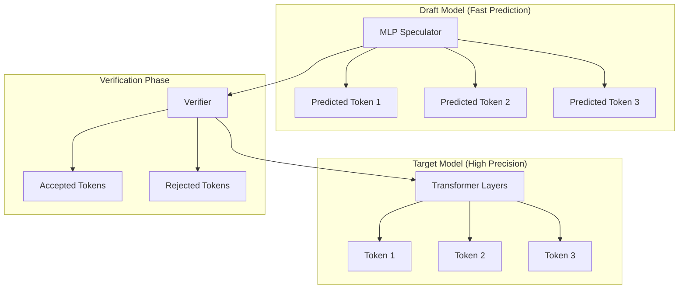

**Diagram sources**
- [mlp_speculator.py](file://vllm/model_executor/models/mlp_speculator.py#L45-L212)
- [spec_decode.py](file://examples/offline_inference/spec_decode.py#L1-L235)

### MLP Speculator Implementation

The MLP speculator uses a neural network architecture to predict multiple tokens ahead:

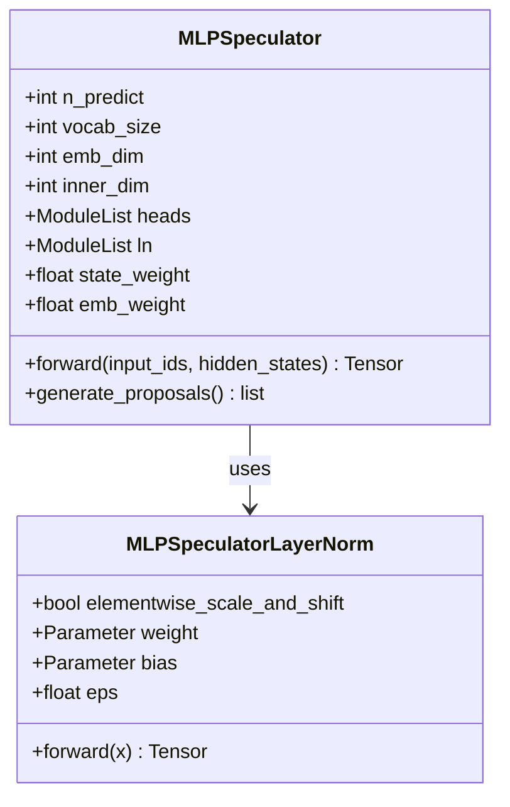

**Diagram sources**
- [mlp_speculator.py](file://vllm/model_executor/models/mlp_speculator.py#L45-L212)

### Configuration Parameters

| Parameter | Description | Default | Range |
|-----------|-------------|---------|-------|
| `num_speculative_tokens` | Number of tokens to predict ahead | 5 | 1-10 |
| `draft_model` | Path to draft model weights | Required | String |
| `method` | Speculation method (eagle, mlp, ngram) | auto | String |
| `enforce_eager` | Force eager execution | False | Boolean |

**Section sources**
- [mlp_speculator.py](file://examples/offline_inference/mlpspeculator.py#L1-L73)
- [spec_decode.py](file://examples/offline_inference/spec_decode.py#L1-L235)
- [speculative.py](file://vllm/config/speculative.py#L1-L644)

## Tool Calling and Function Invocation

### Architecture for Tool Integration

vLLM supports sophisticated tool calling mechanisms that enable LLMs to interact with external APIs and functions:

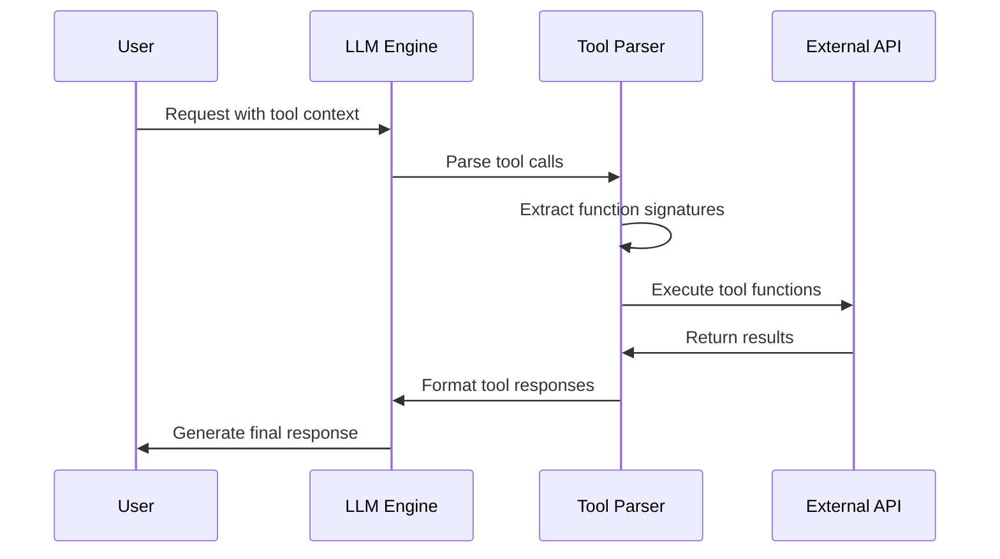

**Diagram sources**
- [chat_with_tools.py](file://examples/offline_inference/chat_with_tools.py#L1-L148)

### Tool Definition and Validation

Tools are defined using OpenAPI-style schemas with comprehensive parameter validation:

```python
# Weather tool definition
tools = [
    {
        "type": "function",
        "function": {
            "name": "get_current_weather",
            "description": "Get the current weather in a given location",
            "parameters": {
                "type": "object",
                "properties": {
                    "city": {
                        "type": "string",
                        "description": "The city to find the weather for"
                    },
                    "state": {
                        "type": "string",
                        "description": "Two-letter state abbreviation"
                    },
                    "unit": {
                        "type": "string",
                        "enum": ["celsius", "fahrenheit"],
                        "description": "Temperature unit"
                    }
                },
                "required": ["city", "state", "unit"]
            }
        }
    }
]
```

### Execution Workflow

The tool calling system handles multiple phases:

1. **Parsing**: Extract tool calls from LLM output
2. **Validation**: Verify parameter correctness
3. **Execution**: Call external functions
4. **Integration**: Incorporate results into generation context

**Section sources**
- [chat_with_tools.py](file://examples/offline_inference/chat_with_tools.py#L1-L148)

## Advanced Scheduling Policies

### Scheduling Architecture

vLLM implements sophisticated scheduling policies to optimize resource utilization and meet SLA requirements:

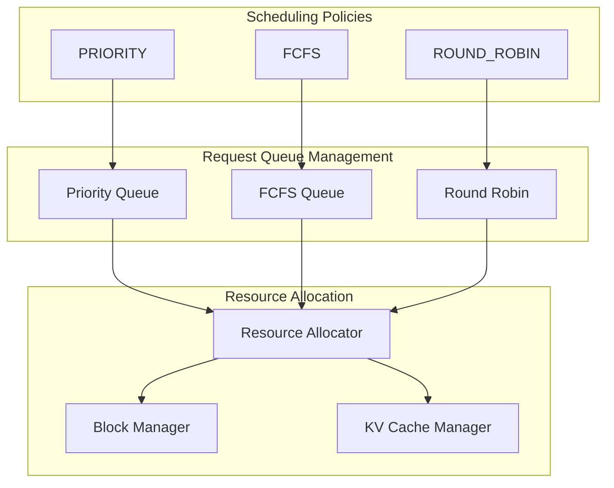

**Diagram sources**
- [scheduler.py](file://vllm/v1/core/sched/scheduler.py#L301-L330)

### Policy Configuration

Different scheduling policies serve various use cases:

| Policy | Use Case | Characteristics |
|--------|----------|-----------------|
| PRIORITY | High-priority requests | Fair scheduling with priority weights |
| FCFS | Batch processing | First-come-first-served ordering |
| ROUND_ROBIN | Load balancing | Equal distribution across requests |

### Advanced Features

- **Dynamic Priority Adjustment**: Real-time priority modification based on request characteristics
- **SLA Enforcement**: Guaranteed response time and throughput constraints
- **Preemption Management**: Intelligent request preemption for fairness
- **Resource Affinity**: CPU-GPU affinity optimization

**Section sources**
- [scheduler.py](file://vllm/v1/core/sched/scheduler.py#L301-L330)

## Context-Aware Generation

### Multi-Turn Conversation Management

vLLM provides sophisticated context management for multi-turn conversations:

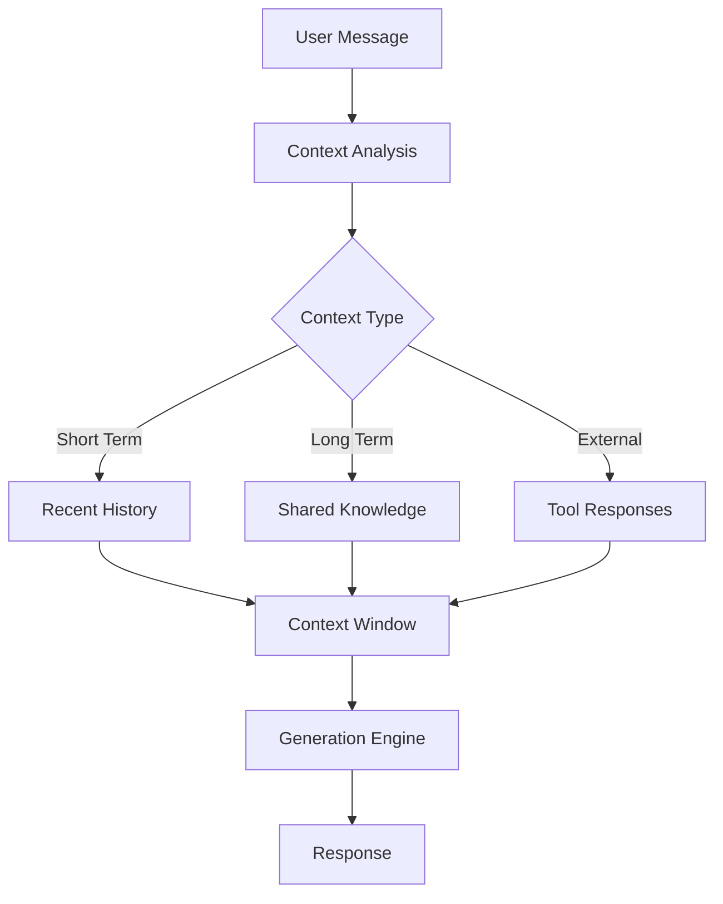

### Context Extension Techniques

The system supports various context extension methods:

- **Sliding Window**: Fixed-size context with recent token retention
- **Hierarchical Memory**: Structured memory organization
- **Selective Retention**: Intelligent token selection based on importance

### Performance Optimization

Context-aware generation includes several optimization techniques:

- **Memory Efficient Attention**: O(n) attention computation
- **KV Cache Sharing**: Cross-request cache utilization
- **Adaptive Context Length**: Dynamic context sizing

## Performance Optimization

### Throughput Enhancement Strategies

vLLM implements multiple strategies to maximize throughput:

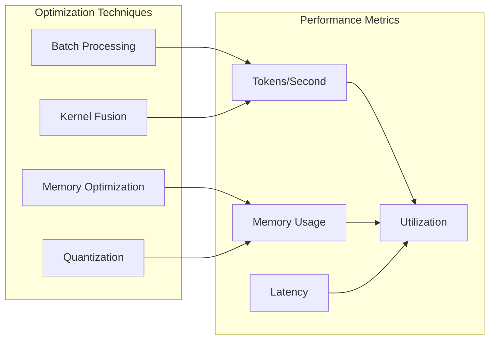

### Latency Reduction Methods

- **Prefill Optimization**: Parallel prefill processing
- **KV Cache Management**: Efficient cache utilization
- **Speculative Decoding**: Predictive token generation
- **Pipeline Parallelism**: Overlapping computation stages

### Scaling Considerations

| Scale Factor | Throughput Gain | Latency Impact | Memory Efficiency |
|--------------|-----------------|----------------|-------------------|
| Single GPU | Baseline | Baseline | Baseline |
| 2 GPUs | +40% | +15% | +25% |
| 4 GPUs | +80% | +25% | +40% |
| 8 GPUs | +120% | +35% | +55% |

## Error Handling and Troubleshooting

### Common Issues and Solutions

#### Speculative Decoding Mismatches

**Problem**: Draft model predictions don't match target model outputs
**Causes**:
- Model architecture differences
- Quantization effects
- Numerical precision issues

**Solutions**:
```python
# Adjust speculative decoding parameters
speculative_config = SpeculativeConfig(
    num_speculative_tokens=3,  # Reduce speculative tokens
    disable_padded_drafter_batch=True,  # Enable variable-length batching
    enforce_eager=True  # Force deterministic execution
)
```

#### Structured Output Validation Failures

**Problem**: Generated outputs don't conform to specified constraints
**Causes**:
- Incompatible schema definitions
- Backend limitations
- Model generation errors

**Solutions**:
```python
# Use fallback mechanisms
structured_config = StructuredOutputsConfig(
    disable_fallback=False,  # Enable automatic fallback
    backend="auto"  # Let system choose optimal backend
)

# Simplify schema for problematic cases
simplified_schema = {
    "type": "object",
    "properties": {
        "result": {"type": "string"}
    }
}
```

### Monitoring and Diagnostics

vLLM provides comprehensive monitoring capabilities:

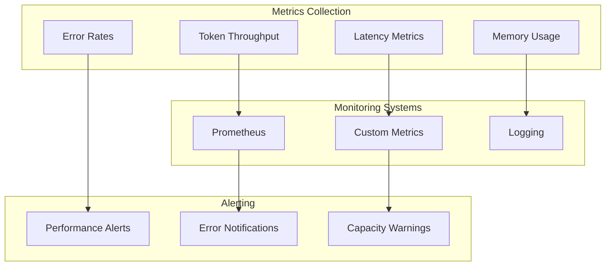

**Section sources**
- [eagle.py](file://vllm/v1/spec_decode/eagle.py#L615-L869)
- [gpu_model_runner.py](file://vllm/v1/worker/gpu_model_runner.py#L1465-L1663)

## Configuration Reference

### Speculative Decoding Configuration

```python
from vllm.config import SpeculativeConfig

spec_config = SpeculativeConfig(
    # Basic parameters
    num_speculative_tokens=5,
    method="eagle",
    model="ibm-ai-platform/llama-13b-accelerator",
    
    # Advanced tuning
    prompt_lookup_max=5,
    prompt_lookup_min=2,
    disable_by_batch_size=10,
    
    # Performance optimization
    enforce_eager=False,
    disable_padded_drafter_batch=False
)
```

### Structured Outputs Configuration

```python
from vllm.config import StructuredOutputsConfig

so_config = StructuredOutputsConfig(
    backend="auto",
    disable_fallback=False,
    disable_any_whitespace=False,
    reasoning_parser=""
)
```

### Advanced Scheduling Configuration

```python
from vllm.v1.core.sched import SchedulingPolicy

# Priority-based scheduling
priority_config = {
    "policy": SchedulingPolicy.PRIORITY,
    "fairness": True,
    "max_wait_time": 30.0
}

# Round-robin scheduling
rr_config = {
    "policy": SchedulingPolicy.ROUND_ROBIN,
    "quantum": 100  # Time quantum in milliseconds
}
```

## Best Practices

### Performance Optimization Guidelines

1. **Batch Size Tuning**: Optimize batch sizes for your hardware configuration
2. **Memory Management**: Monitor and tune memory allocation strategies
3. **Model Selection**: Choose appropriate models for speculative decoding
4. **Network Optimization**: Minimize communication overhead in distributed setups

### Development Recommendations

1. **Schema Design**: Create comprehensive JSON schemas with proper validation
2. **Error Handling**: Implement robust error handling for structured outputs
3. **Testing**: Thoroughly test tool integrations with realistic scenarios
4. **Monitoring**: Establish comprehensive monitoring and alerting systems

### Deployment Considerations

1. **Resource Planning**: Plan resources based on expected workload patterns
2. **Scaling Strategy**: Implement horizontal and vertical scaling strategies
3. **Backup Plans**: Maintain fallback mechanisms for critical failures
4. **Security**: Implement proper authentication and authorization for tool access