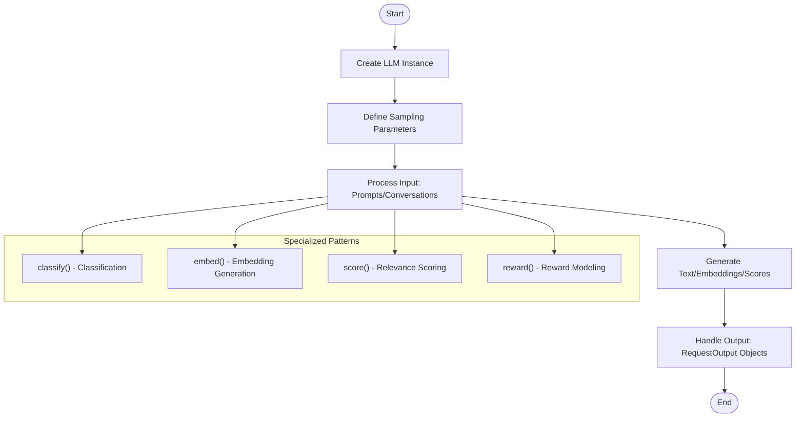
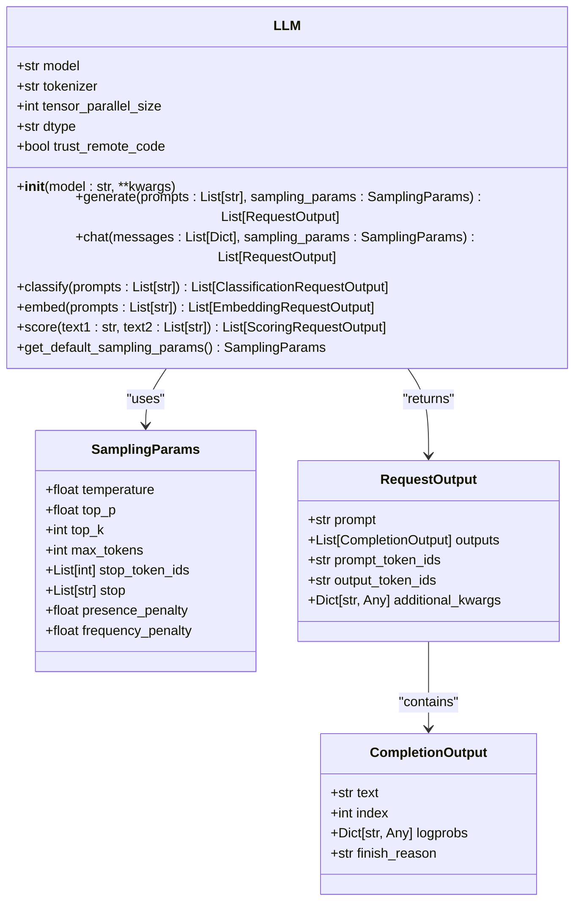
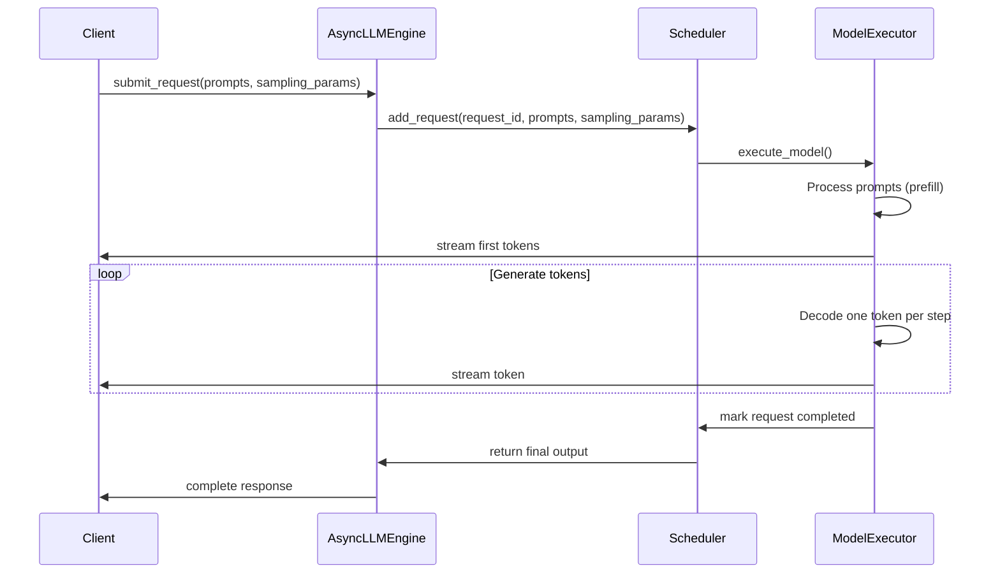
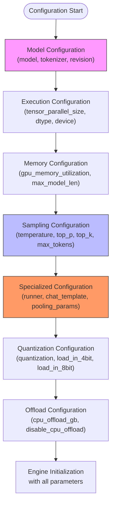
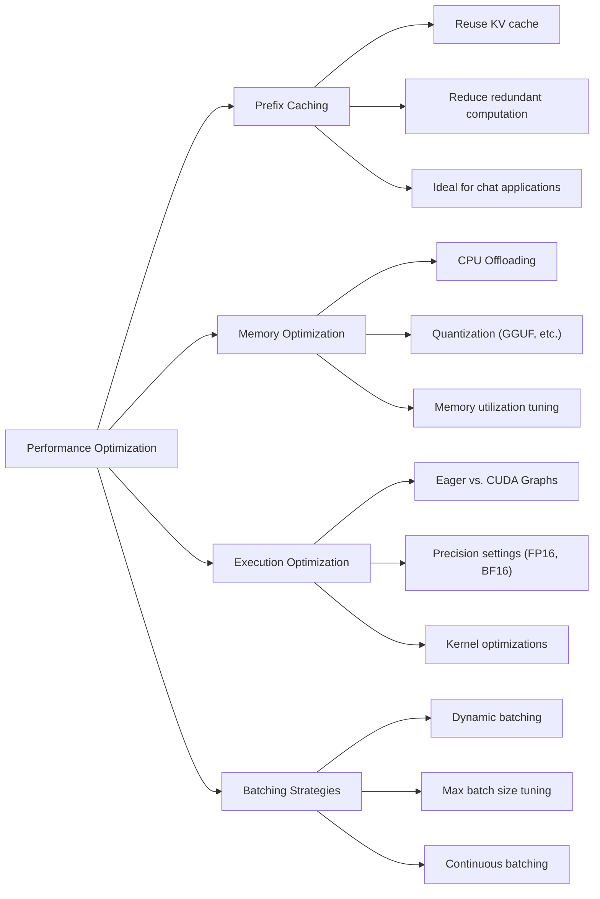
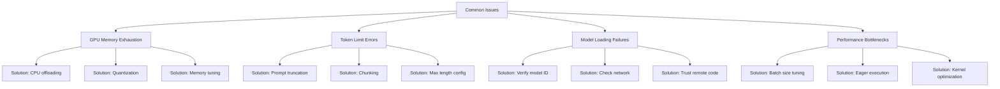

# Basic Inference Examples

<cite>
**Referenced Files in This Document**   
- [basic.py](file://examples/offline_inference/basic/basic.py)
- [generate.py](file://examples/offline_inference/basic/generate.py)
- [chat.py](file://examples/offline_inference/basic/chat.py)
- [classify.py](file://examples/offline_inference/basic/classify.py)
- [embed.py](file://examples/offline_inference/basic/embed.py)
- [score.py](file://examples/offline_inference/basic/score.py)
- [reward.py](file://examples/offline_inference/basic/reward.py)
- [README.md](file://examples/offline_inference/basic/README.md)
- [llm_engine_example.py](file://examples/llm_engine_example.py)
- [async_llm_streaming.py](file://examples/async_llm_streaming.py)
- [prefix_caching.py](file://examples/prefix_caching.py)
- [sampling_params.py](file://vllm/sampling_params.py)
- [engine.py](file://vllm/engine/llm_engine.py)
- [async_llm_engine.py](file://vllm/engine/async_llm_engine.py)
</cite>

## Table of Contents
1. [Introduction](#introduction)
2. [Core Inference Patterns](#core-inference-patterns)
3. [LLM Class Usage](#llm-class-usage)
4. [AsyncLLMEngine Implementation](#asyncllmengine-implementation)
5. [Parameter Configuration](#parameter-configuration)
6. [Usage Patterns](#usage-patterns)
7. [Performance Optimization](#performance-optimization)
8. [Common Issues and Solutions](#common-issues-and-solutions)

## Introduction

The vLLM framework provides a comprehensive suite of basic inference examples that demonstrate core functionality for text generation and model interaction. These examples showcase the primary Python interface through the LLM class for offline inference, enabling direct model interaction without requiring a separate inference server. The examples cover fundamental use cases including text generation, chat completions, classification, embedding generation, and scoring operations.

The basic inference examples are organized in the `examples/offline_inference/basic/` directory and serve as entry points for users new to vLLM. They illustrate how to configure sampling parameters, handle different model types, and implement various inference patterns. The examples also demonstrate advanced features such as quantization support, CPU offloading, and custom generation configurations.

**Section sources**
- [README.md](file://examples/offline_inference/basic/README.md#L1-L81)

## Core Inference Patterns

vLLM's basic inference examples demonstrate several core patterns for interacting with language models. The most fundamental pattern is synchronous text generation using the LLM class, as shown in the basic.py example. This pattern involves creating an LLM instance, defining sampling parameters, and generating text from prompts in a single, straightforward workflow.

The framework also supports more specialized inference patterns through dedicated methods. For classification tasks, the `classify()` method returns probability distributions over classes. For embedding generation, the `embed()` method produces vector representations of input text. For relevance scoring, the `score()` method computes similarity scores between text pairs. Each of these patterns follows a consistent interface while adapting to the specific requirements of the task.

Batch inference is another key pattern demonstrated in the examples. Multiple prompts can be processed simultaneously, with the framework handling the batching and parallelization automatically. This pattern is particularly evident in the chat.py example, which shows how to process multiple conversation histories in a single call.

**Diagram sources**
- [basic.py](file://examples/offline_inference/basic/basic.py#L4-L36)
- [classify.py](file://examples/offline_inference/basic/classify.py#L36-L37)
- [embed.py](file://examples/offline_inference/basic/embed.py#L36-L37)
- [score.py](file://examples/offline_inference/basic/score.py#L35-L36)

**Section sources**
- [basic.py](file://examples/offline_inference/basic/basic.py#L1-L36)
- [classify.py](file://examples/offline_inference/basic/classify.py#L1-L53)
- [embed.py](file://examples/offline_inference/basic/embed.py#L1-L52)
- [score.py](file://examples/offline_inference/basic/score.py#L1-L48)

## LLM Class Usage

The LLM class serves as the primary interface for offline inference in vLLM. It provides a high-level, user-friendly API for interacting with language models without requiring a separate server process. The basic usage pattern involves instantiating the LLM class with a model identifier and then calling generation methods with prompts and sampling parameters.

Key aspects of LLM class usage include model initialization, prompt processing, and output handling. When creating an LLM instance, users specify the model to load, which can be a Hugging Face model identifier or a local path. The class automatically handles model loading, tokenizer initialization, and execution backend setup. For specialized tasks like classification or embedding generation, additional parameters such as `runner="pooling"` must be specified during initialization.

The LLM class supports both simple and advanced usage patterns. The simple pattern, demonstrated in basic.py, uses default sampling parameters and minimal configuration. The advanced pattern, shown in generate.py and chat.py, incorporates command-line argument parsing and allows users to customize sampling parameters such as temperature, top_p, and max_tokens through command-line arguments.

**Diagram sources**
- [basic.py](file://examples/offline_inference/basic/basic.py#L19-L23)
- [generate.py](file://examples/offline_inference/basic/generate.py#L31-L32)
- [sampling_params.py](file://vllm/sampling_params.py#L1-L50)

**Section sources**
- [basic.py](file://examples/offline_inference/basic/basic.py#L1-L36)
- [generate.py](file://examples/offline_inference/basic/generate.py#L1-L66)
- [chat.py](file://examples/offline_inference/basic/chat.py#L1-L97)

## AsyncLLMEngine Implementation

The AsyncLLMEngine provides an asynchronous interface for inference, enabling non-blocking model interactions and efficient handling of multiple concurrent requests. This engine is particularly useful for applications requiring high throughput or integration with asynchronous frameworks. The async_llm_streaming.py example demonstrates how to use this engine for streaming text generation.

The AsyncLLMEngine operates on an event loop, processing requests asynchronously and returning results via callbacks or async generators. This implementation allows for better resource utilization, especially when dealing with variable-length generation or when integrating with web servers and APIs. The engine maintains an internal scheduler that manages the execution of multiple requests, optimizing for both latency and throughput.

Key features of the AsyncLLMEngine include support for streaming outputs, where tokens are yielded as they are generated, and the ability to handle requests with different priorities. The engine also provides fine-grained control over request lifecycle, allowing for request cancellation and status monitoring. This makes it suitable for interactive applications where users may want to stop generation early or monitor progress.

**Diagram sources**
- [async_llm_streaming.py](file://examples/async_llm_streaming.py#L1-L50)
- [async_llm_engine.py](file://vllm/engine/async_llm_engine.py#L1-L100)

**Section sources**
- [async_llm_streaming.py](file://examples/async_llm_streaming.py#L1-L100)
- [async_llm_engine.py](file://vllm/engine/async_llm_engine.py#L1-L200)

## Parameter Configuration

vLLM provides extensive parameter configuration options for controlling text generation behavior. The sampling parameters are central to this configuration, allowing users to adjust the randomness and quality of generated text. Key parameters include temperature, top_p (nucleus sampling), top_k, and max_tokens, which collectively determine how the model selects tokens during generation.

The framework supports both programmatic and command-line configuration of these parameters. In the generate.py and chat.py examples, a FlexibleArgumentParser is used to expose sampling parameters as command-line arguments, enabling users to experiment with different settings without modifying code. The EngineArgs class provides a comprehensive set of configuration options that can be passed to the LLM constructor, including model loading parameters, execution backend settings, and memory management options.

For specialized models, additional configuration is required. Classification, embedding, and scoring models need the `runner="pooling"` parameter to enable the appropriate execution path. Quantized models require specific quantization settings, and models with custom chat templates may need template paths specified. The configuration system is designed to be flexible, allowing users to override defaults while providing sensible defaults for common use cases.

**Diagram sources**
- [generate.py](file://examples/offline_inference/basic/generate.py#L14-L18)
- [chat.py](file://examples/offline_inference/basic/chat.py#L14-L20)
- [classify.py](file://examples/offline_inference/basic/classify.py#L14-L18)
- [EngineArgs](file://vllm/engine/arg_utils.py#L1-L200)

**Section sources**
- [generate.py](file://examples/offline_inference/basic/generate.py#L1-L66)
- [chat.py](file://examples/offline_inference/basic/chat.py#L1-L97)
- [EngineArgs](file://vllm/engine/arg_utils.py#L1-L200)

## Usage Patterns

vLLM's basic examples demonstrate several key usage patterns for different NLP tasks. The text generation pattern, shown in basic.py and generate.py, is the most fundamental, where the model generates continuations of input prompts. This pattern supports both single and batched prompts, with the framework handling batching automatically.

The chat completion pattern, demonstrated in chat.py, shows how to structure conversations with role-based messages (system, user, assistant). This pattern is essential for building chatbots and conversational agents. The example shows both single and batched conversation processing, with support for custom chat templates that can be loaded from files or use model defaults.

Specialized patterns include classification, embedding generation, and scoring. The classification pattern uses models fine-tuned for classification tasks, returning probability distributions over possible classes. The embedding pattern generates fixed-dimensional vector representations of text, useful for semantic search and clustering. The scoring pattern computes relevance scores between text pairs, typically using cross-encoder models for reranking tasks.

```mermaid
graph TD
A[Usage Patterns] --> B[Text Generation]
A --> C[Chat Completions]
A --> D[Classification]
A --> E[Embedding Generation]
A --> F[Scoring/Reranking]
A --> G[Reward Modeling]
B --> B1["generate() method"]
B --> B2["Sampling parameters"]
B --> B3["Batch processing"]
C --> C1["chat() method"]
C --> C2["Role-based messages"]
C --> C3["Custom chat templates"]
C --> C4["Batch conversations"]
D --> D1["classify() method"]
D --> D2["Probability outputs"]
D --> D3["Runner: pooling"]
E --> E1["embed() method"]
E --> E2["Vector outputs"]
E --> E3["Runner: pooling"]
F --> F1["score() method"]
F --> F2["Similarity scores"]
F --> F3["Runner: pooling"]
G --> G1["reward() method"]
G --> G2["Reward scores"]
G --> G3["Runner: pooling"]
```

**Diagram sources**
- [basic.py](file://examples/offline_inference/basic/basic.py#L23-L24)
- [chat.py](file://examples/offline_inference/basic/chat.py#L68-L75)
- [classify.py](file://examples/offline_inference/basic/classify.py#L36-L37)
- [embed.py](file://examples/offline_inference/basic/embed.py#L36-L37)
- [score.py](file://examples/offline_inference/basic/score.py#L35-L36)

**Section sources**
- [basic.py](file://examples/offline_inference/basic/basic.py#L1-L36)
- [chat.py](file://examples/offline_inference/basic/chat.py#L1-L97)
- [classify.py](file://examples/offline_inference/basic/classify.py#L1-L53)
- [embed.py](file://examples/offline_inference/basic/embed.py#L1-L52)
- [score.py](file://examples/offline_inference/basic/score.py#L1-L48)

## Performance Optimization

vLLM incorporates several performance optimization techniques demonstrated in the basic examples. Prefix caching, shown in the prefix_caching.py example, significantly improves efficiency when processing related prompts by reusing previously computed key-value states. This optimization is particularly beneficial for chat applications where conversation history is maintained across turns.

Memory optimization is addressed through features like CPU offloading, where parts of the model are temporarily stored in CPU memory to reduce GPU memory requirements. This allows running larger models on GPUs with limited memory, at the cost of some performance overhead due to CPU-GPU data transfer. The framework also supports various quantization methods, including GGUF quantization, which reduces model size and memory footprint.

The examples demonstrate how to optimize for different performance metrics. For throughput, batching multiple prompts together maximizes GPU utilization. For latency, using appropriate model sizes and disabling unnecessary features (like eager execution) can reduce response times. The engine configuration parameters allow fine-tuning of memory usage, batch sizes, and other factors that impact performance.

**Diagram sources**
- [prefix_caching.py](file://examples/prefix_caching.py#L1-L50)
- [basic.py](file://examples/offline_inference/basic/basic.py#L19-L20)
- [EngineArgs](file://vllm/engine/arg_utils.py#L1-L200)

**Section sources**
- [prefix_caching.py](file://examples/prefix_caching.py#L1-L100)
- [README.md](file://examples/offline_inference/basic/README.md#L72-L80)

## Common Issues and Solutions

Users of vLLM may encounter several common issues, particularly related to resource constraints and configuration. GPU memory exhaustion is a frequent problem when running large models, which can be addressed through CPU offloading or quantization. The examples demonstrate the `--cpu-offload-gb` parameter, which allows specifying the amount of CPU memory to use as virtual GPU memory extension.

Token limit errors occur when input prompts exceed the model's maximum context length. This can be mitigated by preprocessing prompts to ensure they fit within the model's limits or by configuring the engine with an appropriate `max_model_len` parameter. The framework provides clear error messages when token limits are exceeded, helping users diagnose and resolve these issues.

Other common issues include model loading failures, which may result from network problems or incorrect model identifiers, and performance bottlenecks that can be addressed by tuning batch sizes and execution parameters. The examples provide a solid foundation for troubleshooting these issues by demonstrating proper configuration and error handling patterns.

**Diagram sources**
- [README.md](file://examples/offline_inference/basic/README.md#L72-L80)
- [EngineArgs](file://vllm/engine/arg_utils.py#L1-L200)

**Section sources**
- [README.md](file://examples/offline_inference/basic/README.md#L72-L80)
- [EngineArgs](file://vllm/engine/arg_utils.py#L1-L200)