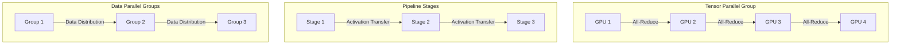
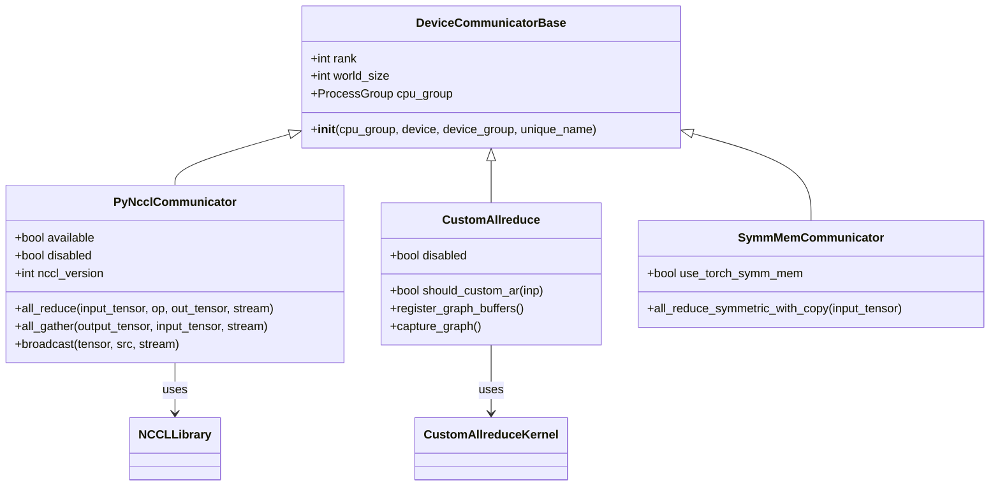

# Distributed Inference Examples

<cite>
**Referenced Files in This Document**   
- [data_parallel.py](file://examples/offline_inference/data_parallel.py)
- [torchrun_example.py](file://examples/offline_inference/torchrun_example.py)
- [torchrun_dp_example.py](file://examples/offline_inference/torchrun_dp_example.py)
- [multi-node-serving.sh](file://examples/online_serving/multi-node-serving.sh)
- [run_cluster.sh](file://examples/online_serving/run_cluster.sh)
- [parallel_state.py](file://vllm/distributed/parallel_state.py)
- [communication_op.py](file://vllm/distributed/communication_op.py)
- [cuda_communicator.py](file://vllm/distributed/device_communicators/cuda_communicator.py)
- [pynccl.py](file://vllm/distributed/device_communicators/pynccl.py)
- [custom_all_reduce.py](file://vllm/distributed/device_communicators/custom_all_reduce.py)
- [parallel.py](file://vllm/config/parallel.py)
- [nccl.py](file://vllm/utils/nccl.py)
</cite>

## Table of Contents
1. [Introduction](#introduction)
2. [Parallelization Strategies](#parallelization-strategies)
3. [Command-Line Configuration](#command-line-configuration)
4. [Programmatic Interfaces](#programmatic-interfaces)
5. [Multi-Node Setup Examples](#multi-node-setup-examples)
6. [Communication Backends and NCCL Settings](#communication-backends-and-nccl-settings)
7. [Distributed State Management](#distributed-state-management)
8. [Common Issues and Debugging](#common-issues-and-debugging)
9. [Performance Considerations](#performance-considerations)
10. [Conclusion](#conclusion)

## Introduction
This document provides comprehensive guidance on implementing distributed inference with vLLM, focusing on its parallelization capabilities. The content covers tensor parallelism, pipeline parallelism, and data parallelism configurations using both command-line tools and programmatic interfaces. It includes concrete examples from torchrun and multi-node setups demonstrating model sharding across multiple GPUs and nodes. The document also addresses configuration options for distributed launch parameters, NCCL settings, and communication backends, along with relationships with the distributed/device_communicators module and parallel_state management.

**Section sources**
- [data_parallel.py](file://examples/offline_inference/data_parallel.py#L1-L263)
- [torchrun_example.py](file://examples/offline_inference/torchrun_example.py#L1-L77)

## Parallelization Strategies

### Tensor Parallelism
Tensor parallelism in vLLM involves splitting model weights and computations across multiple GPUs within a tensor parallel group. This strategy is implemented through the `tensor_parallel_size` parameter, which determines how many GPUs will share the workload of a single model. The implementation leverages custom all-reduce operations and NCCL communication primitives to synchronize gradients and outputs across the tensor parallel group.

The system uses specialized communicators like PyNcclCommunicator for efficient GPU-to-GPU communication, with optimizations for different hardware configurations. When tensor parallelism is enabled, the system automatically creates appropriate process groups and manages the distribution of model parameters across devices.

### Pipeline Parallelism
Pipeline parallelism divides the model into sequential stages, with each stage assigned to different GPU groups. This approach is configured using the `pipeline_parallel_size` parameter. The implementation coordinates the forward and backward passes across pipeline stages, managing the transmission of activations between stages.

The system handles pipeline bubbles through careful scheduling and can combine pipeline parallelism with other parallelization strategies for optimal resource utilization. The communication between pipeline stages is optimized using NCCL and custom communication patterns to minimize latency.

### Data Parallelism
Data parallelism in vLLM distributes different portions of the input data across multiple GPU groups, with each group maintaining a complete copy of the model. This is configured through the `data_parallel_size` parameter. Each data parallel rank processes a subset of the input prompts, enabling scalable inference across large datasets.

The implementation includes sophisticated load balancing mechanisms and supports both intra-node and inter-node data parallelism. The system provides utilities for distributing prompts evenly across ranks and collecting results efficiently.



**Diagram sources **
- [parallel.py](file://vllm/config/parallel.py#L74-L82)
- [parallel_state.py](file://vllm/distributed/parallel_state.py#L897-L1011)

**Section sources**
- [parallel.py](file://vllm/config/parallel.py#L74-L82)
- [parallel_state.py](file://vllm/distributed/parallel_state.py#L897-L1011)

## Command-Line Configuration

### Basic Distributed Launch Parameters
vLLM provides command-line options for configuring distributed inference through various parameters. The core parameters include:

- `--tensor-parallel-size`: Number of GPUs for tensor parallelism
- `--pipeline-parallel-size`: Number of pipeline stages
- `--data-parallel-size`: Number of data parallel groups
- `--distributed-executor-backend`: Backend for distributed execution ("ray" or "mp")

These parameters can be combined to create hybrid parallelization strategies that optimize for specific hardware configurations and workload characteristics.

### Multi-Node Configuration
For multi-node deployments, additional parameters are required to establish network connectivity between nodes:

- `--node-size`: Total number of nodes in the cluster
- `--node-rank`: Rank of the current node
- `--master-addr`: IP address of the master node
- `--master-port`: Port for master node communication

The system uses these parameters to establish the distributed environment and coordinate model execution across multiple machines.

**Section sources**
- [data_parallel.py](file://examples/offline_inference/data_parallel.py#L49-L57)
- [multi-node-serving.sh](file://examples/online_serving/multi-node-serving.sh#L1-L124)

## Programmatic Interfaces

### Torchrun Integration
vLLM supports integration with PyTorch's torchrun utility for distributed training and inference. The `distributed_executor_backend="external_launcher"` configuration enables this integration, allowing vLLM to work within torchrun-managed environments.

The torchrun examples demonstrate how to launch distributed inference jobs using the torchrun command:

```bash
torchrun --nproc-per-node=2 torchrun_example.py
```

This approach leverages torchrun's process management capabilities while utilizing vLLM's optimized inference engine.

### LLM Class Configuration
The primary programmatic interface for distributed inference is through the LLM class, which accepts parallelization parameters directly:

```python
llm = LLM(
    model="meta-llama/Llama-3.1-8B",
    tensor_parallel_size=2,
    pipeline_parallel_size=2,
    distributed_executor_backend="external_launcher",
    max_model_len=32768,
    seed=1,
)
```

This configuration creates a distributed inference engine with the specified parallelization strategy, automatically handling the distribution of model weights and computation across available resources.

**Section sources**
- [torchrun_example.py](file://examples/offline_inference/torchrun_example.py#L32-L39)
- [torchrun_dp_example.py](file://examples/offline_inference/torchrun_dp_example.py#L98-L108)

## Multi-Node Setup Examples

### Ray Cluster Deployment
vLLM provides shell scripts for deploying Ray clusters across multiple nodes. The `run_cluster.sh` script demonstrates how to launch a Ray cluster inside Docker containers:

```bash
# On head node
bash run_cluster.sh vllm/vllm-openai <head_node_ip> --head /abs/path/to/huggingface/cache -e VLLM_HOST_IP=<head_node_ip>

# On worker nodes
bash run_cluster.sh vllm/vllm-openai <head_node_ip> --worker /abs/path/to/huggingface/cache -e VLLM_HOST_IP=<worker_node_ip>
```

This approach uses Docker containers with host networking to ensure proper communication between Ray nodes.

### Manual Node Coordination
The `multi-node-serving.sh` script provides an alternative approach for manual node coordination:

```bash
# On head node
./multi-node-serving.sh leader --ray_port=6379 --ray_cluster_size=<SIZE>

# On worker nodes
./multi-node-serving.sh worker --ray_address=<HEAD_NODE_IP> --ray_port=6379
```

This method gives finer control over the cluster configuration and is useful for environments where Docker is not available.

```mermaid
graph TD
HeadNode[Head Node\n(ray start --head)]
Worker1[Worker Node 1\n(ray start --address)]
Worker2[Worker Node 2\n(ray start --address)]
Worker3[Worker Node 3\n(ray start --address)]
HeadNode --> |Port 6379| Worker1
HeadNode --> |Port 6379| Worker2
HeadNode --> |Port 6379| Worker3
style HeadNode fill:#4CAF50,stroke:#388E3C
style Worker1 fill:#2196F3,stroke:#1976D2
style Worker2 fill:#2196F3,stroke:#1976D2
style Worker3 fill:#2196F3,stroke:#1976D2
```

**Diagram sources **
- [run_cluster.sh](file://examples/online_serving/run_cluster.sh#L76-L84)
- [multi-node-serving.sh](file://examples/online_serving/multi-node-serving.sh#L76-L84)

**Section sources**
- [run_cluster.sh](file://examples/online_serving/run_cluster.sh#L1-L124)
- [multi-node-serving.sh](file://examples/online_serving/multi-node-serving.sh#L1-L120)

## Communication Backends and NCCL Settings

### Device Communicators Architecture
vLLM implements a modular device communicator system that supports different communication backends:

- **PyNcclCommunicator**: For GPU-to-GPU communication using NCCL
- **CudaCommunicator**: For CUDA-specific operations
- **CustomAllreduce**: For optimized all-reduce operations
- **SymmMemCommunicator**: For symmetric memory operations

The system automatically selects the appropriate communicator based on the hardware configuration and parallelization strategy.

### NCCL Configuration and Optimization
The NCCL backend is configured through several mechanisms:

1. **Library Loading**: The system detects and loads the appropriate NCCL library (libnccl.so.2 for CUDA, librccl.so.1 for ROCm)
2. **Environment Variables**: Configuration through VLLM_NCCL_SO_PATH and VLLM_ALLREDUCE_USE_SYMM_MEM
3. **Runtime Detection**: Automatic detection of device capabilities and selection of optimal communication patterns

The implementation includes fallback mechanisms when custom all-reduce libraries are not available, defaulting to standard NCCL operations.



**Diagram sources **
- [pynccl.py](file://vllm/distributed/device_communicators/pynccl.py#L58-L102)
- [custom_all_reduce.py](file://vllm/distributed/device_communicators/custom_all_reduce.py#L74-L136)
- [cuda_communicator.py](file://vllm/distributed/device_communicators/cuda_communicator.py#L24-L38)

**Section sources**
- [pynccl.py](file://vllm/distributed/device_communicators/pynccl.py#L58-L102)
- [custom_all_reduce.py](file://vllm/distributed/device_communicators/custom_all_reduce.py#L74-L136)
- [nccl.py](file://vllm/utils/nccl.py#L17-L35)

## Distributed State Management

### Parallel State Configuration
The `ParallelConfig` class manages the distributed execution configuration, including:

- Pipeline, tensor, and data parallel sizes
- Expert parallelism settings
- All2All backend selection
- Distributed executor backend specification

The configuration is validated during initialization to ensure compatibility between different parallelization strategies and hardware constraints.

### Process Group Management
vLLM creates and manages multiple process groups for different communication purposes:

- **Device Group**: For GPU tensor communication (NCCL backend)
- **CPU Group**: For control message communication (GLOO backend)
- **Tensor Parallel Group**: For tensor parallel operations
- **Pipeline Parallel Group**: For pipeline stage communication
- **Data Parallel Group**: For data parallel operations

The system handles the creation, synchronization, and destruction of these process groups throughout the inference lifecycle.

**Section sources**
- [parallel.py](file://vllm/config/parallel.py#L71-L654)
- [parallel_state.py](file://vllm/distributed/parallel_state.py#L366-L755)

## Common Issues and Debugging

### Network Connectivity Problems
Common network issues include:

- **Address Already in Use**: Resolved by using port auto-discovery and retry mechanisms
- **Connection Refused**: Caused by incorrect master address or firewall settings
- **Timeout Errors**: Addressed through configurable timeout settings and retry logic

The system implements robust error handling and recovery mechanisms, including automatic port selection and connection retry with exponential backoff.

### GPU Synchronization Errors
GPU synchronization issues typically manifest as:

- **Illegal Memory Access**: Caused by mismatched device contexts
- **Stream Synchronization Problems**: Addressed through proper CUDA stream management
- **Deadlocks**: Prevented through careful ordering of collective operations

The implementation includes assertions and validation checks to detect and prevent these issues.

### Load Imbalance
Load imbalance can occur due to:

- Uneven prompt distribution in data parallelism
- Skewed expert routing in MoE models
- Pipeline stage imbalance

The system provides load balancing strategies, including round-robin expert placement and dynamic load balancing for expert parallelism.

**Section sources**
- [parallel.py](file://vllm/config/parallel.py#L355-L381)
- [parallel_state.py](file://vllm/distributed/parallel_state.py#L303-L339)
- [utils.py](file://vllm/utils/nccl.py#L17-L65)

## Performance Considerations

### Inter-Node Communication Overhead
Inter-node communication overhead is minimized through:

- **Efficient Serialization**: Optimized tensor serialization and deserialization
- **Batched Communication**: Combining multiple small messages into larger batches
- **Overlap with Computation**: Overlapping communication with computation where possible

The system uses message queue broadcasters and shared memory for efficient data transfer between nodes.

### GPU Utilization Optimization
Optimal GPU utilization is achieved through:

- **Custom All-Reduce Kernels**: Specialized kernels for common reduction patterns
- **CUDA Graph Integration**: Capturing and replaying computation graphs
- **Memory Management**: Efficient allocation and reuse of GPU memory

The implementation includes support for symmetric memory operations and custom collective operations to maximize throughput.

### Resource Allocation Strategies
The system employs several resource allocation strategies:

- **Dynamic Process Group Creation**: Creating process groups on-demand
- **Memory-Efficient Tensor Distribution**: Minimizing memory footprint during model sharding
- **Adaptive Batch Sizing**: Adjusting batch sizes based on available resources

These strategies ensure efficient utilization of GPU resources across different parallelization configurations.

**Section sources**
- [cuda_communicator.py](file://vllm/distributed/device_communicators/cuda_communicator.py#L36-L69)
- [custom_all_reduce.py](file://vllm/distributed/device_communicators/custom_all_reduce.py#L208-L243)
- [parallel.py](file://vllm/config/parallel.py#L145-L165)

## Conclusion
vLLM provides comprehensive support for distributed inference through multiple parallelization strategies, flexible configuration options, and robust communication backends. The system enables efficient model sharding across multiple GPUs and nodes, with optimizations for both performance and resource utilization. By leveraging tensor parallelism, pipeline parallelism, and data parallelism, vLLM can scale inference workloads to meet demanding performance requirements. The integration with torchrun and support for multi-node deployments make it suitable for large-scale production environments. With proper configuration and optimization, vLLM delivers high-throughput, low-latency inference capabilities for large language models.