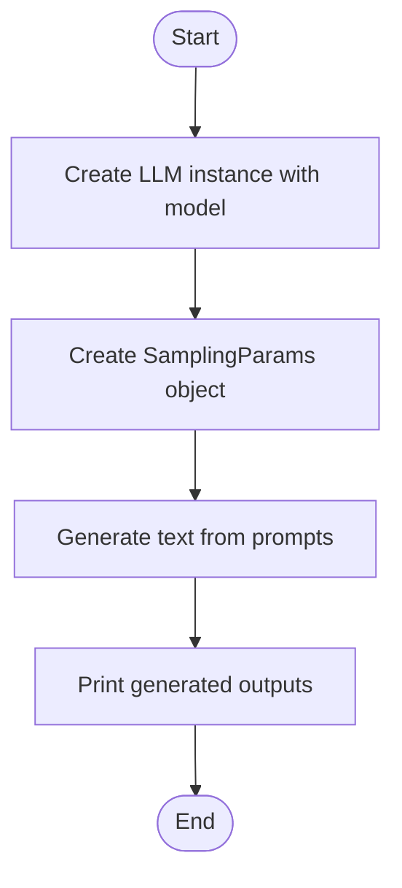
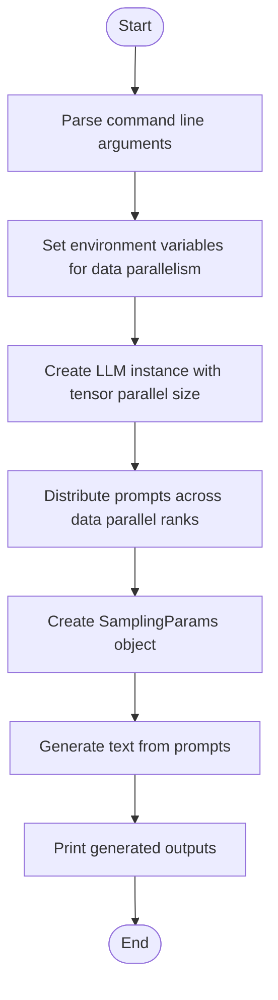
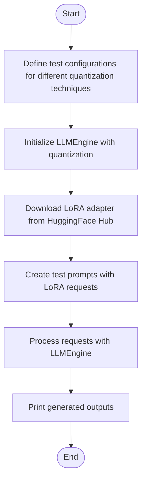
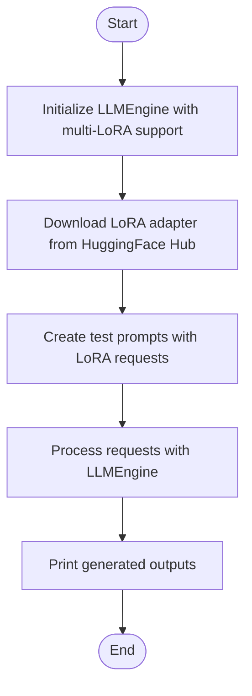
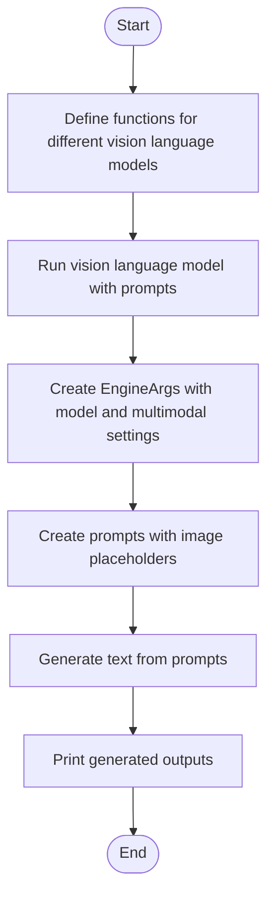
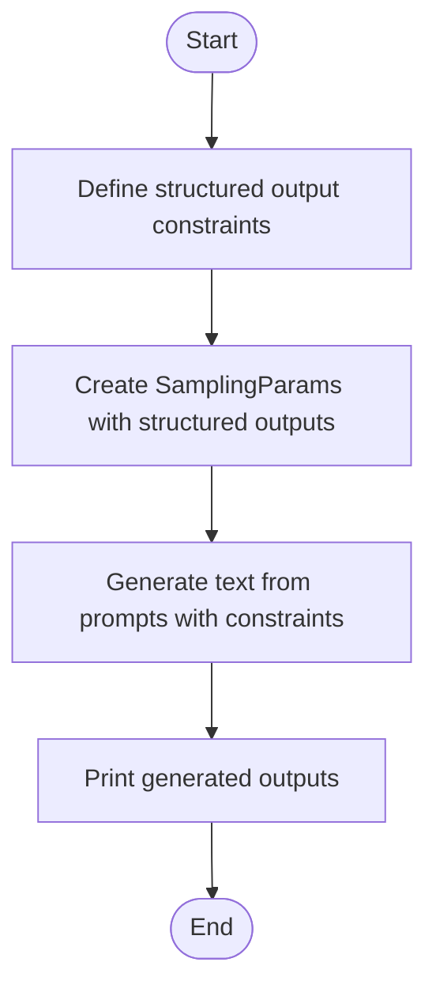
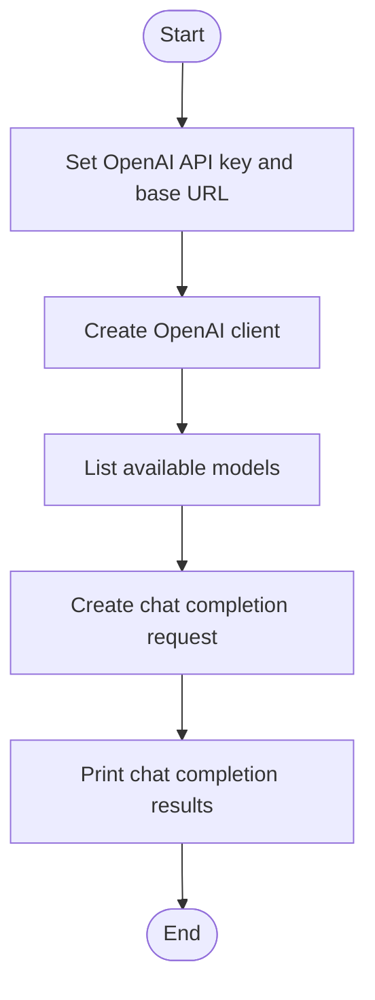
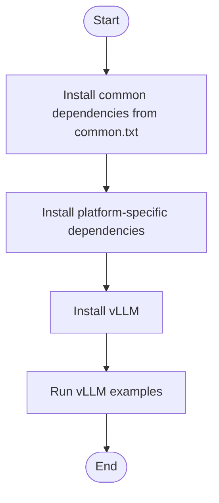

# Examples and Tutorials

<cite>
**Referenced Files in This Document**   
- [basic.py](file://examples/offline_inference/basic/basic.py)
- [data_parallel.py](file://examples/offline_inference/data_parallel.py)
- [lora_with_quantization_inference.py](file://examples/offline_inference/lora_with_quantization_inference.py)
- [multilora_inference.py](file://examples/offline_inference/multilora_inference.py)
- [vision_language.py](file://examples/offline_inference/vision_language.py)
- [structured_outputs.py](file://examples/offline_inference/structured_outputs.py)
- [openai_chat_completion_client.py](file://examples/online_serving/openai_chat_completion_client.py)
- [common.txt](file://requirements/common.txt)
- [cuda.txt](file://requirements/cuda.txt)
</cite>

## Table of Contents
1. [Introduction](#introduction)
2. [Basic Inference Examples](#basic-inference-examples)
3. [Distributed Inference Examples](#distributed-inference-examples)
4. [Quantization Examples](#quantization-examples)
5. [LoRA Examples](#lora-examples)
6. [Multi-Modal Examples](#multi-modal-examples)
7. [Structured Outputs Examples](#structured-outputs-examples)
8. [Online Serving Examples](#online-serving-examples)
9. [Environment Setup and Dependencies](#environment-setup-and-dependencies)
10. [Adapting Examples to Specific Use Cases](#adapting-examples-to-specific-use-cases)

## Introduction

The vLLM examples and tutorials provide ready-to-run code samples that demonstrate various features and configurations for practical usage patterns. These examples are organized into different categories based on their functionality and use cases, making it easier for users to find relevant code samples for their specific needs.

The examples are primarily located in the `examples` directory, which is divided into subdirectories such as `offline_inference`, `online_serving`, `others`, and `pooling`. The `offline_inference` directory contains examples for running inference without a separate model inference server, while the `online_serving` directory contains examples for serving models through an API server.

The purpose of these examples is to provide users with a comprehensive understanding of how to use vLLM for different scenarios, from basic text generation to advanced features like distributed inference, quantization, LoRA, and multi-modal inference. Each example is designed to be self-contained and easy to run, with clear documentation and comments explaining the code.

**Section sources**
- [README.md](file://README.md#L65-L188)

## Basic Inference Examples

The basic inference examples demonstrate simple text generation with different parameters using the `LLM` class, which provides the primary Python interface for offline inference. These examples are located in the `examples/offline_inference/basic` directory and include scripts for basic usage, classification, embedding, scoring, chat, and text generation.

The most basic example, `basic.py`, shows how to use the `LLM` class to generate text from a list of prompts using specified sampling parameters. The example creates an `LLM` instance with a specified model, generates text from the prompts, and prints the outputs.

**Diagram sources**
- [basic.py](file://examples/offline_inference/basic/basic.py#L4-L36)

The basic examples also include scripts that use argument parsers to pass arguments compatible with the `LLM` class, allowing users to experiment with different features such as default generation configuration, quantization, and CPU offload. For example, the `classify.py`, `embed.py`, and `score.py` scripts demonstrate how to use the `LLM` class for different tasks, while the `chat.py` and `generate.py` scripts demonstrate how to use sampling parameters like `max_tokens`, `temperature`, `top_p`, and `top_k`.

**Section sources**
- [basic.py](file://examples/offline_inference/basic/basic.py#L4-L36)
- [README.md](file://examples/offline_inference/basic/README.md#L1-L81)

## Distributed Inference Examples

The distributed inference examples demonstrate how to run inference on multiple GPUs and multiple nodes using data parallelism and tensor parallelism. These examples are located in the `examples/offline_inference` directory and include scripts for data parallel inference and multi-node serving.

The `data_parallel.py` example shows how to use data parallelism to distribute the workload across multiple GPUs and nodes. The example uses the `LLM` class with specified tensor parallel size and data parallel size to create an LLM instance that can run on multiple GPUs. The example also demonstrates how to set up the environment variables for data parallelism, such as `VLLM_DP_RANK`, `VLLM_DP_RANK_LOCAL`, `VLLM_DP_SIZE`, `VLLM_DP_MASTER_IP`, and `VLLM_DP_MASTER_PORT`.

**Diagram sources**
- [data_parallel.py](file://examples/offline_inference/data_parallel.py#L32-L263)

The example also demonstrates how to use multiprocessing to create multiple processes for each data parallel rank, allowing the workload to be distributed across multiple GPUs and nodes. The example includes usage instructions for both single-node and multi-node setups, with specific command-line arguments for each scenario.

**Section sources**
- [data_parallel.py](file://examples/offline_inference/data_parallel.py#L32-L263)

## Quantization Examples

The quantization examples demonstrate how to use different quantized models with vLLM, including GGUF, GPTQ, AWQ, and FP8 quantization. These examples are located in the `examples/offline_inference` directory and include scripts for running inference with quantized models.

The `lora_with_quantization_inference.py` example shows how to use LoRA with different quantization techniques for offline inference. The example demonstrates how to use QLoRA, AWQ, and GPTQ quantization with LoRA, allowing users to experiment with different combinations of quantization and adapter techniques.

**Diagram sources**
- [lora_with_quantization_inference.py](file://examples/offline_inference/lora_with_quantization_inference.py#L10-L136)

The example includes test configurations for QLoRA, AWQ, and GPTQ quantization, with specific models and LoRA repositories for each configuration. The example also demonstrates how to clean up the GPU memory between tests to avoid memory issues.

**Section sources**
- [lora_with_quantization_inference.py](file://examples/offline_inference/lora_with_quantization_inference.py#L10-L136)
- [README.md](file://examples/offline_inference/basic/README.md#L53-L71)

## LoRA Examples

The LoRA examples demonstrate how to use adapter loading and switching with vLLM, allowing users to experiment with different LoRA adapters for different tasks. These examples are located in the `examples/offline_inference` directory and include scripts for running inference with multiple LoRA adapters.

The `multilora_inference.py` example shows how to use the multi-LoRA functionality for offline inference. The example demonstrates how to use multiple LoRA adapters with the same model, allowing users to switch between different adapters for different tasks.

**Diagram sources**
- [multilora_inference.py](file://examples/offline_inference/multilora_inference.py#L10-L119)

The example includes a test configuration with two different LoRA adapters, allowing users to experiment with different adapters for different tasks. The example also demonstrates how to set up the engine arguments for multi-LoRA support, including `max_loras`, `max_lora_rank`, and `max_cpu_loras`.

**Section sources**
- [multilora_inference.py](file://examples/offline_inference/multilora_inference.py#L10-L119)

## Multi-Modal Examples

The multi-modal examples demonstrate how to use image and text inputs with vLLM, allowing users to experiment with vision language models for text generation. These examples are located in the `examples/offline_inference` directory and include scripts for running inference with vision language models.

The `vision_language.py` example shows how to use vLLM for running offline inference with the correct prompt format on vision language models for text generation. The example includes functions for different vision language models, such as Aria, Aya Vision, Bee-8B, BLIP-2, Chameleon, Command-A-Vision, Deepseek-VL2, Deepseek-OCR, Dots-OCR, Ernie4.5-VL, Fuyu, Gemma3, Gemma3N, GLM-4v, GLM-4.1V, GLM-4.5V, GLM-4.5V-FP8, H2OVL-Mississippi, HunyuanOCR, HyperCLOVAX-SEED-Vision, Idefics3-8B-Llama3, Intern-S1, InternVL, and Keye-VL.

**Diagram sources**
- [vision_language.py](file://examples/offline_inference/vision_language.py#L1-L800)

The example demonstrates how to use the correct prompt format for each vision language model, as specified in the corresponding HuggingFace model repository. The example also includes settings for different models, such as `max_model_len`, `max_num_seqs`, and `mm_processor_kwargs`, to ensure optimal performance.

**Section sources**
- [vision_language.py](file://examples/offline_inference/vision_language.py#L1-L800)

## Structured Outputs Examples

The structured outputs examples demonstrate how to use structured outputs with vLLM, allowing users to generate structured and formatted results based on specific prompts. These examples are located in the `examples/offline_inference` directory and include scripts for running inference with structured outputs.

The `structured_outputs.py` example shows how to use structured outputs with vLLM, including choice, regex, JSON schema, and grammar constraints. The example demonstrates how to apply different constraints to produce structured and formatted results based on specific prompts.

**Diagram sources**
- [structured_outputs.py](file://examples/offline_inference/structured_outputs.py#L1-L114)

The example includes four different types of structured outputs: choice, regex, JSON schema, and grammar. The choice constraint allows users to specify a list of possible options, the regex constraint allows users to specify a regular expression pattern, the JSON schema constraint allows users to specify a Pydantic schema, and the grammar constraint allows users to specify a simplified SQL grammar.

**Section sources**
- [structured_outputs.py](file://examples/offline_inference/structured_outputs.py#L1-L114)

## Online Serving Examples

The online serving examples demonstrate how to use vLLM for serving models through an API server, allowing users to interact with the model using the OpenAI API format. These examples are located in the `examples/online_serving` directory and include scripts for running inference with the OpenAI API server.

The `openai_chat_completion_client.py` example shows how to use the OpenAI API client to interact with a vLLM API server. The example demonstrates how to modify the OpenAI API key and API base to use vLLM's API server, and how to send chat completion requests to the server.

**Diagram sources**
- [openai_chat_completion_client.py](file://examples/online_serving/openai_chat_completion_client.py#L1-L65)

The example includes a chat completion request with a system message, a user message, and an assistant message, demonstrating how to use the chat completion API with vLLM. The example also demonstrates how to enable streaming responses, allowing users to receive partial results as they are generated.

**Section sources**
- [openai_chat_completion_client.py](file://examples/online_serving/openai_chat_completion_client.py#L1-L65)

## Environment Setup and Dependencies

The environment setup and dependencies section provides guidance on setting up the required dependencies for running the vLLM examples. The dependencies are specified in the `requirements` directory, which includes files for different platforms and use cases.

The `common.txt` file specifies the common dependencies for all platforms, including `regex`, `cachetools`, `psutil`, `sentencepiece`, `numpy`, `requests`, `tqdm`, `blake3`, `py-cpuinfo`, `transformers`, `tokenizers`, `protobuf`, `fastapi`, `aiohttp`, `openai`, `pydantic`, `prometheus_client`, `pillow`, `prometheus-fastapi-instrumentator`, `tiktoken`, `lm-format-enforcer`, `llguidance`, `outlines_core`, `diskcache`, `lark`, `xgrammar`, `typing_extensions`, `filelock`, `partial-json-parser`, `pyzmq`, `msgspec`, `gguf`, `mistral_common`, `opencv-python-headless`, `pyyaml`, `six`, `setuptools`, `einops`, `compressed-tensors`, `depyf`, `cloudpickle`, `watchfiles`, `python-json-logger`, `scipy`, `ninja`, `pybase64`, `cbor2`, `setproctitle`, `openai-harmony`, `anthropic`, and `model-hosting-container-standards`.

The `cuda.txt` file specifies the dependencies for NVIDIA GPUs, including `numba`, `ray`, `torch`, `torchaudio`, `torchvision`, and `flashinfer-python`. These dependencies are required for running vLLM on NVIDIA GPUs with CUDA support.

**Diagram sources**
- [common.txt](file://requirements/common.txt#L1-L52)
- [cuda.txt](file://requirements/cuda.txt#L1-L14)

The environment setup process involves installing the common dependencies, installing the platform-specific dependencies, and installing vLLM. The examples can then be run using the installed dependencies and vLLM package.

**Section sources**
- [common.txt](file://requirements/common.txt#L1-L52)
- [cuda.txt](file://requirements/cuda.txt#L1-L14)

## Adapting Examples to Specific Use Cases

The examples provided in the vLLM repository can be adapted to specific use cases by modifying the model, prompts, sampling parameters, and other settings. Users can experiment with different models, prompts, and parameters to find the best configuration for their specific use case.

For example, the basic inference examples can be adapted to different tasks by modifying the prompts and sampling parameters. The distributed inference examples can be adapted to different hardware configurations by modifying the tensor parallel size and data parallel size. The quantization examples can be adapted to different quantization techniques by modifying the quantization settings. The LoRA examples can be adapted to different adapter techniques by modifying the LoRA settings. The multi-modal examples can be adapted to different vision language models by modifying the model and prompt format. The structured outputs examples can be adapted to different structured output constraints by modifying the constraints. The online serving examples can be adapted to different API configurations by modifying the API settings.

Users can also extend the examples with additional features, such as custom preprocessing, postprocessing, and evaluation. The examples are designed to be modular and easy to modify, allowing users to experiment with different configurations and features.

**Section sources**
- [basic.py](file://examples/offline_inference/basic/basic.py#L4-L36)
- [data_parallel.py](file://examples/offline_inference/data_parallel.py#L32-L263)
- [lora_with_quantization_inference.py](file://examples/offline_inference/lora_with_quantization_inference.py#L10-L136)
- [multilora_inference.py](file://examples/offline_inference/multilora_inference.py#L10-L119)
- [vision_language.py](file://examples/offline_inference/vision_language.py#L1-L800)
- [structured_outputs.py](file://examples/offline_inference/structured_outputs.py#L1-L114)
- [openai_chat_completion_client.py](file://examples/online_serving/openai_chat_completion_client.py#L1-L65)