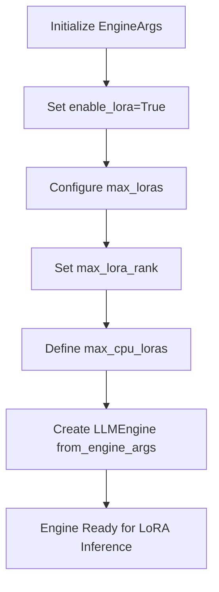
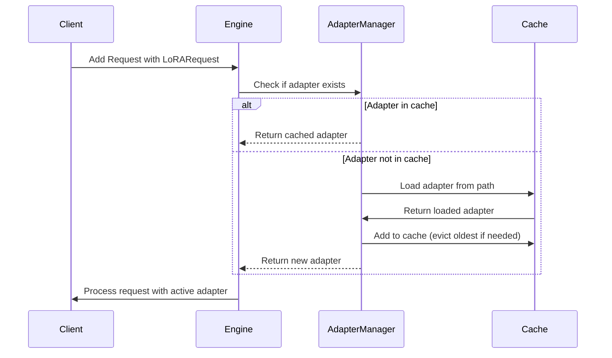
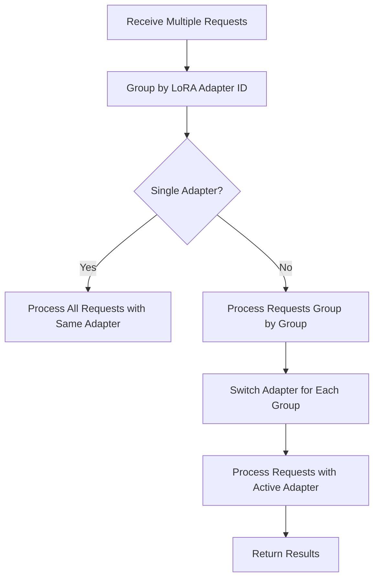
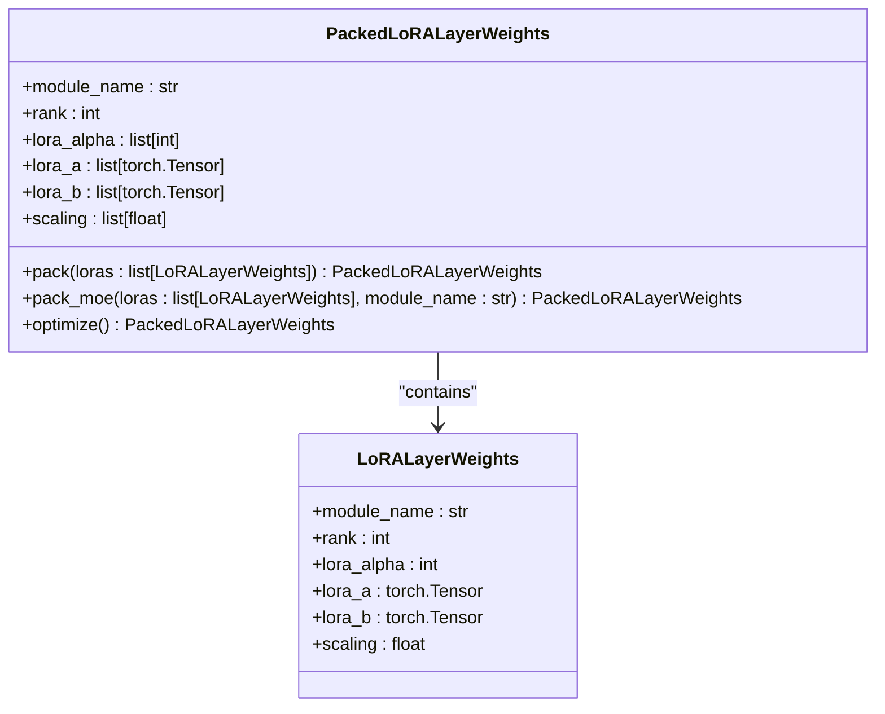
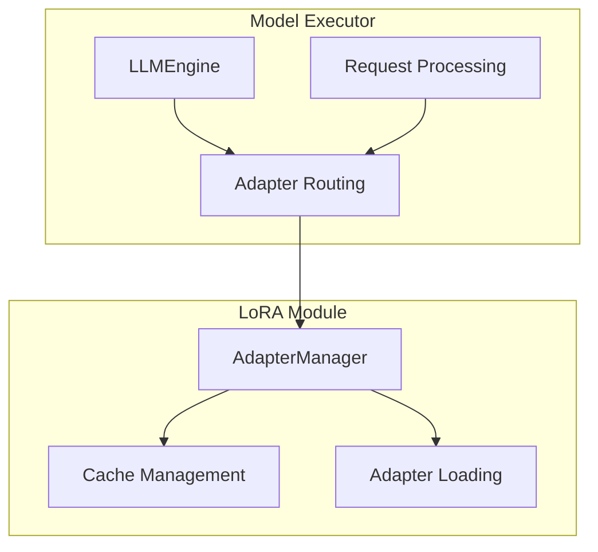
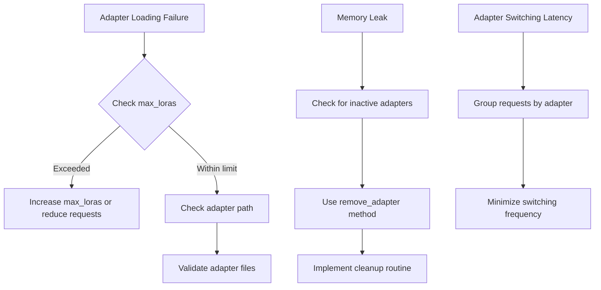
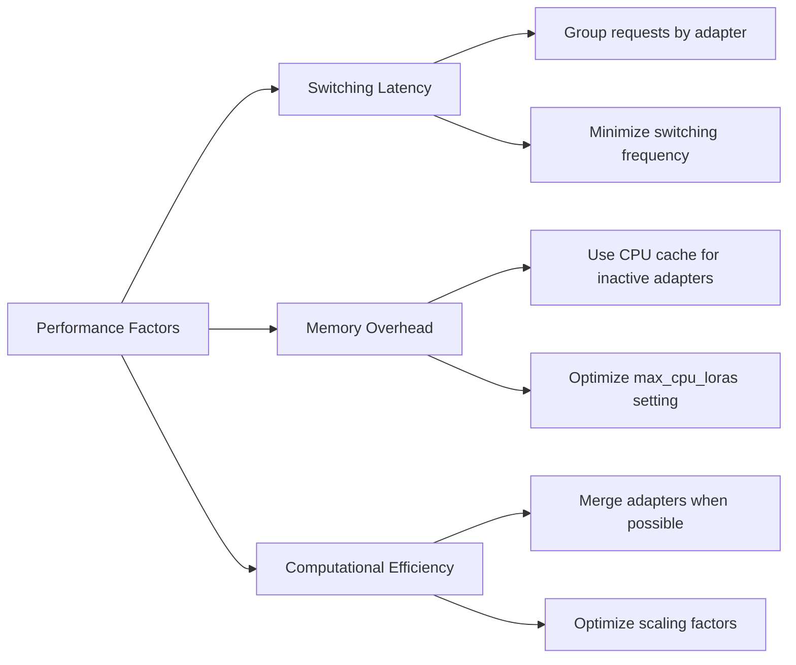

# LoRA Examples

<cite>
**Referenced Files in This Document**   
- [multilora_inference.py](file://examples/offline_inference/multilora_inference.py)
- [lora_with_quantization_inference.py](file://examples/offline_inference/lora_with_quantization_inference.py)
- [lora_weights.py](file://vllm/lora/lora_weights.py)
- [models.py](file://vllm/lora/models.py)
- [worker_manager.py](file://vllm/lora/worker_manager.py)
- [lora.py](file://vllm/config/lora.py)
- [request.py](file://vllm/lora/request.py)
- [utils.py](file://vllm/lora/utils.py)
- [test_lora_manager.py](file://tests/lora/test_lora_manager.py)
- [serving_models.py](file://vllm/entrypoints/openai/serving_models.py)
</cite>

## Table of Contents
1. [Introduction](#introduction)
2. [LoRA Configuration and Initialization](#lora-configuration-and-initialization)
3. [Loading and Managing Multiple LoRA Adapters](#loading-and-managing-multiple-lora-adapters)
4. [Dynamic Adapter Routing and Switching](#dynamic-adapter-routing-and-switching)
5. [Adapter Merging and Memory-Efficient Management](#adapter-merging-and-memory-efficient-management)
6. [LoRA Scaling Factors and Rank Settings](#lora-scaling-factors-and-rank-settings)
7. [Integration with Model Executor and lora/ Module](#integration-with-model-executor-and-lora-module)
8. [Common Issues and Solutions](#common-issues-and-solutions)
9. [Performance Considerations](#performance-considerations)
10. [Conclusion](#conclusion)

## Introduction
This document provides comprehensive documentation for LoRA (Low-Rank Adaptation) examples in vLLM, focusing on the fine-tuning adapter support system. The content covers implementation details of loading, switching, and managing multiple LoRA adapters during inference, with concrete examples demonstrating dynamic adapter routing, adapter merging, and memory-efficient adapter management. The documentation also addresses configuration options for LoRA scaling factors, rank settings, and adapter placement strategies, along with integration with the model executor and common issues such as adapter loading failures and memory leaks.

**Section sources**
- [multilora_inference.py](file://examples/offline_inference/multilora_inference.py#L1-L119)
- [lora_with_quantization_inference.py](file://examples/offline_inference/lora_with_quantization_inference.py#L1-L136)

## LoRA Configuration and Initialization
The LoRA functionality in vLLM is configured through the `LoRAConfig` class, which defines key parameters for adapter management. The configuration includes settings such as `max_lora_rank`, which controls the maximum supported rank of all LoRAs, and `max_loras`, which determines the number of LoRAs that can be used in the same batch. The `max_cpu_loras` parameter controls the size of the CPU LoRA cache, allowing for efficient memory management when dealing with multiple adapters.

The initialization process begins with creating an `EngineArgs` object that enables LoRA functionality and specifies the desired configuration parameters. For example, in the multilora inference example, the engine is initialized with `enable_lora=True`, `max_loras=1`, and `max_lora_rank=8`. This configuration ensures that only one LoRA adapter can be active at a time, with a maximum rank of 8, while allowing up to two adapters to be cached in CPU memory.



**Diagram sources **
- [multilora_inference.py](file://examples/offline_inference/multilora_inference.py#L98-L106)
- [lora.py](file://vllm/config/lora.py#L34-L45)

**Section sources**
- [multilora_inference.py](file://examples/offline_inference/multilora_inference.py#L89-L107)
- [lora.py](file://vllm/config/lora.py#L32-L97)

## Loading and Managing Multiple LoRA Adapters
The loading and management of multiple LoRA adapters in vLLM follows a systematic approach that ensures efficient resource utilization and proper adapter lifecycle management. The process begins with creating a `LoRARequest` object that specifies the adapter name, integer ID, and path to the LoRA weights. This request is then passed to the engine during request processing, allowing for dynamic adapter selection based on the specific inference task.

The adapter management system implements a cache-based approach with LRU (Least Recently Used) eviction policy. When a new adapter is requested, the system first checks if it's already loaded in the cache. If not, it loads the adapter from the specified path and adds it to the cache. If the cache capacity is exceeded, the oldest adapter is evicted to make room for the new one. This mechanism ensures that frequently used adapters remain in memory while less frequently used ones are efficiently managed.



**Diagram sources **
- [worker_manager.py](file://vllm/lora/worker_manager.py#L241-L268)
- [models.py](file://vllm/lora/models.py#L768-L787)

**Section sources**
- [worker_manager.py](file://vllm/lora/worker_manager.py#L228-L268)
- [models.py](file://vllm/lora/models.py#L768-L787)
- [request.py](file://vllm/lora/request.py#L9-L101)

## Dynamic Adapter Routing and Switching
Dynamic adapter routing and switching in vLLM enables the system to efficiently handle multiple LoRA adapters during inference. The routing mechanism is based on the `LoRARequest` object, which contains the adapter ID and path information. When processing requests, the engine uses this information to determine which adapter should be activated for each specific request.

The switching process is optimized to minimize latency and maximize throughput. When multiple requests with different adapters are processed in the same batch, the system groups requests by adapter ID and processes them sequentially. This approach reduces the overhead of adapter switching while maintaining the flexibility to support multiple adapters. The `set_active_adapters` method in the worker manager handles the activation of adapters based on the current request batch, ensuring that the correct adapter is active for each request.



**Diagram sources **
- [worker_manager.py](file://vllm/lora/worker_manager.py#L159-L163)
- [multilora_inference.py](file://examples/offline_inference/multilora_inference.py#L75-L78)

**Section sources**
- [worker_manager.py](file://vllm/lora/worker_manager.py#L159-L163)
- [multilora_inference.py](file://examples/offline_inference/multilora_inference.py#L75-L78)

## Adapter Merging and Memory-Efficient Management
Adapter merging in vLLM is implemented through the `PackedLoRALayerWeights` class, which allows for efficient storage and processing of multiple LoRA adapters. The merging process combines multiple LoRA layers into a single packed representation, reducing memory overhead and improving computational efficiency. This is particularly useful for models with multiple experts or specialized adapters that need to be applied simultaneously.

The memory-efficient management system uses a combination of CPU and GPU caching to optimize resource utilization. The `max_cpu_loras` parameter controls the size of the CPU cache, allowing adapters to be stored in system memory when not actively in use. This approach enables the system to handle more adapters than would be possible with GPU memory alone, while still maintaining fast access to frequently used adapters.



**Diagram sources **
- [lora_weights.py](file://vllm/lora/lora_weights.py#L134-L227)
- [models.py](file://vllm/lora/models.py#L708-L734)

**Section sources**
- [lora_weights.py](file://vllm/lora/lora_weights.py#L134-L227)
- [models.py](file://vllm/lora/models.py#L708-L734)

## LoRA Scaling Factors and Rank Settings
The configuration of LoRA scaling factors and rank settings plays a crucial role in determining the performance and memory characteristics of the adaptation system. The `max_lora_rank` parameter controls the maximum supported rank of all LoRAs, with higher ranks providing more expressive power but requiring more memory. The scaling factor is automatically calculated as `lora_alpha / lora_rank`, and can be optimized by merging the scaling into the `lora_b` weights during the optimization phase.

The rank setting should be chosen based on the specific use case and available resources. Lower ranks (e.g., 8 or 16) are suitable for most fine-tuning tasks and provide a good balance between performance and memory usage. Higher ranks (e.g., 64 or 128) may be necessary for more complex adaptations but come with increased memory requirements. The system automatically validates these settings during initialization to ensure they are within acceptable bounds.

```mermaid
flowchart TD
A[Define max_lora_rank] --> B{Rank Selection}
B --> |Low (8-16)| C[Good for most fine-tuning tasks]
B --> |Medium (32-64)| D[Balance of performance and memory]
B --> |High (128+)| E[Complex adaptations, high memory]
C --> F[Optimize scaling factor]
D --> F
E --> F
F --> G[Merge scaling into lora_b]
G --> H[Efficient inference]
```

**Diagram sources **
- [lora.py](file://vllm/config/lora.py#L34-L35)
- [lora_weights.py](file://vllm/lora/lora_weights.py#L208-L215)

**Section sources**
- [lora.py](file://vllm/config/lora.py#L34-L35)
- [lora_weights.py](file://vllm/lora/lora_weights.py#L208-L215)

## Integration with Model Executor and lora/ Module
The integration between LoRA functionality and the model executor in vLLM is designed to provide seamless support for adapter-based fine-tuning. The `lora/` module serves as the central component for managing all aspects of LoRA adapters, including loading, activation, and deactivation. This module interacts with the model executor through well-defined interfaces that ensure proper coordination between the inference engine and adapter management system.

The integration process begins during model initialization, where the executor checks for LoRA configuration and sets up the necessary components. When a request with a LoRA adapter is received, the executor routes it to the appropriate adapter manager, which handles the activation and deactivation of adapters. The executor also manages the mapping between requests and adapters, ensuring that each request uses the correct adapter during inference.



**Diagram sources **
- [worker_manager.py](file://vllm/lora/worker_manager.py#L134-L154)
- [models.py](file://vllm/lora/models.py#L768-L787)

**Section sources**
- [worker_manager.py](file://vllm/lora/worker_manager.py#L134-L154)
- [models.py](file://vllm/lora/models.py#L768-L787)

## Common Issues and Solutions
Several common issues can arise when working with LoRA adapters in vLLM, including adapter loading failures, memory leaks, and improper adapter lifecycle management. One frequent issue is exceeding the maximum number of GPU LoRA slots, which occurs when the number of requested adapters exceeds the configured `max_loras` value. This can be resolved by either increasing the `max_loras` parameter or implementing proper adapter cleanup.

Memory leaks can occur if adapters are not properly deactivated and removed from memory. The solution is to implement proper resource cleanup by explicitly removing adapters when they are no longer needed. This can be done using the `remove_adapter` method, which deactivates and removes the specified adapter from both GPU and CPU caches.



**Diagram sources **
- [worker_manager.py](file://vllm/lora/worker_manager.py#L232-L237)
- [models.py](file://vllm/lora/models.py#L782-L787)
- [serving_models.py](file://vllm/entrypoints/openai/serving_models.py#L174-L187)

**Section sources**
- [worker_manager.py](file://vllm/lora/worker_manager.py#L232-L237)
- [models.py](file://vllm/lora/models.py#L782-L787)
- [serving_models.py](file://vllm/entrypoints/openai/serving_models.py#L174-L187)

## Performance Considerations
Performance considerations for LoRA adapter management in vLLM include adapter switching latency, memory overhead, and computational efficiency. Adapter switching latency can be minimized by grouping requests with the same adapter together and processing them in batches. This reduces the frequency of adapter switches and improves overall throughput.

Memory overhead is managed through a combination of GPU and CPU caching, with the `max_cpu_loras` parameter controlling the size of the CPU cache. This allows the system to handle more adapters than would be possible with GPU memory alone, while still maintaining fast access to frequently used adapters. Computational efficiency is optimized through adapter merging and scaling factor optimization, which reduce the computational overhead of applying LoRA adapters during inference.



**Diagram sources **
- [lora.py](file://vllm/config/lora.py#L43-L45)
- [lora_weights.py](file://vllm/lora/lora_weights.py#L208-L215)
- [worker_manager.py](file://vllm/lora/worker_manager.py#L232-L237)

**Section sources**
- [lora.py](file://vllm/config/lora.py#L43-L45)
- [lora_weights.py](file://vllm/lora/lora_weights.py#L208-L215)
- [worker_manager.py](file://vllm/lora/worker_manager.py#L232-L237)

## Conclusion
The LoRA examples in vLLM demonstrate a comprehensive and efficient system for fine-tuning adapter support during inference. The implementation provides robust mechanisms for loading, switching, and managing multiple LoRA adapters, with features for dynamic adapter routing, adapter merging, and memory-efficient management. The configuration options for LoRA scaling factors, rank settings, and adapter placement strategies offer flexibility for various use cases, while the integration with the model executor ensures seamless operation.

Common issues such as adapter loading failures and memory leaks can be effectively addressed through proper adapter lifecycle management and resource cleanup. Performance considerations, including adapter switching latency and memory overhead, are mitigated through optimized caching strategies and computational efficiency techniques. Overall, the LoRA system in vLLM provides a powerful and flexible framework for adapter-based fine-tuning, enabling efficient and scalable inference with multiple specialized adapters.

[No sources needed since this section summarizes without analyzing specific files]